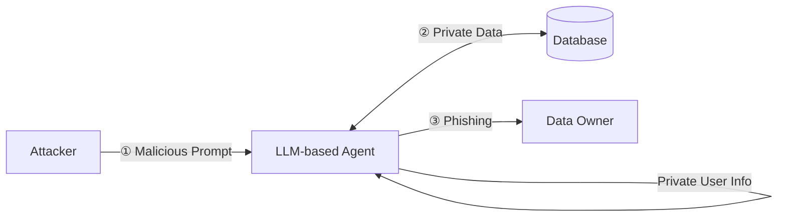

⚙️ Chunk 3 of the paper

## 📌 Table 3 — Mapping of LLM-based Agent Capabilities to Cyberattack Categories

*Legend: ⬤ High ◐ Medium ◯ Low*

| Cyberattack Type | Perception | Memory | Reasoning & Planning | Tool Invocation | Multi-agent Collaboration |
|---|---|---|---|---|---|
| **Threat-Intelligence Gathering** | OSINT extraction, IOC mining, KG building | RAG-assisted CVE recall | Threat correlation and prioritisation | SIEM rule generation, API interfacing | Autonomous agent workflow |
| **Penetration Testing** | Parsing scan/vuln outputs | Tracking enumeration progress | ReAct planning, attack-graph generation | Automated shell/Nmap/Metasploit calls | Role-decomposed collaboration |
| **Vulnerability Detection** | Semantic code/binary parsing | Knowledge-base integration | Cause localisation, patch suggestion | Selective tool orchestration | Cascaded single-agent detector |
| **Malware Generation** | Behaviour-to-code conversion | TTP/code pattern memory | Automated payload synthesis | Emit functional malware scripts/code | Autonomous agent swarms |
| **One-/Zero-day Exploitation** | Extract CVEs, logs, descriptions | Recall exploit modules/chains | CoT/Reflexive reasoning of paths | Dynamic exploit crafting and parameterisation | Shared roles for recon/exfiltration |
| **Phishing & Social Engineering** | Victim profiling from raw text | Contextual memory in dialogue | Psychologically tuned message crafting | Spear-phishing content generation & delivery | Individual agent-driven attack |
| **Honeypot Deployment** | Parse attacker input, emulate system response | Track session history, deception context | Adapt interaction strategy based on behaviour | Run realistic shell commands, mimic services | Multi-agent deception or response collaboration |
| **Capture-the-Flag Challenges** | Problem-statement parsing, flag-pattern recognition | State tracking for multi-step problems | CoT multi-hop reasoning, action planning | Basic decoding/scripting tools | ReAct & Plan single-agent template |

> Tseng et al. chain GPT-4 tools to extract 2,300 validated IOCs, build relationship graphs, and autogenerate SIEM regexes with 97% accuracy, though post-processing is needed to mitigate hallucinations. Clairoux et al. use GPT-3.5-turbo to summarize 700 cybercrime-forum threads and predict CTI variables at 96.2% accuracy, showing LLM versatility on noisy multilingual text.

**📊 Benchmark:** Alam et al. release **CTIBench**, an APT/malware benchmark — GPT-4 leads overall, but models tend to overestimate threats.

---

## 3.1.2 Penetration Testing

LLM-based pentest agents adapt attack strategies dynamically based on discovered vulnerabilities. Early work kept a human "red button" in the loop.

- Goyal et al. benchmark GPT-3.5-Turbo vs GPT-4-Turbo in pentest workflows — cheaper model is faster but loses context in complex attacks.
- Wu et al. (**AutoPT**) frame each step as a Penetration-Testing State Machine, improving task-completion over ReAct, though occasionally mis-generating shell commands.
- Pratama et al. fine-tune **CIPHER** on write-ups for better exploit guidance.
- Al-Qurishi et al. develop **PenTest++**, requiring human oversight.
- Happe et al. first show GPT-3.5 can guide pentesting paired with a vulnerable VM (variable stability).
- Deng et al. develop **PentestGPT** — 228.6% better task completion than GPT-3.5; strong at tool usage/output interpretation, weak on images, strategy selection, knowledge accuracy. Widely adopted after open-sourcing.
- Happe et al. fuse **hackingBuddyGPT** with PentestGPT to compromise an Active Directory lab with no operator input, surpassing orchestrators like MITRE Caldera.
- Nakatani et al. develop **RapidPen** (ReAct-driven) — shell access in 200–400s.
- Huang et al. introduce **PenHealNet**, combining Pentest + Remediation agents to improve on PentestGPT.

### 🤝 Multi-agent Pentest Frameworks

- **PenHeal** — combines testing + remediation; +31% coverage, −46% cost.
- **Breach-Seek** — distributed architecture for autonomous scanning.
- **PENTEST-AI** — integrates MITRE ATT&CK with GPT-4 agents; reporting needs improvement.
- **VulnBot** — organizes recon/scanning/exploitation agents via a penetration-task graph; up to 69% task completion, still struggles with non-text inputs.

**📊 Benchmarks:**
- Gioacchini et al. — **AUTOPENBENCH**, 33 tasks across access-control, web, network, and cryptography.
- Isozaki et al. — open benchmark driven by PentestGPT; LLMs still falter on end-to-end workflows, reinforcing need for human oversight.
- Muzsai et al. — **HackSynth** (planner–summarizer architecture) solves 41/120 PicoCTF tasks with GPT-4o.

### Table 4 — LLM-based Agent Frameworks for Cyberattacks

*Attack types: CTI=Cyber Threat Intelligence, PT=Penetration Testing, VD=Vulnerability Detection, PSE=Phishing & Social Engineering, MG=Malware Generation, VE=Vulnerability Exploitation, HP=Honeypot Deployment, CTF=Capture the Flag*

| Agent | Type | Params | Context | Open | Multi | Reason | Tool Use | Role |
|---|---|---|---|---|---|---|---|---|
| MAD-LLM | CTI | varies | 8k | Partial | No | Advanced | AutoGen debate | Purple |
| LLMCloudHunter | CTI | GPT-4o-V | 8k | No | Yes | Advanced | Vision & rules | Blue |
| VulScribeR | CTI | 175B & 7B | 8k | Partial | No | Basic | RAG augmentation | Purple |
| Crimson | CTI | 70B | 16k | Yes | No | SOTA CoT | CVE to ATT&CK | Blue |
| PentestGPT | PT | backend | 16k | Yes | No | Advanced | Metasploit CLI | Purple |
| RapidPen | PT | GPT-4 | 32k | No | No | SOTA CoT | RAG executor | Red |
| Breachseek | PT | GPT-4 | 128k | Yes | No | Advanced | LangGraph planner | Red |
| Hackphyr | PT | 7–13B | 4k | Yes | No | Advanced | Internal cmds | Red |
| AttackLLM | PT | GPT-4 | 8k | Partial | No | Advanced | Agent actions | Red |
| VulnBot | PT | GPT-4o-mini | 32k | Yes | No | Advanced | Multi-agent | Red |
| AutoPT | PT | GPT-4 | 32k | No | No | SOTA CoT | FSM executor | Red |
| CIPHER | PT | GPT-4 | 8k | Partial | No | Basic | Function calls | Red |
| ARACNE | PT | GPT-4 | 32k | Partial | No | Advanced | SSH tools | Red |
| PenHealNet | PT | mixed | 8k | Partial | No | Advanced | Remediation agents | Purple |
| PenHeal | PT | mixed | 8k | Partial | No | Basic | Remediation chain | Purple |
| LProtector | VD | GPT-4o | 128k | Partial | Yes | SOTA CoT | RAG & CoT | Blue |
| EvilInstructCoder | VD | 7–16B | 4k | Yes | No | Basic | — | Purple |
| WitheredLeaf | VD | mixed | 8k | Partial | No | Advanced | Cascade detector | Blue |
| GRACE | VD | GPT-4 | 8k | Yes | No | Advanced | Graph-aug. prompts | Blue |
| PDBERT | VD | 110M | 512 | Yes | No | Basic | — | Blue |
| PhishAgent | PSE | Otter-MM | 4k | Yes | Yes | Advanced | Vision detector | Blue |
| ConvoSentinel | PSE | GPT-4 | 8k | Partial | No | Advanced | Delegate agents | Blue |
| SE-OmniGuard | PSE | GPT-4 | 8k | Partial | No | Advanced | Persona filter | Blue |
| WormGPT | PSE | 6B | 8k | Partial | No | Basic | — | Red |
| SEAR | PSE | GPT-4o | 128k | Partial | Yes | Advanced | AR interface | Red |
| AppPoet | MG | GPT-4 | 8k | Partial | No | Basic | — | Blue |
| GenTTP | MG | mixed | 8k | Yes | No | Advanced | Agent parsing | Purple |
| RedCodeAgent | MG | GPT-4o-mini | 32k | Yes | No | Advanced | Function calls | Red |
| SEVENLLM | VE | 13B | 8k | Yes | No | Advanced | JSON tools | Blue |
| Net-GPT | VE | hybrid | 4k | Yes | No | Basic | MITM packet gen | Purple |
| RatGPT | VE | ChatGPT | 4k | Partial | No | Basic | Bash shell | Red |
| AdbGPT | VE | GPT-3.5/4 | 8k | Yes | No | Advanced | ADB automation | Purple |
| Vul-RAG | VE | GPT-4 | 32k | Partial | No | Advanced | RAG | Blue |
| CVE-LLM | VE | 7B | 8k | Yes | No | Basic | — | Blue |
| ShelLM | VE | GPT-3.5/4 | 8k | Yes | No | Basic | — | Blue |
| CheatAgent | VE | GPT-3.5/4 | 8k | Partial | No | Advanced | Function calls | Red |
| ChatIoT | VE | 70B | 16k | Yes | No | Advanced | RAG | Purple |
| hackingBuddyGPT | VE | GPT-4 | 8k | Yes | No | Basic | Bug-bounty assist | Red |
| HackerGPT | VE | 13B | 4k | Partial | No | Basic | OSINT tools | Red |
| HoneyLLM | HP | mixed | 128k | No | Yes | Advanced | Function calls | Blue |
| LLMPot | HP | 4B/L2/ByT5 | 8k | Yes | Partial | Advanced | Honeypot sim | Blue |
| HackSynth | CTF | GPT-4 | 8k | Partial | No | Advanced | Plan/summarise | Red |
| EnIGMA | CTF | GPT-4o | 128k | Yes | No | SOTA CoT | GDB/nc tools | Purple |

---

## 3.1.3 Vulnerability Detection

LLM-based agents combine language perception with structured reasoning and selective tool orchestration for automated, high-fidelity triage across codebases and binary artifacts.

- **WitheredLeaf** (Chen et al.) — cascaded detector funneling alerts from lightweight LMs to GPT-4; across 154 Python/C GitHub projects, uncovers 123 previously unknown flaws (45% exploitable). GPT-4 hits 60% success on synthetic EIBs, boosted by CodeBERT and Code Llama.
- **EvilInstructCoder** (Hossen et al.) — poisoning just 0.5% of instruction-tuning data for code LLMs yields 76–86% attack success.
- Akuthota et al. — 77% accuracy from GPT-3.5-Turbo across 2,740 snippets spanning SQLi, XSS, command injection.
- **LProtector** — GPT-4o + RAG + CoT reasoning: 89.68% accuracy, 33.49% F1 on 5,000 balanced Big-Vul samples; limited on plain-text code processing.
- **VulScribeR** — ChatGPT-3.5 + CodeQwen-1.5 dataset augmentation; generates 1,000 vulnerability examples for ~$1.88, F1 improvements up to +30.80%, dependent on prompt optimization.
- **GRACE** — graph-based contextual demonstrations, +28.65% F1 across comparable datasets (limited for C/C++).
- **PDBERT** (Panebianco et al.) — reveals critical model limitations.

---

## 3.1.4 Phishing and Social Engineering

*Fig. 4 — LLM-based agents' cyberattack capabilities of phishing and social engineering.*

LLMs craft convincing phishing emails, chats, and voice scripts using victim-specific language, transforming manual campaigns into instant, personalized attacks at scale.

- Alotaibi et al. — prompt-engineering bypasses safeguards to mass-produce phishing content cheaper than humans; surveys countermeasures and deepfake risks.
- Begou et al. — ChatGPT can deploy complete phishing kits in 10 minutes (token limits noted, specifics withheld).
- Roy et al. — analyze how attackers bypass ChatGPT/Claude/Bard safeguards; propose prompt-level detection.
- Chen et al. — introduce **PEN**, using LLMs to synthesize novel phishing samples.

Subsequent work pivots to testing defense resilience and multimodal countermeasures:

- **ViKing** (Figueiredo et al.) — GPT + voice modules persuade 52% of participants to divulge sensitive data; 71.25% rated replies effective.
- **PhishAgent** (Cao et al.) — 94% detection accuracy, resists brand-obfuscation attacks.
- **fox8** (Yang et al.) — network of 1,140 ChatGPT-assisted Twitter bots that defeat standard detectors.
- Yu et al. — taxonomy of AI-driven social engineering (117 studies reviewed), Markov process to measure penetration efficiency/cost.

**📊 Benchmarks:**
- Ai et al. — **SEConvo** (5,300 dialogues) + ConvoSentinel pipeline: +12% F1 against LLM-generated attacks.
- Kumarage et al. — **SE-VSim** (1,350 persona-based conversations) + SE-OmniGuard: +8–15% detection.

---

## 3.2 Automated Weaponization

### 3.2.1 Malware Generation

*Fig. 5 — LLM-based agents' cyberattack capabilities of malware generation.*

Agents convert behavioral descriptions into attack code, evade detection, and generate malware variants with minimal human input.

- First peer-reviewed study of **WormGPT** — a black-hat LLM built on EleutherAI's GPT-J, trained on malware-related data (no prior academic work found on the subject).
- Charan et al. — malicious LLM use for cyberattack payloads; analyzed 500,000+ real-world malware samples (2022), producing executable code for the top 10 MITRE Techniques. ChatGPT outperforms Bard on coherent, functional code and error resolution.
- **GENTTP** (Zhang et al.) — extracts TTPs from malware; GPT-4 achieves 0.90 coverage, 0.99 sequence accuracy, surpassing other LLMs on behavioral pattern detection.
- Patsakis et al. and Lin et al. — LLM performance on script-level deobfuscation (PowerShell samples from Emotet campaign).
- Beckerich et al. — LLMs as malware proxies; POC shows ChatGPT enabling covert C2 communication via plugin exploitation.
- **AppPoet** (Zhao et al.) — multi-view LLM-based Android malware detector (GPT-4 for generation, text-embedding-ada-002 for embeddings); combines static feature extraction + behavioral analysis via DNN classifier. On 11,189 benign apps (AndroZoo) + 12,128 malware samples (VirusTotal-verified): **97.15% accuracy, 97.21% F1**.

**📊 Benchmarks:**
- Guo et al. — **RedCode**, tests code agent safety across thousands of sandboxed tests; GPT-4 produces more harmful code despite safeguards.
- Guo et al. — **RedCodeAgent**, 72.47% attack success rate, highlighting need for better automated safety testing.

### 3.2.2 Vulnerability Exploitation: One-Day and Zero-Day Attacks

LLM-based agents use semantic analysis, exploit chain construction, and automated tool integration to transform manual exploitation into rapid, adaptive workflows — effective across cloud, web, and mobile environments with reduced expertise requirements.

- Patil et al. — inaugurate the defensive-side discourse, showing LLM-powered anomaly detectors improve zero-day spotting *(continues in next chunk)*.
