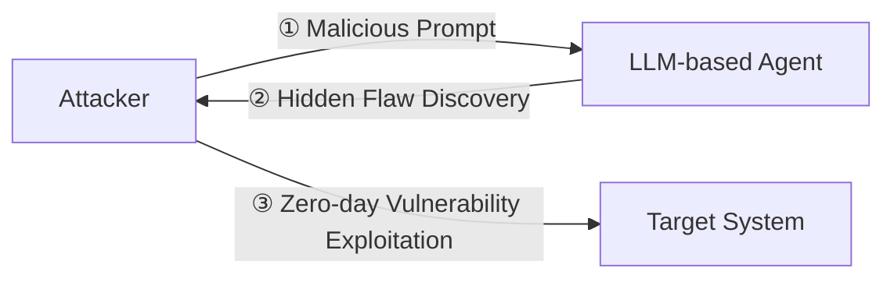

⚙️ Chunk 4 of the paper

### 🖼️ Figure: LLM-based agents' cyberattack capabilities of Zero-day attacks

## One-Day / N-Day Exploit Reproduction

- **Fang et al. [61]** — GPT-4 armed with public CVE descriptions:
  - Reproduces **87%** of one-day exploits
  - Drops to **7%** accuracy without that auxiliary knowledge
  - Exposes both the promise and the limits of current models
- **Feng et al. [64] — AdbGPT** (mobile domain):
  - Reproduces **81.3%** of 88 Android bugs, avg. **253.6s**
  - >**90%** accuracy in step-to-reproduce extraction (prompt engineering + CoT)
- **Ferrag et al. [66]** — critiques pattern dependence of traditional scanners; argues deep-learning pipelines must reconcile formal-verification precision with real-time performance to scale beyond curated datasets

## Vulnerability Detection: From Finetuning to Knowledge Retrieval

- **Shestov et al. [174]** — finetune WizardCoder for Java vulnerability detection
  - Frames task as question-answering
  - Mitigates 20× class skew via curriculum learning, active sampling, focal loss, sample weighting
  - Evaluated on 624 vulnerabilities from 205 OSS projects; surpasses CodeBERT-like baselines on ROC-AUC and F1 (balanced & imbalanced)
  - ⚠️ Sensitive to noisy labels

### 📊 Benchmarks

| Work | Approach | Result | ⚠️ Limitation |
|---|---|---|---|
| Du et al. [57] — Vul-RAG | Knowledge base from 2,174 CVEs; semantic retrieval + GPT-4 reasoning; new **PairVul** benchmark (4,667 function pairs) | +12.96% overall accuracy, +110% pairwise accuracy over prior art | Leakage risks; Linux-kernel focus |
| Ghosh et al. [73] — CVE-LLM | Domain-adaptive pre-training on regulatory notifications + human-in-the-loop, medical-device supply chain | Materially reduces analyst effort over 2-month pilot | Long-sequence handling; spurious text in Llama-2 variants |

## 3.2.3 Honeypot Deployment

> Honeypots are controlled environments that mimic vulnerable systems to study adversarial behavior safely. LLM-based agents generate realistic system responses to attacker inputs, simulating authentic behaviors from Linux shells to industrial protocols.

- **Reti et al. [158]** — 210 prompt templates across GPT-3.5, GPT-4, Llama-2, Gemini on 1.6M leaked ClixSense credentials; crafts honeywords/robots.txt tokens with **56%** indistinguishability rate
- **Fan et al. [60] — HoneyLLM** — Go-based medium-interaction honeypot (GPT-4-Turbo, Claude 3 Opus, Gemini 1.5 Pro back-ends)
  - Successfully executes 21/25 Linux commands
  - Logs network + system-level activity via **ShellEval** metric
  - ⚠️ Open challenges: latency, jailbreak resistance
- **Otal et al. [139]** — fine-tune Llama-3-8B on 617 attacker commands
  - Cosine similarity: 0.695, Jaro-Winkler similarity: 0.599 (vs. ground truth)
  - ⚠️ Fingerprinting vulnerabilities; needs adaptive rate-limiting
- **Sladič et al. [176] — shelLM** (GPT-3.5-turbo-16k) — deceives participants in **90%** of 226 SSH-shell interactions
  - ⚠️ Occasional hallucinations, response lag
- **Vasilatos et al. [187] — LLMPot** — emulates industrial-control protocols (GPT-4, Llama, ByT5)
  - 93% Response-Validity Accuracy, 88% Byte-to-byte Comparison Accuracy
  - ⚠️ Unbounded-length functions remain problematic
- **Volkov et al. [188]** — 3-month public deployment of LLM-augmented SSH honeypot
  - Records **8.13M** interaction attempts
  - Identifies 8 autonomous prompt-injection attacks
  - Median reply time **1.7s** — far faster than humans

### 📊 Table 5 — Benchmarks for LLM-based Cyberattack Agents

**Safety / Red-Teaming**

| Benchmark | Task Focus | Main Advantages | ⚠️ Key Limitations |
|---|---|---|---|
| AgentHarm [22] | Harmful-instruction | Fully automated evaluation | Text-only prompts |
| HarmBench [126] | Unsafe behavior robustness | Per-class breakdowns | Focuses only on single-turn prompts |
| R-Judge [210] | Safety-risk awareness | Multi-step safety scoring | Small scale |

**Knowledge Q&A / Retrieval**

| Benchmark | Task Focus | Main Advantages | ⚠️ Key Limitations |
|---|---|---|---|
| CS-Eval [209] | Cybersecurity Q&A | Separates knowledge vs reasoning | No interaction or action execution |
| SecQA [121] | Multiple-choice queries | Simple and fast diagnostic | Small MCQ set; lacks deep reasoning |
| CmdCaliper [92] | Command safety | Retrieval-based | Synthetic queries |
| PRIMUS [208] | Corpus assessment | Large-scale domain corpus | No downstream task linkage |
| CTIBench [14] | Threat intel from CTI reports | APT/malware alignment tasks | Expensive labeling |

**Pen-Testing / Exploitation**

| Benchmark | Task Focus | Main Advantages | ⚠️ Key Limitations |
|---|---|---|---|
| CyberSecEval 1 [33] | ATT&CK tactics | Safe sandbox testing | No end-to-end chaining |
| CyberSecEval 2 [32] | Prompt injection | Targets specific exploit types | Limited kill-chain scope; static |
| AutoPT-Sim [192] | Simulated networks | FSM planning improves ASR | Shell error rates persist |
| AutoPenBench [74] | Containerized pen-test tasks | Diverse exploit goals | Requires expert setup |
| Breach-Seek [19] | Multi-agent coordination | Demonstrates role-based planning | Evaluation unclear |

**Vulnerability & Code Analysis**

| Benchmark | Task Focus | Main Advantages | ⚠️ Key Limitations |
|---|---|---|---|
| Vul-RAG [57] | Function-level matching | Boosts patch accuracy | Limited to known CVEs |
| PairVul [57] | Code pair vulnerability | Strong pairwise matching | Potential overfitting; dataset-specific |
| RedCodeAgent [79] | Unsafe code generation | 72% attack success | Shell-centric; lacks broader context |

**Social Engineering / Phishing**

| Benchmark | Task Focus | Main Advantages | ⚠️ Key Limitations |
|---|---|---|---|
| PEN [42] | Phishing mail generation | Human realism evaluations | Only text; small scale |
| SE-OmniGuard [110] | Multi-turn SE detection | Persona-aware detection | Early-stage sim; unreleased dataset |

**Honeypot / Shell Evaluation**

| Benchmark | Task Focus | Main Advantages | ⚠️ Key Limitations |
|---|---|---|---|
| ShellEval [60] | Shell realism and deception | Command match rate | Linux-only; limited in size |
| LLMPot [187] | ICS honeypot interaction | Byte-level metrics on protocol | Limited function length |

**Capture-the-Flag (CTF)**

| Benchmark | Task Focus | Main Advantages | ⚠️ Key Limitations |
|---|---|---|---|
| HackSynth [131] | Autonomous CTF solving | Solves 34% of tasks | Lower performance on complex logic |
| InterCode-CTF [200] | Interactive CTF coding tasks | ReAct&Plan boosts solve rate to 95% | Gaps in binary/reversing domains |

## 3.2.4 Capture the Flag (CTF) Challenges

- **Tann et al. [182]** — early evaluation: ChatGPT, Google Bard, Microsoft Bing on 7 CTF exercises + 3 tiers of Cisco-level questions
  - ChatGPT solved **6/7** challenges, **82%** accuracy on knowledge items
  - Confirms pedagogical value but exposes two structural weaknesses
- **Turtayev et al. [185]** — reframes CTF solving as agentic process
  - ReAct&Plan template steers GPT-4o through up to 30 reasoning–action turns
  - Most tasks solved in only 1–2 turns
  - Pushes InterCode-CTF success to **95%**, vs. prior baselines of 29% and 72%

### 📊 Benchmarks

- **Yang et al. [200] — InterCode-CTF**: 100-task PicoCTF-based benchmark
  - GPT-4 solved **40%** of tasks
  - ⚠️ Struggles with complex reverse-engineering and binary-exploitation
  - Similar limitations shown with GPT-3.5, Vicuna-13B, StarChat-16B
- **Abramovich et al. [1] — EnIGMA**: enhances SWE-agent with new tools and demonstrations
  - Outperforms prior benchmarks
  - ⚠️ Faces challenges in web-exploitation and data leakage protection

## 3.3 Lessons Learned for Blue Teams

1. **📌 Frequent Defense Upgrade**
   - Implement regular updates to security controls and threat intelligence feeds
   - Fix exposed ports and misconfigurations
   - Multiple vulnerabilities signal system weakness, especially under automated scanning
   - AI malware shows distinct markers (machine-written code, unusual API calls) useful for tracing origins and assessing threat levels

2. **📌 Active Honeypot Deployment for LLM-based Agents**
   - Deploy LLM-augmented honeypots to engage and monitor attackers at scale
   - Serves as intelligence-gathering tool to update detection signatures and defensive playbooks
   - Requires ongoing realism upkeep (regular updates to conversational models/system responses) to prevent detection/evasion by sophisticated attackers

---

# 4 Cyberattack Capabilities of LLM-based Agents on Static-Infrastructure Networks

> Static-infrastructure networks have fixed topology and node placement, maintaining stable traffic patterns. LLM-based agents automate attacks including 6G, enterprise, data center, SDN, smart grid, and quantum networks — focusing on **"one-shot-break, long-term-stay"** attacks for persistent installation in critical infrastructure.

### 📊 Table 6 — Representative LLM-Enabled Cyberattack Methods on Static-Infrastructure Networks

| Ref. | Agent Architecture | Network Type | Attack Goal | Blue-team Impact |
|---|---|---|---|---|
| [175] | ReAct planner & multi-tool orchestration | 6G Core & RAN | One-shot break, long-term persistence | Defences largely unaffected (legacy rules bypassed) |
| [84] | Role-split multi-agent (scan/exploit/privilege) | Enterprise Networks | Privilege escalation and lateral movement | Existing identity/segmentation measures can be bypassed |
| [147] | Log RAG & anomaly reasoning loops | Data Center Networks | Zero-day detection or abuse of control plane APIs | Alert fatigue decreased; detection improved |
| [180] | Tokenized flow-based classification with BERT | Software Defined Networking | Flow rule manipulation, stealth DDoS | Signature-based IDSs evaded; new attack paths open |
| [93, 211] | Prompt completion & ICS payload synthesis | Smart Grid | False-data injection, phishing, system spoofing | Real-time model outputs bypass legacy sensors |
| [9] | Code generation & classical/quantum planning | Quantum Networks | Side-channel attacks on QKD, device layer threats | Control-plane defenses need upgrade |

## 4.1 6G Core and Radio Access Networks

- **Mani et al. [125]** — state-of-the-art LLMs translate natural-language directives into valid router, firewall, and orchestration code; same routines could inject flows or deactivate security rules → **dual-use capability**
- **Nguyen et al. [135]** — enumerate 6G-specific attack surfaces; argue LLM autonomy enables real-time, cross-domain exploit generation
- **Singer et al. [175] — Incalmo abstraction framework**: compromised **9/10** multi-host mobile-core testbeds (25–50 hosts each) by chaining reconnaissance, signaling-protocol exploits, and lateral movement
- **Andreoni et al. [21] & Yigit et al. [206]** — generative AI's "cost-collapse" lowers the barrier to sophisticated attacks while overwhelming legacy detection
- **Rondanini et al. [162]** — LLM-centric malware-detection architecture for resource-constrained edge nodes; best GPT variant achieves **97%** detection accuracy without exporting raw traffic centrally
- **Zhang et al. [213]** — in-context learning matches fine-tuning in wireless-network IDSs; GPT-4 reaches **95%** accuracy across DDoS classes
- **Legashev et al. [114]** — hybrid LLM-LSTM system for wireless backbones; Gemma-7B achieves **0.89 F1** in malicious classification, 3% error from poisoning

## 4.2 Enterprise Networks

- Valuable assets (public-facing servers, critical internal services) are frequent targets of distributed reconnaissance scans, lateral movement, privilege escalation, and DDoS [124]
- Attackers typically exploit exposed services, misconfigured devices (internal DNS/NTP servers), unmanaged mobile devices
- **[84]** — investigates autonomous penetration testing in enterprise Active Directory environments
  - Novel prototype evaluated with two OpenAI models in a realistic simulation environment
  - Demonstrates LLMs can conduct Assumed Breach simulations: identifying access points, executing lateral movement
- 📌 Blue teams should adopt a **zero-trust mindset**

## 4.3 Data Center Networks

- Data center networks rely heavily on APIs and orchestration; LLM-based agents could exploit control plane APIs given credentials or misconfigurations
- **Patil et al. [147]** — LLM system continuously analyzes cloud infrastructure logs/telemetry for zero-day attack patterns
  - Demonstrates superior detection vs. conventional rule-based approaches across multiple historical breach scenarios
- 📌 Blue teams should enforce least privilege on API keys, rotate frequently, monitor API usage patterns

## 4.4 Software-Defined Networking (SDN)

- SDN controller is a high-value target; LLM-based agents might launch sophisticated DDoS or traffic-manipulation attacks that standard threshold-based systems can't catch [7]
- **AlEroud et al. [16]** — inference-based intrusion detection for SDN controllers
- LLM-based agents could reverse-engineer defenses to reprogram flow tables, enabling evasion and link-flooding attacks
- **Specht et al. [178]** — SDN architectures can mitigate industrial malware via network path reconfiguration; reveals malicious LLMs could exploit southbound API interfaces for worm propagation
- **[180]** — BERT-base-uncased transforms network flows into natural language for attack detection in SDN
  - Uses InSDN dataset (normal + attack flows)
  - Detects DDoS, DOS, Probe, U2R, BFA, Web attacks via BERT tokenization + Random Forest Classification
  - **99.96%** accuracy, **0.9995** precision and recall (known and unseen attacks)
- 📌 Defending SDN requires understanding LLM capabilities in reasoning, evasion, flow manipulation, and network telemetry perception — traditional detection risks obsolescence

## 4.5 Smart Grids

- Smart grids face potential multi-vector, AI-orchestrated attacks; LLM-based agents might attempt false data injection to mislead grid control systems [117, 138]
- Simulation platforms **GridAttackSim [112]** and **GridAttackAnalyzer [113]** enable modeling/evaluation of these scenarios
- LLM-based agents accelerate attack-graph generation for testbeds — from hours to seconds
- **Kurt et al. [111]** — reinforcement learning-based detection system, exemplifying evolving adversarial complexity
- **Zaboli et al. [211]** — documents ChatGPT's capability to generate convincing sector-specific phishing campaigns and craft targeted Modbus/TCP attack payloads
- **Ibrahim et al. [93]** — examination of large model applications in grid cyber-physical systems; highlights prompt-injection risks targeting control room assistant systems
- **Li et al. [116]** — systematic analysis of LLM-based risks across power generation, transmission infrastructure, and distributed energy resource orchestration
- **Zhang et al. [217]** — reveals vulnerabilities where LLM-generated code can compromise anomaly detection in IoT-enabled electrical substations
- 📌 Defense: monitor/limit LLM capabilities in tool orchestration, prompt interpretation, code generation, adversarial reasoning; use model alignment, sandboxed execution, anomaly detection

## 4.6 Quantum Networks

- Quantum communications may be theoretically secure in transmission, but supporting classical infrastructure remains vulnerable to LLM-based agents
- By combining pattern-completion, code-generation, and planning skills, LLMs can:
  1. Automate discovery of implementation-side channels in QKD devices
  2. Craft novel attack graphs blending classical and quantum layers
  3. Orchestrate large-scale post-quantum reconnaissance at machine speed
- **Ajimon and Kumar** — first systematic blueprint coupling an LLM with quantum-protocol libraries *(section continues in next chunk)*
