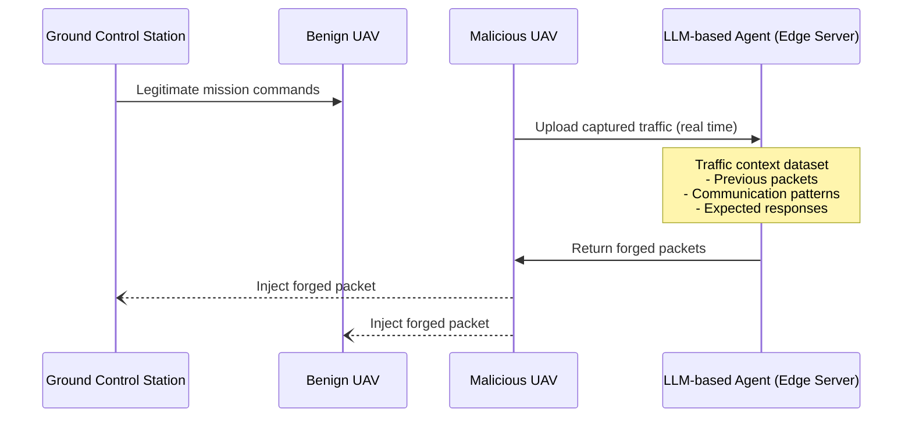

⚙️ Chunk 5 of the paper

### 🖼️ Figure: LLM-agent MITM attack on UAV command-and-control

A malicious UAV joins the same network as a benign UAV and its Ground Control Station (GCS). An edge server hosting fine-tuned LLM agents receives captured traffic, maintains a traffic-context dataset (previous packets, communication patterns, expected responses), and returns forged packets for the malicious UAV to inject.

---

## 5. Cyberattack Capabilities of LLM-based Agents on Mobile Infrastructure Networks

Representative scenarios are categorized by underlying network architecture, mobility pattern, and security challenge.

> 📌 **Key mechanism:** In mobile infrastructure networks, LLM-based agents succeed by continually re-planning in response to wireless volatility and connectivity changes. Through tool-chaining, an agent processes telemetry, GNSS, spectrum, and LiDAR data to compose protocol-aware payloads that adjust channels in real time — enabling GNSS spoofing, MitM, and DDoS attacks, and reducing time-to-impact from hours to milliseconds.

Six mobile infrastructure network categories are surveyed (see Table 7 below).

### Table 7. Representative LLM-based cyber-attack methods in mobile-infrastructure networks

| Ref. | Agent Framework / Example | Network Type | Primary Attack Vector |
|---|---|---|---|
| [6, 54, 55, 67, 169] | AttackLLM multi-agent pentester; LLMPot industrial honeypot; ChatIoT on-device assistant | Constrained edge / IIoT gateways | Automated scanning, firmware takeover, process hijack |
| [5, 85] | PLLM-CS telemetry analyser; LEO-SDN LLM-aided routing monitor | LEO constellation & ground segment | Telemetry spoofing, routing manipulation |
| [3, 12, 129] | Generative-replay IDS; compact-Transformer router monitor | Dynamic MANET / VANET clusters | Sybil node injection, route disruption |
| [30, 156, 168, 179, 186] | GenAI CAN-log anomaly detector; HackerGPT for automated exploitation; fine-tuned GPTs for CAN fuzzing; polymorphic malware generators bypassing rule-based gateways | 6G-V2X links; in-vehicle CAN buses; ADAS sensors (LiDAR, GPS) | CAN message fuzzing to disable controls; sensor spoofing (fake GPS/LiDAR to trigger emergency braking); SYN flood attacks |
| [106, 151, 166] | Net-GPT MITM for forged C2; Bayesian/LSTM hybrid IDS | UAV C2 links | Command hijack, GPS spoof, jamming |
| [2, 20, 99] | GPT-augmented anomaly IDS; ChatGPT-based toolkits | Acoustic & optical UWNs | Adaptive DoS floods, topology inference |

> Future risk: proof-of-concept exploits (e.g., photon-number-splitting or detector-blinding scripts) already exist against BB84 and decoy-state quantum key distribution systems. As quantum networks mature, quantum repeaters, entanglement distribution systems, and quantum routers may become targets.

### 5.1 Internet of Things

- IoT devices are often constrained; LLM-based agents can seek weak links — unpatched firmware, default credentials — to take over devices in the IoT supply chain.
- LLMs integrated with RAG pipelines effectively process heterogeneous telemetry and derive threat indicators autonomously, reducing reconnaissance costs for attackers.
- **AttackLLM**: LLM-based multi-agent system for industrial attacks, outperforming human experts in water-treatment plant testing.
- A distilled model fine-tuned on CVE descriptions achieves state-of-the-art F1 scores identifying buffer-overflow and injection vulnerabilities in embedded firmware.
- **LLMPOT** (defensive): an LLM-controlled honeypot implementing industrial protocols and simulating physical processes to attract autonomous adversaries and identify their LLM signatures.
- **ChatIoT**: transforms open-weight models into on-device security assistants for scanning, patch generation, and real-time alert triage.
- **BARTPREDICT**: combines a BART-based predictor with time-series embeddings to anticipate zero-day exploits 24 hours in advance across IIoT power grids.
- A framework combining LLMs with LSTM networks for IoT cybersecurity.
- Adversarial attacks against Llama-2-7b via prompt injection and gradient-guided search achieve **76% ASR** (attack success rate), bypassing alignment measures.

> ⚠️ These developments show a dual-use trajectory: the same generative capabilities that enhance system protection simultaneously enable exploitation.

### 5.2 Satellite Networks

- LLM-based agents could spoof or manipulate unencrypted parts of satellite communications.
- **PLLM-CS**: a domain-specific LLM analyzing satellite telemetry to identify kinetic-level anomalies in Low-Earth-Orbit (LEO) constellations.
- Integrating an LLM with a software-defined network (SDN) controller enables preemptive detection of zero-day routing attacks in LEO mega-constellations, achieving a **42% reduction in mean detection time**.

> ⚠️ While positioned as defensive tools, these same capabilities reveal potential for adapting to satellite-borne intrusions.

### 5.3 Mobile Ad-Hoc Networks (MANETs)

- No fixed infrastructure → common threats are **Sybil attacks** and rogue nodes; LLM-based agents can rapidly create/control multiple nodes to disrupt routing or eavesdrop.
- A compact transformer for routing-anomaly classification in vehicular MANETs shows LLM embeddings outperform traditional features in high-mobility scenarios.
- Generative replay techniques maintain lightweight LLM detection accuracy despite concept drift, advancing continual adversarial adaptation.
- A generative AI-enhanced IDS combining an LLM planner with reinforcement learning achieves **97% neutralization** of multi-vector attacks while also generating adversarial traffic for network stress testing.

> 📌 Indicates significant potential for autonomous red-teaming.

### 5.4 Vehicular Networks

Combines critical latency requirements with extensive, heterogeneous attack surfaces — vulnerable to SYN flood DDoS and spoofing.

- GenAI-driven detection analyzing vehicular CAN traffic and edge-compute logs achieves **4.3 percentage points higher recall** than CNN baselines in identifying SYN-flood and GPS-spoofing attacks.
- LLM-crafted sensor-spoofing payloads compromise LiDAR-based ADAS with **82% success** in triggering emergency braking within a 6G-V2X testbed.
- Prompt-injected LLMs generate polymorphic malware at rates exceeding rule-based gateway blacklisting capabilities.
- Fine-tuned GPT agents pose risks in automated CAN fuzzing (in-vehicle IDS analysis).
- Deep-learning attacks show effectiveness against autonomous-vehicle perception systems.
- **HackerGPT**: a customized model generating exploitation scripts targeting vehicle systems, developed as part of automotive cybersecurity research.

### 5.5 UAV Networks

UAV networks face cyber *and* kinetic risks through LLM-driven man-in-the-middle attacks (see Figure above).

**Attack flow:**
1. A malicious UAV inserts itself between a ground-control station (GCS) and a benign UAV to capture TCP packets.
2. An edge server stores traffic and uses LLM agents to predict legitimate packet fields.
3. The edge server returns forged packet templates to the malicious UAV.
4. The malicious UAV injects forged packets toward the GCS or benign UAV, optionally suppressing real packets.
5. Repeating this capture-predict-inject loop lets the attacker impersonate either party, modify commands, and exfiltrate data — without disrupting the appearance of normal communication.

Common UAV network attacks: GPS spoofing, C2 hijacking, jamming of communication links, sensor data manipulation.

- Routing misbehavior addressed via Bayesian learning.
- AI-automated spoofing, hijacking, and jamming tactics have been systematically surveyed.
- LLM-based agents significantly amplify these threats by autonomously generating attack scripts.
- Recent work demonstrates LLM capabilities in generating precise flight-control modification scripts.

### 5.6 Underwater Networks

- Bandwidth/latency constraints once thought protective are actually exploitable — susceptible to DoS, spoofing, jamming, and routing attacks.
- LLM-based agents can autonomously exploit these via adaptive DoS floods and automated topology inference.
- An SVM-RNN architecture augmented with GPT-generated features achieves **96.4% accuracy** in challenging channel conditions, identifying DoS vulnerabilities tied to propagation delays and authentication weaknesses.
- ChatGPT applications demonstrated in security toolkit development.
- Work addressing dataset limitations advocates generative-model applications in cryptographic testing.

### Table 8. Representative LLM-based agent cyberattacks on infrastructure-free networks

| Ref. | Agent Architecture | Network Type | Attack Goal | Blue-team Impact |
|---|---|---|---|---|
| [50, 100, 183] | Multi-agent CoT & ReAct planner | Social Networks | Disrupt decision-making via misinformation flooding | Trust scoring, identity verification, and anomaly detection required |
| [119, 152, 181] | Prompt-driven traffic shaping with adaptive evasion | Content Delivery Networks | Saturate edge caches and degrade cache-hit ratio | Real-time provenance validation and adaptive rate-limiting needed |
| [17, 101, 199] | Code-aware retrieval & static analysis loops | Blockchain | Inject malicious smart contracts and poison consensus models | Fine-grained auditing, anomaly scoring, and peer reputation |
| [26, 109, 220] | KG memory & reflexive telemetry generation | Digital Twin | Inject deceptive sensor data and modify PLC state safely | Requires runtime certification and reasoning-path explainability |
| [34, 82, 205] | Multimodal RAG & ReInteract dialogue engine | Immersive XR/VR | Personalized social engineering through affect-aware overlays | Adaptive behavior detection and multimodal trust feedback needed |
| [50, 100, 146, 191] | Swarm RL with self-reflective memory | Agent Networks | Spread prompt-level misinformation and reduce task success | Memory isolation, prompt sanitization, and agent provenance tracking |

### 5.7 Lessons Learned for Blue Teams (Mobile Infrastructure)

1. **Use AI to Counter AI Threats** — Deploy LLM-based monitoring to detect/respond to attacks from LLM-based agents; especially important in complex environments like 6G networks where defensive LLMs can catch subtle malicious patterns humans might miss.
2. **Implement Zero Trust Architecture** — Where LLM-based agents automate reconnaissance and lateral movement, adopt zero-trust: continuously verify all users/actions, enforce strict network segmentation, never assume internal traffic is trustworthy.
3. **Edge-native Security** — For IoT, push security controls to edge devices (gateways, MEC servers); implement anomaly detection for LLM-based cyberattack agents at network entry points to catch coordinated attacks.
4. **Multi-Layer Defense Strategy** — Combine radio monitoring, packet inspection, and host-based protection (e.g., in MANETs) to catch evolving attack tactics; segregate critical systems with rigorous inter-layer security checks (e.g., in vehicular networks).

---

## 6. Cyberattack Capabilities of LLM-based Agents on Infrastructure-free Networks

Table 8 (above) outlines representative LLM-agent attack strategies across infrastructure-free networks: architectures, network targets, attack goals, and blue-team implications.

### 6.1 Social Networks

- LLM-based agents can create and manage fake personas at scale, flooding platforms with propaganda, phishing, or manipulative content.
- **CheatAgent**: by impersonating recommender-system users, an LLM can steer ranking outcomes and exfiltrate private preference data without tripping anomaly detectors.
- Earlier social-network honeypot work demonstrated large-scale automated creation/curation of fake identities to lure threat actors.
- Combined with generative text models, such bots now produce spear-phishing content statistically indistinguishable from human prose.
- Defense may include analyzing behavior over time for human-like inconsistencies and using graph analysis to spot botnets.

### 6.2 Content-Delivery Networks (CDNs)

CDNs and information-centric overlays are vulnerable to:
- Cache saturation (Partition DoS)
- Cache-miss amplification
- Content poisoning
- Forwarding loop creation

**Findings:**
- LLM-based agents coordinating many low-rate clients can bypass traditional volumetric DoS thresholds and still saturate edge caches (partition DoS).
- Intelligent request shaping maximizes cache-miss penalties, pushing excessive origin traffic.
- Availability-assessment models predict a mere **3–5% decrease in cache-hit ratio** can trigger SLA violations network-wide.

> 🛡️ **Defenses:** serving stale content to suspected nodes, CAPTCHA challenges, temporary isolation of suspect requests, content verification where possible.

### 6.3 Blockchain Networks

- LLMs can rapidly identify and exploit smart-contract vulnerabilities.
- An autonomous agent locates re-entrancy and integer-overflow patterns, then patches malicious logic stubs into otherwise legitimate Solidity code — producing "smart-contract malware" with nearly zero human effort.
- A complementary survey catalogues GPT-powered phishing kits fabricating token-airdrop sites and wallet-connect dialogs en masse.
- Collaborative-learning approaches for blockchain anomaly detection can themselves be poisoned via subtle gradient perturbations introduced by a malicious LLM peer, causing selective blindness to the attacker's transactions.

> 📌 Defending against these threats requires not just traditional vulnerability patching but a deep understanding of agents' capabilities in reasoning, tool orchestration, and stealthy adaptation.

### 6.4 Digital Twin Networks

- Digital twins rely on accurate mirroring of physical systems; LLM-based cyberattack agents can inject deceptive telemetry or alter twin state to mislead operators.
- Injecting deceptive telemetry via an LLM-based agent can mislead predictive-maintenance models, triggering premature or unsafe actuator commands.
- High-fidelity industrial twins are equally vulnerable: a compromised twin-resident agent manipulated PLC set-points while maintaining plausible sensor traces.
- Aviation studies confirm prompt-level attacks on twin-embedded copilots bypass traditional air-gap assumptions.
- Proposed defense: an intelligent framework deploying counter-agent honeypots and trust scoring — though runtime certification of LLM reasoning paths is still needed.

### 6.5 Immersive Networks (AR/VR/XR)

- AR/VR platforms present new attack vectors: malicious 3D content, overlay attacks.
- LLM-based agents amplify these risks by autonomously generating dynamic, personalized attacks.
- Early work maps XR-specific threats; recent work shows LLM-driven avatars dynamically adapting dialogue tone and visual cues to victims' affective states.
- Detection of camera spoofing demonstrated in Mixed Reality — but fails against sophisticated, AI-generated overlays.

*(Section continues in next chunk.)*
