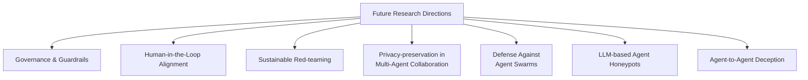

⚙️ Chunk 6 of the paper

## 6.6 Autonomous Agent Networks

Attacks in autonomous agent networks include:

- Knowledge poisoning
- Prompt injection
- Backdoored system prompts
- Adaptive jailbreaks
- Misinformation flooding

LLM agents execute attacks by crafting malicious prompts, corrupting memory, and amplifying errors through collaboration.

> 📌 **Key Point:** Agent-native networks are simultaneously attacker and defender domains, requiring formal verification and memory isolation.

### Notable Work

- **Debar et al.** — outline threats when nodes can explain, plan, and act.
- **Tete et al.** — provide a taxonomy for agent applications, focusing on backdoored prompts.
- **Ju et al.** — show misinformation can flood multi-agent communities within minutes, **reducing task success by 42%**.
- **Pasquini et al.** — reveal benign prompt-injection can defend against LLM hacking.
- **Wang et al.** — use reinforcement learning for adaptive jailbreaks.

Countering these threats requires hardening reasoning integrity, controlling memory updates, and ensuring prompt sanitization.

---

## 6.7 Lessons Learned for Blue Teams

1. **Trust and Reputation Mechanisms**
   In infrastructure-free environments, LLM-based agents can create fake identities to conduct Sybil attacks and manipulate consensus. Blue teams must implement trust mechanisms like cryptographic attestations and behavioral scoring to ensure network accountability.

2. **Resilience Through Redundancy and Decentralized Recovery**
   LLM-based agents can target weak points in peer-to-peer networks to disrupt communication. Blue teams should design networks with redundancy in routing, storage, and decisions, and incorporate decentralized recovery protocols to maintain function under compromise.

---

## 7. Future Research Directions

1. **Governance/Guardrails for LLM-based Agents**
   Unlike traditional tools, these agents can reason and escalate attacks independently. Agent architectures must embed safety constraints; research should implement ethical enforcement, compliance checking, and intervention mechanisms. Standardized audit frameworks would ensure transparency and accountability, with international policies regulating agents while preserving innovation.

2. **Human-in-the-Loop Alignment for LLM-based Cyberattack Agents**
   As agents acquire increasing autonomy, integrating human oversight becomes a fundamental challenge. Systems should ensure human review at critical decision points during high-risk operations, balancing autonomy and intervention via dynamic human-in-the-loop systems and RLHF. Agents should seek human guidance when encountering ethical ambiguities.

3. **Sustainable Red-teaming**
   Red-teaming uses simulated adversaries to test vulnerabilities while accounting for environmental impact. Techniques like scenario sampling, model distillation, and RL-based exploration can improve resource efficiency, enhancing both AI safety and environmental responsibility.

4. **Privacy-preservation during Multi-Agent Collaboration**
   Federated learning enables collaborative improvement without centralized data collection. Future research should explore protocols for agents to share threat insights while protecting organizational data — key challenges include secure aggregation, poisoning resistance, and non-IID data robustness.

5. **Defense Against LLM-based Agent Swarms**
   As single-agent threats evolve into coordinated multi-agent attacks, defenses must prepare for intelligent agent swarms executing synchronized cyber operations. Needed: distributed anomaly detection, decentralized defense architectures, deception-based countermeasures, and defensive swarms of autonomous security agents.

6. **LLM-based Agent Honeypots**
   LLM-based agents unlock new possibilities for intelligent, adaptive honeypots — engaging attackers in realistic dialogues, simulating system behaviors dynamically, and capturing detailed telemetry of attack tactics, shifting cyber defense from reactive to proactive intelligence-gathering.

7. **Agent-to-Agent Deception**
   Cyber conflict now includes autonomous adversarial agents. Defensive strategies could deploy decoys and misinformation to mislead attacker agents, while also defending against malicious agents manipulating defensive AI — requiring insight from game theory, adversarial ML, and multi-agent systems.

---

## 8. Conclusion

This survey highlights a fundamental shift in the cybersecurity landscape, driven by the rise of autonomous LLM-based cyberattack agents.

- These agents make sophisticated cyber threats **more scalable, more accessible, and more difficult to defend against**.
- As attack costs fall and operational complexity increases, traditional defenses are struggling to keep pace.
- The spread of coordinated multi-agent systems further amplifies the challenge.

> 📌 To respond, the cybersecurity community must adopt forward-looking strategies that prioritize adaptability, intelligent defense, and proactive threat engagement. Understanding the strategic implications of LLM-enabled threats is essential to safeguarding the future of digital infrastructure.

---

## References

1. Talor Abramovich et al. 2024. *EnIGMA: Enhanced Interactive Generative Model Agent for CTF Challenges.* arXiv:2409.16165.
2. Nadir Adam, Mansoor Ali, Faisal Naeem, Abdallah S Ghazy, Georges Kaddoum. 2024. *State-of-the-art security schemes for the Internet of Underwater Things: A holistic survey.* IEEE Open Journal of the Communications Society.
3. Santosh Reddy Addula et al. 2025. *Generative AI-Enhanced Intrusion Detection Framework for Secure Healthcare Networks in MANETs.* SHIFRA 2025, 62–68.
4. Khalifa Afane, Wenqi Wei, Ying Mao, Junaid Farooq, Juntao Chen. 2024. *Next-Generation Phishing: How LLM Agents Empower Cyber Attackers.* IEEE BigData, 2558–2567.
5. Dennis Agnew, Ashlee Rice-Bladykas, Janise Mcnair. 2024. *Detection of Zero-Day Attacks in a Software-Defined LEO Constellation Network Using Enhanced Network Metric Predictions.* IEEE Open Journal of the Communications Society.
6. Chuadhry Mujeeb Ahmed. 2025. *AttackLLM: LLM-based Attack Pattern Generation for an Industrial Control System.* arXiv:2504.04187.
7. Dalia Shihab Ahmed, Abbas Abdulazeez Abdulhameed, Methaq T Gaata. 2024. *A Systematic Literature Review on Cyber Attack Detection in Software-Define Networking (SDN).* Mesopotamian Journal of CyberSecurity 4(3), 86–135.
8. Lin Ai et al. 2024. *Defending against social engineering attacks in the age of LLMs.* arXiv:2406.12263.
9. Soby T Ajimon, Sachil Kumar. 2025. *Applications of LLMs in Quantum-Aware Cybersecurity Leveraging LLMs for Real-Time Anomaly Detection and Threat Intelligence.* Leveraging Large Language Models for Quantum-Aware Cybersecurity, IGI Global, 201–246.
10. Vishwanath Akuthota et al. 2023. *Vulnerability detection and monitoring using LLM.* IEEE WIECON-ECE, 309–314.
11. Jamal Al-Karaki, Muhammad Al-Zafar Khan, Marwan Omar. 2024. *Exploring LLMs for malware detection: Review, framework design, and countermeasure approaches.* arXiv:2409.07587.
12. Rasha Hameed Khudhur Al-Rubaye, Ayça Kurnaz Türkben. 2024. *Using artificial intelligence to evaluating detection of cybersecurity threats in ad hoc networks.* Babylonian Journal of Networking 2024, 45–56.
13. Haitham S Al-Sinani, Chris J Mitchell. 2025. *PenTest++: Elevating Ethical Hacking with AI and Automation.* arXiv:2502.09484.
14. Md Tanvirul Alam, Dipkamal Bhusal, Le Nguyen, Nidhi Rastogi. 2024. *CTIBench: A benchmark for evaluating LLMs in cyber threat intelligence.* arXiv:2406.07599.
15. Theyazn HH Aldhyani, Hasan Alkahtani. 2022. *Attacks to automatous vehicles: A deep learning algorithm for cybersecurity.* Sensors 22(1), 360.
16. Ahmed AlEroud, Izzat Alsmadi. 2017. *Identifying cyber-attacks on software defined networks: An inference-based intrusion detection approach.* Journal of Network and Computer Applications 80, 152–164.
17. Bandar Alotaibi. 2025. *Cybersecurity Attacks and Detection Methods in Web 3.0 Technology: A Review.* Sensors 25(2), 342.
18. Lara Alotaibi, Sumayyah Seher, Nazeeruddin Mohammad. 2024. *Cyberattacks using ChatGPT: Exploring malicious content generation through prompt engineering.* IEEE ICETSIS, 1304–1311.
19. Ibrahim Alshehri et al. 2024. *BreachSeek: A multi-agent automated penetration tester.* arXiv:2409.03789.
20. Atyaf Ismaeel Altameemi et al. 2024. *Enhanced SVM and RNN Classifier for Cyberattacks Detection in Underwater Wireless Sensor Networks.* International Journal of Safety & Security Engineering 14(5).
21. Martin Andreoni, Willian T Lunardi, George Lawton, Shreekant Thakkar. 2024. *Enhancing autonomous system security and resilience with generative AI: A comprehensive survey.* IEEE Access.
22. Maksym Andriushchenko et al. 2024. *AgentHarm: A benchmark for measuring harmfulness of LLM agents.* arXiv:2410.09024.
23. Anthropic. 2025. *Progress from our Frontier Red Team.* (accessed 2025-05-02).
24. Artificial Analysis. 2025. *Artificial Analysis: AI Model Evaluation and Insights.* (accessed 2025-05-03).
25. Daniel Ayzenshteyn, Roy Weiss, Yisroel Mirsky. 2024. *The Best Defense is a Good Offense: Countering LLM-Powered Cyberattacks.* arXiv:2410.15396.
26. Efe C Balta, Michael Pease, James Moyne, Kira Barton, Dawn M Tilbury. 2023. *Digital twin-based cyber-attack detection framework for cyber-physical manufacturing systems.* IEEE Transactions on Automation Science and Engineering 21(2), 1695–1712.
27. Enna Basic, Alberto Giaretta. 2024. *Large Language Models and Code Security: A Systematic Literature Review.* arXiv:2412.15004.
28. Mika Beckerich, Laura Plein, Sergio Coronado. 2023. *RatGPT: Turning online LLMs into proxies for malware attacks.* arXiv:2308.09183.
29. Nils Begou, Jérémy Vinoy, Andrzej Duda, Maciej Korczynski. 2023. *Exploring the dark side of AI: Advanced phishing attack design and deployment using ChatGPT.* IEEE CNS, 1–6.
30. Mubeena Begum, Gunasekaran Raja, Mohsen Guizani. 2023. *AI-based sensor attack detection and classification for autonomous vehicles in 6G-V2X environment.* IEEE Transactions on Vehicular Technology 73(4), 5054–5063.
31. Maciej Besta et al. 2024. *Graph of thoughts: Solving elaborate problems with large language models.* AAAI Conference on Artificial Intelligence, Vol. 38, 17682–17690.
32. Manish Bhatt et al. 2024. *CyberSecEval 2: A wide-ranging cybersecurity evaluation suite for large language models.* arXiv:2404.13161.
33. Manish Bhatt et al. 2023. *Purple Llama CyberSecEval: A secure coding benchmark for language models.* arXiv:2312.04724.
34. Ting Bi et al. 2025. *On the Feasibility of Using MultiModal LLMs to Execute AR Social Engineering Attacks.* arXiv:2504.13209.
35. Stanislas G Bianou, Rodrigue G Batogna. 2024. *PENTEST-AI, an LLM-Powered multi-agents framework for penetration testing automation leveraging MITRE ATT&CK.* IEEE CSR, 763–770.
36. Sarah Binhulayyil, Shancang Li, Neetesh Saxena. 2024. *IoT Vulnerability Detection using Featureless LLM CyBert Model.* IEEE TrustCom, 2474–2480.
37. Emilie Bout, Valeria Loscri, Antoine Gallais. 2021. *How machine learning changes the nature of cyberattacks on IoT networks: A survey.* IEEE Communications Surveys & Tutorials 24(1), 248–279.
38. William N Caballero, Phillip R Jenkins. 2025. *On large language models in national security applications.* Stat 14(2), e70057.
39. Tri Cao et al. 2025. *PhishAgent: a robust multimodal agent for phishing webpage detection.* AAAI Conference on Artificial Intelligence, Vol. 39, 27869–27877.
40. PV Charan, Hrushikesh Chunduri, P Mohan Anand, Sandeep K Shukla. 2023. *From text to MITRE techniques: Exploring the malicious use of large language models for generating cyber attack payloads.* arXiv:2305.15336.
41. Chaochao Chen et al. 2024. *Integration of large language models and federated learning.* Patterns 5(12).
42. Fengchao Chen et al. 2024. *Adapting to Cyber Threats: A Phishing Evolution Network (PEN) Framework for Phishing Generation and Analyzing Evolution Patterns using Large Language Models.* arXiv:2411.11389.
43. Hongbo Chen et al. 2024. *WitheredLeaf: Finding Entity-Inconsistency Bugs with LLMs.* arXiv:2405.01668.
44. Yutong Cheng et al. 2024. *CTINexus: Leveraging Optimized LLM In-Context Learning for Constructing Cybersecurity Knowledge Graphs Under Data Scarcity.* arXiv:2410.21060.
45. Vanessa Clairoux-Trepanier et al. 2024. *The use of large language models (LLM) for cyber threat intelligence (CTI) in cybercrime forums.* arXiv:2408.03354.
46. Mustafa Cosar. 2022. *Cyber attacks on unmanned aerial vehicles and cyber security measures.* The Eurasia Proceedings of Science Technology Engineering and Mathematics 21, 258–265.
47. Garrett Crumrine, Izzat Alsmadi, Jesus Guerrero, Yuvaraj Munian. 2024. *Transforming computer security and public trust through the exploration of fine-tuning large language models.* arXiv:2406.00628.
48. Susheela Dahiya, Manik Garg. 2019. *Unmanned aerial vehicles: Vulnerability to cyber attacks.* International Conference on Unmanned Aerial System in Geomatics, Springer, 201–211.
49. Seyed Shayan Daneshvar et al. 2024. *Exploring RAG-based Vulnerability Augmentation with LLMs.* arXiv:2408.04125.
50. Herve Debar, Sven Dietrich, Pavel Laskov, Emil C Lupu, Eirini Ntoutsi. 2024. *Emerging Security Challenges of Large Language Models.* arXiv:2412.17614.
51. Pritam Deka et al. 2024. *Attacker: towards enhancing cyber-attack attribution with a named entity recognition dataset.* International Conference on Web Information Systems Engineering, Springer, 255–270.
52. Gelei Deng et al. 2024. *PentestGPT: Evaluating and harnessing large language models for automated penetration testing.* 33rd USENIX Security Symposium, 847–864.
53. Alaeddine Diaf, Abdelaziz Amara Korba, Nour Elislem Karabadji, Yacine Ghamri-Doudane. 2024. *Beyond detection: Leveraging large language models for cyber attack prediction in IoT networks.* IEEE DCOSS-IoT, 117–123.
54. Alaeddine Diaf, Abdelaziz Amara Korba, Nour Elislem Karabadji, Yacine Ghamri-Doudane. 2025. *BARTPredict: Empowering IoT Security with LLM-Driven Cyber Threat Prediction.* arXiv:2501.01664.
55. Ye Dong, Yan Lin Aung, Sudipta Chattopadhyay, Jianying Zhou. 2025. *ChatIoT: Large Language Model-based Security Assistant for Internet of Things with Retrieval-Augmented Generation.* arXiv:2502.09896.
56. Dan Du et al. 2024. *MAD-LLM: A Novel Approach for Alert-Based Multi-stage Attack Detection via LLM.* IEEE ISPA, 2046–2053.
57. Xueying Du et al. 2024. *Vul-RAG: Enhancing LLM-based vulnerability detection via knowledge-level RAG.* arXiv:2406.11147.
58. Wenli Duo, MengChu Zhou, Abdullah Abusorrah. 2022. *A survey of cyber attacks on cyber physical systems: Recent advances and challenges.* IEEE/CAA Journal of Automatica Sinica 9(5), 784–800.
59. Joshua Dwight. 2024. *Building Cyber Attack Trees with the Help of My LLM? A Mixed Method Study.* 12th International Conference on Computer and Communications Management, 132–138.
60. Wenjun Fan, Zichen Yang, Yuanzhen Liu, Lang Qin, Jia Liu. 2024. *HoneyLLM: A Large Language Model-Powered Medium-Interaction Honeypot.* International Conference on Information and Communications Security, Springer, 253–272.
61. Richard Fang, Rohan Bindu, Akul Gupta, Daniel Kang. 2024. *LLM agents can autonomously exploit one-day vulnerabilities.* arXiv:2404.08144.
62. Richard Fang, Rohan Bindu, Akul Gupta, Qiusi Zhan, Daniel Kang. 2024. *LLM agents can autonomously hack websites.* arXiv:2402.06664.
63. Bo Feng, Qiang Li, Yuede Ji, Dong Guo, Xiangyu Meng. 2019. *Stopping the cyberattack in the early stage: assessing the security risks of social network users.* Security and Communication Networks 2019, 3053418.
64. Sidong Feng, Chunyang Chen. 2024. *Prompting is all you need: Automated Android bug replay with large language models.* 46th IEEE/ACM ICSE, 1–13.
65. Mohamed Amine Ferrag et al. 2024. *Generative AI and large language models for cyber security: All insights you need.* Available at SSRN 4853709.
66. Mohamed Amine Ferrag et al. 2023. *SecureFalcon: Are we there yet in automated software vulnerability detection with LLMs?* arXiv:2307.06616.
67. Mohamed Amine Ferrag, Mthandazo Ndhlovu, Norbert Tihanyi, Lucas C Cordeiro, Merouane Debbah, Thierry Lestable. 2023. *Revolutionizing cyber threat detection with large language models.* arXiv:2306.14263, 195–202.
68. Romy Fieblinger, Md Tanvirul Alam, Nidhi Rastogi. 2024. *Actionable cyber threat intelligence using knowledge graphs and large language models.* IEEE EuroS&PW, 100–111.
69. João Figueiredo, Afonso Carvalho, Daniel Castro, Daniel Gonçalves, Nuno Santos. 2024. *On the Feasibility of Fully AI-automated Vishing Attacks.* arXiv:2409.13793.
70. Mohamed Fazil Mohamed Firdhous et al. 2023. *WormGPT: a large language model chatbot for criminals.* IEEE ACIT, 1–6.
71. Jerson Francia et al. 2024. *Assessing AI vs human-authored spear phishing SMS attacks: An empirical study using the TRAPD method.* arXiv:2406.13049.
72. Yunfan Gao et al. 2023. *Retrieval-augmented generation for large language models: A survey.* arXiv:2312.10997.
73. Rikhiya Ghosh et al. 2024. *CVE-LLM: Automatic vulnerability evaluation in medical device industry using large language models.* arXiv:2407.14640.
74. Luca Gioacchini, Marco Mellia, Idilio Drago, Alexander Delsanto, Giuseppe Siracusano, Roberto Bifulco. 2024. *AutoPenBench: Benchmarking Generative Agents for Penetration Testing.* arXiv:2410.03225.
75. Sergei Glazunov, Mark Brand. 2024. *Project Naptime: Evaluating Offensive Security Capabilities of Large Language Models.* (accessed 2025-05-02).
76. Dhruva Goyal, Sitaraman Subramanian, Aditya Peela. 2024. *Hacking, the lazy way: LLM augmented pentesting.* arXiv:2409.09493.
77. Jonathan Gregory, Qi Liao. 2024. *Autonomous Cyberattack with Security-Augmented Generative Artificial Intelligence.* IEEE CSR, 270–275.
78. Chengquan Guo et al. 2024. *RedCode: Risky code execution and generation benchmark for code agents.* NeurIPS 37, 106190–106236.
79. Chengquan Guo, Chulin Xie, Yu Yang, Zinan Lin, Bo Li. (n.d.). *RedCodeAgent: Automatic Red-teaming Agent against Code Agents.*
80. Wenbo Guo et al. 2025. *SoK: Frontier AI's Impact on the Cybersecurity Landscape.* arXiv:2504.05408.
81. Achref Haddaji, Samiha Ayed, Lamia Chaari Fourati. 2022. *Artificial Intelligence techniques to mitigate cyber-attacks within vehicular networks: Survey.* Computers and Electrical Engineering 104, 108460.
82. Jassim Happa, Mashhuda Glencross, Anthony Steed. 2019. *Cyber security threats and challenges in collaborative mixed-reality.* Frontiers in ICT 6, 5.
83. Andreas Happe, Jürgen Cito. 2023. *Getting pwn'd by AI: Penetration testing with large language models.* 31st ACM Joint ESEC/FSE, 2082–2086.
84. Andreas Happe, Jürgen Cito. 2025. *Can LLMs Hack Enterprise Networks? Autonomous Assumed Breach Penetration-Testing Active Directory Networks.* arXiv:2502.04227.
85. Mohammed Hassanin, Marwa Keshk, Sara Salim, Majid Alsubaie, Dharmendra Sharma. 2025. *PLLM-CS: Pre-trained large language model (LLM) for cyber threat detection in satellite networks.* Ad Hoc Networks 166, 103645.
86. Junda He, Christoph Treude, David Lo. 2024. *LLM-Based Multi-Agent Systems for Software Engineering: Literature Review, Vision and the Road Ahead.* ACM Transactions on Software Engineering and Methodology.
