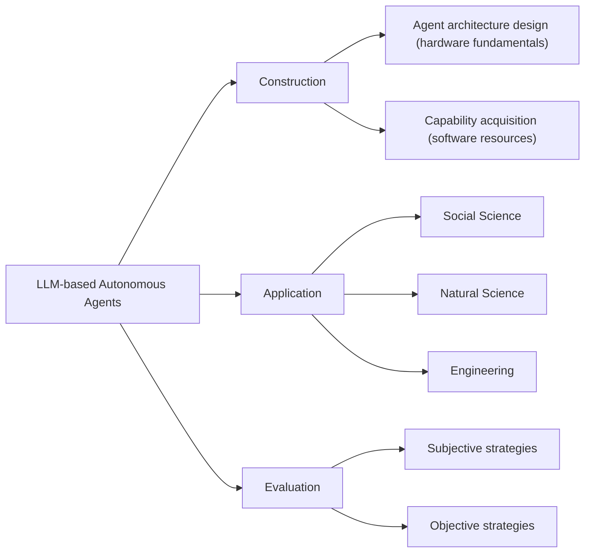
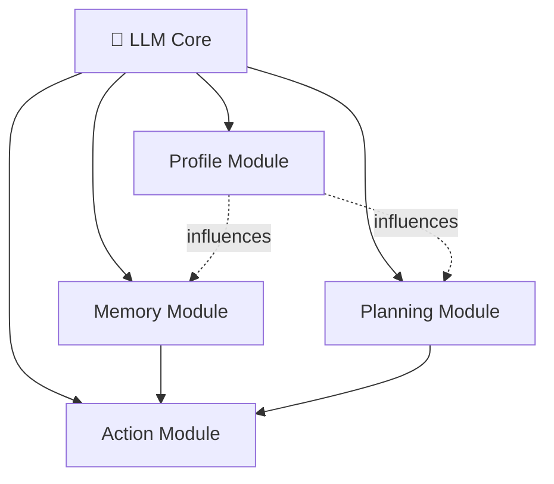

⚙️ Chunk 1 of the paper

# A Survey on Large Language Model based Autonomous Agents

**Authors:** Lei Wang, Chen Ma*, Xueyang Feng*, Zeyu Zhang, Hao Yang, Jingsen Zhang, Zhi-Yuan Chen, Jiakai Tang, Xu Chen(B), Yankai Lin(B), Wayne Xin Zhao, Zhewei Wei, Ji-Rong Wen

*Gaoling School of Artificial Intelligence, Renmin University of China, Beijing, 100872, China*

> Front. Comput. Sci., 2025, 0(0): 1–42 · https://doi.org/10.1007/s11704-024-40231-1 · © Higher Education Press 2025

## 📌 Abstract

Autonomous agents have long been a research focus in academic and industry communities. Previous research often trains agents with limited knowledge within isolated environments, which diverges from human learning processes and makes agents hard-pressed to achieve human-like decisions.

With the rise of large language models (LLMs) — which encode vast amounts of web knowledge and show potential for human-level intelligence — research on **LLM-based autonomous agents** has surged. This survey:

- Proposes a **unified framework** for the *construction* of LLM-based autonomous agents.
- Reviews the diverse **applications** of these agents across social science, natural science, and engineering.
- Examines common **evaluation strategies** for LLM-based agents.
- Discusses open **challenges** and **future directions**.

**Keywords:** Autonomous agent, Large language model, Human-level intelligence

---

## 1. Introduction

> "An autonomous agent is a system situated within and a part of an environment that senses that environment and acts on it, over time, in pursuit of its own agenda and so as to effect what it senses in the future."
> — Franklin and Graesser (1997)

### 🔬 Background & Motivation

- Autonomous agents are viewed as a promising route to **artificial general intelligence (AGI)**, achieving tasks through self-directed planning and action.
- Prior agents relied on **simple, heuristic policy functions** learned in isolated, restricted environments — a poor match for the complexity of human learning, which draws on a much wider variety of environments.
- As a result, earlier agents fall short of human-level decision-making, especially in **open-domain, unconstrained settings**.

### Why LLMs Change the Picture

LLMs have shown strong potential for human-like intelligence, driven by large training datasets and model scale. This has spurred a research direction using **LLMs as central controllers** for autonomous agents. Compared to reinforcement learning-based agents, LLM-based agents offer:

1. **Richer internal world knowledge** — informed actions without needing domain-specific training.
2. **Natural language interfaces** — greater flexibility and explainability in human interaction.

The key idea across recent models is equipping LLMs with human-like capabilities — **memory** and **planning** — so they can behave like humans across varied tasks. These models were largely developed independently, motivating this survey's systematic, holistic summary.

🖼️ **Figure 1:** A timeline chart showing the cumulative growth of papers on LLM-based autonomous agents from January 2021 to August 2023, colored by agent category (General, Tool, Simulation, Embodied, Game, Web, Assistant). Notable milestones plotted include WebGPT (2021-12), CoT (2022-01), TALM (2022-05), WebShop / Inner Monologue (2022-07), Toolformer / DEPS / HuggingGPT (2023-02), AutoGPT (2023-03), AgentGPT / Generative Agent (2023-04), GITM / ToT / Voyager (2023-05), MIND2WEB / RecAgent (2023-06), CO-LLM / ChatDev / ToolLLaMA (2023-07), and AgentSims (2023-08) — illustrating a sharply accelerating research trend.

### 📌 Survey Organization

The survey is organized around three key aspects of LLM-based autonomous agents:

For **construction**, the survey addresses two problems:

- **Architecture design** — how to structure LLMs into an agent (analogous to designing a network's structure).
- **Capability acquisition** — how the agent gains the ability to complete tasks, whether or not the underlying LLM is fine-tuned (analogous to learning network parameters).

---

## 2. LLM-based Autonomous Agent Construction

Two central questions drive this section:

1. Which **architecture** best leverages LLMs for agent behavior?
2. Given that architecture, how does the agent **acquire capabilities** to accomplish specific tasks?

### 2.1 Agent Architecture Design

LLMs excel at question-answering, but autonomous agents require more: fulfilling specific roles, and autonomously perceiving and learning from an environment to evolve over time. The survey proposes a **unified framework** with four modules:

| Module | Purpose |
|---|---|
| **Profile** | Identifies the role of the agent |
| **Memory** | Places the agent in a dynamic environment; recalls past behaviors |
| **Planning** | Places the agent in a dynamic environment; plans future actions |
| **Action** | Translates the agent's decisions into concrete outputs |

The profiling module influences memory and planning; together, all three influence the action module.

🖼️ **Figure 2:** A unified framework diagram showing four modules (Profile, Memory, Planning, Action) branching from a central LLM icon, each expanded into sub-components as detailed below.

#### 2.1.1 Profiling Module

Agents typically perform tasks by assuming specific roles (e.g., coders, teachers, domain experts). The profiling module defines this role and is usually embedded directly into the prompt.

**Typical profile contents:**
- Demographic information (age, gender, career)
- Personality/psychology information
- Social information (relationships between agents)

The choice of profile content depends on the application — e.g., psychology traits matter more when studying human cognition.

**Three profile generation strategies:**

1. **Handcrafting Method** — profiles are manually specified (e.g., "you are an outgoing person").
   - Used by *Generative Agent* (name, objectives, relationships), *MetaGPT*, *ChatDev*, *Self-collaboration* (predefined software-development roles), *PTLLM* (personality traits via tools like IPIP-NEO, BFI), and studies prompting LLMs as politicians/journalists/businesspeople.
   - ✅ Flexible — any profile info can be assigned.
   - ⚠️ **Limitation:** labor-intensive at scale.

2. **LLM-generation Method** — profiles are generated automatically by an LLM from generation rules and optional seed examples.
   - Example: *RecAgent* hand-crafts a few seed profiles (age, gender, traits, movie preferences), then uses ChatGPT to generate more.
   - ✅ Greatly reduces effort for large-scale populations.
   - ⚠️ **Limitation:** less precise control — can produce inconsistent or off-target profiles.

3. **Dataset Alignment Method** — profiles are derived from real-world datasets, converted into natural language prompts.
   - Example: assigning GPT-3 roles based on demographic backgrounds (race/ethnicity, gender, age, state of residence) from the American National Election Studies (ANES), then testing whether GPT-3 mirrors real human response patterns.
   - ✅ Accurately reflects real-world population attributes.

> **Remark:** These strategies can be combined — e.g., using real datasets to profile a subset of agents (reflecting current society) while manually assigning novel, forward-looking roles to other agents to simulate future social developments.

#### 2.1.2 Memory Module

The memory module stores information perceived from the environment and uses recorded memories to inform future actions — helping the agent accumulate experience, self-evolve, and act more consistently and effectively. *(Section continues in the next chunk.)*
