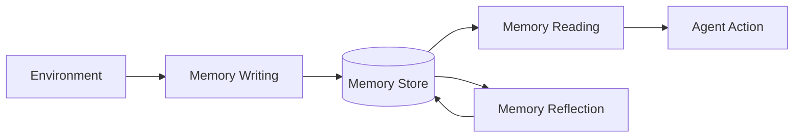
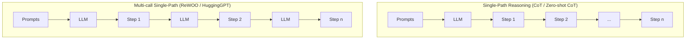

⚙️ Chunk 2 of the paper

## 🧠 Memory Structures

LLM-based autonomous agents draw inspiration from human memory: **sensory → short-term → long-term** memory. In agent design:

- **Short-term memory** ≈ the context window (transformer input constraint)
- **Long-term memory** ≈ external vector storage, queried/retrieved as needed

### Unified Memory

> Simulates only short-term memory, realized via in-context learning — memory is written directly into prompts.

| Agent | Domain | Short-term Memory Basis |
|---|---|---|
| RLP | Conversation | Internal speaker/listener states |
| SayPlan | Embodied task planning | Scene graphs + environment feedback |
| CALYPSO | D&D narration | Scene descriptions, monster info, prior summaries |
| DEPS | Minecraft | Generated task plans |

📌 **Key Point:** Easy to implement, but limited by context window size — pushes research toward hybrid systems.

### Hybrid Memory

> Explicitly models **both** short-term (recent perceptions) and long-term (consolidated) memory.

| Agent | Long-term Memory Approach |
|---|---|
| Generative Agent | Stores past behaviors/thoughts, retrieved via current events |
| AgentSims | Vector database of embedded daily memories |
| GITM | Reference plans summarized from successful trajectories |
| Reflexion | Sliding window (short-term) + persistent condensed insights (long-term) |
| SCM | Selectively activates relevant long-term knowledge |
| SimplyRetrieve | Query = short-term; private knowledge base = long-term |
| MemorySandbox | Shared memory objects across conversations (drag-and-drop) |

> 💡 **Remark:** Long-term-only memory structures are rarely seen in the literature — likely because agents operate in continuous, dynamic environments where short-term memory capture is essential and can't be skipped.

---

## 🗂️ Memory Formats

Different storage mediums suit different needs:

### Natural Languages
- Memory expressed as raw, flexible, semantically rich text.
- Examples: **Reflexion** (feedback in a sliding window), **Voyager** (skill descriptions for Minecraft).

### Embeddings
- Memory encoded as vectors for efficient retrieval.
- Example: **MemoryBank** — dual-tower dense retrieval over embedded memory segments.

### Databases
- Memory stored/manipulated via structured queries.
- Example: **ChatDB** — uses SQL to add/delete/modify memory.

### Structured Lists
- Memory organized as concise lists.
- Examples: **GITM** (hierarchical tree of action lists per sub-goal), **RET-LLM** (natural language → triplet phrases).

> 💡 **Remark:** Formats aren't mutually exclusive. **GITM** combines them: keys = embeddings (efficient retrieval), values = natural language (rich content).

---

## ⚙️ Memory Operations

Three core operations connect the agent to its environment:

### 1. Memory Reading

📌 **Goal:** Extract the most useful information to guide agent action, scored by **recency**, **relevance**, and **importance**.

$$
m^* = \arg\max_{m \in M} \left( \alpha \, s^{rec}(q, m) + \beta \, s^{rel}(q, m) + \gamma \, s^{imp}(m) \right)
$$

Where:
- $q$ = query (task or context)
- $M$ = set of all memories
- $s^{rec}, s^{rel}, s^{imp}$ = scoring functions for recency, relevance, importance
- $\alpha, \beta, \gamma$ = balancing weights (importance is independent of $q$)

- Setting $\alpha = \gamma = 0$ → relevance-only reading (used by several studies)
- Setting $\alpha = \beta = \gamma = 1.0$ → equal weighting (Generative Agent)

### 2. Memory Writing

📌 **Goal:** Store perceived environmental info for future use. Two key challenges:

**(1) Memory Duplication**
- **GITM**: once a sub-goal's action list hits N=5, sequences are condensed via LLM into one unified plan, replacing originals.
- **Augmented LLM**: aggregates duplicates via count accumulation instead of redundant storage.

**(2) Memory Overflow**
- **ChatDB**: explicit deletion via user commands.
- **RET-LLM**: fixed-size FIFO buffer, overwrites oldest entries.

### 3. Memory Reflection

📌 **Goal:** Agent self-summarizes/infers high-level abstractions from raw memories — mimicking human self-evaluation.

**Generative Agent** process:
1. Generate key questions from recent memories
2. Query memory using those questions
3. Synthesize higher-level insights

> **Example:** low-level memories *"writing a research paper"*, *"engaging with a librarian"*, *"conversing about research"* → high-level insight: *"dedicated to research."*

- Reflection can be **hierarchical** (insights built from other insights).
- **GITM**: summarizes >5 successful actions into an abstract pattern, replacing raw entries.
- **ExpeL**: reflects via (a) comparing successful vs. failed trajectories, and (b) learning from collections of successful trajectories.

⚠️ Memory alone isn't enough — agents also need a **planning module** to guide future actions, discussed next.

---

## 🧭 Planning Module

Agents decompose complex tasks into subtasks, similar to human problem-solving. Studies are categorized by **whether feedback influences future planning**.

### Planning without Feedback

#### Single-Path Reasoning

| Method | Approach |
|---|---|
| **CoT** | Reasoning steps as in-prompt examples; one-shot step generation |
| **Zero-shot-CoT** | Triggers ("think step by step") without example steps |
| **Re-Prompting** | Checks step prerequisites; regenerates plan on failure |
| **ReWOO** | Separates plan generation from observation gathering, then combines |
| **HuggingGPT** | Decomposes task into sub-goals, solves each via Huggingface models |
| **SWIFTSAGE** | Dual-process: SWIFT = fast pattern-based responses; SAGE = deep LLM-based planning |

🖼️ Figure: Diagram comparing single-path reasoning (CoT, ReWOO/HuggingGPT — linear step chains) vs. multi-path reasoning (CoT-SC — parallel independent chains; ToT/LMZSP/RAP — branching tree of steps), illustrated as flow/tree diagrams.
