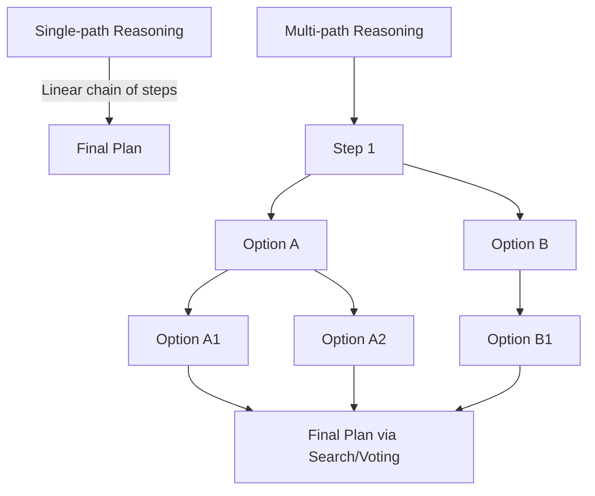
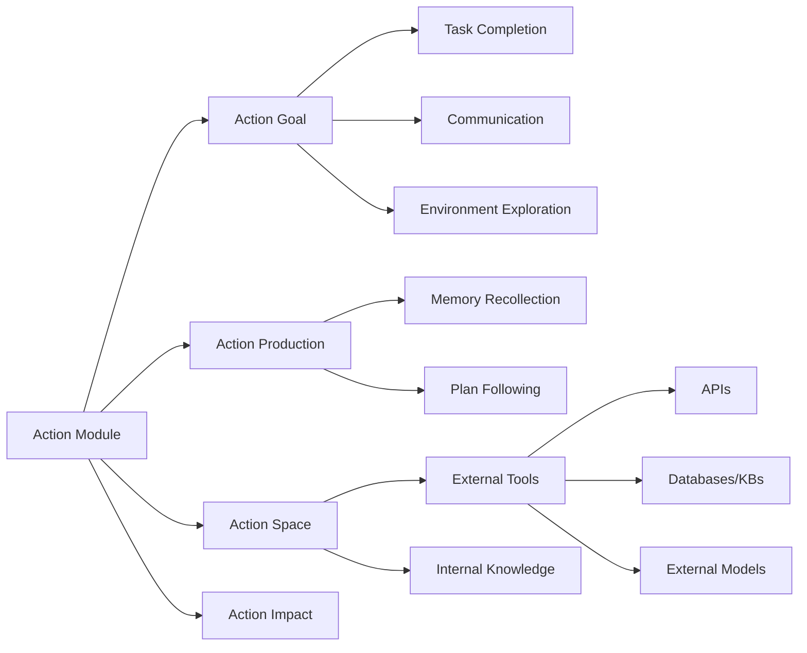

⚙️ Chunk 3 of the paper

### 📌 Multi-path Reasoning

Reasoning steps are organized into a **tree-like structure**, where each intermediate step may branch into multiple subsequent steps — analogous to how humans consider multiple options at each decision point.

- **CoT-SC (Self-consistent CoT)** [51] — generates multiple reasoning paths via CoT, then selects the most frequent answer as the final output.
- **Tree of Thoughts (ToT)** [52] — represents each "thought" (intermediate reasoning step) as a tree node; LLMs evaluate nodes to guide **BFS/DFS** search. Unlike CoT-SC (all steps generated together), ToT queries the LLM per reasoning step.
- **RecMind** [53] — uses a self-inspiring mechanism where discarded historical planning information is reused to derive new reasoning steps.
- **GoT (Graph of Thoughts)** [54] — extends ToT's tree structure into a **graph structure** for more powerful prompting.
- **AoT** [55] — incorporates algorithmic examples into prompts, needing only one or a few LLM queries.
- **[44]** — LLMs as zero-shot planners: generate multiple candidate next steps, then pick the final one based on distance to admissible actions.
- **[56]** — improves [44] by adding query-similar examples to prompts.
- **RAP** [57] — builds a world model to simulate plan outcomes via **Monte Carlo Tree Search (MCTS)**, aggregating multiple MCTS iterations into a final plan.

### 📌 External Planner

For domain-specific problems where zero-shot LLM planning struggles, researchers offload planning to **external, well-developed search algorithms**:

- **LLM+P** [58] — converts task descriptions to **PDDL** (Planning Domain Definition Language) → external planner solves it → LLM converts result back to natural language.
- **LLM-DP** [59] — LLMs convert observations, world state, and objectives into PDDL, which an external planner processes into an action sequence.
- **CO-LLM** [22] — LLMs excel at high-level plans but struggle with low-level control; a heuristic external low-level planner executes actions based on the high-level plan.

---

## Planning with Feedback

For long-horizon tasks, feedback-free planning modules become less effective because:

1. Generating a flawless plan upfront is difficult (many complex preconditions).
2. Unpredictable transition dynamics during execution can render the initial plan non-executable.

Humans iteratively revise plans based on feedback — agents simulate this via feedback from **environments**, **humans**, and **models**.

### 🔬 Environmental Feedback

Feedback from the objective/virtual world (e.g., task completion signals, post-action observations).

| Method | Feedback Mechanism |
|---|---|
| **ReAct** [60] | Thought-act-observation triplets; observations (e.g., search results) shape the next thought |
| **Voyager** [38] | Incorporates program execution progress, execution errors, and self-verification results |
| **Ghost** [16] | Uses environment states plus success/failure info per executed action |
| **SayPlan** [31] | Uses a scene graph simulator to validate/refine plans, iterating until viable |
| **DEPS** [33] | Provides detailed failure *reasons* (not just completion status) to enable better plan revision |
| **LLM-Planner** [61] | Grounded re-planning that updates plans on object mismatches/unattainable plans |
| **Inner Monologue** [62] | Three feedback types: task success, passive scene description, active scene description |

### 🔬 Human Feedback

A **subjective signal** that aligns agents with human values/preferences and helps reduce hallucination.

- **Inner Monologue** [62] — agent performs high-level instructions in a 3D visual environment and actively solicits human feedback on scene descriptions, incorporating it into prompts. (Also combines environment + human feedback simultaneously.)

### 🔬 Model Feedback

Internal feedback generated by pre-trained models themselves (not external signals):

- **Self-refine** [63] — three-component loop: *output → feedback → refinement*, iterating until a desired condition is reached.
- **SelfCheck** [64] — agent examines/evaluates its own reasoning steps at various stages and corrects errors via outcome comparison.
- **InterAct** [65] — uses different LLMs (e.g., ChatGPT, InstructGPT) as auxiliary checkers/sorters to help the main LLM avoid erroneous/inefficient actions.
- **ChatCoT** [66] — an evaluation module monitors reasoning steps and generates feedback to improve reasoning quality.
- **Reflexion** [12] — agent produces an action from memory; an evaluator generates **detailed verbal feedback** (vs. scalar feedback) from the agent's trajectory, giving richer support for planning.

> ⚠️ **Remark:** Planning *without* feedback is simple to implement but only suits tasks needing few reasoning steps. Planning *with* feedback requires more careful design but is far more powerful for complex, long-range reasoning tasks.

---

## 2.1.4 Action Module

The **action module** translates the agent's decisions into concrete outcomes — the most downstream module, directly interacting with the environment, and shaped by the profile, memory, and planning modules.

Four perspectives:

1. **Action goal** — before-action: intended outcomes
2. **Action production** — before-action: how actions are generated
3. **Action space** — in-action: available actions
4. **Action impact** — after-action: consequences *(covered in next chunk)*

### 📌 Action Goal

- **Task Completion** — actions aimed at accomplishing well-defined tasks (e.g., crafting an iron pickaxe in Minecraft [38], completing a software function [18]). The most common goal type in the literature.
- **Communication** — actions taken to communicate with other agents or humans for information sharing/collaboration (e.g., agents in **ChatDev** [18] communicating to jointly build software; **Inner Monologue** [62] adjusting strategy based on human feedback).
- **Environment Exploration** — actions aimed at exploring unfamiliar environments, balancing exploration vs. exploitation (e.g., **Voyager** [38] exploring unknown skills and refining execution code via trial and error).

### 📌 Action Production

1. **Action via Memory Recollection** — actions generated by retrieving relevant info from agent memory given the current task.
   - **Generative Agents** [20] — retrieves recent, relevant, important memories before each action.
   - **GITM** [16] — queries memory for prior successful experiences on similar sub-goals; reuses successful past actions directly if found.
   - **ChatDev** [18] / **MetaGPT** [23] — conversation history is stored in memory and influences each agent utterance.
2. **Action via Plan Following** — actions follow pre-generated plans.
   - **DEPS** [33] — agent strictly follows its plan unless there are signals of plan failure.
   - **GITM** [16] — decomposes tasks into sub-goals via high-level plans, then acts on each sub-goal sequentially.

### 📌 Action Space

Two broad classes: **(1) external tools** and **(2) internal LLM knowledge**.

#### 🔧 External Tools

Used to compensate for LLMs' lack of expert domain knowledge and to mitigate hallucination.

**(1) APIs**

| Method | Contribution |
|---|---|
| HuggingGPT [13] | Integrates HuggingFace's model ecosystem for complex tasks |
| WebGPT [67] | Auto-generates queries to extract content from web pages |
| TPTU [68] | Strategic task planning + API-based tools |
| Gorilla [69] | Fine-tuned LLM generating precise API call arguments, reducing hallucination |
| ToolFormer [15] | Self-supervised learning of when/how to invoke tools |
| API-Bank [70] | Benchmark + training datasets for tool-augmented LLMs |
| ToolLLaMA [14] | Tool-use framework: data collection, training, evaluation |
| RestGPT [71] | Connects LLMs with RESTful APIs per web standards |
| TaskMatrix.AI [72] | Multimodal foundation model connecting LLMs to a broad API ecosystem |

**(2) Databases & Knowledge Bases**

- **ChatDB** [40] — uses SQL statements to query databases for logical action-taking.
- **MRKL** [73] / **OpenAGI** [74] — incorporate expert systems (knowledge bases, planners) for domain-specific info.

**(3) External Models**

- **ViperGPT** [75] — uses Codex to generate Python code from text, then executes it.
- **ChemCrow** [76] — chemical agent for organic synthesis, drug discovery, material design; uses 17 expert-designed models.
- **MM-REACT** [77] — integrates VideoBERT (video summarization), X-decoder (image generation), SpeechBERT (audio processing) for multimodal tasks.

#### 🧠 Internal Knowledge

LLMs relying solely on their own internal knowledge to guide actions:

- **Planning Capability** — LLMs act as decent planners, decomposing complex tasks into simpler ones [45], even without in-prompt examples [46].
  - **DEPS** [33] — Minecraft agent solving complex tasks via sub-goal decomposition.
  - **GITM** [16], **Voyager** [38] — also heavily rely on this planning capability *(continues in next chunk)*.

