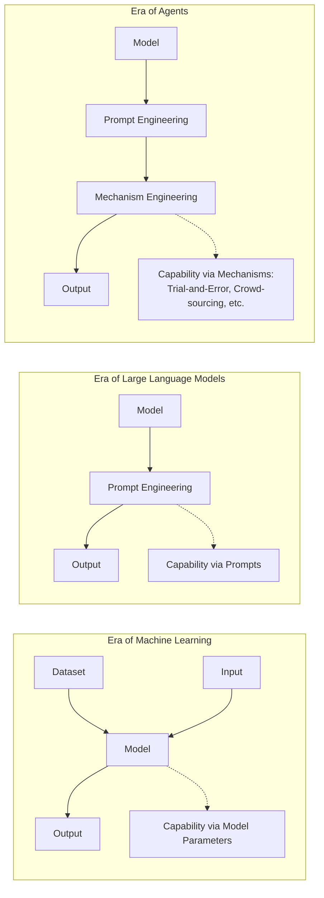

⚙️ Chunk 4 of the paper

### 📌 LLM Capabilities Enabling Agent Behavior (cont.)

- **Conversation Capability** — LLMs generate high-quality conversations, letting agents behave more like humans.
  - *ChatDev*: agents discuss the software development process and reflect on their own behaviors.
  - *RLP*: an agent communicates with listeners based on predicted feedback on its utterances.
- **Common Sense Understanding Capability** — LLMs comprehend human common sense, enabling agents to simulate daily life and make human-like decisions.
  - *Generative Agent*: understands current state, surrounding environment, and summarizes high-level ideas from observations.
  - Similar conclusions apply to *RecAgent* and *S3*, which simulate user social behaviors.

### 📌 Action Impact

The consequences of an agent's actions generally fall into three categories:

1. **Changing Environments** — actions directly alter environment states (moving, collecting items, constructing buildings).
   > e.g., in *GITM* and *Voyager*, harvesting resources removes them from the environment.
2. **Altering Internal States** — actions change the agent itself (updating memories, forming plans, acquiring knowledge).
   > e.g., *Generative Agents* update memory streams after actions; *SayCan* updates environment understanding.
3. **Triggering New Actions** — one action often leads to subsequent actions.
   > e.g., in *Voyager*, gathering resources triggers building construction.

---

## 2.2 Agent Capability Acquisition

Agent architecture is the "hardware" enabling LLMs to accomplish tasks, but agents also need task-specific **capabilities, skills, and experience** — the "software." Strategies for equipping agents with these resources fall into two classes based on whether they require fine-tuning.

### 🔬 Capability Acquisition *with* Fine-tuning

Datasets used for fine-tuning can come from human annotation, LLM generation, or real-world applications.

#### Fine-tuning with Human Annotated Datasets
- **CoH** — aligns LLMs with human values/preferences by converting human feedback into detailed natural-language comparison information (rather than simple symbolic feedback).
- **RET-LLM** — fine-tunes LLMs on human-constructed "triplet–natural language" pairs to convert natural language into structured memory.
- **WebShop** — collects 1.18M real-world Amazon products onto a simulated e-commerce site; 13 workers generate real human shopping behavior data, used to train heuristic-rule, imitation-learning, and RL-based methods.
- **EduChat** — fine-tunes LLMs on human-annotated educational datasets to support QA, essay assessment, Socratic teaching, and emotional support.

#### Fine-tuning with LLM Generated Datasets
Cheaper and more scalable than human annotation, though lower quality.
- **ToolBench** — collects 16,464 real-world APIs (49 categories) from RapidAPI Hub, uses ChatGPT to generate diverse single-/multi-tool instructions, then fine-tunes LLaMA for improved tool use.
- **Social sandbox method [83]** — a central agent generates responses to a social question, shares them with nearby agents for feedback, and revises responses accordingly; the resulting social interaction data is used for fine-tuning.

#### Fine-tuning with Real-world Datasets
- **MIND2WEB** — collects 2,000+ open-ended tasks from 137 real-world websites across 31 domains to fine-tune LLMs for web-related tasks (e.g., movie discovery, ticket booking).
- **SQL-PaLM** — fine-tunes PaLM-2 on cross-domain text-to-SQL datasets (Spider, BIRD), improving text-to-SQL performance.

### 🔬 Capability Acquisition *without* Fine-tuning

In the LLM era, capability can be acquired via:
1. Training/fine-tuning model parameters, **or**
2. Designing delicate prompts (prompt engineering)

🖼️ *Figure 4 (rendered above as diagram): Illustration of transitions in strategies for acquiring model capabilities — from parameter learning (ML era), to prompt engineering (LLM era), to mechanism engineering (agent era).*

In the agent era, capability can be acquired via three strategies:
1. **Model fine-tuning**
2. **Prompt engineering**
3. **Mechanism engineering** — designing agent evolution mechanisms (specialized modules, novel working rules, etc.)

#### 🧩 Prompt Engineering
Describing desired capability in natural language and using it as a prompt to influence LLM actions.
- **CoT**, **CoT-SC**, **ToT** — present intermediate reasoning steps as few-shot examples to enable complex task reasoning.
- **RLP** — enhances an agent's self-awareness by prompting with beliefs about its own and listeners' mental states, producing more engaging and strategic utterances.
- **Retroformer** — a retrospective model generating reflections on past failures, integrated into prompts to guide future actions; uses RL to iteratively refine the retrospective model.

#### 🧩 Mechanism Engineering
A capability-enhancement strategy distinct from fine-tuning and prompting. Representative methods:

1. **Trial-and-Error** — the agent acts, a pre-defined critic judges the action, and the agent incorporates feedback if unsatisfactory.
   - *RAH*: compares a predicted user response to real feedback; discrepancies generate failure info for the next action.
   - *DEPS*: an explainer generates failure-cause details for plan redesign when an action fails.
   - *RoCo*: multi-robot plans/waypoints validated by environment checks (collision detection, inverse kinematics); failures trigger further agent dialogue until validation passes.
   - *PREFER*: extends this via LLM-generated detailed feedback for iterative refinement.

2. **Crowd-sourcing** — leverages the wisdom of multiple agents.
   - *[94]*: a debating mechanism where agents give separate responses and iteratively incorporate others' solutions until reaching consensus.

3. **Experience Accumulation** — capability grows via memory of past task executions.
   - *GITM*: stores successful task actions in agent memory for reuse on similar future tasks.
   - *Voyager*: introduces a skill library of executable code refined through environment interaction.
   - *AppAgent*: learns via autonomous exploration and observation of human demonstrations, building a knowledge base for app tasks.
   - *MemPrompt*: stores user natural-language feedback on problem-solving intent in memory, retrieved for similar future tasks.

4. **Self-driven Evolution** — autonomous improvement through self-directed learning and feedback.
   - *LMA3*: agent autonomously sets its own goals, improving via environment exploration and reward-function feedback.
   - *S-ALLM-MS*: integrates advanced LLMs (e.g., GPT-4) into a multi-agent system for adaptive performance.

---

### 📊 Table: Representative Agent Papers by Module Design

**Legend:**
- *Profile*: ① handcrafting, ② LLM-generation, ③ dataset alignment
- *Memory – Operation*: ① read/write, ② read/write/reflection
- *Memory – Structure*: ① unified, ② hybrid
- *Planning*: ① w/o feedback, ② w/ feedback
- *Action*: ① no tools, ② uses tools
- *CA (Capability Acquisition)*: ① with fine-tuning, ② without fine-tuning
- "-" = not explicitly discussed

| Model | Profile | Memory (Op) | Memory (Struct) | Planning | Action | CA | Time |
|---|---|---|---|---|---|---|---|
| WebGPT | - | - | - | - | ② | ① | 12/2021 |
| SayCan | - | - | - | ① | ① | ② | 04/2022 |
| MRKL | - | - | - | ① | ② | - | 05/2022 |
| Inner Monologue | - | - | - | ② | ① | ② | 07/2022 |
| Social Simulacra | ② | - | - | - | ① | - | 08/2022 |
| ReAct | - | - | - | ② | ② | ① | 10/2022 |
| MALLM | - | ① | ② | - | ① | - | 01/2023 |
| DEPS | - | - | - | ② | ① | ② | 02/2023 |
| Toolformer | - | - | - | ① | ② | ① | 02/2023 |
| Reflexion | - | ② | ② | ② | ① | ② | 03/2023 |
| CAMEL | ① | ② | - | - | ② | ① | 03/2023 |
| API-Bank | - | - | - | ② | ② | ② | 04/2023 |
| ViperGPT | - | - | - | - | ② | - | 03/2023 |
| HuggingGPT | - | ① | ① | ① | ② | - | 03/2023 |
| Generative Agents | ① | ② | ② | ② | ① | - | 04/2023 |
| LLM+P | - | - | - | ① | ① | - | 04/2023 |
| ChemCrow | - | - | - | ② | ② | - | 04/2023 |
| OpenAGI | - | - | - | ② | ② | ① | 04/2023 |
| AutoGPT | - | ① | ② | ② | ② | ② | 04/2023 |
| SCM | - | ② | ② | - | ① | - | 04/2023 |
| Socially Alignment | - | ① | ② | - | ① | ① | 05/2023 |
| GITM | - | ② | ② | ② | ① | ② | 05/2023 |
| Voyager | - | ② | ② | ② | ① | ② | 05/2023 |
| Introspective Tips | - | - | - | ② | ① | ② | 05/2023 |
| RET-LLM | - | ① | ② | - | ① | ① | 05/2023 |
| ChatDB | - | ① | ② | ② | ② | - | 06/2023 |
| S3 | ③ | ② | ② | - | ① | - | 07/2023 |
| ChatDev | ① | ② | ② | ② | ① | ② | 07/2023 |
| ToolLLM | - | - | - | ② | ② | ① | 07/2023 |
| MemoryBank | - | ② | ② | - | ① | - | 07/2023 |
| MetaGPT | ① | ② | ② | ② | ② | - | 08/2023 |

