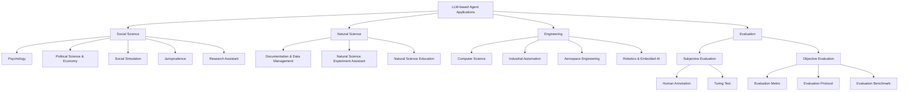

⚙️ Chunk 5 of the paper

## 2.x Capability Acquisition Strategies (cont.)

- **CLMTWA**: uses a large LLM as *teacher* and a weaker LLM as *student*
  - Teacher generates natural language explanations to improve student reasoning via theory of mind
  - Personalizes explanations; intervenes only when expected utility justifies it
- **NLSOM**: agents collaborate via natural language, dynamically adjusting roles/tasks/relationships based on feedback to solve problems beyond a single agent's scope

> 📌 **Remark**: Fine-tuning adjusts model parameters and can absorb large amounts of task-specific knowledge, but only works for open-source LLMs. Non-fine-tuning methods (prompting/mechanism engineering) work for both open- and closed-source LLMs, but are limited by context window size, and the design space of prompts/mechanisms is huge — making optimal solutions hard to find.

---

# 3 LLM-based Autonomous Agent Applications

Owing to strong language comprehension, complex task reasoning, and common-sense understanding, LLM-based agents show significant potential across domains. This section groups applications into three areas:

1. Social Science
2. Natural Science
3. Engineering

## 3.1 Social Science

Social science studies societies and relationships among individuals. LLM-based agents contribute via human-like understanding, thinking, and task-solving.

### 🧠 Psychology

- Agents assigned different profiles can complete psychology experiments, producing results aligning with human-participant studies
- **Finding**: larger models tend to give more accurate simulation results
- **Hyper-accuracy distortion**: models like ChatGPT/GPT-4 can produce *too perfect* estimates, potentially affecting downstream applications
- A study analyzing conversational agents for **mental well-being support** (120 Reddit posts) found:
  - ✅ Agents help users cope with anxiety, social isolation, depression
  - ⚠️ Agents may sometimes produce harmful content

### 🗳️ Political Science and Economy

- Agents used for **ideology detection** and **predicting voting patterns**
- Used to analyze **discourse structure and persuasive elements** of political speech
- Agents given traits (talents, preferences, personalities) to explore **simulated human economic behavior**

### 🌐 Social Simulation

Simulating human societies is often expensive, unethical, or infeasible — LLM agents enable virtual alternatives.

| System | Focus |
|---|---|
| Social Simulacra | Simulates online social community to aid decision-makers improve regulations |
| Generative Agents / AgentSims | Multi-agent virtual town simulating daily human life |
| SocialAI School | Simulates social cognitive skills during child development |
| S³ | Social network simulator — propagation of information, emotion, attitude |
| CGMI | Multi-agent simulation maintaining personality via tree structure + cognitive model (simulated a classroom scenario) |

### ⚖️ Jurisprudence

- Agents assist legal decision-making processes
  - **Blind Judgement**: multiple LLMs simulate multiple judges' decision-making, consolidating opinions via voting
  - **ChatLaw**: prominent Chinese legal LLM model
    - Supports database + keyword search strategies to mitigate hallucination
    - Uses self-attention mechanism to reduce reference inaccuracies

### 📚 Research Assistant

- Assist with generating article abstracts, extracting keywords, crafting study scripts
- Act as writing assistants that help identify novel research questions for social scientists

---

## 3.2 Natural Science

Natural science concerns description, understanding, and prediction of natural phenomena via empirical evidence.

### 🗂️ Documentation and Data Management

- Agents query/utilize internet information for QA and experiment planning
- **ChatMOF**: extracts info from text descriptions, plans tool use to predict properties/structures of metal-organic frameworks
- **ChemCrow**: uses chemistry databases to validate compound representations and identify dangerous substances

### 🔬 Experiment Assistant

- Agents can independently design, plan, and execute scientific experiments
  - Given an objective → retrieves documents from internet → uses Python for calculations → runs experiments
- **ChemCrow**: 17 specialized tools for chemical research; recommends experimental procedures and flags safety risks

### 🎓 Natural Science Education

- Agent-based education systems help students learn experimental design, methodology, analysis
- **Math Agents**: assist in exploring, discovering, solving, proving mathematical problems
- CodeX-based systems: solve/explain university-level math problems
- **CodeHelp**: programming education agent — course-specific keywords, monitors student queries, gives feedback
- **EduChat**: personalized, equitable, empathetic educational support for teachers/students/parents
- **FreeText**: automatically assesses open-ended student responses and gives feedback

---

## 3.3 Engineering

### 💻 Computer Science & Software Engineering

Agents automate coding, testing, debugging, documentation generation.

- **ChatDev**: end-to-end framework — multiple agent roles collaborate via natural language through the software development lifecycle
- **MetaGPT**: abstracts roles (product manager, architect, project manager, engineer) to supervise code generation
- **Self-collaboration framework**: multiple LLMs act as distinct "experts," forming a virtual team for code generation without human intervention
- **LLIFT**: static analysis for code vulnerability identification, balancing accuracy vs. scalability
- **ChatEDA**: electronic design automation agent — task planning, script generation, execution
- **CodeHelp**: debugging/testing assistant — explains errors, suggests fixes
- **PentestGPT**: penetration testing tool — identifies vulnerabilities, develops exploits from source code
- **D-Bot**: diagnoses database anomalies using a *tree of thought* approach, allowing backtracking to previous steps

### 🏭 Industrial Automation

- Framework integrating LLMs with **digital twin systems** for flexible production
  - Uses prompt engineering to adapt agents to tasks based on digital-twin info
  - Coordinates atomic functionalities/skills across production levels
- **IELLM**: case study of LLMs in oil & gas industry (factory automation, PLC programming)

### 🤖 Robotics & Embodied AI

*(section continues into next chunk — reinforcement learning agents for robotics)*

---

### 📊 Table: Representative Applications (Table 2)

| Domain | Subcategory | Representative Work |
|---|---|---|
| Social Science | Psychology | TE, Akata et al., Ziems et al., Ma et al. |
| Social Science | Political Science & Economy | Argyle et al., Horton, Ziems et al. |
| Social Science | Social Simulation | Social Simulacra, Generative Agents, SocialAI School, AgentSims, S³, Williams et al., Li et al., Chao et al. |
| Social Science | Jurisprudence | ChatLaw, Blind Judgement |
| Social Science | Research Assistant | Ziems et al., Bail et al. |
| Natural Science | Documentation & Data Management | ChemCrow, ChatMOF, Boiko et al. |
| Natural Science | Experiment Assistant | ChemCrow, Boiko et al., Grossmann et al. |
| Natural Science | Education | ChemCrow, CodeHelp, Boiko et al., MathAgent, Drori et al., EduChat, FreeText |
| Engineering | CS & SE | RestGPT, Self-collaboration, SQL-PALM, RAH, D-Bot, RecMind, ChatEDA, InteRecAgent, PentestGPT, CodeHelp, SmolModels, DemoGPT, GPTEngineer |
| Engineering | Industrial Automation | GPT4IA, IELLM |
| Engineering | Robotics & Embodied AI | ProAgent, LLM4RL, PET, REMEMBERER, DEPS, Unified Agent, SayCan, TidyBot, RoCo, SayPlan, TaPA, Dasgupta et al., DECKARD, Dialogue shaping |
