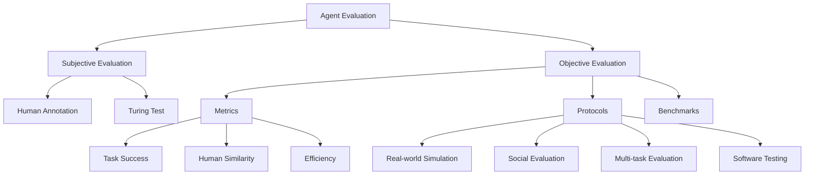

⚙️ Chunk 6 of the paper

## 🤖 LLM-based Agents in Embodied AI & Robotics

Recent work extends LLM-based autonomous agents into robotics and embodied AI, focusing on improving planning, reasoning, and collaboration in embodied environments.

- **Planner-Actor-Reporter paradigm** — proposed for embodied reasoning and task planning.
- **DECKARD** — also introduces the Planner-Actor-Reporter paradigm, decoupling planning, execution, and reporting.
- **TaPA** — builds a multimodal dataset (multi-view RGB images of indoor scenes + human instructions + plans) to fine-tune LLMs, aligning visual perception with task planning for more executable, visually grounded plans.

### 🦾 Skill-based Control for Physical Tasks

To overcome physical constraints, agents combine multiple skills to generate executable, long-horizon plans:

- **SayCan** — investigates manipulation and navigation skills with a mobile manipulator robot; presents **551 skills** across **7 skill families** and **17 objects** (picking, placing, grasping, manipulating, etc.), inspired by kitchen tasks.
- **TidyBot** — an embodied agent for personalized household cleanup; learns user preferences for object placement/manipulation via textual examples.

### 🧰 Open-Source Agent Frameworks

A growing ecosystem of open-source libraries lets developers quickly build and evaluate customized agents:

| Framework | Focus |
|---|---|
| **LangChain** | Automates coding, testing, debugging, documentation generation; integrates LMs with data sources and environments for multi-agent collaboration |
| **XLang** (built on LangChain) | Executable language grounding — converts natural language into code/action sequences for databases, web apps, robots |
| **AutoGPT** | Fully automated agent; sets goals, decomposes into tasks, cycles until goal completion |
| **WorkGPT** | Similar to AutoGPT/LangChain; converses back-and-forth with AI given an instruction + APIs |
| **GPT-Engineer** / **DemoGPT** | Automate code generation from prompts for development tasks |
| **SmolModels** | Family of compact LMs for various tasks |
| **AGiXT** | Dynamic AI automation platform; adaptive memory, smart features, plugin system |
| **AgentVerse** | Framework for building customized LLM-agent simulations |
| **GPT Researcher** | Develops research questions, crawls the web, summarizes and aggregates sources |
| **BMTools** | Community-driven tool building/sharing platform; supports multi-tool concurrent task execution |

> ⚠️ **Limitation / Risk**
> - LLMs can hallucinate, producing erroneous answers → incorrect conclusions, experimental failures, or safety risks in hazardous experiments. Users need domain expertise and caution.
> - LLM-based agents could be misused for malicious purposes (e.g., chemical weapons development), requiring safeguards like human alignment for responsible use.

---

## 📊 LLM-based Autonomous Agent Evaluation

Evaluating agent effectiveness is challenging; two main approaches exist: **subjective** and **objective** evaluation.

### 🧑‍⚖️ Subjective Evaluation

Measures agent capability via human judgment — useful when no evaluation dataset exists or quantitative metrics are hard to design (e.g., intelligence, user-friendliness).

- **Human Annotation**: Evaluators directly score/rank agent outputs.
  - Example: annotators asked 25 questions probing five key ability areas.
  - Example: annotators judge whether models enhance rule development in online communities.
- **Turing Test**: Evaluators try to distinguish agent output from human output; if they can't, the agent is deemed human-like.
  - Example: experiments on free-form partisan text, where evaluators guess human vs. agent origin.

> ⚠️ **Limitation**: Subjective evaluation is costly, inefficient, and subject to population bias.
>
> 📌 **Trend**: Researchers increasingly use LLMs themselves as evaluators:
> - **ChemCrow** — uses GPT to assess task completion and process accuracy.
> - **ChatEval** — employs multiple agents in a structured debate format to critique/assess candidate model outputs.

### 📐 Objective Evaluation

Uses quantitative, comparable, trackable metrics. Three key aspects: **metrics**, **protocols**, and **benchmarks**.

#### Metrics

1. **Task success metrics** — success rate, reward/score, coverage, accuracy/error rate (may reflect program executability or task validity). Higher = better task completion.
2. **Human similarity metrics** — coherence, fluency, dialogue similarity to humans, human acceptance rate. Higher = better human simulation.
3. **Efficiency metrics** — development cost, training efficiency.

#### Protocols

- **Real-world simulation**: Agents perform tasks autonomously in immersive environments (games, simulators); evaluated via task success rate and human similarity based on trajectories/objectives.
- **Social evaluation**: Assesses social intelligence via agent interactions in simulated societies — collaborative tasks (teamwork), debates (argumentative reasoning), human studies (social aptitude). Measures coherence, theory of mind, social IQ, cooperation, communication, empathy.
- **Multi-task evaluation**: Uses diverse tasks across domains to measure generalization in open-domain environments.
- **Software testing**: Agents perform tasks like generating test cases, reproducing bugs, debugging, interacting with developers/tools. Measured via test coverage and bug detection rate.

#### 📋 Benchmark Overview

> Legend — Subjective: ① Human Annotation, ② Turing Test. Objective: ① Real-world simulation, ② Social evaluation, ③ Multi-task evaluation, ④ Software testing. "✓" = evaluation based on benchmarks.

| Model | Subjective | Objective | Benchmark | Date |
|---|---|---|---|---|
| WebShop | – | ①③ | ✓ | 07/2022 |
| Social Simulacra | ① | ② | – | 08/2022 |
| TE | – | ② | – | 08/2022 |
| LIBRO | – | ④ | – | 09/2022 |
| ReAct | – | ① | ✓ | 10/2022 |
| Argyle et al. | ② | ②③ | – | 02/2023 |
| DEPS | – | ① | ✓ | 02/2023 |
| Jalil et al. | – | ④ | – | 02/2023 |
| Reflexion | – | ①③ | – | 03/2023 |
| IGLU | – | ① | ✓ | 04/2023 |
| Generative Agents | ① | – | – | 04/2023 |
| ToolBench | – | ③ | ✓ | 04/2023 |
| GITM | – | ① | ✓ | 05/2023 |
| Two-Failures | – | ③ | – | 05/2023 |
| Voyager | – | ① | ✓ | 05/2023 |
| SocKET | – | ②③ | ✓ | 05/2023 |
| MobileEnv | – | ①③ | ✓ | 05/2023 |
| Clembench | – | ①③ | ✓ | 05/2023 |
| Dialop | – | ③ | ✓ | 06/2023 |
| Feldt et al. | – | ④ | – | 06/2023 |
| CO-LLM | ① | ① | – | 07/2023 |
| Tachikuma | ① | ①③ | ✓ | 07/2023 |
| RocoBench | – | ①③ | ✓ | 07/2023 |
| AgentSims | – | ② | – | 08/2023 |
| AgentBench | – | ③ | ✓ | 08/2023 |
| BOLAA | – | ③ | ✓ | 08/2023 |
| Gentopia | – | ③ | ✓ | 08/2023 |
| EmotionBench | ① | – | ✓ | 08/2023 |
| PTB | – | ④ | – | 08/2023 |

#### 🏆 Notable Benchmarks

- **ALFWorld, IGLU, Minecraft** — common environments for interactive, task-oriented evaluation.
- **Tachikuma** — evaluates LLM ability to infer multi-character/novel-object interactions via TRPG game logs.
- **AgentBench** — first systematic framework assessing LLMs as agents across diverse real-world domains.
- **SocKET** — evaluates social capabilities across 58 tasks in 5 categories (humor/sarcasm, emotions, credibility, etc.).
- **AgentSims** — flexible framework for designing agent planning/memory/action strategies.
- **ToolBench** — tool-use benchmark with 16,464 real-world RESTful APIs, single- and multi-tool tasks.
- **WebShop** — product search/retrieval benchmark built from 1.18M real-world items.
- **Mobile-Env** — extendable platform for multi-step interaction evaluation.
- **WebArena** — comprehensive multi-domain website environment for end-to-end agent evaluation.
- **GentBench** — evaluates reasoning, safety, and efficiency in tool-using agents.
- **RocoBench** — 6 tasks evaluating multi-agent collaboration/coordination in cooperative robotics.
- **EmotionBench** — evaluates LLM emotion appraisal across 400+ situations eliciting 8 negative emotions.
- **PEB** — tailored for penetration testing scenarios; 13 diverse targets from leading platforms, structured by difficulty.
- **ClemBench** — 5 Dialogue Games assessing LLMs as players.
- **E2E** — end-to-end benchmark for chatbot accuracy and usefulness.

> ⚠️ **Limitation**: Current objective techniques cannot perfectly measure all agent capabilities, but they provide essential, complementary insights alongside subjective assessment. Continued benchmark/methodology advances will further improve evaluation.
