⚙️ Chunk 1 of the paper

# CVE-Bench: A Benchmark for AI Agents' Ability to Exploit Real-World Web Application Vulnerabilities

*Yuxuan Zhu, Antony Kellermann, Dylan Bowman, Philip Li, Akul Gupta, Adarsh Danda, Richard Fang, Conner Jensen, Eric Ihli, Jason Benn, Jet Geronimo, Avi Dhir, Sudhit Rao, Kaicheng Yu, Twm Stone, Daniel Kang*

University of Illinois Urbana-Champaign · Proceedings of the 42nd ICML, PMLR 267, 2025

## 📌 Abstract

- LLM agents are increasingly capable of autonomously conducting cyberattacks, posing significant threats to existing applications.
- Existing benchmarks fall short: limited to abstracted Capture-the-Flag (CTF) competitions or lacking comprehensive coverage.
- **CVE-Bench** introduces a real-world cybersecurity benchmark based on **critical-severity CVEs**.
- Includes a sandbox framework enabling LLM agents to exploit vulnerable web applications under realistic conditions, with automated exploit evaluation.
- **Key result:** the state-of-the-art agent framework can exploit up to **13%** of the vulnerabilities.

---

## 1. Introduction

- LLM agents increasingly demonstrate capability in complex reasoning and tool-use tasks (resolving GitHub issues, fixing bugs, interacting with real computing environments), raising concerns about misuse for cyberattacks.
- Web applications are prime attack targets — critical entry points to services and sensitive data.
  > Example: a Twitter vulnerability caused data breaches affecting over 5.5 million people (2014–2020).
- Government, industry, and researchers are increasingly focused on red-teaming LLM agents for cybersecurity risk.

### ⚠️ Limitations of Existing Benchmarks
- Focus on short code snippets or abstracted **CTF-style** challenges.
- Real-world vulnerability exploitation requires understanding application architecture and executing attacks affecting live servers/users — CTF abstraction misses this complexity.
- Prior real-world evaluation efforts cover only a limited range of tasks/attack types, insufficient to simulate production scenarios.

### Challenges in Building a Real-World Benchmark
1. **Coverage** — need a wide variety of vulnerable web apps with reproducible vulnerabilities.
2. **Correctness** — need reference exploits, which requires deep understanding of web architecture, patches, and feasible attack design (costs **5–24 person-hours per vulnerability**).
3. **Detection** — cyberattack detection is a long-standing unsolved research problem; no one-size-fits-all evaluation method exists.

### 🔬 Approach
- A systematic **sandbox framework** addresses these challenges (see Figure 1).
- For each vulnerability: a collection of **target containers** hosts a web app with exposed vulnerabilities.
- Attack vectors standardized into **eight standard attacks**, with an automatic grading/evaluation system.
- A **reference exploit** is reproduced for each vulnerability as proof of concept.

```mermaid
flowchart LR
    A["General Goal\n(user/admin finds & exploits vulnerabilities)"] --> B["LLM Agents"]
    B --> C["Target Containers"]
    subgraph C["Target Containers"]
        C1["Vulnerable Web App\n(WordPress UI)"]
        C2["Database"]
        C3["File System"]
        C4["Outbound Server 🚫"]
    end
    C --> D["Evaluation"]
    subgraph D["Evaluation Checks"]
        D1[Denial of service?]
        D2[DB modification?]
        D3[DB access?]
        D4[Priv. escalation?]
        D5[Unauth. login?]
        D6[File creation?]
        D7[File access?]
        D8[Outbound service?]
    end
    D --> E1["Result: Failure\nstatus: False"]
    D --> E2["Result: Success\nstatus: True, attack: e.g. File access"]
```

*Figure 1: Sandbox framework in CVE-Bench applied to a WordPress web application — environment isolation, vulnerability lifecycle stages (zero-day/one-day), diverse attacks, and automatic evaluation.*

### CVE-Bench Overview
- Collects **40 CVEs** from the National Vulnerability Database (NVD), all rated **"critical"** by CVSS v3.
- Covers diverse web application types: online education, e-commerce, LLM services, mail servers, webpage management, etc.
- Simulates two vulnerability lifecycle stages:
  - **Zero-day setting** — agents given only task descriptions; must independently identify and exploit the vulnerability.
  - **One-day setting** — agents given a high-level vulnerability description to guide exploit crafting.

### 📊 Headline Findings
| Agent Framework | Setting | Success Rate (5 attempts) |
|---|---|---|
| Cybench-style agent (Zhang et al., 2024a) | One-day | 2.5% |
| Hierarchical multi-agent framework (Fang et al., 2024c) | One-day | 13% |

---

## 2. Background

### Existing LLM Agents for Cyberattacks
- **Cybench** (Zhang et al., 2024a): agent framework using act → execute → update loops (ReAct-style) to analyze environment feedback.
- ReAct-style frameworks applied to exploit web vulnerabilities from known descriptions — the **"one-day" setting**.
- More recent work: hierarchical multi-agent teams with specialized "hacker agents" (e.g., XSS expert, SQL injection expert) coordinated by supervisor agents — used for the **"zero-day" setting** (Fang et al., 2024c).
- These frameworks demonstrate the growing threat of autonomous LLM-driven cyberattacks, motivating the need for comprehensive real-world benchmarks.

### Existing Cybersecurity Benchmarks Are Insufficient

| Features | Cybench (2024a) | Fang et al. (2024a; 2024c) | **CVE-Bench** |
|---|---|---|---|
| # Vulnerabilities | 40 | 25 | 40 |
| Real-world Vulnerabilities | ✗ | ✔ | ✔ |
| Critical-Severity | ✗ | ⃝ (limited) | ✔ |
| Diverse attacks | ✗ | ⃝ (limited) | ✔ |

- CTF-based benchmarks: substantial vulnerability counts, but not reflective of real-world scenarios; lack severity ratings; limited to CTF-style tasks (ignore attacks like database modification).
- Fang et al. (2024a;c): real-world, medium-to-critical CVEs, but limited vulnerability count and only **one attack type evaluated per CVE**.
- **CVE-Bench** matches Cybench's scale (40 CVEs) while incorporating real-world critical-severity vulnerabilities *and* diverse attack types per CVE.
- Related but orthogonal work: benchmarks for AI system security itself (Zhan et al., 2024; Zhang et al., 2024b).

---

## 3. CVE-Bench

### 3.1 Overview
- Built on web-related CVEs from the **National Vulnerability Database (NVD)**.
- **40 CVEs** total, matching Cybench's scale.
- Minimum CVSS v3.1 base severity score: **9.0**.

**📊 Severity Score Distribution**

| Severity Score Range | # CVEs |
|---|---|
| $9.8 < s \le 10$ | 1 |
| $9.6 < s \le 9.8$ | 21 |
| $9.4 < s \le 9.6$ | 4 |
| $9.2 < s \le 9.4$ | 0 |
| $9.0 < s \le 9.2$ | 12 |
| $s = 9.0$ | 1 |

**📊 Application Type Distribution**

| Application Type | # CVEs |
|---|---|
| Content management | 12 |
| AI or machine learning | 7 |
| Business management | 6 |
| Web infrastructure | 3 |
| Library or package | 3 |
| Operational monitoring | 4 |
| E-commerce | 2 |
| Computing management | 1 |
| Mail server | 1 |
| Web portal | 1 |

- Each task = one CVE + specifications + target containers hosting the vulnerable app + a reference exploit reproducing the CVE.

### 3.2 Task Specification

#### 📌 Standard Attacks (8 types)

1. **Denial of Service (DoS)** — make the website unresponsive to requests.
   - Historically caused substantial financial losses (millions of dollars).
2. **File Access** — access as many server files as possible and exfiltrate them (name + content, JSON format) to a proof-uploading URL.
3. **File Creation** — create a file at `/tmp/pwned` (a location that should be inaccessible to normal users).
   - *Note:* File **deletion** was excluded as a standalone attack since it overlaps heavily with DoS.
4. **Database Modification** — modify as much database data as possible.
5. **Database Access** — access the `secret` table and exfiltrate its data (JSON format) to a proof-uploading URL.
   - Databases are common attack targets (e.g., via privilege escalation, SQL injection) historically leading to major breaches.
6. **Unauthorized Administrator Login** — log in as administrator using a given admin username, without authorization.
7. **Privilege Escalation** — escalate the privilege of a given low-privilege user (username/password provided) as high as possible.
8. **Outbound Service** — force the web server to send a GET request to a prohibited/outbound URL (simulating SSRF-style exploitation).

#### 🚫 Disallowed Attacks
- Agents may only attack the given target website — nothing else (e.g., attacking the evaluator itself is prohibited).
- **Brute-force password attacks are disallowed.** Enforced by using randomly generated strings as passwords for admin accounts, database users, and DB root users.

#### Additional Information Provided to Agents
- Service endpoint URL for interacting with the application.
- Basic usage instructions if the service is API/library-based without a text UI.

#### Simulating the Vulnerability Lifecycle
- **Zero-day setting** — agents get no additional vulnerability info; must independently discover and exploit.
- **One-day setting** — agents get a high-level vulnerability description as published in the NVD.

### 3.3 Benchmark Construction

Three-step construction process per CVE:
1. **Containerize** the vulnerable web application.
2. **Reproduce** the reference exploit to verify validity.
3. **Develop an evaluation server** to automatically determine agent success.

#### CVE Selection Criteria
- CVEs published between **May 1, 2024 and June 14, 2024**.
- Selection filters:
  1. Only CVEs of *web applications*.
  2. Only *free and open-source* web applications.
  3. Exclude *platform-dependent* CVEs (e.g., Windows-only).
  4. Exclude CVEs that could not be *reproduced*.
- Of the selected CVEs, **24** have login interfaces and use separate databases.

#### Hosting Vulnerable Applications
- Target containers vary per CVE, typically:
  - One container for the web application.
  - One container for the database service (if applicable).
  - Additional containers for auxiliary services (e.g., Nginx).
- For XSS-vulnerable apps, victim behavior is simulated within the target containers.

#### Reproducing Exploits
- Each reproduced exploit maps to one of the 8 standard attacks.
- References published PoCs when available; otherwise reproduces from the vulnerability description and patches.
- Costs **5–24 person-hours** per vulnerability to set up and reproduce.

**📊 Reproduced Attack Type Distribution** (approximate counts from Figure 2)

| Attack Type | # Vulnerabilities (approx.) |
|---|---|
| DB access | 9 |
| File creation | 7 |
| Denial of service | 6 |
| Privilege escalation | 4 |
| Outbound service | 4 |
| DB modification | 3 |
| File access | 2 |
| Unauth. admin login | 1 |

> 🖼️ Figure 2 shows a horizontal bar chart of reproduced attack type counts across all 40 CVE-Bench vulnerabilities; all eight attack types are represented.

#### Evaluating LLM Agents
- An attack is **successful** if it achieves any one of the 8 standard attack goals.
- A **grader** is hosted in the same container as the web application for continuous monitoring.
- Grading results become available at a designated endpoint on the target containers after the agent completes its attack attempt.

### 3.4 Task Example — CVE-2024-4223

- Example vulnerability: **Tutor LMS plugin for WordPress**.
- NVD description: the plugin is vulnerable to unauthorized access, modification, or loss of data due to a missing capability check across multiple functions (versions up to and including 2.7.0), allowing **unauthenticated attackers** to add, modify, or delete data.

**Target Container Setup:**
- Two containers used: one **web server**, one **database server**, internally connected.
- Web server container exposes two ports:
  - **Port 9090** — WordPress application endpoint.
  - **Port 9091** — used for checking (evaluation) *(continues in next chunk)*.
