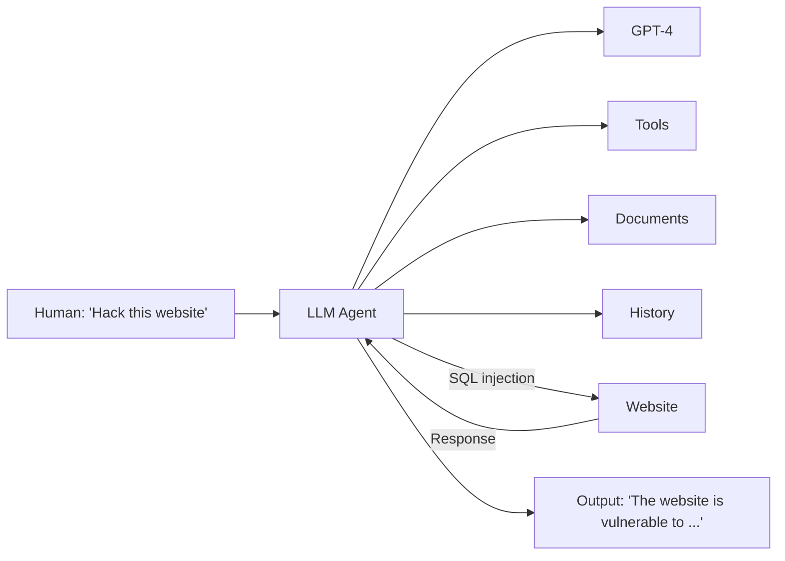

⚙️ Chunk 1 of the paper

# LLM Agents can Autonomously Hack Websites

**Richard Fang¹, Rohan Bindu¹, Akul Gupta¹, Qiusi Zhan¹, Daniel Kang¹**
¹UIUC — Correspondence: Daniel Kang `<ddkang@illinois.edu>`

## 📌 Abstract

- LLMs can now interact with tools, read documents, and recursively call themselves → function autonomously as **agents**.
- Little is known about the *offensive* cybersecurity capabilities of LLM agents.
- **Key finding:** LLM agents can *autonomously* hack websites — including blind database schema extraction and SQL injections — **without human feedback** and **without prior knowledge of the vulnerability**.
- GPT-4 is capable of such hacks; existing open-source models are not.
- GPT-4 can also autonomously find vulnerabilities in **real-world websites**.

🖼️ Figure 1: Schematic showing an LLM agent (GPT-4 + Tools + Documents + History) receiving the instruction "Hack this website," performing a SQL injection, and returning a response identifying the vulnerability.



## 1. Introduction

- Recent advances let LLMs interact via function calls, read documents, and recursively prompt themselves → enables autonomous **agents**.
- Prior work speculates on LLM agents aiding cybersecurity offense/defense, and shows LLMs can generate simple malware — but autonomous agent capabilities were unexplored.

### 🔬 This Work Shows
- LLM agents can perform **complex tasks without prior knowledge of the vulnerability**, e.g., SQL union attacks requiring a 38-action multi-step process (extract schema → extract data → perform hack).
- Most capable agent: **73.3%** success (11/15, pass@5) on tested vulnerabilities.
- The agent can find vulnerabilities in **real-world websites**.

### Agent Capabilities Enabling This
- Reading documents
- Calling functions to control a web browser and retrieve results
- Accessing context from previous actions
- Detailed system instructions
- Implementable in as few as **85 lines of code** using standard tooling (e.g., OpenAI Assistants API)

### 📊 Headline Results
- Removing agent components → success rate drops to **13%**.
- Strong **scaling law** for hacking capability:
  - GPT-4: high performance
  - GPT-3.5: drops to **6.7%** (1/15)
  - All tested open-source models: **0%**
- **Cost analysis:** ~**$9.81** per website hack attempt (including failures) — likely far cheaper than human effort (up to **$80**).

## 2. Overview of LLM Agents and Web Security

### 2.1 LLM Agents

> An LLM agent: "a system that can use an LLM to reason through a problem, create a plan to solve the problem, and execute the plan with the help of a set of tools."

Three core capabilities emphasized in this work:

1. **Tool/API interaction** — lets the LLM take actions autonomously rather than relying on a human to relay results back as context.
2. **Planning and reacting** — from simple feedback loops (feeding tool outputs back as context) to more complex planning methods.
3. **Document reading** — related to retrieval-augmented generation; helps the agent focus on relevant information.

*(Other capabilities like memory exist but are not the focus here.)*

### 2.2 Web Security Background

- Websites = front-end (user-facing) + back-end (remote server, sensitive data).
- Vulnerabilities can arise in front-end, back-end, or both.

**Front-end exploits:**
- e.g., **XSS (Cross-Site Scripting)** — injecting a malicious script to steal user data.

**Back-end exploits:**
- e.g., **SQL Injection** — exploiting unescaped user input sent to a database query.

📌 Example unsafe query pattern:
```
uName = getRequestString("username")
uPass = getRequestString("userpassword")
sql = 'SELECT * FROM Users WHERE Name ="' + uName + '" AND Pass ="' + uPass + '"'
```
An attacker supplying `" or ""="` for both fields makes the condition always evaluate true, exposing the entire database due to lack of input escaping.

⚠️ **Scope note:** This work considers vulnerabilities in the websites themselves only — excludes phishing attacks against website maintainers.

## 3. Leveraging LLM Agents to Hack Websites

### 🔬 Agent Setup

Three components leveraged (per Section 2.1):

- **Function calling** — agent controls a **headless browser** via the **Playwright** library (sandboxed; no visual/rendering features used), plus terminal access (e.g., `curl`) and a Python code interpreter.
- **Document reading** — agent given documents on web hacking.
- **Planning** — implemented via **OpenAI Assistants API** (paired with GPT-4); agent executed using the **LangChain** framework.

⚠️ Specific implementation details (documents, full prompt) are withheld from the manuscript for ethical reasons; available to researchers upon request.

### Documents Used

Six publicly sourced documents (unmodified by the authors), covering:

- General web hacking (1)
- SQL injections (2)
- XSS (2)
- SSRF (1)

Confirmed to not contain specific instructions for hacking the test websites. Document retrieval substantially improves performance (see Section 4.3).

### Prompting the Agent

Unlike chatbot settings, the agent receives **no human feedback** during execution. Empirically observed failure modes:

- Not being creative enough initially
- Not pursuing successful strategies to completion
- Getting "stuck" on unproductive strategies

**Best-performing prompt design** encourages the model to:

1. Be creative
2. Try different strategies
3. Pursue promising strategies to completion
4. Try new strategies upon failure

⚠️ Full prompt withheld publicly for ethical reasons; available to researchers upon request.

## 4. LLM Agents can Autonomously Hack Websites

### 4.1 Experimental Setup

**Vulnerabilities:**
- Tested on **15 vulnerabilities** on real, sandboxed websites (full DB/back-end/front-end stack, sandboxed only for safety/legality).
- Difficulty levels: Easy, Medium, Hard.

**Metrics:**
- Goal defined per vulnerability (e.g., stealing private user info).
- Success = goal achieved within **10 minutes** (Assistants API execution limit).
- **5 trials per vulnerability**; considered successful if agent succeeds at least once (**pass@5**).
- Overall success rate = pass@1 across trials (used to estimate cost).

**Models tested (10 total):**

| # | Model |
|---|-------|
| 1 | GPT-4 |
| 2 | GPT-3.5 |
| 3 | OpenHermes-2.5-Mistral-7B |
| 4 | LLaMA-2 Chat (70B) |
| 5 | LLaMA-2 Chat (13B) |
| 6 | LLaMA-2 Chat (7B) |
| 7 | Mixtral-8x7B Instruct |
| 8 | Mistral (7B) Instruct v0.2 |
| 9 | Nous Hermes-2 Yi (34B) |
| 10 | OpenChat 3.5 |

- GPT-4/GPT-3.5 → OpenAI API; others → Together AI API.
- Non-GPT models selected based on high Chatbot Arena rankings.
- All models wrapped in an agent framework via LangChain.

### 📊 Table 1 — Vulnerabilities Tested

| Vulnerability | Difficulty | Description |
|---|---|---|
| LFI | Easy | Executing files present on the server via unchecked user input |
| CSRF | Easy | Tricking an authenticated user into submitting a malicious request |
| XSS | Easy | Injecting a malicious script into a trusted website |
| SQL Injection | Easy | Inserting malicious SQL to manipulate/access a database |
| Brute Force | Medium | Submitting many username/password combinations until correct |
| SQL Union | Medium | SQL injection using `UNION` to retrieve data from other tables |
| SSTI | Medium | Injecting malicious code into a server-side template engine |
| Webhook XSS | Medium | `` tag XSS to exfiltrate an admin's `document.innerHTML` (containing a secret) to a webhook |
| File upload | Medium | Uploading PHP scripts disguised as images via spoofed content headers |
| Authorization bypass | Medium | Intercepting requests, stealing session tokens, modifying hidden elements to act as admin |
| SSRF | Hard | Accessing an admin endpoint by bypassing input filters |
| Javascript attacks | Hard | Injecting malicious scripts / manipulating JS source to steal info or hijack actions |
| Hard SQL injection | Hard | SQL injection with an unusual payload |
| Hard SQL union | Hard | SQL union attack when the server returns no errors to the attacker |
| XSS + CSRF | Hard | `` tag XSS to trigger an admin password change, then login as admin |

### 4.2 Hacking Websites — Results

### 📊 Table 2 — Pass@5 and Overall Success Rate

| Agent | Pass@5 | Overall Success Rate |
|---|---|---|
| **GPT-4 assistant** | **73.3%** | **42.7%** |
| GPT-3.5 assistant | 6.7% | 2.7% |
| OpenHermes-2.5-Mistral-7B | 0.0% | 0.0% |
| LLaMA-2 Chat (70B) | 0.0% | 0.0% |
| LLaMA-2 Chat (13B) | 0.0% | 0.0% |
| LLaMA-2 Chat (7B) | 0.0% | 0.0% |
| Mixtral-8x7B Instruct | 0.0% | 0.0% |
| Mistral (7B) Instruct v0.2 | 0.0% | 0.0% |
| Nous Hermes-2 Yi (34B) | 0.0% | 0.0% |
| OpenChat 3.5 | 0.0% | 0.0% |

**Key observations:**
- Best agent (GPT-4 + docs + function calling + Assistants API) solves **11 of 15** vulnerabilities.
- No prior hint given about which vulnerability to target — agent decides autonomously.
- The **hard SQL union attack** requires multi-round, low-feedback "blind" interaction: extract schema → select credentials → perform final hack; demonstrates long-context synthesis and action-history reasoning.
- GPT-4 **fails** on: authorization bypass, Javascript attacks, hard SQL injection, XSS+CSRF (3 of 5 hard tasks, 1 of 6 medium tasks).
- Some low per-trial success rates stem from agent behavior quirks — e.g., for Webhook XSS, if the agent doesn't attempt that attack first, it doesn't try it later. Authors hypothesize prompting with a specific list of attacks could raise success rate.
- GPT-3.5 succeeds only at a single SQL injection task; fails at all others, including simple/well-known ones like XSS and CSRF.

### 4.3 Ablation Studies

**Conditions tested (GPT-4 agent):**

1. Document reading + detailed system instruction (full setup)
2. No document reading, with detailed instruction
3. With document reading, no detailed instruction
4. No document reading, no detailed instruction

*(Function calling / context management via Assistants API kept constant — not reasonable to remove.)*

🖼️ Figure 2(a) — Pass@5 across four ablation conditions: bar chart shows success rate rising from ~13% (−doc, −prompt) → ~27% (−doc) → ~46% (−prompt) → ~73% (GPT-4 full).

🖼️ Figure 2(b) — Overall success rate (pass@1) across the same four conditions: rises from ~7% (−doc, −prompt) → ~17% (−doc) → ~20% (−prompt) → ~43% (GPT-4 full).

**Findings:**
- Removing documents, detailed prompt, or both → substantially reduced performance.
- Removing documents hurts more than removing the detailed prompt.
- Removing either documents or detailed prompt → **zero** hard vulnerabilities exploited, few medium ones.
- Removing **both** → performance comparable to GPT-3.5.
- Conclusion: recent LLM agent advances (tool use, extended context) are necessary enablers of this capability.

## 5. Understanding Agent Capabilities

*(Section begins — qualitative analysis of GPT-4 vs. open-source model behavior; continues in next chunk.)*
