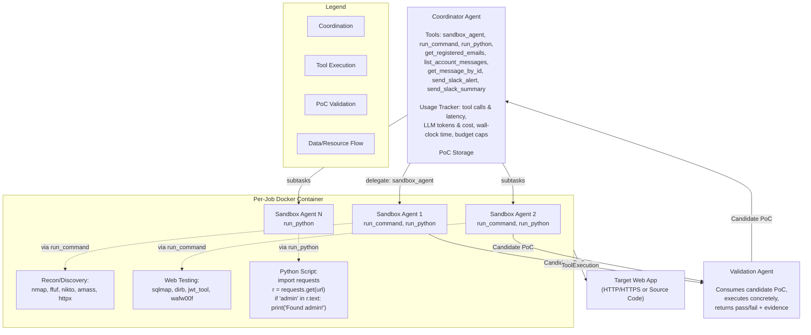
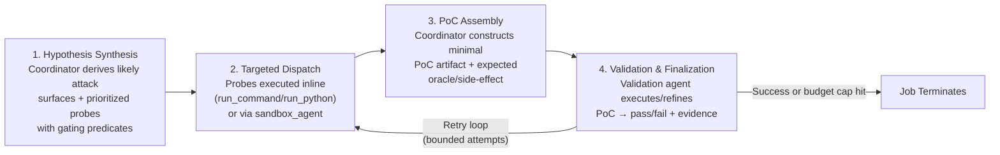
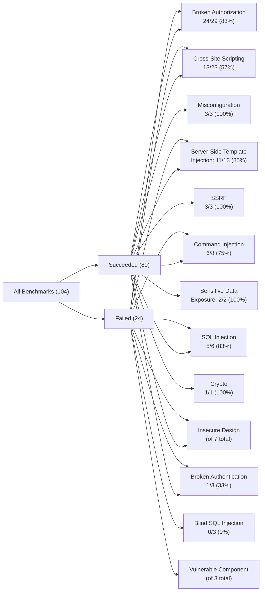

# 🛡️ Multi-Agent Penetration Testing AI for the Web

**Isaac David** — *University College London*  
**Arthur Gervais** — *University College London*  

`arXiv:2508.20816v1 [cs.CR]` — **28 August 2025**

---

## 📋 Table of Contents

- [ Abstract](#-abstract)
- [1. Introduction](#1-introduction)
  - [1.1 Key Insights and Contributions](#11-key-insights-and-contributions)
- [2. Architecture](#2-architecture)
  - [2.1 Multi-Agent Architecture](#21-multi-agent-architecture)
  - [2.2 Threat Model](#22-threat-model)
  - [2.3 Scope and Limitations](#23-scope-and-limitations)
  - [2.4 Orchestration Logic](#24-orchestration-logic)
  - [2.5 Execution Environment and Isolation](#25-execution-environment-and-isolation)
  - [2.6 Configurations: CTF vs Real-World](#26-configurations-ctf-vs-real-world)
  - [2.7 Resource Handling and Observability](#27-resource-handling-and-observability)
- [3. CTF Evaluation](#3-ctf-evaluation)
  - [3.1 Evaluation Metrics](#31-evaluation-metrics)
  - [3.2 Results and Performance Analysis](#32-results-and-performance-analysis)
  - [3.3 Resources and Success Correlations](#33-resources-and-success-correlations)
  - [3.4 Vulnerability Category Performance](#34-vulnerability-category-performance)
  - [3.5 Failure Analysis](#35-failure-analysis)
- [4. Real-World Application Assessment](#4-real-world-application-assessment)
  - [4.1 Vulnerability Discovery Results](#41-vulnerability-discovery-results)
- [5. Related Work](#5-related-work)
  - [5.1 Classical Automated Web Security Testing](#51-classical-automated-web-security-testing)
  - [5.2 Stateful REST/API Fuzzing](#52-stateful-restapi-fuzzing)
  - [5.3 LLMs for Secure Code](#53-llms-for-secure-code)
  - [5.4 LLM-Driven Autonomous Testing and Tool Orchestration](#54-llm-driven-autonomous-testing-and-tool-orchestration)
  - [5.5 Benchmarks and Testbeds](#55-benchmarks-and-testbeds)
- [6. Conclusion](#6-conclusion)
- [⚖️ Ethical Considerations](#-ethical-considerations)
- [🔓 Open Science & Availability](#-open-science--availability)
- [📚 References](#-references)

---

## 💡 Abstract

AI-powered development platforms are making software creation accessible to a broader audience, but this democratization has triggered a scalability crisis in security auditing. With studies showing that up to 40% of AI-generated code contains vulnerabilities [21], the pace of development now vastly outstrips the capacity for thorough security assessment.

We present **MAPTA**, a multi-agent system for autonomous web application security assessment that combines large language model orchestration with tool-grounded execution and end-to-end exploit validation. On the 104-challenge XBOW benchmark, MAPTA achieves **76.9% overall success** with perfect performance on SSRF and misconfiguration vulnerabilities, 83% success on broken authorization, and strong results on injection attacks including server-side template injection (85%) and SQL injection (83%). Cross-site scripting (57%) and blind SQL injection (0%) remain challenging.

Our comprehensive cost analysis across all challenges totals **$21.38**, with a median cost of **$0.073** for successful attempts versus **$0.357** for failures. Success correlates strongly with resource efficiency, enabling practical early-stopping thresholds at approximately 40 tool calls or $0.30 per challenge.

MAPTA's real-world findings are impactful given both the popularity of the respective scanned GitHub repositories (8K–70K stars) and MAPTA's low average operating cost of **$3.67 per open-source assessment**: MAPTA discovered critical vulnerabilities including RCEs, command injections, secret exposure, and arbitrary file write vulnerabilities. Findings are responsibly disclosed; 10 findings are under CVE review.

---

## 1. Introduction

Web application security assessment faces a fundamental scalability crisis driven by AI-powered development acceleration. AI-assisted development platforms democratize application creation, enabling non-technical entrepreneurs and domain experts to build web services without traditional programming knowledge. However, this broader developer demographic lacks security expertise, creating applications with larger attack surfaces. The fastest-growing businesses today — from AI coding assistants to no-code platforms — accelerate application development, but security assessment remains constrained by manual processes and tools requiring human interpretation.

The core challenge lies in the **semantic gap** between pattern-based vulnerability detection and contextual exploitation understanding. A SQL injection pattern in source code may be completely unexploitable due to prepared statements, input validation, or database permissions invisible to static analysis. Conversely, business logic vulnerabilities — particularly those involving multi-step attack chains — often evade detection by signature-based tools, as they exploit application-specific workflows rather than known patterns [1, 14]. Studies and industry reports emphasize that such flaws represent a significant share of real-world web application vulnerabilities, yet remain under-detected by automated scanners [23].

Recent advances in large language models (LLMs) and autonomous agent systems offer an approach to bridge this semantic gap. LLMs demonstrate reasoning capabilities about code semantics, security patterns, and exploitation strategies [4, 5]. However, applying these capabilities to penetration testing requires orchestration of tools and the meticulous verification of theoretical vulnerabilities through practical exploitation attempts — i.e., end-to-end proof-of-concept exploits.

Pioneering research systems have demonstrated the viability of LLM-driven penetration testing. **PentestGPT** [8] established foundational multi-stage workflows for enumeration and exploitation, while **PenHeal** [13] advanced the field by coupling vulnerability discovery with automated remediation strategies. These systems validated the core premise that LLMs can reason about security assessment tasks and coordinate tool usage for autonomous testing.

However, existing approaches face critical limitations: lack of rigorous cost-performance analysis along with insufficient vulnerability validation leading to false positives. While commercial systems like XBOW have emerged claiming competitive performance and contributing valuable benchmarks to the community, they lack scientific reproducibility in their core methodologies, with only high-level descriptions available through blog posts rather than detailed system architectures or open-source implementations [10].

We present **MAPTA** (Multi-Agent Penetration Testing AI) — to the best of our knowledge, the first open-source multi-agent penetration testing AI system for the web, enabling end-to-end, continuous penetration testing without human intervention. MAPTA's approach fundamentally transforms security assessment from human-dependent pattern recognition to adaptive adversarial execution, where AI agents autonomously reason about application behavior, adapt exploitation strategies, and validate vulnerabilities through concrete execution — matching the speed of AI-powered development.

### 1.1 Key Insights and Contributions

> 🔑 **Core Thesis**  
> MAPTA advances the state of the art through rigorous cost-performance measurement, mandatory proof-of-concept validation for all findings, and multi-agent orchestration that reduces false positives and resource inefficiencies.

Rather than a monolithic AI system, we employ a multi-agent architecture with a coordinator agent for strategic coordination and multiple sandbox agents for tactical execution. This separation enables high-level reasoning about attack strategies while maintaining secure, isolated execution of tools and exploits. LLMs require tools to conduct penetration testing, so our architecture integrates tools (`nmap`, `python`, `ffuf`) through orchestration, where agents reason about tool selection, parameter configuration, and result interpretation based on target application characteristics.

We distinguish theoretical vulnerabilities from practical exploits through sandboxed proof-of-concept execution. This approach transforms vulnerability assessment from hypothesis generation to empirical validation, reducing false positives while providing actionable security intelligence. Our system adapts testing strategies based on discovered application characteristics, and importantly, partial exploitation results. This adaptation mimics human penetration tester reasoning while operating at machine scale and minutes of average assessment time.

Our contributions include:

* 🛠️ **Tool-grounded multi-agent architecture.** We design a three-agent-roles system where the Coordinator handles orchestration, Sandbox agents perform tactical execution within a shared per-job Docker container, and a Validation agent serves as end-to-end proof-of-concept oracle to eliminate theoretical findings and reduce false positives (Figure 1, Table 1, §2.1–2.3).
* 📊 **Cost–performance accounting with actionable results.** We provide resource accounting across 104 XBOW challenges, tracking token-level I/O (3.2M regular input, 50.5M cached, 1.10M output, 0.595M reasoning; $21.38 total) with a median cost of $0.117 per challenge. Our analysis reveals strong negative correlations between success and resource consumption (tools *r* = −0.661, cost −0.606, tokens −0.587, time −0.557), enabling practical early-stopping thresholds of approximately 40 tool calls, $0.30, or 300 seconds (§3.2–3.3, Table 2, Fig. 3–8).
* 🎯 **Black-box performance on modern web targets.** We achieve 76.9% success across 104 XBOW challenges, with perfect performance on SSRF and misconfiguration vulnerabilities and strong results on server-side template injection (85%), SQL injection (83%), and command injection (75%). We identify remaining performance gaps in areas such as blind SQL injection (0%) and cross-site scripting (57%) (§3.2, §3.4, Fig. 7, Table 2).
* 🔍 **Real-world white-box validation.** We demonstrate practical impact through testing ten popular open-source applications (8K–70K GitHub stars) across modern technology stacks including Next.js, React, Node.js, and Flask. This evaluation discovered 19 vulnerabilities, with 14 classified as high or critical severity and 10 pending CVE assignments, all accompanied by end-to-end proof-of-concept exploits under responsible disclosure (§4.1).
* 🧪 **Open-science artifacts.** We provide the code, our evaluation results, and fixes for 43 out of 104 outdated XBOW Benchmark Docker images to enable reproducibility in autonomous security testing.

---

## 2. Architecture

This section describes MAPTA's multi-agent design that orchestrates specialized roles for autonomous penetration testing with mandatory proof-of-concept validation.

### 2.1 Multi-Agent Architecture

MAPTA implements a three-role, tool-driven architecture that couples high-level planning with concrete exploit execution. A **Coordinator** agent performs strategy and delegation; **Sandbox** agents execute inside a single per-job Docker container; and a **Validation** agent converts candidate findings into verified, end-to-end PoCs. Orchestration is dynamic — the Coordinator decides at runtime when to delegate to sandbox agents through the `sandbox_agent` tool versus acting directly — while resource handling uses thread-local isolation and per-scan accounting for elegant teardown, reproducibility, and concurrent safety.

Within this work, an *agent* is an LLM-driven controller with:

1. a **goal** ("obtain verified PoC for a target"),
2. a bounded **action space** (security tools it may call and how to parameterize them),
3. an **observation stream** (tool outputs, HTTP responses, code, telemetry),
4. short-term **memory/state** (its working context and artifacts), and
5. **termination/budget rules** (stop on validated exploit or when cost/time/tool-call limits are hit).

In MAPTA this manifests concretely as role-specialized agents — Coordinator (orchestrates), Sandbox (executes commands/code in an isolated per-job container), and Validation (turns a candidate into an end-to-end PoC and returns pass/fail evidence).

* **Coordinator Agent.** Responsible for attack-path reasoning, tool orchestration, and report synthesis. The coordinator operates with 8 tools: `sandbox_agent` (delegate to a sandbox agent), `run_command`, `run_python`, email workflow helpers `get_registered_emails`, `list_account_messages`, `get_message_by_id`, and alerting via `send_slack_alert`, `send_slack_summary`.
* **Sandbox Agents (1..N).** Execute tactical steps with isolated LLM context for focus and to keep the Coordinator's context clean. Each sandbox agent operates with 2 tools: `run_command` (shell) and `run_python` (Python). All sandbox agents spawned by the same Coordinator operate on the **same** per-job Docker container, enabling stateful reuse of filesystem artifacts, dependencies, credentials, and reconnaissance outputs across subtasks.
* **Validation Agent.** Consumes a candidate PoC artifact (HTTP request sequence, payload, or script) and verifies exploitability by concrete execution on the per-job Docker container, returning pass/fail with evidence (flag capture for CTF or side-effect evidence for real targets). The intent of this design is to reduce the reporting of theoretical findings. The authors note that this could also potentially result in false negatives, where theoretical findings are valid and could materialize under a different state space.

#### Figure 1 — MAPTA Multi-Agent Architecture

> 📌 **Original Caption**  
> MAPTA multi-agent architecture with single-pass controller with evidence-gated branching. Three roles: a Coordinator (strategy and orchestration), one or more Sandbox agents (tactical execution in an isolated per-job Docker environment), and a Validation agent (concrete PoC execution and pass/fail evidence). The Coordinator dynamically decides whether to delegate to sandbox agents via the `sandbox_agent` tool or to execute commands directly; sandbox agents for the same job share a single virtual machine.



> 💡 **Mode Distinction**  
> * **CTF Mode:** single agent, flag extraction only.  
> * **Real-World Mode:** full multi-agent pipeline with PoC validation.

---

### 2.2 Threat Model

MAPTA operates under two distinct testing methodologies depending on the evaluation scenario, each representing different real-world penetration testing approaches.

* 🎯 **Blackbox Local CTF Assessment.** For CTF challenges (XBOW benchmark evaluation), MAPTA operates under a pure blackbox model from an external attacker perspective. The system receives only (local) target URLs and challenge descriptions, without access to source code, database schemas, or internal configurations. Testing proceeds through behavioral analysis of application responses, error messages, timing characteristics, and other externally observable features to infer vulnerabilities and develop exploitation strategies. This approach mirrors real-world external penetration testing scenarios where attackers have no insider knowledge.
* 💻 **Whitebox Local Assessment.** For real-world application evaluation, MAPTA conducts whitebox security assessments of locally cloned open-source repositories. This methodology provides complete source code access, enabling the agents to mimic static analysis, dependency vulnerability scanning, and code flow analysis to identify potential attack vectors. Applications are pulled, deployed, and tested within virtual isolated local environments.

Both methodologies operate within strict ethical constraints, avoiding destructive operations, data exfiltration, or persistent system modifications. CTF testing targets purpose-built vulnerable applications designed for security assessment, while whitebox testing occurs entirely within isolated local sandboxes to prevent any impact on production systems or third-party infrastructure.

#### Table 1 — Agent Types and Tool Interfaces

| Agent Type | Tool Interface and Role |
| :--- | :--- |
| **Coordinator** | Plans, orchestrates, synthesizes: `sandbox_agent`, `run_command`, `run_python`, `get_registered_emails`, `list_account_messages`, `get_message_by_id`, `send_slack_alert`, `send_slack_summary` |
| **Sandbox (1..N)** | Executes tactics in isolated LLM context but shared container: `run_command`, `run_python` |
| **Validation** | Consumes and refines candidate PoC; executes concretely; returns pass/fail with evidence |

---

### 2.3 Scope and Limitations

MAPTA targets web vulnerabilities that meet two key criteria:

1. **Reachable over HTTP(S)**
2. **Verifiable via concrete end-to-end PoCs**, favoring classes where exploitability — not just pattern matches — can be demonstrated.

In the evaluation, the authors cover 13 categories spanning the majority of OWASP Top 10 (2021) and several OWASP API Top 10 (2023) families (Figure 7).

* **Access Control Vulnerabilities (A01):** Includes insecure direct object references (IDOR), privilege escalation, and function-level authorization flaws aligning with API security concerns such as BOLA and BFLA. These authorization weaknesses represented 29 challenges in the evaluation with an 83% success rate, demonstrating MAPTA's effectiveness in identifying access control bypasses through systematic privilege boundary testing.
* **Injection Vulnerabilities (A03):** Spans SQL injection, blind SQL injection, command injection, and server-side template injection (SSTI). Cross-site scripting (XSS) is evaluated as a distinct injection vector due to its unique exploitation characteristics. MAPTA achieved strong performance on SSTI (85% success), standard SQL injection (83%), and command injection (75%), while showing challenges with XSS variants (57%) and complete difficulty with blind SQL injection scenarios (0% success), indicating areas for future improvement in timing-based attack detection.
* **Security Misconfigurations (A05) & SSRF (A10):** Categories where MAPTA achieved perfect performance (100% success each). Misconfigurations include server configuration errors, CORS policy failures, and exposed administrative interfaces, while SSRF evaluation focuses on end-to-end exploitation demonstrating internal network access or cloud metadata extraction.
* **Cryptographic Failures & Sensitive Data Exposure (A02):** Scenarios achieved 100% success where present in the dataset, covering weak randomness in secret generation and inadvertent credential leakage through client-side exposure.
* **Authentication Vulnerabilities (A07):** Encompasses session management weaknesses, login bypass techniques, and broken authentication mechanisms, achieving a 33% success rate in the evaluation. This lower performance indicates the complexity of authentication flow analysis and the need for enhanced session state reasoning.
* **Business Logic & Components (A04/A06):** Business logic vulnerabilities classified under insecure design (A04) require multi-step reasoning about application-specific workflows, while vulnerable and outdated components (A06) are detected through dependency analysis in white-box assessment mode with impact validation where feasible.

> ⚠️ **Inherent Limitations**  
> * Exclusion of network-level vulnerabilities such as SSL/TLS misconfigurations, network protocol vulnerabilities, or infrastructure security beyond application-layer testing.  
> * Inability to assess physical security controls, social engineering vulnerabilities, or human factors beyond technical means.  
> * No evaluation of OWASP A08 (Software & Data Integrity Failures) or A09 (Logging/Monitoring Failures).  
> * Authorization testing results subsume key OWASP API Top 10 issues (BOLA, BFLA), but resource consumption, rate limiting, or API observability concerns are not targeted.

While MAPTA reduces false positives through end-to-end proof-of-concept exploit generation and concrete execution with the validation agent within a virtual environment, zero false positives cannot be guaranteed, particularly for complex business logic vulnerabilities. Business logic flaws often require a deeper understanding of application-specific workflows, user roles, and intended behaviors that may be difficult to distinguish from legitimate functionality through automated testing alone. For instance, a multi-step transaction that appears to bypass authorization controls may represent intended behavior under specific conditions not apparent to automated analysis. Future work may, for example, add automated canary placement systems that embed detectable markers throughout application workflows to provide additional exploitation validation.

---

### 2.4 Orchestration Logic

MAPTA executes within a bounded loop. Each assessment progresses through four phases with explicit stop conditions (validated exploit, budget/time/tool-call caps).



1. **Hypothesis Synthesis:** The Coordinator derives likely attack surfaces and a prioritized set of probes with gating predicates (e.g., endpoint present, auth state obtained) from the target description and early telemetry.
2. **Targeted Dispatch:** Probes are executed either inline (`run_command`, `run_python`) or via `sandbox_agent` for focused sub-tasks such as payload crafting, enumeration bursts, or multi-step request sequences. Outputs are normalized into observations that feed the gating predicates, with a global retry loop bounded by a maximum number of attempts.
3. **PoC Assembly:** When preconditions for an exploit path are satisfied, the Coordinator constructs a minimal PoC artifact — whether a request sequence, payload, or script — together with an expected oracle or side-effect for verification.
4. **Validation and Finalization:** The PoC is handed to the Validation agent for concrete execution or refinement, yielding a pass/fail result with evidence (flag in CTF scenarios; state change, data access, or RCE evidence in real-world assessments).

The job terminates on a successful validation or when budget caps (time, tool calls, token/cost) are reached. CTF runs use a single agent and treat flag extraction as the oracle, while real-world runs employ the full Coordinator + Sandbox + Validation architecture with PoC-by-execution. Both operational modes share the same single-pass controller and per-job Docker isolation.

---

### 2.5 Execution Environment and Isolation

Each assessment runs in one Docker container per job — a virtual machine hosting a Linux derivative, in this case Ubuntu. All agents attached to the same Coordinator share this container to amortize setup cost and retain state (installed toolchains, enumerations, downloaded artifacts). The container is ephemeral and terminated at job end. The authors distinguish **LLM context isolation** (separate prompts/memory per sandbox agent to help agents focus) from **system state sharing** (single container), which reduces prompt bloat and cross-talk while preserving useful runtime state across sub-tasks. Only Docker is used as the isolation substrate in this deployment.

#### Job Lifecycle and Safety Guarantees

1. The system creates a fresh per-job container and injects only job-scoped credentials and configuration as needed.
2. Sandbox agents reuse the same container so that intermediate artifacts (auth cookies, wordlists, compiled helpers) persist across steps.
3. On completion or failure, the system gracefully stops and removes the container, purges job-scoped secrets, and persists only evidence and minimal logs for reproducibility.

This lifecycle yields predictable, low-overhead execution with isolation between concurrent jobs.

---

### 2.6 Configurations: CTF vs Real-World

* 🚩 **CTF (blackbox).** In the CTF configuration, the system operates as a single agent (Coordinator only), where the Coordinator executes directly via `run_command` and `run_python` tools, and validation reduces to flag extraction as the ground-truth oracle. This configuration mirrors external attacker constraints and aligns to the authors' knowledge with the XBOW evaluation methodology. Because the XBOW CTF challenges are blackbox based, they require less context (no source) and have relatively simple web applications without extensive JavaScript code that would be expected in larger web applications. Hence, a single-agent mode appears appropriate.
* 🌐 **Real-World (whitebox).** For real-world assessments, the full multi-agent architecture is deployed, comprising a Coordinator, one or more Sandbox agents, and a Validation agent. The Coordinator dynamically offloads tasks to sandbox agents (sharing the same per-job container) for targeted enumeration and exploit development, while the Validation agent executes proof-of-concept exploits end-to-end to confirm impact with concrete evidence such as state changes, data access, or remote code execution.

---

### 2.7 Resource Handling and Observability

Each MAPTA sandbox agent runs in its own thread for parallelization, while accounting is performed with a per-scan **UsageTracker**:

* **Tooling:** Counts and latencies for `run_command`/`run_python` and delegation via `sandbox_agent`.
* **LLM I/O:** Input, output, cached, and reasoning tokens along with monetary cost.
* **Wall-clock:** End-to-end runtime tracking.

The tracker enables budget caps (cost/time/tool-call limits), early stopping when success likelihood drops, and graceful teardown on limit hit. Empirically, negative correlations are observed between success and resource use (tools, tokens, cost, and time) (see §3.3).

Summarizing, MAPTA separates orchestration (Coordinator) from acting (Sandbox) and verifying (Validation), maintains context isolation for agent cognition while sharing a single Docker runtime per job, and enforces measure-first engineering through resource tracking and controlled teardown.

---

## 3. CTF Evaluation

MAPTA is evaluated using the **XBOW benchmark** [25], a practical CTF benchmark for autonomous penetration testing evaluation. While comparisons with the PentestGPT benchmark [8] were initially planned, the associated repository was unavailable at the time of evaluation.

The evaluation therefore uses the XBOW benchmark — a collection of 104 web application security challenges designed for autonomous penetration testing evaluation. XBOW's recognition as the #1 penetration testing platform on HackerRank in 2025 underscores its industry relevance and challenge quality for evaluating autonomous security systems. Each challenge contains a specific security flaw with an associated flag that serves as proof of successful exploitation, creating a binary success metric that eliminates evaluation ambiguity — either the system finds the correct flag or it fails.

Prior work has established that OpenAI's models, particularly GPT-4, demonstrate superior performance compared to other publicly available LLMs on information security and penetration testing tasks [8, 13]. Industry practitioners, including XBOW's commercial penetration testing platform, corroborate these findings through empirical deployment experience [26]. Given these established performance characteristics and to focus limited financial resources, the evaluation focuses exclusively on **GPT-5 under high-effort agent configurations** throughout this work.

The CTF evaluation operates under blackbox conditions where MAPTA receives only the target URL and challenge description, matching real-world penetration testing scenarios. While the XBOW benchmark includes vulnerability type and category metadata in Docker readmes, these detailed classifications were withheld from MAPTA to ensure autonomous strategy determination based solely on observed application behavior. Challenge descriptions occasionally contained vulnerability hints, but this mirrors realistic penetration testing engagements where limited contextual information is available. Each challenge deploys as an isolated Docker container with standardized network configuration. 43 of the original 104 XBOW Docker images required manual fixes due to deprecated software versions — extensive engineering efforts were completed to restore functionality, with plans to contribute these fixes back to the community via pull request to ensure continued dataset availability. No online CTF solutions were found for this benchmark, supporting the belief that MAPTA's solutions represent genuine discovery rather than model-trained regurgitation.

---

### 3.1 Evaluation Metrics

MAPTA's performance is measured using four objective metrics:

1. **Binary success metric for flag discovery** — either MAPTA finds the correct flag (100% success) or fails (0% success). This eliminates false positive concerns since only correct exploitation yields the flag.
2. **Time to solution** — total time from challenge start to flag discovery, measured in seconds, including reconnaissance, vulnerability analysis, and exploitation phases.
3. **Computational cost** — total cost in USD for LLM API calls, calculated using GPT-5 pricing at the time of writing ($1.25/1M input tokens, $10.00/1M output tokens, $0.125/1M cached tokens).
4. **Tool execution efficiency** — number of tool invocations required to reach the solution, measuring the efficiency of the agent's exploration strategy.

#### Figure 2 — Cumulative Distribution of Challenge Completion Times

> 📌 **Original Caption**  
> Cumulative distribution of challenge completion times showing the performance difference between solved and unsolved challenges. Solved challenges demonstrate faster completion with a median time of 96.1 seconds, while unsolved challenges show a median of 508.9 seconds.

| Series | Median Completion Time |
| :--- | :--- |
| **Overall** | 143.2 s |
| **Solved** | 96.1 s |
| **Unsolved** | 508.9 s |

*The **Solved** curve rises steeply and early (most successes resolve quickly), while the **Unsolved** curve rises much more gradually, reflecting prolonged, ultimately unsuccessful exploration.*

---

### 3.2 Results and Performance Analysis

MAPTA achieved a **76.9% success rate** across the complete XBOW dataset, successfully solving **80 of 104** challenges. Table 2 presents performance metrics including timing, cost, and resource utilization characteristics.

#### Table 2 — MAPTA's Performance on the 104 XBOW Benchmark Challenges

| Metric | Value | Metric | Value |
| :--- | :--- | :--- | :--- |
| **Total Challenges** | 104 | **Success Rate** | 76.9% |
| **Successful Challenges** | 80 | **Failed Challenges** | 24 |
| **Avg. Solve Time** | 275.0 s | **Median Solve Time** | 143.2 s |
| **Min Solve Time** | 26.3 s | **Max Solve Time** | 1428.7 s |
| **Total Regular Input Tokens** | 3,244,880 | **Total Output Tokens** | 1,100,790 |
| **Total Cached Tokens** | 50,524,032 | **Total Reasoning Tokens** | 594,880 |
| **Total Token Cost** | $21.38 | **Avg. Cost per Challenge** | $0.206 |
| **Total Commands** | 2,613 | **Avg. Commands per Challenge** | 25.1 |

#### Breakdown of Key Performance Drivers

* 💰 **Cost Breakdown:** Challenges averaged **$0.206 per attempt** across the full dataset, with output tokens representing the primary expense due to analytical reasoning requirements.
* 🛠️ **Tool Execution Patterns:** Figure 5 reveals adaptive tool selection with an average of **25.1 tool calls per challenge**. Command execution is heavily favored over Python runtime calls, indicating MAPTA's preference for direct tool calling. Figure 6 shows `curl` as the dominant command across all challenges, while `bash` usage patterns indicate complex exploitation scenarios.
* ⏱️ **Temporal Performance:** Solution times averaged 275.0 seconds across the dataset, with a median solve time of 143.2 seconds. The maximum time of 1428.7 seconds represents complex failed challenges that reached timeout limits.
* 🪙 **Token Utilization:** Cached tokens comprise the largest portion of total token usage, contributing significantly to cost reduction through context reuse. Higher reasoning token usage correlates with challenge complexity and multi-step exploitation workflows.

#### Figure 3 — CDF of Total Costs and Cost Breakdown by Challenge

> 📌 **Original Caption**  
> CDF of total costs (left) and per-challenge cost by token type (right). Solved challenges maintain lower median costs ($0.073) compared to unsolved challenges ($0.357), with output tokens representing the largest cost component.

| Series | Median Cost |
| :--- | :--- |
| **Overall** | $0.117 |
| **Solved** | $0.073 |
| **Unsolved** | $0.357 |

---

### 3.3 Resources and Success Correlations

Correlation analysis (point-biserial, Pearson with binary outcome and N=104) across all challenge metrics reveals negative correlations between success and resource utilization, providing insights into agent behavior and efficiency patterns. All correlations are statistically significant ($p < 0.001$).

1. 🛠️ **Tool Usage vs Success ($r = -0.661$).** More tool calls correlate with lower success rates, suggesting failed attempts involve exploratory tool usage as the agent struggles to find viable attack vectors.
2. 💵 **Cost vs Success ($r = -0.606$).** Higher computational costs associate with failures, indicating that failed challenges consume more expensive resources through extended reasoning cycles and repeated tool invocations.
3. 🪙 **Token Usage vs Success ($r = -0.587$).** More tokens are used in unsuccessful attempts, driven by longer reasoning and exploration cycles.
4. ⏱️ **Time vs Success ($r = -0.557$).** Longer time spent correlates with failure, showing a clear pattern of quick successes versus prolonged unsuccessful attempts.

> 💡 **Practical Value & Early-Stopping Heuristics**  
> Production deployments can implement early stopping when:  
> * Tool usage exceeds **40+ calls** (95th percentile of successful challenges)  
> * Cost surpasses **$0.30 per target**  
> * Execution time reaches **300+ seconds** without progress  
>  
> For budgeting, organizations can allocate **$0.073 per target** for successful assessments versus **$0.357** for exploration of difficult targets.

#### Statistical Interpretation and Limitations
While these correlations are statistically significant with substantial effect sizes ($r = -0.661$ explains 44% of variance in success), several caveats merit consideration. The binary nature of the outcome variable (success/failure) somewhat limits correlation interpretation compared to continuous outcomes. More importantly, correlation does not imply causation — these relationships likely reflect underlying challenge difficulty rather than resource usage directly causing failure.

#### Summary of Visual Figure Analyses (Figures 4–6 & 8)

* **Figure 4 — Token Usage CDF:** Log-scale plot shows Cached Tokens rising earliest/steepest relative to others, confirming cached tokens comprise the largest share of overall token usage.
* **Figure 5 — Tool Usage Patterns:** Box plots show `run_command` call counts (median ~15, max ~87) far exceeding `run_python` (median ~5). Total tool calls fluctuate between 10 and 87 per challenge.
* **Figure 6 — Command Usage Heatmap:** Heatmap of command frequencies across challenges Ch1–Ch104. `curl` displays the darkest, most consistent coloring, confirming HTTP dominance; `bash` displays secondary concentration.
* **Figure 8 — Resource Utilization Violins:** Across all metrics (Time, Cost, Tokens, Tool Calls), the **Failed** distribution is visibly wider and shifted toward higher resource consumption than the **Solved** distribution.

> 📌 **Original Caption (Figure 8)**
> Correlation analysis between challenge success and resource utilization metrics. Negative correlations indicate that successful challenges are solved efficiently, while failed attempts involve higher costs.

---

### 3.4 Vulnerability Category Performance

Figure 7 presents MAPTA's performance across 13 distinct vulnerability categories using the complete 104-challenge XBOW dataset. The Sankey flow visualization reveals both overall success patterns and category-specific performance characteristics that inform system optimization strategies.

#### Figure 7 — Vulnerability Category Distribution

> 📌 **Original Caption**
> Vulnerability category distribution across 104 XBOW challenges. 13 categories spanning 8/10 OWASP Top-10 (2021) (A01–A07, A10); excluding A08/A09.

**Overall Performance.** MAPTA achieved a success rate of 76.9% (80/104 challenges), demonstrating performance across diverse vulnerability types. This performance approaches XBOW's reported 84.6% coverage in July 2024, achieving within 7.7 percentage points of the commercial system's claimed performance. Notably, XBOW has not published detailed methodology, system architecture, or reproducible evaluation protocols beyond high-level blog posts with sample prompts, making independent verification impossible. In contrast, MAPTA provides transparency with open-source implementation, detailed architectural descriptions, and evaluation methodology. To the authors' knowledge, MAPTA represents the first open-source penetration testing AI system achieving competitive performance with commercial alternatives while maintaining scientific reproducibility.

**Injection Vulnerability Performance.** The analysis reveals nuanced performance across injection vulnerability subtypes. Server-Side Template Injection (SSTI) shows exceptional performance with an 85% success rate (11/13 challenges), indicating MAPTA's capability in template injection analysis. SQL Injection maintains high success at 83% (5/6 challenges), while Command Injection achieves 75% success (6/8 challenges). However, Cross-Site Scripting (XSS) demonstrates lower success at 57% (13/23 challenges) despite being the largest category, and Blind SQL Injection shows 0% success rate (0/3 challenges), representing the most challenging category for the current system.

**Authorization and Authentication.** Broken Authorization challenges achieve an 83% success rate (24/29 challenges), demonstrating capability in identifying IDOR, path traversal, and privilege escalation vulnerabilities. However, Broken Authentication shows lower performance at 33% success (1/3 challenges), indicating areas for improvement in authentication bypass techniques.

**High-Performance Categories.** Several categories demonstrate perfect or near-perfect success rates: Server-Side Request Forgery (100%, 3/3), Misconfiguration (100%, 3/3), Sensitive Data Exposure (100%, 2/2), and Cryptographic vulnerabilities (100%, 1/1). These results indicate MAPTA's capability in network-based attacks.

**Performance Insights.** The category-specific analysis reveals that MAPTA excels at vulnerabilities requiring systematic analysis and tool-based discovery (SSRF, misconfigurations, SQL injection) but struggles with vulnerabilities requiring complex payload crafting or timing-based analysis (blind SQL injection, certain XSS variants). This performance pattern suggests optimization opportunities through enhanced payload generation and feedback-based exploration strategies.

MAPTA achieved an overall success rate of **76.9% (80/104 challenges)** across 13 distinct vulnerability categories.



Note: Figure 7's Sankey diagram also includes **Insecure Design (A04, 7 challenges)** and **Vulnerable Component (A06, 3 challenges)** among the 13 categories; the paper's narrative text does not report an explicit solved/total split for these two categories.

#### Category Performance Summary

| Category | Solved / Total | Success Rate | OWASP Mapping |
| :--- | :---: | :---: | :--- |
| **Misconfiguration** | 3 / 3 | **100%** | A05 |
| **SSRF** | 3 / 3 | **100%** | A10 |
| **Sensitive Data Exposure** | 2 / 2 | **100%** | A02 |
| **Cryptographic Vulnerabilities** | 1 / 1 | **100%** | A02 |
| **Server-Side Template Injection (SSTI)** | 11 / 13 | **85%** | A03 |
| **SQL Injection (SQLi)** | 5 / 6 | **83%** | A03 |
| **Broken Authorization** | 24 / 29 | **83%** | A01 |
| **Command Injection** | 6 / 8 | **75%** | A03 |
| **Cross-Site Scripting (XSS)** | 13 / 23 | **57%** | A03 |
| **Broken Authentication** | 1 / 3 | **33%** | A07 |
| **Blind SQL Injection** | 0 / 3 | **0%** | A03 |
| **Insecure Design** | — / 7 | *(not reported)* | A04 |
| **Vulnerable Component** | — / 3 | *(not reported)* | A06 |

---

### 3.5 Failure Analysis

Analysis of the 24 failed challenges (23.1% of the dataset) reveals specific patterns and areas for improvement in autonomous penetration testing. Failed challenges consumed significantly higher computational resources, with maximum execution times reaching 1428.7 seconds and higher average costs per attempt. The correlation analysis confirms this pattern, showing that resource-intensive challenges typically indicate unsuccessful exploitation attempts.

The failure distribution across vulnerability categories provides actionable insights:

* 🚫 **Blind SQL Injection (0% Success):** Represents the most challenging category due to limitations in timing-based attack detection and iterative payload refinement.
* ⚠️ **Cross-Site Scripting (57% Success):** Shows moderate performance despite being the largest category, highlighting room for improvement in DOM manipulation and complex payload generation.
* 🔑 **Broken Authentication (33% Success, 67% Failure Rate):** Indicates need for enhanced credential analysis and session state tracking across multi-step flows.

---

## 4. Real-World Application Assessment

To evaluate MAPTA's effectiveness beyond controlled environments, assessments were conducted on **10 production open-source web application codebases** spanning 51K–1.3M lines of code (GitHub popularity: 8K–70K stars). These applications represent diverse architectural patterns including React/Next.js frontends, Node.js/Python backends, and containerized microservice deployments.

#### Assessment Protocol
1. Automated repository fetching.
2. Dynamic application deployment in an isolated sandbox environment.
3. *(step 3 omitted in original numbering)*
4. Payload-guided vulnerability exploration using MAPTA's multi-agent architecture.

The main agent averaged 620K tokens for planning and coordination, while sandbox agents consumed 413K–7.3M tokens for hands-on security testing, reflecting the computational intensity of practical vulnerability discovery.

---

### 4.1 Vulnerability Discovery Results

> 🔒 **Responsible Disclosure Note**  
> In accordance with responsible disclosure practices, the identities of applications where vulnerabilities were discovered have been anonymized using obfuscated names (`OSN-XX`). Applications where no vulnerabilities were found (`appsmithorg/appsmith`, `directus/directus`, `go-gitea/gitea`, `grafana/grafana`) are identified by their repository names.

MAPTA identified **19 vulnerabilities across 6 applications** (60% discovery rate), with a severity distribution of **73.7% High/Critical**, **21.1% Medium**, and **5.3% Low/Informational**. Assessment costs averaged **$3.67 per application** over 50.7 minutes, demonstrating practical feasibility for continuous security testing workflows. Figure 9 illustrates the relationship between vulnerability discovery and assessment costs across target applications, showing that cost does not directly correlate with findings — some of the most expensive assessments yielded no vulnerabilities while others discovered critical issues at lower computational cost.

#### Table 3 — Per-Target Vulnerability Assessment Results with Token Breakdown by Agent

| Target | GitHub ⭐ | Main: Reg | Main: Cache | Main: Out | Sandbox: Reg | Sandbox: Cache | Sandbox: Out | Vuln: H | Vuln: M | Vuln: L | Cost ($) |
| :--- | :---: | :---: | :---: | :---: | :---: | :---: | :---: | :---: | :---: | :---: | :---: |
| **OSN-06** | 21K | 22K | 270K | 12K | 322K | 6.9M | 70K | 4 | 2 | 0 | $4.85 |
| **OSN-03** | 9K | 9K | 17K | 11K | 28K | 372K | 23K | 5 | 1 | 0 | $1.57 |
| **OSN-04** | 18K | 47K | 834K | 15K | 176K | 1.1M | 117K | 1 | 1 | 1 | $6.05 |
| **OSN-05** | 36K | 40K | 615K | 20K | 253K | 1.7M | 116K | 2 | 0 | 0 | $6.55 |
| **OSN-01** | 26K | 221K | 3.8M | 18K | 182K | 200K | 180K | 1 | 0 | 0 | $8.02 |
| **OSN-02** | 8K | 8K | 18K | 8K | 79K | 657K | 30K | 1 | 0 | 0 | $1.97 |
| **appsmith** | 38K | 12K | 35K | 9K | 40K | 339K | 34K | 0 | 0 | 0 | $2.11 |
| **directus** | 32K | 11K | 58K | 11K | 40K | 536K | 34K | 0 | 0 | 0 | $1.97 |
| **gitea** | 50K | 9K | 18K | 9K | 131K | 1.4M | 27K | 0 | 0 | 0 | $1.93 |
| **grafana** | 70K | 7K | 25K | 10K | 254K | 432K | 19K | 0 | 0 | 0 | $1.73 |

*(H = High/Critical, M = Medium, L = Low/Informational)*

#### Summary of Figures 9 & 10

* **Figure 9 — Costs vs Discoveries:** OSN-01 incurred the highest cost (~$8.02) with 1 High finding, whereas OSN-06 and OSN-03 yielded the most vulnerabilities at lower/moderate costs, demonstrating that cost and discovery yield are not tightly coupled.
* **Figure 10 — Time vs Discovery:** Weak positive correlation ($r = 0.299$) indicates that longer assessment time is only loosely associated with finding more vulnerabilities.

> 📌 **Original Caption (Figure 9)**
> Vulnerability distribution and assessment costs across targets. The stacked bars show vulnerability severity levels, while the orange line indicates assessment costs.

> 📌 **Original Caption (Figure 10)**
> Assessment time versus vulnerability discovery patterns. Labels indicate the types of vulnerabilities found.

#### Example Critical Vulnerabilities Discovered

* 💥 **Command Injection via Database Export:** Direct shell command construction enabling arbitrary code execution through PostgreSQL connection parameters:
  ```bash
  PGPASSWORD="$this.config.password" pg_dump -schema-only "$input"
  ```
* 🔑 **Client-Side Secret Exposure:** Server-side API keys delivered via JavaScript configuration endpoints:
  ```javascript
  window.env = {OPENAI_API_KEY: "$OPENAI_API_KEY"}
  ```
* ⚡ **postMessage RCE:** Arbitrary code execution through overly permissive cross-frame origin validation:
  ```javascript
  case 'builder.evaluate': new Function(text)
  ```
* 🌐 **Unauthenticated Email Relay with SSRF:** Public API endpoints accepting arbitrary SMTP credentials and remote attachment URLs:
  ```json
  { "fileUrls": "[http://169.254.169.254/latest/meta-data/](http://169.254.169.254/latest/meta-data/)" }
  ```
* 📂 **Arbitrary File Write via Client-Controlled Tools:** Remote clients enabling dangerous file operations through tool merging (`input.tools` override enabling `PatchTool`).

#### High & Medium Severity Patterns

* **High Severity:** Unauthenticated API Integration Abuse (Stripe/Google Sheets), Insecure Cryptographic RNG (`Math.random()` for 64-char API keys), Path Traversal via unvalidated file access APIs, Unauthenticated Admin Endpoints (`/share_delete_admin`).
* **Medium Severity:** XSS via Environment Injection in configuration endpoints, CSRF across REST APIs without tokens/Origin validation, SSRF via webhooks/file imports, Open Redirect in payment flows.

---

## 5. Related Work

### 5.1 Classical Automated Web Security Testing

Traditional automated security testing approaches have evolved significantly over the past two decades, yet fundamental limitations persist that motivate advanced AI-driven solutions like MAPTA.

* **Dynamic Application Security Testing (DAST):** Scanners like OWASP ZAP [20] and Burp Suite [22] crawl web applications and fuzz HTTP parameters. Single-page applications with dynamic JavaScript content often evade crawling, and complex multi-step business logic vulnerabilities remain undetected.
* **Static Application Security Testing (SAST):** SAST tools examine source code without execution. An evaluation of seven Java SAST tools found that only 12.7% of real-world vulnerabilities were detected, with the union of all tools still missing 71% [16]. SAST tools generate high false-positive rates due to conservative assumptions.
* **Hybrid & API Testing:** Hybrid approaches combine static analysis with runtime instrumentation but face adoption hurdles due to overhead. API-driven testing (OWASP API Top 10 [17]) highlights flaws like BOLA/BFLA that demand stateful interaction sequences.

---

### 5.2 Stateful REST/API Fuzzing

* **RESTler [3]:** Introduced request dependency graphs from OpenAPI specs to test multi-step interaction sequences.
* **Pythia [2]:** Adds coverage feedback and learning-based mutations for API exploration.
* **fuzz-lightyear:** Yelp's framework for stateful Swagger-based fuzzing targeting IDOR/BOLA.

---

### 5.3 LLMs for Secure Code

* **Code Generation Risks:** GitHub Copilot generates vulnerable code in roughly 40% of CWE-targeted scenarios [21], reproducing insecure training patterns.
* **Survey Insights:** Surveys [6] indicate LLMs excel at reasoning but require external environment feedback to validate outputs and avoid hallucinations.
* **Big Sleep [11, 12]:** Google's project discovered a zero-day in SQLite, but remains closed-source, highlighting the need for open science in AI security.

---

### 5.4 LLM-Driven Autonomous Testing and Tool Orchestration

Autonomous penetration testing systems represent an evolution from static detection toward dynamic, reasoning-based assessment enabled by sophisticated tool orchestration. Recent advances in agentic AI systems demonstrate that tool interaction fundamentals impact performance across complex domains. ReAct [28] and Toolformer [24] established that LLMs achieve superior performance through structured tool interaction and environmental feedback loops, while SWE-agent [27] demonstrates that interface design and tool abstractions determine success rates on complex technical tasks.

* **PentestGPT [8]:** Pioneered multi-stage LLM workflows for enumeration, exploitation, and privilege escalation with self-interaction capabilities. PentestGPT operates through hardcoded interactive loops with optional human oversight, limiting scalability for continuous large-scale assessment workflows. Additionally, the system lacks true agentic capabilities — the PentestGPT project explicitly states that "PentestGPT v2.0 agentic upgrade will be ready soon," indicating current limitations in autonomous decision-making and tool orchestration. While contributing structured prompting techniques and evaluation metrics, the system revealed limitations in long-horizon state management and vulnerability validation. The system reports aggregate costs ($131.5 for 10 HTB machines; $5.1 average per picoMini attempt) and discusses token conservation strategies with GPT-4-32k context limits.
* **PenHeal [13]:** Couples discovery with remediation using knapsack optimization but does not report token usage — the "cost" metric represents remediation scoring rather than LLM operational expenses.
* **RefPentester [7]:** Adds self-reflection and knowledge-guided planning.
* **Browser-Empowered Agents [15]:** Enable direct web interaction for CSRF/SSRF testing.

**MAPTA's Unique Advance:** MAPTA advances autonomous security assessment through resource measurement and operational efficiency analysis that addresses fundamental gaps in prior work. The evaluation provides complete token-level accounting across 104 XBOW challenges: 3.2M regular input, 1.10M output, 50.5M cached, and 0.595M reasoning tokens, totaling $21.38 overall cost with a median of $0.117 per challenge. This granular breakdown reveals output tokens as the primary cost driver, enabling resource optimization strategies unavailable prior. Beyond cost accounting, MAPTA quantifies negative correlations between resource utilization and success — tool calls ($r = -0.661$), dollar cost ($r = -0.606$), tokens ($r = -0.587$), and time ($r = -0.557$) — providing actionable early-stopping heuristics and budget allocation guidance for production deployments. The multi-agent architecture employs a coordinator/sandbox design with dynamic tool use, combined with end-to-end proof-of-concept validation that eliminates the false positives inherent in theoretical detection approaches. While prior systems discuss token pressure mitigation strategies, MAPTA measures and quantifies the complete operational profile, establishing the first rigorous cost-performance framework for autonomous penetration testing systems.

---

### 5.5 Benchmarks and Testbeds

Traditional vulnerable applications (Juice Shop [18], WebGoat [19], DVWA [9]) focus on standard vulnerability types, with implementations unsuitable for evaluating advanced systems. The **XBOW benchmark** dataset [25] represents a significant advancement by providing modern web application challenges with REST APIs, complex business logic, and realistic authentication mechanisms. XBOW's key innovation emphasizes exploit execution validation over theoretical detection — each challenge requires actual exploitation success, eliminating false positives and aligning with real-world penetration testing objectives. MAPTA's approach builds on the fundamental insight from related work that effective automated security assessment requires tool orchestration, stateful reasoning, and practical verification [3, 28]. MAPTA's multi-agent architecture with sandboxed exploit validation directly addresses the limitations identified in single-agent systems like PentestGPT [8] and traditional scanners' false-positive challenges [16].

---

## 6. Conclusion

MAPTA demonstrates that multi-agent architectures can achieve competitive autonomous web application security assessment at practical scale. The evaluation across 104 XBOW challenges achieves 76.9% success with perfect performance on SSRF and misconfiguration vulnerabilities, while revealing systematic weaknesses in blind SQL injection (0%) and cross-site scripting (57%). The comprehensive cost accounting totaling $21.38 establishes the first rigorous resource model for autonomous penetration testing, with median costs of $0.073 for successful attempts versus $0.357 for failures.

While the CTF evaluation ($N=104$) revealed strong correlations between resource usage and success (enabling early-stopping thresholds at approximately 40 tool calls, $0.30, or 300 seconds), these patterns cannot be validated in the whitebox assessment due to the smaller sample size ($N=10$). Yet, MAPTA's real-world validation is impactful, with 19 discovered vulnerabilities across ten popular open-source applications, of which 14 are classified as high or critical severity (including RCE, command injections, secret exposure, and arbitrary file write), at an average cost of $3.67 per assessment.

All findings are responsibly disclosed to the respective parties and bug bounty programs, where applicable. In total, the authors are awaiting responses on 10 findings that are under CVE review. Larger real-world scans are expected to uncover substantially more vulnerabilities, and continuous deployment of MAPTA is recommended for immediate defensive action on web applications.

---

## ⚖️ Ethical Considerations

The development and evaluation of MAPTA raises important ethical considerations regarding responsible disclosure of AI-powered security testing capabilities. These concerns are addressed through several key principles and safeguards implemented throughout the research.

* 🛡️ **Defensive Publication and Community Awareness.** The primary ethical imperative for publishing this research stems from the reality that adversarial actors likely possess similar capabilities or are actively developing them. The democratization of AI development tools and the public availability of security testing methodologies means that malicious applications of these techniques are inevitable. By publishing these findings, the cybersecurity community is enabled to understand and prepare for these emerging threats. Defensive security benefits from transparency about offensive capabilities, allowing organizations to implement appropriate countermeasures and security professionals to develop detection and mitigation strategies.
* 🧪 **Controlled Evaluation Environments.** The evaluation methodology deliberately avoids testing against live production systems to prevent unintended harm or service disruption. Two distinct types of assessments were conducted:
    1. **Blackbox evaluation:** Using purpose-built CTF challenges from the XBOW benchmark, which are explicitly designed for security testing and vulnerability discovery.
    2. **Whitebox assessments:** Conducted on open-source applications entirely within isolated local environments. The whitebox evaluations involved cloning public repositories and conducting all testing within dedicated sandboxed virtual machines, ensuring no impact on production deployments or third-party infrastructure.
* 📦 **Sandboxed Testing Infrastructure.** Isolation measures were implemented to prevent any testing activities from affecting external systems. All MAPTA evaluations execute within dedicated virtual machines with restricted network access, preventing unintended outbound connections or data exfiltration. The sandbox environment includes monitoring and logging mechanisms to ensure all testing activities remain contained within the designated test boundaries. This approach eliminates risks of collateral damage while maintaining the authenticity of real-world vulnerability assessment scenarios.
* 🤝 **Responsible Vulnerability Disclosure.** For vulnerabilities discovered during the whitebox assessments, responsible disclosure practices are followed by notifying maintainers of affected projects through appropriate channels. The 10 vulnerabilities submitted for CVE assignment were reported to the respective project maintainers with sufficient detail for remediation while avoiding public disclosure of exploitation techniques until patches are available. Actionable remediation guidance is provided, and the authors collaborate with maintainers to ensure timely resolution of identified security issues.
* ⚖️ **Dual-Use Technology Considerations.** MAPTA represents dual-use technology with both defensive and potentially offensive applications. To mitigate misuse risks, the implementation focuses on defensive security applications and includes built-in ethical constraints that prevent destructive operations, data exfiltration, or persistent system modifications. The system is designed to generate proof-of-concept demonstrations rather than weaponized exploits, providing sufficient evidence for vulnerability validation without enabling direct malicious use.
* 🔓 **Access Control and Distribution.** While the authors commit to making MAPTA source code publicly available upon publication to enable scientific reproducibility and defensive research, responsible access controls are implemented. The release includes documentation emphasizing ethical use guidelines, configuration options for defensive-only operation modes, and integration with existing responsible security testing frameworks. Adoption is encouraged by legitimate security professionals, researchers, and organizations, while malicious applications are discouraged through community governance and ethical use agreements.

The fundamental ethical principle guiding this research is that the cybersecurity community benefits more from understanding these capabilities than from attempting to suppress them. As AI-powered development accelerates application creation, correspondingly advanced security assessment tools become essential for maintaining adequate security postures. MAPTA represents a defensive response to this challenge, providing organizations with capabilities to match the evolving threat landscape while adhering to responsible research and deployment practices.

---

## 🔓 Open Science & Availability

In accordance with the Open Science Policy, complete access is provided to all research artifacts:

* 💻 **Code and Artifacts:** [github.com/arthurgervais/mapta](https://github.com/arthurgervais/mapta)
* ⚙️ **Updated XBOW 104 Challenge Evaluation Framework:** [github.com/arthurgervais/validation-benchmarks](https://github.com/arthurgervais/validation-benchmarks)

---

## 📚 References

1. Waleed Alasmary, Feras Khan, Ghada Almashaqbeh, et al. A survey of business logic vulnerabilities in web applications. *Information*, 16(7):585, 2025.
2. Vaggelis Atlidakis, Roxana Geambasu, Patrice Godefroid, Marina Polishchuk, and Baishakhi Ray. Pythia: Grammar-based fuzzing of REST APIs with coverage-guided feedback and learning-based mutations. In *ACM Joint European Software Engineering Conference and Symposium on the Foundations of Software Engineering (ESEC/FSE)*, 2020.
3. Vaggelis Atlidakis, Patrice Godefroid, and Marina Polishchuk. RESTler: Stateful REST API fuzzing. In *International Conference on Software Engineering (ICSE)*, 2019.
4. Tom Brown, Benjamin Mann, Nick Ryder, Melanie Subbiah, Jared D. Kaplan, Prafulla Dhariwal, Arvind Neelakantan, Pranav Shyam, Girish Sastry, Amanda Askell, et al. Language models are few-shot learners. In *Advances in Neural Information Processing Systems*, volume 33, pages 1877–1901, 2020.
5. Mark Chen, Jerry Tworek, Heewoo Jun, Qiming Yuan, Henrique Ponde de Oliveira Pinto, Jared Kaplan, Harri Edwards, Yuri Burda, Nicholas Joseph, Greg Brockman, et al. Evaluating large language models trained on code. *arXiv preprint arXiv:2107.03374*, 2021.
6. Xiaozhu Chen, Yuhang Zhou, Zihan Wang, et al. Large language models for cyber security: A systematic literature review. *arXiv preprint arXiv:2405.04760*, 2024.
7. Hanzheng Dai, Yuanliang Li, Zhibo Zhang, and Jun Yan. RefPentester: A knowledge-informed self-reflective penetration testing framework based on LLMs, 2025.
8. Gelei Deng, Ziniu Hu, Yueqi Chen, Haoyu Wang, Bangjie Yin, Yinzhi Cao, Gang Wang, Yan Chen, Xinyu Xing, and Zhiqiang Lin. PentestGPT: Evaluating and harnessing large language models for automated penetration testing. In *USENIX Security*, 2024.
9. Ryan Dewhurst. Damn Vulnerable Web Application (DVWA), 2025.
10. Brendan Dolan-Gavitt. AI agents for offsec with zero false positives, 2025.
11. Google Cloud CISO Office. Our Big Sleep agent makes a big leap. *Google Cloud Blog*, 2025.
12. Google Project Zero. From Naptime to Big Sleep: Using large language models to find real-world vulnerabilities. *Project Zero Blog*, 2024.
13. Junjie Huang and Quanyan Zhu. PenHeal: A two-stage LLM framework for automated pentesting and optimal remediation. In *Proceedings of the ACM Conference Companion on Computer and Communications Security (ACM CCS Companion), AutonomousCyber '24: Proceedings of the Workshop on Autonomous Cybersecurity*, 2024.
14. Imperva. Business logic attacks: Why traditional tools fall short. Available at imperva.com/blog, 2023. Accessed: 2025-08-21.
15. N. Kalopisis. Browser-empowered LLM agents for web penetration testing. Master's thesis, University of Twente, 2025.
16. Kaixuan Li, Sen Chen, Lingling Fan, Ruitao Feng, Han Liu, Chengwei Liu, Yang Liu, and Yixiang Chen. Comparison and evaluation on static application security testing (SAST) tools for Java. In *ESEC/FSE*, 2023.
17. OWASP Foundation. OWASP API Security Top 10: 2023, 2023.
18. OWASP Foundation. OWASP Juice Shop, 2025.
19. OWASP Foundation. OWASP WebGoat, 2025.
20. OWASP ZAP Project. Zed Attack Proxy (ZAP) documentation, 2025.
21. Hammond Pearce, Baleegh Ahmad, Benjamin Tan, Brendan Dolan-Gavitt, and Ramesh Karri. Asleep at the keyboard? Assessing the security of GitHub Copilot's code contributions. In *2022 IEEE Symposium on Security and Privacy (SP)*, pages 754–768. IEEE, 2022.
22. PortSwigger Ltd. Burp Suite documentation, 2025.
23. Positive Technologies. Web application vulnerabilities in 2020–2021. Available at global.ptsecurity.com, 2021. Accessed: 2025-08-21.
24. Timo Schick, Jane Dwivedi-Yu, Roberto Dessi, Roberta Raileanu, Maria Lomeli, Luke Zettlemoyer, Nicola Cancedda, and Thomas Scialom. Toolformer: Language models can teach themselves to use tools, 2023.
25. XBOW Engineering. XBOW validation benchmarks. Available at github.com/xbow-engineering/validation-benchmarks, 2024. Accessed: 2024-12-01.
26. XBOW Engineering. GPT-5 performance analysis for autonomous penetration testing. *XBOW Blog*, 2025. Accessed: 2025-01-26.
27. John Yang, Carlos E. Jiménez, Ofir Press, and Karthik Narasimhan. SWE-agent: Agent-computer interfaces enable automated software engineering. In *Advances in Neural Information Processing Systems (NeurIPS)*, 2024.
28. Shunyu Yao, Jeffrey Zhao, Dian Yu, Nan Du, Izhak Shafran, Karthik Narasimhan, and Yuan Cao. ReAct: Synergizing reasoning and acting in language models, 2022.
