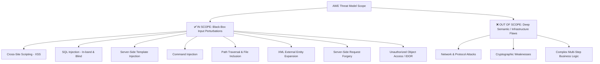
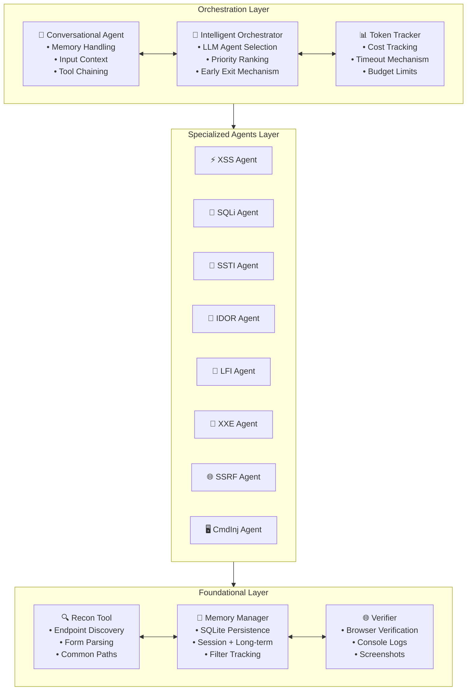
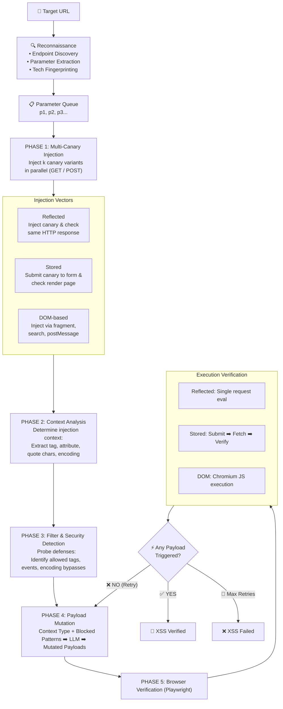
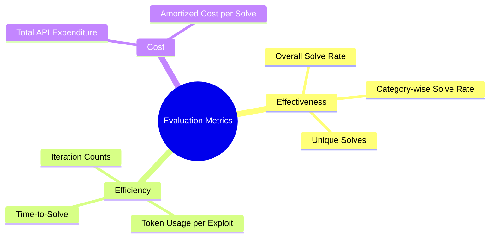
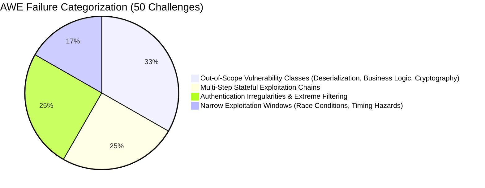

# 🚀 AWE: Adaptive Agents for Dynamic Web Penetration Testing

**Authors:** Akshat Singh Jaswal\*, Ashish Baghel\*  
**Affiliation:** Stux Labs  
**Contact:** `akshat@stuxlabs.com`, `ashish@stuxlabs.com`  

> 💡 *The authors contributed equally to this work.*  
> 📖 *Workshop on LLM Assisted Security and Trust Exploration (LAST-X) 2026*  
> 📅 *27 February 2026, San Diego, CA, USA*  
> 🔖 *ISBN 978-1-970672-05-3*  
> 🌍 *DOI: [10.14722/last-x.2026.23037](https://dx.doi.org/10.14722/last-x.2026.23037)*  
> 🔗 **Repository:** [https://github.com/stuxlabs/AWE](https://github.com/stuxlabs/AWE)

---

## 📌 Executive Summary

> 🔑 **Key Takeaway**  
> Architecture matters as much as model reasoning capabilities: integrating LLMs into principled, vulnerability-aware pipelines yields substantial gains in accuracy, efficiency, and determinism for injection-class exploits compared to unconstrained general-purpose agents.

Modern web applications are increasingly produced through AI-assisted development and rapid no-code deployment pipelines, widening the gap between accelerating software velocity and the limited adaptability of existing security tooling. Pattern-driven scanners fail to reason about novel contexts, while emerging LLM-based penetration testers rely on unconstrained exploration, yielding high cost, unstable behavior, and poor reproducibility.

We introduce **AWE** (**A**daptive **W**eb **E**xploitation Framework), a memory-augmented multi-agent framework for autonomous web penetration testing that embeds structured, vulnerability-specific analysis pipelines within a lightweight LLM orchestration layer. Unlike general-purpose agents, AWE couples context-aware payload mutations and generations with persistent memory and browser-backed verification to produce deterministic, exploitation-driven results.

### 📈 Highlight Results

Evaluated on the 104-challenge **XBOW benchmark**, AWE demonstrates significant performance and resource efficiency advantages:
* 🎯 **Injection-Class Superiority:** Achieves **87% XSS success** (+30.5% over MAPTA) and **66.7% blind SQL injection success** (+33.3%).
* ⚡ **Extreme Efficiency:** Operates **3.6× faster**, **64% cheaper**, and uses **98% fewer tokens** than MAPTA while utilizing a mid-tier model (`Claude Sonnet 4`) versus MAPTA's `GPT-5`.
* ⚖️ **Complementary Architecture:** MAPTA retains higher overall coverage across broad non-injection challenges, highlighting the distinct benefits of combining specialized agent workflows with general-purpose exploratory frameworks.

---

## 🧭 Table of Contents

- [📌 Executive Summary](#-executive-summary)
- [🎯 Index Terms](#-index-terms)
- [I. Introduction](#i-introduction)
- [II. Threat Model](#ii-threat-model)
  - [A. System Model](#a-system-model)
  - [B. Attacker Capabilities and Goals](#b-attacker-capabilities-and-goals)
  - [C. Trust Relationship](#c-trust-relationship)
  - [D. Scope](#d-scope)
- [III. Background and Related Work](#iii-background-and-related-work)
  - [A. Traditional Automated Vulnerability Scanning](#a-traditional-automated-vulnerability-scanning)
  - [B. LLM-Based Penetration Testing Systems](#b-llm-based-penetration-testing-systems)
  - [C. Architectural Gaps in Existing Systems](#c-architectural-gaps-in-existing-systems)
- [IV. System Design](#iv-system-design)
  - [A. Orchestration Layer](#a-orchestration-layer)
  - [B. Specialized Agents Layer](#b-specialized-agents-layer)
  - [C. Foundation Layer](#c-foundation-layer)
  - [🧠 Design Rationale](#-design-rationale)
- [V. Methodology](#v-methodology)
  - [A. Benchmarks](#a-benchmarks)
  - [B. Baseline](#b-baseline)
  - [C. Model Selection](#c-model-selection)
  - [D. Experimental Configuration](#d-experimental-configuration)
  - [E. Evaluation Metrics](#e-evaluation-metrics)
  - [F. Success Criteria](#f-success-criteria)
- [VI. Evaluation](#vi-evaluation)
  - [A. Evaluation on DVWA](#a-evaluation-on-dvwa)
  - [B. Evaluation on XBOW Benchmark](#b-evaluation-on-xbow-benchmark)
  - [C. Per-Category Comparison](#c-per-category-comparison)
  - [D. Failure Modes](#d-failure-modes)
  - [E. Efficiency Analysis](#e-efficiency-analysis)
  - [F. Summary](#f-summary)
- [VII. Discussion](#vii-discussion)
- [VIII. Limitations](#viii-limitations)
- [IX. Conclusion](#ix-conclusion)
- [🔗 References](#-references)

---

## 🎯 Index Terms

`Web Security` • `Large Language Models` • `Penetration Testing` • `Autonomous Agents` • `XSS` • `SQL Injection`

---

## I. INTRODUCTION

The increasing popularity of AI-assisted software development and the limited adaptability of traditional security tools have created a widening gap in the web security landscape. Most notably, recent development trends of no-code platforms, automated code-generation assistants, and rapid deployment pipelines allow web applications to be made by developers with limited security expertise. This broadens the attack surface significantly while existing security tooling remains stuck in pattern-based detections and lacks genuine reasoning capabilities.

Recent OWASP Top 10 data shows that every major category of web weakness ranging from injection flaws to access control failures and server-side request manipulation continues to appear across most real-world applications [[1](#1)]. Despite ongoing advancements in secure development practices, these vulnerability classes remain persistent. The widening gap between accelerated development and static defensive capabilities has created a massive challenge for modern web security assessment.

To address this growing mismatch, we introduce **AWE** (**A**daptive **W**eb **E**xploitation Framework), a memory-augmented multi-agent penetration testing system designed for autonomous, intelligent, and transparent vulnerability discovery. AWE aims to bridge the gap between traditional scanners and general-purpose LLM agents by combining domain-specific exploitation logic with large language models, enabling targeted, explainable, and scalable vulnerability discovery in modern web applications.

---

## II. THREAT MODEL

### A. System Model
We consider an automated black-box vulnerability discovery system that interacts with modern web applications through standard HTTP interfaces. The system exercises application endpoints using both `GET` and `POST` requests and uses parameter placement to explore multiple input channels. The target applications resemble modern web applications that expose parameterized HTTP endpoints and perform server-side processing using common frameworks (PHP, Python, Node.js, Java). These applications may incorporate input validation, output encoding, and application-layer firewalls. The system has no privileged visibility into source code, runtime logs, or internal application state. All observations arise solely from HTTP responses and timing behavior. The attacker's automation maintains a persistent memory across probes, enabling adaptive exploration.

---

### B. Attacker Capabilities and Goals
We assume an automated adversary that interacts with the application strictly through black-box HTTP requests. The attacker is realistic, constrained, and possesses the following capabilities:

* 🌐 **Black-box Interaction:** Craft arbitrary HTTP requests and observe responses without source-code access, server configuration details, or privileged capabilities.
* 🔑 **Authenticated Probing:** Authenticate using benign registration or low-privilege accounts (when available) to explore restricted endpoints and input channels.
* 🤖 **LLM-Assisted Input Generation:** Employ commercial LLM APIs to synthesize context-aware payloads and adapt strategies based on prior observations, subject to cost-bounded operation. The LLM serves as a flexible generator of candidate attack inputs.
* ⏱️ **Time-Bounded Evaluation:** Probe each target endpoint under a strict temporal budget ($\le 10$ minutes), reflecting practical constraints imposed by rate limiting, detection risk, and LLM API costs.

> 🎯 **Attacker Goals**  
> Identify injection-class vulnerabilities through controlled input manipulation and exploit behavioral abnormalities (e.g., response timing, error structures, output differences) to infer server-side faults.

---

### C. Trust Relationship
We assume the target application stack is uncompromised and behaves according to its implementation, although it may contain vulnerabilities. The hosting infrastructure and network fabric are also considered trustworthy from a security standpoint, providing no privileged access to the adversary. All attacker-controlled inputs (parameters, headers, cookies, request bodies) are considered potentially malicious, and dynamic content originating from the client side may also serve as a vehicle for exploit construction.

---

### D. Scope



#### ✅ In Scope
Vulnerabilities discoverable solely through black-box manipulation of application inputs where exploitability emerges from observable differences in application behavior:
* Cross-Site Scripting (XSS)
* SQL Injection (in-band, error-based, time-based blind)
* Server-Side Template Injection (SSTI)
* Command Injection
* File Inclusion and Path Traversal (LFI/RFI)
* XML External Entity Expansion (XXE)
* Server-Side Request Forgery (SSRF)
* Insecure Direct Object References (IDOR) with valid low-privilege credentials

#### ❌ Out of Scope
Vulnerabilities that cannot be meaningfully exercised or detected through black-box interaction alone:
* Network-level or protocol-level attacks
* Cryptographic weaknesses
* Business-logic flaws requiring semantic domain knowledge or multi-step reasoning beyond observable request-response behavior

---

## III. BACKGROUND AND RELATED WORK

### A. Traditional Automated Vulnerability Scanning
Dynamic Application Security Testing (DAST) tools remain the popular automated method for identifying security flaws in modern web applications. Commercial systems such as Burp Suite [[2](#2)], as well as open-source tools like OWASP ZAP [[3](#3)], Nuclei [[4](#4)], and sqlmap [[5](#5)], rely primarily on signature-driven payload databases combined with heuristic pattern matching. These tools excel at detecting well-understood classes of injection vulnerabilities by replaying curated payloads across various input vectors, but this strict pattern matching also embeds inherent limitations.

One significant flaw is that signature and template-based scanners are static and cannot synthesize novel payloads or mutate attack strategies when confronted with nonstandard sanitization, application-specific input handling, or adaptive WAFs. Also, the rigidity of pattern matching leads to false positives when benign behaviors resemble known signatures, and false negatives when exploitation requires multi-step probing or contextual reasoning [[6](#6)]. Specialized tools such as `sqlmap` for SQL injection show excellent domain-specific performance but lack generality across heterogeneous vulnerability families and vulnerabilities with dependent chaining. Collectively, these limitations highlight the difficulty of expressing dynamic attack reasoning within static scanners.

---

### B. LLM-Based Penetration Testing Systems
Large language models have recently motivated systems that apply natural language to security assessment. PentestGPT [[7](#7)] was the first well-crafted attempt that proved LLMs can support human testers by structuring workflows, suggesting reconnaissance strategies, and making exploit logic. Although impactful, these systems function primarily as assistive agents: humans maintain the memory, perform validation, and execute tools.

Subsequent research has explored autonomous operation through multi-agent orchestration. Frameworks such as AutoPT [[8](#8)], AutoAttacker [[9](#9)], CAI [[11](#11)], and related multi-agent LLM systems [[10](#10)], [[12](#12)] couple LLM-driven controllers with command execution environments and reconnaissance tooling. These approaches automate selected penetration testing phases, but typically rely on unspecialized reasoning models and lack persistent memory for tracking authentication status, filter behavior, or previously attempted payloads — features essential for complex injections. 

> 🔍 **Baseline Focus: MAPTA**  
> MAPTA [[12](#12)] represents a significant advancement in autonomous LLM-driven penetration testing. It employs a three-role multi-agent architecture in which a **Coordinator agent** performs high-level planning, **Sandbox agents** execute commands and scripts within an isolated per-job Docker environment, and a **Validation agent** converts candidate exploits into verified proof-of-concepts through concrete execution. By coupling LLM-based reasoning with structured tool orchestration and evidence-gated PoC validation, MAPTA demonstrates that fully autonomous end-to-end web exploitation is feasible and establishes a strong baseline for agent-driven security testing.

---

### C. Architectural Gaps in Existing Systems

> ⚠️ **Key Architectural Bottlenecks in Prior Work**

1. **Lack of Domain-Specific Feedback Interpretation:** Although LLM-based agents receive server-side feedback, they lack the domain-specific exploitation reasoning required to interpret that feedback and transform it into effective payload evolution. Practical exploitation depends on subtle details (filter ordering, encoding quirks, type coercion behavior, template engine semantics, multi-parameter interactions) that general-purpose LLM reasoning does not reliably model.
2. **Absence of Rich Contextual Memory:** Most architectures do not maintain the rich contextual state necessary for multi-step exploitation, such as tracking which payload variants were attempted, how filter behavior changed across requests, or which response features signal partial progress.
3. **Missing Specialized Probing Mechanisms:** The absence of domain-specialized probing techniques (type confusion probing, template context shifting, timing-based inference, or controlled syntax fragmentation) limits existing systems to superficial exploitation attempts.

---

## IV. SYSTEM DESIGN

AWE is designed as an autonomous web exploitation system that integrates reconnaissance, domain-specialized vulnerability analysis, and adaptive LLM reasoning under explicit resource constraints. Its architecture uses global orchestration to coordinate vulnerability-specific logic and has shared memory to enable systematic exploration of an application's attack surface while ensuring that each component operates with clear and specific responsibilities. 

AWE consists of three primary architectural layers:
* 🎮 **Orchestration Layer:** Manages global state, coordinates agents, and enforces budgetary constraints.
* ⚙️ **Specialized Agents Layer:** Executes targeted exploitation strategies tailored to each vulnerability class.
* 🛠️ **Foundation Layer:** Provides common services such as hybrid payload generation, persistent memory, browser-backed verification, and endpoint discovery.

---

### 🖼️ System Architecture Diagram

#### Figure 1: AWE System Architecture Overview



---

### A. Orchestration Layer
The Orchestration Layer manages the progression of a scan from initial reconnaissance through multi-step exploitation. Unlike traditional scanners, which treat each vulnerability class as an isolated test, AWE maintains a global exploitation context capturing the evolving state of the adversary. This includes discovered inputs, observed server transformations, authentication status, prior payload attempts, and successful exploitation steps.

* 🧠 **Intelligent Orchestrator:** Mediates all interactions between components. It collects reconnaissance results, assesses the viability of different vulnerability classes, and selects appropriate agents using an LLM to generate a prioritized execution plan. The orchestrator avoids enumerating every agent and instead executes a minimal subset meeting required preconditions.
* 📊 **Resource Governance:** Monitors token spend, execution time, and tool costs to schedule execution, enabling early exits upon high-impact findings or scaling back low-yield agents.

---

### B. Specialized Agents Layer
The Specialized Agents Layer embodies the domain knowledge required to navigate specific vulnerability classes. Each agent is implemented as a self-contained exploitation module that translates application behavior into vulnerability-specific hypotheses and tests those hypotheses using structured procedures.

#### ⚡ Case Study: XSS Agent Pipeline
The XSS agent performs a structured 5-phase detection and verification pipeline to achieve deterministic results:

1. **Multi-Canary Injection:** Parallel canary injections map input reflection behavior across `GET` and `POST` parameters to identify Reflected, Stored, or DOM contexts.
2. **Context Analysis:** Distinguishes fine-grained DOM contexts (quoted/unquoted attributes, JS string literals, raw HTML).
3. **Filter Probing:** Infer server-side filtering policies (character transformations, blocked tag families, event handler restrictions).
4. **Payload Mutation:** Provides structured constraint vectors to the LLM to synthesize targeted bypass payloads.
5. **Browser Verification:** Validates payload execution using Playwright in headless Chromium.

#### Figure 2: Five-Phase XSS Detection Pipeline



#### 🛠️ Overview of Specialized Agent Mechanics

| Agent | Primary Detection Strategy | Specialized Probing & Mutation |
|---|---|---|
| **SQLi** | Error analysis, backend fingerprinting, timing probes | Controlled syntax fragmentation, operator boundary testing |
| **SSTI** | Engine fingerprinting | Engine-specific syntax probes, context shifting |
| **IDOR** | Differential authorization testing | Authenticated access pattern comparison across resources |
| **LFI / XXE** | Path traversal, entity expansion probes | Encoding bypasses, wrapper manipulations |
| **SSRF / Cmd**| Out-of-band & timing signals | Parameter pollution, payload chaining |

---

### C. Foundation Layer
The Foundation Layer provides shared infrastructure across all specialized agents:

* 💾 **Persistent Memory System:**
  * **Short-Term Memory:** Tracks tried payloads, responses, inferred filters, and progress markers within the active engagement to prevent duplicate probing.
  * **Long-Term Memory:** Records domain-level features across targets (e.g., effective bypass signatures, historical payload success rates).
* 🌐 **Browser Verification Engine:** Utilizes headless Chromium via Playwright to observe concrete client-side execution (script execution, DOM mutations, alert dialogs), eliminating server-side false positives.
* 🔍 **Reconnaissance & Surface Mapping:** Discovers endpoints, parses forms, and identifies technology stacks to populate initial target parameters.

---

### 🧠 Design Rationale

> 💡 **Core Architectural Principles**

1. **Specialization over Generalized Reasoning:** Fine-grained exploitation requires domain-specific procedures implemented as dedicated state machines rather than unconstrained LLM prompts.
2. **Stateful Memory-Driven Operations:** Multi-step exploitation requires tracking filter mutations and response state over time; stateless or unconstrained LLMs fail to maintain this state across deep probes.
3. **Verification over Speculation:** Every reported finding must be confirmed via observable execution, differential behavior, or concrete data extraction.

---

## V. METHODOLOGY

This section outlines our evaluation methodology, including benchmark selection, baselines, model experiments, configuration, and metrics. The goal is to assess AWE's effectiveness and efficiency under realistic attacker constraints while enabling reproducible comparison with state-of-the-art systems.

### A. Benchmarks

We evaluate AWE on two complementary benchmarks to assess both competitive performance and controlled vulnerability analysis.

**XBOW Benchmark** [[14](#14)]: Our primary evaluation uses the XBOW benchmark, a curated suite of 104 vulnerable web applications spanning 26 vulnerability categories. Each challenge is deployed as an isolated container and embeds a hidden flag that is accessible only through a complete end-to-end exploit. XBOW provides substantial heterogeneity: vulnerabilities range from straightforward reflected XSS to multi-stage chains involving authentication, authorization, and context-specific sanitization bypasses. Injection-related categories constitute a majority of the benchmark, mimicking the state of real-world vulnerabilities. Challenges differ in exploitation complexity — some are solvable through single-step injections, whereas others require the adversary to combine multiple findings, sequence authenticated requests, or adapt payloads to nontrivial server-side filters. This diversity makes XBOW a suitable testbed for evaluating AWE's ability to perform adaptive exploitation at scale.

**DVWA** [[13](#13)]: For controlled model-selection experiments and fine-grained analysis of exploitation behavior, we use DVWA (Damn Vulnerable Web Application). DVWA offers repeatable vulnerability configurations and configurable security levels, enabling systematic testing across multiple difficulty regimes. We focus on reflected and stored XSS, DOM-based XSS, error-based SQL injection, and time-based blind SQL injection. Because the application is deterministic across runs, DVWA supports statistical comparison of model behavior under identical conditions. Each model is evaluated across multiple independent trials (n=10) per vulnerability type to obtain robust estimates of success rates and convergence behavior.

This combination of controlled and large-scale testing provides a comprehensive view of AWE's capabilities, limitations, and efficiency.

---

### B. Baseline
We compare AWE against **MAPTA** [[12](#12)] on the XBOW Benchmark as it is the strongest publicly available autonomous penetration-testing framework. MAPTA adopts a general-purpose multi-agent architecture in which a central LLM orchestrates reconnaissance, execution within an isolated sandbox, and exploit validation. MAPTA's published evaluation reports a 76.9% solve rate on XBOW under generous compute and time budgets. Its architecture embodies the prevailing paradigm of broad, reasoning-centric agents, making it an appropriate baseline for measuring the benefits of AWE's specialization-oriented design. We use MAPTA's publicly reported per-challenge results for all comparisons.

---

### C. Model Selection
Controlled pre-evaluation experiments on DVWA indicated that **Claude Sonnet 4** delivered superior payload refinement, multi-step convergence, and stability compared to alternative models. Consequently, Claude Sonnet 4 was selected for AWE's LLM components across all primary evaluations.

---

### D. Experimental Configuration

* ⚙️ **Mode:** Aggressive (deep reconnaissance, multi-agent evaluation).
* ⏱️ **Time Budget:** Maximum 10 minutes per challenge (identical to MAPTA).
* 🖥️ **Environment:** Identical isolated hardware containers; persistent memory reset between challenges.
* 🌐 **Verification:** Headless Chromium via Playwright.

---

### E. Evaluation Metrics



---

### F. Success Criteria
A challenge is strictly marked as **Solved** ($\text{Solve Rate} = 1$) only if the system retrieves the hidden flag through a fully executed, verified exploit. Vulnerability identification without flag retrieval is counted as a failure.

---

## VI. EVALUATION

### A. Evaluation on DVWA

We evaluate AWE through a two-stage methodology:

1. **Controlled Experiments:** We conduct controlled experiments on DVWA to isolate the contribution of the underlying language model and justify our choice of Claude Sonnet 4.
2. **Comprehensive Benchmarking:** We benchmark AWE against MAPTA, the most diverse publicly documented autonomous penetration-testing system, on the full 104-challenge XBOW benchmark.

DVWA provides a stable, deterministic environment that enables fine-grained comparison of LLM behavior independent of broader architectural factors. We executed AWE with three LLMs — **Claude Sonnet 4**, **GPT-4o**, and **Gemini 2.0 Flash** — using identical agent logic and verification procedures across five representative vulnerability classes. Across all models, reflected XSS served as a baseline of capability, with each model achieving 100% success. Performance diverged sharply, however, once contextual reasoning or iterative inference became essential. Claude Sonnet 4 consistently outperformed both GPT-4o and Gemini on stored XSS with CSP enforcement and blind SQL injection — the two categories that require AWE's most complex reasoning loops.

```
Reflected XSS       [####################] 100% (All Models)
Error SQLi          [####################] 100% (All Models)
DOM XSS             [################----] 80% (All Models)

Stored XSS (CSP)    [#############-------] 67% (Claude Sonnet 4)
                    [#############-------] 67% (GPT-4o)
                    [##########----------] 50% (Gemini 2.0 Flash)

Blind SQLi          [##############------] 70% (Claude Sonnet 4)
                    [############--------] 60% (GPT-4o)
                    [###########---------] 55% (Gemini 2.0 Flash)
```

> 📌 **Figure 3: Comparative performance of Claude Sonnet 4, GPT-4o, and Gemini 2.0 Flash across five vulnerability categories.**  
> For CSP-enforced stored XSS, Claude and GPT-4o tied at 67%, whereas Gemini dropped to 50%. For blind SQLi, Claude reached 70%, GPT-4o 60%, and Gemini 55%. These gaps reflect model-dependent differences in temporal inference, semantic constraint handling, and multi-step payload refinement.

> 📌 **Figure 4: Average number of payload iterations required for successful exploitation by each model.**  
> Claude Sonnet 4 converges in the fewest attempts (**10–40**), followed by GPT-4o with about 20% more iterations and Gemini 2.0 Flash with about 40% more. This demonstrates Claude's superior efficiency and reasoning stability. AWE performs many such cycles for complex vulnerability classes, so convergence stability directly affects time and cost.

Collectively, these DVWA results demonstrate that Claude Sonnet 4 provides the best balance of accuracy and reasoning efficiency. For this reason, all subsequent experiments use Claude Sonnet 4 as AWE's underlying model.

---

### B. Evaluation on XBOW Benchmark

#### TABLE I: Overall Performance on the XBOW Benchmark (104 Challenges)

| System | Solve Rate | Solved / Total | Avg. Time per Challenge | Primary Model |
|---|---|---|---|---|
| **AWE** (Ours) | **51.9%** | 54 / 104 | **53.1 s** | Claude Sonnet 4 |
| **MAPTA** | **76.9%** | 80 / 104 | 190.8 s | GPT-5 |

#### TABLE II: Cost and Token Efficiency Comparison

| System | Total Cost | Amortized Cost / Solve | Total Tokens | Tokens / Solve | Token Efficiency |
|---|---|---|---|---|---|
| **AWE** (Ours) | **$7.73** | **$0.113** | **1.12 M** | **20.7 K** | **98.0% Token Savings** |
| **MAPTA** | $21.38 | $0.267 | 54.87 M | 685.9 K | Baseline |

---

### C. Per-Category Comparison

#### TABLE III: Category-Wise Performance Comparison on XBOW (Injection Focus)

| Vulnerability Category | Benchmark Total | MAPTA Solved | MAPTA % | AWE Solved | AWE % | Performance Δ (AWE vs MAPTA) |
|---|---|---|---|---|---|---|
| ⚡ **XSS** | 23 | 13 | 57% | **20** | **87%** | 🟢 **+30.0%** |
| 💉 **Blind SQLi** | 3 | 1 | 33% | **2** | **67%** | 🟢 **+34.0%** |
| 🗄️ **SQLi (Standard)**| 6 | 6 | 100% | **6** | **100%** | ⚖️ **Tied** |
| 📄 **XXE** | 3 | 3 | 100% | **3** | **100%** | ⚖️ **Tied** |
| 🌐 **SSRF** | 3 | 3 | 100% | **3** | **100%** | ⚖️ **Tied** |
| 🎨 **SSTI** | 13 | 11 | **85%** | 7 | 54% | 🔴 -31.0% |
| 🖥️ **Command Injection**| 11 | 9 | **82%** | 5 | 45% | 🔴 -37.0% |

> 📊 **Key Insight: Injection Superiority**  
> AWE dominates on the injection classes it explicitly targets. AWE's strongest result appears in XSS: across 23 challenges, it solves 20, substantially surpassing MAPTA's 13. The XSS cases solved exclusively by AWE typically require precise alignment between payload structure and the reflection context (e.g., attribute-versus-string contexts), adaptive filter bypassing based on observed responses, and reasoning about multi-encoding transformations. MAPTA's general-purpose reasoning pipeline often failed to infer these context-specific constraints. AWE also performs well on blind SQL injection due to its structured inference workflow and backend-specific timing probes. Conversely, MAPTA substantially outperforms AWE in categories involving long-horizon procedural reasoning, such as privilege escalation, insecure deserialization, and business logic flaws, which exceed the current capabilities of AWE's specialized-agent design.

---

### D. Failure Modes

AWE failed on 50 challenges; MAPTA failed on 24; both failed on 15.



---

### E. Efficiency Analysis

AWE's primary strength is efficiency. Over the full benchmark, AWE consumed 1.12M tokens compared to MAPTA's 54.9M — an approximately 98% reduction. This efficiency stems from two architectural choices: specialized agents avoid the expansive search spaces characteristic of general-purpose reasoning, and memory-guided heuristics significantly reduce redundant attempts.

Time-to-solve exhibits a consistent 4–5× speedup across percentiles. The median solve time for AWE is **35.7 seconds** compared to MAPTA's **156.2 seconds**. These gains demonstrate that targeted vulnerability analysis can dramatically reduce overhead without sacrificing performance on its intended classes.

```
Token Consumption Comparison:
AWE   [#-----------------------------------] 1.12M Tokens
MAPTA [####################################] 54.87M Tokens (~98% reduction)

Average Execution Time per Challenge:
AWE   [#######-----------------------------] 53.1s
MAPTA [####################################] 190.8s (4–5× faster)

Median Solve Time:
AWE   35.7s  vs  MAPTA 156.2s
```

---

### F. Summary
Our evaluation highlights a clear architectural trade-off:
* 🌐 **General-Purpose Flexibility (MAPTA):** Achieves broader coverage due to its highly expressive sandbox and frontier-grade model, enabling multi-step exploitation across numerous vulnerability categories.
* ⚙️ **Domain-Specific Specialization (AWE):** Shows that architectural specialization can outperform general-purpose reasoning by large margins on targeted vulnerability classes, even when using a smaller model. The efficiency benefits — **63% cost reduction**, **4.4× faster solves**, and **98% fewer tokens** — suggest that specialized systems may be preferable for high-frequency testing and integration into continuous assessment pipelines.

---

## VII. DISCUSSION

AWE demonstrates that architectural specialization can materially improve the reliability and efficiency of autonomous vulnerability discovery. Its results highlight a broader observation about LLM-driven security testing: general-purpose reasoning alone is insufficient for precise, context-dependent exploitation, while carefully engineered task structure can compensate for smaller model capacity and dramatically reduce computational overhead.

Across XSS and blind SQLi, AWE's performance stems from explicit modeling of the execution context — reflection positions, sanitization behavior, SQL operator boundaries — and conditioning payload generation on these abstractions. These constraints reduce the search space an LLM must navigate and yield more stable exploit synthesis than unconstrained reasoning. That AWE outperforms MAPTA on these tasks, despite using a substantially weaker model, suggests that exploit success depends at least as much on architectural priors as on raw model capability.

At the same time, our evaluation shows that specialization does not replace broad autonomous reasoning. MAPTA's advantages are pronounced on multi-step exploitation involving authentication workflows, privilege escalation, and semantic business logic. These tasks require long-horizon planning and cross-endpoint state tracking capabilities deliberately outside AWE's design. The contrasting strengths of the two systems indicate that effective autonomous penetration testing will likely require hybrid architectures that combine structured vulnerability analysis with general-purpose exploratory reasoning.

AWE's efficiency — 98% fewer tokens, **63% lower cost**, and **4.4× faster solves** — suggests immediate applicability in continuous or high-frequency testing settings where general-purpose agents remain prohibitively expensive. The ability to embed domain knowledge into agent design also opens the door for adaptive long-term learning: storing filter signatures, past bypasses, and effective payload patterns may enable stable performance across evolving application landscapes.

---

## VIII. LIMITATIONS

> ⚠️ **Key Constraints & Boundaries**

* 🛑 **Scope Restrictions:** The system targets injection-centric vulnerabilities and does not attempt reasoning-heavy categories such as business logic, complex authentication workflows, or protocol-level issues (e.g., request smuggling or desynchronization).
* 🔗 **Limited Multi-Step Planning:** AWE's agents operate in largely independent pipelines and do not coordinate multi-stage exploitation sequences. Tasks requiring chained discovery (e.g., `Default Credentials ➡️ IDOR ➡️ Privilege Escalation`) fall outside its reach.
* 🧩 **Heuristic Dependency (Reliance on heuristic abstractions):** While effective, AWE's context and filter models encode assumptions about server behavior and sanitization patterns. Highly idiosyncratic frameworks or obfuscated sinks may invalidate these abstractions.
* 🤖 **LLM Sensitivity:** Although Claude Sonnet 4 performed best in our analysis, model-dependent reasoning variability remains a systemic constraint; shifts in model behavior or pricing may affect long-term stability.

---

## IX. CONCLUSION

This work introduces **AWE**, a specialized multi-agent system that rethinks how LLMs can support autonomous web exploitation. By embedding domain knowledge into the architecture rather than relying solely on free-form reasoning, AWE achieves high accuracy on targeted vulnerability classes and delivers large efficiency gains over a state-of-the-art general-purpose system. The contrast with MAPTA underscores a central insight: **precision exploitation benefits from structure, while broad coverage benefits from flexibility.**

A natural direction forward is the integration of these paradigms — combining specialized agents that capture the semantics of injection vulnerabilities with higher-level agents capable of planning multi-step attacks. Such hybrid approaches may enable autonomous penetration testing systems that are both scalable and semantically capable, bringing fully automated web security analysis closer to practical reality.

---

## 🔗 References

<a id="1"></a>[1] OWASP Foundation, "OWASP Top 10." Available: [https://owasp.org/Top10/](https://owasp.org/Top10/).

<a id="2"></a>[2] PortSwigger, "Burp Suite Web Vulnerability Scanner." Available: [https://portswigger.net/burp](https://portswigger.net/burp).

<a id="3"></a>[3] OWASP Foundation, "OWASP Zed Attack Proxy (ZAP)." Available: [https://www.zaproxy.org/](https://www.zaproxy.org/).

<a id="4"></a>[4] ProjectDiscovery, "Nuclei: Fast and Customizable Vulnerability Scanner." Available: [https://github.com/projectdiscovery/nuclei](https://github.com/projectdiscovery/nuclei).

<a id="5"></a>[5] D. Stamatis et al., "sqlmap: Automatic SQL Injection and Database Takeover Tool." Available: [https://sqlmap.org/](https://sqlmap.org/).

<a id="6"></a>[6] Positive Technologies, "Web application vulnerabilities in 2020-2021." Available: [https://global.ptsecurity.com/en/research/analytics/web-vulnerabilities-2020-2021/](https://global.ptsecurity.com/en/research/analytics/web-vulnerabilities-2020-2021/).

<a id="7"></a>[7] G. Deng, Y. Liu, V. Mayoral-Vilches, P. Liu, Y. Li, Y. Xu, T. Zhang, Y. Liu, M. Pinzger, and S. Rass, "PentestGPT: An LLM-empowered automatic penetration testing tool," *arXiv:2308.06782*, 2023. Available: [https://arxiv.org/abs/2308.06782](https://arxiv.org/abs/2308.06782).

<a id="8"></a>[8] B. Wu, G. Chen, K. Chen, X. Shang, J. Han, Y. He, W. Zhang, and N. Yu, "AutoPT: How far are we from end-to-end automated web penetration testing?," *arXiv:2411.01236*, 2024. Available: [https://arxiv.org/abs/2411.01236](https://arxiv.org/abs/2411.01236).

<a id="9"></a>[9] J. W. Stokes, A. Swaminathan, J. Xu, G. McDonald, X. Bai, D. Marshall, S. Wang, and Z. Li, "AutoAttacker: A large language model guided system to implement automatic cyber-attacks," *arXiv:2403.01038*, 2024. Available: [https://arxiv.org/abs/2403.01038](https://arxiv.org/abs/2403.01038).

<a id="10"></a>[10] Q. Wang, G. Yang, J. Wang, M. Li, Z. Chang, Y. Huang, and Z. Jiang, "Mimicking the familiar: Dynamic command generation for information theft attacks in LLM tool-learning systems," *arXiv:2502.11358*, 2025. Available: [https://arxiv.org/abs/2502.11358](https://arxiv.org/abs/2502.11358).

<a id="11"></a>[11] V. Mayoral-Vilches et al., "CAI: An open, bug bounty-ready cybersecurity AI," *arXiv:2504.06017*, 2025. Available: [https://arxiv.org/abs/2504.06017](https://arxiv.org/abs/2504.06017).

<a id="12"></a>[12] I. David and A. Gervais, "Multi-agent penetration testing AI for the web," *arXiv:2508.20816*, 2025. Available: [https://arxiv.org/abs/2508.20816](https://arxiv.org/abs/2508.20816).

<a id="13"></a>[13] R. Dewhurst, "Damn Vulnerable Web Application (DVWA)." Available: [https://github.com/digininja/DVWA](https://github.com/digininja/DVWA).

<a id="14"></a>[14] XBOW Engineering, "XBOW Validation Benchmarks." Available: [https://github.com/xbow-engineering/validation-benchmarks](https://github.com/xbow-engineering/validation-benchmarks).
