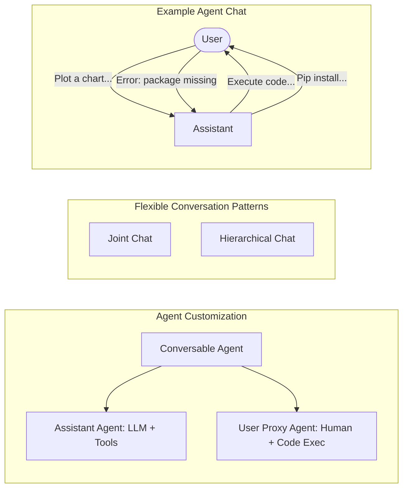
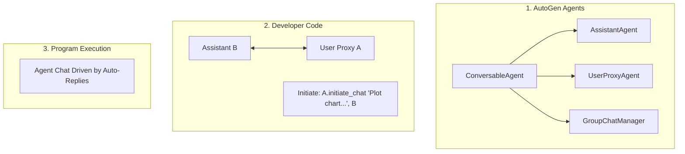

# AutoGen: Enabling Next-Gen LLM Applications via Multi-Agent Conversation

**Authors:** Qingyun Wu, Gagan Bansal, Jieyu Zhang, Yiran Wu, Beibin Li, Erkang Zhu, Li Jiang, Xiaoyun Zhang, Shaokun Zhang, Jiale Liu, Ahmed Awadallah, Ryen W. White, Doug Burger\*, Chi Wang\*

**Affiliations:** Microsoft Research, Pennsylvania State University, University of Washington, Xidian University  
*\*Corresponding author. Email: auto-gen@outlook.com*

**Source Code:** [https://github.com/microsoft/autogen](https://github.com/microsoft/autogen)

---

## 📑 Table of Contents

- [Abstract](#abstract)
- [1. Introduction](#1-introduction)
- [2. The AutoGen Framework](#2-the-autogen-framework)
  - [2.1 Conversable Agents](#21-conversable-agents)
  - [2.2 Conversation Programming](#22-conversation-programming)
- [3. Applications of AutoGen](#3-applications-of-autogen)
  - [A1: Math Problem Solving](#-a1-math-problem-solving)
  - [A2: Retrieval-Augmented Code Generation and Question Answering](#-a2-retrieval-augmented-code-generation-and-question-answering)
  - [A3: Decision Making in Text World Environments](#-a3-decision-making-in-text-world-environments)
  - [A4: Multi-Agent Coding](#-a4-multi-agent-coding)
  - [A5: Dynamic Group Chat](#-a5-dynamic-group-chat)
  - [A6: Conversational Chess](#-a6-conversational-chess)
- [4. Discussion](#4-discussion)
- [References](#references)
- [Appendix A: Related Work](#appendix-a-related-work)
- [Appendix B: Expanded Discussion](#appendix-b-expanded-discussion)
  - [B.1 General Guidelines for Using AutoGen](#b1-general-guidelines-for-using-autogen)
  - [B.2 Future Work](#b2-future-work)
- [Appendix C: Default System Message for Assistant Agent](#appendix-c-default-system-message-for-assistant-agent)
- [Appendix D: Application Details](#appendix-d-application-details)
  - [A1: Math Problem Solving](#a1-math-problem-solving)
  - [A2: Retrieval-Augmented Code Generation and Question Answering](#a2-retrieval-augmented-code-generation-and-question-answering)
  - [A3: Decision Making in Text World Environments](#a3-decision-making-in-text-world-environments)
  - [A4: Multi-Agent Coding](#a4-multi-agent-coding)
  - [A5: Dynamic Group Chat](#a5-dynamic-group-chat)
  - [A6: Conversational Chess](#a6-conversational-chess)
  - [A7: Online Decision Making for Browser Interactions](#a7-online-decision-making-for-browser-interactions)
- [Appendix E: Example Outputs from Applications](#appendix-e-example-outputs-from-applications)


---

## 🚀 Abstract

**AutoGen** is an open-source framework that allows developers to build LLM applications via multiple agents that can converse with each other to accomplish tasks. AutoGen agents are customizable, conversable, and can operate in various modes that employ combinations of LLMs, human inputs, and tools. 

Using AutoGen, developers can also flexibly define agent interaction behaviors. Both natural language and computer code can be used to program flexible conversation patterns for different applications. AutoGen serves as a generic framework for building diverse applications of various complexities and LLM capacities. 

> 📊 **Empirical Studies**  
> Empirical studies demonstrate the effectiveness of the framework in many example applications, with domains ranging from mathematics, coding, question answering, operations research, online decision-making, entertainment, etc.

---

## 1. Introduction

Large language models (LLMs) are becoming a crucial building block in developing powerful agents that utilize LLMs for reasoning, tool usage, and adapting to new observations in many real-world tasks. Given the expanding tasks that could benefit from LLMs and the growing task complexity, an intuitive approach to scale up the power of agents is to use multiple agents that cooperate. Prior work suggests that multiple agents can help encourage divergent thinking, improve factuality and reasoning, and provide validation. 

In light of the intuition and early evidence of promise, it is intriguing to ask the following question: *how can we facilitate the development of LLM applications that could span a broad spectrum of domains and complexities based on the multi-agent approach?*

### 🧠 The Role of Multi-Agent Conversations

Our insight is to use multi-agent conversations to achieve it. There are at least three reasons confirming its general feasibility and utility thanks to recent advances in LLMs: 

1. **Feedback Incorporation:** Because chat-optimized LLMs (e.g., GPT-4) show the ability to incorporate feedback, LLM agents can cooperate through conversations with each other or human(s), e.g., a dialog where agents provide and seek reasoning, observations, critiques, and validation. 
2. **Modular Capabilities:** Because a single LLM can exhibit a broad range of capabilities (especially when configured with the correct prompt and inference settings), conversations between differently configured agents can help combine these broad LLM capabilities in a modular and complementary manner. 
3. **Task Decomposition:** LLMs have demonstrated ability to solve complex tasks when the tasks are broken into simpler subtasks. Multi-agent conversations can enable this partitioning and integration in an intuitive manner.

### Addressing Key Questions

How can we leverage the above insights and support different applications with the common requirement of coordinating multiple agents, potentially backed by LLMs, humans, or tools exhibiting different capacities? We desire a multi-agent conversation framework with generic abstraction and effective implementation that has the flexibility to satisfy different application needs. 

Achieving this requires addressing two critical questions:
1. **How can we design individual agents that are capable, reusable, customizable, and effective in multi-agent collaboration?**
2. **How can we develop a straightforward, unified interface that can accommodate a wide range of agent conversation patterns?**

In practice, applications of varying complexities may need distinct sets of agents with specific capabilities, and may require different conversation patterns, such as single- or multi-turn dialogs, different human involvement modes, and static vs. dynamic conversation. Moreover, developers may prefer the flexibility to program agent interactions in natural language or code. Failing to adequately address these two questions would limit the framework's scope of applicability and generality.

### 🌟 Introducing AutoGen

While there is contemporaneous exploration of multi-agent approaches, we present AutoGen, a generalized multi-agent conversation framework, based on the following new concepts:

1. **Customizable and Conversable Agents:** AutoGen uses a generic design of agents that can leverage LLMs, human inputs, tools, or a combination of them. The result is that developers can easily and quickly create agents with different roles (e.g., agents to write code, execute code, wire in human feedback, validate outputs, etc.) by selecting and configuring a subset of built-in capabilities. The agent's backend can also be readily extended to allow more custom behaviors. To make these agents suitable for multi-agent conversation, every agent is made conversable — they can receive, react, and respond to messages. When configured properly, an agent can hold multiple turns of conversations with other agents autonomously or solicit human inputs at certain rounds, enabling human agency and automation. The conversable agent design leverages the strong capability of the most advanced LLMs in taking feedback and making progress via chat and also allows combining capabilities of LLMs in a modular fashion. *(Section 2.1)*

2. **Conversation Programming:** A fundamental insight of AutoGen is to simplify and unify complex LLM application workflows as multi-agent conversations. So AutoGen adopts a programming paradigm centered around these inter-agent conversations. We refer to this paradigm as conversation programming, which streamlines the development of intricate applications via two primary steps:
    1. Defining a set of conversable agents with specific capabilities and roles.
    2. Programming the interaction behavior between agents via conversation-centric computation and control.
    
    Both steps can be achieved via a fusion of natural and programming languages to build applications with a wide range of conversation patterns and agent behaviors. AutoGen provides ready-to-use implementations and also allows easy extension and experimentation for both steps. *(Section 2.2)*

> **Figure 1: AutoGen enables diverse LLM-based applications using multi-agent conversations.**  
> *(Left)* AutoGen agents are conversable, customizable, and can be based on LLMs, tools, humans, or even a combination of them. *(Top-middle)* Agents can converse to solve tasks. *(Right)* They can form a chat, potentially with humans in the loop. *(Bottom-middle)* The framework supports flexible conversation patterns (Joint chat, Hierarchical chat).



AutoGen also provides a collection of multi-agent applications created using conversable agents and conversation programming. These applications demonstrate how AutoGen can easily support applications of various complexities and LLMs of various capabilities. Moreover, we perform both evaluation on benchmarks and a pilot study of new applications. The results show that AutoGen can help achieve outstanding performance on many tasks, and enable innovative ways of using LLMs, while reducing development effort.

---

## 2. The AutoGen Framework

To reduce the effort required for developers to create complex LLM applications across various domains, a core design principle of AutoGen is to streamline and consolidate multi-agent workflows using multi-agent conversations. This approach also aims to maximize the reusability of implemented agents. This section introduces the two key concepts of AutoGen: conversable agents and conversation programming.

### 2.1 Conversable Agents

In AutoGen, a conversable agent is an entity with a specific role that can pass messages to send and receive information to and from other conversable agents, e.g., to start or continue a conversation. It maintains its internal context based on sent and received messages and can be configured to possess a set of capabilities, e.g., enabled by LLMs, tools, or human input, etc. The agents can act according to programmed behavior patterns described next.

#### 🛠️ Agent Capabilities Powered by LLMs, Humans, and Tools
Since an agent's capabilities directly influence how it processes and responds to messages, AutoGen allows flexibility to endow its agents with various capabilities. AutoGen supports many common composable capabilities for agents, including:

1. **LLMs:** LLM-backed agents exploit many capabilities of advanced LLMs such as role playing, implicit state inference and progress making conditioned on conversation history, providing feedback, adapting from feedback, and coding. These capabilities can be combined in different ways via novel prompting techniques to increase an agent's skill and autonomy. AutoGen also offers enhanced LLM inference features such as result caching, error handling, message templating, etc., via an enhanced LLM inference layer.
2. **Humans:** Human involvement is desired or even essential in many LLM applications. AutoGen lets a human participate in agent conversation via human-backed agents, which could solicit human inputs at certain rounds of a conversation depending on the agent configuration. The default user proxy agent allows configurable human involvement levels and patterns, e.g., frequency and conditions for requesting human input including the option for humans to skip providing input.
3. **Tools:** Tool-backed agents have the capability to execute tools via code execution or function execution. For example, the default user proxy agent in AutoGen is able to execute code suggested by LLMs, or make LLM-suggested function calls.

#### 🤝 Agent Customization and Cooperation
Based on application-specific needs, each agent can be configured to have a mix of basic back-end types to display complex behavior in multi-agent conversations. AutoGen allows easy creation of agents with specialized capabilities and roles by reusing or extending the built-in agents. 

The `ConversableAgent` class is the highest-level agent abstraction and, by default, can use LLMs, humans, and tools. The `AssistantAgent` and `UserProxyAgent` are two pre-configured `ConversableAgent` subclasses, each representing a common usage mode, i.e., acting as an AI assistant (backed by LLMs) and acting as a human proxy to solicit human input or execute code/function calls (backed by humans and/or tools).

In the example on the right-hand side of Figure 1, an LLM-backed assistant agent and a tool- and human-backed user proxy agent are deployed together to tackle a task. Here, the assistant agent generates a solution with the help of LLMs and passes the solution to the user proxy agent. Then, the user proxy agent solicits human inputs or executes the assistant's code and passes the results as feedback back to the assistant.

By allowing custom agents that can converse with each other, conversable agents in AutoGen serve as a useful building block. However, to develop applications where agents make meaningful progress on tasks, developers also need to be able to specify and mold these multi-agent conversations.

### 2.2 Conversation Programming

As a solution to the above problem, AutoGen utilizes **conversation programming**, a paradigm that considers two concepts: 
1. **Computation**: The actions agents take to compute their response in a multi-agent conversation. 
2. **Control flow**: The sequence (or conditions) under which these computations happen. 

As we will show in the applications section, the ability to program these helps implement many flexible multi-agent conversation patterns. 

In AutoGen, these computations are conversation-centric. An agent takes actions relevant to the conversations it is involved in and its actions result in message passing for consequent conversations (unless a termination condition is satisfied). Similarly, control flow is conversation-driven — the participating agents' decisions on which agents to send messages to and the procedure of computation are functions of the inter-agent conversation. This paradigm helps one to reason intuitively about a complex workflow as agent action taking and conversation message-passing between agents.

> **Figure 2: Illustration of how to use AutoGen to program a multi-agent conversation.**



#### ✨ Design Patterns

AutoGen features the following design patterns to facilitate conversation programming:

1. **Unified Interfaces and Auto-Reply Mechanisms:** Agents in AutoGen have unified conversation interfaces for performing the corresponding conversation-centric computation, including a `send`/`receive` function for sending/receiving messages and a `generate_reply` function for taking actions and generating a response based on the received message. AutoGen also introduces and by default adopts an agent auto-reply mechanism to realize conversation-driven control: Once an agent receives a message from another agent, it automatically invokes `generate_reply` and sends the reply back to the sender unless a termination condition is satisfied. 

2. **Control by Fusion of Programming and Natural Language:** AutoGen allows the usage of programming and natural language in various control flow management patterns: 
   - *Natural-language control via LLMs:* One can control the conversation flow by prompting the LLM-backed agents with natural language. 
   - *Programming-language control:* Python code can be used to specify the termination condition, human input mode, and tool execution logic. 
   - *Control transition between natural and programming language:* AutoGen supports flexible control transition between natural and programming language, e.g., transitioning from code to natural-language control by invoking an LLM inference.

In addition to static conversation with predefined flow, AutoGen also supports dynamic conversation flows with multiple agents via customized `generate_reply` functions, LLM function calls, or the built-in `GroupChatManager`.

---

## 3. Applications of AutoGen

We demonstrate six applications using AutoGen (see Figure 3) to illustrate its potential in simplifying the development of high-performance multi-agent applications. These applications are selected based on their real-world relevance (A1, A2, A4, A5, A6), problem difficulty and solving capabilities enabled by AutoGen (A1, A2, A3, A4), and innovative potential (A5, A6). Together, these criteria showcase AutoGen's role in advancing the LLM-application landscape.

> 💡 **Figure 3: Six examples of diverse applications built using AutoGen.**
> Their conversation patterns show AutoGen's flexibility and power.
> - **A1**: Math Problem Solving
> - **A2**: Retrieval-augmented Chat
> - **A3**: ALF Chat
> - **A4**: Multi-agent Coding
> - **A5**: Dynamic Group Chat
> - **A6**: Conversational Chess

### 🧮 A1: Math Problem Solving

Mathematics is a foundational discipline and the promise of leveraging LLMs to assist with math problem solving opens up a new plethora of applications and avenues for exploration, including personalized AI tutoring, AI research assistance, etc. This section demonstrates how AutoGen can help develop LLM applications for math problem solving, showcasing strong performance and flexibility in supporting various problem-solving paradigms.

- **Scenario 1:** We build a system for autonomous math problem solving by directly reusing two built-in agents from AutoGen. We evaluate our system and several alternative approaches — including Multi-Agent Debate, LangChain ReAct, vanilla GPT-4, ChatGPT + Code Interpreter, and ChatGPT + Plugin (Wolfram Alpha) — on the MATH dataset. Results (Figure 4a) show that AutoGen already yields better performance out of the box compared to alternatives. On **120 level-5 problems**: AutoGen **52.5%**, GPT-4 **45.0%**, Multi-Agent Debate **26.67%**, LangChain ReAct **23.33%**, ChatGPT+Code Interpreter **30.0%**, ChatGPT+Plugin **25.88%**. On the **whole MATH dataset** (5000 problems): AutoGen **69.48%** vs. GPT-4 **55.18%**.
- **Scenario 2:** Human-in-the-loop problem-solving process by setting `human_input_mode='ALWAYS'` in the `UserProxyAgent`. This system can effectively incorporate human inputs to solve challenging problems that cannot be solved without humans.
- **Scenario 3:** A novel scenario where multiple human users (Student, Expert) can participate in conversations during the problem-solving process. Our experiments and case studies show that AutoGen enables better performance or new experience compared to other solutions.

### 🔍 A2: Retrieval-Augmented Code Generation and Question Answering

Retrieval augmentation has emerged as a practical and effective approach for mitigating the intrinsic limitations of LLMs by incorporating external documents. We employ AutoGen to build a Retrieval-Augmented Generation (RAG) system named **Retrieval-augmented Chat**. The system consists of two agents — a Retrieval-augmented User Proxy agent and a Retrieval-augmented Assistant agent — both extended from built-in AutoGen agents. The Retrieval-augmented User Proxy includes a vector database (Chroma, 2023) with SentenceTransformers (Reimers & Gurevych, 2019) as the context retriever.

- **Scenario 1:** Natural question answering on the Natural Questions dataset (Figure 4b). AutoGen introduces a novel **interactive retrieval** feature: whenever retrieved context does not contain the information, the LLM-based assistant replies "Sorry, I cannot find any information about... UPDATE CONTEXT." to invoke more retrieval attempts. Results show: AutoGen **66.65%** F1 vs. AutoGen without interactive retrieval **62.59%** vs. DPR **58.56%**. Approximately **19.4%** of questions trigger an "Update Context" operation.
- **Scenario 2:** Code generation based on a codebase containing code not included in GPT-4's training data. With retrieval-augmented context, GPT-4 correctly generates code using `use_spark` and `force_cancel=True` for the FLAML API (not in its training data).

### 🎮 A3: Decision Making in Text World Environments

We demonstrate how AutoGen can be used to develop effective applications that involve interactive or online decision making, using the ALFWorld benchmark (Shridhar et al., 2021). We implement a two-agent system: an LLM-backed assistant agent (suggesting plans) and an executor agent (executing actions in ALFWorld environments). This system integrates ReAct prompting and achieves similar performance.

A common challenge is occasional inability to leverage commonsense knowledge about the physical world, causing error loops. With AutoGen's modular design, we introduce a **grounding agent** that supplies commonsense knowledge — such as *"You must find and take the object before you can examine it."* — whenever the system shows early signs of recurring errors.

Results on 134 unseen ALFWorld tasks (Figure 4c): introducing the grounding agent brings a **15% performance gain** on average. The 3-agent system (with grounding agent) achieves **69% (avg)** and **77% (best of 3)** overall success rates, vs. the 2-agent system at **54%/63%** and ReAct at **54%/66%**.

### 💻 A4: Multi-Agent Coding

We use AutoGen to build a multi-agent coding system based on OptiGuide (Li et al., 2023a), a system that excels at writing code to interpret optimization solutions. The Commander agent coordinates with two assistant agents — the Writer (crafts code) and the Safeguard (checks code safety). With AutoGen, the core workflow code was **reduced from over 430 lines to 100 lines**.

We also conduct an ablation comparing multi-agent vs. single-agent approaches on a dataset of 100 coding tasks (equal numbers of safe and unsafe). Results (Figure 4d): the multi-agent design boosts the **F-1 score** in identifying unsafe code by **8% (with GPT-4)** and **35% (with GPT-3.5-turbo)**. Specifically: Multi-GPT4 **98%** F1, Single-GPT4 **96%** F1; Multi-GPT3.5 **88%** F1, Single-GPT3.5 **83%** F1; Multi-GPT4 Recall **100%**, Single-GPT4 **78%**; Multi-GPT3.5 **72%**, Single-GPT3.5 **48%** *(recall is particularly critical for detecting unsafe code)*.

### 🔄 A5: Dynamic Group Chat

AutoGen provides native support for a dynamic group chat communication pattern, in which participating agents share the same context and converse in a dynamic manner instead of following a pre-defined order. In AutoGen, the `GroupChatManager` class serves as the conductor of conversation among agents and repeats three steps: dynamically selecting a speaker, collecting responses from the selected speaker, and broadcasting the message. For the dynamic speaker-selection component, we use a role-play style prompt. Through a pilot study on 12 manually crafted complex tasks, we observed that compared to a purely task-based prompt, utilizing a role-play prompt often leads to more effective consideration of both conversation context and role alignment, resulting in a higher success rate and fewer LLM calls. Detailed results are in Appendix D.

### ♟️ A6: Conversational Chess

Using AutoGen, we developed Conversational Chess, a natural language interface game. It features built-in agents for players (human or LLM) and a third-party board agent to provide information and validate moves based on standard rules. AutoGen enabled two essential features: (1) **Natural, flexible, and engaging game dynamics** — supporting AI-AI, AI-human, and human-human gameplay with seamless switching between modes during a single game. (2) **Grounding** — the board agent checks each proposed move for legality; if invalid, it responds with an error, prompting the player agent to re-propose a legal move. As an ablation study, we removed the board agent and relied only on a prompt "you should make sure both you and the opponent are making legal moves." The results highlighted that without the board agent, illegitimate moves caused game disruptions.

---


## 4. Discussion

We introduced an open-source library, AutoGen, that incorporates the paradigms of conversable agents and conversation programming. This library utilizes capable agents that are well-suited for multi-agent cooperation. It features a unified conversation interface among the agents, along with an auto-reply mechanism, which helps establish an agent-interaction interface that capitalizes on the strengths of chat-optimized LLMs with broad capabilities while accommodating a wide range of applications. AutoGen serves as a general framework for creating and experimenting with multi-agent systems that can easily fulfill various practical requirements, such as reusing, customizing, and extending existing agents, as well as programming conversations between them.

Our experiments, as detailed in Section 3, demonstrate that this approach offers numerous benefits. The adoption of AutoGen has resulted in improved performance (over state-of-the-art approaches), reduced development code, and decreased manual burden for existing applications. It offers flexibility to developers, as demonstrated in A1 (scenario 3), A5, and A6, where AutoGen enables multi-agent chats to follow a dynamic pattern rather than fixed back-and-forth interactions. It allows humans to engage in activities alongside multiple AI agents in a conversational manner. Despite the complexity of these applications (most involving more than two agents or dynamic multi-turn agent cooperation), the implementation based on AutoGen remains straightforward. Dividing tasks among separate agents promotes modularity. Furthermore, since each agent can be developed, tested, and maintained separately, this approach simplifies overall development and code management.

Although this work is still in its early experimental stages, it paves the way for numerous future directions and research opportunities. For instance, we can explore effective integration of existing agent implementations into our multi-agent framework and investigate the optimal balance between automation and human control in multi-agent workflows. As we further develop and refine AutoGen, we aim to investigate which strategies, such as agent topology and conversation patterns, lead to the most effective multi-agent conversations while optimizing the overall efficiency, among other factors. While increasing the number of agents and other degrees of freedom presents opportunities for tackling more complex problems, it may also introduce new safety challenges that require additional studies and careful consideration.

We provide more discussion in Appendix B, including guidelines for using AutoGen and direction of future work. We hope AutoGen will help improve many LLM applications in terms of speed of development, ease of experimentation, and overall effectiveness and safety. We actively welcome contributions from the broader community.

### ⚖️ Ethics Statement

There are several potential ethical considerations that could arise from the development and use of the AutoGen framework.

- **Privacy and Data Protection:** The framework allows for human participation in conversations between agents. It is important to ensure that user data and conversations are protected, and that developers use appropriate measures to safeguard privacy.

- **Bias and Fairness:** LLMs have been shown to exhibit biases present in their training data (Navigli et al., 2023). When using LLMs in the AutoGen framework, it is crucial to address and mitigate any biases that may arise in the conversations between agents. Developers should be aware of potential biases and take steps to ensure fairness and inclusivity.

- **Accountability and Transparency:** As discussed in the future work section, as the framework involves multiple agents conversing and cooperating, it is important to establish clear accountability and transparency mechanisms. Users should be able to understand and trace the decision-making process of the agents involved in order to ensure accountability and address any potential issues or biases.

- **Trust and Reliance:** AutoGen leverages human understanding and intelligence while providing automation through conversations between agents. It is important to consider the impact of this interaction on user experience, trust, and reliance on AI systems. Clear communication and user education about the capabilities and limitations of the system will be essential (Cai et al., 2019).

- **Unintended Consequences:** As discussed before, the use of multi-agent conversations and automation in complex tasks may have unintended consequences. In particular, allowing LLM agents to make changes in external environments through code execution or function calls, such as installing packages, could be risky. Developers should carefully consider the potential risks and ensure that appropriate safeguards are in place to prevent harm or negative outcomes.

### 🙏 Acknowledgements

The work presented in this report was made possible through discussions and feedback from Peter Lee, Johannes Gehrke, Eric Horvitz, Steven Lucco, Umesh Madan, Robin Moeur, Piali Choudhury, Saleema Amershi, Adam Fourney, Victor Dibia, Guoqing Zheng, Corby Rosset, Ricky Loynd, Ece Kamar, Rafah Hosn, John Langford, Ida Momennejad, Brian Krabach, Taylor Webb, Shanka Subhra Mondal, Wei-ge Chen, Robert Gruen, Yinan Li, Yue Wang, Suman Nath, Tanakorn Leesatapornwongsa, Xin Wang, Shishir Patil, Tianjun Zhang, Saehan Jo, Ishai Menache, Kontantina Mellou, Runlong Zhou, Feiran Jia, Hamed Khanpour, Hamid Palangi, Srinagesh Sharma, Julio Albinati Cortez, Amin Saied, Yuzhe Ma, Dujian Ding, Linyong Nan, Prateek Yadav, Shannon Shen, Ankur Mallick, Mark Encarnación, Lars Liden, Tianwei Yue, Julia Kiseleva, Anastasia Razdaibiedina, and Luciano Del Corro. Qingyun Wu would like to acknowledge the funding and research support from the College of Information Science and Technology at Penn State University.

---

## References

- Vaibhav Adlakha, Parishad BehnamGhader, Xing Han Lu, Nicholas Meade, and Siva Reddy. Evaluating correctness and faithfulness of instruction-following models for question answering. *arXiv preprint arXiv:2307.16877*, 2023.
- Saleema Amershi, Dan Weld, Mihaela Vorvoreanu, Adam Fourney, Besmira Nushi, Penny Collisson, Jina Suh, Shamsi Iqbal, Paul N Bennett, Kori Inkpen, et al. Guidelines for human-ai interaction. In *Proceedings of the 2019 chi conference on human factors in computing systems*, 2019.
- Dario Amodei, Chris Olah, Jacob Steinhardt, Paul Christiano, John Schulman, and Dan Mané. Concrete problems in ai safety, 2016.
- AutoGPT. Documentation — auto-gpt. https://docs.agpt.co/, 2023.
- BabyAGI. Github — babyagi. https://github.com/yoheinakajima/babyagi, 2023.
- Carrie J. Cai, Samantha Winter, David F. Steiner, Lauren Wilcox, and Michael Terry. "hello ai": Uncovering the onboarding needs of medical practitioners for human-ai collaborative decision-making. *Proceedings of the ACM on Human-Computer Interaction*, 2019.
- Tianle Cai, Xuezhi Wang, Tengyu Ma, Xinyun Chen, and Denny Zhou. Large language models as tool makers. *arXiv preprint arXiv:2305.17126*, 2023.
- Chroma. Chromadb. https://github.com/chroma-core/chroma, 2023.
- Victor Dibia. LIDA: A tool for automatic generation of grammar-agnostic visualizations and infographics using large language models. In *Proceedings of the 61st Annual Meeting of the Association for Computational Linguistics (Volume 3: System Demonstrations)*, Toronto, Canada, July 2023.
- Yihong Dong, Xue Jiang, Zhi Jin, and Ge Li. Self-collaboration code generation via chatgpt. *arXiv preprint arXiv:2304.07590*, 2023.
- Yilun Du, Shuang Li, Antonio Torralba, Joshua B Tenenbaum, and Igor Mordatch. Improving factuality and reasoning in language models through multiagent debate. *arXiv preprint arXiv:2305.14325*, 2023.
- Atty Eleti, Jeff Harris, and Logan Kilpatrick. Function calling and other api updates. https://openai.com/blog/function-calling-and-other-api-updates, 2023.
- Guidance. Guidance. https://github.com/guidance-ai/guidance, 2023.
- Dan Hendrycks, Collin Burns, Saurav Kadavath, Akul Arora, Steven Basart, Eric Tang, Dawn Song, and Jacob Steinhardt. Measuring mathematical problem solving with the math dataset. *arXiv preprint arXiv:2103.03874*, 2021.
- Sirui Hong, Xiawu Zheng, Jonathan Chen, Yuheng Cheng, Ceyao Zhang, Zili Wang, Steven Ka Shing Yau, Zijuan Lin, Liyang Zhou, Chenyu Ran, et al. Metagpt: Meta programming for multi-agent collaborative framework. *arXiv preprint arXiv:2308.00352*, 2023.
- Eric Horvitz. Principles of mixed-initiative user interfaces. In *Proceedings of the SIGCHI conference on Human Factors in Computing Systems*, 1999.
- HuggingFace. Transformers agent. https://huggingface.co/docs/transformers/transformers_agents, 2023.
- Geunwoo Kim, Pierre Baldi, and Stephen McAleer. Language models can solve computer tasks. *arXiv preprint arXiv:2303.17491*, 2023.
- Tom Kwiatkowski, Jennimaria Palomaki, Olivia Redfield, Michael Collins, Ankur Parikh, Chris Alberti, Danielle Epstein, Illia Polosukhin, Jacob Devlin, Kenton Lee, et al. Natural questions: a benchmark for question answering research. *Transactions of the Association for Computational Linguistics*, 2019.
- LangChain. Introduction — langchain. https://python.langchain.com/en/latest/index.html, 2023.
- Mike Lewis, Denis Yarats, Yann N Dauphin, Devi Parikh, and Dhruv Batra. Deal or no deal? end-to-end learning for negotiation dialogues. *arXiv preprint arXiv:1706.05125*, 2017.
- Patrick Lewis, Ethan Perez, Aleksandra Piktus, Fabio Petroni, Vladimir Karpukhin, Naman Goyal, Heinrich Küttler, Mike Lewis, Wen-tau Yih, Tim Rocktäschel, et al. Retrieval-augmented generation for knowledge-intensive nlp tasks. *Advances in Neural Information Processing Systems*, 2020.
- Beibin Li, Konstantina Mellou, Bo Zhang, Jeevan Pathuri, and Ishai Menache. Large language models for supply chain optimization. *arXiv preprint arXiv:2307.03875*, 2023a.
- Guohao Li, Hasan Abed Al Kader Hammoud, Hani Itani, Dmitrii Khizbullin, and Bernard Ghanem. Camel: Communicative agents for "mind" exploration of large scale language model society, 2023b.
- Tian Liang, Zhiwei He, Wenxiang Jiao, Xing Wang, Yan Wang, Rui Wang, Yujiu Yang, Zhaopeng Tu, and Shuming Shi. Encouraging divergent thinking in large language models through multi-agent debate, 2023.
- Evan Zheran Liu, Kelvin Guu, Panupong Pasupat, Tianlin Shi, and Percy Liang. Reinforcement learning on web interfaces using workflow-guided exploration. *arXiv preprint arXiv:1802.08802*, 2018.
- Jerry Liu. LlamaIndex, November 2022. URL https://github.com/jerryjliu/llama_index.
- Volodymyr Mnih, Koray Kavukcuoglu, David Silver, Alex Graves, Ioannis Antonoglou, Daan Wierstra, and Martin Riedmiller. Playing atari with deep reinforcement learning. *arXiv preprint arXiv:1312.5602*, 2013.
- Roberto Navigli, Simone Conia, and Björn Ross. Biases in large language models: Origins, inventory and discussion. *ACM Journal of Data and Information Quality*, 2023.
- OpenAI. ChatGPT plugins. https://openai.com/blog/chatgpt-plugins, 2023.
- Joon Sung Park, Joseph C O'Brien, Carrie J Cai, Meredith Ringel Morris, Percy Liang, and Michael S Bernstein. Generative agents: Interactive simulacra of human behavior. *arXiv preprint arXiv:2304.03442*, 2023.
- Md Rizwan Parvez, Wasi Uddin Ahmad, Saikat Chakraborty, Baishakhi Ray, and Kai-Wei Chang. Retrieval augmented code generation and summarization. *arXiv preprint arXiv:2108.11601*, 2021.
- Shishir G. Patil, Tianjun Zhang, Xin Wang, and Joseph E. Gonzalez. Gorilla: Large language model connected with massive apis. *arXiv preprint arXiv:2305.15334*, 2023.
- Nils Reimers and Iryna Gurevych. Sentence-bert: Sentence embeddings using siamese bert-networks. In *Proceedings of the 2019 Conference on Empirical Methods in Natural Language Processing*, 11 2019.
- Semantic-Kernel. Semantic kernel. https://github.com/microsoft/semantic-kernel, 2023.
- Bokui Shen, Fei Xia, Chengshu Li, Roberto Martín-Martín, Linxi Fan, Guanzhi Wang, Claudia Pérez-D'Arpino, Shyamal Buch, Sanjana Srivastava, Lyne Tchapmi, et al. igibson 1.0: A simulation environment for interactive tasks in large realistic scenes. In *2021 IEEE/RSJ International Conference on Intelligent Robots and Systems (IROS)*. IEEE, 2021.
- Tianlin Shi, Andrej Karpathy, Linxi Fan, Jonathan Hernandez, and Percy Liang. World of bits: An open-domain platform for web-based agents. In *International Conference on Machine Learning*. PMLR, 2017.
- Mohit Shridhar, Xingdi Yuan, Marc-Alexandre Côté, Yonatan Bisk, Adam Trischler, and Matthew Hausknecht. ALFWorld: Aligning Text and Embodied Environments for Interactive Learning. In *Proceedings of the International Conference on Learning Representations (ICLR)*, 2021. URL https://arxiv.org/abs/2010.03768.
- Oriol Vinyals, Timo Ewalds, Sergey Bartunov, Petko Georgiev, Alexander Sasha Vezhnevets, Michelle Yeo, Alireza Makhzani, Heinrich Küttler, John Agapiou, Julian Schrittwieser, et al. Starcraft ii: A new challenge for reinforcement learning. *arXiv preprint arXiv:1708.04782*, 2017.
- Chi Wang, Qingyun Wu, Markus Weimer, and Erkang Zhu. Flaml: A fast and lightweight automl library. *Proceedings of Machine Learning and Systems*, 2021.
- Guanzhi Wang, Yuqi Xie, Yunfan Jiang, Ajay Mandlekar, Chaowei Xiao, Yuke Zhu, Linxi Fan, and Anima Anandkumar. Voyager: An open-ended embodied agent with large language models. *arXiv preprint arXiv:2305.16291*, 2023a.
- Lei Wang, Chen Ma, Xueyang Feng, Zeyu Zhang, Hao Yang, Jingsen Zhang, Zhiyuan Chen, Jiakai Tang, Xu Chen, Yankai Lin, et al. A survey on large language model based autonomous agents. *arXiv preprint arXiv:2308.11432*, 2023b.
- Daniel S. Weld and Oren Etzioni. The first law of robotics (a call to arms). In *AAAI Conference on Artificial Intelligence*, 1994.
- Max Woolf. Langchain problem. https://minimaxir.com/2023/07/langchain-problem/, 2023.
- Yiran Wu, Feiran Jia, Shaokun Zhang, Qingyun Wu, Hangyu Li, Erkang Zhu, Yue Wang, Yin Tat Lee, Richard Peng, and Chi Wang. An empirical study on challenging math problem solving with gpt-4. *arXiv preprint arXiv:2306.01337*, 2023.
- Zhiheng Xi, Wenxiang Chen, Xin Guo, Wei He, Yiwen Ding, Boyang Hong, Ming Zhang, Junzhe Wang, Senjie Jin, Enyu Zhou, et al. The rise and potential of large language model based agents: A survey. *arXiv preprint arXiv:2309.07864*, 2023.
- Shunyu Yao, Jeffrey Zhao, Dian Yu, Nan Du, Izhak Shafran, Karthik Narasimhan, and Yuan Cao. React: Synergizing reasoning and acting in language models. *arXiv preprint arXiv:2210.03629*, 2022.

---

## Appendix A: Related Work


We examine existing LLM-based agent systems or frameworks that can be used to build LLM applications. We categorize the related work into single-agent and multi-agent systems and specifically provide a summary of differentiators comparing AutoGen with existing multi-agent systems in Table 1. Note that many of these systems are evolving open-source projects, so the remarks and statements about them may only be accurate as of the time of writing.

**Single-Agent Systems:**

- **AutoGPT:** AutoGPT is an open-source implementation of an AI agent that attempts to autonomously achieve a given goal. It follows a single-agent paradigm in which it augments the AI model with many useful tools, and does not support multi-agent collaboration.
- **ChatGPT+ (with code interpreter or plugin):** ChatGPT can now be used alongside a code interpreter or plugin (currently available only under the premium subscription plan ChatGPT Plus). The code interpreter enables ChatGPT to execute code, while the plugin enhances ChatGPT with a wide range of curated tools.
- **LangChain Agents:** LangChain is a general framework for developing LLM-based applications. LangChain Agents is a subpackage for using an LLM to choose a sequence of actions. There are various types of agents in LangChain Agents, with the ReAct agent being a notable example. All agents in LangChain Agents follow a single-agent paradigm and are not inherently designed for communicative and collaborative modes.
- **Transformers Agent:** Transformers Agent is an experimental naturally-language API built on the transformers repository. It includes a set of curated tools and an agent to interpret natural language and use these tools. Similar to AutoGPT, it follows a single-agent paradigm and does not support agent collaboration.

AutoGen differs from the single-agent systems above by supporting multi-agent LLM applications.

**Multi-Agent Systems:**

- **BabyAGI:** BabyAGI is an example implementation of an AI-powered task management system. Multiple LLM-based agents are used: an agent for creating new tasks, an agent for prioritizing the task list, and an agent for completing tasks/sub-tasks. As a multi-agent system, BabyAGI adopts a static agent conversation pattern (a predefined order of agent communication), while AutoGen supports both static and dynamic conversation patterns and additionally supports tool usage and human involvement.
- **CAMEL:** CAMEL is a communicative agent framework that demonstrates how role playing can be used to let chat agents communicate with each other for task completion. An Inception-prompting technique is used to achieve autonomous cooperation between agents. Unlike AutoGen, CAMEL does not natively support tool usage, such as code execution, and only supports static conversation patterns.
- **Multi-Agent Debate:** Two recent works investigate and show that multi-agent debate is an effective way to encourage divergent thinking in LLMs and to improve the factuality and reasoning of LLMs. Each agent is simply an LLM inference instance, while no tool or human is involved, and the inter-agent conversation needs to follow a pre-defined order.
- **MetaGPT:** MetaGPT is a specialized LLM application based on a multi-agent conversation framework for automatic software development. They assign different roles to GPTs to collaboratively develop software. They differ from AutoGen by being specialized solutions to a certain scenario, while AutoGen is a generic infrastructure to facilitate building applications for various scenarios.

There are a few other specialized single-agent or multi-agent systems, such as Voyager and Generative Agents, which are skipped due to lower relevance. In Table 1, we summarize differences between AutoGen and the most relevant multi-agent systems.

**Table 1: Summary of differences between AutoGen and other related multi-agent systems.** *infrastructure*: whether the system is designed as a generic infrastructure for building LLM applications. *conversation pattern*: the types of patterns supported. Under 'static', agent topology remains unchanged regardless of different inputs. AutoGen allows flexible conversation patterns, including both static and dynamic patterns. *execution-capable*: whether the system can execute LLM-generated code. *human involvement*: whether (and how) the system allows human participation during the execution process.

| Aspect | AutoGen | Multi-agent Debate | CAMEL | Baby AGI | MetaGPT |
| :--- | :--- | :--- | :--- | :--- | :--- |
| Infrastructure | ✓ | ✗ | ✓ | ✗ | ✗ |
| Conversation pattern | flexible | static | static | static | static |
| Execution-capable | ✓ | ✗ | ✗ | ✗ | ✓ |
| Human involvement | chat/skip | ✗ | ✗ | ✗ | ✗ |

---

## Appendix B: Expanded Discussion

The applications in Section 3 show how AutoGen not only enables new applications but also helps renovate existing ones. For example, in A1 (scenario 3), A5, and A6, AutoGen enabled the creation of multi-agent conversations that follow a dynamic pattern instead of a fixed back-and-forth. And in both A5 and A6, humans can participate in the activities together with multiple other AI agents in a conversational manner. Similarly, A1–A4 show how popular applications can be renovated quickly with AutoGen. Despite the complexity of these applications (most of them involve more than two agents or dynamic multi-turn agent cooperation), our AutoGen-based implementation remains simple, demonstrating promising opportunities to build creative applications and a large space for innovation. In reflecting on why these benefits can be achieved in these applications with AutoGen, we believe there are a few reasons:

- **Ease of use:** The built-in agents can be used out-of-the-box, delivering strong performance even without any customization. (A1, A3)
- **Modularity:** The division of tasks into separate agents promotes modularity in the system. Each agent can be developed, tested, and maintained independently, simplifying the overall development process and facilitating code management. (A3, A4, A5, and A6)
- **Programmability:** AutoGen allows users to extend/customize existing agents to develop systems satisfying their specific needs with ease. (A1–A6). For example, with AutoGen, the core workflow code in A4 is reduced from over 430 lines to 100 lines, for a 4x saving.
- **Allowing human involvement:** AutoGen provides a native mechanism to achieve human participation and/or human oversight. With AutoGen, humans can seamlessly and optionally cooperate with AIs to solve problems or generally participate in the activity. AutoGen also facilitates interactive user instructions to ensure the process stays on the desired path. (A1, A2, A5, and A6)
- **Collaborative/adversarial agent interactions:** Like many collaborative agent systems, agents in AutoGen can share information and knowledge, to complement each other's abilities and collectively arrive at better solutions. (A1, A2, A3, and A4). Analogously, in certain scenarios, some agents are required to work in an adversarial way. Relevant information is shared among different conversations in a controlled manner, preventing distraction or hallucination. (A4, A6). AutoGen supports both patterns, enabling effective utilization and augmentation of LLMs.

### B.1 General Guidelines for Using AutoGen

Below are some recommendations for using agents in AutoGen to accomplish a task.

1. **Consider using built-in agents first.** For example, `AssistantAgent` is pre-configured to be backed by GPT-4, with a carefully designed system message for generic problem-solving via code. The `UserProxyAgent` is configured to solicit human inputs and perform tool execution. Many problems can be solved by simply combining these two agents. When customizing agents for an application, consider the following options: (1) human input mode, termination condition, code execution configuration, and LLM configuration can be specified when constructing an agent; (2) AutoGen supports adding instructions in an initial user message, which is an effective way to boost performance without needing to modify the system message; (3) `UserProxyAgent` can be extended to handle different execution environments and exceptions, etc.; (4) when system message modification is needed, consider leveraging the LLM's capability to program its conversation flow with natural language.

2. **Start with a simple conversation topology.** Consider using the two-agent chat or the group chat setup first, as they can often be extended with the least code. Note that the two-agent chat can be easily extended to involve more than two agents by using LLM-consumable functions in a dynamic way.

3. **Try to reuse built-in reply methods** based on LLM, tool, or human before implementing a custom reply method because they can often be reused to achieve the goal in a simple way (e.g., the built-in agent `GroupChatManager`'s reply method reuses the built-in LLM-based reply function when selecting the next speaker, ref. A5 in Section 3).

4. **When developing a new application with `UserProxyAgent`, start with humans always in the loop**, i.e., `human_input_mode='ALWAYS'`, even if the target operation mode is more autonomous. This helps evaluate the effectiveness of `AssistantAgent`, tuning the prompt, discovering corner cases, and debugging. Once confident with small-scale success, consider setting `human_input_mode='NEVER'`. This enables LLM as a backend, and one can either use the LLM or manually generate diverse system messages to simulate different use cases.

5. **Despite the numerous advantages of AutoGen agents, there could be cases/scenarios where other libraries/packages could help.** For example: (1) For (sub)tasks that do not have requirements for back-and-forth trouble-shooting or multi-agent interaction, a unidirectional pipeline can also be orchestrated with LangChain, LlamaIndex, Guidance, Semantic Kernel, Gorilla, or low-level inference API (`autogen.oai` provides an enhanced LLM inference layer at this level). (2) When existing tools from LangChain etc. are helpful, one can use them as tool backends for AutoGen agents. (3) For specific applications, one may want to leverage agents implemented in other libraries/packages by wrapping those agents as conversable agents in AutoGen. (4) It can be hard to find an optimal operating point among many tunable choices; blackbox optimization packages like `flaml.tune` can be used together with AutoGen to automate such tuning.

### B.2 Future Work

This work raises many research questions and future directions.

**Designing optimal multi-agent workflows:** Creating a multi-agent workflow for a given task can involve many decisions, e.g., how many agents to include, how to assign agent roles and agent capabilities, how the agents should interact with each other, and whether to automate a particular part of the workflow. There may not exist a one-fits-all answer, and the best solution might depend on the specific application. This raises important questions: For what types of tasks and applications are multi-agent workflows most useful? How do multiple agents help in different applications? For a given task, what is the optimal (e.g., cost-effective) multi-agent workflow?

**Creating highly capable agents:** AutoGen can enable the development of highly capable agents that leverage the strengths of LLMs, tools, and humans. Creating such agents is crucial to ensuring that a multi-agent workflow can effectively troubleshoot and make progress on a task. For example, we observed that CAMEL, another multi-agent LLM system, cannot effectively solve problems in most cases primarily because it lacks the capability to execute tools or code. This failure shows that LLMs and multi-agent conversations with simple role playing are insufficient, and highly capable agents with diverse skill sets are essential. We believe that more systematic work will be required to develop guidelines for application-specific agents, to create a large OSS knowledge base of agents, and to create agents that can discover and upgrade their skills.

**Enabling scale, safety, and human agency:** Section 3 shows how complex multi-agent workflows can enable new applications, and future work will be needed to assess whether scaling further can help solve extremely complex tasks. However, as these workflows scale and grow more complex, it may become difficult to log and adjust them. Thus, it will become essential to develop clear mechanisms and tools to track and debug their behavior. Otherwise, these techniques risk resulting in incomprehensible, unintelligible chatter among agents.

Our work also shows how complex, fully autonomous workflows with AutoGen can be useful, but fully autonomous agent conversations will need to be used with care. While the autonomous mode AutoGen supports could be desirable in many scenarios, a high level of autonomy can also pose potential risks, especially in high-risk applications. As a result, building fail-safes against cascading failures and exploitation, mitigating reward hacking, out of control and undesired behaviors, maintaining effective human oversight of applications built with AutoGen agents will become important. While AutoGen provides convenient and seamless involvement of humans through a user proxy agent, developers and stakeholders still need to understand and determine the appropriate level and pattern of human involvement to ensure the safe and ethical use of the technology.

---


## Appendix C: Default System Message for Assistant Agent

Figure 5 shows the default system message for the built-in assistant agent in AutoGen (v0.1.1). This is an example of conversation programming via natural language. It contains instructions of different types, including role play, control flow, output confine, facilitate automation, and grounding.

```
You are a helpful AI assistant. Solve tasks using your coding and language skills.
In the following cases, suggest python code (in a python coding block) or shell script (in a sh
coding block) for the user to execute.
1. When you need to collect info, use the code to output the info you need, for example, browse or
search the web, download/read a file, print the content of a webpage or a file, get the current
date/time. After sufficient info is printed and the task is ready to be solved based on your
language skill, you can solve the task by yourself.
2. When you need to perform some task with code, use the code to perform the task and output the
result. Finish the task smartly.
Solve the task step by step if you need to. If a plan is not provided, explain your plan first. Be
clear which step uses code, and which step uses your language skill.
When using code, you must indicate the script type in the code block. The user cannot provide any
other feedback or perform any other action beyond executing the code you suggest. The user can't
modify your code. So do not suggest incomplete code which requires users to modify. Don't use a
code block if it's not intended to be executed by the user.
If you want the user to save the code in a file before executing it, put # filename: <filename>
inside the code block as the first line. Don't include multiple code blocks in one response. Do not
ask users to copy and paste the result. Instead, use 'print' function for the output when relevant.
Check the execution result returned by the user.
If the result indicates there is an error, fix the error and output the code again. Suggest the
full code instead of partial code or code changes. If the error can't be fixed or if the task is
not solved even after the code is executed successfully, analyze the problem, revisit your
assumption, collect additional info you need, and think of a different approach to try.
When you find an answer, verify the answer carefully. Include verifiable evidence in your response
if possible.
Reply "TERMINATE" in the end when everything is done.
```

*Prompting techniques color code: Role Play; Control Flow; Output Confine; Facilitate Automation; Grounding.*

When combining these new prompting techniques together, we can program a fairly complex conversation even with the simplest two-agent conversation topology. This approach tries to exploit the capability of LLMs in implicit state inference to a large degree. LLMs do not follow all the instructions perfectly, so the design of the system needs to have other mechanisms to handle the exceptions and faults. Some instructions can have ambiguities, and the designer should either reduce them for preciseness or intentionally keep them for flexibility and address the different situations in other agents. In general, GPT-4 follows the instructions better than GPT-3.5-turbo.

---

## Appendix D: Application Details

### A1: Math Problem Solving

**Scenario 1: Autonomous Problem Solving.** We perform both qualitative and quantitative evaluations. For all evaluations, we use GPT-4 as the base model, and pre-install the "sympy" package in the execution environment. We compare AutoGen with:

- **AutoGPT:** The out-of-box AutoGPT is used, initialized with the purpose "solve math problems", resulting in a "MathSolverGPT" with auto-generated goals.
- **ChatGPT+Plugin:** We enable the Wolfram Alpha plugin in the OpenAI web client.
- **ChatGPT+Code Interpreter:** A recent feature in OpenAI web client. Both above premium features from ChatGPT require a paid subscription and are the most competitive commercial systems.
- **LangChain ReAct+Python:** We use the Python agent from LangChain. To handle parsing errors, we set `handle_parsing_errors=True` and use the default zero-shot ReAct prompt.
- **Multi-Agent Debate:** We modified the code to perform evaluation. By default, there are three agents: an affirmative agent, a negative agent, and a moderator.

We also conducted preliminary evaluations on BabyAGI, CAMEL, and MetaGPT, finding they are not suitable choices for solving math problems out of the box. For instance, when MetaGPT is tasked with solving a math problem, it begins developing software to address the problem but does not actually solve it.

**Table 2: Qualitative evaluation of two math problems from the MATH dataset.** Each LLM-based system is tested three times on each of the problems. This table reports the problem-solving correctness and summarizes the reasons for failure.

*(a) Evaluation on the first problem that asks to simplify a square root fraction.*

| System | Correctness | Failure Reason |
| :--- | :--- | :--- |
| AutoGen | 3/3 | N/A. |
| AutoGPT | 0/3 | The LLM gives code without the print function so the result is not printed. |
| ChatGPT+Plugin | 1/3 | The return from Wolfram Alpha contains 2 simplified results, including the correct answer, but GPT-4 always chooses the wrong answer. |
| ChatGPT+Code Interpreter | 2/3 | Returns a wrong decimal result. |
| LangChain ReAct | 0/3 | LangChain gives 3 different wrong answers. |
| Multi-Agent Debate | 0/3 | It gives 3 different wrong answers due to calculation errors. |

*(b) Evaluation on the second number theory problem.*

| System | Correctness | Failure Reason |
| :--- | :--- | :--- |
| AutoGen | 2/3 | The final answer from code execution is wrong. |
| AutoGPT | 0/3 | The LLM gives code without the print function so the result is not printed. |
| ChatGPT+Plugin | 1/3 | For one trial, GPT-4 got stuck because it keeps giving wrong queries and has to be stopped. Another trial simply gives a wrong answer. |
| ChatGPT+Code Interpreter | 0/3 | It gives 3 different wrong answers. |
| LangChain ReAct | 0/3 | LangChain gives 3 different wrong answers. |
| Multi-Agent Debate | 0/3 | It gives 3 different wrong answers. |

For the quantitative evaluation, we conduct two sets of experiments on the MATH dataset: (1) an experiment involving 120 level-5 (the most challenging level) problems, including 20 problems from six categories (excluding geometry), and (2) an experiment on the entire test set, which includes 5000 problems. Our analysis of the entire dataset reveals that AutoGen achieves an overall accuracy of **69.48%**, while GPT-4's accuracy stands at **55.18%**.

**Observations regarding problem-solving success rate and user experience:**
- **Problem-solving success rate:** AutoGen achieves the highest problem-solving success rate among all compared methods. AutoGPT fails on both problems due to code execution issues. LangChain agent fails on both problems, producing code that results in incorrect answers in all trials.
- **User experience / verbosity:** ChatGPT+Plugin is the least verbose (Wolfram queries are much shorter than Python code). AutoGen, ChatGPT+Code Interpreter, and LangChain exhibit similar verbosity. AutoGPT is the most verbose due to predefined steps like THOUGHTS, REASONING, and PLAN. AutoGen and ChatGPT+Code Interpreter operate smoothly without exceptions.

**Scenario 2: Human-in-the-loop Problem Solving.** To incorporate human feedback with AutoGen, one can set `human_input_mode='ALWAYS'` in the user proxy agent. We select one challenging problem that none of these systems can solve autonomously across three trials:

> *Find the equation of the plane which bisects the angle between the planes 3x − 6y + 2z + 5 = 0 and 4x − 12y + 3z − 3 = 0, and which contains the point (−5, −1, −5). Enter your answer in the form Ax + By + Cz + D = 0, where A, B, C, D are integers such that A > 0 and gcd(|A|, |B|, |C|, |D|) = 1.*

Human hints provided: (1) Initial problem input; (2) Hint to set up the distance equation; (3) Consider two cases to remove the abs sign; (4) Use point (−5,−1,−5) to determine which solution is correct. **Final answer: 11x + 6y + 5z + 86 = 0.**

AutoGen consistently solved the problem across all three trials. ChatGPT+Code Interpreter and ChatGPT+Plugin managed to solve the problem in two out of three trials, while AutoGPT failed in all three attempts.

**Scenario 3: Multi-User Problem Solving.** We construct a system involving two human users: a student and an expert. The student chats with an LLM-based assistant through a student proxy agent. When the assistant cannot solve the problem satisfactorily, it automatically calls the pre-defined `ask_for_expert` function via GPT function call feature. The expert assistant's final message is sent back to the student assistant to continue the conversation. With AutoGen, the `UserProxyAgent` and `AssistantAgent` built-ins are reused, and only a few lines of code are needed for the `ask_for_expert` function.

### A2: Retrieval-Augmented Code Generation and Question Answering

**Detailed Workflow.** The Retrieval-Augmented Chat system consists of two agents: a Retrieval-augmented User Proxy and a Retrieval-augmented Assistant. The Retrieval-Augmented User Proxy downloads documents, segments them into chunks, computes embeddings, and stores them in a vector database (Chroma with SentenceTransformers). The workflow proceeds as follows:

1. The Retrieval-Augmented User Proxy retrieves document chunks based on embedding similarity, and sends them along with the question to the Retrieval-Augmented Assistant.
2. The Retrieval-Augmented Assistant employs an LLM to generate code or text as answers. If the LLM is unable to produce a satisfactory response, it is instructed to reply `"Update Context"` to the Retrieval-Augmented User Proxy.
3. If a response includes code blocks, the Retrieval-Augmented User Proxy executes the code and sends the output as feedback. If there are no code blocks or instructions to update context, it terminates the conversation. Otherwise, it updates the context and forwards the question with new context to the assistant.
4. If the Retrieval-Augmented Assistant receives `"Update Context"`, it requests the next most similar chunks as new context. Otherwise, it generates new code or text based on the feedback and chat history. This process can be repeated several times; the conversation terminates if no more documents are available.

**Scenario 1: Natural Question Answering on the NQ dataset.** We collected 5,332 non-redundant context documents and 6,775 queries from HuggingFace. The interactive retrieval feature is key: when retrieved context does not contain the information, instead of terminating, the LLM assistant replies `"Sorry, I cannot find any information about... UPDATE CONTEXT."` which invokes more retrieval attempts. Approximately **19.4%** of questions trigger an "Update Context" operation, resulting in additional LLM calls.

**Scenario 2: Code Generation Leveraging Latest APIs.** The question used: *"How can I use FLAML to perform a classification task and use Spark for parallel training? Train for 30 seconds and force cancel jobs if the time limit is reached."* FLAML's Spark-related APIs were added in December 2022 and are not in GPT-4's training data. The original GPT-4 erroneously creates a non-existent `spark=True` parameter, but with Retrieval-Augmented Chat providing the latest reference documents as context, GPT-4 correctly generates code using `use_spark` and `force_cancel` set to `True`.

### A3: Decision Making in Text World Environments

**Detailed Workflow.** ALFWorld (Shridhar et al., 2021) is a synthetic language-based interactive decision-making task comprising textual environments simulating real-world household scenes. Given a high-level goal and environment description, the agent explores and interacts through a textual interface. A typical task may require more than 40 steps.

We first propose a straightforward **two-agent system**: an assistant agent that generates plans and action decisions, and an executor agent that performs actions in the ALFWorld environment and reports results as feedback. Due to strict format requirements, we use the BLEU metric to evaluate the similarity of the output to all valid action options.

The major challenge is commonsense reasoning: the assistant tends to neglect basic household knowledge. The modular design of AutoGen allows us to introduce a **grounding agent** that supplies crucial commonsense knowledge — such as *"You must find and take the object before you can examine it. You must go to where the target object is before you can use it."* — whenever the system exhibits early signs of recurring errors. The grounding agent activates when the task begins and whenever the assistant outputs the same action three times in a row.

We integrate ReAct prompting in a conversational manner using a two-shot setting. Results are on 134 unseen tasks from ALFWorld:

**Table 3: Comparisons between ReAct and the two variants of ALFChat on the ALFWorld benchmark.** For each task, we report the success rate out of 3 attempts.

| Method | Pick | Clean | Heat | Cool | Look | Pick 2 | All |
| :--- | :--- | :--- | :--- | :--- | :--- | :--- | :--- |
| ReAct (avg) | 63 | 52 | 48 | 71 | 61 | 24 | 54 |
| ALFChat (2 agents)(avg) | 61 | 58 | 57 | 67 | 50 | 19 | 54 |
| ALFChat (3 agents)(avg) | 79 | 64 | 70 | 76 | 78 | 41 | 69 |
| ReAct (best of 3) | 75 | 62 | 61 | 81 | 78 | 35 | 66 |
| ALFChat (2 agents) (best of 3) | 71 | 61 | 65 | 76 | 67 | 35 | 63 |
| ALFChat (3 agents)(best of 3) | 92 | 74 | 78 | 86 | 83 | 41 | 77 |

The two-agent design matches the performance of ReAct, while the three-agent design significantly outperforms it. Introducing a grounding agent brings a **15% performance gain** on average. The grounding agent, by delivering background commonsense knowledge at the right junctures, significantly mitigated the tendency of the system to persist with a flawed plan, thereby avoiding the creation of error loops.

### A4: Multi-Agent Coding

**Detailed Workflow.** The end user sends questions (e.g., *"What if we prohibit shipping from supplier 1 to roastery 2?"*) to the Commander agent. The Commander manages and coordinates with two LLM-based assistant agents: the **Writer** and the **Safeguard**.

1. The Writer crafts code (e.g., `model.addConstr(x['supplier1', 'roastery2'] == 0, 'prohibit')`) to add an additional constraint.
2. The Commander communicates with the Safeguard to screen code for safety. If cleared, the Commander executes the code with external tools (e.g., Python).
3. The Writer interprets the execution results (e.g., *"if we prohibit shipping from supplier 1 to roastery 2, the total cost would increase by 10.5%"*).
4. The Commander provides the concluding answer to the end user.
5. If there is an exception — security red flag from Safeguard or code execution failures — the Commander redirects the issue back to the Writer with debugging information. The process from step 1 may repeat until resolved or timeout.

The core workflow code for OptiGuide was **reduced from over 430 lines to 100 lines** using AutoGen. The Commander maintains memory of user interactions, providing context-aware decision-making. The coder and interpreter roles merge into a single "Writer" agent.

**Manual Evaluation (ChatGPT+Code Interpreter vs. AutoGen OptiGuide).** A user study on a coffee supply chain scenario with an expert Python/Gurobi programmer evaluated both systems on 10 randomly selected questions. While both systems answered 8 questions correctly:
- ChatGPT+Code Interpreter average time: **4 minutes 35 seconds** (std ≈ 2.5 minutes)
- AutoGen OptiGuide average time: **~1.5 minutes** (most waiting for GPT-4 responses)
- This indicates a **3x saving** on the user's time with AutoGen.
- AutoGen reduces user interactions by **3–5 times** on average.

**Table 4: Manual effort saved with OptiGuide (W/ GPT-4).** Data include the mean and standard deviations (indicated in parentheses).

| Dataset | netflow | facility | tsp | coffee | diet |
| :--- | :--- | :--- | :--- | :--- | :--- |
| Saving Ratio | 3.14x (0.65) | 3.14x (0.64) | 4.88x (1.71) | 3.38x (0.86) | 3.03x (0.31) |

The multi-agent design also boosts the F-1 score in identifying unsafe code by **8% (with GPT-4)** and **35% (with GPT-3.5-turbo)** compared to a single-agent approach.

### A5: Dynamic Group Chat

To validate the necessity of multi-agent dynamic group chat and the effectiveness of the role-play speaker selection policy, we conducted a pilot study comparing a **four-agent dynamic group chat** system with two alternatives across 12 manually crafted complex tasks. An example task: *"How much money would I earn if I bought 200 $AAPL stocks at the lowest price in the last 30 days and sold them at the highest price? Save the results into a file."*

The four-agent group chat comprised: a user proxy (human inputs), an engineer (write/fix code), a critic (review code), and a code executor. The alternatives were: a two-agent system (LLM assistant + user proxy), and a group chat with a task-based speaker selection policy.

The role-play prompt in dynamic speaker selection leads to more effective consideration of both conversation context and role alignment during problem-solving and speaker-selection. This leads to a higher success rate, fewer LLM calls, and fewer termination failures:

**Table 5: Number of successes on the 12 tasks (higher the better).**

| Model | Two Agent | Group Chat | Group Chat with a task-based speaker selection policy |
| :--- | :--- | :--- | :--- |
| GPT-3.5-turbo | 8 | 9 | 7 |
| GPT-4 | 9 | 11 | 8 |

**Table 6: Average # LLM calls and number of termination failures on the 12 tasks (lower the better).**

| Model | Two Agent | Group Chat | Group Chat with a task-based speaker selection policy |
| :--- | :--- | :--- | :--- |
| GPT-3.5-turbo | 9.9, 9 | 5.3, 0 | 4.0, 4 |
| GPT-4 | 6.8, 3 | 4.5, 0 | 4.0, 4 |

### A6: Conversational Chess

In Conversational Chess, each player is an AutoGen agent powered either by a human or an AI. A third-party board agent provides players with information about the board and ensures that players' moves adhere to legal chess moves. This setup fosters social interaction and allows players to express their moves creatively, employing jokes, meme references, and character-playing.

When human input is enabled, the player is prompted for a message containing the move along with commentary. If human input is skipped or disabled, LLM generates the message. The board agent employs an LLM to parse the natural language input into a legal move in structured format (e.g., UCI), then pushes the move to the board. If the move is not legitimate, the board agent replies with an error, prompting the player agent to re-propose a legal move.

**Ablation study:** Without the board agent, using only a prompt *"you should make sure both you and the opponent are making legal moves"* for grounding resulted in illegitimate moves causing game disruptions. The board agent is essential for maintaining game integrity.

Two notable benefits of using AutoGen: (1) The agent design facilitates the natural creation of objects and their interactions needed in the chess game. (2) AutoGen greatly simplifies implementation of agent behaviors using composition via the `register_reply` method, concentrating extension work at a single point (the reply function).

### A7: Online Decision Making for Browser Interactions

In practice, many applications require agents capable of interacting with environments and making decisions in an online context (e.g., game playing, web interactions, robot manipulations). With AutoGen, it is easy to decompose automatic agent-environment interactions by constructing an executor agent responsible for handling the interaction with the environment, and delegating the decision-making part to other agents.

We demonstrate this with the **MiniWoB++** benchmark, which comprises browser interaction tasks involving mouse and keyboard actions to interact with browsers. Each task requires a sequence of web manipulation actions; action decisions at each step require access to the web status (in the form of HTML code) online.

We designed a two-agent system named **MiniWobChat**: an `AssistantAgent` responsible for making action decisions, and a customized `UserProxyAgent` (the executor) responsible for interacting with the benchmark by executing suggested actions and returning feedback.

We compare with **RCI** (Kim et al., 2023), which employs self-critiquing prompts and achieved state-of-the-art performance. Using all available tasks in the official RCI code:

- MiniWobChat achieves a success rate of **52.8%**, only **3.6% lower** than RCI, a method specifically designed for MiniWob++.
- When a success rate tolerance of 0.1 is considered for each task, both methods outperform the other on the same number of tasks.

**Table 7: Case analysis on four typical tasks from MiniWob++.**

| Task | Correctness | Main Failure Reason |
| :--- | :--- | :--- |
| click-dialog | AutoGen: 10/10; RCI: 10/10 | N/A. |
| click-checkboxes-large | AutoGen: 5/10; RCI: 0/10 | AssistantAgent provides actions with infeasible characters. RCI performs actions that are out of its plan. |
| count-shape | AutoGen: 2/10; RCI: 0/10 | AssistantAgent provides actions with redundant content that cannot convert to actions in the benchmark. RCI provides a wrong plan in most cases. |
| use-spinner | AutoGen: 0/10; RCI: 1/10 | AssistantAgent returns actions out of its plan. RCI provides a wrong plan in most cases. |

AutoGPT faces challenges handling tasks that involve complex rules due to its limited extensibility. There is no clear path to extend it in the manner of the two-agent chat facilitated by AutoGen.

**Takeaways:** AutoGen stood out as a more user-friendly option, offering modularity and programmability. It streamlined the process with autonomous conversations between the assistant and executor, and provided readily available solutions for agent-environment interactions. The built-in `AssistantAgent` was directly reusable and exhibited strong performance without customization. The decoupling of the execution and assistant agent ensures that modifications to one component do not adversely impact the other.

---

## Appendix E: Example Outputs from Applications

In this section, we include example outputs from the following applications and systems:

- **Application A1:** autonomous solving process of one problem with: ChatGPT + Plugin (Table 8), AutoGen (Table 9), LangChain ReAct (Table 10), AutoGPT (Table 11), Multi-Agent Debate (Table 12), and ChatGPT + Code Interpreter (Table 14).
- **Application A4:** an OptiGuide problem with AutoGen (Table 15) and ChatGPT + Code Interpreter (Table 13).
- **Application A1:** preliminary evaluation on several alternative multi-agent systems: BabyAGI (Table 16), CAMEL (Table 17), and MetaGPT (Table 18).
- **Application A7:** MiniWobChat on one web manipulation task (Table 19).

### Table 8: ChatGPT + Plugin (Wolfram Alpha) — First Math Problem

**Input:** Completely simplify and rationalize the denominator: √160/√252 × √245/√108

**Action:** REQUEST TO WOLFRAM:
```json
{
  "input": "simplify (sqrt(160)/sqrt(252))*(sqrt(245)/sqrt(108))"
}
```

**RESPONSE FROM WOLFRAM:**
```
Query: "simplify (sqrt(160)/sqrt(252))*(sqrt(245)/sqrt(108))"
Input interpretation: simplify | sqrt(160)/sqrt(252) x sqrt(245)/sqrt(108)
Results:
  (5 sqrt(42))/27
  (5 sqrt(14/3))/9
Decimal approximation: 1.2001371663718259686974013770533327143898526494552...
```

**ChatGPT output:** The completely simplified and rationalized form is: 5√(14/3)/9 *(wrong — GPT-4 chose the second result)*

---

### Table 9: AutoGen — First Math Problem (Correct)

**Input:** Completely simplify and rationalize the denominator: √160/√252 × √245/√108

**Assistant:** We can simplify and rationalize this denominator using Python's symbolic mathematics library 'sympy'. Here is the Python code to resolve this:

```python
from sympy import sqrt, Rational

# Define the entire fraction as a rational number
fraction = (sqrt(160)/sqrt(252))*(sqrt(245)/sqrt(108))
# Simplify the fraction
simplified = fraction.simplify()
# Print the simplified fraction
print(simplified)
```

**Auto Reply:**
```
exitcode: 0 (execution succeeded)
Code output: 5*sqrt(42)/27
TERMINATE
```

---

### Table 10: LangChain ReAct — First Math Problem (Wrong)

**Action:** Python REPL
```python
import math
# Calculate square roots
sqrt_160 = math.sqrt(160)
sqrt_252 = math.sqrt(252)
sqrt_245 = math.sqrt(245)
sqrt_108 = math.sqrt(108)
# Multiply fractions
numerator = sqrt_160 * sqrt_245
denominator = sqrt_252 * sqrt_108
result = numerator / denominator
print(result)
```
**Observation:** `1.200137166371826`

**Final Answer:** The simplified and rationalized form of the expression is approximately 1.200137166371826. *(Wrong — decimal, not simplified symbolic form)*

---

### Table 11: AutoGPT — First Math Problem (Aborted)

AutoGPT is initialized as "MathSolverGPT" with auto-generated goals. After being given the problem, it generates Python code using `math.simplify(result)` which does not exist in the `math` module. After switching to `sympy`, it executes the code but produces no output (because there is no `print` statement). AutoGPT continues attempting to debug but never rectifies the missing `print` statement. **Aborted after 2 turns.**

---

### Table 12: Multi-Agent Debate — First Math Problem (Wrong)

**Topic:** Completely simplify and rationalize the denominator: √160/√252 × √245/√108

**Debate Round 1:**
- *Affirmative side:* Simplifies each square root: √160=4√10, √252=6√7, √245=7√5, √108=6√3. Substitutes to get 7/9 · √(50/21). Rationalizes incorrectly, arrives at 7√1050/189.
- *Negative side:* Correctly identifies affirmative's simplification of √50 over √21 vs. √(50/21). Both arrive at 7√1050/189 *(still wrong answer — correct is 5√42/27)*.
- *Moderator:* Supports negative side.

**Final Debate Answer:** 7√1050/189 *(wrong)*

---

### Table 13: ChatGPT + Code Interpreter for OptiGuide (A4)

**Question:** "What if the roasting cost is increased by 5% because of the potential salary increase?"

The user must manually: upload files, ask GPT to safecheck code, download generated code, run code locally (Gurobi required), copy-paste terminal results back into chat, ask GPT to interpret results. Multiple rounds of SAFE/DANGER flags from safeguard require multiple uploads and downloads. **Requires ~5 manual prompt turns and local code execution.**

**Final Answer (via manual terminal run):** Original Cost: 2470; Modified Cost: 2526.5 (increase of 56.5).

---

### Table 14: ChatGPT + Code Interpreter — First Math Problem (Wrong)

**Input:** Completely simplify and rationalize the denominator: √160/√252 × √245/√108

```python
import math
# factoring the square roots
sqrt_160 = math.sqrt(16) * math.sqrt(10)
sqrt_252 = math.sqrt(4) * math.sqrt(63)
sqrt_245 = math.sqrt(245)
sqrt_108 = math.sqrt(36) * math.sqrt(3)
# simplify the fraction
numerator = sqrt_160 * sqrt_245
denominator = sqrt_252 * sqrt_108
simplified_fraction = numerator / denominator
simplified_fraction
```

**Result:** `1.2001371663718260`

**Final Answer:** The completely simplified and rationalized form is approximately 1.200. *(Wrong — decimal)*

---

### Table 15: AutoGen with OptiGuide (A4)

**Question:** "What if the roasting cost is increased by 5% because of the potential salary increase?"

**AutoGen response (fully automated):** After increasing the roasting costs by 5%, I've re-calculated the optimal coffee distribution solution for the supply chain. As a result, the new optimal total cost has become **2526.5**, compared to the initial cost of **2470.0**. This indicates that the increased roasting costs have caused the overall distribution cost to rise by **56.5 units**. *(Single prompt, fully automated, no manual code execution required)*

---

### Table 16: BabyAGI — First Math Problem (Aborted)

BabyAGI is set with `OBJECTIVE=Solve math problems` and the initial task as the simplification problem. It produces a task result with a wrong answer (20√6/9 instead of 5√42/27). The **TASK CREATION AGENT** then creates 10 new similar tasks (e.g., simplify √225/√45 × √200/√125, etc.) rather than verifying the current answer. The task prioritization agent begins prioritizing these new tasks. **Aborted.**

---

### Table 17: CAMEL — First Math Problem (Aborted)

CAMEL uses two roles: "Math Solver" (AI User) and "Python Programmer" (AI Assistant). The CAMEL framework reformulates the task into a Python programming task: *"write a program that accepts four integers as input, applies square root function to each, simplifies and rationalizes the denominator..."*

The AI Assistant then begins importing libraries (`math`, `fractions`), defining functions step-by-step (accepting inputs, applying `math.sqrt`, building the fraction), but the generated code uses `math.sqrt` which returns floats rather than symbolic results. The conversation continues with incremental instructions but never produces an executable correct solution. **Aborted — roles are not keen on solving the problem and giving a final answer.**

---

### Table 18: MetaGPT — First Math Problem (Aborted)

**Prompt:** Completely simplify and rationalize the denominator: √160/√252 × √245/√108

MetaGPT interprets this as a product development task and produces:
```json
"Product Goals": [
  "Create a product that meets the needs of the target market",
  "Ensure the product is efficient and easy to use",
  "Achieve a high level of customer satisfaction"
],
"User Stories": [
  "As a user, I want a product that is easy to navigate...",
  ...
],
"Competitive Analysis": [
  "Product A: Offers similar features but lacks efficiency",
  ...
]
```
MetaGPT begins developing software to address the problem but **does not actually solve the math problem**. **Aborted.**

---

### Table 19: MiniWobChat — Web Manipulation Task "click-button-sequence" (A7)

**Task:** Click button ONE, then click button TWO.

**Executor → AssistantAgent:**
```html
<div id="wrap">
  <div id="query">Click button ONE, then click button TWO.</div>
  <div id="area">
    <button id="subbtn" style="position:absolute; left:103px; top:87px">ONE</button>
    <button id="subbtn2" style="position:absolute; left:44px; top:97px">TWO</button>
  </div>
</div>
```
*task:* Click button ONE, then click button TWO.

**AssistantAgent → Executor:**
```
plan:
1. Click the button with xpath "//button[@id='subbtn']".
2. Click the button with xpath "//button[@id='subbtn2']".
```

**Executor → AssistantAgent:** (requests first action)

**AssistantAgent → Executor:** `clickxpath //button[@id='subbtn']`

*(Button ONE clicked successfully; Executor sends updated HTML with data-tampered attribute)*

**AssistantAgent → Executor:** `clickxpath //button[@id='subbtn2']`

**Executor → AssistantAgent:** `SUCCESS!!!!`

**AssistantAgent:** `TERMINATE`

