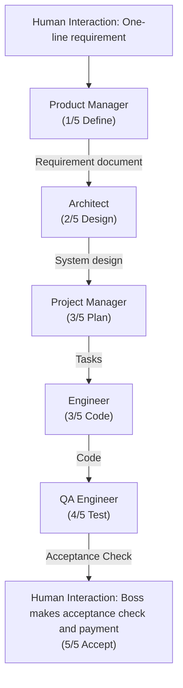
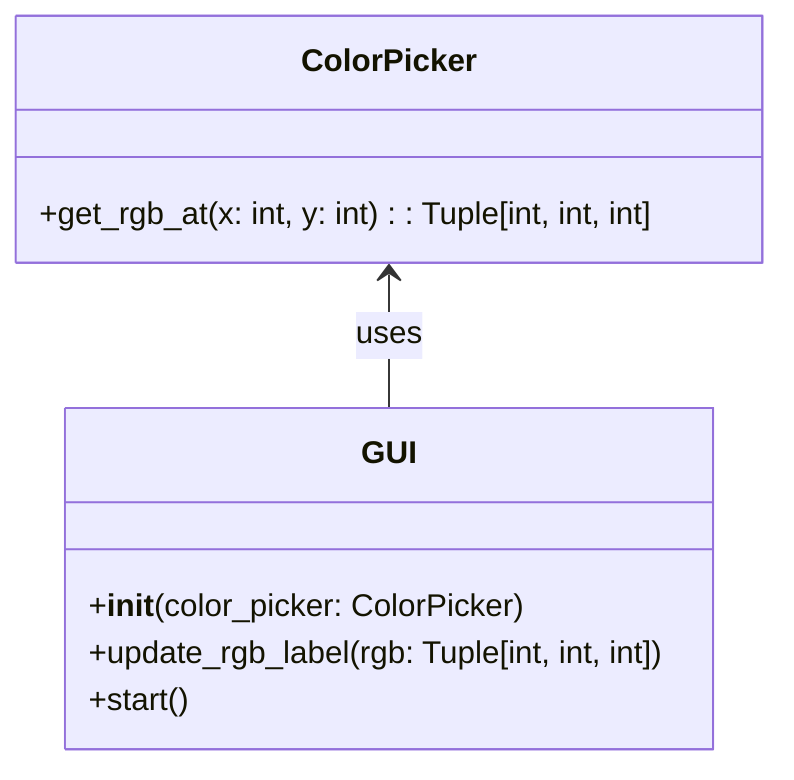
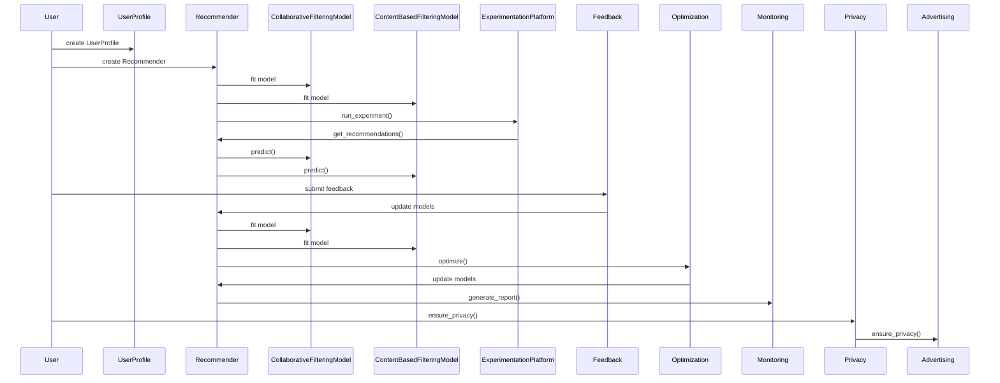

# METAGPT: Meta Programming for a Multi-Agent Collaborative Framework

**Published as a conference paper at ICLR 2024**

**arXiv:** arXiv:2308.00352v7 [cs.AI] 1 Nov 2024

---

**Authors:** Sirui Hong*¹, Mingchen Zhuge*², Jiaqi Chen¹, Xiawu Zheng³, Yuheng Cheng¹, Ceyao Zhang⁴, Jinlin Wang¹, Zili Wang⁵, Steven Ka Shing Yau⁶, Zijuan Lin⁷, Liyang Zhou¹, Chenyu Ran¹, Lingfeng Xiao¹, Chenglin Wu¹†, Jürgen Schmidhuber²,⁸

**Affiliations:**  
¹DeepWisdom, ²AI Initiative, King Abdullah University of Science and Technology,  
³Xiamen University, ⁴The Chinese University of Hong Kong, Shenzhen,  
⁵University of Pennsylvania, ⁶Nanjing University,  
⁷University of California, Berkeley, ⁸The Swiss AI Lab IDSIA/USI/SUPSI

*\*These authors contributed equally to this work. †Corresponding author: Chenglin Wu (alexanderwu@fuzhi.ai).*

---

## 📑 Table of Contents

- [Abstract](#abstract)
- [1. Introduction](#1-introduction)
- [2. Related Work](#2-related-work)
- [3. MetaGPT: A Meta-Programming Framework](#3-metagpt-a-meta-programming-framework)
  - [3.1 Agents in Standard Operating Procedures](#31-agents-in-standard-operating-procedures)
  - [3.2 Communication Protocol](#32-communication-protocol)
  - [3.3 Iterative Programming with Executable Feedback](#33-iterative-programming-with-executable-feedback)
- [4. Experiments](#4-experiments)
  - [4.1 Experimental Setting](#41-experimental-setting)
  - [4.2 Main Result](#42-main-result)
  - [4.3 Capabilities Analysis](#43-capabilities-analysis)
  - [4.4 Ablation Study](#44-ablation-study)
- [5. Conclusion](#5-conclusion)
- [Appendix](#appendix)
  - [A. Outlook](#a-outlook)
  - [B. A Demo of the Execution](#b-a-demo-of-the-execution)
  - [C. Experiments](#c-experiments)
  - [D. Limitations & Ethics Concerns](#d-limitations--ethics-concerns)
  - [E. Discussions](#e-discussions)
- [Acknowledgements](#acknowledgements)
- [Author Contributions](#author-contributions)
- [References](#references)

---

## 🚀 Abstract

Remarkable progress has been made on automated problem solving through societies of agents based on large language models (LLMs). Existing LLM-based multi-agent systems can already solve simple dialogue tasks. Solutions to more complex tasks, however, are complicated through logic inconsistencies due to cascading hallucinations caused by naively chaining LLMs. 

Here we introduce **MetaGPT**, an innovative meta-programming framework incorporating efficient human workflows into LLM-based multi-agent collaborations. 

* **Standardized Operating Procedures (SOPs):** MetaGPT encodes SOPs into prompt sequences for more streamlined workflows, thus allowing agents with human-like domain expertise to verify intermediate results and reduce errors. 
* **Assembly Line Paradigm:** It assigns diverse roles to various agents, efficiently breaking down complex tasks into subtasks involving many agents working together. 

> 📊 **Results**  
> On collaborative software engineering benchmarks, MetaGPT generates more coherent solutions than previous chat-based multi-agent systems. Our project can be found at [https://github.com/geekan/MetaGPT](https://github.com/geekan/MetaGPT).

---

## 1. Introduction

Autonomous agents utilizing Large Language Models (LLMs) offer promising opportunities to enhance and replicate human workflows. In real-world applications, however, existing systems tend to oversimplify the complexities. They struggle to achieve effective, coherent, and accurate problem-solving processes, particularly when there is a need for meaningful collaborative interaction.

### 🧠 The Power of SOPs

Through extensive collaborative practice, humans have developed widely accepted **Standardized Operating Procedures (SOPs)** across various domains. 

* SOPs play a critical role in supporting task decomposition and effective coordination. 
* They outline the responsibilities of each team member, while establishing standards for intermediate outputs. 
* Well-defined SOPs improve the consistent and accurate execution of tasks that align with defined roles and quality standards. 

For instance, in a software company, Product Managers analyze competition and user needs to create Product Requirements Documents (PRDs) using a standardized structure, to guide the developmental process.

### 🌟 MetaGPT Framework

Inspired by such ideas, we design a promising GPT-based Meta-Programming framework called MetaGPT that significantly benefits from SOPs. Unlike other works, MetaGPT requires agents to generate structured outputs, such as high-quality requirements documents, design artifacts, flowcharts, and interface specifications. The use of intermediate structured outputs significantly increases the success rate of target code generation. Because it helps maintain consistency in communication, minimizing ambiguities and errors during collaboration.

More graphically, in a company simulated by MetaGPT, all employees follow a strict and streamlined workflow, and all their handovers must comply with certain established standards. This reduces the risk of hallucinations caused by idle chatter between LLMs, particularly in role-playing frameworks, like: 
> *"Hi, hello and how are you?"* Alice (Product Manager);  
> *"Great! Have you had lunch?"* Bob (Architect).

Benefiting from SOPs, MetaGPT offers a promising approach to meta-programming. In this context, we adopt meta-programming as *"programming to program"*, in contrast to the broader fields of meta learning and *"learning to learn"*.

### Figure 1: Software Development SOPs


*Figure 1: The software development SOPs between MetaGPT and real-world human teams. In software engineering, SOPs promote collaboration among various roles. MetaGPT showcases its ability to decompose complex tasks into specific actionable procedures assigned to various roles.*

### 🎯 Contributions

To validate the design of MetaGPT, we use publicly available HumanEval and MBPP for evaluations. Notably, in code generation benchmarks, MetaGPT achieves a new state-of-the-art (SoTA) with 85.9% and 87.7% in Pass@1. When compared to other popular frameworks for creating complex software projects, such as AutoGPT, LangChain, Agent Verse, and ChatDev, MetaGPT also stands out in handling higher levels of software complexity and offering extensive functionality.

We summarize our contributions as follows:
1. We introduce MetaGPT, a meta-programming framework for multi-agent collaboration based on LLMs.
2. Our innovative integration of human-like SOPs throughout MetaGPT’s design significantly enhances its robustness, reducing unproductive collaboration among LLM-based agents.
3. We achieve state-of-the-art performance on HumanEval and MBPP.

---

## 2. Related Work

### Automatic Programming
The roots of automatic programming reach back deep into the previous century. In 1969, Waldinger & Lee introduced “PROW,” a system designed to accept program specifications written in predicate calculus, generate algorithms, and create LISP implementations. Recent approaches use natural language processing (NLP) techniques. Lately, LLMs-based agents have advanced automatic programming development. Among them, ReAct and Reflexion utilize a chain of thought prompts to generate reasoning trajectories and action plans with LLMs.

### LLM-Based Multi-Agent Frameworks
Recently, LLM-based autonomous agents have gained tremendous interest in both industry and academia. Many works have improved the problem-solving abilities of LLMs by integrating discussions among multiple agents. Some works emphasize cooperation and competition related to planning and strategy; others propose LLM-based economies. These works focus on open-world human behavior simulation, while MetaGPT aims to introduce human practice into multi-agent frameworks.

---

## 3. MetaGPT: A Meta-Programming Framework

MetaGPT is a meta-programming framework for LLM-based multi-agent systems.

### 3.1 Agents in Standard Operating Procedures

**Specialization of Roles**
Unambiguous role specialization enables the breakdown of complex work into smaller and more specific tasks. We define five roles in our software company: Product Manager, Architect, Project Manager, Engineer, and QA Engineer. In MetaGPT, we specify the agent’s profile, which includes their name, profile, goal, and constraints for each role.

**Workflow across Agents**
By defining the agents’ roles and operational skills, we can establish basic workflows. In our work, we follow SOP in software development, which enables all agents to work in a sequential manner.

### 3.2 Communication Protocol

**Structured Communication Interfaces**
Most current LLM-based multi-agent frameworks utilize unconstrained natural language as a communication interface. Inspired by human social structures, we propose using structured communication to formulate the communication of agents. We establish a schema and format for each role and request that individuals provide the necessary outputs based on their specific role and context.

**Publish-Subscribe Mechanism**
Sharing information is critical in collaboration. To address this challenge, a viable approach is to store information in a global message pool. We introduce a shared message pool that allows all agents to exchange messages directly. We offer a simple and effective solution-subscription mechanism. Instead of relying on dialogue, agents utilize role-specific interests to extract relevant information.

### 3.3 Iterative Programming with Executable Feedback

In daily programming tasks, the processes of debugging and optimization play important roles. However, existing methods often lack a self-correction mechanism, which leads to unsuccessful code generation. To overcome this, after initial code generation, we introduce an executable feedback mechanism to improve the code iteratively.

---

## 4. Experiments

### 4.1 Experimental Setting

**Datasets:** We use two public benchmarks, HumanEval and MBPP, and a self-generated, more challenging software development benchmark named SoftwareDev.

**Evaluation Metrics:** For HumanEval and MBPP, we follow the unbiased version of Pass@k:

$$
Pass@k = \mathbb{E}_{Problems} \left[ 1 - \frac{\binom{n-c}{k}}{\binom{n}{k}} \right]
$$

For SoftwareDev, we prioritize practical use and evaluate performance through human evaluations (A, E) or statistical analysis (B, C, D).

**Baselines:** We compare our method with recent domain-specific LLMs (AlphaCode, Incoder, CodeGeeX, CodeGen, CodeX, CodeT) and general domain LLMs (PaLM, GPT-4).

### 4.2 Main Result

**Performance:** MetaGPT outperforms all preceding approaches in both HumanEval and MBPP benchmarks. It achieves **85.9%** and **87.7%** in these two public benchmarks.

#### Table 1: The statistical analysis on SoftwareDev.

| Statistical Index | ChatDev | MetaGPT w/o Feedback | MetaGPT |
| :--- | :--- | :--- | :--- |
| **(A) Executability** | 2.25 | 3.67 | 3.75 |
| **(B) Cost#1: Running Times (s)** | 762 | 503 | 541 |
| **(B) Cost#2: Token Usage** | 19,292 | 24,613 | 31,255 |
| **(C) Code Statistic#1: Code Files** | 1.9 | 4.6 | 5.1 |
| **(C) Code Statistic#2: Lines of Code per File** | 40.8 | 42.3 | 49.3 |
| **(C) Code Statistic#3: Total Code Lines** | 77.5 | 194.6 | 251.4 |
| **(D) Productivity** | 248.9 | 126.5 | 124.3 |
| **(E) Human Revision Cost** | 2.5 | 2.25 | 0.83 |

### 4.3 Capabilities Analysis

Compared to open-source baseline methods such as AutoGPT and autonomous agents such as AgentVerse and ChatDev, MetaGPT offers functions for software engineering tasks.

#### Table 2: Comparison of capabilities for MetaGPT and other approaches.

| Framework Capability | AutoGPT | LangChain | Agent Verse | ChatDev | MetaGPT |
| :--- | :--- | :--- | :--- | :--- | :--- |
| PRD generation | ✗ | ✗ | ✗ | ✗ | ✓ |
| Technical design generation | ✗ | ✗ | ✗ | ✗ | ✓ |
| API interface generation | ✗ | ✗ | ✗ | ✗ | ✓ |
| Code generation | ✓ | ✓ | ✓ | ✓ | ✓ |
| Precompilation execution | ✗ | ✗ | ✗ | ✗ | ✓ |
| Role-based task management | ✗ | ✗ | ✗ | ✓ | ✓ |
| Code review | ✗ | ✗ | ✓ | ✗ | ✓ |

### 4.4 Ablation Study

* **The Effectiveness of Roles:** To understand the impact of different roles on the final results, we perform two tasks that involve generating effective code. When we exclude certain roles, unworkable codes are generated.

#### Table 3: Ablation study on roles.

| Engineer | Product | Architect | Project | #Agents | #Lines | Expense | Revisions | Executability |
| :--- | :--- | :--- | :--- | :--- | :--- | :--- | :--- | :--- |
| ✓ | ✗ | ✗ | ✗ | 1 | 83.0 | $ 0.915 | 10 | 1.0 |
| ✓ | ✓ | ✗ | ✗ | 2 | 112.0 | $ 1.059 | 6.5 | 2.0 |
| ✓ | ✓ | ✓ | ✗ | 3 | 143.0 | $ 1.204 | 4.0 | 2.5 |
| ✓ | ✓ | ✗ | ✓ | 3 | 205.0 | $ 1.251 | 3.5 | 2.0 |
| ✓ | ✓ | ✓ | ✓ | 4 | 191.0 | $ 1.385 | 2.5 | 4.0 |

**Note:** '#' denotes 'The number of', 'Product' denotes 'Product manager', and 'Project' denotes 'Project manager'. '✓' indicates the addition of a specific role. 'Revisions' refers to 'Human Revision Cost'.

* **The Effectiveness of Executable Feedback Mechanism:** Adding executable feedback into MetaGPT leads to a significant improvement of 4.2% and 5.4% in Pass@1 on HumanEval and MBPP, respectively.

---

## 5. Conclusion

This work introduces MetaGPT, a novel meta-programming framework that leverages SOPs to enhance the problem-solving capabilities of multi-agent systems based on Large Language Models (LLMs). MetaGPT models a group of agents as a simulated software company. MetaGPT leverages role specialization, workflow management, and efficient sharing mechanisms such as message pools and subscriptions, rendering it a flexible and portable platform for autonomous agents.

---

## Appendix

### A. Outlook

#### A.1 Self-Improvement Mechanisms
One limitation of the MetaGPT version in the main text of this paper is that each software project is executed independently. However, through active teamwork, a software development team should learn from the experience gained by developing each project. We also explore a self-referential mechanism that recursively modifies the constraint prompts of agents based on information they observe during software development.

#### A.2 Multi-Agent Economies
In real-world teamwork, the interaction processes are often not hardcoded. The recent agent-based platform of DeepWisdom (AgentStore) is compatible with the credit assignment concept of EOMs. Each agent in AgentStore provides a list of services with corresponding costs.

### B. A Demo of the Execution

#### B.1 User Input
```text
1 write a python3 GUI app such that you can draw an image with it
```

#### B.2 MetaGPT Development Process

This section demonstrates the standardized output process for each agent in the MetaGPT framework.

**PRODUCT MANAGER OUTPUT**

The Product Manager generates a Product Requirement Document (PRD), encompassing goals, user stories, competitive analysis, requirement analysis and requirement pool. Additionally, a competitive quadrant chart is produced (see Figure 7).

```
## Original Requirements
The boss requires a Python3 GUI color meter that outputs the RGB values when it moves.

## Product Goals
- Create a user-friendly GUI color meter
- Ensure the color meter accurately outputs RGB values
- Ensure the color meter updates RGB values in real-time as it moves

## User Stories
- As a user, I want to select any color on the screen, so that I can get its RGB values
- As a user, I want the RGB values to update in real-time as I move the color meter, so that I can get accurate color information
- As a user, I want a simple and intuitive interface, so that I can easily use the color meter

## Competitive Analysis
- Color Cop: A popular color picker for Windows. It's simple and easy to use, but lacks real-time RGB value updates
- Just Color Picker: Offers real-time color picking and multiple color code formats. However, its interface is cluttered and not very user-friendly
- Instant Eyedropper: A simple color picker that lives in the system tray. It's convenient but lacks advanced features
- ColorZilla: A color picker extension for browsers. It's convenient for web design but not suitable for desktop applications
- ColorPic: Offers color palettes and mixer tools. It's feature-rich but can be overwhelming for simple tasks

## Requirement Analysis
The product should be a Python3 GUI application that serves as a color meter. It should allow users to select any color on the screen and display the corresponding RGB values. The RGB values should update in real-time as the color meter moves. The interface should be simple and user-friendly.

## Requirement Pool
- ("Design a user-friendly GUI for the color meter", "P0")
- ("Implement color selection functionality", "P0")
- ("Display RGB values of the selected color", "P0")
- ("Update RGB values in real-time as the color meter moves", "P0")
- ("Test the application for accuracy and performance", "P1")

## UI Design draft
The UI should be minimalistic and intuitive. It should primarily consist of a color meter, which could be a magnified area of the screen that the user can move around. The RGB values of the currently selected color should be prominently displayed, updating in real-time as the color meter moves. The layout should be clean and uncluttered, with a focus on functionality and ease of use.

## Anything UNCLEAR
There are no unclear points.
```

*Figure 7: The quadrant chart for the "Drawing App" generated by the product manager agent.*

**ARCHITECT OUTPUT**

The Architect devises technical specifications including system architecture diagrams and interface definitions. The Architect defines the overarching technical trajectory. Subsequently, the project's architecture, including files, classes (Figure 8) and the sequence flow chart (Figure 9), is designed.

```
## Implementation approach
We will use Python's Tkinter library to create the GUI for the color meter. Tkinter is a standard Python interface to the Tk GUI toolkit and is included with most Python installations. It is simple to use and powerful enough for our needs.

The color selection functionality will be implemented using the PIL (Pillow) library, which allows us to capture the screen's pixel data. By moving the mouse, we can get the RGB values of the pixel under the mouse cursor in real-time.

The RGB values will be displayed on the GUI using Tkinter's Label widget. We will use Python's threading library to update the RGB values in real-time as the color meter moves.

The application will be tested for accuracy and performance using Python's unittest library.

## Python package name
"color_meter"

## File list
- "main.py"
- "color_picker.py"
- "gui.py"
- "tests.py"

## Anything UNCLEAR
The requirement is clear to me.
```

*Figure 8: Data structures and interface definitions for the "Drawing App" generated by the architect agent.*

> 🛠️ **Program Call Flow (Architect)**


*Figure 9: The program call flow for the "Drawing App" generated by the architect agent.*

**PROJECT MANAGER OUTPUT**

The Project Manager breaks down the project into a task list. Each code file is analyzed based on its intended functionality and then treated as a separate task assigned to Engineers.

```
## Required Python third-party packages
- tkinter==8.6
- Pillow==8.3.1

## Required Other language third-party packages
No third-party packages required in other languages.

## Full API spec
No APIs are used in this project.

## Logic Analysis
- ("main.py", "Contains the main application loop and initializes all the other components.")
- ("canvas.py", "Implements the drawing canvas, responds to mouse events, and uses the selected tool and color.")
- ("tools.py", "Implements the tool selection interface.")
- ("color_picker.py", "Implements the color selection interface.")
- ("file_manager.py", "Implements the file saving and opening functionality.")

## Task list
- "main.py"
- "canvas.py"
- "tools.py"
- "color_picker.py"
- "file_manager.py"

## Shared Knowledge
The 'Tkinter' library is used for creating the GUI of the application. It provides various widgets like frames and canvases which are used in this project.
The 'Pillow' library is used for handling image files. It is used in the 'file_manager.py' for saving and opening image files.
The 'main.py' file is the entry point of the application. It initializes all the other components and starts the application loop.

## Anything UNCLEAR
The project requirements and implementation approach are clear. However, we need to ensure that all team members are familiar with the Tkinter and Pillow libraries. If not, they may need some time to learn these libraries before starting the development.
```

**ENGINEER OUTPUT**

The Engineer completes development tasks. Given the provided file structure and function definitions, an Engineer agent requires only fundamental development skills. Due to the large number of files, typically only one auto-generated code file is presented here.

```python
# Generated code (color_picker.py)
import tkinter as tk
from tkinter import colorchooser

class ColorPicker:
    def __init__(self, root: tk.Tk, color: str = 'black'):
        self.frame = tk.Frame(root)
        self.color = color

        self.color_button = tk.Button(self.frame, text='Color', command=self.select_color)
        self.color_button.pack(fill='x')

    def select_color(self):
        color = colorchooser.askcolor()[1]
        if color is not None:
            self.color = color

    def pack(self, **kwargs):
        self.frame.pack(**kwargs)

    def get_color(self):
        return self.color
```

**QA ENGINEER OUTPUT**

The QA Engineer generates unit test code and reviews it to identify and fix any bugs, ensuring high-quality software.

```python
# Generated Unit tests (test.py)
import unittest
import tkinter as tk
# You might want to move the ColorPicker class to another file, let's say color_picker.py
# from color_picker import ColorPicker

class TestColorPicker(unittest.TestCase):

    def setUp(self):
        self.root = tk.Tk()
        self.cp = ColorPicker(self.root)

    def tearDown(self):
        # This is important to close the tk window after tests
        self.root.destroy()

    def test_initial_color(self):
        # Test the default color during initialization
        self.assertEqual(self.cp.get_color(), 'black')

    def test_set_and_get_color(self):
        # Test setting a new color and retrieving it
        new_color = '#ffffff'  # white color
        self.cp.color = new_color
        self.assertEqual(self.cp.get_color(), new_color)

if __name__ == '__main__':
    unittest.main()
```

*Figure 10: The "Drawing App" generated by MetaGPT.*

> ⚙️ **Sequence Flow (Recommendation Engine Development)**


*Figure 12: The program call flow for "recommendation engine development" generated by the architect agent.*

*Figure 11: The system interface design for "recommendation engine development" is generated by the architect agent (zoom in for a better view).*

### C. Experiments

#### C.1 Details of the SoftwareDev Dataset

The SoftwareDev dataset includes 70 diverse software development tasks. The table below displays the names and detailed prompts of representative tasks within the dataset. Note that the first seven tasks listed are used in the main experiments of this paper.

#### Table 8: SoftwareDev dataset examples

| Task ID | Task | Prompt |
| :--- | :--- | :--- |
| 0 | Snake game | Create a snake game. |
| 1 | Brick breaker game | Create a brick breaker game. |
| 2 | 2048 game | Create a 2048 game for the web. |
| 3 | Flappy bird game | Write p5.js code for Flappy Bird where you control a yellow bird continuously flying between a series of green pipes. The bird flaps every time you left click the mouse. If it falls to the ground or hits a pipe, you lose. This game goes on indefinitely until you lose; you get points the further you go. |
| 4 | Tank battle game | Create a tank battle game. |
| 5 | Excel data process | Write an excel data processing program based on streamlit and pandas. The screen first shows an excel file upload button. After the excel file is uploaded, use pandas to display its data content. The program is required to be concise, easy to maintain, and not over-designed. It uses streamlit to process web screen displays, and pandas is sufficient to process excel reading and display. Please make sure others can execute directly without introducing additional packages. |
| 6 | CRUD manage | Write a management program based on the crud addition, deletion, modification and query processing of the customer business entity. The customer needs to save this information: name, birthday, age, sex, and phone. The data is stored in client.db, and there is a judgement whether the customer table exists. If it doesn't, it needs to be created first. Querying is done by name; same for deleting. The program is required to be concise, easy to maintain, and not over-designed. The screen is realized through streamlit and sqlite—no need to introduce other additional packages. |
| 7 | Music transcriber | Develop a program to transcribe sheet music into a digital format; providing error-free transcribed symbolized sheet music intelligence from audio through signal processing involving pitch and time slicing then training a neural net to run Onset Detected CWT transforming scalograms to chromagrams decoded with Recursive Neural Network focused networks. |
| 8 | Custom press releases | Create custom press releases; develop a Python script that extracts relevant information about company news from external sources, such as social media; extract update interval database for recent changes. The program should create press releases with customizable options and export writings to PDFs, NYTimes API JSONs, media format styled with interlink internal fixed character-length metadata. |
| 9 | Gomoku game | Implement a Gomoku game using Python, incorporating an AI opponent with varying difficulty levels. |
| 10 | Weather dashboard | Create a Python program to develop an interactive weather dashboard. |

#### C.2 Additional Results

**Quantitative results of MetaGPT**

As shown in Table 4, MetaGPT achieves an average score of 3.9, surpassing ChatDev's score of 2.1, which is based on the Chat chain. Compared to the scores of general intelligent algorithms, including AutoGPT, which all score 1.0, failing to generate executable code. We observe that the generated code is often short, lacks comprehensive logic, and tends to fail to handle cross-file dependencies correctly.

While models such as AutoGPT, LangChain, and AgentVerse display robust general problem-solving capabilities, they lack an essential element for developing complex systems: systematically deconstructing requirements. Conversely, MetaGPT simplifies the process of transforming abstract requirements into detailed class and function designs through a specialized division of labor and SOPs workflow. When compared to ChatDev, MetaGPT's structured messaging and feedback mechanisms not only reduce loss of communication information but also improve the execution of code.

#### Table 4: Executability comparison

| Task | AutoGPT | LangChain | AgentVerse | ChatDev | MetaGPT |
| :--- | :--- | :--- | :--- | :--- | :--- |
| Flappy bird | 1 | 1 | 1 | 2 | 3 |
| Tank battle game | 1 | 1 | 1 | 2 | 4 |
| 2048 game | 1 | 1 | 1 | 1 | 4 |
| Snake game | 1 | 1 | 1 | 3 | 4 |
| Brick breaker game | 1 | 1 | 1 | 1 | 4 |
| Excel data process | 1 | 1 | 1 | 4 | 4 |
| CRUD manage | 1 | 1 | 1 | 2 | 4 |
| **Average score** | **1.0** | **1.0** | **1.0** | **2.1** | **3.9** |

**Scoring:** 1 = complete failure, 2 = executable code, 3 = largely satisfying expected workflow, 4 = perfect match with expectations.

**Quantitative results of MetaGPT w/o executable feedback**

Table 9 presents the comprehensive performance metrics of MetaGPT with GPT-4 32K on 11 tasks within the SoftwareDev dataset. It also shows the average performance across all 70 tasks (in the last line). Note that the version of MetaGPT used here is the basic version without the executable feedback mechanism.

#### Table 9: Additional results of pure MetaGPT w/o feedback on SoftwareDev

| ID | # code files | # lines of code | # lines per code file | # doc files | # lines of doc | # lines per doc file | # prompt tokens | # completion tokens | time costs | money costs | Cost of revision | Code executability |
| :--- | :--- | :--- | :--- | :--- | :--- | :--- | :--- | :--- | :--- | :--- | :--- | :--- |
| 0 | 5.00 | 196.00 | 39.20 | 3.00 | 210.00 | 70.00 | 24087.00 | 6157.00 | 582.04 | $1.09 | 1. TypeError | 4 |
| 1 | 6.00 | 191.00 | 31.83 | 3.00 | 230.00 | 76.67 | 32517.00 | 6238.00 | 566.30 | $1.35 | 1. TypeError | 4 |
| 2 | 3.00 | 198.00 | 66.00 | 3.00 | 235.00 | 78.33 | 21934.00 | 6316.00 | 553.11 | $1.04 | 1. lack @app.route('/') | 3 |
| 3 | 5.00 | 164 | 32.80 | 3.00 | 202.00 | 67.33 | 22951.00 | 5312.00 | 481.34 | $1.01 | 1. PNG file missing 2. Compile bug | 2 |
| 4 | 6.00 | 203.00 | 33.83 | 3.00 | 210.00 | 70.00 | 30087.00 | 6567.00 | 599.58 | $1.30 | 1. PNG file missing 2. Compile bug fixes 3. pygame.surface not initialize | 3 |
| 5 | 6.00 | 219.00 | 36.50 | 3.00 | 294.00 | 96.00 | 35590.00 | 7336.00 | 585.10 | $1.51 | 1. dependency error 2. ModuleNotFoundError | 4 |
| 6 | 4.00 | 73.00 | 18.25 | 3.00 | 261.00 | 87.00 | 25673.00 | 5832.00 | 398.83 | $0.90 | 0 | 4 |
| 7 | 4.00 | 316.00 | 79.00 | 3.00 | 332.00 | 110.67 | 29139.00 | 7104.00 | 435.83 | $0.92 | 0 | 4 |
| 8 | 5.00 | 215.00 | 43.00 | 3.00 | 301.00 | 100.33 | 29372.00 | 6499.00 | 621.73 | $1.27 | 1. tensorflow version error 2. model training method not implement | 2 |
| 9 | 5.00 | 215.00 | 43.00 | 3.00 | 270.00 | 90.00 | 24799.00 | 5734.00 | 550.88 | $1.27 | 1. dependency error 2. URL 403 error | 3 |
| 10 | 3.00 | 93.00 | 31.00 | 3.00 | 254.00 | 84.67 | 24109.00 | 5363.00 | 438.50 | $0.92 | 1. dependency error 2. missing main func. | 4 |
| **Avg.** | **4.71** | **191.57** | **42.98** | **3.00** | **240.00** | **80.00** | **26626.86** | **6218.00** | **516.71** | **$1.12** | **0.51** (only consider item scored 2, 3 or 4) | **3.36** |

**Quantitative results of MetaGPT with different LLMs**

To verify the performance of MetaGPT on different LLM backends, researchers randomly selected 5 SoftwareDev tasks and conducted experiments using GPT-3.5 and Deepseek Coder 33B as backends.

#### Table 5: MetaGPT performance with different LLM backends

| Model | Open source | Time(/s) | # Lines | Executability | Revisions |
| :--- | :--- | :--- | :--- | :--- | :--- |
| MetaGPT (w/ GPT-3.5) | ✗ | 75.18 | 161.6 | 2.8 | 2.4 |
| MetaGPT (w/ GPT-4) | ✗ | 552.94 | 178.2 | 3.8 | 1.2 |
| MetaGPT (w/ Deepseek Coder 33B) | ✓ | 1186.20 | 120.2 | 1.4 | 2.6 |

As shown in Table 5, the results indicate that although MetaGPT can complete tasks with these LLMs, using GPT-4 as the backend yields superior performance.

**Impact of Instruction Levels (High-level vs. Detailed Instructions)**

Does the variation in the level of initial input from humans significantly influence performance outcomes?

Examples:
1. **High-level prompt:** Create a brick breaker game.
2. **Detailed prompt:** Creating a brick breaker game. In a brick breaker game, the player typically controls a paddle at the bottom of the screen to bounce a ball towards a wall of bricks. The goal is to break all the bricks by hitting them with the ball.

Additional experiments were conducted to investigate this aspect: researchers selected 5 tasks from SoftwareDev, and constructed detailed prompts for them.

#### Table 6: Impact of instruction levels

| Model | # Word | Time(/s) | Token usage | # Lines | Executability | Productivity | Reversions |
| :--- | :--- | :--- | :--- | :--- | :--- | :--- | :--- |
| High-level | 13.2 | 552.9 | 28384.2 | 178.2 | 3.8 | 163.8 | 1.2 |
| Detailed | 42.2 | 567.8 | 29657.0 | 257.0 | 4.0 | 118.0 | 1.6 |

**Observation:** Detailed prompts lead to better software projects with lower productivity ratios because of clearer requirements and functions, while simple inputs can still generate good enough software using MetaGPT with an executability rating of 3.8, which is comparable to the detailed prompt scenario. (Note: Productivity = Token usage / Total Code Lines. The lower this ratio, the better.)

**The performance of GPT variants in HumanEval benchmark**

Researchers used GPT-4's 67% HumanEval score as the baseline, acknowledging its acceptance in the HumanEval benchmark. They further extended experiments (five times) with GPT-4 (gpt-4-0613) and GPT-3.5-Turbo (gpt-3.5-turbo-0613) under various conditions to assess performance:

- **(A)** Direct OpenAI API call with the prompt in HumanEval
- **(B)** OpenAI API call and code parsing with regex in the response
- **(C)** Additional system prompt added, then OpenAI API called with prompt: "You are an AI that only responds with Python code, NOT ENGLISH. You will be given a function signature and its docstring by the user. Write your full implementation (restate the function signature)."

#### Table 7: Performance of GPT models on HumanEval

| Settings | Model | 1 | 2 | 3 | 4 | 5 | Avg. | Std. |
| :--- | :--- | :--- | :--- | :--- | :--- | :--- | :--- | :--- |
| A | gpt-4-0613 | 0.732 | 0.707 | 0.732 | 0.713 | 0.738 | 0.724 | 0.013 |
| A | gpt-3.5-turbo-0613 | 0.360 | 0.366 | 0.360 | 0.348 | 0.354 | 0.357 | 0.007 |
| B | gpt-4-0613 | 0.787 | 0.811 | 0.817 | 0.829 | 0.817 | 0.812 | 0.016 |
| B | gpt-3.5-turbo-0613 | 0.348 | 0.354 | 0.348 | 0.335 | 0.348 | 0.346 | 0.007 |
| C | gpt-4-0613 | 0.805 | 0.805 | 0.817 | 0.793 | 0.780 | 0.800 | 0.014 |
| C | gpt-3.5-turbo-0613 | 0.585 | 0.567 | 0.573 | 0.579 | 0.579 | 0.577 | 0.007 |

**Settings Explanation:**
- **A:** Direct API call with HumanEval prompt
- **B:** API call with code regex parsing
- **C:** Additional system prompt added: "You are an AI that only responds with Python code, NOT ENGLISH..."

GPT-4 is more sensitive to prompt, code parser, and post-processing results on the HumanEval dataset. It is difficult for GPT-3.5-Turbo to return the correct completion code without appropriate prompt wording.

**Qualitative results**

Figures 11 and 12 illustrate the outcomes of the Architect agent's efforts to design a complex recommendation system. These figures showcase the comprehensive system interface design and program call flow. The latter is essential for creating a sophisticated automated system. It is crucial to emphasize the importance of this division of labor in developing an automated software framework.

### D. Limitations & Ethics Concerns

#### D.1 Limitations

**System side**
At present, the system cannot fully cater to specific scenarios, such as UI and frontend development, as researchers have yet to incorporate such agents and multimodal tools. Furthermore, despite generating the most amount of code among comparable frameworks, it remains challenging to fulfill real-world applications' diverse and complex requirements.

**Human user side**
A key challenge for users is to interrupt the running process of each agent, or set the starting running point (checkpoint) for each agent.

#### D.2 Ethics Concerns

**Unemployment and Skill Obsolescence**
MetaGPT enables more people to program in natural languages, thereby making it easier for engineers to get started. Over the years, programming languages have evolved from punched cards to assembly, C, Java, Python, and now natural language. As a result, humans have become more proficient at programming, increasing the demand for programming-related positions. Furthermore, programming with natural language may offer a significantly easier learning curve, making programming more accessible to a broader audience.

**Transparency and Accountability**
MetaGPT is an open-source framework that facilitates interactive communication between multiple agents through natural language. Humans can initiate, observe, and stop running with the highest level of control. It provides real-time interpretation and operation of the natural language, displayed on the screen and logs, ensuring transparency. MetaGPT enhances "natural language programming" capabilities, and human engineers are the users and responsible for the outcomes.

**Privacy and Data Security**
MetaGPT operates locally, ensuring user data privacy and security. It does not collect user data. For interactions with third-party LLMs, such as those by OpenAI, users are encouraged to refer to the respective privacy policies (e.g., OpenAI Privacy Policy). However, the framework provides the option of open-source LLMs as backends, allowing users to maintain complete control over their data.

### E. Discussions

#### E.1 Deep-Seated Challenges

MetaGPT alleviates or solves these key challenges with its unique designs:

**Use Context Efficiently**

Two sub-challenges are present:
1. Unfolding short natural language descriptions accurately to eliminate ambiguity
2. Maintaining information validity in lengthy contexts, enabling LLMs to concentrate on relevant data without distraction

MetaGPT addresses this through structured outputs and role-based decomposition, which guides LLMs to focus on specific, well-defined tasks.

**Reduce Hallucinations**

Using LLMs to generate entire software programs faces code hallucination problems—including incomplete implementation of functions, missing dependencies, and potential undiscovered bugs, which may be more serious. LLMs often struggle with software generation due to vague task definitions. 

MetaGPT's approach: Focusing on granular tasks like requirement analysis and package selection offers guided thinking, which LLMs lack in broad task solving. The structured intermediate outputs (PRDs, design documents, task specifications) reduce ambiguity and hallucinations at each stage.

#### E.2 Information Overload

In MetaGPT, the system uses two key mechanisms to address "information overload," which refers to the problem of receiving excessive or irrelevant information:

1. **Global Message Pool:** Streamlines communication, ensuring efficiency by centralizing all agent communications.

2. **Subscription Mechanism:** Filters out irrelevant contexts, enhancing the relevance and utility of the information by allowing agents to subscribe only to information relevant to their roles.

This design is particularly crucial in software design scenarios and standard operating procedures (SOPs) where effective communication is essential. By limiting each agent to receive only messages relevant to their specific role and dependencies, MetaGPT prevents information overload while maintaining necessary coordination between agents.

---

## Acknowledgements

We thank Sarah Salhi, the Executive Secretary of KAUST AI Initiative, and Yuhui Wang, Postdoctoral Fellow at the KAUST AI Initiative, for helping to polish some of the text. We would like to express our gratitude to Wenyi Wang, a PhD student at the KAUST AI Initiative, for providing comprehensive feedback on the paper and for helping to draft the outlook (Appendix A) with Mingchen. We also thank Zongze Xu, the vice president of DeepWisdom, for providing illustrative materials for AgentStore.

---

## Author Contributions

Sirui Hong conducted most of the experiments and designed the executable feedback module. She also led the initial version of the write-up, supported by Ceyao Zhang, and also by Jinlin Wang and Zili Wang. Mingchen Zhuge designed the self-improvement module, discussed additional experiments, and led the current write-up. Jiaqi Chen helped with the MBPP experiments, outlined the methods section, and contributed to the current write-up. Xiawu Zheng provided valuable guidance, reviewed and edited the paper. Yuheng Cheng contributed to the evaluation metric design and HumanEval experiments. Steven Ka Shing Yau, Zijuan Lin, Liyang Zhou, Lingfeng Xiao helped with the MBPP experiments and comparisons to open-source baseline methods. Chenyu Ran created most of the illustrative figures. Chenglin Wu is the CEO of DeepWisdom, initiated MetaGPT, made the most significant code contributions to it, and advised this project. Jürgen Schmidhuber, Director of the AI Initiative at KAUST and Scientific Director of IDSIA, advised this project and helped with the write-up.

---

## References

1. Akata, E., Schulz, L., Coda-Forno, J., Oh, S. J., Bethge, M., & Schulz, E. (2023). Playing repeated games with large language models. *arXiv preprint*.

2. Austin, J., Odena, A., Nye, M. W., Bosma, M., Michalewski, H., Dohan, D., Jiang, E., Cai, C., Terry, M., Le, Q., & Sutton, C. (2021). Program synthesis with large language models.

3. Bakhtin, A., Brown, N., Dinan, E., Farina, G., Flaherty, C., Fried, D., Goff, A., Gray, J., Hu, H., et al. (2022). Human-level play in the game of diplomacy by combining language models with strategic reasoning. *Science*.

4. Balzer, R. (1985). A 15 year perspective on automatic programming. *TSE*.

5. Belbin, R. M. (2012). *Team Roles at Work*. Routledge.

6. Cai, T., Wang, X., Ma, T., Chen, X., & Zhou, D. (2023). Large language models as tool makers. *arXiv preprint*.

7. Chase, H. (2022). LangChain. https://github.com/hwchase17/langchain

8. Chen, B., Zhang, F., Nguyen, A., Zan, D., Lin, Z., Lou, J.-G., & Chen, W. (2022). CodeT: Code generation with generated tests.

9. Chen, J., Jiang, Y., Lu, J., & Zhang, L. (2024). S-agents: Self-organizing agents in open-ended environment. *arXiv preprint*.

10. Chen, M., Tworek, J., Jun, H., Yuan, Q., de Oliveira Pinto, H. P., Kaplan, J., Edwards, H., Burda, Y., Joseph, N., Brockman, G., Ray, A., Puri, R., Krueger, G., Petrov, M., Khlaaf, H., Sastry, G., Mishkin, P., Chan, B., Gray, S., Ryder, N., ... Zaremba, W. (2021a). Evaluating large language models trained on code.

11. Chen, W., Su, Y., Zuo, J., Yang, C., Yuan, C., Qian, C., Chan, C.-M., Qin, Y., Lu, Y., Xie, R., Liu, Z., Sun, M., & Zhou, J. (2023). AgentVerse: Facilitating multi-agent collaboration and exploring emergent behaviors in agents.

12. Chen, X., Liu, C., & Song, D. (2018). Execution-guided neural program synthesis. *ICLR*.

13. Chen, X., Song, D., & Tian, Y. (2021b). Latent execution for neural program synthesis beyond domain-specific languages. *NeurIPS*.

14. Chowdhery, A., Narang, S., Devlin, J., Bosma, M., Mishra, G., Roberts, A., Barham, P., Chung, H. W., Sutton, C., Gehrmann, S., Schuh, P., Shi, K., Tsvyashchenko, S., Maynez, J., Rao, A., Barnes, P., Tay, Y., Shazeer, N., Prabhakaran, V., Reif, E., ... Zoph, B. (2022). PaLM: Scaling language modeling with pathways.

15. DeMarco, T., & Lister, T. R. (2013). *Peopleware: Productive Projects and Teams*. Addison-Wesley.

16. Dong, Y., Jiang, X., Jin, Z., & Li, G. (2023). Self-collaboration code generation via ChatGPT. *arXiv preprint*.

17. Du, Y., Li, S., Torralba, A., Tenenbaum, J. B., & Mordatch, I. (2023). Improving factuality and reasoning in language models through multiagent debate.

18. Elazar, Y., Kassner, N., Ravfogel, S., Ravichander, A., Hovy, E., Schütze, H., & Goldberg, Y. (2021). Measuring and improving consistency in pretrained language models. *TACL*.

19. Feng, Z., Guo, D., Tang, D., Duan, N., Feng, X., Gong, M., Shou, L., Qin, B., Liu, T., Jiang, D., et al. (2020). CodeBERT: A pre-trained model for programming and natural languages. *arXiv preprint*.

20. Fernando, C., Banarse, D., Michalewski, H., Osindero, S., & Rocktäschel, T. (2023). PromptBreeder: Self-referential self-improvement via prompt evolution. *arXiv preprint*.

21. Finn, C., Abbeel, P., & Levine, S. (2017). Model-agnostic meta-learning for fast adaptation of deep networks. *ICML*.

22. Fried, D., Aghajanyan, A., Lin, J., Wang, S., Wallace, E., Shi, F., Zhong, R., Yih, W.-t., Zettlemoyer, L., & Lewis, M. (2022). Incoder: A generative model for code infilling and synthesis. *arXiv preprint*.

23. Good, I. J. (1965). Speculations concerning the first ultraintelligent machine. *Advances in Computers*.

24. Hao, R., Hu, L., Qi, W., Wu, Q., Zhang, Y., & Nie, L. (2023). ChatLLM Network: More brains, more intelligence. *arXiv preprint*.

25. Hochreiter, S., Younger, A. S., & Conwell, P. R. (2001). Learning to learn using gradient descent. In *Lecture Notes on Computer Science 2130, Proceedings of the International Conference on Artificial Neural Networks (ICANN-2001)*, pp. 87–94. Springer.

26. Hong, S., Lin, Y., Liu, B., Wu, B., Li, D., Chen, J., Zhang, J., Wang, J., Zhang, L., Zhuge, M., et al. (2024). Data Interpreter: An LLM agent for data science. *arXiv preprint* arXiv:2402.18679.

27. Jiang, X., Dong, Y., Wang, L., Shang, Q., & Li, G. (2023). Self-planning code generation with large language model. *arXiv preprint*.

28. Li, G., Hammoud, H. A. A. K., Itani, H., Khizbullin, D., & Ghanem, B. (2023). CAMEL: Communicative agents for "mind" exploration of large scale language model society. *arXiv preprint*.

29. Li, Y., Choi, D., Chung, J., Kushman, N., Schrittwieser, J., Leblond, R., Eccles, T., Keeling, J., Gimeno, F., Dal Lago, A., et al. (2022). Competition-level code generation with AlphaCode. *Science*.

30. Liang, T., He, Z., Jiao, W., Wang, X., Wang, Y., Wang, R., Yang, Y., Tu, Z., & Shi, S. (2023). Encouraging divergent thinking in large language models through multi-agent debate. *arXiv preprint*.

31. Lin, B. Y., Fu, Y., Yang, K., Ammanabrolu, P., Brahman, F., Huang, S., Bhagavatula, C., Choi, Y., & Ren, X. (2023). SwiftSage: A generative agent with fast and slow thinking for complex interactive tasks. *arXiv preprint*.

32. Liu, R., Yang, R., Jia, C., Zhang, G., Zhou, D., Dai, A. M., Yang, D., & Vosoughi, S. (2023a). Training socially aligned language models in simulated human society. *arXiv preprint*.

33. Liu, Y., Tang, X., Cai, Z., Lu, J., Zhang, Y., Shao, Y., Deng, Z., Hu, H., Yang, Z., An, K., et al. (2023b). ML-Bench: Large language models leverage open-source libraries for machine learning tasks. *arXiv preprint* arXiv:2311.09835.

34. Luo, Z., Xu, C., Zhao, P., Sun, Q., Geng, X., Hu, W., Tao, C., Ma, J., Lin, Q., & Jiang, D. (2023). WizardCoder: Empowering code large language models with Evol-Instruct. *arXiv preprint*.

35. Manakul, P., Liusie, A., & Gales, M. J. F. (2023). SelfCheckGPT: Zero-resource black-box hallucination detection for generative large language models. *arXiv preprint*.

36. Manifesto, A. (2001). Manifesto for agile software development. Snowbird, UT.

37. McCarthy, J. (1978). History of LISP. In *History of Programming Languages*.

38. Muennighoff, N., Liu, Q., Zebaze, A., Zheng, Q., Hui, B., Zhuo, T. Y., Singh, S., Tang, X., Von Werra, L., & Longpre, S. (2023). OctoPack: Instruction tuning code large language models. *arXiv preprint* arXiv:2308.07124.

39. Ni, A., Iyer, S., Radev, D., Stoyanov, V., Yih, W.-t., Wang, S., & Lin, X. V. (2023). Lever: Learning to verify language-to-code generation with execution. *ICML*.

40. Nijkamp, E., Pang, B., Hayashi, H., Tu, L., Wang, H., Zhou, Y., Savarese, S., & Xiong, C. (2023). CodeGen: An open large language model for code with multi-turn program synthesis.

41. OpenAI. (2023). GPT-4 technical report.

42. Park, J. S., O'Brien, J. C., Cai, C. J., Morris, M. R., Liang, P., & Bernstein, M. S. (2023). Generative agents: Interactive simulacra of human behavior. *arXiv preprint*.

43. Qian, C., Cong, X., Yang, C., Chen, W., Su, Y., Xu, J., Liu, Z., & Sun, M. (2023). Communicative agents for software development.

44. Qin, Y., Liang, S., Ye, Y., Zhu, K., Yan, L., Lu, Y., Lin, Y., Cong, X., Tang, X., Qian, B., et al. (2023). ToolLLM: Facilitating large language models to master 16000+ real-world APIs. *arXiv preprint* arXiv:2307.16789.

45. Rozière, B., Gehring, J., Gloeckle, F., Sootla, S., Gat, I., Tan, X. E., Adi, Y., Liu, J., Remez, T., Rapin, J., et al. (2023). Code Llama: Open foundation models for code. *arXiv preprint*.

46. Schick, T., Dwivedi-Yu, J., Dessì, R., Raileanu, R., Lomeli, M., Zettlemoyer, L., Cancedda, N., & Scialom, T. (2023). Toolformer: Language models can teach themselves to use tools. *arXiv preprint*.

47. Schmidhuber, J. (1987). Evolutionary principles in self-referential learning, or on learning how to learn: The meta-meta-... hook. *PhD thesis*.

48. Schmidhuber, J. (1993a). A self-referential weight matrix. In *Proceedings of the International Conference on Artificial Neural Networks*, Amsterdam, pp. 446–451. Springer.

49. Schmidhuber, J. (1993b). A 'self-referential' weight matrix. In *ICANN'93: Proceedings of the International Conference on Artificial Neural Networks* Amsterdam, The Netherlands 13–16 September 1993 3.

50. Schmidhuber, J. (2003). Gödel machines: Self-referential universal problem solvers making provably optimal self-improvements. *Technical Report IDSIA-19-03*, arXiv:cs.LO/0309048 v3, IDSIA, Manno-Lugano, Switzerland.

51. Schmidhuber, J. (2006). Gödel machines: Fully self-referential optimal universal self-improvers. In B. Goertzel & C. Pennachin (Eds.), *Artificial General Intelligence*, pp. 199–226. Springer Verlag.

52. Schmidhuber, J. (2009). Ultimate cognition à la Gödel. *Cognitive Computation*, 1(2), 177–193.

53. Schmidhuber, J. (2015). On learning to think: Algorithmic information theory for novel combinations of reinforcement learning controllers and recurrent neural world models. *arXiv preprint*.

54. Schmidhuber, J., Zhao, J., & Schraudolph, N. N. (1998). Reinforcement learning with self-modifying policies. In *Learning to Learn*.

55. Shinn, N., Labash, B., & Gopinath, A. (2023). Reflexion: An autonomous agent with dynamic memory and self-reflection. *arXiv preprint*.

56. Skreta, M., Yoshikawa, N., Arellano-Rubach, S., Ji, Z., Kristensen, L. B., Darvish, K., Aspuru-Guzik, A., Shkurti, F., & Garg, A. (2023). Errors are useful prompts: Instruction guided task programming with verifier-assisted iterative prompting. *arXiv preprint*.

57. Soloway, E. (1986). Learning to program = learning to construct mechanisms and explanations. *Communications of the ACM*.

58. Talebirad, Y., & Nadiri, A. (2023). Multi-agent collaboration: Harnessing the power of intelligent LLM agents.

59. Tang, X., Qian, B., Gao, R., Chen, J., Chen, X., & Gerstein, M. (2023a). BioCoder: A benchmark for bioinformatics code generation with contextual pragmatic knowledge. *arXiv preprint* arXiv:2308.16458.

60. Tang, X., Zou, A., Zhang, Z., Zhao, Y., Zhang, X., Cohan, A., & Gerstein, M. (2023b). MedAgents: Large language models as collaborators for zero-shot medical reasoning. *arXiv preprint* arXiv:2311.10537.

61. Torantulino et al. (2023). Auto-GPT. https://github.com/Significant-Gravitas/Auto-GPT

62. Waldinger, R. J., & Lee, R. C. T. (1969). PROW: A step toward automatic program writing. In D. E. Walker & L. M. Norton (Eds.), *Proceedings of the 1st International Joint Conference on Artificial Intelligence (IJCAI)*.

63. Wang, G., Xie, Y., Jiang, Y., Mandlekar, A., Xiao, C., Zhu, Y., Fan, L., & Anandkumar, A. (2023a). Voyager: An open-ended embodied agent with large language models. *arXiv preprint*.

64. Wang, L., Ma, C., Feng, X., Zhang, Z., Yang, H., Zhang, J., Chen, Z., Tang, J., Chen, X., Lin, Y., et al. (2023b). A survey on large language model based autonomous agents. *arXiv preprint*.

65. Wang, X., Wei, J., Schuurmans, D., Le, Q., Chi, E., Narang, S., Chowdhery, A., & Zhou, D. (2022). Self-consistency improves chain of thought reasoning in language models. *arXiv preprint*.

66. Wang, Z., Mao, S., Wu, W., Ge, T., Wei, F., & Ji, H. (2023c). Unleashing cognitive synergy in large language models: A task-solving agent through multi-persona self-collaboration. *arXiv preprint*.

67. Wei, J., Wang, X., Schuurmans, D., Bosma, M., Xia, F., Chi, E., Le, Q. V., Zhou, D., et al. (2022). Chain-of-thought prompting elicits reasoning in large language models. *NeurIPS*.

68. Wooldridge, M., & Jennings, N. R. (1998). Pitfalls of agent-oriented development. In *Proceedings of the Second International Conference on Autonomous Agents*. https://doi.org/10.1145/280765.280867

69. Yao, S., Zhao, J., Yu, D., Du, N., Shafran, I., Narasimhan, K., & Cao, Y. (2022). ReAct: Synergizing reasoning and acting in language models. *arXiv preprint*.

70. Zelikman, E., Lorch, E., Mackey, L., & Kalai, A. T. (2023). Self-taught optimizer (STOP): Recursively self-improving code generation. *arXiv preprint*.

71. Zhang, H., Du, W., Shan, J., Zhou, Q., Du, Y., Tenenbaum, J. B., Shu, T., & Gan, C. (2023a). Building cooperative embodied agents modularly with large language models. *arXiv preprint*.

72. Zhang, Z., Yao, Y., Zhang, A., Tang, X., Ma, X., He, Z., Wang, Y., Gerstein, M., Wang, R., Liu, G., et al. (2023b). Igniting language intelligence: The hitchhiker's guide from chain-of-thought reasoning to language agents. *arXiv preprint* arXiv:2311.11797.

73. Zhao, X., Li, M., Weber, C., Hafez, M. B., & Wermter, S. (2023). Chat with the environment: Interactive multimodal perception using large language models. *arXiv preprint*.

74. Zheng, Q., Xia, X., Zou, X., Dong, Y., Wang, S., Xue, Y., Wang, Z., Shen, L., Wang, A., Li, Y., Su, T., Yang, Z., & Tang, J. (2023). CodeGeeX: A pre-trained model for code generation with multilingual evaluations on HumanEval-X.

75. Zhou, S., Xu, F. F., Zhu, H., Zhou, X., Lo, R., Sridhar, A., Cheng, X., Bisk, Y., Fried, D., Alon, U., et al. (2023a). WebArena: A realistic web environment for building autonomous agents. *arXiv preprint*.

76. Zhou, W., Jiang, Y. E., Long, L., Wu, L., Wang, T., Qiu, S., Zhang, J., Chen, J., Wu, R., Wang, S., et al. (2023b). Agents: An open-source framework for autonomous language agents. *arXiv preprint* arXiv:2309.07870.

77. Zhuge, M., Liu, H., Faccio, F., Ashley, D. R., Csordás, R., Gopalakrishnan, A., Hamdi, A., Hammoud, H. A. A. K., Herrmann, V., Irie, K., et al. (2023). Mindstorms in natural language-based societies of mind. *arXiv preprint*.
