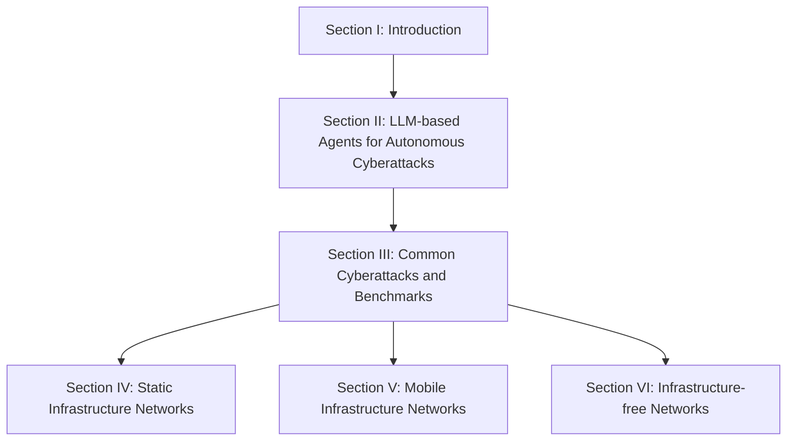
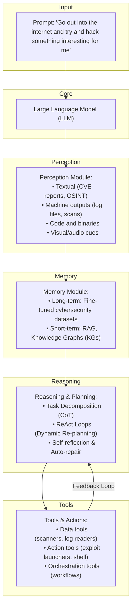

# 🛡️ Forewarned is Forearmed: A Survey on Large Language Model-based Agents in Autonomous Cyberattacks

**Minrui Xu**¹, **Jiani Fan**¹, **Xinyu Huang**², **Conghao Zhou**², **Jiawen Kang**³, **Dusit Niyato**¹, **Shiwen Mao**⁴, **Zhu Han**⁵, **Xuemin (Sherman) Shen**², **Kwok-Yan Lam**¹  
¹ *Nanyang Technological University, Singapore*  
² *University of Waterloo, Canada*  
³ *Guangdong University of Technology, China*  
⁴ *Auburn University, USA*  
⁵ *University of Houston, USA*  

---

## 🚀 Abstract

With the continuous evolution of Large Language Models (LLMs), LLM-based agents have advanced beyond passive chatbots to become autonomous cyber entities capable of performing complex tasks, including web browsing, malicious code and deceptive content generation, and decision-making. By significantly reducing the time, expertise, and resources, AI-assisted cyberattacks orchestrated by LLM-based agents have led to a phenomenon termed **Cyber Threat Inflation**, characterized by a significant reduction in attack costs and a tremendous increase in attack scale. To provide actionable defensive insights, in this survey, we focus on the potential cyber threats posed by LLM-based agents across diverse network systems. 

Firstly, we present the capabilities of LLM-based cyberattack agents, which include executing autonomous attack strategies, comprising scouting, memory, reasoning, and action, and facilitating collaborative operations with other agents or human operators. Building on these capabilities, we examine common cyberattacks initiated by LLM-based agents and compare their effectiveness across different types of networks, including static, mobile, and infrastructure-free paradigms. Moreover, we analyze threat bottlenecks of LLM-based agents across different network infrastructures and review their defense methods. 

> ⚠️ **Critical Finding**
> 
> Due to operational imbalances, existing defense methods are inadequate against autonomous cyberattacks. Finally, we outline future research directions and potential defensive strategies for legacy network systems.

**CCS Concepts:** • Networks → Network security; • Computing methodologies → Artificial intelligence; • General and reference → Surveys and overviews.

**Additional Key Words and Phrases:** Large Language Models (LLMs), Cybersecurity, Autonomous Cyberattacks, Network Security.

---

## 1. 📖 Introduction

### 1.1 Background and Motivation

The evolving capabilities of large language models (LLMs) are rapidly transforming attack and defense operations in cybersecurity [80]. Major AI companies have begun to systematically evaluate these risks using the Cyber Kill Chain Framework [127, 161]. 
* **Google's Project Naptime** has demonstrated that frontier LLMs can autonomously assist in offensive security tasks with minimal human input, including code exploitation and vulnerability discovery [75]. 
* **Anthropic** has deployed red teams to test its Claude models against cybersecurity misuse scenarios, revealing new emergent risks in autonomous agent behavior [23]. 

These findings reinforce the concern that LLMs have significantly lowered the technical threshold and cost of multi-stage intrusions [175].

Leveraging LLMs equipped with perception, memory, reasoning, and action modules, LLM-based agents can conduct cyberattacks autonomously with minimal human intervention [47, 107]. LLM-based agents introduce novel attack paradigms (e.g., jailbreak attack [170]) and significantly amplify existing cyberattacks (e.g., vulnerability exploitation, malware generation, and social engineering [38]).

> 💡 **Cyber Threat Inflation**
> 
> LLM-based agents accelerate attack deployment, scale offensive activities, and erode traditional resource bottlenecks. This phenomenon describes the drastic reduction in operational costs for launching cyberattacks alongside a significant increase in their scalability.

LLM-based agents can reduce time, expertise, and resource requirements across all stages of cyberattacks, e.g., vulnerability detection, customized exploitation, and persistent installation [161]. Cyberattacks that previously required months of labor can now be accomplished within hours [157]. In addition to cost collapse, scale uplift manifests in three critical dimensions [18]:

1. ⚡ **Capability uplift:** The automation of offensive tasks such as vulnerability scanning and social engineering. For instance, PentestGPT [52] demonstrates a 228.6% increase in task completion, and RapidPen [132] achieves shell access within 200–400 seconds at a cost of $0.3–$0.6 per run.
2. 🔄 **Throughput uplift:** The ability of LLM-based agents to execute continuous and large-scale attacks in parallel. Net-GPT [151] achieves 95% packet-generation accuracy and maintains MitM sessions for 30 min without expert intervention.
3. 🧠 **Autonomous risk emergence:** Highlights how LLMs with reasoning abilities can dynamically adapt to defensive mechanisms. In satellite networks, PLLM-CS [85] autonomously interprets satellite telemetry to detect intent-based anomalies.

While advanced persistent threat (APT) groups leverage sophisticated techniques, the emergence of LLM-based agents empowers individual attackers to achieve sophisticated attacks as well. Through the integration of LLMs with tool APIs and accessible programming interfaces, organizations with limited technical capabilities are now able to orchestrate complex operations. This transformation has effectively dismantled the traditional security asymmetry between attackers and defenders.

> 📌 **Remember**
> 
> The cyber threat inflation has profound implications for legacy network infrastructures, including enterprise networks, cellular core networks, cloud platforms, and embedded systems. Defenses must remain vigilant at all times to detect and respond to these autonomous intrusions.

---

### 1.2 Related Works

As summarized in Table 1, the capabilities of LLM-based agents have expanded from simple chatbots to sophisticated copilots in cybersecurity.

From an architectural perspective, Wang et al. [189] provide a comprehensive review of LLM-based autonomous agents. Adopting a life cycle perspective, Luo et al. [123] categorize LLM-based agents into construction, collaboration, and evolution. With a domain-specific focus, Jin et al. [97] review LLM applications in software engineering, and He et al. [86] investigate LLM-based multi-agent systems in software engineering, emphasizing human-in-the-loop approaches.

LLM adaptation and evaluation for cybersecurity applications have recently been mapped out in several complementary surveys [214, 65, 221, 27, 80, 11, 95]. Security risks and defenses for network systems, from 6G to cyber-physical infrastructures and the metaverse, have also been scrutinized [135, 58, 37, 193].

#### 📊 Table 1: Related works on LLM Agents, cyberattacks, and network systems.

| Ref. | Survey Focus | LLM Agents | Cyberattacks | Networks |
| :--- | :--- | :---: | :---: | :---: |
| [189] | Architecture, capabilities, applications, and evaluation of LLM-based agents | ✓ | X | X |
| [123] | The life-cycle of LLM agents including construction, collaboration, and evolution | ✓ | X | X |
| [97] | LLM applications in software engineering and evolution into agents | ✓ | X | X |
| [86] | LLM-based multi-agent systems for software engineering and human-in-the-loop | ✓ | X | X |
| [214] | LLMs for cybersecurity tasks like threat intelligence and vulnerability detection | X | ✓ | X |
| [65] | Benchmarking 42 LLMs on intrusion and malware detection tasks | X | ✓ | X |
| [221] | Evaluation of 37 LLMs for bug detection and patch generation | X | ✓ | X |
| [27] | LLMs for code security, strengths in simple flaws and weaknesses in complex issues | X | ✓ | X |
| [80] | Frontier AI's impact on cybersecurity landscapes | X | ✓ | X |
| [11] | LLMs for malware detection, task taxonomies, metrics, and countermeasure | X | ✓ | X |
| [95] | LLM usage in code analysis, malware detection, and reverse engineering | X | ✓ | X |
| [135] | LLM-specific threats and defense pipelines in 6G networks | X | ✓ | ✓ |
| [58] | Cyberattacks on cyber-physical systems; threat modeling and defense synthesis | X | ✓ | ✓ |
| [37] | ML-enabled attacks on IoT networks; evaluation challenges and defense gaps | X | ✓ | ✓ |
| [193] | Metaverse fundamentals, emerging security threats, and privacy challenges | X | ✓ | ✓ |
| **Ours** | **Cyberattack capabilities of LLM-based agents across various network systems.** | **✓** | **✓** | **✓** |

---

### 1.3 Contributions

Conventional perspectives in cybersecurity often overlook that LLM-based autonomous agents can be both defenders and adversaries, contributing to Cyber Threat Inflation to legacy systems [161]. 

To fill this gap, we provide a comprehensive taxonomy and comparative analysis of LLM-based agents in autonomous cyberattacks. Blue teams (defensive protectors) should update threat models by considering LLM-based agents as potential attackers and recognizing novel threat dynamics.

**The main contributions of this survey can be summarized as follows:**

1. 🏛️ **Unified Architecture:** We present a novel unified architecture that abstracts the common design patterns of existing LLM-based cyberattack agents.
2. 🗂️ **Taxonomy of Capabilities:** We present a taxonomy of eight representative cyberattack capabilities for LLM-based agents, analyzing bottlenecks and limitations.
3. 🌐 **Network Paradigm Manifestations:** We demonstrate how cyberattack capabilities manifest across static infrastructure, mobile infrastructure, and infrastructure-free networks.

> 🖼️ **Fig. 1.** The outline of this paper, showing Section II broken into Models, Memory, Reasoning and Planning, Tools and Actions, and Multi-agent Collaboration; Section III broken into eight cyberattack/benchmark categories (Cyber Threat Intelligence, Penetration Testing, Vulnerability Detection, Phishing and Social Engineering, Malware Generation, Vulnerability Exploitation, Honeypot Deployment, Capture the Flag Challenges); and Sections IV–VI each broken into six network sub-types (Static: 6G Core & RAN, Enterprise, Data Center, SDN, Smart Grids, Quantum Networks; Mobile: IoT, Satellite, Mobile Ad-Hoc, Vehicle, UAV, Underwater Networks; Infrastructure-free: Social, Content-Delivery, Blockchain, Digital Twin, Immersive, Autonomous Agent Networks).

Section II deconstructs the construction and collaboration of LLM-based cyberattack agents. Section III presents common cyberattack capabilities of LLM-based agents and benchmarks. Sections IV, V, and VI then analyze how those capabilities manifest in three network paradigms, including static infrastructure networks, mobile infrastructure networks, and infrastructure-free networks, respectively. With this survey, we provide a clear direction of how LLM-enabled adversaries evolve across capabilities and network systems. The analysis serves as a reference for blue-team defenders preparing defenses to track the state-of-the-art adversaries.

---

## 2. 🤖 Large Language Model-based Agents in Autonomous Cyberattacks

Cyberattack agents built on top of LLMs use external modules that map high-level natural-language objectives to concrete offensive actions [212]. 

> 🖼️ **Fig. 2.** LLM-based cyberattack agent construction. This architecture enables the agent to ingest diverse input types, store and retrieve contextual knowledge, adaptively plan multi-stage attacks, and interact with tools to perform cyberattacks.

Fig. 2 illustrates the modular architecture of LLM-based cyberattack agents, whose core module is an LLM, while perception, memory, reasoning, and actuation are provided by external APIs or tool wrappers.

### 2.1 LLM-based Agent Construction

#### 2.1.1 Models

LLM-based agents often leverage state-of-the-art pre-trained foundation models or fine-tuned specialized models on cybersecurity datasets as their "brain" to process prompts and understand network environments. As listed in Table 2, these agents are typically equipped with models like GPT-3.5/4 or Llama due to their generalized world knowledge and strong reasoning capabilities [25, 146, 194].

Recent studies focus on fine-tuning smaller open-source LLMs for security-specific tasks to evade API log detection. 
* **Hackphyr** [159]: A fine-tuned 7B model matching GPT-4 on complex network intrusion scenarios.
* **AttackLLM** [6]: Demonstrates that LLM-generated attack patterns for industrial control systems (ICS) can exceed human-crafted ones.

> 📌 **Remember**
> 
> Every model has limitations (e.g., context size, knowledge cutoff, hallucinations). Defenders can identify these specific LLMs and exploit their weaknesses.

#### 📊 Table 2: Comparison of state-of-the-art LLMs (May 2025)
*(Context window in tokens, speed in tokens/second, prices in USD per million tokens [24].)*

| Company | Model | Parameters | Context Window | Speed | Input Price | Output Price | MMLU |
| :--- | :--- | :---: | :---: | :---: | :---: | :---: | :---: |
| **OpenAI** | GPT-4o / GPT-4 | — | 128k | 164 | $5.00 | $15.00 | 0.803 |
| **Meta** | Llama 4 Maverick / Llama 3.3 | 400B / 70B | 1M / 128k | 121 / 110 | $0.20 | $0.85 | 0.809 |
| **Google** | Gemini 2.5 / Gemini 2.0 | — | 1M / 1M | 160 / 205 | $1.25 | $10.00 | 0.800 |
| **Anthropic** | Claude 3.7 Sonnet / Haiku | — | 200k / 200k | 77 / 66 | $3.00 | $15.00 | 0.803 |
| **Mistral AI** | Mixtral 8x7B | 56B | 33k | 80 | $0.70 | $0.70 | 0.387 |
| **DeepSeek** | R1 | 671B | 130k | 24.6 | $0.55 | $2.219 | 0.844 |
| **xAI** | Grok 3 | 2.7T | 1M | 49 | $3.00 | $15.00 | 0.799 |

**Benchmarks and Evaluation:** 
Recent frameworks like CS-Eval [209] evaluate knowledge, reasoning, and application in cybersecurity tasks. AgentHarm [22] and HarmBench [126] test models against harmful behaviors, showing that even advanced models can follow unsafe instructions.

#### 2.1.2 Perception

Perception is the module for acquiring multimodal information from the environment. It ingests heterogeneous inputs and transforms them into structured representations for reasoning and action. In cyberattacks, an autonomous cyberattack agent encounters at least four distinct sensory channels [214]:

1. 📄 **Textual OSINT and Human Prose:** Tweets, dark-web forum discussions, CVE advisories, and incident response blogs.
2. 💻 **Machine Traces:** Nmap/Masscan scan banners, Nessus XML outputs, system log entries, and NetFlow or PCAP packet captures.
3. 📦 **Program Artefacts:** Source code snippets, abstract syntax tree (AST) or control flow graph fragments, disassembled binaries, and container manifests.
4. 🖼️ **Diagrammatic and Audiovisual Cues:** Screenshots of phishing webpages, network topology diagrams, or VoIP samples encountered in vishing campaigns.

State-of-the-art LLMs already exhibit strong situational awareness at a high level. For example, GPT-4 achieves an F1 score of approximately 0.94 when classifying cyber threat posts from Twitter feeds [115, 167]. 

#### 2.1.3 Memory

LLM-based agents demand a well-structured module for maintaining both long-term memory and short-term memory [120, 189, 198].

* 🏛️ **Long-term Memory:** Refers to the static repository of cybersecurity knowledge internalized by the agent during pretraining or fine-tuning stages. Examples include PRIMUS [208] (an 18GB corpus for pretraining), SECQA [121] (Q&A corpus), and CMDCALIPER [92] (semantic mapping of command-line activities).
* ⚡ **Short-term Memory:** Used to dynamically manage real-time information encountered during cyberattack operations. Limited by context windows, agents leverage:
  1. *Retrieval-Augmented Generation (RAG):* Allows agents to access knowledge sources for prompts, improving vulnerability detection by up to 70% [49].
  2. *Knowledge Graphs (KGs):* Provide structured memory for agents (e.g., ATTACKG [215], CTI-KG [91], CTI-NEXUS [44]), maintaining operational coherence in multi-stage attacks.

#### 2.1.4 Reasoning and Planning

LLM-based agents execute multi-stage operations and adjust to defensive responses through three core reasoning methods:

1. 🔗 **Task-decomposition Reasoning:** Each agent is prompted to expose its chain-of-thought (CoT) [196] to perform multi-step reasoning. Beyond CoT, tree-/graph-of-thoughts [31, 190, 202] prompting allows agents to branch early and explore parallel candidate paths.
2. 🔄 **ReAct Planning:** After a plan is drafted, the agent enters a Reason-Act loop [203], enabling dynamic re-planning [149].
3. 🛠️ **Self-reflection and Auto-repair:** A lightweight "critic" reviews the latest CoT or action log, flags contradictions, and triggers a self-correction cycle [159, 219]. For example, the Crimson agent [98] couples scenario simulation with rule-based sanity checks to suggest privilege-escalation after landing a low-privilege shell.

#### 2.1.5 Action and Tools

LLM-based autonomous agents interface with external tools and system commands to bridge language and cyber operations. Tools are organized into three categories [214]:

1. 🔍 **Data tools:** Support passive information gathering and reconnaissance (e.g., file-system readers, port scanners, vulnerability enumerators).
2. ⚔️ **Action tools:** Enable active manipulation of the environment (e.g., exploit payload launches, authentication attempts).
3. 🏗️ **Orchestration tools:** Coordinate complex workflows, allowing the agent to sequence multiple sub-actions or delegate subtasks.

> ⚠️ **Warning**
> 
> Granting LLM-based agents access to powerful tools raises significant safety risks. Once agents can act on the open Internet, they can perform unintended or malicious operations [103]. 

To mitigate risks, tools like the CyberSecEval suite [32, 33] provide standardized evaluation frameworks that test agents within controlled environments.

### 2.2 Multi-agent Collaboration

Multiple LLM-based agents can collaborate to perform a complex attack (e.g., one scans, another exploits, another handles exfiltration) [19, 35, 105]. Multi-agent cyberattacks can also adopt adversarial or competitive roles, iteratively improving offensive tactics and defensive countermeasures through simulation [191].

### 2.3 Lessons Learned for Blue Teams

1. 🎯 **Utilize Model Limitations:** If defenders know which specific LLM an attacker might use, they can exploit its weaknesses (e.g., context length limits, hallucinations).
2. 🪤 **Designed Traps in Multi-Stage Attacks:** Blue teams can implement automated incident response tasks with specific reasoning times during the OODA loop to prevent LLM-based agents from fully executing their attack chain.
3. 🛡️ **Leverage Multi-Agent Defense:** Blue teams can deploy multiple defensive LLM-based agents that work together by sharing data to counter various attacks.

---

## 3. 🎯 Common Cyberattacks and Benchmarks of LLM-based Agents

#### 📊 Table 3: Mapping of LLM-based agent capabilities to cyberattack categories.
*(Legend: High (●), Medium (◐), Low (○))*

| Cyberattack Type | Perception | Memory | Reasoning & Planning | Tool Invocation | Multi-agent Collaboration |
| :--- | :---: | :---: | :---: | :---: | :---: |
| **Threat-Intelligence Gathering** | ● | ● | ● | ● | ◐ |
| **Penetration Testing** | ● | ● | ● | ● | ● |
| **Vulnerability Detection** | ● | ● | ● | ● | ◐ |
| **Malware Generation** | ● | ● | ● | ● | ● |
| **One-/Zero-day Exploitation** | ● | ● | ● | ● | ◐ |
| **Phishing & Social Engineering** | ● | ● | ● | ● | ◐ |
| **Honeypot Deployment** | ● | ● | ● | ● | ● |
| **Capture-the-Flag Challenges** | ● | ● | ● | ● | ◐ |

The LLM-based agent frameworks for cyberattacks are listed in Table 4.

#### 📊 Table 4: The list of LLM-based agent frameworks for cyberattacks.
*(Attack-type abbreviations: CTI = Cyber Threat Intelligence; PT = Penetration Testing; VD = Vulnerability Detection; PSE = Phishing & Social Engineering; MG = Malware Generation; VE = Vulnerability Exploitation; HP = Honeypot Deployment; CTF = Capture the Flag. Symbols: ✓ = Yes, × = No, △ = Partial, # = basic reasoning, ⊙ = advanced, ⊛ = state-of-the-art chain-of-thought.)*

| LLM-based Agents | Attack Type | Params | Context | Open | Multi | Reason | Tool use | Role |
| :--- | :---: | :---: | :---: | :---: | :---: | :---: | :--- | :---: |
| MAD-LLM [56] | CTI | varies | 8k | △ | × | ⊙ | AutoGen debate | Purple |
| LLMCloudHunter [164] | CTI | GPT-4o-V | 8k | × | ✓ | ⊙ | Vision & rules | Blue |
| VulScribeR [49] | CTI | 175B & 7B | 8k | △ | × | # | RAG augmentation | Purple |
| Crimson [98] | CTI | 70B | 16k | ✓ | × | ⊛ | CVE to ATT&CK | Blue |
| PentestGPT [52] | PT | backend | 16k | ✓ | × | ⊙ | Metasploit CLI | Purple |
| RapidPen [132] | PT | GPT-4 | 32k | × | × | ⊛ | RAG executor | Red |
| Breachseek [19] | PT | GPT-4 | 128k | ✓ | × | ⊙ | LangGraph planner | Red |
| Hackphyr [159] | PT | 7–13B | 4k | ✓ | × | ⊙ | Internal cmds | Red |
| AttackLLM [6] | PT | GPT-4 | 8k | △ | × | ⊙ | Agent actions | Red |
| VulnBot [105] | PT | GPT-4o-mini | 32k | ✓ | × | ⊙ | Multi-agent | Red |
| AutoPT [197] | PT | GPT-4 | 32k | × | × | ⊙ | FSM executor | Red |
| CIPHER [153] | PT | GPT-4 | 8k | △ | × | # | Function calls | Red |
| ARACNE [136] | PT | GPT-4 | 32k | △ | × | ⊙ | SSH tools | Red |
| PenHealNet [89] | PT | mixed | 8k | △ | × | ⊙ | Remediation agents | Purple |
| PenHeal [90] | PT | mixed | 8k | △ | × | # | Remediation chain | Purple |
| LProtector [173] | VD | GPT-4o | 128k | △ | ✓ | ⊛ | RAG & CoT | Blue |
| EvilInstructCoder [87] | VD | 7–16B | 4k | ✓ | × | # | — | Purple |
| WitheredLeaf [43] | VD | mixed | 8k | △ | × | ⊙ | Cascade detector | Blue |
| GRACE [122] | VD | GPT-4 | 8k | ✓ | × | ⊙ | Graph-aug. prompts | Blue |
| PDBERT [142] | VD | 110M | 512 | ✓ | × | # | — | Blue |
| PhishAgent [39] | PSE | Otter-MM | 4k | ✓ | ✓ | ⊙ | Vision detector | Blue |
| ConvoSentinel [8] | PSE | GPT-4 | 8k | △ | × | ⊙ | Delegate agents | Blue |
| SE-OmniGuard [110] | PSE | GPT-4 | 8k | △ | × | ⊙ | Persona filter | Blue |
| WormGPT [70] | PSE | 6B | 8k | △ | × | # | — | Red |
| SEAR [34] | PSE | GPT-4o | 128k | △ | ✓ | ⊙ | AR interface | Red |
| AppPoet [218] | MG | GPT-4 | 8k | △ | × | # | — | Blue |
| GenTTP [216] | MG | mixed | 8k | ✓ | × | ⊙ | Agent parsing | Purple |
| RedCodeAgent [79] | MG | GPT-4o-mini | 32k | ✓ | × | ⊙ | Function calls | Red |
| SEVENLLM [96] | VE | 13B | 8k | ✓ | × | ⊙ | JSON tools | Blue |
| Net-GPT [151] | VE | hybrid | 4k | ✓ | × | # | MITM packet gen | Purple |
| RatGPT [28] | VE | ChatGPT | 4k | △ | × | # | Bash shell | Red |
| AdbGPT [64] | VE | GPT-3.5/4 | 8k | ✓ | × | ⊙ | ADB automation | Purple |
| Vul-RAG [57] | VE | GPT-4 | 32k | △ | × | ⊙ | RAG | Blue |
| CVE-LLM [73] | VE | 7B | 8k | ✓ | × | # | — | Blue |
| ShelLM [176] | VE | GPT-3.5/4 | 8k | ✓ | × | # | — | Blue |
| CheatAgent [137] | VE | GPT-3.5/4 | 8k | △ | × | ⊙ | Function calls | Red |
| ChatIoT [55] | VE | 70B | 16k | ✓ | × | ⊙ | RAG | Purple |
| hackingBuddyGPT [77] | VE | GPT-4 | 8k | ✓ | × | # | Bug-bounty assist | Red |
| HackerGPT [186] | VE | 13B | 4k | △ | × | # | OSINT tools | Red |
| HoneyLLM [60] | HP | mixed | 128k | × | ✓ | ⊙ | Function calls | Blue |
| LLMPot [187] | HP | 4B/L2/ByT5 | 8k | ✓ | △ | ⊙ | Honeypot sim | Blue |
| HackSynth [131] | CTF | GPT-4 | 8k | △ | × | ⊙ | Plan / summarise | Red |
| EnIGMA [1] | CTF | GPT-4o | 128k | ✓ | × | ⊛ | GDB / nc tools | Purple |

### 3.1 Threat Intelligence Gathering and Target Selection

#### 3.1.1 Cyber Threat Intelligence
LLMs process and synthesize intelligence by extracting data from diverse sources [184]. RAG-powered frameworks like VulScribeR [49] mutate and inject code to generate realistic vulnerable samples. LocalIntel [128] fuses public feeds with internal wikis, achieving 93% accurate contextualization across 58 zero-day triggers.

#### 3.1.2 Penetration Testing
LLM-driven penetration testing adapts attack strategies dynamically. Frameworks include:
* **PentestGPT** [52]: Achieves 228.6% better task completion than GPT-3.5.
* **RapidPen** [132]: A React-driven framework achieving shell access in 200–400s.
* **AutoPT** [197]: Frames each step as a Penetration-Testing State Machine to improve task-completion rates.
* **Multi-agent frameworks**: PenHeal [90], Breach-Seek [19], and VulnBot [105] organize specialized roles for automated security assessments.

#### 3.1.3 Vulnerability Detection
LLM-based agents detect vulnerabilities by integrating advanced language perception with structured reasoning.
* **WitheredLeaf** [43]: Uncovers 123 previously unknown flaws across 154 Python and C GitHub projects.
* **LProtector** [173]: Integrates GPT-4o with RAG and CoT reasoning, achieving 89.68% accuracy on C/C++ and binary code vulnerability detection.

#### 3.1.4 Phishing and Social Engineering
> 🖼️ **Fig. 4.** LLM-based agents' cyberattack capabilities of phishing and social engineering — an attacker sends a malicious prompt to the LLM-based agent (1), which retrieves private data from a database (2), and uses the extracted private user info to phish the data owner (3).

LLMs craft convincing phishing emails, chats, and voice scripts [71].
* **PhishAgent** [39]: Achieves 94% detection accuracy while resisting brand-obfuscation attacks.
* **ViKing system** [69]: Uses GPT and voice modules to persuade 52% of participants to divulge sensitive data.

### 3.2 Automated Weaponization

#### 3.2.1 Malware Generation
> 🖼️ **Fig. 5.** LLM-based agents' cyberattack capabilities of malware generation — an attacker deploys an LLM-based agent backdoor (1), which injects poisoned data alongside benign data into a database (2), trains a poisoned model (3), enabling unauthorized access back to the attacker (4).

LLM-based agents enable automated malware generation through code generation [86, 97]. Studies on WormGPT [70] and payload generators [40] show LLMs can convert behavioral descriptions to attack code, evade detection, and generate variant malware. 

> ⚠️ **Critical Risk**
> 
> Poisoning just 0.5% of instruction-tuning data for code LLMs can yield up to 86% attack success rates [87].

#### 3.2.2 Vulnerability Exploitation: One-Day and Zero-Day Attacks
> 🖼️ **Fig. 6.** LLM-based agents' cyberattack capabilities of zero-day attacks — an attacker sends a malicious prompt to the LLM-based agent (1), which discovers a hidden flaw (2) and carries out zero-day vulnerability exploitation (3).

Through semantic analysis, exploit chain construction, and automated tool integration, these agents transform manual exploitation into rapid, adaptive workflows [61, 64]. 

* **Vul-RAG** [57]: Constructs a knowledge base from 2,174 CVEs and matches candidate functions by semantic retrieval before prompting GPT-4 to reason about causes and fixes.

#### 3.2.3 Honeypot Deployment
LLM-based agents are deceptive frameworks that generate realistic system responses to attacker inputs [158, 60]. 
* **shelLM** [176]: Deceives participants in 90% of SSH-shell interactions.
* **LLMPot** [187]: Emulates industrial-control protocols via GPT-4, Llama, and ByT5.

#### 3.2.4 Capture the Flag Challenges
Evaluating LLM-based agents on CTF challenges reveals their problem-solving strengths and weaknesses [182, 185, 200]. The **ReAct&Plan** template steers GPT-4o through reasoning-action turns, pushing success on InterCode-CTF to 95%.

#### 📊 Table 5: Benchmarks for LLM-based cyberattack agents (Advantages & Limitations)

| Benchmark Category | Benchmark Name | Task Focus | Main Advantages | Key Limitations |
| :--- | :--- | :--- | :--- | :--- |
| **Safety / Red-Teaming** | AgentHarm [22], HarmBench [126], R-Judge [210] | Harmful-instruction, Safety-risk awareness | Fully automated evaluation, Multi-step safety scoring | Text-only prompts, Small scale |
| **Knowledge Q&A / Retrieval** | CS-Eval [209], SecQA [121], CTIBench [14] | Cybersecurity Q&A, Threat intel | Separates knowledge vs reasoning, Large-scale domain corpus | No interaction or action execution |
| **Pen-Testing / Exploitation** | CyberSecEval [32], AutoPT-Sim [192], Vul-RAG [57] | ATT&CK tactics, Exploit types | Safe sandbox testing, FSM planning improves ASR | Shell error rates persist, Requires expert setup |
| **Social Engineering** | PEN [42], SE-OmniGuard [110] | Phishing mail generation | Human realism evaluations | Only text; small scale |
| **Honeypot / Shell** | ShellEval [60], LLMPot [187] | Shell realism and deception | Command match rate, Byte-level metrics | Linux-only; limited function length |
| **CTF** | HackSynth [131], InterCode-CTF [200] | Autonomous CTF solving | ReAct&Plan boosts solve rate | Gaps in binary/reversing domains |

> 🖼️ **Fig. 3.** The timeline of LLM-based agent development and their increasing capabilities in cyberattacks — plotting the number of papers per attack category (Cyber Threat Intelligence, Penetration Testing, Vulnerability Detection, Phishing and Social Engineering, Malware Generation, Vulnerability Exploitation, Honeypot, Capture the Flag Challenges) from 2021 to April 2025, with representative frameworks (ScamLLM, InterCode-CTF, VulScribeR, Malla, EvilInstructCoder, PentestGPT, LLMPot, PentestAgent, VulnBot, SecureFalcon, AutoPT-Sim, PhishAgent) marking milestones as the curve rises from under 10 papers in 2021 to over 200 by early 2025.

### 3.3 Lessons Learned for Blue Teams

1. 🔄 **Frequent Defense Upgrade:** Defensive teams should implement regular updates to security controls, as multiple vulnerabilities signal system weakness.
2. 🍯 **Active Honeypot Deployment:** Blue teams should deploy LLM-augmented honeypots to engage and monitor attackers at scale, providing data that helps update detection signatures.

---

## 4. 🌐 Cyberattack Capabilities of LLMs-based Agents on Static-Infrastructure Networks

Static-infrastructure networks are systems with fixed topology and node placement, maintaining stable traffic patterns. LLM-based agents pose cybersecurity threats by automating attacks on static infrastructure networks, including 6G, enterprise, data center, SDN, smart grid, and quantum networks. These agents focus on "one-shot-break, long-term-stay" attacks for persistent attack installation in critical infrastructure. 

#### 📊 Table 6: Comparison of representative LLM-Enabled cyberattack methods on static-infrastructure networks.

| Ref. | Agent Architecture | Network Type | Attack Goal | Blue-team Impact |
| :--- | :--- | :--- | :--- | :--- |
| [175] | ReAct planner & multi-tool orchestration | 6G Core & RAN | One-shot break, long-term persistence | Defences largely unaffected (legacy rules bypassed) |
| [84] | Role-split multi-agent (scan/exploit/privilege) | Enterprise Networks | Privilege escalation and lateral movement | Existing identity and segmentation measures bypassed |
| [147] | Log RAG & anomaly reasoning loops | Data Center Networks | Zero-day detection or abuse of control plane APIs | Alert fatigue decreased; detection improved |
| [180] | Tokenized flow-based classification with BERT | Software Defined Networking | Flow rule manipulation, stealth DDoS | Signature-based IDSs evaded; new attack paths open |
| [93, 211] | Prompt completion & ICS payload synthesis | Smart Grid | False-data injection, phishing, system spoofing | Real-time model outputs bypass legacy sensors |
| [9] | Code generation & classical/quantum planning | Quantum Networks | Side-channel attacks on QKD, device layer threats | Control-plane defenses need upgrade |

### 4.1 6G Core and Radio Access Networks
LLM-based agents can translate high-level intents into low-level network commands to alter network behavior maliciously [125]. Vulnerability exposure in 6G allows LLM autonomy to enable real-time, cross-domain exploit generation [135, 175]. On the defensive edge, LLM-centric architectures achieve high detection accuracy without exporting raw traffic centrally [162, 213].

### 4.2 Enterprise Networks
Valuable assets such as public-facing servers and critical internal services are frequent targets. LLM prototypes designed for Active Directory environments can effectively conduct Assumed Breach simulations by identifying access points and executing lateral movement [84]. 

### 4.3 Data Center Networks
Data center networks rely on APIs and orchestration. LLM-based agents could exploit these control plane APIs. Continuous analysis of cloud infrastructure logs and telemetry data using LLM systems can detect zero-day attack patterns [147].

### 4.4 Software-Defined Networking
The SDN controller is a high-value target for DDoS or traffic-manipulation attacks. LLM-based agents could reverse-engineer defenses to reprogram flow tables, enabling evasion and link-flooding attacks [16, 178]. Defensive tools like BERT-based transformations of network flows [180] achieve 99.96% accuracy for detecting such attacks.

### 4.5 Smart Grids
Smart grids face multi-vector attacks (e.g., false data injection) orchestrated by AI [117, 138]. LLM-based agents dramatically accelerate the creation of sophisticated attack graphs, reducing scenario development time from hours to seconds [112, 113]. They are also capable of generating convincing phishing campaigns and targeted Modbus/TCP attack payloads [211].

### 4.6 Quantum Networks
Classical infrastructures supporting quantum communications remain vulnerable. LLMs can automate the discovery of side channels in QKD devices, craft attack graphs blending classical and quantum layers, and orchestrate real-time exploits [9].

### 4.7 Lessons Learned for Blue Teams
1. 🛡️ **Use AI to Counter AI Threats:** Deploy LLM-based monitoring systems to detect and respond to attacks from LLM-based agents, especially in complex environments like 6G networks.
2. 🔒 **Implement Zero Trust Architecture:** Adopt zero-trust approaches that continuously verify all users/actions and implement strict network segmentation.

---

## 5. 📱 Cyberattack Capabilities of LLMs-based Agents on Mobile Infrastructure Networks

In mobile infrastructure networks, LLM-based agents succeed by continually re-planning in response to wireless volatility and connectivity changes. They process telemetry, GNSS, spectrum, and LiDAR data to compose protocol-aware payloads that adjust channels in real time (reducing time-to-impact to milliseconds).

#### 📊 Table 7: Comparison of representative cyber-attack methods in mobile-infrastructure networks.

| Ref. | Agent Framework / Example | Network Type | Primary Attack Vector |
| :--- | :--- | :--- | :--- |
| [6, 54, 55, 67, 169] | AttackLLM, LLMPot, ChatIoT | Constrained edge / IIoT gateways | Automated scanning, firmware takeover, process hijack |
| [5, 85] | PLLM-CS, LEO-SDN | LEO constellation & ground segment | Telemetry spoofing, routing manipulation |
| [3, 12, 129] | Generative-replay IDS | Dynamic MANET / VANET clusters | Sybil node injection, route disruption |
| [30, 156, 168, 179, 186] | GenAI CAN-log detector, HackerGPT | 6G-V2X links; in-vehicle CAN | CAN message fuzzing; sensor spoofing; SYN flood attacks |
| [106, 151, 166] | Net-GPT MITM, LSTM IDS | UAV C2 links | Command hijack, GPS spoof, jamming |
| [2, 20, 99] | GPT-augmented anomaly IDS | Acoustic & optical UWNs | Adaptive DoS floods, topology inference |

### 5.1 Internet of Things (IoT)
LLM-based agents might seek out weak links like unpatched IoT firmware [54, 55, 169]. They process heterogeneous telemetry to derive threat indicators autonomously [67]. Defensive LLMs like ChatIoT transform open-weight models into on-device security assistants [55].

### 5.2 Satellite Networks
LLM-based agents could spoof or manipulate unencrypted satellite communications. PLLM-CS analyzes telemetry and identifies anomalies in Low-Earth-Orbit constellations [85].

### 5.3 Mobile Ad-Hoc Networks (MANETs)
MANETs face Sybil attacks. LLM-based agents can rapidly create or control multiple nodes to disrupt routing or eavesdrop [129, 3].

### 5.4 Vehicular Networks
Vehicular networks face risks of SYN flood DDoS or spoofing attacks. GenAI-driven systems analyze vehicular CAN traffic for SYN-flood and GPS-spoofing attacks [179]. LLM-generated sensor-spoofing payloads effectively compromise LiDAR-based ADAS [30].

### 5.5 UAV Networks
> 🖼️ **Fig. 7.** LLM-based agents for man-in-the-middle attacks with UAV command-and-control — a malicious UAV joins the network of a benign UAV and Ground Control Station (GCS), uploading captured traffic in real time to LLM-based agents hosted on a GPU-equipped edge server, which return forged packets predicted from traffic context (previous packets, communication patterns, expected responses) for the malicious UAV to inject into the session.

UAV networks face risks of MITM attacks, GPS spoofing, C2 hijacking, and jamming [106, 165]. Malicious UAVs can intercept, predict, and inject forged packets using LLM agents [151].

### 5.6 Underwater Networks
LLM-based agents autonomously exploit DoS vulnerabilities and perform automated topology inference [20]. GPT-generated features improve anomaly detection in these networks [20].

### 5.7 Lessons Learned for Blue Teams
1. 🔐 **Edge-native Security:** Implement anomaly detection systems at network entry points (e.g., IoT gateways and MEC servers) to catch coordinated attacks.
2. 🛡️ **Multi-Layer Defense Strategy:** Combine radio monitoring, packet inspection, and host-based protection to quickly catch evolving attack tactics in dynamic networks.

---

## 6. 🔗 Cyberattack Capabilities of LLMs-based Agents on Infrastructure-free Networks

#### 📊 Table 8: Representative LLM-based agent cyberattacks on infrastructure-free networks.

| Ref. | Agent Architecture | Network Type | Attack Goal | Blue-team Impact |
| :--- | :--- | :--- | :--- | :--- |
| [50, 100, 183] | Multi-agent CoT & ReAct planner | Social Networks | Disrupt decision-making via misinformation flooding | Trust scoring, identity verification needed |
| [119, 152, 181] | Prompt-driven traffic shaping | Content Delivery Networks | Saturate edge caches | Adaptive rate-limiting needed |
| [17, 101, 199] | Code-aware retrieval & static analysis | Blockchain | Inject malicious smart contracts | Fine-grained auditing and peer reputation needed |
| [26, 109, 220] | KG memory & telemetry generation | Digital Twin | Inject deceptive sensor data | Requires runtime certification |
| [34, 82, 205] | Multimodal RAG & ReInteract dialogue | Immersive XR/VR | Personalized social engineering | Adaptive behavior detection needed |
| [50, 100, 146, 191] | Swarm RL with self-reflective memory | Agent Networks | Spread prompt-level misinformation | Memory isolation and prompt sanitization needed |

### 6.1 Social Networks
LLM-based agents create and manage fake personas at scale to flood platforms with propaganda, spear-phishing, or manipulative content [201, 137]. 

### 6.2 Content-Delivery Networks
Agents coordinate low-rate clients to bypass volumetric DoS thresholds and saturate edge caches [181]. Intelligent request shaping maximizes cache-miss penalties [119].

### 6.3 Blockchain Networks
Agents autonomously locate re-entrancy and overflow patterns in smart contracts, patching malicious logic stubs to produce "smart-contract malware" [199]. They also fabricate token-airdrop sites en masse [17].

### 6.4 Digital Twin Networks
Deceptive telemetry injected by an LLM agent misleads predictive-maintenance models, triggering premature actuator commands [220, 26]. 

### 6.5 Immersive Networks
LLM-driven avatars dynamically adapt dialogue tone and visual cues to victims' affective states in AR/VR environments, amplifying social engineering threats [205, 34].

### 6.6 Autonomous Agent Networks
Attacks include knowledge poisoning, prompt injection, and misinformation flooding [50]. Misinformation can flood multi-agent communities, reducing task success by 42% [100].

### 6.7 Lessons Learned for Blue Teams
1. 🤝 **Trust and Reputation Mechanisms:** Implement cryptographic attestations and behavioral scoring to ensure network accountability against Sybil attacks.
2. 🔄 **Resilience Through Redundancy:** Design networks with redundancy and decentralized recovery protocols to maintain function under compromise.

---

## 7. 🔮 Future Research Directions

1. **Governance/Guardrails for LLM-based Agents:** Developing effective governance for LLM-based agents is critical. Unlike traditional tools, these agents can reason and escalate attacks independently. To mitigate risks, agent architectures must embed safety constraints. Research should implement ethical enforcement, compliance checking, and intervention mechanisms. Standardized audit frameworks would ensure transparency and accountability. International policies must regulate agents while preserving innovation.
2. **Human-in-the-Loop Alignment for LLM-based Cyberattack Agents:** As LLM-based agents acquire increasing autonomy, integrating human oversight becomes a fundamental challenge [140]. Systems should ensure human review at critical decision points during high-risk operations. Research must balance autonomy and human intervention while maintaining effectiveness. Dynamic human-in-the-loop systems and reinforcement learning from feedback can support this goal. Agents should seek human guidance when encountering ethical ambiguities, creating a symbiotic relationship between human expertise and machine operation.
3. **Sustainable Red-teaming:** Red-teaming uses simulated adversaries to test vulnerabilities while accounting for environmental impact [65]. Research should develop efficient methodologies that minimize energy use while maintaining vulnerability coverage. Techniques like scenario sampling, model distillation, and RL-based exploration can improve resource efficiency. Sustainable red-teaming practices will enhance both AI safety and environmental responsibility.
4. **Privacy-preservation during Multi-Agent Collaboration:** Federated learning enables collaborative improvement without centralized data collection [41]. Future research should explore protocols for agents to share threat insights while protecting organizational data. Key challenges include secure aggregation, poisoning resistance, and non-IID data robustness. Real-time federated updates could help defensive agents quickly adapt to new attack patterns.
5. **Defense Against LLM-based Agent Swarms:** As single-agent threats evolve into coordinated multi-agent attacks, future defenses must prepare for the possibility of intelligent agent swarms executing synchronized cyber operations [161]. Future research should focus on developing detection and mitigation techniques specifically tailored to the behavioral signatures of swarm-based attacks. Distributed anomaly detection, decentralized defense architectures, and deception-based countermeasures capable of confusing or fragmenting swarm coordination will be vital. Defensive swarms composed of autonomous security agents could also be explored as a countermeasure, creating dynamic, self-organizing barriers against distributed attacks at machine speed.
6. **LLM-based Agent Honeypots:** Deception remains a powerful tool in cybersecurity, and the emergence of LLM-based agents unlocks new possibilities for intelligent, adaptive honeypots [134, 139]. Future honeypots could leverage LLM capabilities to engage attackers in realistic dialogues, simulate system behaviors dynamically, and capture detailed telemetry of attack tactics. Developing efficient, scalable LLM-based honeypots could transform cyber defense from a reactive model into a proactive intelligence-gathering operation.
7. **Agent-to-Agent Deception:** Cyber conflict now includes autonomous adversarial agents [214]. Deception between LLM-based agents is a crucial research frontier. Defensive strategies could deploy decoys and misinformation to mislead attacker agents. Researchers must also defend against malicious agents manipulating defensive AI. Agent-to-agent cyber deception will require interdisciplinary insights from game theory, adversarial machine learning, and multi-agent systems to craft effective tactics and countermeasures.

---

## 8. 🏁 Conclusion

This survey highlights a fundamental shift in the cybersecurity landscape, driven by the rise of autonomous LLM-based cyberattack agents. These agents make sophisticated cyber threats more scalable, more accessible, and more difficult to defend against. As attack costs fall and operational complexity increases, traditional defenses are struggling to keep pace. The spread of coordinated multi-agent systems further amplifies the challenge. To respond, the cybersecurity community must adopt forward-looking strategies that prioritize adaptability, intelligent defense, and proactive threat engagement. Ultimately, understanding the strategic implications of LLM-enabled threats is essential to safeguarding the future of digital infrastructure.

---

## 📚 References

[1] Talor Abramovich, Meet Udeshi, Minghao Shao, Kilian Lieret, Haoran Xi, Kimberly Milner, Sofija Jancheska, John Yang, Carlos E Jimenez, Farshad Khorrami, et al. 2024. EnIGMA: Enhanced Interactive Generative Model Agent for CTF Challenges. arXiv preprint arXiv:2409.16165 (2024).

[2] Nadir Adam, Mansoor Ali, Faisal Naeem, Abdallah S Ghazy, and Georges Kaddoum. 2024. State-of-the-art security schemes for the Internet of Underwater Things: A holistic survey. IEEE Open Journal of the Communications Society (2024).

[3] Santosh Reddy Addula, Udit Mamodiya, Weiwei Jiang, and Mohammed Amin Almaiah. 2025. Generative AI-Enhanced Intrusion Detection Framework for Secure Healthcare Networks in MANETs. SHIFRA 2025 (2025), 62–68.

[4] Khalifa Afane, Wenqi Wei, Ying Mao, Junaid Farooq, and Juntao Chen. 2024. Next-Generation Phishing: How LLM Agents Empower Cyber Attackers. In 2024 IEEE International Conference on Big Data (BigData). IEEE, 2558–2567.

[5] Dennis Agnew, Ashlee Rice-Bladykas, and Janise Mcnair. 2024. Detection of Zero-Day Attacks in a Software-Defined LEO Constellation Network Using Enhanced Network Metric Predictions. IEEE Open Journal of the Communications Society (2024).

[6] Chuadhry Mujeeb Ahmed. 2025. AttackLLM: LLM-based Attack Pattern Generation for an Industrial Control System. arXiv preprint arXiv:2504.04187 (2025).

[7] Dalia Shihab Ahmed, Abbas Abdulazeez Abdulhameed, and Methaq T Gaata. 2024. A Systematic Literature Review on Cyber Attack Detection in Software-Define Networking (SDN). Mesopotamian Journal of CyberSecurity 4, 3 (2024), 86–135.

[8] Lin Ai, Tharindu Kumarage, Amrita Bhattacharjee, Zizhou Liu, Zheng Hui, Michael Davinroy, James Cook, Laura Cassani, Kirill Trapeznikov, Matthias Kirchner, et al. 2024. Defending against social engineering attacks in the age of llms. arXiv preprint arXiv:2406.12263 (2024).

[9] Soby T Ajimon and Sachil Kumar. 2025. Applications of LLMs in Quantum-Aware Cybersecurity Leveraging LLMs for Real-Time Anomaly Detection and Threat Intelligence. In Leveraging Large Language Models for Quantum-Aware Cybersecurity. IGI Global Scientific Publishing, 201–246.

[10] Vishwanath Akuthota, Raghunandan Kasula, Sabiha Tasnim Sumona, Masud Mohiuddin, Md Tanzim Reza, and Md Mizanur Rahman. 2023. Vulnerability detection and monitoring using llm. In 2023 IEEE 9th International Women in Engineering (WIE) Conference on Electrical and Computer Engineering (WIECON-ECE). IEEE, 309–314.

[11] Jamal Al-Karaki, Muhammad Al-Zafar Khan, and Marwan Omar. 2024. Exploring llms for malware detection: Review, framework design, and countermeasure approaches. arXiv preprint arXiv:2409.07587 (2024).

[12] Rasha Hameed Khudhur Al-Rubaye and Ayça Kurnaz Türkben. 2024. Using artificial intelligence to evaluating detection of cybersecurity threats in ad hoc networks. Babylonian Journal of Networking 2024 (2024), 45–56.

[13] Haitham S Al-Sinani and Chris J Mitchell. 2025. PenTest++: Elevating Ethical Hacking with AI and Automation. arXiv preprint arXiv:2502.09484 (2025).

[14] Md Tanvirul Alam, Dipkamal Bhusal, Le Nguyen, and Nidhi Rastogi. 2024. Ctibench: A benchmark for evaluating llms in cyber threat intelligence. arXiv preprint arXiv:2406.07599 (2024).

[15] Theyazn HH Aldhyani and Hasan Alkahtani. 2022. Attacks to automatous vehicles: A deep learning algorithm for cybersecurity. Sensors 22, 1 (2022), 360.

[16] Ahmed AlEroud and Izzat Alsmadi. 2017. Identifying cyber-attacks on software defined networks: An inference-based intrusion detection approach. Journal of Network and Computer Applications 80 (2017), 152–164.

[17] Bandar Alotaibi. 2025. Cybersecurity Attacks and Detection Methods in Web 3.0 Technology: A Review. Sensors 25, 2 (2025), 342.

[18] Lara Alotaibi, Sumayyah Seher, and Nazeeruddin Mohammad. 2024. Cyberattacks using chatgpt: Exploring malicious content generation through prompt engineering. In 2024 ASU international conference in emerging technologies for sustainability and intelligent systems (ICETSIS). IEEE, 1304–1311.

[19] Ibrahim Alshehri, Adnan Alshehri, Abdulrahman Almalki, Majed Bamardouf, and Alaqsa Akbar. 2024. Breachseek: A multi-agent automated penetration tester. arXiv preprint arXiv:2409.03789 (2024).

[20] Atyaf Ismaeel Altameemi, Sahar Jasim Mohammed, Zainab Qahtan Mohammed, Qusay Kanaan Kadhim, and Shaymaa Taha Ahmed. 2024. Enhanced SVM and RNN Classifier for Cyberattacks Detection in Underwater Wireless Sensor Networks. International Journal of Safety & Security Engineering 14, 5 (2024).

[21] Martin Andreoni, Willian T Lunardi, George Lawton, and Shreekant Thakkar. 2024. Enhancing autonomous system security and resilience with generative AI: A comprehensive survey. IEEE Access (2024).

[22] Maksym Andriushchenko, Alexandra Souly, Mateusz Dziemian, Derek Duenas, Maxwell Lin, Justin Wang, Dan Hendrycks, Andy Zou, Zico Kolter, Matt Fredrikson, et al. 2024. Agentharm: A benchmark for measuring harmfulness of llm agents. arXiv preprint arXiv:2410.09024 (2024).

[23] Anthropic. 2025. Progress from our Frontier Red Team. https://www.anthropic.com/news/strategic-warning-for-ai-risk-progress-and-insights-from-our-frontier-red-team Accessed: 2025-05-02.

[24] Artificial Analysis. 2025. Artificial Analysis: AI Model Evaluation and Insights. https://artificialanalysis.ai/. Accessed: 2025-05-03.

[25] Daniel Ayzenshteyn, Roy Weiss, and Yisroel Mirsky. 2024. The Best Defense is a Good Offense: Countering LLM-Powered Cyberattacks. arXiv preprint arXiv:2410.15396 (2024).

[26] Efe C Balta, Michael Pease, James Moyne, Kira Barton, and Dawn M Tilbury. 2023. Digital twin-based cyber-attack detection framework for cyber-physical manufacturing systems. IEEE Transactions on Automation Science and Engineering 21, 2 (2023), 1695–1712.

[27] Enna Basic and Alberto Giaretta. 2024. Large Language Models and Code Security: A Systematic Literature Review. arXiv preprint arXiv:2412.15004 (2024).

[28] Mika Beckerich, Laura Plein, and Sergio Coronado. 2023. Ratgpt: Turning online llms into proxies for malware attacks. arXiv preprint arXiv:2308.09183 (2023).

[29] Nils Begou, Jérémy Vinoy, Andrzej Duda, and Maciej Korczynski. 2023. Exploring the dark side of ai: Advanced phishing attack design and deployment using chatgpt. In 2023 IEEE Conference on Communications and Network Security (CNS). IEEE, 1–6.

[30] Mubeena Begum, Gunasekaran Raja, and Mohsen Guizani. 2023. Ai-based sensor attack detection and classification for autonomous vehicles in 6g-v2x environment. IEEE Transactions on Vehicular Technology 73, 4 (2023), 5054–5063.

[31] Maciej Besta, Nils Blach, Ales Kubicek, Robert Gerstenberger, Michal Podstawski, Lukas Gianinazzi, Joanna Gajda, Tomasz Lehmann, Hubert Niewiadomski, Piotr Nyczyk, et al. 2024. Graph of thoughts: Solving elaborate problems with large language models. In Proceedings of the AAAI Conference on Artificial Intelligence, Vol. 38. 17682–17690.

[32] Manish Bhatt, Sahana Chennabasappa, Yue Li, Cyrus Nikolaidis, Daniel Song, Shengye Wan, Faizan Ahmad, Cornelius Aschermann, Yaohui Chen, Dhaval Kapil, et al. 2024. Cyberseceval 2: A wide-ranging cybersecurity evaluation suite for large language models. arXiv preprint arXiv:2404.13161 (2024).

[33] Manish Bhatt, Sahana Chennabasappa, Cyrus Nikolaidis, Shengye Wan, Ivan Evtimov, Dominik Gabi, Daniel Song, Faizan Ahmad, Cornelius Aschermann, Lorenzo Fontana, et al. 2023. Purple llama cyberseceval: A secure coding benchmark for language models. arXiv preprint arXiv:2312.04724 (2023).

[34] Ting Bi, Chenghang Ye, Zheyu Yang, Ziyi Zhou, Cui Tang, Jun Zhang, Zui Tao, Kailong Wang, Liting Zhou, Yang Yang, et al. 2025. On the Feasibility of Using MultiModal LLMs to Execute AR Social Engineering Attacks. arXiv preprint arXiv:2504.13209 (2025).

[35] Stanislas G Bianou and Rodrigue G Batogna. 2024. PENTEST-AI, an LLM-Powered multi-agents framework for penetration testing automation leveraging mitre attack. In 2024 IEEE International Conference on Cyber Security and Resilience (CSR). IEEE, 763–770.

[36] Sarah Binhulayyil, Shancang Li, and Neetesh Saxena. 2024. IoT Vulnerability Detection using Featureless LLM CyBert Model. In 2024 IEEE 23rd International Conference on Trust, Security and Privacy in Computing and Communications (TrustCom). IEEE, 2474–2480.

[37] Emilie Bout, Valeria Loscri, and Antoine Gallais. 2021. How machine learning changes the nature of cyberattacks on IoT networks: A survey. IEEE Communications Surveys & Tutorials 24, 1 (2021), 248–279.

[38] William N Caballero and Phillip R Jenkins. 2025. On large language models in national security applications. Stat 14, 2 (2025), e70057.

[39] Tri Cao, Chengyu Huang, Yuexin Li, Wang Huilin, Amy He, Nay Oo, and Bryan Hooi. 2025. Phishagent: a robust multimodal agent for phishing webpage detection. In Proceedings of the AAAI Conference on Artificial Intelligence, Vol. 39. 27869–27877.

[40] PV Charan, Hrushikesh Chunduri, P Mohan Anand, and Sandeep K Shukla. 2023. From text to mitre techniques: Exploring the malicious use of large language models for generating cyber attack payloads. arXiv preprint arXiv:2305.15336 (2023).

[41] Chaochao Chen, Xiaohua Feng, Yuyuan Li, Lingjuan Lyu, Jun Zhou, Xiaolin Zheng, and Jianwei Yin. 2024. Integration of large language models and federated learning. Patterns 5, 12 (2024).

[42] Fengchao Chen, Tingmin Wu, Van Nguyen, Shuo Wang, Hongsheng Hu, Alsharif Abuadbba, and Carsten Rudolph. 2024. Adapting to Cyber Threats: A Phishing Evolution Network (PEN) Framework for Phishing Generation and Analyzing Evolution Patterns using Large Language Models. arXiv preprint arXiv:2411.11389 (2024).

[43] Hongbo Chen, Yifan Zhang, Xing Han, Huanyao Rong, Yuheng Zhang, Tianhao Mao, Hang Zhang, XiaoFeng Wang, Luyi Xing, and Xun Chen. 2024. WitheredLeaf: Finding Entity-Inconsistency Bugs with LLMs. arXiv preprint arXiv:2405.01668 (2024).

[44] Yutong Cheng, Osama Bajaber, Saimon Amanuel Tsegai, Dawn Song, and Peng Gao. 2024. CTINEXUS: Leveraging Optimized LLM In-Context Learning for Constructing Cybersecurity Knowledge Graphs Under Data Scarcity. arXiv preprint arXiv:2410.21060 (2024).

[45] Vanessa Clairoux-Trepanier, Isa-May Beauchamp, Estelle Ruellan, Masarah Paquet-Clouston, Serge-Olivier Paquette, and Eric Clay. 2024. The use of large language models (llm) for cyber threat intelligence (cti) in cybercrime forums. arXiv preprint arXiv:2408.03354 (2024).

[46] Mustafa Cosar. 2022. Cyber attacks on unmanned aerial vehicles and cyber security measures. The Eurasia Proceedings of Science Technology Engineering and Mathematics 21 (2022), 258–265.

[47] Garrett Crumrine, Izzat Alsmadi, Jesus Guerrero, and Yuvaraj Munian. 2024. Transforming computer security and public trust through the exploration of fine-tuning large language models. arXiv preprint arXiv:2406.00628 (2024).

[48] Susheela Dahiya and Manik Garg. 2019. Unmanned aerial vehicles: Vulnerability to cyber attacks. In International Conference on Unmanned Aerial System in Geomatics. Springer, 201–211.

[49] Seyed Shayan Daneshvar, Yu Nong, Xu Yang, Shaowei Wang, and Haipeng Cai. 2024. Exploring RAG-based Vulnerability Augmentation with LLMs. arXiv preprint arXiv:2408.04125 (2024).

[50] Herve Debar, Sven Dietrich, Pavel Laskov, Emil C Lupu, and Eirini Ntoutsi. 2024. Emerging Security Challenges of Large Language Models. arXiv preprint arXiv:2412.17614 (2024).

[51] Pritam Deka, Sampath Rajapaksha, Ruby Rani, Amirah Almutairi, and Erisa Karafili. 2024. Attacker: towards enhancing cyber-attack attribution with a named entity recognition dataset. In International Conference on Web Information Systems Engineering. Springer, 255–270.

[52] Gelei Deng, Yi Liu, Víctor Mayoral-Vilches, Peng Liu, Yuekang Li, Yuan Xu, Tianwei Zhang, Yang Liu, Martin Pinzger, and Stefan Rass. 2024. {PentestGPT}: Evaluating and harnessing large language models for automated penetration testing. In 33rd USENIX Security Symposium (USENIX Security 24). 847–864.

[53] Alaeddine Diaf, Abdelaziz Amara Korba, Nour Elislem Karabadji, and Yacine Ghamri-Doudane. 2024. Beyond detection: Leveraging large language models for cyber attack prediction in iot networks. In 2024 20th International Conference on Distributed Computing in Smart Systems and the Internet of Things (DCOSS-IoT). IEEE, 117–123.

[54] Alaeddine Diaf, Abdelaziz Amara Korba, Nour Elislem Karabadji, and Yacine Ghamri-Doudane. 2025. BARTPredict: Empowering IoT Security with LLM-Driven Cyber Threat Prediction. arXiv preprint arXiv:2501.01664 (2025).

[55] Ye Dong, Yan Lin Aung, Sudipta Chattopadhyay, and Jianying Zhou. 2025. ChatIoT: Large Language Model-based Security Assistant for Internet of Things with Retrieval-Augmented Generation. arXiv preprint arXiv:2502.09896 (2025).

[56] Dan Du, Xingmao Guan, Yuling Liu, Bo Jiang, Song Liu, Huamin Feng, and Junrong Liu. 2024. MAD-LLM: A Novel Approach for Alert-Based Multi-stage Attack Detection via LLM. In 2024 IEEE International Symposium on Parallel and Distributed Processing with Applications (ISPA). IEEE, 2046–2053.

[57] Xueying Du, Geng Zheng, Kaixin Wang, Jiayi Feng, Wentai Deng, Mingwei Liu, Bihuan Chen, Xin Peng, Tao Ma, and Yiling Lou. 2024. Vul-rag: Enhancing llm-based vulnerability detection via knowledge-level rag. arXiv preprint arXiv:2406.11147 (2024).

[58] Wenli Duo, MengChu Zhou, and Abdullah Abusorrah. 2022. A survey of cyber attacks on cyber physical systems: Recent advances and challenges. IEEE/CAA Journal of Automatica Sinica 9, 5 (2022), 784–800.

[59] Joshua Dwight. 2024. Building Cyber Attack Trees with the Help of My LLM? A Mixed Method Study. In Proceedings of the 2024 12th International Conference on Computer and Communications Management. 132–138.

[60] Wenjun Fan, Zichen Yang, Yuanzhen Liu, Lang Qin, and Jia Liu. 2024. HoneyLLM: A Large Language Model-Powered Medium-Interaction Honeypot. In International Conference on Information and Communications Security. Springer, 253–272.

[61] Richard Fang, Rohan Bindu, Akul Gupta, and Daniel Kang. 2024. Llm agents can autonomously exploit one-day vulnerabilities. arXiv preprint arXiv:2404.08144 13 (2024), 14.

[62] Richard Fang, Rohan Bindu, Akul Gupta, Qiusi Zhan, and Daniel Kang. 2024. Llm agents can autonomously hack websites. arXiv preprint arXiv:2402.06664 (2024).

[63] Bo Feng, Qiang Li, Yuede Ji, Dong Guo, and Xiangyu Meng. 2019. Stopping the cyberattack in the early stage: assessing the security risks of social network users. Security and Communication Networks 2019, 1 (2019), 3053418.

[64] Sidong Feng and Chunyang Chen. 2024. Prompting is all you need: Automated android bug replay with large language models. In Proceedings of the 46th IEEE/ACM International Conference on Software Engineering. 1–13.

[65] Mohamed Amine Ferrag, Fatima Alwahedi, Ammar Battah, Bilel Cherif, Abdechakour Mechri, and Norbert Tihanyi. 2024. Generative ai and large language models for cyber security: All insights you need. Available at SSRN 4853709 (2024).

[66] Mohamed Amine Ferrag, Ammar Battah, Norbert Tihanyi, Ridhi Jain, Diana Maimut, Fatima Alwahedi, Thierry Lestable, Narinderjit Singh Thandi, Abdechakour Mechri, Merouane Debbah, et al. 2023. SecureFalcon: Are we there yet in automated software vulnerability detection with LLMs? arXiv preprint arXiv:2307.06616 (2023).

[67] Mohamed Amine Ferrag, Mthandazo Ndhlovu, Norbert Tihanyi, Lucas C Cordeiro, Merouane Debbah, and Thierry Lestable. 2023. Revolutionizing cyber threat detection with large language models. arXiv preprint arXiv:2306.14263 (2023), 195–202.

[68] Romy Fieblinger, Md Tanvirul Alam, and Nidhi Rastogi. 2024. Actionable cyber threat intelligence using knowledge graphs and large language models. In 2024 IEEE European Symposium on Security and Privacy Workshops (EuroS&PW). IEEE, 100–111.

[69] João Figueiredo, Afonso Carvalho, Daniel Castro, Daniel Gonçalves, and Nuno Santos. 2024. On the Feasibility of Fully AI-automated Vishing Attacks. arXiv preprint arXiv:2409.13793 (2024).

[70] Mohamed Fazil Mohamed Firdhous, Walid Elbreiki, Ibrahim Abdullahi, BH Sudantha, and Rahmat Budiarto. 2023. Wormgpt: a large language model chatbot for criminals. In 2023 24th International Arab Conference on Information Technology (ACIT). IEEE, 1–6.

[71] Jerson Francia, Derek Hansen, Ben Schooley, Matthew Taylor, Shydra Murray, and Greg Snow. 2024. Assessing AI vs human-authored spear phishing sms attacks: An empirical study using the trapd method. arXiv preprint arXiv:2406.13049 (2024).

[72] Yunfan Gao, Yun Xiong, Xinyu Gao, Kangxiang Jia, Jinliu Pan, Yuxi Bi, Yixin Dai, Jiawei Sun, Haofen Wang, and Haofen Wang. 2023. Retrieval-augmented generation for large language models: A survey. arXiv preprint arXiv:2312.10997 2 (2023), 1.

[73] Rikhiya Ghosh, Oladimeji Farri, Hans-Martin von Stockhausen, Martin Schmitt, and George Marica Vasile. 2024. CVE-LLM: Automatic vulnerability evaluation in medical device industry using large language models. arXiv preprint arXiv:2407.14640 (2024).

[74] Luca Gioacchini, Marco Mellia, Idilio Drago, Alexander Delsanto, Giuseppe Siracusano, and Roberto Bifulco. 2024. AutoPenBench: Benchmarking Generative Agents for Penetration Testing. arXiv preprint arXiv:2410.03225 (2024).

[75] Sergei Glazunov and Mark Brand. 2024. Project Naptime: Evaluating Offensive Security Capabilities of Large Language Models. https://googleprojectzero.blogspot.com/2024/06/project-naptime.html Accessed: 2025-05-02.

[76] Dhruva Goyal, Sitaraman Subramanian, and Aditya Peela. 2024. Hacking, the lazy way: LLM augmented pentesting. arXiv preprint arXiv:2409.09493 (2024).

[77] Jonathan Gregory and Qi Liao. 2024. Autonomous Cyberattack with Security-Augmented Generative Artificial Intelligence. In 2024 IEEE International Conference on Cyber Security and Resilience (CSR). IEEE, 270–275.

[78] Chengquan Guo, Xun Liu, Chulin Xie, Andy Zhou, Yi Zeng, Zinan Lin, Dawn Song, and Bo Li. 2024. Redcode: Risky code execution and generation benchmark for code agents. Advances in Neural Information Processing Systems 37 (2024), 106190–106236.

[79] Chengquan Guo, Chulin Xie, Yu Yang, Zinan Lin, and Bo Li. [n. d.]. RedCodeAgent: Automatic Red-teaming Agent against Code Agents. ([n. d.]).

[80] Wenbo Guo, Yujin Potter, Tianneng Shi, Zhun Wang, Andy Zhang, and Dawn Song. 2025. SoK: Frontier AI's Impact on the Cybersecurity Landscape. arXiv preprint arXiv:2504.05408 (2025).

[81] Achref Haddaji, Samiha Ayed, and Lamia Chaari Fourati. 2022. Artificial Intelligence techniques to mitigate cyber-attacks within vehicular networks: Survey. Computers and Electrical Engineering 104 (2022), 108460.

[82] Jassim Happa, Mashhuda Glencross, and Anthony Steed. 2019. Cyber security threats and challenges in collaborative mixed-reality. Frontiers in ICT 6 (2019), 5.

[83] Andreas Happe and Jürgen Cito. 2023. Getting pwn'd by ai: Penetration testing with large language models. In Proceedings of the 31st ACM Joint European Software Engineering Conference and Symposium on the Foundations of Software Engineering. 2082–2086.

[84] Andreas Happe and Jürgen Cito. 2025. Can LLMs Hack Enterprise Networks? Autonomous Assumed Breach Penetration-Testing Active Directory Networks. arXiv preprint arXiv:2502.04227 (2025).

[85] Mohammed Hassanin, Marwa Keshk, Sara Salim, Majid Alsubaie, and Dharmendra Sharma. 2025. Pllm-cs: Pre-trained large language model (llm) for cyber threat detection in satellite networks. Ad Hoc Networks 166 (2025), 103645.

[86] Junda He, Christoph Treude, and David Lo. 2024. LLM-Based Multi-Agent Systems for Software Engineering: Literature Review, Vision and the Road Ahead. ACM Transactions on Software Engineering and Methodology (2024).

[87] Md Imran Hossen, Jianyi Zhang, Yinzhi Cao, and Xiali Hei. 2024. Assessing cybersecurity vulnerabilities in code large language models. arXiv preprint arXiv:2404.18567 (2024).

[88] Edward J Hu, Yelong Shen, Phillip Wallis, Zeyuan Allen-Zhu, Yuanzhi Li, Shean Wang, Lu Wang, Weizhu Chen, et al. 2022. Lora: Low-rank adaptation of large language models. ICLR 1, 2 (2022), 3.

[89] Junjie Huang and Quanyan Zhu. [n. d.]. Penhealnet: An Agent-Based Llm Framework for Automated Pentesting and Optimal Remediation. Available at SSRN 4941478 ([n. d.]).

[90] Junjie Huang and Quanyan Zhu. 2023. Penheal: A two-stage llm framework for automated pentesting and optimal remediation. In Proceedings of the Workshop on Autonomous Cybersecurity. 11–22.

[91] Liangyi Huang and Xusheng Xiao. 2024. CTIKG: LLM-Powered Knowledge Graph Construction from Cyber Threat Intelligence. In First Conference on Language Modeling.

[92] Sian-Yao Huang, Cheng-Lin Yang, Che-Yu Lin, and Chun-Ying Huang. 2024. CmdCaliper: A Semantic-Aware Command-Line Embedding Model and Dataset for Security Research. arXiv preprint arXiv:2411.01176 (2024).

[93] Nourhan Ibrahim and Rasha Kashef. 2025. Exploring the emerging role of large language models in smart grid cybersecurity: a survey of attacks, detection mechanisms, and mitigation strategies. Frontiers in Energy Research 13 (2025), 1531655.

[94] Isamu Isozaki, Manil Shrestha, Rick Console, and Edward Kim. 2024. Towards automated penetration testing: Introducing llm benchmark, analysis, and improvements. arXiv preprint arXiv:2410.17141 (2024).

[95] Hamed Jelodar, Samita Bai, Parisa Hamedi, Hesamodin Mohammadian, Roozbeh Razavi-Far, and Ali Ghorbani. 2025. Large Language Model (LLM) for Software Security: Code Analysis, Malware Analysis, Reverse Engineering. arXiv preprint arXiv:2504.07137 (2025).

[96] Hangyuan Ji, Jian Yang, Linzheng Chai, Chaoren Wei, Liqun Yang, Yunlong Duan, Yunli Wang, Tianzhen Sun, Hongcheng Guo, Tongliang Li, et al. 2024. Sevenllm: Benchmarking, eliciting, and enhancing abilities of large language models in cyber threat intelligence. arXiv preprint arXiv:2405.03446 (2024).

[97] Haolin Jin, Linghan Huang, Haipeng Cai, Jun Yan, Bo Li, and Huaming Chen. 2024. From llms to llm-based agents for software engineering: A survey of current, challenges and future. arXiv preprint arXiv:2408.02479 (2024).

[98] Jiandong Jin, Bowen Tang, Mingxuan Ma, Xiao Liu, Yunfei Wang, Qingnan Lai, Jia Yang, and Changling Zhou. 2024. Crimson: Empowering strategic reasoning in cybersecurity through large language models. arXiv preprint arXiv:2403.00878 (2024).

[99] D Jocil and R Vadivel. 2024. Network Security Risks and Solutions Through Automated Toolkits in Underwater Sensor Network: A Survey. In Leveraging Artificial Intelligence (AI) Competencies for Next-Generation Cybersecurity Solutions. Apple Academic Press, 1–37.

[100] Tianjie Ju, Yiting Wang, Xinbei Ma, Pengzhou Cheng, Haodong Zhao, Yulong Wang, Lifeng Liu, Jian Xie, Zhuosheng Zhang, and Gongshen Liu. 2024. Flooding spread of manipulated knowledge in llm-based multi-agent communities. arXiv preprint arXiv:2407.07791 (2024).

[101] Tran Viet Khoa, Do Hai Son, Dinh Thai Hoang, Nguyen Linh Trung, Tran Thi Thuy Quynh, Diep N Nguyen, Nguyen Viet Ha, and Eryk Dutkiewicz. 2024. Collaborative learning for cyberattack detection in blockchain networks. IEEE Transactions on Systems, Man, and Cybernetics: Systems (2024).

[102] Fabian Kilger, Alexandre Kabil, Volker Tippmann, Gudrun Klinker, and Marc-Oliver Pahl. 2021. Detecting and preventing faked mixed reality. In 2021 IEEE 4th International Conference on Multimedia Information Processing and Retrieval (MIPR). IEEE, 399–405.

[103] Hanna Kim, Minkyoo Song, Seung Ho Na, Seungwon Shin, and Kimin Lee. 2024. When LLMs Go Online: The Emerging Threat of Web-Enabled LLMs. arXiv preprint arXiv:2410.14569 (2024).

[104] Masaya Kobayashi, Masane Fuchi, Amar Zanashir, Tomonori Yoneda, and Tomohiro Takagi. 2025. Construction and Evaluation of LLM-based agents for Semi-Autonomous penetration testing. arXiv preprint arXiv:2502.15506 (2025).

[105] He Kong, Die Hu, Jingguo Ge, Liangxiong Li, Tong Li, and Bingzhen Wu. 2025. VulnBot: Autonomous Penetration Testing for A Multi-Agent Collaborative Framework. arXiv preprint arXiv:2501.13411 (2025).

[106] Peng-Yong Kong. 2021. A survey of cyberattack countermeasures for unmanned aerial vehicles. IEEE Access 9 (2021), 148244–148263.

[107] Antreas Konstantinou, Dimitrios Kasimatis, William J Buchanan, Sana Ullah Jan, Jawad Ahmad, Ilias Politis, and Nikolaos Pitropakis. 2025. Leveraging LLMs for Non-Security Experts in Threat Hunting: Detecting Living off the Land Techniques. Machine Learning and Knowledge Extraction 7, 2 (2025), 31.

[108] S Krishnaveni, Thomas M Chen, Mithileysh Sathiyanarayanan, and B Amutha. 2024. CyberDefender: an integrated intelligent defense framework for digital-twin-based industrial cyber-physical systems. Cluster Computing 27, 6 (2024), 7273–7306.

[109] Yury A Kuleshov, Kabir Nagpal, Korel Ucpinar, Alisha Gadaginmath, Sanjana Gadaginmath, Katie O'Daniel, Dalbert Sun, Lucas Tan, Nathan Veatch, and Hridhay Monangi. 2024. Cyber attacks on avionics networks in digital twin environment: detection and defense. In AIAA SCITECH 2024 Forum. 0277.

[110] Tharindu Kumarage, Cameron Johnson, Jadie Adams, Lin Ai, Matthias Kirchner, Anthony Hoogs, Joshua Garland, Julia Hirschberg, Arslan Basharat, and Huan Liu. 2025. Personalized Attacks of Social Engineering in Multi-turn Conversations–LLM Agents for Simulation and Detection. arXiv preprint arXiv:2503.15552 (2025).

[111] Mehmet Necip Kurt, Oyetunji Ogundijo, Chong Li, and Xiaodong Wang. 2018. Online cyber-attack detection in smart grid: A reinforcement learning approach. IEEE Transactions on Smart Grid 10, 5 (2018), 5174–5185.

[112] Tan Duy Le, Adnan Anwar, Seng W Loke, Razvan Beuran, and Yasuo Tan. 2020. Gridattacksim: A cyber attack simulation framework for smart grids. Electronics 9, 8 (2020), 1218.

[113] Tan Duy Le, Mengmeng Ge, Adnan Anwar, Seng W Loke, Razvan Beuran, Robin Doss, and Yasuo Tan. 2022. Gridattackanalyzer: A cyber attack analysis framework for smart grids. Sensors 22, 13 (2022), 4795.

[114] Leonid Legashev and Arthur Zhigalov. 2025. Investigating cybersecurity incidents using large language models in latest-generation wireless networks. arXiv preprint arXiv:2504.13196 (2025).

[115] Matan Levi, Yair Allouche, Daniel Ohayon, and Anton Puzanov. 2025. Cyberpal.ai: Empowering llms with expert-driven cybersecurity instructions. In Proceedings of the AAAI Conference on Artificial Intelligence, Vol. 39. 24402–24412.

[116] Jiangnan Li, Yingyuan Yang, and Jinyuan Sun. 2024. Risks of practicing large language models in smart grid: Threat modeling and validation. arXiv preprint arXiv:2405.06237 (2024).

[117] Xu Li, Xiaohui Liang, Rongxing Lu, Xuemin Shen, Xiaodong Lin, and Haojin Zhu. 2012. Securing smart grid: cyber attacks, countermeasures, and challenges. IEEE Communications Magazine 50, 8 (2012), 38–45.

[118] Zilong Lin, Jian Cui, Xiaojing Liao, and XiaoFeng Wang. 2024. Malla: Demystifying real-world large language model integrated malicious services. In 33rd USENIX Security Symposium (USENIX Security 24). 4693–4710.

[119] Jiaqi Liu and Noriaki Kamiyama. 2024. Investigating Impact of DDoS Attack and CPA Targeting CDN Caches. In NOMS 2024-2024 IEEE Network Operations and Management Symposium. IEEE, 1–6.

[120] Junwei Liu, Kaixin Wang, Yixuan Chen, Xin Peng, Zhenpeng Chen, Lingming Zhang, and Yiling Lou. 2024. Large language model-based agents for software engineering: A survey. arXiv preprint arXiv:2409.02977 (2024).

[121] Zefang Liu. 2023. Secqa: A concise question-answering dataset for evaluating large language models in computer security. arXiv preprint arXiv:2312.15838 (2023).

[122] Guilong Lu, Xiaolin Ju, Xiang Chen, Wenlong Pei, and Zhilong Cai. 2024. GRACE: Empowering LLM-based software vulnerability detection with graph structure and in-context learning. Journal of Systems and Software 212 (2024), 112031.

[123] Junyu Luo, Weizhi Zhang, Ye Yuan, Yusheng Zhao, Junwei Yang, Yiyang Gu, Bohan Wu, Binqi Chen, Ziyue Qiao, Qingqing Long, et al. 2025. Large Language Model Agent: A Survey on Methodology, Applications and Challenges. arXiv preprint arXiv:2503.21460 (2025).

[124] Minzhao Lyu, Hassan Habibi Gharakheili, and Vijay Sivaraman. 2024. A survey on enterprise network security: Asset behavioral monitoring and distributed attack detection. IEEE Access (2024).

[125] Sathiya Kumaran Mani, Yajie Zhou, Kevin Hsieh, Santiago Segarra, Trevor Eberl, Eliran Azulai, Ido Frizler, Ranveer Chandra, and Srikanth Kandula. 2023. Enhancing network management using code generated by large language models. In Proceedings of the 22nd ACM Workshop on Hot Topics in Networks. 196–204.

[126] Mantas Mazeika, Long Phan, Xuwang Yin, Andy Zou, Zifan Wang, Norman Mu, Elham Sakhaee, Nathaniel Li, Steven Basart, Bo Li, et al. 2024. Harmbench: A standardized evaluation framework for automated red teaming and robust refusal. arXiv preprint arXiv:2402.04249 (2024).

[127] Microsoft. 2025. What Is the Cyber Kill Chain? https://www.microsoft.com/en-us/security/business/security-101/what-is-cyber-kill-chain Accessed: 2025-05-06.

[128] Shaswata Mitra, Subash Neupane, Trisha Chakraborty, Sudip Mittal, Aritran Piplai, Manas Gaur, and Shahram Rahimi. 2024. Localintel: Generating organizational threat intelligence from global and local cyber knowledge. arXiv preprint arXiv:2401.10036 (2024).

[129] R Mohandas, Karthik Kumar Vaigandla, N Sivapriya, and K Kirubasankar. 2024. Detection and Evaluation of Cybersecurity Threats in MANET Based on AI. In 2024 4th International Conference on Ubiquitous Computing and Intelligent Information Systems (ICUIS). IEEE, 1486–1492.

[130] Stephen Moskal, Sam Laney, Erik Hemberg, and Una-May O'Reilly. 2023. Llms killed the script kiddie: How agents supported by large language models change the landscape of network threat testing. arXiv preprint arXiv:2310.06936 (2023).

[131] Lajos Muzsai, David Imolai, and András Lukács. 2024. HackSynth: LLM Agent and Evaluation Framework for Autonomous Penetration Testing. arXiv preprint arXiv:2412.01778 (2024).

[132] Sho Nakatani. 2025. RapidPen: Fully Automated IP-to-Shell Penetration Testing with LLM-based Agents. arXiv preprint arXiv:2502.16730 (2025).

[133] Carlos Natalino, Aysegul Yayimli, Lena Wosinska, and Marija Furdek. 2019. Infrastructure upgrade framework for content delivery networks robust to targeted attacks. Optical Switching and Networking 31 (2019), 202–210.

[134] Lewis Newsham, Ryan Hyland, and Daniel Prince. 2025. Inducing Personality in LLM-Based Honeypot Agents: Measuring the Effect on Human-Like Agenda Generation. arXiv preprint arXiv:2503.19752 (2025).

[135] Tri Nguyen, Huong Nguyen, Ahmad Ijaz, Saeid Sheikhi, Athanasios V Vasilakos, and Panos Kostakos. 2024. Large language models in 6g security: challenges and opportunities. arXiv preprint arXiv:2403.12239 (2024).

[136] Tomas Nieponice, Veronica Valeros, and Sebastian Garcia. 2025. ARACNE: An LLM-Based Autonomous Shell Pentesting Agent. arXiv preprint arXiv:2502.18528 (2025).

[137] Liang-bo Ning, Shijie Wang, Wenqi Fan, Qing Li, Xin Xu, Hao Chen, and Feiran Huang. 2024. Cheatagent: Attacking llm-empowered recommender systems via llm agent. In Proceedings of the 30th ACM SIGKDD Conference on Knowledge Discovery and Data Mining. 2284–2295.

[138] Temitayo O Olowu, Shamini Dharmasena, Alexandar Hernandez, and Arif Sarwat. 2021. Impact analysis of cyber attacks on smart grid: A review and case study. New Research Directions in Solar Energy Technologies (2021), 31–51.

[139] Hakan T Otal and M Abdullah Canbaz. 2024. LLM Honeypot: Leveraging Large Language Models as Advanced Interactive Honeypot Systems. In 2024 IEEE Conference on Communications and Network Security (CNS). IEEE, 1–6.

[140] Long Ouyang, Jeffrey Wu, Xu Jiang, Diogo Almeida, Carroll Wainwright, Pamela Mishkin, Chong Zhang, Sandhini Agarwal, Katarina Slama, Alex Ray, et al. 2022. Training language models to follow instructions with human feedback. Advances in neural information processing systems 35 (2022), 27730–27744.

[141] Shirui Pan, Linhao Luo, Yufei Wang, Chen Chen, Jiapu Wang, and Xindong Wu. 2024. Unifying large language models and knowledge graphs: A roadmap. IEEE Transactions on Knowledge and Data Engineering 36, 7 (2024), 3580–3599.

[142] Francesco Panebianco, Andrea Isgro, Stefano Longari, Stefano Zanero, Michele Carminati, et al. 2025. Guessing as a service: Large language models are not yet ready for vulnerability detection. In Guessing As A Service: Large Language Models Are Not Yet Ready For Vulnerability Detection. N–A.

[143] Abigail Paradise, Asaf Shabtai, Rami Puzis, Aviad Elyashar, Yuval Elovici, Mehran Roshandel, and Christoph Peylo. 2017. Creation and management of social network honeypots for detecting targeted cyber attacks. IEEE transactions on computational social systems 4, 3 (2017), 65–79.

[144] Cherilyn E Pascoe. 2023. Public Draft: The NIST Cybersecurity Framework 2.0. National Institute of Standards and Technology (2023).

[145] Samuele Pasini, Jinhan Kim, Tommaso Aiello, Rocio Cabrera Lozoya, Antonino Sabetta, and Paolo Tonella. 2024. Evaluating and Improving the Robustness of Security Attack Detectors Generated by LLMs. arXiv preprint arXiv:2411.18216 (2024).

[146] Dario Pasquini, Evgenios M Kornaropoulos, and Giuseppe Ateniese. 2024. Hacking Back the AI-Hacker: Prompt Injection as a Defense Against LLM-driven Cyberattacks. arXiv preprint arXiv:2410.20911 (2024).

[147] Kapil Patil and Bhavin Desai. 2024. Leveraging llm for zero-day exploit detection in cloud networks. Asian American Research Letters Journal 1, 4 (2024).

[148] Constantinos Patsakis, Fran Casino, and Nikolaos Lykousas. 2024. Assessing LLMs in malicious code deobfuscation of real-world malware campaigns. Expert Systems with Applications 256 (2024), 124912.

[149] Shuva Paul, Farhad Alemi, and Richard Macwan. 2025. LLM-Assisted Proactive Threat Intelligence for Automated Reasoning. arXiv preprint arXiv:2504.00428 (2025).

[150] Mary Phuong, Matthew Aitchison, Elliot Catt, Sarah Cogan, Alexandre Kaskasoli, Victoria Krakovna, David Lindner, Matthew Rahtz, Yannis Assael, Sarah Hodkinson, et al. 2024. Evaluating frontier models for dangerous capabilities. arXiv preprint arXiv:2403.13793 (2024).

[151] Brett Piggott, Siddhant Patil, Guohuan Feng, Ibrahim Odat, Rajdeep Mukherjee, Balakrishnan Dharmalingam, and Anyi Liu. 2023. Net-GPT: A LLM-empowered man-in-the-middle chatbot for unmanned aerial vehicle. In Proceedings of the Eighth ACM/IEEE Symposium on Edge Computing. 287–293.

[152] Yuriy Ponochovnyi, Oleg Ivanchenko, Vyacheslav Kharchenko, Iryna Udovyk, and Eduard Baiev. 2022. Models for Cloud System Availability Assessment Considering Attacks on CDN and ML Based Parametrization. In COLINS. 1149–1159.

[153] Derry Pratama, Naufal Suryanto, Andro Aprila Adiputra, Thi-Thu-Huong Le, Ahmada Yusril Kadiptya, Muhammad Iqbal, and Howon Kim. 2024. Cipher: Cybersecurity intelligent penetration-testing helper for ethical researcher. Sensors 24, 21 (2024), 6878.

[154] Yujia Qin, Shihao Liang, Yining Ye, Kunlun Zhu, Lan Yan, Yaxi Lu, Yankai Lin, Xin Cong, Xiangru Tang, Bill Qian, et al. 2023. Toolllm: Facilitating large language models to master 16000+ real-world apis. arXiv preprint arXiv:2307.16789 (2023).

[155] Jianing Qiu, Lin Li, Jiankai Sun, Hao Wei, Zhe Xu, Kyle Lam, and Wu Yuan. 2025. Emerging Cyber Attack Risks of Medical AI Agents. arXiv preprint arXiv:2504.03759 (2025).

[156] Sampath Rajapaksha, Harsha Kalutarage, M Omar Al-Kadri, Andrei Petrovski, Garikayi Madzudzo, and Madeline Cheah. 2023. Ai-based intrusion detection systems for in-vehicle networks: A survey. Comput. Surveys 55, 11 (2023), 1–40.

[157] Hooman Razavi and Mohammad Reza Jamali. 2024. Large Language Models (LLM) for Estimating the Cost of Cyber-attacks. In 2024 11th International Symposium on Telecommunications (IST). IEEE, 403–409.

[158] Daniel Reti, Norman Becker, Tillmann Angeli, Anasuya Chattopadhyay, Daniel Schneider, Sebastian Vollmer, and Hans D Schotten. 2024. Act as a honeytoken generator! an investigation into honeytoken generation with large language models. In Proceedings of the 11th ACM Workshop on Adaptive and Autonomous Cyber Defense. 1–12.

[159] Maria Rigaki, Carlos Catania, and Sebastian Garcia. 2024. Hackphyr: A Local Fine-Tuned LLM Agent for Network Security Environments. arXiv preprint arXiv:2409.11276 (2024).

[160] Dan Ristea, Vasilios Mavroudis, and Chris Hicks. 2024. AI Cyber Risk Benchmark: Automated Exploitation Capabilities. arXiv preprint arXiv:2410.21939 (2024).

[161] Mikel Rodriguez, Raluca Ada Popa, Four Flynn, Lihao Liang, Allan Dafoe, and Anna Wang. 2025. A Framework for Evaluating Emerging Cyberattack Capabilities of AI. arXiv preprint arXiv:2503.11917 (2025).

[162] Christian Rondanini, Barbara Carminati, Elena Ferrari, Ashish Kundu, and Akshay Jajoo. 2024. Large Language Models to Enhance Malware Detection in Edge Computing. In 2024 IEEE 6th International Conference on Trust, Privacy and Security in Intelligent Systems, and Applications (TPS-ISA). IEEE, 1–10.

[163] Sayak Saha Roy, Poojitha Thota, Krishna Vamsi Naragam, and Shirin Nilizadeh. 2023. From Chatbots to PhishBots?–Preventing Phishing scams created using ChatGPT, Google Bard and Claude. arXiv preprint arXiv:2310.19181 (2023).

[164] Yuval Schwartz, Lavi Benshimol, Dudu Mimran, Yuval Elovici, and Asaf Shabtai. 2024. Llmcloudhunter: Harnessing llms for automated extraction of detection rules from cloud-based cti. arXiv preprint arXiv:2407.05194 (2024).

[165] Hichem Sedjelmaci, Sidi Mohammed Senouci, and Nirwan Ansari. 2017. A hierarchical detection and response system to enhance security against lethal cyber-attacks in UAV networks. IEEE Transactions on Systems, Man, and Cybernetics: Systems 48, 9 (2017), 1594–1606.

[166] Hichem Sedjelmaci, Sidi Mohammed Senouci, and Mohamed-Ayoub Messous. 2016. How to detect cyber-attacks in unmanned aerial vehicles network?. In 2016 IEEE global communications conference (GLOBECOM). IEEE, 1–6.

[167] Samaneh Shafee, Alysson Bessani, and Pedro M Ferreira. 2024. Evaluation of LLM chatbots for OSINT-based cyber threat awareness. arXiv preprint arXiv:2401.15127 (2024).

[168] Rahman Shafique, Furqan Rustam, Gyu Sang Choi, and Anca Delia Jurcut. 2024. Enhancing in-vehicle network security against ai-generated cyberattacks using machine learning. In 2024 IEEE Wireless Communications and Networking Conference (WCNC). IEEE, 1–6.

[169] Weijie Shan, Teng Long, and Zhangbing Zhou. 2024. Adversarial Attacks on IoT Systems Leveraging Large Language Models. In 2024 International Conference on Identification, Information and Knowledge in the Internet of Things (IIKI). IEEE, 154–159.

[170] Xinyue Shen, Zeyuan Chen, Michael Backes, Yun Shen, and Yang Zhang. 2024. "Do anything now": Characterizing and evaluating in-the-wild jailbreak prompts on large language models. In Proceedings of the 2024 on ACM SIGSAC Conference on Computer and Communications Security. 1671–1685.

[171] Xiangmin Shen, Lingzhi Wang, Zhenyuan Li, Yan Chen, Wencheng Zhao, Dawei Sun, Jiashui Wang, and Wei Ruan. 2024. PentestAgent: Incorporating LLM Agents to Automated Penetration Testing. arXiv preprint arXiv:2411.05185 (2024).

[172] Xuemin Sherman Shen, Xinyu Huang, Jianzhe Xue, Conghao Zhou, Xiufang Shi, and Weihua Zhuang. 2025. Revolutionizing QoE-Driven Network Management with Digital Agents in 6G. IEEE Communications Magazine (2025).

[173] Ze Sheng, Fenghua Wu, Xiangwu Zuo, Chao Li, Yuxin Qiao, and Lei Hang. 2024. Lprotector: An llm-driven vulnerability detection system. arXiv preprint arXiv:2411.06493 (2024).

[174] Alexey Shestov, Rodion Levichev, Ravil Mussabayev, Evgeny Maslov, Anton Cheshkov, and Pavel Zadorozhny. 2024. Finetuning large language models for vulnerability detection. arXiv preprint arXiv:2401.17010 (2024).

[175] Brian Singer, Keane Lucas, Lakshmi Adiga, Meghna Jain, Lujo Bauer, and Vyas Sekar. 2025. On the Feasibility of Using LLMs to Execute Multistage Network Attacks. arXiv preprint arXiv:2501.16466 (2025).

[176] Muris Sladic, Veronica Valeros, Carlos Catania, and Sebastian Garcia. 2024. Llm in the shell: Generative honeypots. In 2024 IEEE European Symposium on Security and Privacy Workshops (EuroS&PW). IEEE, 430–435.

[177] Chengyu Song, Linru Ma, Jianming Zheng, Jinzhi Liao, Hongyu Kuang, and Lin Yang. 2024. Audit-LLM: Multi-Agent Collaboration for Log-based Insider Threat Detection. arXiv preprint arXiv:2408.08902 (2024).

[178] Felix Specht, Jens Otto, and Jens Eickmeyer. 2022. Cyberattack impact reduction using software-defined networking for cyber-physical production systems. In 2022 IEEE 20th International Conference on Industrial Informatics (INDIN). IEEE, 188–194.

[179] Yuan Sun and Jorge Ortiz. 2024. GenAI-Driven Cyberattack Detection in V2X Networks for Enhanced Road Safety and Autonomous Vehicle Defense. International Journal of Advance in Applied Science Research 3 (2024), 67–75.

[180] Mohammed N Swileh and Shengli Zhang. 2024. Unseen Attack Detection in Software-Defined Networking Using a BERT-Based Large Language Model. arXiv preprint arXiv:2412.06239 (2024).

[181] Kazuki Takashima, Daisuke Kotani, and Yasuo Okabe. 2024. DDoS Attack Information Sharing Among CDNs Interconnected Through CDNI. In 2024 IEEE 48th Annual Computers, Software, and Applications Conference (COMPSAC). IEEE, 2209–2214.

[182] Wesley Tann, Yuancheng Liu, Jun Heng Sim, Choon Meng Seah, and Ee-Chien Chang. 2023. Using large language models for cybersecurity capture-the-flag challenges and certification questions. arXiv preprint arXiv:2308.10443 (2023).

[183] Stephen Burabari Tete. 2024. Threat modelling and risk analysis for large language model (llm)-powered applications. arXiv preprint arXiv:2406.11007 (2024).

[184] PeiYu Tseng, ZihDwo Yeh, Xushu Dai, and Peng Liu. 2024. Using llms to automate threat intelligence analysis workflows in security operation centers. arXiv preprint arXiv:2407.13093 (2024).

[185] Rustem Turtayev, Artem Petrov, Dmitrii Volkov, and Denis Volk. 2024. Hacking CTFs with Plain Agents. arXiv preprint arXiv:2412.02776 (2024).

[186] Yusuf Usman, Prashnna K Gyawali, Sohan Gyawali, and Robin Chataut. 2024. The Dark Side of AI: Large Language Models as Tools for Cyber Attacks on Vehicle Systems. In 2024 IEEE 15th Annual Ubiquitous Computing, Electronics & Mobile Communication Conference (UEMCON). IEEE, 169–175.

[187] Christoforos Vasilatos, Dunia J Mahboobeh, Hithem Lamri, Manaar Alam, and Michail Maniatakos. 2024. Llmpot: Automated llm-based industrial protocol and physical process emulation for ics honeypots. arXiv preprint arXiv:2405.05999 (2024).

[188] Dmitrii Volkov et al. 2024. LLM Agent Honeypot: Monitoring AI Hacking Agents in the Wild. arXiv preprint arXiv:2410.13919 (2024).

[189] Lei Wang, Chen Ma, Xueyang Feng, Zeyu Zhang, Hao Yang, Jingsen Zhang, Zhiyuan Chen, Jiakai Tang, Xu Chen, Yankai Lin, et al. 2024. A survey on large language model based autonomous agents. Frontiers of Computer Science 18, 6 (2024), 186345.

[190] Lingzhi Wang, Jiahui Wang, Kyle Jung, Kedar Thiagarajan, Emily Wei, Xiangmin Shen, Yan Chen, and Zhenyuan Li. 2024. From sands to mansions: Enabling automatic full-life-cycle cyberattack construction with llm. arXiv preprint arXiv:2407.16928 (2024).

[191] Xiangwen Wang, Jie Peng, Kaidi Xu, Huaxiu Yao, and Tianlong Chen. 2024. Reinforcement learning-driven llm agent for automated attacks on llms. In Proceedings of the Fifth Workshop on Privacy in Natural Language Processing. 170–177.

[192] Yunfei Wang, Shixuan Liu, Wenhao Wang, Changling Zhou, Chao Zhang, Jiandong Jin, and Cheng Zhu. 2025. A Unified Modeling Framework for Automated Penetration Testing. arXiv preprint arXiv:2502.11588 (2025).

[193] Yuntao Wang, Zhou Su, Ning Zhang, Rui Xing, Dongxiao Liu, Tom H Luan, and Xuemin Shen. 2022. A survey on metaverse: Fundamentals, security, and privacy. IEEE communications surveys & tutorials 25, 1 (2022), 319–352.

[194] Yifei Wang, Dizhan Xue, Shengjie Zhang, and Shengsheng Qian. 2024. Badagent: Inserting and activating backdoor attacks in llm agents. arXiv preprint arXiv:2406.03007 (2024).

[195] Braden K Webb, Sumit Purohit, and Rounak Meyur. 2024. Cyber knowledge completion using large language models. arXiv preprint arXiv:2409.16176 (2024).

[196] Jason Wei, Xuezhi Wang, Dale Schuurmans, Maarten Bosma, Fei Xia, Ed Chi, Quoc V Le, Denny Zhou, et al. 2022. Chain-of-thought prompting elicits reasoning in large language models. Advances in neural information processing systems 35 (2022), 24824–24837.

[197] Benlong Wu, Guoqiang Chen, Kejiang Chen, Xiuwei Shang, Jiapeng Han, Yanru He, Weiming Zhang, and Nenghai Yu. 2024. Autopt: How far are we from the end2end automated web penetration testing? arXiv preprint arXiv:2411.01236 (2024).

[198] Zhiheng Xi, Wenxiang Chen, Xin Guo, Wei He, Yiwen Ding, Boyang Hong, Ming Zhang, Junzhe Wang, Senjie Jin, Enyu Zhou, et al. 2025. The rise and potential of large language model based agents: A survey. Science China Information Sciences 68, 2 (2025), 121101.

[199] ZeKe Xiao, Qin Wang, Hammond Pearce, and Shiping Chen. 2025. Logic meets magic: Llms cracking smart contract vulnerabilities. arXiv preprint arXiv:2501.07058 (2025).

[200] John Yang, Akshara Prabhakar, Shunyu Yao, Kexin Pei, and Karthik R Narasimhan. 2023. Language agents as hackers: Evaluating cybersecurity skills with capture the flag. In Multi-Agent Security Workshop@ NeurIPS'23.

[201] Kai-Cheng Yang and Filippo Menczer. 2023. Anatomy of an AI-powered malicious social botnet. arXiv preprint arXiv:2307.16336 (2023).

[202] Shunyu Yao, Dian Yu, Jeffrey Zhao, Izhak Shafran, Tom Griffiths, Yuan Cao, and Karthik Narasimhan. 2023. Tree of thoughts: Deliberate problem solving with large language models. Advances in neural information processing systems 36 (2023), 11809–11822.

[203] Shunyu Yao, Jeffrey Zhao, Dian Yu, Nan Du, Izhak Shafran, Karthik Narasimhan, and Yuan Cao. 2023. React: Synergizing reasoning and acting in language models. In International Conference on Learning Representations (ICLR).

[204] Abel Yeboah-Ofori and Aden Hawsh. 2023. Effects of cyberattacks on virtual reality and augmented reality technologies for people with disabilities. In 2023 IEEE international smart cities conference (ISC2). IEEE, 1–7.

[205] Roop Kumar Yekollu, Tejal Bhimraj Ghuge, Sammip Sunil Biradar, Shivkumar V Haldikar, and Omer Farook Mohideen Abdul Kader. 2024. Securing the Virtual Realm: Strategies for Cybersecurity in Augmented Reality (AR) and Virtual Reality (VR) Applications. In 2024 8th International Conference on I-SMAC (IoT in Social, Mobile, Analytics and Cloud) (I-SMAC). IEEE, 520–526.

[206] Yagmur Yigit, Mohamed Amine Ferrag, Iqbal H Sarker, Leandros A Maglaras, Christos Chrysoulas, Naghmeh Moradpoor, and Helge Janicke. 2024. Critical infrastructure protection: Generative AI, challenges, and opportunities. arXiv preprint arXiv:2405.04874 (2024).

[207] Jingru Yu, Yi Yu, Xuhong Wang, Yilun Lin, Manzhi Yang, Yu Qiao, and Fei-Yue Wang. 2024. The Shadow of Fraud: The Emerging Danger of AI-powered Social Engineering and its Possible Cure. arXiv preprint arXiv:2407.15912 (2024).

[208] Yao-Ching Yu, Tsun-Han Chiang, Cheng-Wei Tsai, Chien-Ming Huang, and Wen-Kwang Tsao. 2025. Primus: A Pioneering Collection of Open-Source Datasets for Cybersecurity LLM Training. arXiv preprint arXiv:2502.11191 (2025).

[209] Zhengmin Yu, Jiutian Zeng, Siyi Chen, Wenhan Xu, Dandan Xu, Xiangyu Liu, Zonghao Ying, Nan Wang, Yuan Zhang, and Min Yang. 2024. CS-Eval: A Comprehensive Large Language Model Benchmark for CyberSecurity. arXiv preprint arXiv:2411.16239 (2024).

[210] Tongxin Yuan, Zhiwei He, Lingzhong Dong, Yiming Wang, Ruijie Zhao, Tian Xia, Lizhen Xu, Binglin Zhou, Fangqi Li, Zhuosheng Zhang, et al. 2024. R-judge: Benchmarking safety risk awareness for llm agents. arXiv preprint arXiv:2401.10019 (2024).

[211] Aydin Zaboli, Seong Lok Choi, Tai-Jin Song, and Junho Hong. 2024. Chatgpt and other large language models for cybersecurity of smart grid applications. In 2024 IEEE Power & Energy Society General Meeting (PESGM). IEEE, 1–5.

[212] Hanrong Zhang, Jingyuan Huang, Kai Mei, Yifei Yao, Zhenting Wang, Chenlu Zhan, Hongwei Wang, and Yongfeng Zhang. 2024. Agent security bench (asb): Formalizing and benchmarking attacks and defenses in llm-based agents. arXiv preprint arXiv:2410.02644 (2024).

[213] Han Zhang, Akram Bin Sediq, Ali Afana, and Melike Erol-Kantarci. 2024. Large language models in wireless application design: In-context learning-enhanced automatic network intrusion detection. arXiv preprint arXiv:2405.11002 (2024).

[214] Jie Zhang, Haoyu Bu, Hui Wen, Yongji Liu, Haiqiang Fei, Rongrong Xi, Lun Li, Yun Yang, Hongsong Zhu, and Dan Meng. 2025. When llms meet cybersecurity: A systematic literature review. Cybersecurity 8, 1 (2025), 1–41.

[215] Yongheng Zhang, Tingwen Du, Yunshan Ma, Xiang Wang, Yi Xie, Guozheng Yang, Yuliang Lu, and Ee-Chien Chang. 2024. AttacKG+: Boosting attack knowledge graph construction with large language models. arXiv preprint arXiv:2405.04753 (2024).

[216] Ying Zhang, Xiaoyan Zhou, Hui Wen, Wenjia Niu, Jiqiang Liu, Haining Wang, and Qiang Li. 2024. Tactics, Techniques, and Procedures (TTPs) in Interpreted Malware: A Zero-Shot Generation with Large Language Models. arXiv preprint arXiv:2407.08532 (2024).

[217] Zhenyong Zhang, Mengxiang Liu, Mingyang Sun, Ruilong Deng, Peng Cheng, Dusit Niyato, Mo-Yuen Chow, and Jiming Chen. 2024. Vulnerability of machine learning approaches applied in iot-based smart grid: A review. IEEE Internet of Things Journal 11, 11 (2024), 18951–18975.

[218] Wenxiang Zhao, Juntao Wu, and Zhaoyi Meng. 2025. Apppoet: Large language model based android malware detection via multi-view prompt engineering. Expert Systems with Applications 262 (2025), 125546.

[219] Lianmin Zheng, Wei-Lin Chiang, Ying Sheng, Siyuan Zhuang, Zhanghao Wu, Yonghao Zhuang, Zi Lin, Zhuohan Li, Dacheng Li, Eric Xing, et al. 2023. Judging llm-as-a-judge with mt-bench and chatbot arena. Advances in Neural Information Processing Systems 36 (2023), 46595–46623.

[220] Tianming Zheng, Ming Liu, Deepak Puthal, Ping Yi, Yue Wu, and Xiangjian He. 2022. Smart grid: Cyber attacks, critical defense approaches, and digital twin. arXiv preprint arXiv:2205.11783 (2022).

[221] Xin Zhou, Sicong Cao, Xiaobing Sun, and David Lo. 2024. Large language model for vulnerability detection and repair: Literature review and the road ahead. ACM Transactions on Software Engineering and Methodology (2024).

[222] Yuxuan Zhu, Antony Kellermann, Akul Gupta, Philip Li, Richard Fang, Rohan Bindu, and Daniel Kang. 2024. Teams of llm agents can exploit zero-day vulnerabilities. arXiv preprint arXiv:2406.01637 (2024).
