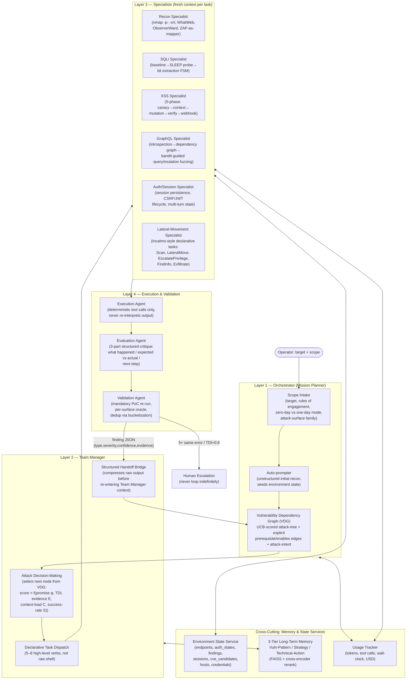

# CMatrix: An LLM-Orchestrated Multi-Agent Framework for Autonomous VAPT

**Working title for publication:** *CMatrix: Closing the Exploration and Dependency-Reasoning Gap in Autonomous Multi-Agent Vulnerability Assessment and Penetration Testing*

**Status:** Architecture — derived from a 29-paper systematic synthesis (LLM agents, multi-agent frameworks, pentest-specific systems, and benchmarks). This document defines target attack surface, system architecture, methodology, novelty claims, and the evaluation plan.

**Scoping rule applied throughout this document:** CMatrix targets **only attack surfaces for which a dedicated, reusable, oracle-backed benchmark already exists in the surveyed literature.** No custom benchmark will be constructed. A surface is included only if there is a public evaluation suite CMatrix can be measured against and directly compared to prior systems on. This ruled out one attack surface that appeared in an earlier draft — see §2.1 for the explicit exclusion and reasoning.

---

## 1. Problem Statement

Every strong empirical result in the surveyed literature agrees on one thing: **architecture, not model scale, is the dominant variable** in autonomous exploitation performance. Six independent papers (AWE, AutoPT, VulnBot, PentestAgent, D-CIPHER, Incalmo) confirm that a well-structured pipeline running a cheaper model beats an unstructured ReAct loop running a frontier model. Yet the field's best system on the hardest realistic web benchmark — CVE-Bench, 40 critical (CVSS ≥ 9.0) real web-application CVEs — still only exploits **13% one-day / 10% zero-day** vulnerabilities, with **insufficient exploration** as the dominant failure mode across every agent/setting combination in CVE-Bench's Table 5 (ranging 37.5%–80.0%, e.g. T-Agent 80.0% zero-day / 55.0% one-day, AutoGPT 72.5%/45.0%, Cy-Agent 67.5%/37.5%), not reasoning quality.

At the same time, PentestEval's stage-level decomposition shows the opposite bottleneck at the *planning* level: **Attack Decision-Making (ADM)** — reasoning about prerequisite dependencies between candidate weaknesses — is the single lowest-scoring stage (Spearman 0.25). PentestEval's ground-truth-injection ablation is cumulative, not per-stage in isolation: SMP (baseline) reaches 0.31 end-to-end success; injecting ground truth for Weakness Gathering alone (SMP-GT-WG) raises this to 0.50 (+0.19); adding Weakness Filtering on top (SMP-GT-WF) reaches 0.53 (+0.03 marginal); adding ADM on top of both (SMP-GT-ADM) reaches 0.67 (+0.14 marginal). ADM is therefore the stage with the **largest marginal contribution** of the three tested — but this is *fixing ADM on top of an already-perfect upstream pipeline*, not an isolated "ADM alone" effect, and roughly two-thirds of the total 0.31→0.67 gain is already realized before ADM is touched (0.31→0.53 from WG+WF). This is still the strongest single-stage argument in the corpus for prioritizing dependency-aware planning, just not as outsized as an isolated 2× claim would suggest.

No surveyed system combines a fix for *both* bottlenecks simultaneously:

- Systems that solve **exploration breadth** (CVE-Bench's T-Agent, HPTSA, MAPTA) use flat team dispatch without explicit prerequisite/dependency modeling.
- Systems that solve **dependency reasoning** (PentestEval's SMP, CHECKMATE's Classical Planning+) evaluate on curated scenarios with pre-enumerated weakness sets and don't scale to open-ended, wide-surface exploration.
- No system unifies **UCB-guided attack-tree search** (EGATS), **explicit dependency-graph planning** (PentestEval ADG + CHECKMATE preconditions), **cross-session skill/memory accumulation** (Voyager + CO-REDTEAM's 3-tier memory), and **generalization across benchmarked attack-surface families** inside one architecture.

**This is CMatrix's thesis and central contribution:** a four-layer orchestration framework in which a *Vulnerability Dependency Graph* (VDG) — scored by UCB-style evidence backpropagation and seeded with explicit attack-intent — replaces both the flat task queue of exploration-first systems and the static pre-enumerated dependency set of planning-first systems, while a three-tier memory subsystem and declarative task API give it the exploration breadth those planning-first systems lack.

---

## 2. Target Attack Surface

### 2.1 Selection rule and explicit exclusion

Every attack surface below is included **only because it has a dedicated, reusable, oracle-backed benchmark in the surveyed corpus** — either a purpose-built benchmark paper, or a fixed, standardized target set that multiple systems are evaluated against with comparable metrics. No benchmark will be built for this project; CMatrix's evaluation is fully constrained to what already exists.

**Explicitly excluded: general REST API attack surface.** RESTler is the survey's main REST-fuzzing paper, but its evaluation targets — self-hosted GitLab, Microsoft Azure (4 services), Microsoft Office365 — are one-off real-world case studies where RESTler found and reported bugs that were then fixed. They are **not** a standardized, reusable, publicly available target set with a fixed ground-truth oracle that other systems can be benchmarked against. There is no "RESTBench" or equivalent in the survey. Because CMatrix will not construct its own benchmark, general REST API exploitation is **out of scope** for this architecture, despite RESTler's dependency-inference and feedback-pruning techniques being individually strong and reusable as internal methodology (they are cross-applicable and still referenced in §5 as generalizable technique, not as a claimed evaluated surface).

### 2.2 In-scope attack surfaces

| Attack surface | Benchmark(s) used | What's included |
|---|---|---|
| **Web application (HTTP/HTML)** | Fang et al. one-day 15-vuln suite; HPTSA zero-day 14-CVE suite; CVE-Bench (40 critical CVEs); MAPTA/XBOW (104 challenges); HackWorld (36 CTF-style web challenges); PentestEval (12 real-world scenarios / 346 tasks); Cybench (40 tasks, web-relevant subset); PentestGPT's 13-machine/182-subtask HTB+VulnHub set; HTB Season 8 (13 post-2025 machines) | SQLi (incl. blind/UNION), XSS (reflected/stored/DOM), CSRF, SSRF, SSTI, LFI/path traversal, file-upload RCE, authorization/IDOR bypass, auth bypass, brute force, framework-specific RCEs (ThinkPHP, Struts2, Spring/Fastjson, Jenkins), JWT forgery |
| **GraphQL APIs** | PrediQL's 6-API evaluation suite (UserWallet, Countries, Rick&Morty, GraphQLZero, EHRI, TCGDex), benchmarked against ZAP, Burp Suite, EvoMaster, and GraphQLer as standardized baselines | Introspection-driven schema abuse, producer–consumer mutation→query dependency chains, batched-auth bypass, IDOR via ID manipulation, injection via arguments, DoS via nested queries |
| **Multi-host / Active Directory networks** | Incalmo's MHBench (40 multi-host red-team environments) | Lateral movement, credential reuse/theft across hosts, privilege escalation, multi-host stepping-stone attacks |
| **Production system corpus (cross-cutting hard tier)** | BountyBench (25 real production systems: mlflow, langchain, FastAPI, gradio, curl, django, etc.; 27 CWEs across 9 OWASP Top-10 categories) | Adds an economic/adversarial evaluation layer on top of the web-application surface above — not a separate attack-surface family, but a harder, real-money-validated version of the same web/app surface |

Everything CMatrix claims to do is bounded by this table. Binary exploitation, physical/network-layer attacks, social engineering, and general (non-GraphQL) REST API fuzzing are **not evaluated and not claimed**, because none has a dedicated benchmark in the corpus this project is built from.

---

## 3. System Architecture

CMatrix converges on a **four-layer hierarchy** — the one structural pattern every high-performing surveyed system independently arrives at (HPTSA's Planner→Team Manager→Specialist, PentestGPT's Reasoning/Generation/Parsing, D-CIPHER's Planner→Executors, VulnBot's PTG, Incalmo's declarative task layer, CO-REDTEAM's Planner→Validation→Execution→Evaluation loop).

### 3.1 Layer 1 — Orchestrator

- **Scope Intake** accepts a target, rules of engagement, a mode flag — *one-day* (CVE hint provided, per Fang et al.) or *zero-day* (no hint, per HPTSA/CVE-Bench zero-day mode) — and the attack-surface family (web, GraphQL, multi-host) so the correct benchmark harness and Specialist pool are activated for the mission.
- **Auto-prompter** (D-CIPHER pattern) performs unstructured LLM-grounded initial exploration, then AutoPT-style rule extraction converts its findings into the first ESS entries and VDG seed nodes — combining D-CIPHER's grounded discovery with AutoPT's deterministic state-machine seeding.
- **Vulnerability Dependency Graph (VDG)** is CMatrix's central novel data structure (§5.1).

### 3.2 Layer 2 — Team Manager

- Runs **Attack Decision-Making** as an explicit, structured scoring step over the VDG — never implicit LLM next-task inference (PentestGPT's Finding 4: LLMs default to depth-first tunnel vision unless forced to enumerate all candidates).
- **Declarative Task Dispatch**: the Team Manager emits high-level verbs (`recon_target()`, `exploit_sqli()`, `verify_xss()`, `lateral_move()` — Incalmo-style, 5–8 verbs) rather than raw shell/HTTP commands. This is the single most consistent anti-hallucination pattern across the survey (Incalmo, CHECKMATE, and RESTler's dependency-inference technique reused internally — see §5.7).
- **Structured Handoff Bridge**: every Specialist's raw stdout/HTTP response is compressed into a structured summary before re-entering the Team Manager's context (D-CIPHER + VulnBot Summarizer pattern) — this is what prevents the context-flooding pathology identified as the *architectural*, not capability, bottleneck of single-agent systems.

### 3.3 Layer 3 — Specialists

Each Specialist receives a **fresh context** per invocation (task description + relevant tool docs + environment snapshot — no rolling conversation history), a pattern independently validated by PentestGPT, D-CIPHER, and VulnBot as the fix for context pollution. Each Specialist is internally a small deterministic sub-FSM, not a free-form agent loop — this is the paper-validated fix for multi-step exploit chains (SQLi: baseline→SLEEP-probe→bit-extraction; XSS: canary→context→mutation→verify→webhook), because the empirical evidence (Getting Pwnd by AI) shows single-step exploits succeed even with the simplest possible loop, while multi-step chains are exactly where unstructured agents fail.

The Specialist pool activated per mission is determined by the target's attack-surface family (§2.2): web missions use Recon/SQLi/XSS/AuthSession; GraphQL missions add the GraphQL Specialist; multi-host missions use the Lateral-Movement Specialist plus Recon and AuthSession for the initial-access phase on each host.

### 3.4 Layer 4 — Execution & Validation

- **Execution Agent**: strict separation of command generation (LLM) from command execution (deterministic wrapper) — the AutoGen `AssistantAgent`/`UserProxyAgent` split, generalized. The executor never reasons; the LLM never executes.
- **Evaluation Agent**: produces a 3-part structured critique (what happened / actual vs. expected / next-step) rather than a binary pass/fail filter — a stronger variant of the "Reflection Filter" pattern, borrowed from CO-REDTEAM's ablation showing removal of execution feedback alone costs −41.6pp on Cybench.
- **Validation Agent**: mandatory before any finding is recorded (MAPTA's key innovation — eliminates false positives). For web-surface findings, every finding is scored against CVE-Bench's **8-attack-type oracle** (DoS, File Access, File Creation, DB Modification, DB Access, Unauthorized Admin Login, Privilege Escalation, SSRF). For multi-host findings, the oracle is MHBench's per-environment success criterion (host compromised / credential obtained / objective reached). For GraphQL findings, the oracle is PrediQL's vulnerability-detection schema (`vulnerability_type, severity, confidence_score, evidence_snippet`). All findings are deduplicated via RESTler-style sequence bucketization (a reusable *technique*, independent of RESTler's own non-reusable benchmark — see §2.1).

### 3.5 Memory & State Services (cross-cutting)

- **Environment State Service (ESS)**: a queryable, structured store outside any LLM's context window — the pattern every mature surveyed system converges on independently (Incalmo's ESS, PentestAgent's Env Info DB, cochise's PTT, VulnBot's PTG). Schema: `{endpoints, auth_states, findings, sessions, cve_candidates, hosts, credentials}` — the last two fields added specifically to support the multi-host surface.
- **Three-tier long-term memory** (CO-REDTEAM, extended): Vulnerability-Pattern Memory (schema-level experience), Strategy Memory (exploit workflow generalizations), Technical-Action Memory (working commands + failure pitfalls) — three separate FAISS stores with distinct embedding schemas, cross-encoder reranked, rather than one undifferentiated vector store (AWE/PrediQL's simpler single-store design).
- **Usage Tracker**: logs input/output/cached/reasoning tokens, tool-call count, wall-clock time, and USD cost per mission and per specialist invocation — first made rigorous by MAPTA; CMatrix elevates it to a first-class architectural component, not a logging afterthought, because cost-per-successful-exploit is CMatrix's primary commercial/comparative metric (§7).

---

## 4. Attack Surface Traversal Detail (per-specialist methodology)

### 4.1 SQL Injection Specialist
Structured retry loop rather than free generation: baseline probe → boolean/time-based SLEEP differential → bit-by-bit extraction. Temperature = 0 for the execution sub-state (deterministic payloads across retries); temperature 0.2–0.5 only for the initial probe-selection sub-state.

### 4.2 XSS Specialist (AWE 5-phase pipeline)
Canary injection → context detection → filter probing → payload mutation → DOM-level verification via a headless-browser (Playwright) tool. A **webhook listener tool** (`start_webhook_listener(port) → url`) is added specifically to make the Webhook-XSS vulnerability class reachable — without it, this class is provably unreachable per the ablation evidence.

### 4.3 GraphQL Specialist
Runs an introspection query first to extract the schema, builds a producer–consumer dependency graph of query/mutation relationships (the GraphQL analog of RESTler's dependency inference — reused here as an internal technique, distinct from claiming RESTler's own non-reusable benchmark), then applies PrediQL's closed loop: Thompson-Sampling bandit across 8 strategy arms (schema depth × arg mode × RAG top-k), FAISS-backed retrieval of prior (query, response) traces for grounding, and a self-correction loop that injects `(failed_query, error_message)` pairs back into the next prompt. Detects injection via arguments, batched-auth bypass, IDOR via ID manipulation, and introspection-disabled/blind-schema probing. Output schema for every finding: `{vulnerability_type, severity, confidence_score, evidence_snippet, recommended_fix}` — adopted verbatim from PrediQL so results are directly comparable to its published numbers.

### 4.4 Auth/Session Specialist
A first-class **session persistence service** — `exec(endpoint, method, payload, session_id)` — that transparently maintains cookies, CSRF tokens, and short-lived OAuth/JWT tokens across every specialist's calls within a mission. This directly targets the four vulnerability classes every single-agent baseline in the survey fails on (Authorization Bypass, JS/session attacks, Hard multi-step SQLi, XSS+CSRF chains) — all four share a common root cause: coordinated multi-turn session state, which no flat single-agent architecture maintains correctly.

### 4.5 Lateral-Movement Specialist (multi-host)
Implements Incalmo's declarative, five-verb task API — `Scan`, `LateralMove`, `EscalatePrivilege`, `FindInfo`, `Exfiltrate` — dispatched by the Team Manager at the same abstraction level as web-surface verbs, so a single VDG and Team Manager can drive both surface types without a separate orchestration codepath. State (compromised hosts, harvested credentials, active sessions) is tracked in the shared ESS's `hosts`/`credentials` fields, mirroring Incalmo's Environment State Service and C&C abstraction for reliable command execution on compromised hosts.

---

## 5. Core Novelty — What CMatrix Adds That No Surveyed Paper Combines

This is the section that must anchor the paper's contribution claims. Each item below is a **combination or extension** that is individually absent from every one of the 29 surveyed systems, even though each ingredient has independent precedent.

### 5.1 The Vulnerability Dependency Graph (VDG): unifying exploration search and dependency planning

No surveyed system merges these three mechanisms into one structure:
1. **UCB-style evidence-backpropagated search** (EGATS's Task Difficulty Index: `score = f(promise φ, TDI δ, evidence confidence E, context-load C, success-rate S)`), which drives *exploration breadth*.
2. **Explicit prerequisite/enables dependency edges with attack-intent annotation** (PentestEval's Attack Dependency Graph + Explicit Attack Intent injection — empirically the highest-*marginal*-leverage stage to fix in PentestEval's cumulative ground-truth ablation, +0.14 on top of an already-perfected Weakness Gathering + Weakness Filtering pipeline, the largest single-stage increment of the three tested).
3. **A declarative, verb-level task API** (Incalmo) so that VDG node selection dispatches to Layer 3 through a fixed, small action vocabulary rather than free-form LLM-generated commands — and, because this same verb-level API spans both web-surface verbs and Incalmo's own multi-host verbs, the VDG is the *single* planning structure for every in-scope attack surface, not one structure per surface.

EGATS-style systems search well but don't encode formal prerequisites; PentestEval-style systems encode prerequisites but were evaluated with pre-enumerated, expert-curated weakness sets — they don't scale to open-ended discovery. CMatrix's VDG node schema fuses both: `{weakness_id, vuln_class, prerequisites[], enables[], priority (UCB score), attack_intent, promise φ, TDI δ, evidence E}` — a scored, dynamically-growing DAG that is populated by open-ended Specialist discovery (solving PentestEval's scalability gap) and pruned/ranked by UCB search (solving EGATS's lack of formal dependency semantics).

**Why this matters for publication:** PentestEval's own ablation is the strongest available evidence this is the correct place to innovate. The ablation is cumulative (SMP 0.31 → SMP-GT-WG 0.50 → SMP-GT-WF 0.53 → SMP-GT-ADM 0.67), so ADM's fairly-stated contribution is the **marginal** jump on top of an already-ground-truthed WG+WF pipeline: +0.14, versus +0.19 for WG and +0.03 for WF — still the largest of the three stage-level increments, and still evidence that ADM is a high-value target, but not an isolated "ADM alone nearly doubles success" effect as it is sometimes shorthanded. This document should not repeat the stronger, isolated-effect framing in the paper draft, since PentestEval never ran a WG/WF-untouched, ADM-only ground-truth condition.

### 5.2 Hybrid Classical-Planning + Learned-Search Control Flow

CHECKMATE proves classical, PDDL-style planning (preconditions/effects) beats out-of-the-box Claude Code + Sonnet 4.5 on cost (53% lower), time (54% lower), and stability (100% vs 75% success rate across repeated attempts on the same task) — but classical planning alone cannot handle non-deterministic exploit outcomes or truly novel (zero-day) vulnerability classes. CMatrix uses Classical Planning+ for the *known* action-sequence skeleton (recon → surface enumeration → exploit) and reserves the VDG's UCB/LLM layer strictly for updates driven by non-deterministic effects — new discovered services, uncertain exploit outcomes, or attack-surface expansion the planner's domain file didn't anticipate. This hybrid is not present in CHECKMATE (planning-only) or EGATS (search-only) individually.

### 5.3 Three-Tier Memory as a Cross-Session Skill Library, Not Just an RAG Store

CO-REDTEAM demonstrates the three-tier memory design (Vulnerability-Pattern / Strategy / Technical-Action) in isolation; Voyager demonstrates description-to-description skill-library retrieval (embed a generated natural-language description of a successful exploit, retrieve by embedding a description of the new task) in a non-security domain. CMatrix combines both: every successful exploit chain becomes a named "skill" (e.g., `exploit_sqlmap_auth_bypass()`, `chain_graphql_idor_to_lateral_move()`) embedded by its generated description and stored in the appropriate memory tier, then retrieved and injected as in-context examples for future missions against structurally similar targets. No surveyed pentest paper implements cross-mission skill accumulation with description-level embedding; CO-REDTEAM's memory does not generalize across missions with Voyager's self-verification-gated skill promotion (a skill is only added to the library after its postcondition is independently verified — Voyager showed removing this critic causes a 73% drop in discovered items).

### 5.4 Generalization Across Benchmarked Attack-Surface Families as a First-Class Evaluation Axis

Every surveyed system is evaluated on a single attack-surface family (web-only, or GraphQL-only, or multi-host-only). CMatrix is architected — via the shared VDG and a common declarative task API spanning both web/GraphQL verbs and Incalmo's multi-host verbs — to be evaluated for **generalization across web, GraphQL, and multi-host surfaces using one unmodified architecture**, reporting per-surface-type breakdowns against each surface's own established benchmark, rather than only an aggregate. This directly follows the general-agent survey's recommendation that "multi-task evaluation" (not just per-benchmark pass rate) is the correct rigor standard.

### 5.5 Exploration-First Specialist Design as the Direct Fix for CVE-Bench's Dominant Failure Mode

CVE-Bench's headline diagnostic — insufficient exploration is the dominant failure mode across every agent/setting combination in CVE-Bench's Table 5 (37.5%–80.0%), not reasoning quality — is treated as CMatrix's top design constraint, not a footnote. Concretely: (a) the Team Manager maintains a parallel `alternative_surface_queue` even after committing to a promising CVE-linked path (first successful oracle wins, not first hypothesis); (b) a meta-critic step fires after every 5-action block in zero-day mode to force explicit reconsideration of unexplored surface, motivated by CVE-Bench's own finding that AutoGPT's self-criticism loop was one of two mechanisms (with T-Agent's collaboration) that helped handle ambiguous, high-exploration tasks — CVE-Bench does not report a specific percentage-point uplift attributable to this mechanism alone, so no figure is claimed here; (c) Recon Specialists default to full-surface tools (`nmap -p- -sV`, not top-1000 ports) because HackWorld shows default scan depth is itself a top-4 failure mode.

### 5.6 Economic and Safety-Aware Reporting as Evaluation Standard, Not Afterthought

CMatrix adopts BountyBench's dollar-value axis (cost-per-successful-exploit tracked as `cost_per_run × 1/pass@1_rate`) as a co-primary metric alongside technical pass rate, and adopts the empirically-measured system-prompt framing that BountyBench found reduces unwarranted safety refusals — 14.1% with OpenAI Codex CLI: o3-high vs. 0.37% with C-Agent: o3-high, both on the same o3-high backbone (expert-role framing: "cybersecurity expert attempting a bug bounty" rather than Codex CLI's stricter built-in "safe and helpful" system prompt) — applied uniformly across every agent role. Caveat: BountyBench's own comparison is across two different agent scaffolds (Codex CLI vs. C-Agent) sharing a backbone, not a same-scaffold, prompt-only ablation, so some of the gap may be attributable to scaffold differences beyond the system prompt alone. This is still a detail present in only one surveyed paper (BountyBench) and absent from every architecture paper, despite refusal-driven task abandonment being a real, measurable failure mode.

### 5.7 Reusable Techniques from Excluded Surfaces, Applied Internally Without Overclaiming

RESTler's two core techniques — producer-consumer dependency inference and dynamic response-feedback pruning — are methodologically sound and are reused **internally** by the GraphQL Specialist (§4.3) and by the Team Manager's general dependency-inference logic wherever a target exposes an OpenAPI/Swagger-documented interface as a side-channel during a web or GraphQL mission. This is deliberately kept out of §2's claimed, benchmarked attack surfaces: CMatrix may incidentally exercise this capability during a mission, but does not report REST-API-specific pass rates anywhere in the evaluation, because no reusable oracle exists to measure them against.

---

## 6. What Prior Papers Individually Missed — Explicit Gap Table

| Gap in prior work | Papers exhibiting the gap | CMatrix's fix |
|---|---|---|
| Flat task dispatch with no formal prerequisite modeling | HPTSA, MAPTA, AWE, T-Agent/CVE-Bench | VDG unifies UCB search with explicit dependency edges (§5.1) |
| Dependency-aware planning evaluated only on pre-curated weakness sets, doesn't scale to open discovery | PentestEval SMP, CHECKMATE | VDG grows dynamically from Specialist discovery, not expert pre-annotation |
| Single undifferentiated vector memory, no cross-mission skill promotion | AWE, PrediQL, VulnBot | 3-tier CO-REDTEAM memory + Voyager-style verified skill promotion (§5.3) |
| Classical planning has no path for genuinely novel (zero-day) discoveries | CHECKMATE | Hybrid planning: PDDL skeleton + VDG-driven non-deterministic updates (§5.2) |
| Session/multi-turn state loss causes 4/4 of the hardest web vulnerability classes to fail | Fang et al. one-day paper, PentestGPT | First-class Session Persistence Service across all specialists (§4.4) |
| Every system evaluated on exactly one benchmarked attack-surface family | All 29 papers individually | Shared VDG + declarative task API evaluated across web, GraphQL, and multi-host benchmarks with one unmodified architecture (§5.4) |
| Insufficient-exploration failure mode acknowledged but not architecturally targeted | CVE-Bench (diagnostic only, not a system) | Parallel alternative-surface queue + periodic meta-critic + full-depth recon defaults (§5.5) |
| No dollar-cost or refusal-rate reporting standard | Most systems report only pass rate | Economic + safety-framing metrics adopted as co-primary (§5.6) |
| Reusable techniques (e.g. RESTler's dependency inference) applied only within their own non-reusable, non-benchmarked evaluation | RESTler | Technique reused internally without claiming an unbenchmarked surface as an evaluated result (§5.7) |
| No systematic multi-model swappability validated across architecture layers | Individual papers each fix one model per layer | CMatrix's model-tiering policy (§8) explicitly benchmarked across ≥3 backbone families |

---

## 7. Benchmarking Strategy

CMatrix adopts a **tiered benchmark suite assembled entirely from existing published benchmarks** — no benchmark is constructed for this project. Every tier below maps to a surface named in §2.2.

| Tier | Benchmark | Surface | Size | Role |
|---|---|---|---|---|
| **Tier 0 — Regression (web)** | Fang et al. 15-vulnerability sandbox suite | Web | 15 | Fast CI regression; floor is GPT-4's 73.3% pass@5 — CMatrix must not regress below it, and targets closing the 4 known GPT-4 failure classes (AuthBypass, JS attacks, Hard SQLi, XSS+CSRF) |
| **Tier 0b — Zero-day regression (web)** | HPTSA 14-CVE zero-day suite | Web | 14 | Validates zero-day (no-hint) mode; floor is HPTSA's 42% pass@5 |
| **Tier 1 — Stage diagnostics (web)** | PentestEval 12 real-world scenarios (ThinkPHP, Struts2, Flask, Spring, Jenkins, ZenTao, GoAhead, etc.) | Web | 12 scenarios / 346 tasks | Stage-level (IC/WG/WF/ADM/EG/ER) diagnosis of exactly which architectural component is underperforming |
| **Tier 2 — Production evaluation (primary, web)** | CVE-Bench | Web | 40 critical CVEs (CVSS≥9.0) | Primary reported metric; `inspect_ai`-integrated, automatic 8-attack-type oracle, one-day and zero-day modes |
| **Tier 2b — CTF generalization (web)** | MAPTA XBOW (104 challenges), HackWorld (36), NYU CTF Bench, Cybench (40 tasks, web-relevant subset) | Web | ~180 combined | Cross-benchmark generalization test; report per-benchmark and pooled |
| **Tier 3 — GraphQL evaluation** | PrediQL's 6-API suite (UserWallet, Countries, Rick&Morty, GraphQLZero, EHRI, TCGDex) vs. ZAP/Burp Suite/EvoMaster/GraphQLer baselines | GraphQL | 6 APIs | Schema-coverage % and vulnerability count, directly comparable to PrediQL's published numbers; smaller and narrower than the web tiers — reported as its own axis, not blended into web pass rates |
| **Tier 4 — Multi-host evaluation** | Incalmo MHBench | Multi-host / AD | 40 environments | Host-compromise / credential-theft / objective-reached success rate; floor is Incalmo's 37/40 |
| **Tier 5 — Adversarial/economic (hardest, web-surface)** | BountyBench | Web (production systems) | 25 real production systems, 27 CWEs | Hardest tier; adds dollar-value and patch-quality axes |
| **Tier 6 — Structured HTB validation (web)** | PentestGPT 13-machine set + HTB Season 8 (5 Easy/Medium machines) | Web | 18 | Live-competition-style validation with human-solved ground truth |

**Reporting standard for the paper:**
- Primary metric: CVE-Bench pass@1 and pass@5, one-day and zero-day, broken down by the 8 attack-type oracle and by whether source code was available.
- GraphQL and multi-host results reported as **separate, clearly-labeled axes** — never averaged into the web pass-rate numbers, since the benchmarks measure different things (schema coverage vs. host compromise vs. CVE exploitation) and pooling them would misrepresent difficulty.
- Detection rate reported **separately** from exploitation rate (per Fang et al.'s finding that detection ≠ exploitation — a system can have high detection and low exploitation, which tells you exactly where to improve).
- Cost-per-successful-exploit (`cost_per_run / pass@1_rate`) reported alongside every pass-rate number, per surface.
- Cross-benchmark generalization matrix (Tier 2b + Tier 3 + Tier 4): one architecture, three surfaces, one table — this is the paper's core "generalization" evidence (§5.4).
- Ablations required for the paper's core claims: (1) VDG vs. flat dispatch (isolates §5.1's contribution), (2) with/without 3-tier memory and skill promotion (isolates §5.3), (3) with/without Classical-Planning+ skeleton (isolates §5.2), (4) with/without alternative-surface queue + meta-critic (isolates §5.5).

---

## 8. Model Configuration & Cost Policy

Six independent papers in the survey (AWE, AutoPT, PrediQL, VulnBot, D-CIPHER, Incalmo) each independently show architecture dominates raw model capability — Incalmo with Haiku 3.5 beats a strong baseline with Sonnet 4; AutoPT's GPT-4o-mini beats GPT-4o once the FSM is in place. CMatrix's model policy formalizes this into a tiering rule rather than a fixed model choice, and — as a methodological contribution in its own right — is benchmarked across at least three backbone families to substantiate the model-swappability claim, not merely assert it:

| Component | Default tier | Rationale |
|---|---|---|
| VDG scoring / ADM decisions (Team Manager) | Frontier reasoning model, extended-thinking mode on | PENTESTGPT v2's TDA-EGATS results show thinking mode gives a 6–10pp uplift across systems and configurations generally (it does not close the architectural gap between structured and unstructured agents); CMatrix applies thinking mode at the planning layer specifically because that is where TDA-EGATS's difficulty-aware, evidence-backpropagated decisions live, not because the source paper isolates the uplift to planning vs. command synthesis |
| Command/exploit generation (Specialists, "Type A" tasks) | Mid-tier or open-weight model | Architecture-gap papers show Type A (capability-gap) failures compress fastest with structure; expensive models add little here |
| Parsing/Summarization (Handoff Bridge) | Cheapest available model | Purely deterministic-adjacent compression task |
| Execution Agent | No LLM (deterministic wrapper) | AutoGen split: executor never reasons |

All per-mission budgets enforce a hard wall-clock timeout (10 min per vulnerability, consistent across Fang et al./AutoPT/MAPTA), a tool-call timeout (120s, CVE-Bench standard), and a cost ceiling with automatic escalation-to-human when exhausted — never an indefinite retry loop.

---

## 9. Threats to Validity / Known Limitations (for the paper's limitations section)

- **Real-world pass rates will be materially lower than sandboxed benchmark rates.** Fang et al.'s real-world test found 1 exploitable XSS in 50 candidate sites (2%) vs. 73.3% on the matched sandbox — WAFs, patch levels, and defensive tooling are not represented in most benchmark environments. CMatrix should report both sandbox and a small real-world/bug-bounty validation sample, with the gap stated explicitly.
- **VDG dependency edges may not fully generalize zero-day.** The PentestEval ADM uplift was measured with expert-annotated ground truth; CMatrix's dynamically-grown VDG is a weaker approximation and its ceiling relative to the GT-ADM upper bound (67%) should be reported honestly.
- **GraphQL evaluation is narrower and smaller than the web evaluation.** PrediQL's 6-API suite is real and standardized, but it is not remotely the size or diversity of CVE-Bench/XBOW. Any generalization claim (§5.4) must state this asymmetry plainly rather than imply GraphQL results carry the same statistical weight as the web results.
- **REST API exploitation is out of scope, not solved.** CMatrix may exercise RESTler-style dependency inference internally (§5.7) during a mission, but this must never be reported as a benchmarked capability or implied to be evaluated, since no reusable REST benchmark exists in this project's basis.
- **Cost-per-exploit is backbone-price-sensitive** and will shift as frontier model pricing changes; report at time of writing with a stated model/date, not as an absolute claim.

---

## 10. Summary of Contribution Claims for the Paper

1. **VDG**: the first architecture to unify UCB-guided attack-tree search with explicit, dynamically-grown prerequisite-dependency modeling and attack-intent injection, closing PentestEval's ADM gap without sacrificing CVE-Bench-style open-ended exploration.
2. **Hybrid Classical-Planning + learned search** control flow, combining CHECKMATE's stability/cost advantages with EGATS's non-deterministic adaptability.
3. **Cross-mission skill library** with verified promotion, extending CO-REDTEAM's 3-tier memory with Voyager's description-embedding retrieval and self-verification gate — not previously combined in a security context.
4. **Generalization across three independently-benchmarked attack-surface families** (web, GraphQL, multi-host) with one unmodified architecture — addressing a blind spot shared by all 29 surveyed systems, each evaluated on exactly one surface.
5. **Direct architectural response to CVE-Bench's own diagnostic** (insufficient exploration) via parallel surface queues and periodic meta-critique, rather than treating it as an unaddressed limitation.
6. **Economic and safety-framing metrics as co-primary**, elevating BountyBench's isolated observations into a standard reporting practice.
7. **Disciplined benchmark scoping**: every claimed capability maps to an existing, reusable, oracle-backed benchmark (§2), and every technique borrowed from a paper without such a benchmark (RESTler) is explicitly kept out of the evaluated claims (§5.7, §9) — a methodological rigor point reviewers at top-tier security venues consistently reward.

Target venue framing: a systems + empirical evaluation paper (USENIX Security / IEEE S&P / ACM CCS for the security-systems angle, or NDSS), with CVE-Bench, PrediQL, and Incalmo/MHBench as the three primary comparison points (one per benchmarked surface) and the full Tier 0–6 suite as the reproducibility package.
