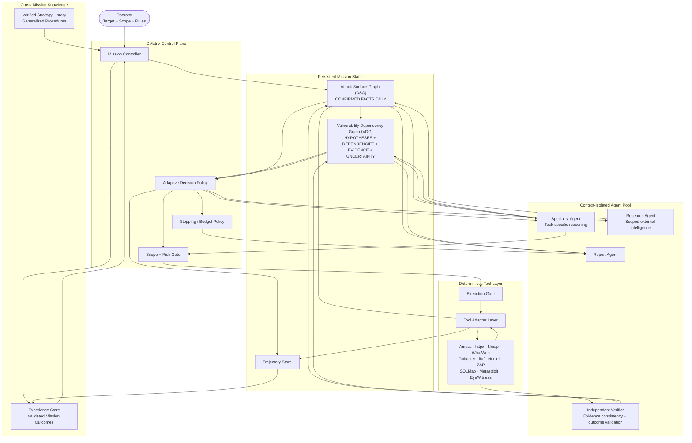

# CMatrix: Research-Grade Architecture
## Execution-Grounded, Uncertainty-Aware Vulnerability Dependency Graph for LLM-Orchestrated Autonomous VAPT

**Working title:**  
**CMatrix: Execution-Grounded Dependency-Aware Search for Autonomous Vulnerability Assessment and Penetration Testing**

**Document status:** Updated research architecture / implementation blueprint

**Research objective:**  
CMatrix investigates whether an execution-grounded, uncertainty-aware, dependency-aware decision policy can improve autonomous VAPT by dynamically allocating exploration and exploitation effort over a continuously constructed vulnerability dependency graph.

> **Core research question:**  
> Can a dynamically constructed Vulnerability Dependency Graph (VDG), combined with execution feedback, uncertainty estimation, adaptive exploration/exploitation, independent verification, and verified cross-mission memory, improve validated attack-path success and assessment efficiency under equalized model, tool, time, and budget conditions?

---

# 1. Research Positioning

CMatrix is not proposed merely as an integration of an LLM with existing VAPT tools.

The research hypothesis is that autonomous VAPT fails for two interacting reasons:

1. **Exploration failure:** an agent commits to promising findings too early and leaves relevant attack surface unexplored.
2. **Dependency-reasoning failure:** even after vulnerabilities are discovered, the agent may fail to reason about prerequisites, enabling relationships, evidence, and the sequence required to validate an attack path.

The proposed architecture addresses these problems with a structured control loop:

**Observe → Model → Generate hypotheses → Select action → Execute → Verify → Update state → Replan**

The central research object is the **VDG**, not the number of agents or tools.

---

# 2. Evidence Classification

Every major architectural claim is classified before implementation.

| Classification | Meaning |
|---|---|
| **Established evidence** | Supported by the surveyed literature or current benchmark evidence |
| **Research hypothesis** | Plausible mechanism that must be experimentally validated by CMatrix |
| **Engineering mechanism** | Required for implementation/reproducibility but not claimed as scientific novelty |
| **Speculation** | Must not be presented as a result until experimentally demonstrated |

### Established evidence used by the architecture

The surveyed work consistently indicates that:

- structured planning can outperform unstructured agent loops;
- execution feedback and validation materially affect autonomous cyber performance;
- context/state management is a major bottleneck;
- dependency-aware attack decision-making is important;
- exploration is a major failure mode;
- persistent memory can improve repeated reasoning tasks.

Current benchmark work further indicates that autonomous penetration systems still exhibit substantial variation in success and that planning/state-management failures remain important.

### CMatrix hypotheses

CMatrix will test whether:

- dynamic VDG search improves validated attack-path success;
- adaptive exploration/exploitation improves coverage per unit budget;
- execution-grounded replanning improves recovery from failed actions;
- explicit uncertainty reduces incorrect attack-path pursuit;
- verified cross-mission strategies improve repeated-target efficiency without increasing negative transfer.

These are hypotheses, not guaranteed outcomes.

---

# 3. Scope

## 3.1 Assessment modes

- **Black-box:** no credentials or internal target knowledge supplied.
- **Grey-box:** explicitly authorized partial knowledge may be supplied.

White-box/source-code analysis is not part of the core architecture.

## 3.2 Primary research scope

The first CMatrix paper should prioritize:

- web applications;
- vulnerability discovery;
- dependency-aware exploitation/validation;
- attack-path reasoning;
- evidence collection;
- autonomous replanning.

GraphQL and multi-host environments may be used for generalization experiments where an appropriate reusable benchmark exists.

## 3.3 Scope discipline

CMatrix must not claim a capability merely because the implementation can technically invoke a tool.

A capability becomes a research claim only when:

1. an evaluation target exists;
2. a reproducible oracle or ground truth exists;
3. the capability is compared against appropriate baselines.

General REST API exploitation, arbitrary cloud/mobile/IoT attacks, social engineering, physical attacks, and white-box analysis are not core evaluated claims unless a suitable benchmark is explicitly added later.

---

# 4. Scientific Contributions

CMatrix intentionally limits the primary contribution claims to three.

## C1. Execution-Grounded Vulnerability Dependency Search

CMatrix introduces a dynamically constructed **Vulnerability Dependency Graph (VDG)** that represents candidate vulnerabilities, prerequisites, enabling relationships, evidence, uncertainty, expected information gain, cost, and action history.

The VDG combines:

- open-ended discovery;
- dependency-aware attack reasoning;
- adaptive exploration/exploitation;
- execution feedback.

The scientific question is whether this representation and policy outperform flat task dispatch, LLM-only ranking, dependency-only planning, and non-adaptive search under equalized budgets.

## C2. Uncertainty-Aware Closed-Loop Replanning

CMatrix separates:

- observed facts;
- hypotheses;
- planned actions;
- execution outcomes;
- verified findings.

After every meaningful execution event, the planner updates confidence and action value rather than continuing a stale plan.

The scientific question is whether this reduces dead-end pursuit, false validation, redundant actions, and time-to-validated-attack-path.

## C3. Verified Cross-Mission Procedural Learning

CMatrix stores validated mission outcomes and can promote recurring successful patterns into reusable, technology-scoped strategies.

A strategy is not promoted merely because an LLM claims success.

Promotion requires repeated validated evidence under predefined criteria.

The scientific question is whether verified procedural memory improves future missions while controlling negative transfer and stale-strategy reuse.

---

# 5. What Is Explicitly NOT a Contribution

The following are implementation mechanisms, not primary novelty claims:

- using 11 VAPT tools;
- using multiple agents;
- a generic tool adapter;
- lifecycle hooks;
- context compaction;
- report generation;
- a permission gate;
- generic RAG;
- generic multi-agent orchestration;
- methodology configuration;
- logging.

These mechanisms remain because they improve reproducibility, safety, modularity, or evaluation.

---

# 6. Final System Architecture



---

# 7. Fundamental State Separation

The architecture uses two complementary but strictly separated graph structures.

## 7.1 ASG — Attack Surface Graph

The ASG answers:

> **What has actually been observed about the target?**

The ASG contains confirmed or explicitly qualified observations.

### Node types

| Node | Meaning |
|---|---|
| Domain | Root domain/subdomain |
| Host | Host/IP/liveness state |
| Port | Open port/protocol |
| Service | Service/version/banner |
| Technology | Framework/CMS/server/library |
| Endpoint | Web/API route |
| Parameter | Input/header/query/body parameter |
| Vulnerability | Candidate or confirmed weakness, with explicit state |
| CredentialState | Authorizedly obtained authentication state |
| Session | Active authorized session state |
| Evidence | Raw or normalized evidence artifact |
| ToolObservation | Structured result from a tool |

### Edge types

| Edge | Meaning |
|---|---|
| `has_host` | Domain → Host |
| `has_port` | Host → Port |
| `runs` | Port → Service |
| `uses` | Host/Endpoint → Technology |
| `has_endpoint` | Host/Service → Endpoint |
| `has_parameter` | Endpoint → Parameter |
| `affected_by` | Target → Vulnerability |
| `observed_by` | Finding → ToolObservation |
| `validated_by` | Finding → Evidence |
| `enables_session` | Finding → Session |
| `located_at` | Evidence → Target |

### ASG invariant

**The ASG must not silently convert an unverified LLM hypothesis into fact.**

Every important node should include:

```text
source
timestamp
confidence
observation_status
tool_or_agent_origin
evidence_reference
```

---

# 8. VDG — Vulnerability Dependency Graph

The VDG answers:

> **What might be possible, what does it require, what evidence supports it, and what should the system investigate next?**

The VDG is the primary research object.

It is not merely an attack-path log.

## 8.1 VDG node types

| Node | Meaning |
|---|---|
| Hypothesis | Candidate vulnerability or attack opportunity |
| Dependency | Required condition |
| Action | Authorized next operation |
| EvidenceState | Evidence supporting/contradicting hypothesis |
| AttackStep | A planned step toward an objective |
| Objective | Technical/business impact |
| Outcome | Result of an executed action |

## 8.2 VDG edge types

| Edge | Meaning |
|---|---|
| `requires` | Hypothesis/action requires prerequisite |
| `enables` | One condition enables another |
| `supports` | Evidence increases confidence |
| `contradicts` | Evidence decreases confidence |
| `derived_from` | Hypothesis derived from ASG observation |
| `precedes` | AttackStep ordering |
| `achieves` | Step/objective relationship |
| `validated_by` | Hypothesis validated by verifier |
| `ruled_out_by` | Hypothesis rejected by evidence |

---

# 9. ASG vs VDG: Authoritative Separation

| Property | ASG | VDG |
|---|---|---|
| Purpose | World state | Decision/search state |
| Contains facts | Yes | References them |
| Contains hypotheses | No | Yes |
| Contains raw tool output | Referenced/normalized | No |
| Contains dependencies | Observed structural relationships only | Attack prerequisites |
| Contains uncertainty | Observation confidence | Hypothesis/action uncertainty |
| Updated by | Tool adapters, research, agents, verifier | Planner + verifier |
| Primary consumer | Planner/agents/reporter | Planner/verifier |

The distinction is:

> **ASG = what exists.**  
> **VDG = what might be possible and what should be done next.**

---

# 10. VDG State Schema

Each candidate hypothesis/action maintains structured state.

```json
{
  "id": "VDG-H-001",
  "type": "vulnerability_hypothesis",
  "target_ref": "ASG-ENDPOINT-42",
  "vulnerability_class": "CLASS",
  "prerequisites": [],
  "enables": [],
  "confidence": 0.0,
  "evidence_for": [],
  "evidence_against": [],
  "expected_information_gain": 0.0,
  "expected_success": 0.0,
  "estimated_cost": 0.0,
  "risk": 0.0,
  "dependency_progress": 0.0,
  "attempt_count": 0,
  "success_count": 0,
  "failure_count": 0,
  "status": "HYPOTHESIZED"
}
```

The exact numerical calibration must be experimentally validated rather than assumed.

---

# 11. Adaptive Decision Policy

The Commander/Mission Controller does not simply ask:

> “What should I do next?”

Instead it generates a finite candidate action set and scores those actions using structured state.

For candidate action \(a\):

\[
U(a)=
w_s P_s(a)
+w_i IG(a)
+w_d D(a)
+w_c C(a)
-\lambda Cost(a)
-\mu Risk(a)
-\rho Redundancy(a)
\]

where:

- \(P_s(a)\): estimated probability of useful success;
- \(IG(a)\): expected information gain;
- \(D(a)\): dependency advancement;
- \(C(a)\): coverage contribution;
- \(Cost(a)\): estimated computational/tool/time cost;
- \(Risk(a)\): authorized operational risk;
- \(Redundancy(a)\): penalty for repeated or low-value actions.

The weights are configuration parameters and must be tuned only on training/development targets, never on the held-out evaluation set.

---

# 12. Exploration vs Exploitation

At every planning cycle CMatrix chooses between two broad classes.

## Explore

Actions intended to discover new state:

- new hosts;
- services;
- endpoints;
- technologies;
- parameters;
- vulnerabilities;
- alternative attack surfaces.

## Exploit / Validate

Actions intended to advance an existing VDG hypothesis:

- validate a vulnerability;
- satisfy a prerequisite;
- test an enabling condition;
- validate an attack step;
- verify an impact.

The system must not assume that exploitation is always preferable after the first promising finding.

A high-confidence, high-value exploit may dominate.

But when confidence is low and unexplored surface has high expected information gain, exploration should dominate.

---

# 13. UCB-Style Search

CMatrix may use an upper-confidence-bound strategy for candidate actions.

A generic form is:

\[
UCB(a)=
\hat{\mu}_a+
\beta
\sqrt{
\frac{\ln N}{n_a+1}
}
\]

where:

- \(\hat{\mu}_a\) is estimated action utility;
- \(N\) is total decision count;
- \(n_a\) is action-family visit count;
- \(\beta\) controls exploration.

The final implementation should compare:

1. random selection;
2. greedy LLM ranking;
3. dependency-only ranking;
4. UCB;
5. optionally Thompson Sampling.

CMatrix must not claim UCB is optimal without this comparison.

---

# 14. Why Use a Bandit Rather Than Full RL?

The initial system uses online action selection rather than learned reinforcement learning.

Reasons:

- VAPT missions provide sparse and heterogeneous rewards;
- the action space changes as the ASG grows;
- target environments are non-stationary;
- reproducible RL training would require a large trajectory corpus;
- reward design could dominate the experiment;
- bandit-style selection directly addresses exploration/exploitation without requiring a separate training phase.

RL can be investigated later if a sufficiently large validated trajectory dataset is obtained.

---

# 15. Uncertainty Estimation

Every important hypothesis should maintain an explicit confidence estimate.

Conceptually:

\[
P(H|E)
\]

represents confidence that hypothesis \(H\) remains valid given evidence \(E\).

Evidence can:

- increase confidence;
- decrease confidence;
- leave confidence unchanged;
- contradict a prerequisite;
- validate an attack step.

The exact update mechanism should initially be simple and interpretable.

Possible implementation:

```text
prior confidence
+ independent supporting evidence
+ repeated successful validation
- contradictory evidence
- failed validation
- stale technology/version evidence
= updated confidence
```

Calibration must be measured.

Recommended evaluation:

- reliability diagrams;
- Brier score;
- expected calibration error;
- confidence vs actual validation success.

---

# 16. Independent Verification

The planner must not be the sole authority on whether an attack succeeded.

The system therefore separates:

### Planner

> “This hypothesis is likely valid.”

### Executor

> “The requested operation was executed.”

### Verifier

> “The observed evidence satisfies the predefined validation criterion.”

A validated finding requires:

\[
ValidatedFinding =
Hypothesis
+
ExecutionEvidence
+
VerificationCriterion
\]

The verifier must compare expected and observed outcomes and reject unsupported claims.

---

# 17. Verification Lifecycle

```text
HYPOTHESIZED
     │
     ▼
TESTABLE
     │
     ▼
EXECUTED
     │
 ┌───┴────┐
 ▼        ▼
SUPPORTED CONTRADICTED
 │        │
 ▼        ▼
VALIDATED RULED_OUT
```

A failed tool invocation should not automatically imply that the vulnerability does not exist.

Failures must be classified:

- tool failure;
- parameter error;
- authentication/state failure;
- environmental mismatch;
- genuine negative evidence;
- inconclusive result.

---

# 18. Bounded Failure Recovery

For a failed action:

1. **Diagnose** the failure category.
2. **Query state** for missing context.
3. **Generate a bounded alternative**.
4. **Retry only when justified.**
5. **Update confidence and cost.**
6. **Stop retrying after the configured cap.**
7. **Return control to global planning.**

The recovery mechanism must never become an uncontrolled retry loop.

Metrics:

\[
RecoveryRate =
\frac{recoverable\ failures\ successfully\ recovered}
{recoverable\ failures}
\]

Also measure:

- retry count;
- wasted actions;
- recovery latency;
- false recovery rate.

---

# 19. Rational Stopping

CMatrix should not stop only because:

> “No unexplored node exists.”

It should also stop when further actions have insufficient expected value.

For all candidate actions:

\[
\max_a E[Gain(a)] < \tau
\]

or when:

- mission time budget is exhausted;
- token/cost budget is exhausted;
- authorized scope prevents further action;
- all validated objectives are satisfied;
- remaining actions have insufficient expected information gain;
- all relevant hypotheses are terminal.

This distinguishes **graph exhaustion** from **rational termination**.

---

# 20. Mission Planning Loop

```text
1. Observe ASG
2. Observe VDG
3. Detect state changes
4. Generate candidate hypotheses/actions
5. Check dependencies
6. Estimate confidence
7. Estimate expected information gain
8. Estimate success probability
9. Estimate cost and risk
10. Decide Explore vs Exploit
11. Rank candidate actions
12. Select action
13. Apply scope/risk gate
14. Spawn context-isolated specialist
15. Execute through deterministic adapter
16. Parse result
17. Independently verify outcome
18. Update ASG
19. Update VDG
20. Update trajectory
21. Recalculate priorities
22. Check recovery/stopping criteria
23. Repeat
```

---

# 21. Agent Architecture

The system deliberately avoids excessive agent proliferation.

## 21.1 Mission Controller / Planner

Responsibilities:

- mission initialization;
- state interpretation;
- hypothesis generation;
- action selection;
- explore/exploit allocation;
- replanning;
- termination;
- budget management.

It never directly executes VAPT tools.

## 21.2 Specialist Agent

A context-isolated specialist receives:

- task specification;
- relevant ASG slice;
- relevant VDG slice;
- restricted tool permissions;
- vulnerability-class knowledge;
- current budget;
- expected output schema.

The specialist returns structured output only.

Specialists are role profiles rather than mandatory permanent processes.

Possible profiles:

- Recon;
- Web Analysis;
- GraphQL;
- Authentication/Session;
- Validation;
- Network/Multi-host where benchmark scope requires it.

## 21.3 Research Agent

Purpose:

- scoped vulnerability intelligence;
- technology/version research;
- CVE enrichment;
- exploit availability classification;
- advisory lookup.

It must not perform uncontrolled browsing.

## 21.4 Independent Verifier

Responsibilities:

- evidence consistency;
- expected vs observed result;
- duplicate finding detection;
- validation-state transition;
- contradiction detection.

## 21.5 Report Agent

Reads final ASG + VDG + evidence and produces the report.

It does not make new security decisions.

---

# 22. Context Isolation

Each specialist is spawned with only:

```text
Relevant ASG slice
+
Relevant VDG slice
+
Task specification
+
Authorized tool set
+
Curated knowledge
+
Mission constraints
```

It does not receive the entire mission transcript.

This reduces:

- context pollution;
- irrelevant-history accumulation;
- cross-agent contamination;
- token cost.

The architecture does not claim that context isolation is itself novel.

---

# 23. Tool Adapter Layer

Agents never call raw tools directly.

Every tool uses:

```text
Agent
  ↓
Structured Action
  ↓
Scope / Risk Gate
  ↓
Tool Adapter
  ↓
Tool
  ↓
Raw Output
  ↓
Parser / Normalizer
  ↓
Structured Observation
  ↓
ASG
```

This provides:

- deterministic execution;
- tool replacement;
- standardized logging;
- structured state updates;
- easier reproduction.

---

# 24. CMatrix Tool Catalogue

The planned 11-tool stack remains:

| Tool | Primary phase | Agent/profile | Main architectural purpose |
|---|---|---|---|
| Amass | Recon | Recon | External attack-surface discovery |
| httpx | Recon | Recon | Live HTTP probing |
| Nmap | Recon | Recon | Ports/services/fingerprinting |
| WhatWeb | Analysis | Web Analysis | Technology fingerprinting |
| Gobuster | Analysis | Web Analysis | Resource/path discovery |
| ffuf | Analysis | Web Analysis | Fuzzing and discovery |
| Nuclei | Analysis | Web Analysis | Template-based vulnerability discovery |
| OWASP ZAP | Analysis | Web Analysis | Active web assessment |
| SQLMap | Validation | Validation | SQL-injection validation |
| Metasploit | Validation | Validation | Authorized exploit validation |
| EyeWitness | Evidence | Evidence/Verifier support | Evidence capture |

External intelligence sources such as NVD, vendor advisories, Exploit-DB, or relevant public repositories are treated separately from the VAPT tool layer.

---

# 25. Tool Selection Is a Research Variable

The important research question is not:

> “Does CMatrix have 11 tools?”

It is:

> **Can CMatrix select the right tool at the right time based on structured state and expected value?**

For each tool action record:

```text
target
tool
parameters
reason
VDG hypothesis
expected outcome
actual outcome
cost
duration
evidence produced
```

This enables analysis of tool-selection efficiency.

---

# 26. Tool-Selection Metrics

### Findings per tool call

\[
FPC =
\frac{validated\ findings}{tool\ calls}
\]

### Validated attack paths per cost

\[
APC =
\frac{validated\ attack\ paths}{total\ cost}
\]

### Information gain per action

\[
IGA =
\frac{\Delta useful\ state}{action}
\]

### Redundant-action rate

\[
RAR =
\frac{low\text{-}value\ or\ redundant\ actions}
{total\ actions}
\]

---

# 27. Risk and Scope Gate

The execution gate is an engineering/safety mechanism, not a primary novelty claim.

Every tool request is checked for:

1. target scope;
2. authorized operation;
3. current mission phase;
4. VDG relationship;
5. risk classification;
6. budget.

High-risk or irreversible actions require explicit policy approval.

The system must maintain a hard boundary between:

- authorized assessment activity;
- out-of-scope activity.

---

# 28. Session and Environment State

A structured environment state service persists information that cannot safely live only inside context.

Example:

```json
{
  "hosts": [],
  "services": [],
  "endpoints": [],
  "parameters": [],
  "findings": [],
  "auth_states": [],
  "sessions": [],
  "credentials": [],
  "tool_observations": [],
  "budgets": {},
  "mission_constraints": {}
}
```

Secrets and credentials must be handled according to the experimental environment's security policy and should not be unnecessarily injected into model context.

---

# 29. Context Compaction

Context compaction is implemented as an engineering mechanism.

### Layer 1 — Tool-output normalization

Large raw output is parsed at the adapter boundary.

### Layer 2 — Working-context summarization

Only task-relevant structured state enters the agent context.

### Layer 3 — State reconstruction

When context pressure becomes high, the agent context is reconstructed from:

- ASG slice;
- VDG slice;
- current task;
- recent observations;
- mission constraints.

Do not claim this is “lossless” in the absolute sense.

The correct claim is:

> **All information represented by the persistent state schema remains recoverable after context reconstruction.**

This property must itself be tested.

---

# 30. Cross-Mission Experience Store

The Experience Store records validated outcomes from previous missions.

Entry example:

```text
technology fingerprint
vulnerability class
validated chain
successful action families
observed prerequisites
validation evidence summary
cost
time
failure history
last validation date
source mission
```

At mission start, relevant records can seed candidate hypotheses.

The current mission must still validate retrieved strategies against current ASG state.

Memory is advisory, not authoritative.

---

# 31. Verified Attack Strategy Library

The Strategy Library is a higher-level abstraction over the Experience Store.

A strategy can be promoted only when predefined evidence criteria are satisfied.

Example promotion policy:

```text
Independent validated missions ≥ k
AND
same/similar technology fingerprint
AND
consistent prerequisite structure
AND
successful independent verification
AND
no unresolved contradiction
```

The value of \(k\) must be experimentally studied.

Do not hard-code “two missions” as a scientific fact.

---

# 32. Negative-Transfer Protection

A retrieved strategy may be stale or inappropriate.

Therefore every strategy has:

- technology scope;
- version scope;
- vulnerability class;
- validation history;
- confidence;
- last validation date;
- failure history.

The planner must down-rank or reject strategies when current ASG evidence conflicts with their preconditions.

This enables a critical experiment:

> Does memory improve performance without increasing incorrect-path pursuit?

---

# 33. Memory Evaluation

Required conditions:

1. No memory.
2. Raw episodic memory.
3. Validated experience memory.
4. Verified strategy library.
5. Irrelevant-memory injection.
6. Stale-memory condition.

Measure:

- attack success;
- validated findings;
- planning steps;
- tool calls;
- time;
- cost;
- negative transfer;
- false-positive rate.

---

# 34. Methodology-as-Configuration

The VAPT protocol should be version-controlled.

It can define:

- phase ordering;
- permitted transitions;
- candidate-generation rules;
- stopping thresholds;
- risk policy;
- assessment mode;
- reporting schema.

However:

> Methodology configuration is an evaluation variable, not a primary novelty claim.

If multiple methodology configurations are evaluated, the same architecture and benchmark split must be maintained.

---

# 35. Trajectory Logging

Every mission produces a structured trajectory.

Example:

```json
{
  "step": 17,
  "timestamp": "ISO-8601",
  "trigger": "ASG-...",
  "asg_delta": [],
  "vdg_delta": [],
  "candidate_actions": [],
  "selected_action": {},
  "decision_features": {
    "expected_success": 0.0,
    "information_gain": 0.0,
    "dependency_progress": 0.0,
    "cost": 0.0,
    "risk": 0.0
  },
  "execution_result": {},
  "verification_result": {},
  "replan_reason": ""
}
```

Trajectory data supports:

- reproducibility;
- failure analysis;
- ablations;
- planning analysis;
- memory analysis;
- dataset construction.

Do not claim that the trajectory alone makes stochastic LLM execution perfectly deterministic.

---

# 36. End-to-End Workflow

## Phase 0 — Mission Initialization

Input:

- target;
- scope;
- assessment mode;
- benchmark identifier;
- time budget;
- cost budget;
- allowed tool set.

Initialize:

- ASG;
- VDG;
- trajectory;
- mission constraints.

---

## Phase 1 — Reconnaissance

The Recon specialist uses authorized reconnaissance tools.

Outputs:

- domains;
- hosts;
- ports;
- services;
- technologies.

All observations enter the ASG.

The planner does not immediately commit to exploitation.

---

## Phase 2 — Attack-Surface Analysis

The system identifies:

- unexplored nodes;
- technology fingerprints;
- endpoints;
- parameters;
- candidate vulnerabilities.

New candidate hypotheses are added to the VDG.

---

## Phase 3 — Intelligence Grounding

When needed, the Research Agent retrieves scoped external intelligence.

The result is normalized into structured vulnerability metadata.

External intelligence does not automatically establish exploitability.

---

## Phase 4 — VDG Construction

For each meaningful hypothesis:

1. link it to ASG evidence;
2. identify prerequisites;
3. identify possible enabling relationships;
4. estimate confidence;
5. generate candidate validation actions;
6. estimate information gain;
7. estimate cost/risk.

---

## Phase 5 — Adaptive Search

The planner compares:

- exploration candidates;
- validation candidates;
- recovery candidates.

The selected action maximizes the configured decision utility.

---

## Phase 6 — Specialist Execution

A context-isolated specialist receives only the required graph slices and authorized tools.

The specialist produces a structured action request.

---

## Phase 7 — Deterministic Tool Execution

The request passes through:

```text
Scope Check
→ Risk Gate
→ Tool Adapter
→ Tool
→ Parser
→ Structured Observation
```

---

## Phase 8 — Independent Verification

The verifier compares:

- hypothesis;
- expected outcome;
- observed outcome;
- evidence.

The VDG status is updated accordingly.

---

## Phase 9 — Replanning

The planner re-evaluates all candidate actions because:

- new ASG information may have appeared;
- confidence may have changed;
- a dependency may now be satisfied;
- a path may have been ruled out;
- new attack paths may have emerged;
- cost budget may have changed.

---

# 37. Full Closed-Loop Control Algorithm

```text
INITIALIZE mission
INITIALIZE ASG
INITIALIZE VDG
INITIALIZE trajectory
LOAD validated prior experience

WHILE mission not terminated:

    OBSERVE ASG
    OBSERVE VDG
    OBSERVE budget and scope

    UPDATE hypothesis confidence

    GENERATE candidate actions

    FOR each candidate:
        CHECK prerequisites
        ESTIMATE success probability
        ESTIMATE information gain
        ESTIMATE dependency progress
        ESTIMATE cost
        ESTIMATE risk
        ESTIMATE redundancy

        COMPUTE decision utility

    SELECT Explore or Exploit action

    APPLY scope/risk gate

    IF blocked:
        record decision
        replan

    ELSE:
        SPAWN context-isolated specialist
        EXECUTE via deterministic tool adapter

        PARSE observation
        UPDATE ASG

        RUN independent verifier
        UPDATE VDG

        CLASSIFY failure if unsuccessful

        IF recoverable:
            create bounded recovery candidates

        LOG complete trajectory step

        CHECK stopping policy

END WHILE

GENERATE final report
STORE validated experience
UPDATE strategy library only if promotion criteria are satisfied
```

---

# 38. Agent/Component Write Ownership

| Component | ASG | VDG | Experience Store | Strategy Library |
|---|---|---|---|---|
| Tool Adapter | Write | No | No | No |
| Specialist | Propose structured delta | No direct write | No | No |
| Research Agent | Write enriched observations | No | No | No |
| Verifier | Write evidence/validation state | Update validation state | No | No |
| Planner | Read | Write | Read | Read |
| Mission Controller | Read/write system state | Write | Read/write mission outcome | Propose promotion |
| Report Agent | Read | Read | Write validated summary | No |

This separation is enforced by the software API rather than only by prompts.

---

# 39. Evaluation Research Questions

## RQ1 — Does dependency-aware adaptive search improve VAPT effectiveness?

Compare:

- flat dispatch;
- LLM-only ranking;
- dependency-only planning;
- UCB-only search;
- full VDG policy.

Primary metrics:

- validated attack-path success;
- vulnerability recall;
- precision;
- time-to-validation.

---

## RQ2 — Does execution-grounded replanning improve robustness?

Compare:

- no feedback;
- naive retry;
- structured recovery;
- VDG-aware recovery.

Metrics:

- recovery rate;
- dead-end rate;
- redundant actions;
- time-to-recovery.

---

## RQ3 — Does uncertainty estimation improve decision quality?

Compare:

- no confidence;
- uncalibrated confidence;
- calibrated confidence.

Metrics:

- Brier score;
- ECE;
- false validation;
- wasted attack-path pursuit.

---

## RQ4 — Does verified cross-mission memory improve future missions?

Compare:

- no memory;
- episodic memory;
- validated experience;
- verified strategy library.

Metrics:

- success;
- cost;
- time;
- planning steps;
- negative transfer.

---

## RQ5 — Does multi-agent specialization itself provide benefit?

Compare:

- single-agent architecture;
- multi-agent architecture;

while holding:

- same model;
- same tools;
- same budget;
- same benchmark;
- same context/state representation.

This experiment prevents “multi-agent” from being assumed to be beneficial.

---

## RQ6 — Does the VDG representation outperform alternative planning representations?

Compare:

- flat task queue;
- attack tree without uncertainty;
- dependency graph without adaptive search;
- VDG.

---

# 40. Mandatory Ablation Matrix

| Variant | VDG | Adaptive Search | Execution Feedback | Verification | Memory |
|---|---:|---:|---:|---:|---:|
| A — Flat baseline | No | No | Yes | Yes | No |
| B — LLM planner | No | No | Yes | Yes | No |
| C — Dependency planner | Yes | No | Yes | Yes | No |
| D — Adaptive search | No | Yes | Yes | Yes | No |
| E — VDG | Yes | Yes | Yes | Yes | No |
| F — VDG + feedback | Yes | Yes | No | Yes | No |
| G — VDG + memory | Yes | Yes | Yes | Yes | Yes |
| H — Full CMatrix | Yes | Yes | Yes | Yes | Yes |

The exact variants may be adjusted after pilot experiments, but every main claimed mechanism must have an isolating ablation.

---

# 41. Baseline Families

CMatrix should be compared against multiple architectural families.

## Baseline 1 — Single LLM agent

Same model and same tool set.

## Baseline 2 — Flat multi-agent dispatch

Specialized agents without VDG.

## Baseline 3 — Structured classical planning

Explicit prerequisites/effects without adaptive LLM-driven search.

## Baseline 4 — LLM planner + execution

Planning without graph-grounded adaptive search.

## Baseline 5 — Existing published/open systems

Where licensing, environment, benchmark, and reproducibility permit direct comparison.

## Baseline 6 — Tool-only systems

Useful for determining whether LLM orchestration adds measurable value.

---

# 42. Experimental Controls

Every main comparison should control:

- same model;
- same model version;
- same temperature;
- same tool set;
- same tool versions;
- same target;
- same benchmark version;
- same timeout;
- same token budget where possible;
- same number of trials;
- same initial knowledge;
- same scope;
- same evaluation oracle.

If a system has a different model or tool capability, that difference must be reported rather than hidden.

---

# 43. Repeated Trials

LLM systems are stochastic.

Core experiments should use repeated trials.

Recommended:

- at least 5 runs for major experiments;
- preferably 10 runs for core ablations.

Report:

- mean;
- median;
- standard deviation;
- 95% confidence interval;
- per-target results;
- failure distribution.

Paired comparisons should use the same targets wherever possible.

---

# 44. Primary Metrics

## Vulnerability discovery

\[
Recall =
\frac{true\ vulnerabilities\ discovered}
{all\ benchmark\ vulnerabilities}
\]

\[
Precision =
\frac{true\ vulnerabilities\ reported}
{all\ vulnerabilities\ reported}
\]

## Validated exploitation

\[
VESR =
\frac{validated\ exploit\ outcomes}
{exploit\ attempts}
\]

## Attack-path success

\[
APS =
\frac{validated\ complete\ attack\ paths}
{required\ benchmark\ attack\ paths}
\]

## Efficiency

\[
CostEfficiency =
\frac{validated\ findings}
{time + normalized\ computational\ cost}
\]

## Time

- time-to-first-finding;
- time-to-first-validated-finding;
- time-to-first-complete-attack-path.

---

# 45. Planning Metrics

Measure:

- candidate actions generated;
- candidate actions selected;
- redundant action rate;
- dead-end rate;
- replanning frequency;
- dependency satisfaction rate;
- dependency-order violations;
- exploration/exploitation ratio;
- action-selection regret;
- information gain per action.

---

# 46. Reliability Metrics

Measure:

- false validation rate;
- hallucinated finding rate;
- contradictory-state rate;
- graph corruption rate;
- confidence calibration;
- recovery rate;
- repeated-run variance.

---

# 47. Memory Metrics

Measure:

- memory hit rate;
- useful memory rate;
- strategy reuse rate;
- time saved;
- planning steps saved;
- negative transfer rate;
- stale-strategy rate.

---

# 48. Cost Metrics

Track:

- LLM calls;
- input tokens;
- output tokens;
- tool calls;
- wall-clock time;
- compute cost;
- external intelligence requests.

Report:

\[
CostPerValidatedFinding
=
\frac{TotalCost}
{ValidatedFindings}
\]

and:

\[
CostPerSuccessfulAttackPath
=
\frac{TotalCost}
{ValidatedAttackPaths}
\]

Prices must be timestamped because model/API pricing changes.

---

# 49. Benchmark Strategy

The benchmark suite should be current and selective rather than simply large.

## Primary benchmark categories

### Web/application

- CVE-Bench;
- CyberGym;
- PentestEval.

### Exploit validation

- ExploitGym where compatible with the execution environment.

### Stage-level diagnosis

- AutoPenBench where its task/oracle format is compatible.

### Secondary/generalization

- XBOW;
- PrediQL;
- BountyBench;
- MHBench or equivalent multi-host benchmark where scope and implementation support it.

The paper should not average incomparable metrics across surfaces.

Web exploitation, GraphQL schema coverage, and multi-host objectives must be reported separately.

---

# 50. Benchmark Data Discipline

For every benchmark:

```text
Benchmark name
Version/date
Target count
Task count
Oracle
Allowed tools
Model assumptions
Baseline systems
Evaluation metric
Randomization
Held-out split
```

The system must not tune the final decision policy on the test targets.

---

# 51. Development/Test Separation

Use:

### Development set

For:

- weights;
- thresholds;
- retry limits;
- memory promotion threshold;
- prompt changes.

### Test set

Frozen until the final evaluation.

No post-hoc architecture modification based on test outcomes.

If benchmark size is too small, use cross-validation or repeated holdout where scientifically appropriate and report the limitation.

---

# 52. Expected Evidence Path

Every reported vulnerability should be traceable:

```text
Benchmark target
      ↓
ASG observation
      ↓
VDG hypothesis
      ↓
Selected action
      ↓
Tool invocation
      ↓
Tool observation
      ↓
Verification
      ↓
Validated finding
      ↓
Evidence artifact
      ↓
Final report
```

This traceability is necessary for auditability.

---

# 53. Failure Taxonomy

Every unsuccessful mission/action should be assigned one or more categories:

1. insufficient exploration;
2. incorrect vulnerability hypothesis;
3. missing prerequisite;
4. incorrect dependency inference;
5. poor tool selection;
6. tool execution failure;
7. authentication/session failure;
8. incorrect output interpretation;
9. verification failure;
10. excessive retry;
11. memory negative transfer;
12. context/state loss;
13. budget exhaustion;
14. scope/risk restriction;
15. benchmark/environment mismatch.

This taxonomy should be used in failure analysis.

---

# 54. Core Hypotheses

## H1

VDG-based adaptive search improves validated attack-path success over flat task dispatch under equalized model/tool budgets.

## H2

Execution feedback and structured replanning reduce dead-end actions and improve recovery.

## H3

Explicit uncertainty improves calibration and reduces false validation and wasted pursuit of weak hypotheses.

## H4

Verified cross-mission strategies improve efficiency on structurally similar future targets.

## H5

The benefit of CMatrix persists across multiple benchmark families rather than being confined to a single benchmark.

These hypotheses are falsifiable.

---

# 55. Threats to Validity

## Model dependence

Results may depend on the selected LLM.

Mitigation:

- evaluate multiple backbone families;
- hold architecture fixed.

## Benchmark dependence

Benchmarks may not represent production environments.

Mitigation:

- multiple benchmarks;
- separate sandbox and real-world evidence;
- no broad real-world claims.

## Graph-generation errors

VDG edges may be incorrect.

Mitigation:

- confidence;
- independent verification;
- graph consistency checks;
- corruption experiments.

## Memory contamination

Prior strategies may cause negative transfer.

Mitigation:

- stale/irrelevant-memory ablations.

## Cost sensitivity

Model/API pricing changes.

Mitigation:

- timestamp pricing;
- report normalized cost as well as absolute cost.

## Stochasticity

Agent behavior varies across runs.

Mitigation:

- repeated trials and confidence intervals.

## Tool availability

A benchmark may favor certain tools.

Mitigation:

- report tool access explicitly;
- include tool-equivalent baselines where feasible.

---

# 56. Security and Operational Constraints

CMatrix is intended for authorized VAPT research environments.

The implementation must enforce:

- explicit target scope;
- benchmark sandbox boundaries;
- deterministic tool wrappers;
- operation logging;
- risk classification;
- bounded retries;
- hard time/cost limits;
- emergency termination.

No experiment should rely on attacking systems without authorization.

---

# 57. Reproducibility Package

The final research artifact should contain:

```text
cmatrix/
├── orchestrator/
├── planner/
├── vdg/
├── asg/
├── agents/
├── verifier/
├── memory/
├── strategy_library/
├── adapters/
├── benchmarks/
├── evaluation/
├── trajectories/
├── configs/
├── prompts/
├── reports/
└── experiments/
```

Each experiment should have:

- configuration;
- model identifier;
- tool versions;
- benchmark version;
- random seeds;
- output trajectory;
- evaluation result.

---

# 58. Minimum Implementation Milestones

## M1 — Deterministic state layer

Implement:

- ASG;
- VDG;
- schemas;
- write ownership;
- trajectory logging.

## M2 — Tool adapters

Integrate the planned tools behind deterministic interfaces.

## M3 — Single-agent baseline

Implement before multi-agent CMatrix.

## M4 — Planner

Implement candidate generation and utility scoring.

## M5 — Execution feedback

Add verification and replanning.

## M6 — Adaptive search

Add UCB/alternative policies.

## M7 — Memory

Add experience store.

## M8 — Strategy promotion

Add verified strategy library.

## M9 — Evaluation harness

Implement automated metrics and repeated trials.

## M10 — Full ablation suite

Run all causal comparisons before making novelty claims.

---

# 59. What Must Be Prototyped Before Full Claims

The following are experimentally uncertain:

1. Whether VDG improves attack-path success.
2. Whether UCB beats simpler ranking.
3. Whether uncertainty estimates are calibrated.
4. Whether memory improves future missions.
5. Whether memory causes negative transfer.
6. Whether multi-agent specialization beats a single agent under equal budget.
7. Whether graph state survives context reconstruction without meaningful information loss.
8. Whether execution feedback improves recovery enough to justify its overhead.
9. Whether cross-surface generalization survives without surface-specific tuning.

None should be treated as guaranteed.

---

# 60. What Should Not Be Added to the First Version

Do not add:

- reinforcement-learning training;
- additional graph layers without a clear experiment;
- large numbers of specialized agents;
- autonomous online fine-tuning;
- unnecessary model routing;
- more VAPT tools simply to enlarge the tool catalogue;
- “self-evolution” mechanisms without measurable benefit;
- generic RAG unrelated to a defined research hypothesis.

Complexity is justified only when it enables a measurable research question.

---

# 61. Final Architecture Summary

The final CMatrix architecture is therefore:

```text
                    ┌─────────────────────┐
                    │      TARGET         │
                    │ Scope / Constraints │
                    └──────────┬──────────┘
                               ▼
                    ┌─────────────────────┐
                    │   MISSION CONTROL   │
                    └──────────┬──────────┘
                               ▼
                    ┌─────────────────────┐
                    │        ASG          │
                    │   FACTUAL WORLD     │
                    │      MODEL          │
                    └──────────┬──────────┘
                               │
                               ▼
              ┌────────────────────────────────┐
              │              VDG               │
              │                                │
              │ Hypotheses                     │
              │ Dependencies                   │
              │ Evidence                       │
              │ Confidence                     │
              │ Expected information gain      │
              │ Cost / risk                    │
              │ Action history                 │
              └───────────────┬────────────────┘
                              ▼
              ┌────────────────────────────────┐
              │     ADAPTIVE DECISION POLICY  │
              │                                │
              │ Explore ↔ Exploit              │
              │ UCB / alternative policies     │
              │ Dependency reasoning           │
              │ Cost-aware selection           │
              └───────────────┬────────────────┘
                              ▼
                    ┌─────────────────────┐
                    │ CONTEXT-ISOLATED    │
                    │ SPECIALIST          │
                    └──────────┬──────────┘
                               ▼
                    ┌─────────────────────┐
                    │ SCOPE / RISK GATE   │
                    └──────────┬──────────┘
                               ▼
                    ┌─────────────────────┐
                    │  TOOL ADAPTERS      │
                    └──────────┬──────────┘
                               ▼
                    ┌─────────────────────┐
                    │ DETERMINISTIC       │
                    │ EXECUTION           │
                    └──────────┬──────────┘
                               ▼
                    ┌─────────────────────┐
                    │ INDEPENDENT         │
                    │ VERIFIER            │
                    └──────────┬──────────┘
                               ▼
                     Evidence / Outcome
                               │
                  ┌────────────┴────────────┐
                  ▼                         ▼
                 ASG                       VDG
                  │                         │
                  └────────────┬────────────┘
                               ▼
                            REPLAN
                               │
                  ┌────────────┴────────────┐
                  ▼                         ▼
              Continue                  Terminate

          Cross-Mission Experience / Strategy
                    Store ↕ Planner
```

---

# 62. Final Research Claim

CMatrix should not claim:

> “We built the most autonomous VAPT framework.”

It should claim something testable:

> **CMatrix proposes and evaluates an execution-grounded, uncertainty-aware vulnerability dependency search architecture for autonomous VAPT. The central hypothesis is that explicitly representing vulnerability dependencies and dynamically allocating exploration versus validation effort can improve validated attack-path success and assessment efficiency under controlled model, tool, and budget conditions.**

The paper succeeds scientifically only if the experiments establish that claim.

If the VDG does not produce a statistically meaningful improvement over strong controlled baselines, the architecture should be reported as an engineering framework and the negative result should be analyzed rather than hidden.

---

# 63. Submission-Readiness Checklist

Before claiming top-tier readiness, CMatrix must satisfy all of the following:

- [ ] VDG algorithm formally specified.
- [ ] ASG/VDG schemas implemented.
- [ ] Candidate-action generation deterministic enough for evaluation.
- [ ] UCB/alternative selection policies implemented.
- [ ] Single-agent baseline implemented.
- [ ] Flat multi-agent baseline implemented.
- [ ] Classical/dependency baseline implemented where feasible.
- [ ] Independent verifier implemented.
- [ ] Confidence calibration measured.
- [ ] Failure recovery measured.
- [ ] Memory negative-transfer experiment completed.
- [ ] Same-model/tool-budget controls enforced.
- [ ] Multiple repeated trials completed.
- [ ] Primary benchmark suite frozen.
- [ ] Current benchmark baselines reproduced or fairly compared.
- [ ] Per-target results reported.
- [ ] Statistical uncertainty reported.
- [ ] Cost/time/tool-call metrics reported.
- [ ] Complete trajectories retained.
- [ ] Failure taxonomy completed.
- [ ] No unsupported “first/only/SOTA” claims remain.
- [ ] Limitations explicitly reported.
- [ ] All offensive testing performed only in authorized environments.

---

# 64. Bottom Line

**Architecture-1 remains the scientific foundation. Architecture-2 contributes useful implementation structure.**

The final CMatrix is deliberately smaller in terms of claimed novelty but stronger scientifically:

### Core

**ASG → VDG → Adaptive Search → Execution → Verification → Replanning**

### Research innovations

1. **Execution-grounded dependency-aware search**
2. **Uncertainty-aware adaptive exploration/exploitation**
3. **Verified cross-mission procedural learning**

### Supporting engineering

- specialized agents;
- deterministic tool adapters;
- risk gate;
- context isolation;
- persistent state;
- trajectory logging;
- reporting.

### Scientific standard

Every major mechanism must have:

**hypothesis → baseline → ablation → metric → repeated experiment → statistical evidence.**

That is the version of CMatrix that has the strongest realistically defensible path toward a top-tier security/AI systems paper.
