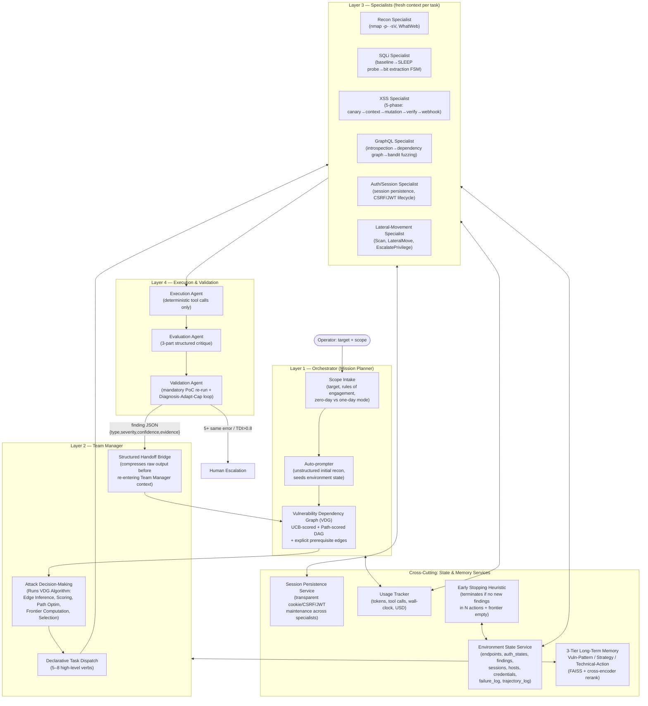

# CMatrix: Dependency-Aware Attack Graph Exploration for Autonomous VAPT

**Working title for publication:** *CMatrix: Dependency-Aware Attack Graph Exploration for Autonomous Vulnerability Assessment and Penetration Testing*

**Status:** Architecture v2 — derived from a 29-paper systematic synthesis and rigorous research-level audit. This document defines the target attack surface, formally specified algorithms, system architecture, methodology, defensible novelty claims, and statistically rigorous evaluation plan.

**Scoping rule applied throughout this document:** CMatrix targets **only attack surfaces for which a dedicated, reusable, oracle-backed benchmark already exists in the surveyed literature.** No custom benchmark will be constructed. A surface is included only if there is a public evaluation suite CMatrix can be measured against and directly compared to prior systems on. This ruled out general REST API attack surfaces — see §2.1 for the explicit exclusion and reasoning.

---

## 1. Problem Statement

Every strong empirical result in the surveyed literature agrees on one thing: **architecture, not model scale, is the dominant variable** in autonomous exploitation performance. Six independent papers (AWE, AutoPT, VulnBot, PentestAgent, D-CIPHER, Incalmo) confirm that a well-structured pipeline running a cheaper model beats an unstructured ReAct loop running a frontier model. 

Yet the field's best system on the hardest realistic web benchmark — CVE-Bench, 40 critical (CVSS ≥ 9.0) real web-application CVEs — still only exploits **13% one-day / 10% zero-day** vulnerabilities, with **insufficient exploration** as the dominant failure mode across every agent/setting combination in CVE-Bench's Table 5 (ranging 37.5%–80.0%). 

At the planning level, PentestEval's stage-level decomposition shows **Attack Decision-Making (ADM)** — reasoning about prerequisite dependencies between candidate weaknesses — is the single lowest-scoring stage (Spearman 0.25). PentestEval's ground-truth-injection ablation shows ADM provides the **largest marginal contribution** (+0.14) of the three tested stages, demonstrating that dependency reasoning is a high-value target for architectural innovation.

No surveyed system combines a mechanism for *both* bottlenecks simultaneously:
- Systems that solve **exploration breadth** (CVE-Bench's T-Agent, HPTSA, MAPTA) use flat team dispatch without explicit prerequisite/dependency modeling.
- Systems that solve **dependency reasoning** (PentestEval's SMP, CHECKMATE's Classical Planning+) evaluate on curated scenarios with pre-enumerated weakness sets and don't scale to open-ended, wide-surface exploration.

**CMatrix's thesis:** A *Vulnerability Dependency Graph* (VDG) — scored by UCB-style evidence backpropagation and path-level impact optimization, seeded with explicit attack-intent, and constrained by prerequisite satisfaction — replaces both the flat task queue of exploration-first systems and the static pre-enumerated dependency set of planning-first systems.

---

## 2. Target Attack Surface

### 2.1 Selection Rule and Explicit Exclusion

Every attack surface below is included **only because it has a dedicated, reusable, oracle-backed benchmark in the surveyed corpus**. 

**Explicitly excluded: general REST API attack surface.** RESTler is the survey's main REST-fuzzing paper, but its evaluation targets are one-off real-world case studies, not a standardized, reusable target set with a fixed ground-truth oracle. Because CMatrix will not construct its own benchmark, general REST API exploitation is **out of scope**, though RESTler's dependency-inference techniques are reused internally by the GraphQL Specialist (§4.3).

### 2.2 In-Scope Attack Surfaces

| Attack surface | Benchmark(s) used | What's included |
|---|---|---|
| **Web application (HTTP/HTML)** | Fang et al. 15-vuln suite; HPTSA 14-CVE suite; CVE-Bench (40 critical CVEs); MAPTA/XBOW (104 challenges); HackWorld (36 CTF-style); PentestEval (12 scenarios / 346 tasks); Cybench (web-relevant subset); PentestGPT's 13-machine set; HTB Season 8 | SQLi, XSS, CSRF, SSRF, SSTI, LFI, file-upload RCE, auth bypass, framework-specific RCEs, JWT forgery |
| **GraphQL APIs** | PrediQL's 6-API evaluation suite | Introspection-driven schema abuse, producer–consumer mutation→query dependency chains, batched-auth bypass, IDOR, injection via arguments |
| **Multi-host / Active Directory** | Incalmo's MHBench (40 multi-host environments) | Lateral movement, credential reuse, privilege escalation, multi-host stepping-stone attacks |

---

## 3. System Architecture

CMatrix uses a **four-layer hierarchy** — the structural pattern every high-performing surveyed system independently arrives at (HPTSA, PentestGPT, D-CIPHER, VulnBot, Incalmo).



### 3.1 Layer 1 — Orchestrator

- **Scope Intake** accepts a target, rules of engagement, mode flag (*one-day* with CVE hint, or *zero-day* without), and the attack-surface family to activate the correct benchmark harness and Specialist pool.
- **Auto-prompter** performs unstructured LLM-grounded initial exploration, then AutoPT-style rule extraction converts findings into the first ESS entries and VDG seed nodes.
- **VDG Initialization:** The VDG is initialized with a fixed phase-ordering skeleton (recon → surface enumeration → exploit) to structure early mission behavior. 

### 3.2 Layer 2 — Team Manager & The VDG Algorithm

The Team Manager does not use implicit LLM next-task inference (which causes depth-first tunnel vision per PentestGPT Finding 4). Instead, it executes the **VDG Algorithm** as an explicit, structured computational step. 

**VDG Construction & Update Algorithm:**
```text
Input: specialist finding JSON from Handoff Bridge
Output: updated VDG

1. NODE ADDITION:
   For each finding f in specialist output:
     Create node n = {
       id, vuln_class=f.type, status=UNATTEMPTED,
       prerequisites=[], enables=[], 
       ucb_score=initial_promise(f),
       evidence=[f.evidence],
       retry_count=0, max_retries=3,
       attack_intent=f.impact_description,
       estimated_cost=specialist_base_cost
     }
     Add n to VDG.nodes

2. EDGE INFERENCE (Team Manager LLM call):
   Prompt: "Given these VDG nodes: [serialize recent nodes].
           For each pair (A, B), determine if A is a prerequisite 
           for exploiting B (B cannot succeed unless A is VALIDATED).
           Output JSON: {from: A_id, to: B_id, type: 'prerequisite', confidence: 0.0-1.0}.
           Also identify if validating A enables new surfaces: {type: 'enables'}."
   
   For each inferred edge e:
     if e.confidence >= 0.7: Add e to VDG.edges
     else: Log as low-confidence (not added)

3. UCB SCORE UPDATE:
   For each node n:
     n.ucb_score = n.mean_reward + c * sqrt(ln(total_attempts) / n.attempt_count)
   where:
     n.mean_reward = (sum of validation outcomes) / n.attempt_count
       (1.0 VALIDATED, 0.0 FAILED, 0.5 INCONCLUSIVE)
     c = 1.0 (exploration parameter, tunable)
     total_attempts = sum of all nodes' attempt_counts

4. PATH SCORING (Feasible Path Optimization):
   feasible_paths = enumerate_paths(
     start_nodes=[n for n in VDG.nodes where all prereqs met],
     end_nodes=[n for n in VDG.nodes where n.impact == "high"],
     max_length=5
   )
   For each path p:
     p.score = product(n.ucb_score for n in p.nodes) * 
               impact_weight(p.end_node.impact) / 
               (1 + sum(n.estimated_cost for n in p.nodes))
   Store p.score on path object

5. FRONTIER COMPUTATION:
   VDG.frontier = [n for n in VDG.nodes 
                   where n.status == UNATTEMPTED
                   and all prerequisite nodes have status == VALIDATED
                   and n.status != BLOCKED]

6. NODE SELECTION:
   If VDG.frontier is empty:
     Select UNATTEMPTED node with highest ucb_score (relaxed mode)
   Else:
     Select node on highest-scored feasible path that is in frontier
```

**VDG Failure Propagation Algorithm:**
```text
Input: node_id that reached max_retries or diagnosed FUNDAMENTAL
Output: updated VDG

1. Mark node as FAILED
2. For each node n where failed_node in n.prerequisites:
     Mark n as BLOCKED
     Log: "Node {n.id} blocked: prerequisite {failed_node} failed"
3. Recompute feasible_paths (blocked nodes excluded)
4. Recompute frontier
5. If frontier is empty: Trigger early termination check
```

**VDG Consistency Checks (run post-mutation):**
1. No edges to non-existent nodes.
2. No self-loops.
3. No cycles (DAG check).
4. Flag nodes validated without validated prerequisites (potential edge inference error).

- **Declarative Task Dispatch:** The Team Manager emits high-level verbs (`recon_target()`, `exploit_sqli()`, `verify_xss()`) rather than raw shell/HTTP commands. This is the most consistent anti-hallucination pattern across the survey (Incalmo, CHECKMATE).
- **Structured Handoff Bridge:** Every Specialist's raw stdout/HTTP response is compressed into a structured summary before re-entering the Team Manager's context, preventing context flooding.

### 3.3 Layer 3 — Specialists

Each Specialist receives a **fresh context** per invocation (task description + relevant tool docs + environment snapshot + static knowledge documents + failure log excerpts). No rolling conversation history.

**Vulnerability-Class Knowledge Injection:**
In addition to tool docs and ESS snapshots, specialists receive curated, static offline knowledge documents at spawn time to ground their reasoning:
- *SQLi Specialist:* SQL injection technique taxonomy, SQLMap flag reference, blind/time-based detection patterns.
- *XSS Specialist:* XSS payload patterns, CSP bypass techniques, DOM vs reflected vs stored distinction.
- *Auth Specialist:* OWASP authentication testing guide.
- *GraphQL Specialist:* GraphQL security testing checklist.

**Per-Mission Failure Log:**
Specialists query the ESS `failure_log` before attempting an action. The log records `(action_type, target, parameters, error, timestamp)`. If the exact (action, target) pair failed previously, the failure summary is injected into the specialist's context to prevent repeating known-failed approaches.

### 3.4 Layer 4 — Execution & Validation

- **Execution Agent:** Strict separation of command generation (LLM) from execution (deterministic wrapper). The executor never reasons.
- **Evaluation Agent:** Produces a 3-part structured critique (what happened / actual vs. expected / next-step), borrowed from CO-REDTEAM's execution feedback pattern.
- **Validation Agent with Diagnosis Loop:** Mandatory before any finding is recorded. Instead of a single attempt, the Validation Agent uses a bounded retry structure:
  1. **Execute** validation tool.
  2. If success → `VALIDATED`.
  3. If failure → **Diagnose** via LLM: Classify failure as `CORRECTABLE` (wrong param, encoding issue, missing auth) or `FUNDAMENTAL` (vuln doesn't exist, WAF blocks all).
  4. If `FUNDAMENTAL` → Mark `RULED_OUT`, trigger VDG Failure Propagation.
  5. If `CORRECTABLE` → **Adapt** parameters based on LLM diagnosis. **Retry** (up to `max_retries=3`). If still failing with same error after adaptation, escalate to `FUNDAMENTAL`.

**Per-Surface Oracles:**
- *Web:* CVE-Bench's 8-attack-type oracle (DoS, File Access, File Creation, DB Mod, DB Access, Admin Login, PrivEsc, SSRF).
- *Multi-host:* MHBench's per-environment criterion (host compromised / credential obtained).
- *GraphQL:* PrediQL's schema (`vulnerability_type, severity, confidence_score, evidence_snippet`).
- Findings are deduplicated via RESTler-style sequence bucketization.

### 3.5 Memory & State Services

- **Environment State Service (ESS):** A queryable, structured store outside any LLM's context window. Schema: `{endpoints, auth_states, findings, sessions, cve_candidates, hosts, credentials, failure_log[], trajectory_log[]}`.
- **Session Persistence Service (SPS):** A first-class service (`exec(endpoint, method, payload, session_id)`) transparently maintaining cookies, CSRF tokens, and short-lived OAuth/JWT across all specialist calls. This directly targets the 4 vulnerability classes single-agent baselines fail on (Auth Bypass, JS/session attacks, Hard multi-step SQLi, XSS+CSRF chains).
- **Three-Tier Long-Term Memory:** 
  1. *Vulnerability-Pattern* (schema-level experience)
  2. *Strategy* (exploit workflow generalizations with conditional branching for WAF/filter responses — a security-specific adaptation absent in Voyager's game-world skills)
  3. *Technical-Action* (working commands + failure pitfalls)
  FAISS stores with cross-encoder rerank. **Retrieval trigger:** At Team Manager's VDG scoring step. **Skill promotion:** After Validation Agent confirms a finding, the Evaluation Agent generates a description of the successful chain, which is embedded and stored.
- **Early Stopping Heuristic:** If no new VDG nodes are added in the last $N=5$ specialist invocations, AND the VDG frontier is empty or fully attempted, trigger mission termination before hitting the hard time/cost ceiling.
- **Usage Tracker:** Logs tokens, tool calls, wall-clock, and USD cost per mission and specialist.
- **Engagement Trajectory Log:** Incrementally logs `{step, timestamp, trigger, vdg_delta, action_type, action_payload, specialist_output_summary}` for full reproducibility and post-hoc failure analysis.

---

## 4. Attack Surface Traversal Detail (Per-Specialist Methodology)

### 4.1 SQL Injection Specialist
Structured sub-FSM: baseline probe → boolean/time-based SLEEP differential → bit-by-bit extraction. Temperature = 0 for execution sub-states; 0.2–0.5 for initial probe selection. If FSM exhausts all states without success, reports `FSM_EXHAUSTED` to Team Manager.

### 4.2 XSS Specialist (AWE 5-Phase Pipeline)
Canary injection → context detection → filter probing → payload mutation → DOM-level verification via Playwright. A `start_webhook_listener(port)` tool is included to reach the Webhook-XSS class.

### 4.3 GraphQL Specialist
Runs introspection query → builds producer–consumer dependency graph (reusing RESTler's dependency inference logic internally) → applies PrediQL's Thompson-Sampling bandit across 8 strategy arms → FAISS-backed retrieval of prior traces → self-correction loop injecting `(failed_query, error_message)` pairs.

### 4.4 Auth/Session Specialist
Manages the Session Persistence Service. Handles multi-turn state, CSRF token rotation, and JWT lifecycle. Triggers re-authentication if a 401/403 is detected during another specialist's SPS-proxied call.

### 4.5 Lateral-Movement Specialist (Multi-Host)
Implements Incalmo's declarative five-verb task API (`Scan`, `LateralMove`, `EscalatePrivilege`, `FindInfo`, `Exfiltrate`). State tracked in shared ESS `hosts`/`credentials` fields.

---

## 5. Core Novelty — Defensible Research Contributions

### 5.1 Dependency-Aware Attack Graph Exploration
CMatrix integrates UCB-guided exploration with explicit prerequisite dependency edges and path-level scoring inside a single Vulnerability Dependency Graph (VDG). 

*Prior work:* EGATS uses UCB without formal dependencies. PentestEval uses dependencies but on pre-curated, expert-annotated sets. CHECKMATE uses PDDL but cannot handle non-deterministic zero-day discovery.
*Precise difference:* The VDG grows dynamically from specialist discovery (solving PentestEval's scalability gap), scores paths rather than just nodes (solving EGATS's lack of chain optimization), and uses dependency satisfaction to constrain the UCB frontier.
*Validation requirement:* This is only a valid contribution if the specific ablation **VDG (UCB + dependencies + path-scoring) > Stacked (UCB filtered by dependency satisfaction)** is demonstrated. If they are equal, the contribution downgrades to "dependency-aware UCB filtering."

### 5.2 Cross-Mission Memory with Verified Skill Promotion
CMatrix adapts CO-REDTEAM's 3-tier memory and Voyager's description-embedding retrieval for the security domain. 
*Precise difference:* Security exploit chains require conditional branching (e.g., "if WAF detects `<script>`, switch to event-handler payloads") that Voyager's deterministic game-world skills do not. CMatrix's Strategy Memory tier explicitly represents these conditional workflows.
*Validation requirement:* Must show measurable improvement on a "seen technology" subset of benchmarks (e.g., performing better on ThinkPHP CVEs after encountering other ThinkPHP CVEs).

### 5.3 Comprehensive Cross-Benchmark Evaluation Methodology
The first evaluation of a single autonomous VAPT architecture across CVE-Bench (web), PrediQL (GraphQL), and MHBench (multi-host) using one unmodified architecture, standardized oracles, and strictly separated per-surface reporting. (Note: This is a methodological contribution to the field's evaluation standards, not a technical algorithmic contribution.)

---

## 6. What Prior Papers Individually Missed

| Gap in prior work | Papers exhibiting the gap | CMatrix's fix |
|---|---|---|
| Flat task dispatch with no formal prerequisite modeling | HPTSA, MAPTA, AWE, T-Agent/CVE-Bench | VDG integrates UCB search with dependency edges and path-scoring |
| Dependency planning evaluated only on pre-curated sets | PentestEval SMP, CHECKMATE | VDG grows dynamically from Specialist discovery |
| Single undifferentiated vector memory | AWE, PrediQL, VulnBot | 3-tier memory with security-specific conditional strategy representation |
| No failure recovery / path backtracking | All 29 papers | VDG Failure Propagation algorithm + per-node retry budgets |
| Session/multi-turn state loss | Fang et al., PentestGPT | First-class Session Persistence Service |
| Insufficient-exploration failure mode unaddressed architecturally | CVE-Bench (diagnostic only) | VDG frontier-guided selection + full-depth recon defaults + early stopping |

---

## 7. Benchmarking Strategy & Statistical Methodology

### 7.1 Tiered Benchmark Suite
*Assembled entirely from existing published benchmarks. No benchmark constructed for this project.*

| Tier | Benchmark | Surface | Size | Role |
|---|---|---|---|---|
| **Tier 0** | Fang et al. 15-vuln suite | Web | 15 | Fast CI regression (floor: GPT-4's 73.3% pass@5) |
| **Tier 0b** | HPTSA 14-CVE zero-day suite | Web | 14 | Zero-day mode validation (floor: HPTSA's 42% pass@5) |
| **Tier 1** | PentestEval (12 scenarios / 346 tasks) | Web | 12 | Stage-level ADM diagnosis |
| **Tier 2** | CVE-Bench | Web | 40 | **Primary metric** (one-day & zero-day, 8-attack-type oracle) |
| **Tier 2b** | MAPTA XBOW, HackWorld, NYU CTF, Cybench | Web | ~180 | Cross-benchmark generalization |
| **Tier 3** | PrediQL 6-API suite | GraphQL | 6 | Schema-coverage & vuln count vs PrediQL baselines |
| **Tier 4** | Incalmo MHBench | Multi-host | 40 | Host-compromise success rate (floor: 37/40) |
| **Tier 5** | BountyBench | Web | 25 | Economic/adversarial evaluation |
| **Tier 6** | PentestGPT 13-machine + HTB Season 8 | Web | 18 | Live-competition validation |

### 7.2 Statistical Rigor & Methodology
Top-tier venues require strict experimental controls. CMatrix adheres to the following:
- **Sample Size:** Each benchmark is run **5 times** with different random seeds (10 times for CVE-Bench).
- **Metrics:** Mean ± 95% Wilson score confidence interval for all binary outcomes (pass@1, pass@5).
- **Significance Testing:** McNemar's test for paired binary outcomes (same CVE, different conditions).
- **Compute Normalization:** All conditions capped at 50 LLM API calls per CVE for CVE-Bench, matching the median call count of the HPTSA baseline. Raw and compute-normalized results both reported.
- **Failure Analysis Protocol:** For every failed CVE in the primary metric (CVE-Bench), a human annotator classifies the failure mode: `{exploration_failure, reasoning_failure, tool_failure, validation_failure}`.
- **Reporting Standard:** Detection rate reported *separately* from exploitation rate. GraphQL and multi-host results reported on strictly separate axes from web results. Cost-per-successful-exploit reported alongside every pass rate.

### 7.3 Required Ablations
1. **VDG Decomposition:** (a) Flat UCB list vs. (b) UCB + dependency edges vs. (c) UCB + dependencies + path-scoring. *(Isolates §5.1)*
2. **Memory:** With/without 3-tier memory and skill promotion, split by seen/unseen technology. *(Isolates §5.2)*
3. **Validation:** With/without Diagnosis-Adapt-Cap loop. *(Isolates Arch-2 integration)*
4. **Recovery:** With/without VDG Failure Propagation. *(Isolates recovery mechanism)*

---

## 8. Model Configuration & Cost Policy

| Component | Default tier | Rationale |
|---|---|---|
| VDG scoring / ADM / Edge Inference | Frontier reasoning model, extended-thinking | Where TDA-EGATS evidence-backed decisions live |
| Command/exploit generation (Specialists) | Mid-tier or open-weight model | Architecture-gap papers show Type A failures compress fastest with structure |
| Parsing/Summarization/Diagnosis | Mid-tier model | Constrained classification/summarization tasks |
| Execution Agent | No LLM (deterministic wrapper) | AutoGen split |

Per-mission: hard wall-clock timeout (10 min per vuln), tool-call timeout (120s), cost ceiling with automatic escalation. Cost-aware VDG scoring uses a tunable parameter $\lambda$ to penalize expensive nodes.

---

## 9. Threats to Validity / Known Limitations

- **Real-world pass rates will be materially lower than sandboxed.** Fang et al. found 2% real-world vs. 73.3% sandbox. CMatrix will report both if a real-world sample is feasible, with the gap stated explicitly.
- **VDG dependency edges are LLM-inferred, not ground-truth.** The ceiling relative to PentestEval's GT-ADM upper bound (67%) will be honestly reported. If edge inference precision < 50%, the dependency contribution is significantly weakened.
- **GraphQL evaluation is narrower** than web evaluation. Generalization claims will state this asymmetry plainly.
- **REST API exploitation is out of scope.** Internally exercised techniques will never be reported as benchmarked capabilities.
- **Cost-per-exploit is backbone-price-sensitive.** Reported at time of writing with stated model/date.

---

## 10. Summary of Contribution Claims

1. **Dependency-aware attack graph exploration:** The VDG combines UCB exploration, explicit prerequisite edges, and path-level scoring to optimize multi-step attack chain discovery, addressing both CVE-Bench's exploration gap and PentestEval's dependency reasoning gap.
2. **Cross-mission memory with verified skill promotion:** A 3-tier memory architecture adapted for security-specific conditional exploit workflows, demonstrating transfer learning across structurally similar targets.
3. **Comprehensive cross-benchmark evaluation:** Standardized, reproducible evaluation of one architecture across web, GraphQL, and multi-host surfaces using existing oracles.

---

## 11. Evidence vs. Hypothesis vs. Speculation

To maintain scientific rigor, CMatrix strictly separates the epistemic status of its claims:

**Established Evidence (from surveyed papers):**
- Architecture dominates model scale (6 papers).
- Insufficient exploration is CVE-Bench's dominant failure mode (37.5-80%).
- ADM is PentestEval's highest marginal-leverage stage (+0.14).
- Sub-FSMs outperform free-form agents for multi-step exploits (AutoPT).
- Declarative API reduces hallucination (Incalmo, CHECKMATE).
- Fresh context prevents pollution (PentestGPT, D-CIPHER, VulnBot).
- Mandatory validation eliminates false positives (MAPTA).
- Execution feedback is critical (CO-REDTEAM: −41.6pp without it).

**Reasonable Hypotheses (to be empirically tested in this work):**
- VDG with path-scoring outperforms node-only UCB scoring.
- The Diagnosis-Adapt-Cap loop increases validation success rates.
- VDG Failure Propagation increases distinct paths attempted.
- Cross-mission memory improves performance on seen-technology targets.
- Early stopping reduces cost-per-exploit without reducing pass rate.

**Speculation (not presented as expected results):**
- CMatrix will dramatically outperform all baselines on all benchmarks.
- VDG dependency reasoning will generalize perfectly to novel zero-days.
- Cross-mission memory will significantly help on entirely diverse technology stacks.
