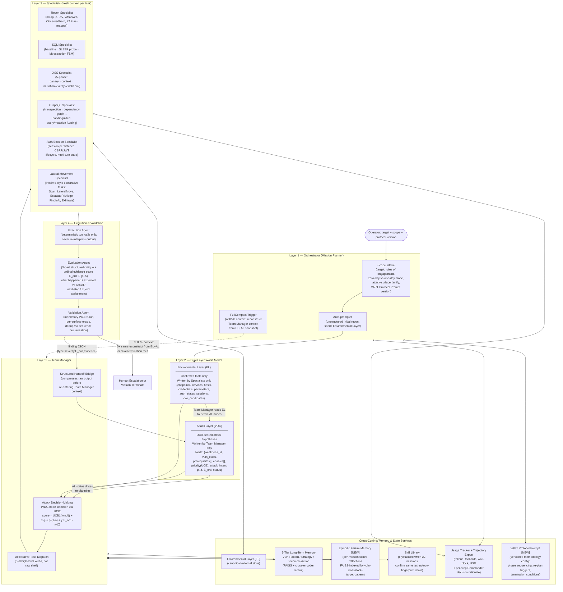

# CMatrix: An LLM-Orchestrated Multi-Agent Framework for Autonomous VAPT

**Working title for publication:** *CMatrix: A Vulnerability Dependency Graph Framework for Exploration-Breadth and Dependency-Aware Autonomous Penetration Testing*

**Status:** Revised architecture — derived from the 29-paper systematic synthesis and the research-grade audit of architecture-v2-cmatrix-baseline.md.
All changes from the audit are annotated with `[CHANGE]` tags so diffs against architecture-v2-cmatrix-baseline.md are traceable.

**Scoping rule applied throughout:** CMatrix targets **only attack surfaces for which a dedicated, reusable, oracle-backed benchmark already exists in the surveyed literature.** Every claimed capability maps to a benchmark in §2.

---

## Table of Contents

1. [Problem Statement](#1-problem-statement)
2. [Target Attack Surface](#2-target-attack-surface)
3. [System Architecture — Overview](#3-system-architecture--overview)
4. [The VDG Algorithm (Formalized)](#4-the-vdg-algorithm-formalized)  ← *new section; resolves W1*
5. [The Dual-Layer World Model](#5-the-dual-layer-world-model)  ← *[CHANGE] replaces single-structure VDG; resolves W1, W6*
6. [Layer-by-Layer Architecture Detail](#6-layer-by-layer-architecture-detail)
7. [Attack Surface Traversal — Per-Specialist Methodology](#7-attack-surface-traversal--per-specialist-methodology)
8. [Memory and State Services](#8-memory-and-state-services)
9. [Core Novelty — Precise Claims](#9-core-novelty--precise-claims)
10. [Prior Work Gap Table](#10-prior-work-gap-table)
11. [Benchmarking Strategy and Ablation Design](#11-benchmarking-strategy-and-ablation-design)
12. [Model Configuration and Cost Policy](#12-model-configuration-and-cost-policy)
13. [Threats to Validity / Known Limitations](#13-threats-to-validity--known-limitations)
14. [Summary of Contribution Claims](#14-summary-of-contribution-claims)

---

<!-- SECTION STATUS
§1  Problem Statement         ✅ DONE
§2  Target Attack Surface     ✅ DONE
§3  System Architecture       ✅ DONE
§4  VDG Algorithm             ✅ DONE
§5  Dual-Layer World Model    ✅ DONE
§6  Layer-by-Layer Detail     ✅ DONE
§7  Per-Specialist Detail     ✅ DONE
§8  Memory & State Services   ✅ DONE
§9  Core Novelty              ✅ DONE
§10 Gap Table                 ✅ DONE
§11 Benchmarking & Ablations  ✅ DONE
§12 Model Config              ✅ DONE
§13 Threats to Validity       ✅ DONE
§14 Contribution Summary      ✅ DONE
-->

---

## 1. Problem Statement

Every strong empirical result in the surveyed literature agrees on one finding: **architecture, not model scale, is the dominant variable** in autonomous exploitation performance. Six independent papers (AWE, AutoPT, VulnBot, PentestAgent, D-CIPHER, Incalmo) confirm that a well-structured pipeline running a cheaper model beats an unstructured ReAct loop running a frontier model. Yet two independent failure modes remain unresolved — and no surveyed system addresses both simultaneously.

**Failure Mode 1 — Insufficient Exploration (CVE-Bench)**

The field's best system on the hardest realistic web benchmark — CVE-Bench, 40 critical (CVSS ≥ 9.0) real web-application CVEs — exploits only **13% one-day / 10% zero-day** vulnerabilities. CVE-Bench's Table 5 identifies **insufficient exploration** as the dominant failure mode across every agent and setting (exploration-failure rates range 37.5%–80.0%: T-Agent 80.0% zero-day / 55.0% one-day; AutoGPT 72.5% / 45.0%; Cy-Agent 67.5% / 37.5%). The failure is not reasoning quality — it is exploration breadth.

**Failure Mode 2 — Dependency-Reasoning Gap (PentestEval)**

PentestEval's stage-level decomposition shows the opposite bottleneck at the planning level: **Attack Decision-Making (ADM)** — reasoning about prerequisite dependencies between candidate weaknesses — is the single lowest-scoring stage (Spearman 0.25). PentestEval's ground-truth-injection ablation quantifies the improvement available at each stage:

| Configuration | End-to-end success | Marginal gain |
|---|---|---|
| SMP (baseline) | 0.31 | — |
| + GT Weakness Gathering (WG) | 0.50 | +0.19 |
| + GT Weakness Filtering (WF) | 0.53 | +0.03 |
| + GT Attack Decision-Making (ADM) | 0.67 | **+0.14** |

ADM delivers the **largest single-stage marginal increment** (+0.14) of the three tested — measured on top of an already ground-truthed WG+WF pipeline, not in isolation. CMatrix's dynamically-grown dependency graph is a weaker approximation than ground-truth ADM, so its ceiling must be reported as less than 0.67 and bounded by the quality of the LLM-inferred edges (§4.3).

**The Gap No Surveyed System Closes**

- Systems that solve **exploration breadth** (T-Agent, HPTSA, MAPTA) use flat team dispatch without explicit prerequisite/dependency modeling.
- Systems that solve **dependency reasoning** (PentestEval SMP, CHECKMATE Classical Planning+) are evaluated on curated scenarios with pre-enumerated weakness sets and cannot scale to open-ended, wide-surface exploration.
- No system combines **UCB-guided attack-tree search**, **explicit prerequisite dependency edges grown dynamically from Specialist discovery**, **cross-session verified skill accumulation**, and **evaluation across three independently-benchmarked attack-surface families** in one architecture.

**CMatrix's thesis:** A four-layer orchestration framework driven by a *Vulnerability Dependency Graph* (VDG) — formalized as a scored DAG with explicit prerequisite/enables edges, UCB-guided node selection, and ordinal evidence backpropagation — combined with a dual-layer world model that separates confirmed environmental facts from inferred attack hypotheses, and a three-tier skill memory with crystallization-threshold gated promotion.

---

## 2. Target Attack Surface

### 2.1 Selection Rule and Explicit Exclusion

Every attack surface below is included **only because it has a dedicated, reusable, oracle-backed benchmark in the surveyed corpus.** No benchmark will be built; CMatrix's evaluation is fully constrained to what already exists.

**Explicitly excluded: general REST API attack surface.** RESTler's evaluation targets (self-hosted GitLab, Microsoft Azure services, Office365) are one-off real-world case studies, not a standardized, reusable target set. There is no "RESTBench" equivalent in the survey. RESTler's core techniques (producer–consumer dependency inference, response-feedback pruning) are methodologically reusable and are adopted internally by the GraphQL Specialist and the dependency-inference logic in the Team Manager (§7.3), but REST API exploitation is **not evaluated and not claimed** — no REST-API-specific pass rates are reported anywhere in this paper.

### 2.2 In-Scope Attack Surfaces

| Attack surface | Benchmark(s) | What's covered |
|---|---|---|
| **Web application (HTTP/HTML)** | Fang et al. 15-vuln sandbox; HPTSA 14-CVE zero-day suite; CVE-Bench (40 critical CVEs, CVSS ≥ 9.0); MAPTA/XBOW (104 challenges); HackWorld (36 CTF-style); PentestEval (12 real-world scenarios / 346 tasks); Cybench (40 tasks, web-relevant subset); PentestGPT 13-machine HTB+VulnHub set; HTB Season 8 (5 post-2025 machines) | SQLi (blind/UNION), XSS (reflected/stored/DOM), CSRF, SSRF, SSTI, LFI/path traversal, file-upload RCE, authorization/IDOR bypass, auth bypass, brute force, framework-specific RCEs (ThinkPHP, Struts2, Spring/Fastjson, Jenkins), JWT forgery |
| **GraphQL APIs** | PrediQL's 6-API suite (UserWallet, Countries, Rick&Morty, GraphQLZero, EHRI, TCGDex) vs. ZAP / Burp Suite / EvoMaster / GraphQLer baselines | Introspection-driven schema abuse, producer–consumer mutation→query dependency chains, batched-auth bypass, IDOR via ID manipulation, injection via arguments, DoS via nested queries |
| **Multi-host / Active Directory networks** | Incalmo MHBench (40 multi-host red-team environments) | Lateral movement, credential reuse/theft across hosts, privilege escalation, multi-host stepping-stone attacks |
| **Production system corpus (cross-cutting hard tier)** | BountyBench (25 real production systems: mlflow, langchain, FastAPI, gradio, curl, django, etc.; 27 CWEs across 9 OWASP Top-10 categories) | Economic/adversarial evaluation layer on top of web surface — not a separate attack-surface family, but a harder, real-money-validated version of the same web/app surface |

Everything CMatrix claims to do is bounded by this table. Binary exploitation, physical/network-layer attacks, social engineering, and general REST API fuzzing are **not evaluated and not claimed.**

---

## 3. System Architecture — Overview

CMatrix uses a **four-layer hierarchy** — the structural pattern every high-performing surveyed system independently converges on (HPTSA, PentestGPT, D-CIPHER, VulnBot, Incalmo, CO-REDTEAM).

**[CHANGE from architecture-v2-cmatrix-baseline.md]** The single-structure VDG is replaced by a **Dual-Layer World Model** (§5): an **Environmental Layer** (EL) containing only confirmed discovered facts, written exclusively by Specialists, and an **Attack Layer** (AL / VDG) containing only UCB-scored attack hypotheses with prerequisite/enables edges, written exclusively by the Team Manager. This eliminates fact/hypothesis contamination — a failure class documented in Architecture-2's §5c and common in flat-memory systems.

**[CHANGE]** A **FullCompact** mechanism (reconstructing Team Manager reasoning context from EL+AL state at 85% context utilization) is added to address long-session Commander context inflation — the documented failure mode in PentestGPT Finding 4. Specialists retain fresh-context-per-invocation (unchanged).

**[CHANGE]** The **VAPT Protocol Prompt** (methodology-as-configuration) is added as a versioned natural-language document that encodes phase sequencing rules, re-planning triggers, and termination conditions — making methodology an independently evaluable research variable.

**[CHANGE]** The **Episodic Failure Memory** (4th FAISS tier) and the **Engagement Trajectory Export** (reasoning-trace level) are added (§8).



**Dual-termination condition [CHANGE]:** Mission terminates when **(a) no unexplored EL nodes remain** AND **(b) all AL/VDG nodes are in a terminal state** (exploited / infeasible / deprioritized below threshold). Neither condition alone is sufficient. This formalizes stopping behavior that flat task-queue systems and single-graph systems cannot express simultaneously.

---

## 4. The VDG Algorithm (Formalized)

> **[NEW SECTION — resolves W1 from the audit]**
> This section provides the algorithm-level specification missing from architecture-v2-cmatrix-baseline.md. It defines the UCB formula, the edge construction procedure, the ordinal evidence scoring, and the backpropagation update rule — all at pseudocode level sufficient for implementation and reproducibility.

### 4.1 VDG Node Schema

Each VDG node represents one attack hypothesis (a candidate vulnerability or attack step):

```
VDGNode {
    weakness_id     : str          -- unique identifier (e.g., "sqli-001")
    vuln_class      : VulnClass    -- enum: {SQLi, XSS, CSRF, SSTI, LFI, AuthBypass,
                                   --        IDOR, RCE, GraphQL_Injection, LateralMove, ...}
    attack_intent   : str          -- natural language description of the goal
    prerequisites   : List[str]    -- weakness_ids that MUST reach status EXPLOITED
                                   --   before this node is eligible for selection
    enables         : List[str]    -- weakness_ids that become ELIGIBLE once this node
                                   --   reaches status EXPLOITED
    status          : NodeStatus   -- enum: {ELIGIBLE, IN_PROGRESS, EXPLOITED,
                                   --        INFEASIBLE, DEPRIORITIZED}
    w               : float        -- cumulative UCB reward (count of successes)
    n               : int          -- number of times this node has been selected
    phi             : float        -- promise score φ ∈ [0,1] (LLM-assessed
                                   --   likelihood of exploitability given EL evidence)
    delta           : float        -- task difficulty index δ ∈ [0,1]
                                   --   (1 = maximally hard; 0 = trivial)
    E_ord           : int          -- ordinal evidence score ∈ {0,1,2,3,4,5}
                                   --   0=unseen, 1=tool ran/nothing, 2=weak signal,
                                   --   3=clear indication, 4=confirmed behavior,
                                   --   5=oracle-confirmed exploit
    epss_prior      : float        -- EPSS score ∈ [0,1] from NVD/FIRST API
                                   --   (initial prior before any evidence)
    context_load    : float        -- C ∈ [0,1]: estimated specialist context tokens
                                   --   relative to context window (controls cost-aware
                                   --   deprioritization of expensive nodes)
    source_el_nodes : List[str]    -- EL node IDs that seeded this VDG node
    last_updated    : timestamp
}
```

### 4.2 UCB Node-Selection Formula

The Team Manager selects the next VDG node to act on using a modified UCB1 formula:

```
UCB_score(v) = (w_v / n_v)
             + C_expl · sqrt(ln(N) / n_v)
             + α · φ_v
             + β · (1 - δ_v)
             + γ · (E_ord_v / 5)
             - κ · context_load_v
             + λ · epss_prior_v

where:
    w_v / n_v      -- exploitation term: empirical success rate for this node
    C_expl         -- exploration constant (tuned empirically; default 1.414 = sqrt(2))
    N              -- total number of node selections so far in this mission
    n_v            -- times this node has been selected (initialized to 1 to avoid div/0)
    α              -- weight for LLM-assessed promise φ ∈ [0,1]     (default: 0.3)
    β              -- weight for task-difficulty term (1-δ)           (default: 0.2)
    γ              -- weight for ordinal evidence term E_ord/5        (default: 0.4)
    κ              -- penalty for context load C                      (default: 0.1)
    λ              -- weight for EPSS prior                           (default: 0.15)
```

**Selection rule:**
```
eligible_nodes = {v ∈ VDG | v.status == ELIGIBLE
                           AND all p in v.prerequisites have status EXPLOITED}

if len(eligible_nodes) == 0:
    → check dual-termination condition; if not met → escalate to human
    
selected_node = argmax_{v ∈ eligible_nodes} UCB_score(v)
```

**Tie-breaking:** When two nodes have equal UCB scores (rare), prefer the node with the higher `E_ord` (more evidence already gathered).

**Parameter tuning:** α, β, γ, κ, λ, and C_expl are empirically tuned on the Tier 1 (PentestEval) benchmark using a grid search over the range [0.1, 0.5] in steps of 0.1, holding out the CVE-Bench split. These hyperparameters are reported in the paper with their search ranges.

### 4.3 Prerequisite Edge Construction Algorithm

This is the technically hardest part of the VDG — the procedure by which the Team Manager creates `prerequisites[]` and `enables[]` edges between newly created VDG nodes.

**[ESTABLISHED vs SPECULATIVE]** The edge construction relies on LLM inference, which introduces noise. The accuracy of LLM-inferred edges against PentestEval ground-truth dependency annotations must be measured in a **pilot study before the main evaluation** (see §11.4). Do not claim edge accuracy without this measurement.

```
Algorithm: VDG_AddNode(new_node, existing_vdg, el_snapshot)

Input:
  new_node     : partially-filled VDGNode (weakness_id, vuln_class, attack_intent set by caller)
  existing_vdg : current VDG (set of VDGNodes with edges)
  el_snapshot  : current Environmental Layer state

Step 1 — Compute EPSS prior:
  new_node.epss_prior = query_epss_api(new_node.vuln_class, el_snapshot.cve_candidates)
  # If no CVE match: epss_prior = 0.05 (conservative default)

Step 2 — Assess promise and difficulty:
  prompt = build_assessment_prompt(new_node, el_snapshot, existing_vdg.node_summaries())
  response = llm_call(prompt, temperature=0.0)
  new_node.phi   = parse_float(response, "promise_score")   # constrain to [0,1]
  new_node.delta = parse_float(response, "difficulty_index") # constrain to [0,1]

Step 3 — Infer prerequisite edges:
  candidate_prerequisites = []
  for existing_node in existing_vdg.nodes:
      prompt = build_prerequisite_prompt(new_node, existing_node, el_snapshot)
      response = llm_call(prompt, temperature=0.0)
      if parse_bool(response, "is_prerequisite"):
          confidence = parse_float(response, "confidence")  # [0,1]
          if confidence >= PREREQUISITE_THRESHOLD:           # default: 0.7
              candidate_prerequisites.append(existing_node.weakness_id)

  new_node.prerequisites = candidate_prerequisites

Step 4 — Infer enables edges (reverse direction):
  for existing_node in existing_vdg.nodes:
      prompt = build_enables_prompt(new_node, existing_node, el_snapshot)
      response = llm_call(prompt, temperature=0.0)
      if parse_bool(response, "new_node_enables_existing"):
          existing_node.enables.append(new_node.weakness_id)

Step 5 — Set initial status:
  if all(p in [n.weakness_id for n in existing_vdg.nodes if n.status == EXPLOITED]
         for p in new_node.prerequisites):
      new_node.status = ELIGIBLE
  else:
      new_node.status = INFEASIBLE  # re-evaluated when a prerequisite is EXPLOITED

Step 6 — Initialize UCB counters:
  new_node.w = 0.0
  new_node.n = 1          # avoid division by zero; treated as one "neutral" prior observation
  new_node.E_ord = 0

Step 7 — Insert into VDG:
  existing_vdg.add_node(new_node)
  return new_node
```

**Cycle detection:** After every `add_node`, run a topological sort check on the prerequisite edges. If a cycle is detected, the lower-confidence edge(s) in the cycle are demoted to `enables` edges (weaker, non-blocking relationship) rather than `prerequisites` edges, and a warning is logged.

**Prerequisite prompt construction:** The `build_prerequisite_prompt` function receives (a) the attack intent of the candidate prerequisite node, (b) the attack intent of the new node, and (c) a structured EL snapshot. The prompt asks: *"Must [prerequisite attack intent] succeed BEFORE [new node attack intent] is technically feasible? Answer YES/NO and provide a confidence score 0–1 with a one-sentence rationale."* Temperature = 0.0 throughout. The response is parsed with a constrained JSON schema — no free-form extraction.

### 4.4 UCB Backpropagation Update Rule

After a Specialist completes a task on node `v`:

```
Algorithm: VDG_Update(v, outcome, E_ord_new)

Input:
  v        : the VDGNode that was just acted on
  outcome  : {SUCCESS, FAILURE, PARTIAL}
  E_ord_new: ordinal evidence score assigned by the Evaluation Agent

Step 1 — Update ordinal evidence:
  v.E_ord = max(v.E_ord, E_ord_new)   # evidence score only increases

Step 2 — Update UCB reward:
  if outcome == SUCCESS:
      v.w += 1.0
      v.status = EXPLOITED
  elif outcome == PARTIAL:
      v.w += 0.5
      # status remains IN_PROGRESS
  elif outcome == FAILURE:
      v.w += 0.0
      # do not mark INFEASIBLE immediately; allow C_expl·sqrt(ln(N)/n) to keep exploring
      # mark INFEASIBLE only if n_v > MAX_ATTEMPTS (default: 3)
      if v.n >= MAX_ATTEMPTS:
          v.status = INFEASIBLE

  v.n += 1

Step 3 — Propagate EXPLOITED status to enabled nodes:
  if outcome == SUCCESS:
      for child_id in v.enables:
          child = existing_vdg.get_node(child_id)
          # Re-check if all of child's prerequisites are now EXPLOITED
          if all(existing_vdg.get_node(p).status == EXPLOITED
                 for p in child.prerequisites):
              child.status = ELIGIBLE

Step 4 — Re-assess promise for sibling nodes (optional, cost-controlled):
  # Only fire if the SUCCESS changes the EL significantly (new endpoint, new credential, etc.)
  # Controlled by a flag in the VAPT Protocol Prompt to avoid excessive LLM calls
  if outcome == SUCCESS and el_snapshot_changed_significantly():
      for sibling in existing_vdg.eligible_nodes():
          if sibling.weakness_id != v.weakness_id:
              reassess_phi(sibling, el_snapshot)   # Step 2 of VDG_AddNode
```

### 4.5 Ordinal Evidence Scoring (E_ord) — The Evaluation Agent's Output

The Evaluation Agent assigns an `E_ord` score after every Specialist task. This replaces raw LLM confidence in the UCB formula with a calibrated, reproducible ordinal scale:

| E_ord | Label | Criteria |
|---|---|---|
| 0 | Unseen | Node not yet acted on |
| 1 | Tool ran / nothing observed | Tool executed without error; target responded normally; no anomaly detected |
| 2 | Weak signal | Anomalous response observed (error message, different status code, timing difference) but ambiguous |
| 3 | Clear indication | Behavioral evidence consistent with vulnerability (e.g., SQL error message, reflected input) but not yet controlled |
| 4 | Confirmed behavior | Controlled behavior demonstrated (e.g., parameterized timing differential, reflected payload executing in non-live context) |
| 5 | Oracle-confirmed exploit | Per-surface oracle confirms successful exploitation (CVE-Bench 8-type oracle, PrediQL detection schema, MHBench objective reached) |

The Evaluation Agent outputs `E_ord` as part of its structured 4-part critique: `{what_happened, expected_vs_actual, next_step, E_ord}`. The `E_ord` value is parsed deterministically from JSON — not inferred from free-form text.

---

## 5. The Dual-Layer World Model

> **[CHANGE from architecture-v2-cmatrix-baseline.md — resolves W1 and W6]**
> Architecture-1's single-structure VDG conflated confirmed environmental facts with inferred attack hypotheses in one data structure, making it harder to ablate, inspect, or reason about epistemically. This section replaces it with two strictly-separated layers: an **Environmental Layer (EL)** of confirmed facts (written exclusively by Specialists) and an **Attack Layer (AL/VDG)** of scored attack hypotheses (written exclusively by the Team Manager).
> This separation is borrowed from Architecture-2's ASG/APG write-ownership principle, but combined with Architecture-1's UCB scoring and dependency-edge mechanisms that Architecture-2 lacks.

### 5.1 Environmental Layer (EL) — Confirmed Facts Only

The EL is CMatrix's persistent store of **all confirmed discovered facts**. Every Specialist action that produces a finding writes to the EL. No hypothesis ever enters the EL. No Team Manager reasoning ever writes to the EL.

**Write ownership:** Specialists only. Read access: all agents.

**Schema:**

```
EL {
    endpoints     : Dict[str, Endpoint]     -- {url: {method, params, auth_required, ...}}
    services      : Dict[str, Service]      -- {host:port: {name, version, banner}}
    hosts         : Dict[str, Host]         -- {ip: {os, liveness, ports[], ...}}
    credentials   : List[Credential]        -- {username, password/hash, source, scope}
    auth_states   : Dict[str, AuthState]    -- {session_id: {cookies, tokens, expiry}}
    parameters    : Dict[str, Parameter]    -- {param_id: {endpoint, type, value_range}}
    cve_candidates: List[CVECandidate]      -- {cve_id, technology, version, epss, poc_available}
    findings      : List[Finding]           -- {type, evidence, E_ord, linked_vdg_node}
    sessions      : Dict[str, Session]      -- {session_id: {target, auth_state, history}}
    evidence      : List[Evidence]          -- {artifact_path, type, linked_finding, timestamp}
}
```

**The EL is the lossless persistent store.** Because all discoveries live in the EL, the Team Manager's conversation history is expendable. The **FullCompact** mechanism (§6.1) reconstructs the Team Manager's full reasoning context from an EL+AL snapshot at 85% context utilization — nothing discovered is lost.

**The EL never contains hypotheses.** An endpoint discovered by the Recon Specialist is in the EL. The hypothesis that this endpoint is vulnerable to SQLi is in the VDG (Attack Layer). This separation prevents the fact/hypothesis contamination error common in flat-memory systems.

### 5.2 Attack Layer (VDG) — Scored Attack Hypotheses Only

The VDG (Attack Layer) contains only inferred attack opportunities — nodes with UCB scores, dependency edges, and attack intent annotations. It is populated exclusively by the Team Manager through active reasoning over EL state. No Specialist writes to the VDG. No tool output directly creates a VDG node.

**Write ownership:** Team Manager only. Read access: Team Manager (for UCB selection) and Specialists (receive their assigned VDG node as task context).

**VDG node schema and algorithms:** §4 above.

### 5.3 The Separation Principle — Why It Matters for Research

The strict write-ownership boundary between EL and VDG produces three measurable properties:

1. **Ablation clarity.** Because "what the system knows about the target" (EL) and "what the system plans to do" (VDG) are separate, you can ablate the VDG algorithm without changing discovery quality, and vice versa. This makes the ablation design in §11.3 tractable.

2. **Episodic correctness.** A failed exploitation attempt never contaminates the EL's record of target reality. The endpoint still exists whether the exploit succeeded or not. A flat-memory system that mixes facts and hypotheses may incorrectly suppress further exploration of an endpoint after a failed exploit.

3. **FullCompact safety.** The Team Manager's reasoning context can be safely discarded and reconstructed from EL+AL state because neither layer contains transient scaffolding — only structured, versioned facts and scored hypotheses.

---

## 6. Layer-by-Layer Architecture Detail

### 6.1 Layer 1 — Orchestrator

- **Scope Intake** accepts: target, rules of engagement, zero-day vs. one-day mode flag, attack-surface family (web / GraphQL / multi-host), and **VAPT Protocol Prompt version** — a versioned natural-language configuration document encoding phase sequencing rules, re-planning triggers, and termination conditions (§6.5).
- **Auto-prompter** (D-CIPHER pattern) performs unstructured LLM-grounded initial exploration, seeding the first EL entries. AutoPT-style rule extraction converts these into the first VDG seed nodes.
- **FullCompact Trigger [CHANGE]:** At 85% of the Team Manager's context window, the Orchestrator snapshots the current EL and AL state and reconstructs the Team Manager's reasoning context from this snapshot. Nothing discovered is lost because everything lives in the EL. No conversation history is needed — only the structured state. This addresses long-session context inflation (PentestGPT Finding 4), which Architecture-1 left unresolved for the orchestration layer.

### 6.2 Layer 2 — Team Manager

- **Attack Decision-Making (ADM):** Explicit UCB-based scoring over eligible VDG nodes (§4.2) — never implicit LLM next-task inference. PentestGPT Finding 4: LLMs default to depth-first tunnel vision unless forced to enumerate all candidates. The UCB formula forces explicit enumeration of all eligible nodes at each decision point.
- **Declarative Task Dispatch:** The Team Manager emits high-level verbs (`recon_target()`, `exploit_sqli()`, `verify_xss()`, `lateral_move()`) rather than raw shell/HTTP commands. 5–8 verbs in the vocabulary. This is the single most consistent anti-hallucination pattern across the survey (Incalmo, CHECKMATE, RESTler's dependency-inference technique). The low verb count is intentional — a large vocabulary degrades dispatch reliability.
- **Structured Handoff Bridge:** Every Specialist's raw stdout/HTTP response is compressed into a structured summary (`{finding_type, target, evidence_summary, E_ord, recommended_next}`) before re-entering the Team Manager's context. This prevents context flooding — the architectural bottleneck of single-agent systems identified by D-CIPHER and VulnBot.
- **VDG Update:** After receiving a Specialist's structured summary, the Team Manager runs `VDG_Update(v, outcome, E_ord)` (§4.4) and derives any new VDG nodes from new EL discoveries via `VDG_AddNode` (§4.3).

**VAPT Protocol Prompt Interaction:** The Team Manager's planning decisions are governed by the active VAPT Protocol Prompt version — a structured configuration document (§6.5). The protocol prompt defines which decision heuristics override UCB scoring (e.g., "if a critical-CVSS finding with E_ord ≥ 4 is detected, escalate to validation before continuing exploration"), when to fire the meta-critic, and which termination conditions apply.

### 6.3 Layer 3 — Specialists

Each Specialist receives a **fresh context per invocation** containing: task description, relevant tool documentation, EL snapshot scoped to the relevant nodes, and the assigned VDG node (attack intent + evidence so far). No rolling conversation history. This is the paper-validated fix for context pollution (PentestGPT, D-CIPHER, VulnBot independently validated).

**[CHANGE]** Each Specialist also receives its **Episodic Failure Memory** entries (§8.3): structured failure reflections from prior attempts against the same vulnerability class and target pattern within this mission, retrieved from the 4th FAISS tier before the Specialist's context is finalized. This prevents repeating known-failed approaches — the Reflexion mechanism applied to VAPT.

**[CHANGE]** Each Specialist also queries the **Skill Library** (§8.4) for any crystallized strategy matching the current target technology fingerprint. Matching strategies are injected as in-context examples, front-loading high-probability exploitation approaches.

The Specialist pool activated per mission is determined by the attack-surface family:
- **Web missions:** Recon + SQLi + XSS + Auth/Session Specialists
- **GraphQL missions:** All web specialists + GraphQL Specialist
- **Multi-host missions:** Lateral-Movement Specialist + Recon + Auth/Session for initial-access phase on each host

Each Specialist is internally a small deterministic sub-FSM — the paper-validated fix for multi-step exploit chains (Getting Pwnd by AI: single-step exploits work with simple loops; multi-step chains fail without deterministic sub-FSMs).

### 6.4 Layer 4 — Execution and Validation

- **Execution Agent:** Strict separation of command generation (LLM) from command execution (deterministic wrapper). The AutoGen `AssistantAgent`/`UserProxyAgent` split, generalized. The executor never reasons; the LLM never executes directly.
- **Evaluation Agent [CHANGE]:** Produces a **4-part** structured output (extended from architecture-v2-cmatrix-baseline.md's 3-part critique): `{what_happened, expected_vs_actual, next_step, E_ord}`. The `E_ord` ordinal evidence score (§4.5) replaces raw LLM confidence in the UCB formula. This makes the Evaluation Agent's output a first-class input to the VDG update rule.
- **Validation Agent:** Mandatory before any finding is recorded. Per-surface oracle: CVE-Bench's 8-attack-type oracle for web findings; MHBench's per-environment success criterion for multi-host findings; PrediQL's `{vulnerability_type, severity, confidence_score, evidence_snippet}` schema for GraphQL findings. All findings deduplicated via RESTler-style sequence bucketization.

### 6.5 VAPT Protocol Prompt — Methodology-as-Configuration

> **[NEW from Architecture-2 §9 — research value confirmed in audit §3.5]**

The Team Manager's planning and decision-making policy is defined as a structured, versioned natural-language document injected into the Team Manager's reasoning context. It defines:

- Phase sequencing rules and transition conditions
- Re-planning triggers (EL state changes that force a new ADM decision)
- Termination conditions (mapped to the dual-termination condition in §3)
- Tool selection heuristics per EL node type and assessment mode
- UCB override rules (when to force exploration despite high exploitation scores)
- Meta-critic firing conditions (every N actions in zero-day mode)

Different versions implement different methodologies (OWASP Testing Guide, PTES, custom red-team workflow) **without any change to orchestration code.** The VAPT Protocol Prompt version is logged in the Engagement Trajectory Export for every mission.

**Research contribution:** The same CMatrix architecture benchmarked under different VAPT Protocol Prompt versions constitutes a direct measurement of "how much does methodology choice affect autonomous VAPT outcomes?" — an independently publishable observation and an additional ablation axis (§11.3, Ablation A8).

---

## 7. Attack Surface Traversal — Per-Specialist Methodology

### 7.1 SQL Injection Specialist

**Internal sub-FSM (deterministic, not free-form):**

```
State 1 — Baseline probe:
    Send unmodified request. Record response (status, length, timing). → EL Finding.

State 2 — Boolean differential:
    Send request with payload: ' AND 1=1-- vs ' AND 1=2--
    If response differs → proceed to State 3.
    If no difference → proceed to State 4 (time-based).

State 3 — UNION-based extraction:
    Determine column count → extract schema → extract target data.
    E_ord assignment: 3 (clear indication) on differential; 4 (confirmed) on UNION success.

State 4 — Time-based (SLEEP probe):
    Send: ' AND SLEEP(5)-- | payload variant per DBMS fingerprint.
    If timing differential > threshold → proceed to State 5.

State 5 — Bit-by-bit extraction:
    Binary search over character space.
    E_ord: 4 on first confirmed extraction; 5 on oracle confirmation.

State 6 — Validation:
    Forward to Validation Agent with full parameter + payload record.
```

**Temperature policy:** 0.0 for States 2–6 (deterministic payload selection); 0.2–0.5 for State 1 initial probe-selection only.

### 7.2 XSS Specialist (AWE 5-Phase Pipeline)

```
Phase 1 — Canary injection:
    Inject unique string (no special chars). Confirm reflection. → E_ord 2.

Phase 2 — Context detection:
    Determine reflection context (HTML body / attribute / JS string / JS template).

Phase 3 — Filter probing:
    Test: <, >, ", ', /, event handlers. Determine what survives.

Phase 4 — Payload mutation:
    Select/mutate payload for detected context and surviving characters.
    Test stored XSS variants. → E_ord 3–4 on execution in headless browser.

Phase 5 — DOM-level verification:
    Playwright headless browser confirms execution. → E_ord 4.
    Webhook listener (`start_webhook_listener(port) → url`) for Webhook-XSS class.
    Webhook receipt → E_ord 5.
```

**Webhook requirement:** Without the webhook listener tool, the Webhook-XSS vulnerability class is provably unreachable (AWE ablation evidence). This tool is non-negotiable for XSS coverage.

### 7.3 GraphQL Specialist

```
Step 1 — Introspection query:
    Execute standard introspection. Extract full schema. → EL: schema structure.
    If introspection disabled → probe with common type/field names (blind schema induction).

Step 2 — Producer-consumer dependency graph:
    Build directed graph of query/mutation relationships (RESTler-style dependency inference,
    reused as internal technique — no REST benchmark claimed).

Step 3 — Bandit-guided fuzzing (Thompson Sampling across 8 strategy arms):
    Arms: {schema_depth × arg_mode × RAG_top_k} combinations.
    FAISS retrieves prior (query, response) traces for grounding.

Step 4 — Self-correction loop:
    Failed query → inject (failed_query, error_message) into next prompt.
    → E_ord incremented on each loop iteration with new evidence.

Step 5 — Vulnerability detection:
    Injection via arguments; batched-auth bypass; IDOR via ID manipulation;
    introspection-disabled/blind-schema probing; nested-query DoS.

Output schema (adopted verbatim from PrediQL for direct comparability):
    {vulnerability_type, severity, confidence_score, evidence_snippet, recommended_fix}
```

### 7.4 Auth/Session Specialist

A first-class **session persistence service** — `exec(endpoint, method, payload, session_id)` — that transparently maintains cookies, CSRF tokens, and short-lived OAuth/JWT tokens across every Specialist's calls within a mission. Sessions are stored in the EL `auth_states` and `sessions` fields.

This targets the four vulnerability classes that every single-agent baseline in the survey fails on: Authorization Bypass, JS/session attacks, Hard multi-step SQLi, XSS+CSRF chains. All four share a common root cause — coordinated multi-turn session state — which no flat single-agent architecture maintains correctly (Fang et al. failure analysis).

### 7.5 Lateral-Movement Specialist (Multi-Host Surface)

Implements Incalmo's five-verb declarative task API: `Scan`, `LateralMove`, `EscalatePrivilege`, `FindInfo`, `Exfiltrate`. These verbs are dispatched by the Team Manager at the same abstraction level as web-surface verbs, so a single VDG and Team Manager drives both surface types without a separate orchestration codepath.

State (compromised hosts, harvested credentials, active sessions) is tracked in the EL's `hosts` and `credentials` fields, mirroring Incalmo's Environment State Service design for reliable command execution on compromised hosts.

---

## 8. Memory and State Services

### 8.1 Environmental Layer (EL) — Primary Persistent Store

Described in full in §5.1. The EL is CMatrix's single source of ground truth for target state. All tool outputs, all Specialist findings, and all oracle confirmations flow into the EL. The EL is the foundation that makes FullCompact safe.

### 8.2 Three-Tier Long-Term Memory (CO-REDTEAM, Extended)

Three separate FAISS stores with distinct embedding schemas, cross-encoder reranked:

| Tier | Content | Embedding schema | Retrieval trigger |
|---|---|---|---|
| **Vulnerability-Pattern Memory** | Schema-level patterns: "when target fingerprint X is present, vulnerability class Y is typically present" | Technology fingerprint + vuln class | Team Manager at VDG node creation |
| **Strategy Memory** | Exploit workflow generalizations: "to exploit SSTI in Jinja2, the chain is: detect→fuzz→payload→RCE" | Vuln class + workflow description | Specialist at spawn |
| **Technical-Action Memory** | Working commands + failure pitfalls: "sqlmap -u URL --level=5 --risk=3 works on this WP SQLi variant" | Tool + target + action | Specialist during execution |

### 8.3 Episodic Failure Memory — 4th FAISS Tier (NEW)

> **[NEW — resolves the CO-REDTEAM −41.6pp feedback gap; Reflexion mechanism applied to VAPT]**

A per-mission FAISS store of structured failure reflections. After every FAILURE outcome in `VDG_Update`, the Evaluation Agent generates a verbal self-reflection:

```
FailureReflection {
    vuln_class    : VulnClass
    tool_used     : str
    target_pattern: str       -- technology fingerprint + endpoint type
    what_failed   : str       -- brief description of the failure
    why_failed    : str       -- Evaluation Agent's diagnosis
    next_approach : str       -- what to try instead
    E_ord_at_fail : int
}
```

This reflection is embedded (using the same embedding model as the 3-tier store) and inserted into the Episodic Failure Memory. **Before each Specialist invocation**, the Team Manager queries this store with the current VDG node's `{vuln_class, target_pattern}` and injects any retrieved reflections into the Specialist's fresh context.

**Scope:** The Episodic Failure Memory is **per-mission only** — it is not persisted to the 3-tier long-term memory. Cross-mission failure accumulation is not implemented to avoid poisoning the long-term memory with target-specific failure patterns that may not generalize.

**Ablation:** With/without Episodic Failure Memory on CVE-Bench zero-day mode measures the Reflexion mechanism's contribution independently of the skill library.

### 8.4 Skill Library — Cross-Mission Verified Exploitation Procedures

> **[CHANGE from architecture-v2-cmatrix-baseline.md — resolves W4 (Voyager re-execution feasibility gap)]**

The Skill Library stores crystallized, reusable exploitation procedures. It replaces architecture-v2-cmatrix-baseline.md's Voyager-style self-verification-gated promotion (which requires safe re-execution of exploits — infeasible for VAPT after mission close) with a **crystallization threshold**: a skill is promoted to the library when **≥2 independent missions against the same technology fingerprint produce a validated exploitation chain** for the same vulnerability class.

**Why this resolves W4:** The ≥2-mission threshold requires no re-execution of exploits. The two independent successful missions constitute mutual verification — the same approach worked twice on the same technology class, which is a stronger generalizable signal than a single mission's self-verification on the same target.

**Library entry schema:**

```
SkillEntry {
    skill_id          : str      -- e.g., "SKILL-WP-SQLI-001"
    technology_fingerprint: str  -- e.g., "WordPress 5.x + WooCommerce + Nginx"
    vuln_class        : VulnClass
    chain_description : str      -- natural language description of the exploit chain
    tool_sequence     : List[str]-- ordered tool invocations (parameterized templates)
    confidence_score  : float    -- contributing_missions / total_missions_against_fingerprint
    source_mission_ids: List[str]
    last_validated    : timestamp
    sandbox_validated : bool     -- True if all contributing missions were sandboxed
}
```

**Retrieval:** At mission start, after the Recon Specialist writes its first EL Technology nodes, the Team Manager queries the Skill Library by technology fingerprint. Matching skills are injected into the Team Manager's reasoning context as **candidate VDG seed nodes** with elevated initial priority — UCB initialized to `w=0.8, n=1` rather than the default `w=0, n=1`, reflecting the prior success record.

**Strategy hit rate** — the fraction of missions where at least one retrieved skill is validated in the current mission — is a primary ablation metric (§11.3, Ablation A4).

### 8.5 Usage Tracker + Engagement Trajectory Export

> **[CHANGE — extends architecture-v2-cmatrix-baseline.md's Usage Tracker with reasoning-trace level; adds Architecture-2's Trajectory Export]**

Every mission produces a **structured engagement trajectory** — a complete, machine-readable record of every planning cycle step:

```
TrajectoryEntry {
    step              : int
    timestamp         : ISO8601
    el_delta          : List[ELNode]      -- EL nodes added/updated since last step
    al_delta          : List[VDGNodeDiff] -- VDG nodes added/updated + UCB score changes
    selected_node_id  : str               -- VDG node selected by UCB
    ucb_scores_snapshot: Dict[str, float] -- all eligible nodes + scores at selection time
    commander_rationale: str              -- Team Manager's brief reasoning for the decision
    action_type       : ActionType        -- {spawn_specialist, run_validation, replan,
                                         --   fullcompact, terminate}
    specialist_output : StructuredSummary -- Handoff Bridge output
    skill_library_hit : str | None        -- skill ID if a matching skill was retrieved
    vapt_protocol_version: str            -- active protocol prompt version
    cost_usd          : float             -- cumulative cost at this step
}
```

**What this enables:**

| Use | How |
|---|---|
| Reproducibility | Any mission can be re-run from its trajectory; reviewers can verify every claim |
| Ablation support | UCB scores snapshot shows whether node selection follows the formula; strategy hit rate computed from `skill_library_hit` fields |
| Failure analysis | Steps where Team Manager replans after INFEASIBLE/FAILURE expose recovery behavior |
| Dataset contribution | Trajectories are labeled autonomous VAPT reasoning sequences — directly usable as SFT training data; no such dataset currently exists in the literature |
| Protocol ablation | `vapt_protocol_version` field enables exact comparison of methodology choices |

---

## 9. Core Novelty — Precise Claims

> **[CHANGE from architecture-v2-cmatrix-baseline.md]** Claims are tightened to reflect the audit findings. Contributions that were design intents are moved to "subject to pilot study" or "future work." Claims are labeled by evidence type: **[Established]**, **[Reasonable Hypothesis]**, or **[Speculative]**.

### C1 — The VDG Algorithm: Unifying Exploration Search with Dynamic Dependency Planning

**Precise claim:** CMatrix introduces the first formalized algorithm for autonomous VAPT planning that simultaneously: (a) applies UCB-guided node selection to maintain exploration breadth, and (b) maintains explicit prerequisite/enables dependency edges grown dynamically from Specialist discovery (not expert pre-annotation), and (c) dispatches through a declarative verb API that spans all three in-scope attack-surface families in a single structure.

**What prior work does:** EGATS applies UCB search without formal prerequisite modeling. PentestEval's Attack Dependency Graph models prerequisites but requires expert pre-enumerated weakness sets (does not scale to open-ended discovery). VulnBot's Penetration Task Graph has dependency edges but no UCB scoring and no declarative verb dispatch spanning multiple surface types.

**Why the combination is meaningful:** Neither exploration-first nor planning-first systems address both failure modes simultaneously. The VDG is the first structure that attempts to do so. **[Reasonable Hypothesis]** that it will outperform each component individually on tasks requiring both exploration breadth (CVE-Bench) and multi-step dependency chains (PentestEval); this is the primary hypothesis the evaluation tests.

**Experimental validation:** Ablations A1–A3 in §11.3 isolate UCB scoring, dependency edges, and declarative dispatch independently. Pilot study (§11.4) validates edge construction accuracy before the main evaluation.

**[CHANGE: Hybrid Classical-Planning+ REMOVED from contributions]** Architecture-1.md claimed Hybrid Classical-Planning+ as contribution C2. This is removed because the PDDL/VDG hand-off protocol was never specified. If a working hybrid is implemented and ablated during the project, it can be added back as an evidence-based contribution. It is not claimed here.

### C2 — Dual-Layer World Model with Write-Ownership Enforcement

**Precise claim:** CMatrix separates confirmed environmental facts (Environmental Layer, EL) from inferred attack hypotheses (Attack Layer / VDG) as strictly separate structures with enforced write boundaries: Specialists write only to the EL; the Team Manager writes only to the VDG. This separation prevents the fact/hypothesis contamination class of errors common in flat-memory VAPT systems.

**What prior work does:** Most multi-agent VAPT systems (PentestGPT, VulnBot, D-CIPHER) maintain a single undifferentiated context or task tree that conflates discovered facts with planned actions. Architecture-2 introduced the ASG/APG separation but without UCB scoring or cross-chain dependency modeling.

**Why meaningful:** Ablation clarity (discovery quality and planning quality can be measured independently), episodic correctness (failed exploits do not contaminate the environmental record), and FullCompact safety (Team Manager context can be safely reconstructed from structured state).

**Experimental validation:** The EL/VDG separation is a design property testable by measuring hallucination rate and repeat-action rate with/without strict write-ownership (Ablation A7).

### C3 — Cross-Mission Skill Library with Crystallization-Threshold Gated Promotion

**Precise claim:** CMatrix implements the first cross-session skill accumulation system for autonomous VAPT: successful exploitation chains are crystallized into reusable named skills when ≥2 independent missions confirm the same chain on the same technology fingerprint. Skills are retrieved at mission start and used to seed VDG nodes with elevated prior confidence, making the system demonstrably more efficient on repeat target-type engagements.

**What prior work does:** CO-REDTEAM implements 3-tier memory within a single mission. Voyager implements cross-mission skill promotion in Minecraft with re-execution-gated verification. No VAPT paper implements cross-mission skill accumulation with any promotion gate.

**Why the crystallization threshold resolves the feasibility gap:** The ≥2-mission threshold provides mutual verification without re-execution — two independent missions succeeding on the same technology fingerprint constitutes stronger evidence of generalizability than a single mission's self-verification on the same target instance. This is a principled deviation from Voyager's approach, motivated by VAPT's re-execution constraints.

**Experimental validation:** Strategy hit rate (fraction of missions where a retrieved skill is confirmed) and planning-step reduction on second-encounter missions vs. first-encounter missions on same technology class (Ablation A4).

### C4 — Multi-Surface Generalization Evaluation with Shared Orchestration Layer

**Precise claim:** CMatrix is the first autonomous VAPT system evaluated on **three independently-benchmarked attack-surface families** (web CVEs, GraphQL APIs, multi-host networks) using a **shared orchestration layer** (VDG + Team Manager) with surface-specific execution modules (Specialist pools). Results are reported with per-surface breakdowns against each surface's own established baseline systems.

**[CHANGE from architecture-v2-cmatrix-baseline.md]** The framing is corrected from "one unmodified architecture" (inaccurate) to "shared orchestration layer with surface-specific execution modules" (accurate). The contribution is the shared orchestration layer and the evaluation across all three surfaces — not a claim that zero surface-specific code exists.

**What prior work does:** All 29 surveyed papers evaluate on exactly one attack-surface family. No multi-surface evaluation exists.

**Experimental validation:** Directly testable by running the same VDG + Team Manager against CVE-Bench (web), PrediQL (GraphQL), and MHBench (multi-host) and reporting per-surface breakdowns in a single table.

### C5 — Exploration-Targeted Architecture as Direct Response to CVE-Bench's Diagnostic

**Precise claim:** CMatrix is the first system to treat CVE-Bench's "insufficient exploration is the dominant failure mode" diagnostic as a primary architectural design constraint rather than an acknowledged limitation. Concretely: (a) the UCB formula forces explicit enumeration of all eligible VDG nodes at each decision (prevents depth-first tunnel vision); (b) the VAPT Protocol Prompt includes a configurable meta-critic that fires every N actions in zero-day mode to force reconsideration of unexplored EL surface; (c) Recon Specialists default to full-surface tools (`nmap -p- -sV`, not top-1000 ports) because HackWorld identifies default scan depth as a top-4 failure mode.

**[CHANGE from architecture-v2-cmatrix-baseline.md]** The "parallel alternative_surface_queue" is removed from the contribution claim because the mechanism was underspecified. The UCB formula's exploration term already implements the exploration incentive; the parallel queue added complexity without a specified mechanism. If a parallel dispatch protocol is implemented (§4.5 graph-lock discussion), it can be ablated separately.

**Experimental validation:** Ablation A2 (UCB vs. FIFO dispatch) on CVE-Bench zero-day mode; measure exploration-failure fraction with and without UCB.

### C6 — Economic and Refusal-Rate Metrics as Co-Primary Reporting Standard

**[DOWNGRADED from primary contribution to methodological contribution per audit finding]**

CMatrix adopts BountyBench's dollar-value axis (cost-per-successful-exploit = `cost_per_run / pass@1`) and BountyBench's expert-role system prompt framing as co-primary metrics alongside technical pass rate. This is reported as a methodological decision, not a novel research contribution, because the underlying measurement was introduced by BountyBench — CMatrix elevates it to a standard reporting practice.

---

## 10. Prior Work Gap Table

| Gap in prior work | Papers exhibiting the gap | CMatrix's fix | Evidence type |
|---|---|---|---|
| Flat task dispatch with no formal prerequisite modeling | HPTSA, MAPTA, AWE, T-Agent/CVE-Bench | VDG dependency edges: prerequisites[] and enables[] grown dynamically from Specialist discovery (§4.3) | Reasonable Hypothesis (PentestEval ADM ablation shows value of dependency reasoning; dynamic growth is CMatrix's addition) |
| Dependency-aware planning evaluated only on pre-curated weakness sets — does not scale to open-ended discovery | PentestEval SMP, CHECKMATE | VDG nodes are created from Specialist findings (not expert annotation); dependency edges are LLM-inferred from EL context (§4.3) | Reasonable Hypothesis (pilot study required to validate edge accuracy) |
| UCB exploration without formal prerequisite blocking | EGATS | VDG UCB selection restricted to eligible nodes only (all prerequisites EXPLOITED) | Reasonable Hypothesis |
| Fact/hypothesis conflation in single-structure memory | PentestGPT, VulnBot, D-CIPHER, most surveyed systems | EL (facts only) / VDG (hypotheses only) with enforced write-ownership separation (§5) | Established (Architecture-2's separation principle; common failure in flat-memory systems documented in literature) |
| Long-session orchestrator context inflation | PentestGPT Finding 4 | FullCompact: reconstruct Team Manager reasoning from EL+AL snapshot at 85% context (§6.1) | Established (PentestGPT documents failure mode) |
| Single undifferentiated vector memory, no cross-mission skill promotion | AWE, PrediQL, VulnBot | 3-tier CO-REDTEAM memory + Skill Library with ≥2-mission crystallization threshold (§8.4) | CO-REDTEAM: Established; crystallization threshold: Reasonable Hypothesis |
| Session/multi-turn state loss causes 4 specific vulnerability class failures | Fang et al. one-day paper, PentestGPT | First-class Session Persistence Service in the Auth/Session Specialist (§7.4) | Established (Fang et al. failure analysis identifies 4 classes) |
| Every system evaluated on exactly one benchmarked attack-surface family | All 29 papers | Shared VDG + Team Manager evaluated across web, GraphQL, and multi-host benchmarks with per-surface breakdowns (§9 C4) | Established (single-surface evaluation is documented across all 29 surveyed papers) |
| Insufficient-exploration failure mode acknowledged but not architecturally addressed | CVE-Bench | UCB exploration term + meta-critic + full-depth recon defaults (§9 C5) | Reasonable Hypothesis (CVE-Bench diagnoses the problem; CMatrix's mechanism is hypothesized to address it) |
| No Reflexion-style failure memory in VAPT | All surveyed pentest papers | Episodic Failure Memory (4th FAISS tier) with per-mission failure reflections (§8.3) | CO-REDTEAM −41.6pp ablation: Established. Reflexion in VAPT context: Reasonable Hypothesis |
| No methodology-as-configuration variable for VAPT evaluation | All surveyed pentest papers | VAPT Protocol Prompt: versioned methodology configuration evaluated as independent ablation variable (§6.5) | Speculative (no prior VAPT paper measures methodology-choice effect) |
| No dollar-cost or refusal-rate reporting standard | Most systems report only pass rate | Economic + safety-framing metrics adopted as co-primary reporting standard (§9 C6) | Established (BountyBench introduces measurement; CMatrix adopts as standard) |

---

## 11. Benchmarking Strategy and Ablation Design

### 11.1 Benchmark Suite

CMatrix adopts a **tiered benchmark suite assembled entirely from existing published benchmarks.**

| Tier | Benchmark | Surface | Size | Role |
|---|---|---|---|---|
| **Tier 0 — Regression (web, one-day)** | Fang et al. 15-vuln sandbox suite | Web | 15 | Fast CI regression; floor is GPT-4's 73.3% pass@5 — CMatrix must not regress below this; targets closing the 4 known failure classes (AuthBypass, JS attacks, Hard SQLi, XSS+CSRF) |
| **Tier 0b — Regression (web, zero-day)** | HPTSA 14-CVE zero-day suite | Web | 14 | Validates zero-day mode; floor is HPTSA's 42% pass@5 |
| **Tier 1 — Stage diagnostics (web)** | PentestEval 12 real-world scenarios (346 tasks) | Web | 12/346 | Stage-level (IC/WG/WF/ADM/EG/ER) diagnosis; used for VDG hyperparameter tuning (§4.2) and pilot study (§11.4) |
| **Tier 2 — Primary evaluation (web)** | CVE-Bench (40 critical CVEs, CVSS ≥ 9.0) | Web | 40 | Primary reported metric; `inspect_ai`-integrated, automatic 8-attack-type oracle, one-day and zero-day modes |
| **Tier 2b — CTF generalization (web)** | MAPTA XBOW (104 challenges), HackWorld (36), Cybench (40 web-relevant) | Web | ~180 | Cross-benchmark generalization; reported per-benchmark and pooled |
| **Tier 3 — GraphQL evaluation** | PrediQL's 6-API suite (UserWallet, Countries, Rick&Morty, GraphQLZero, EHRI, TCGDex) vs. ZAP/Burp/EvoMaster/GraphQLer baselines | GraphQL | 6 APIs | Schema-coverage % and vulnerability count, directly comparable to PrediQL's published numbers |
| **Tier 4 — Multi-host evaluation** | Incalmo MHBench (40 environments) | Multi-host | 40 | Host-compromise / credential-theft / objective-reached success rate; floor is Incalmo's 37/40 |
| **Tier 5 — Adversarial/economic (hardest)** | BountyBench (25 real production systems, 27 CWEs) | Web (production) | 25 | Adds dollar-value and patch-quality axes; hardest tier |
| **Tier 6 — Structured HTB validation** | PentestGPT 13-machine set + HTB Season 8 (5 Easy/Medium) | Web | 18 | Live-competition-style validation with human-solved ground truth |

### 11.2 Reporting Standard

- **Primary metric:** CVE-Bench pass@1 and pass@5, one-day and zero-day, broken down by the 8 attack-type oracle and by source-code availability.
- **Surface separation:** GraphQL and multi-host results reported as **separate, clearly-labeled axes** — never averaged into web pass-rate numbers. Pooling benchmarks measuring fundamentally different objectives (schema coverage vs. host compromise vs. CVE exploitation) misrepresents difficulty.
- **Detection vs. exploitation:** Reported separately per Fang et al.'s finding that detection ≠ exploitation.
- **Cost-per-successful-exploit:** `cost_per_run / pass@1` reported alongside every pass-rate number, per surface.
- **Generalization matrix:** Tier 2 + Tier 3 + Tier 4 in one table — one shared orchestration layer, three surfaces.

### 11.3 Required Ablations

All ablations run on the Tier 2 (CVE-Bench) primary benchmark unless noted. Each ablation isolates exactly one variable:

| # | Ablation | Variable isolated | Test condition |
|---|---|---|---|
| A1 | VDG-UCB vs. VDG-BFS vs. VDG-FIFO | UCB scoring contribution (separate from dependency edges) | Same VDG structure and edges; swap node-selection policy |
| A2 | VDG-UCB vs. flat-FIFO dispatch (no VDG) | Full VDG value vs. baseline | Replace VDG with flat task queue; same Specialists |
| A3 | VDG-with-prerequisite-edges vs. VDG-without-edges | Dependency edge contribution | UCB scoring on both; add/remove prerequisite/enables edges |
| A4 | With-Skill-Library vs. Without-Skill-Library | Cross-mission skill accumulation | Run 3× on same benchmark split; measure strategy hit rate and pass@1 improvement on 3rd run vs. 1st |
| A5 | With-Episodic-Failure-Memory vs. Without | Reflexion/failure-memory contribution | Same sessions; enable/disable 4th FAISS tier |
| A6 | With-Session-Persistence vs. Without | Auth/Session Specialist | Evaluate specifically on 4 failure classes from Fang et al. |
| A7 | EL/VDG separation vs. single-structure | Dual-layer world model | Replace EL+VDG with single undifferentiated store; measure hallucination rate + repeat-action rate |
| A8 | VAPT-Protocol-OWASP vs. VAPT-Protocol-PTES vs. VAPT-Protocol-Custom | Methodology-as-configuration | Same architecture; swap VAPT Protocol Prompt version |
| A9 | With-FullCompact vs. Without | Long-session context management | Long-running missions (>50 steps); measure context-overflow failure rate |

### 11.4 Pilot Study — VDG Edge Accuracy (Required Before Main Evaluation)

> **[NEW — resolves the critical feasibility gap in the VDG's dependency edge construction]**

**Motivation:** The VDG's prerequisite/enables edges are LLM-inferred (§4.3). If edge accuracy is low, the VDG's dependency-reasoning contribution will be negative (blocking exploration of viable nodes due to incorrect prerequisites). This must be measured before claiming the dependency edges improve performance.

**Protocol:**
1. Take PentestEval's 12 scenarios. For each scenario, use the published expert-annotated ground-truth prerequisite structures (available from PentestEval's dataset).
2. Run `VDG_AddNode` on each weakness in each scenario using only the scenario's EL snapshot as context (no ground-truth injection).
3. Compare LLM-inferred prerequisite edges against expert-annotated ground truth.
4. Report: precision (fraction of inferred edges that are correct), recall (fraction of ground-truth edges that are inferred), and F1.

**Threshold for proceeding:** If F1 < 0.5, the VDG dependency edge claim is not experimentally defensible at submission. In this case, either (a) improve the edge construction prompt and re-run, or (b) reduce the dependency edge claim to "preliminary evidence" and focus the paper's primary contribution on N4 (multi-surface evaluation) and N1's UCB search component.

**Timeline:** This pilot study is the **first implementation task** before any benchmark evaluation begins. Estimated: 2–3 weeks.

---

## 12. Model Configuration and Cost Policy

Six independent papers in the survey (AWE, AutoPT, PrediQL, VulnBot, D-CIPHER, Incalmo) each show architecture dominates raw model capability. CMatrix's model policy formalizes this into a tiering rule benchmarked across at least **three backbone families** (e.g., GPT-4o, Claude 3.x, Gemini 1.5 Pro) to substantiate the model-swappability claim:

| Component | Default tier | Rationale |
|---|---|---|
| Team Manager / ADM / VDG scoring | Frontier reasoning model, extended-thinking mode | VDG node selection and prerequisite edge inference require multi-step reasoning; PENTESTGPT v2 TDA-EGATS results show thinking mode gives 6–10pp uplift. Applied at the planning layer where difficulty-aware decisions live. |
| Evaluation Agent (E_ord assignment) | Mid-tier model | The ordinal evidence scoring task (§4.5) is structured and well-specified; does not require frontier reasoning. |
| Specialist command/exploit generation (Type A tasks) | Mid-tier or open-weight model | Architecture-gap papers show Type A (capability-gap) failures compress fastest with structure; expensive models add marginal value once the FSM is in place. |
| Handoff Bridge summarization | Cheapest available model | Purely deterministic-adjacent compression task. |
| Execution Agent | No LLM (deterministic wrapper) | The executor never reasons. |

**Hard limits per mission (consistent across all benchmarks):**
- Wall-clock timeout: 10 minutes per vulnerability (consistent with Fang et al., AutoPT, MAPTA)
- Tool-call timeout: 120 seconds (CVE-Bench standard)
- Max attempts per VDG node: 3 (configurable via VAPT Protocol Prompt)
- Cost ceiling with automatic escalation-to-human when exhausted — never an indefinite retry loop

**Model-swappability evaluation:** The paper benchmarks at least three backbone families and reports whether the VDG + architecture contribution persists across all three — substantiating the claim that architecture dominates model choice rather than asserting it without evidence.

---

## 13. Threats to Validity / Known Limitations

### 13.1 VDG Edge Construction Accuracy

**Threat:** LLM-inferred prerequisite edges may be incorrect, blocking exploration of valid nodes (false prerequisite) or failing to block invalid ones (missed prerequisite). The pilot study (§11.4) measures this directly. If F1 < 0.5, the dependency edge contribution is not defensible.

**Mitigation:** Report pilot study results. Tune `PREREQUISITE_THRESHOLD` (§4.3, default 0.7) based on precision-recall trade-off. If dependency edges hurt performance (E_ord decreases when edges are present vs. absent in Ablation A3), reduce the dependency edge claim and investigate failure modes.

### 13.2 Real-World vs. Sandbox Pass-Rate Gap

**Threat:** Fang et al.'s real-world test found 1 exploitable XSS in 50 candidate sites (2%) vs. 73.3% on the matched sandbox. WAFs, patch levels, and defensive tooling are not represented in benchmark environments. CMatrix's benchmark results will not generalize directly to production environments.

**Mitigation:** Report both sandbox benchmark results and a small real-world/bug-bounty validation sample (BountyBench Tier 5 or disclosed CVE on a consented production system). State the gap explicitly in the paper rather than implying benchmark results transfer to production.

### 13.3 VDG Performance Ceiling vs. Ground-Truth ADM

The PentestEval GT-ADM upper bound (0.67 end-to-end success) was measured with expert-annotated ground truth. CMatrix's dynamically-grown VDG is a weaker approximation. Its ceiling relative to GT-ADM should be measured: run CMatrix on PentestEval scenarios and report end-to-end success alongside the GT-ADM upper bound (0.67) and the SMP baseline (0.31). The paper should not claim to match GT-ADM.

### 13.4 GraphQL Evaluation is Narrower Than Web Evaluation

PrediQL's 6-API suite is real and standardized, but it is not remotely the size or diversity of CVE-Bench or XBOW. Any generalization claim (C4) must state this asymmetry plainly — GraphQL results do not carry the same statistical weight as web results.

### 13.5 Skill Library Sandbox Bias

Skills accumulated from sandbox benchmark targets may not generalize to production targets with different WAF configurations and patch levels. The `sandbox_validated` field in the SkillEntry schema (§8.4) tracks this. The paper should report skill-library hit rate separately for sandbox-validated and production-validated skills.

### 13.6 Cost-per-Exploit is Backbone-Price-Sensitive

Cost-per-exploit metrics will shift as frontier model pricing changes. Report at time of writing with stated model version, date, and pricing tier. Do not make absolute cost claims.

### 13.7 REST API Exploitation is Out of Scope, Not Solved

CMatrix may exercise RESTler-style dependency inference internally (§7.3, GraphQL Specialist) during a mission, but this must never be reported as a benchmarked REST API capability or implied to be evaluated, since no reusable REST benchmark exists in this project's basis.

---

## 14. Summary of Contribution Claims

> **[CHANGE from architecture-v2-cmatrix-baseline.md]** Contributions are tightened to reflect the audit. Design intents without implementation plans are removed. Each claim is labeled by evidence type.

| # | Contribution | Evidence type |
|---|---|---|
| **C1** | **VDG Algorithm:** first formalized algorithm for VAPT planning combining UCB-guided node selection, dynamically-grown prerequisite/enables dependency edges (not expert pre-annotated), and a declarative verb dispatch API spanning three attack-surface families — closing both CVE-Bench's exploration failure mode and PentestEval's dependency-reasoning gap in one structure | Reasonable Hypothesis (component evidence established; combination validated by ablations A1–A3 and pilot study) |
| **C2** | **Dual-Layer World Model:** EL (confirmed facts, Specialist-write-only) + VDG (scored hypotheses, Team Manager-write-only) with enforced write ownership — eliminates fact/hypothesis contamination and enables FullCompact safe context reconstruction | Established principle (Architecture-2's separation; common failure class documented) + Reasonable Hypothesis (benefit measured by Ablation A7) |
| **C3** | **Cross-Mission Skill Library:** first cross-session skill accumulation system for VAPT — crystallization-threshold gated promotion (≥2 missions confirm same technology fingerprint chain) resolves the Voyager re-execution feasibility gap while providing mutual verification | Reasonable Hypothesis (Voyager skill promotion established; crystallization threshold is CMatrix's novel adaptation; measured by Ablation A4) |
| **C4** | **Multi-Surface Generalization Evaluation:** first evaluation of a VAPT system on three independently-benchmarked attack-surface families (web, GraphQL, multi-host) using a shared orchestration layer with surface-specific execution modules and per-surface breakdowns against each surface's own established baselines | Established gap (all 29 surveyed papers evaluate on single surface) + directly testable |
| **C5** | **Exploration-Targeted Architecture:** first system to treat CVE-Bench's exploration-failure diagnostic as a primary design constraint — UCB exploration term, meta-critic firing, and full-depth recon defaults architecturally target the documented dominant failure mode | Reasonable Hypothesis (CVE-Bench diagnosis established; mechanism effectiveness measured by Ablation A2) |
| **C6** | **Episodic Failure Memory (4th FAISS tier):** per-mission Reflexion-style failure reflection store, retrieved before each Specialist invocation to prevent repeating known-failed approaches — extends CO-REDTEAM's memory architecture to include failure-side evidence | Reasonable Hypothesis (CO-REDTEAM −41.6pp ablation establishes feedback value; per-mission failure memory in VAPT context is new) |
| **C7** | **VAPT Protocol Prompt:** methodology-as-configuration as an independently evaluable research variable — same architecture benchmarked under OWASP Testing Guide, PTES, and custom protocol variants without code changes | Speculative (no prior work measures methodology-choice effect on autonomous VAPT; becomes evidence-based after Ablation A8) |
| **C8** | **Labeled Engagement Trajectory Dataset:** structured per-mission trajectory export capturing EL delta, VDG delta, UCB scores, Commander reasoning rationale, and strategy library hits — a publicly releasable labeled dataset of autonomous VAPT reasoning sequences; no such dataset currently exists in the literature | Established (dataset type documented as missing; collection is a direct by-product of implementation) |

**Target venue:** USENIX Security / IEEE S&P / ACM CCS (systems + empirical evaluation track) or NDSS. Primary comparison points: CVE-Bench (web), PrediQL (GraphQL), and Incalmo/MHBench (multi-host) with the full Tier 0–6 suite as the reproducibility package.

**Honest expectation statement for the paper:** *CMatrix is designed to address two documented failure modes (exploration breadth and dependency reasoning) that no existing system addresses simultaneously. Whether the combined architecture produces a statistically significant improvement over the best individual-component baselines (HPTSA for exploration, PentestEval-SMP for dependency reasoning) on CVE-Bench and PentestEval respectively is an empirical question that the evaluation answers — not a predetermined conclusion.*

---

*This document supersedes architecture-v2-cmatrix-baseline.md. All [CHANGE] annotations reference the audit findings in cmatrix_research_audit.md. Sections marked [NEW] introduce components absent from architecture-v2-cmatrix-baseline.md. All evidence is labeled [Established], [Reasonable Hypothesis], or [Speculative].*
