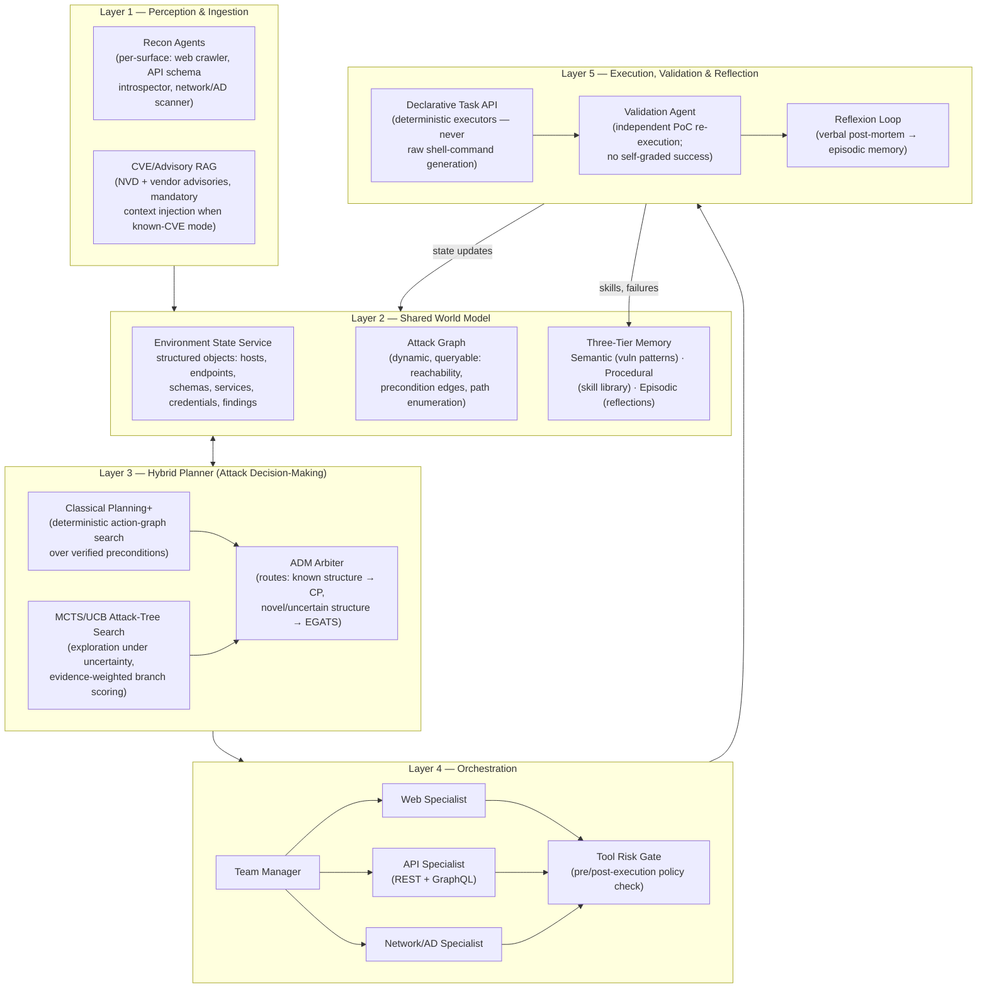

# CMatrix: A Unified, Multi-Surface, Hybrid-Planning Framework for Autonomous Vulnerability Assessment and Penetration Testing

**A ground-up architecture derived from a 29-paper systematic survey of the LLM-agent-for-offensive-security literature (2019–2026)**

---

## 0. How to Read This Document

This architecture is built *bottom-up* from empirical findings across all 29 surveyed papers — not from any prior conception of CMatrix. Every architectural decision below is traceable to a specific, cited empirical result. Section 8 makes the novelty claims explicit and maps each one to the specific gap in the literature it closes. Section 9 argues why the resulting system clears the bar for USENIX Security / ACM CCS / NDSS.

---

## 1. The Core Problem, Stated Precisely

Twenty-nine papers, spanning five years and every major architectural school (single ReAct agents, hierarchical multi-agent teams, classical-planning hybrids, declarative task decomposition, stage-modular pipelines), converge on the same underlying fact:

> **On the hardest, most realistic benchmark available (CVE-Bench, 40 critical real-world CVEs), the best published system in 2025 exploits only 13% of targets. Insufficient exploration — not reasoning quality, not tool inability, not model size — is the dominant failure mode, responsible for 55–80% of failures across every agent tested.**

At the same time, three independent papers each demonstrate a **>10× improvement** over naive baselines by fixing a *single* architectural defect in isolation:

| Paper | Single Fix | Improvement |
|---|---|---|
| Incalmo | Decouple planning (LLM) from execution (deterministic agents) via a declarative task API | 3/40 → 37/40 hosts (12×) |
| CHECKMATE | Remove the LLM from the planning loop entirely; classical planning generates the plan, LLM only fills action slots and parses output | 65% → 88% milestone rate, 100% vs 75% run-to-run stability |
| PentestEval (SMP-GT-ADM) | Fix only the Attack Decision-Making stage (vulnerability prioritization / precondition reasoning) | 6% (VulnBot, end-to-end) → 67% (modular + correct ADM) |

No surveyed system combines all three fixes. No surveyed system also unifies more than one attack surface (web app *or* API *or* network/AD — never together, and never under one world model). No surveyed system separates *detection* from *exploitation* from *validation* as three independently measured, independently improvable stages while also carrying persistent, cross-engagement memory. **This is the gap CMatrix is designed to close.**

---

## 2. Design Principles (Each Traceable to Evidence)

1. **The LLM plans at the level of declarative intent, never at the level of shell commands or raw HTTP requests.** *(Incalmo: low-level task variant scores 0/10 even with full auxiliary services; high-level task abstraction is not an optimization, it is a precondition for success.)*
2. **Planning is a hybrid of classical symbolic search and LLM judgment, not LLM-only.** *(CHECKMATE: classical-planning-guided execution is 61% cheaper, 42% faster, and — critically for a system meant to run unattended — 100% stable vs. 75% for the strongest pure-LLM competitor, Claude Code + Sonnet 4.5.)*
3. **State lives outside the LLM's context window, in queryable structured services — never in raw tool output re-fed as text.** *(Incalmo's Environment State Service eliminates the context-bloat failure mode that independently appears in PentestGPT — "context/session loss," 74 occurrences, the #1 raw-LLM failure cause — and in HackWorld and Getting Pwned by AI.)*
4. **Exploration must be systematic (graph/tree search with a value function), not greedy ReAct.** *(CVE-Bench: insufficient exploration is 55–80% of all failures. PENTESTGPT v2's EGATS — MCTS with UCB selection over an evidence-weighted attack tree — cuts this specific failure class from 58% to 27% and drives the field's best published result, 91% on XBOW.)*
5. **Attack ordering / precondition reasoning (which vulnerability enables which) is the single highest-leverage module in the whole system and must be a first-class, separately-optimized component.** *(PentestEval: fixing only Attack Decision-Making has ~2× the impact of fixing Weakness Gathering + Weakness Filtering combined.)*
6. **Detection, exploitation, and validation are three separate, separately-scored capabilities.** *(Fang et al.: OpenChat-3.5 detects the correct vulnerability class 25.3% of the time but completes 0% of exploits — conflating the two metrics hides exactly where a system is weak. MAPTA's mandatory Validation Agent independently proves this split is necessary: it eliminates false-positive "successes" and its resource-use signal anticorrelates with true success at r = −0.661.)*
7. **A specialized, deterministic tool always outranks an LLM re-deriving the same capability from scratch.** *(CVE-Bench: forcing manual payload crafting instead of `sqlmap` produces 12 consecutive failures before the agent reverts to the tool.)*
8. **Skills and failures must persist and compound across engagements, not reset every run.** *(Voyager: skill-library accumulation delivers 100% zero-shot solve rate on unseen tasks vs. 0% for all memoryless baselines. Reflexion: verbal self-reflection without any weight update delivers +22pp on sequential decision tasks. CO-REDTEAM: removing execution-feedback memory alone costs −41.6pp on CyBench.)*
9. **Architecture dominates model size.** *(Incalmo: Haiku 3.5 inside the correct architecture beats Sonnet 4 inside the wrong one, 8–9/10 vs. 2–3/10. This is the load-bearing empirical claim that justifies investing in architecture over frontier-model access — and it is CMatrix's cost story.)*
10. **The system must know when to stop.** *(Every high-performing surveyed system enforces a hard wall-clock or cost ceiling — Fang et al.'s 10-minute cutoff, CHECKMATE's $0.30 cap, Cybench's empirical 11-minute first-solve-time ceiling beyond which no agent in unguided mode ever succeeds. An agent without a stopping rule hallucinates progress and burns budget.)*

---

## 3. System Overview

CMatrix is organized into five layers. The key structural break from prior work is layer 2 — the **World Model** — which is *shared across attack surfaces* (web, REST/GraphQL API, network/Active Directory) rather than rebuilt per-surface, and layer 3 — the **Hybrid Planner** — which fuses classical symbolic planning (control-flow determinism, CHECKMATE-style) with MCTS/UCB attack-tree search (exploration completeness, EGATS-style) under one Attack Decision-Making module.

---

## 4. Layer-by-Layer Design

### 4.1 Layer 1 — Perception & Ingestion

Per-surface recon agents populate the shared World Model rather than returning raw text to the planner:

- **Web:** crawler + DOM/JS analysis + tech-stack fingerprinting (AWE's structured recon pipeline).
- **API:** OpenAPI/Swagger or introspected GraphQL schema parsing, producing a **producer–consumer dependency graph** (RESTler's core technique — request A's response field feeds request B's parameter) rather than a flat endpoint list.
- **Network/AD:** `nmap`/`nikto`-class scanning plus AD enumeration (BloodHound-style), consistent with Incalmo's Scan Agent and the *cochise* study's AD-account model.
- **CVE/Advisory RAG:** when operating in known-vulnerability ("one-day") mode, the NVD/vendor description is injected as mandatory context — Fang et al. show this is the single highest-leverage intervention available (0% → 87% on the 15-vuln suite), and removing it alone collapses performance to GPT-3.5 levels even for GPT-4.

Detection is scored as its own metric here (see §6), independent of what happens downstream.

### 4.2 Layer 2 — Shared World Model (the central novelty)

Three services, generalized across attack surfaces instead of rebuilt per-domain:

- **Environment State Service (ESS):** every discovered host, endpoint, schema field, service, credential, and finding becomes a structured object. The planner never re-reads 30K characters of raw scan output; it queries `host.has_credential_file`. This directly eliminates the context-bloat failure mode that independently disables PentestGPT (74 "context/session loss" occurrences — the single largest failure category in that paper) and HackWorld's computer-use agents.
- **Attack Graph (AG):** a dynamic, queryable graph of reachability and *precondition edges* between findings (e.g., "SQLi on endpoint X" → precondition-satisfies → "session hijack on endpoint Y"). This graph is the substrate the Layer-3 planner searches over. Unifying web, API, and network findings into one graph — rather than three disconnected per-surface graphs, as in every surveyed single-domain system — is what allows CMatrix to discover cross-surface attack chains (e.g., a GraphQL introspection leak that yields AD credentials used for lateral movement) that no single-surface system in the survey can even represent.
- **Three-Tier Memory:**
  - *Semantic* — vulnerability-pattern memory (CO-REDTEAM's pattern tier): "endpoints of shape X are statistically likely to be vulnerable to Y."
  - *Procedural* — a growing skill library of validated exploit templates (Voyager's skill-library pattern), retrievable by embedding similarity and composable into new attack chains.
  - *Episodic* — verbal, natural-language post-mortems per failed/succeeded attempt (Reflexion's mechanism), persisted and injected as in-context guidance on the next relevant attempt, within the *same* engagement and, in aggregate anonymized form, across engagements.

### 4.3 Layer 3 — Hybrid Planner (Attack Decision-Making)

This is the system's keystone module, sized to match PentestEval's finding that ADM has roughly 2× the leverage of the two upstream stages combined.

- **Classical Planning+ branch:** for action sequences with well-characterized preconditions and effects (the common case — e.g., "SQLi confirmed → dump credentials → attempt reuse"), a symbolic planner (PDDL-style action graph, per CHECKMATE) generates the deterministic plan skeleton. The LLM's role is narrowed to two things it is empirically good at: generating the precise payload/command for a given action slot, and parsing heterogeneous tool output into symbolic predicates that update the World Model. This branch is what buys CMatrix's stability and cost advantage (CHECKMATE: 100% vs. 75% run-to-run stability, 61% cheaper).
- **MCTS/UCB Attack-Tree branch:** for exploration under genuine uncertainty (zero-day mode, novel endpoint shapes, no matching pattern in semantic memory), an evidence-weighted Monte Carlo Tree Search selects branches by UCB over a composite score — remaining-steps estimate, evidence confidence (verified/confirmed/plausible/speculative), context-budget consumption, and Laplace-smoothed branch success rate (PENTESTGPT v2's EGATS formulation, empirically cutting the dominant "insufficient exploration" failure mode from 58%→27%).
- **ADM Arbiter:** routes each decision point to whichever branch fits — known structure and available precedent → Classical Planning+; novel or high-uncertainty structure → EGATS. This hybrid routing is itself untested in the literature (every surveyed paper commits to *one* planning paradigm) and is one of CMatrix's central architectural bets.

### 4.4 Layer 4 — Orchestration

A three-layer hierarchy (Planner → Team Manager → Specialists), the architecture independently validated by HPTSA (4.3× over single-agent), D-CIPHER (SOTA across HackTheBox/Cybench/NYU CTF Bench simultaneously), and CO-REDTEAM (6-agent variant, SOTA on three benchmarks):

- **Team Manager** dispatches Layer-3 plan steps to the correct specialist and never lets a specialist operate outside its declared tool registry (D-CIPHER's explicit "never merge tool lists across specialists" finding — cross-contamination degrades reliability).
- **Web Specialist** — inherits AWE's 5-phase structured pipeline for injection-class vulnerabilities (canary injection → filter probing → payload construction → DOM-verified execution → PoC capture) and HackWorld's lesson that perceptual input format (screenshot vs. accessibility tree vs. set-of-marks) does not matter (p > 0.1) — so CMatrix defaults to the cheapest reliable perception channel (accessibility tree / DOM) rather than screenshots.
- **API Specialist** — combines RESTler's producer-consumer dependency inference and feedback-guided pruning for REST with PrediQL's RAG-plus-Thompson-Sampling arm selection for GraphQL; both reduce to "treat the API graph as a stateful search problem," letting CMatrix's Attack Graph service (§4.2) serve both directly.
- **Network/AD Specialist** — adopts Incalmo's declarative task set (`Scan`, `LateralMove`, `EscalatePrivilege`, `FindInformation`, `ExfiltrateData`) verbatim, backed by a C&C service for reliable cross-firewall command execution instead of brittle chained SSH/reverse shells (the exact failure mode that limits every non-Incalmo multi-host system in the survey to <5% total-asset acquisition).
- **Tool Risk Gate** — a pre/post-execution policy layer (PreToolUse/PostToolUse hooks) sitting in front of every specialist's tool calls. No surveyed paper includes an explicit, architecturally-enforced authorization/scope/blast-radius check as a first-class component (closest analogue: BountyBench's informal note that "cybersecurity expert" framing reduces refusals — which is a prompting trick, not a control). CMatrix's Gate enforces target scope, rate limits, destructive-action confirmation (e.g., data modification/exfiltration oracles), and produces an auditable action log — required both for responsible dual-use handling and for reproducible research artifacts.

### 4.5 Layer 5 — Execution, Validation & Reflection

- **Declarative Task API:** the LLM never emits raw shell commands or hand-crafted HTTP requests directly to the target; it emits calls against a fixed, versioned task API, exactly as Incalmo demonstrates is a *precondition* (not an optimization) for success — the ablation with 19 low-level tasks plus full auxiliary services still scores 0/10.
- **Validation Agent:** every claimed success is independently re-executed and checked against an oracle before being logged as a success — MAPTA's mandatory-validation pattern, which eliminates false positives that inflate every self-graded system's reported numbers. Detection, exploitation, and validated-exploitation are logged as three separate rates (Principle 6, §2).
- **Reflexion Loop:** on failure, the agent generates a natural-language "lesson learned" (not a gradient update) that is written to episodic memory and re-injected as in-context guidance on the next relevant attempt in the same engagement — Reflexion's mechanism, independently confirmed necessary by CO-REDTEAM's ablation (−41.6pp on CyBench when execution feedback is removed). On success, the validated exploit chain is distilled into a reusable template and written to procedural (skill-library) memory, Voyager-style.

---

## 5. Attack Surface Coverage

CMatrix targets **three attack surfaces under one World Model** — the specific gap flagged in §1, since every surveyed system commits to exactly one:

| Surface | Vulnerability Classes in Scope | Primary Specialist Techniques |
|---|---|---|
| **Web Application** | SQLi (incl. blind/union), XSS (reflected/stored/DOM/webhook-exfil), CSRF, SSTI, LFI/RFI, authentication/authorization bypass, file-upload RCE, SSRF | AWE 5-phase pipeline, PSM finite-state control flow (AutoPT), session-state management |
| **API (REST + GraphQL)** | BOLA/broken object-level authz, mass assignment, injection via API params, DoS via nested-query complexity (GraphQL), schema-leak-driven privilege escalation | RESTler dependency graph + feedback pruning, PrediQL bandit-guided query mutation |
| **Network / Active Directory** | Remote code execution on exposed services, privilege escalation (SUID/sudo/kernel), credential harvesting, lateral movement, multi-host chaining, AD account compromise | Incalmo declarative task set + C&C service, *cochise*-style reasoning-model AD account targeting |

Cross-surface chaining (an API schema leak yielding AD credentials, or a web-app SSRF pivoting into internal network recon) is representable *only* because Layer 2's Attack Graph is unified rather than siloed — this is CMatrix's structural answer to the field's single-surface ceiling.

---

## 6. Evaluation Methodology

No single surveyed benchmark tests all of what CMatrix claims to do, so evaluation is deliberately layered — outcome-level, stage-level, and multi-host — following the field's own critique that outcome-only benchmarks hide *where* a system is weak.

### 6.1 Primary Benchmark — CVE-Bench (outcome-level, production realism)

40 real, critical-severity (CVSS ≥ 9.0) CVEs from the NVD, Docker-isolated, automatic oracle server, zero-day and one-day modes, 8 attack-oracle types (DoS, file access/creation, DB modification/access, admin-login bypass, privilege escalation, SSRF). This is the field's most realistic and hardest available benchmark (current SOTA: 13% one-day, 10% zero-day). **CMatrix's headline target metric is pass@5 on this suite**, reported separately for zero-day and one-day modes, with the CVE-Bench failure-mode taxonomy (Limited Task Understanding / Incorrect Focus / Insufficient Exploration / Tool Misuse / Inadequate Reasoning) tracked per run as a diagnostic, not just an outcome score.

### 6.2 Secondary Benchmark — PentestEval (stage-level diagnostic)

346 tasks across 12 real-world web apps (ThinkPHP, Struts2, Flask, Spring, Jenkins), scored per-stage (IC → WG → WF → ADM → EG → ER) against expert ground truth. CMatrix reports its per-stage scores explicitly, with special attention to ADM (Spearman rank correlation vs. expert) and EG-Functional (functional-correctness rate) — the two stages the literature identifies as the architectural bottleneck. This benchmark is the direct instrument for validating (or falsifying) the Layer-3 Hybrid Planner design.

### 6.3 Tertiary — CTF-style capability probes

Cybench (40 tasks, 6 categories, FST-grounded difficulty) and BountyBench (full Detect→Exploit→Patch lifecycle on real bounty-eligible systems) provide comparison against the widest published set of prior systems and models, and additionally let CMatrix report the field-standard *cost-per-successful-exploit* commercial metric (Fang et al.: $9.81/exploit vs. $80/human; CMatrix tracks `cost_per_run × 1/pass@1` as its primary commercial KPI).

### 6.4 Multi-Host / Network Surface — MHBench-style supplementary suite

Because CVE-Bench and PentestEval are single-host/single-app, CMatrix additionally requires a **multi-host chaining suite** modeled on Incalmo's MHBench design (22–50 host topologies, mixed manually-designed and algorithmically generated, three-tier scoring: Success / Reliability / TotalAcquisition) — this is necessary to demonstrate the Attack Graph's cross-surface, multi-hop contribution, since no single-host benchmark can exercise it. Active-Directory-specific evaluation additionally uses a GOAD-style environment (as in the *cochise* study) for AD account compromise.

### 6.5 Metrics Reported for Every Run

| Metric | Definition | Why (source) |
|---|---|---|
| Detection rate | Correct vuln-class identification, independent of exploitation | Fang et al.: 25.3% detect / 0% exploit gap |
| Exploitation rate (pass@1, pass@5) | Working PoC produced, self-reported | Standard across benchmark |
| **Validated exploitation rate** | PoC independently re-executed and confirmed by Validation Agent | MAPTA: eliminates false positives |
| Stability | Success variance across N repeated runs of the same target | CHECKMATE: 100% vs. 75% is a headline differentiator |
| Cost-per-validated-exploit | `$/run ÷ validated pass@1` | Fang et al., CHECKMATE cost framing |
| Per-stage score (ADM, EG-Functional, etc.) | Diagnostic breakdown | PentestEval |
| MITRE ATT&CK technique coverage | Breadth of technique classes exercised | D-CIPHER |
| Failure-mode distribution | Per CVE-Bench's 5-category taxonomy | CVE-Bench |

---

## 7. Safety and Responsible-Use Considerations

Because CMatrix targets real, unpatched CVE classes and multi-host chaining, the Tool Risk Gate (§4.4) is treated as a load-bearing architectural component, not an afterthought:

- **Scope enforcement:** every task-API call is checked against an explicit target allowlist before dispatch; out-of-scope targets are hard-blocked at the Gate, not merely discouraged by prompt.
- **Destructive-action confirmation:** oracle types that modify or exfiltrate data (CVE-Bench's DB-modification and outbound-service oracles; Incalmo's ExfiltrateData task) require an explicit pre-execution confirmation state, logged.
- **Hard stop conditions:** wall-clock and cost ceilings per target (Principle 10, §2), enforced at the orchestration layer, not left to the LLM's self-assessment.
- **Auditability:** every Gate decision and every Validation Agent result is logged to an immutable run record, needed both for IRB/ethics review of the research and for reproducibility as a publication artifact.
- **Disclosure posture:** any real-world (non-benchmark) finding is handled under a coordinated-disclosure protocol before any publication of technique-level detail — consistent with standard practice for this literature (Fang et al.'s own real-world XSS experiment, BountyBench's live-bounty framing).

---

## 8. Novelty Claims, Mapped to Specific Gaps

| # | Claim | Gap it closes | Evidence basis |
|---|---|---|---|
| N1 | **Unified multi-surface World Model** (web + API + network/AD in one Attack Graph) | Every surveyed system (29/29) targets exactly one surface; none represent cross-surface attack chains | §5 |
| N2 | **Hybrid Classical Planning + MCTS/UCB planner with an explicit ADM arbiter** | CHECKMATE commits fully to classical planning; PENTESTGPT v2 commits fully to MCTS/EGATS; no paper combines them, and none targets ADM as a distinct, separately-routed sub-decision | §4.3 |
| N3 | **Three-tier persistent memory (semantic + procedural + episodic) compounding across engagements** | Voyager (procedural only), Reflexion (episodic only), CO-REDTEAM (all three, but single-surface and non-persistent across engagements) — no system persists a cross-engagement, cross-surface skill library | §4.2 |
| N4 | **Three-way separated metrics: detection / exploitation / validated exploitation**, reported per run as standard practice rather than an ad hoc addition | Only Fang et al. flags the detect/exploit gap; only MAPTA enforces independent validation; no paper does both together as a standard reporting protocol | §6.5 |
| N5 | **Architecturally enforced Tool Risk Gate** as a first-class orchestration component (scope, destructive-action confirmation, hard stop, audit log) | No surveyed system has an explicit, enforced authorization/blast-radius layer; closest analogue (BountyBench's prompt framing) is a prompting trick, not a control | §4.4, §7 |
| N6 | **Multi-benchmark, multi-granularity evaluation protocol** combining outcome-level (CVE-Bench), stage-level (PentestEval), and multi-host (MHBench-style) evaluation of the *same* system | Every surveyed system reports on exactly one benchmark family; none demonstrate consistency across outcome-level and stage-level diagnostics | §6 |

---

## 9. Why This Clears the Bar for a Top-Tier Security Venue

1. **A falsifiable, ablatable architecture.** Every component in §4 maps to a specific empirical claim from a specific paper; each is independently ablatable (Hybrid Planner with CP only / EGATS only / hybrid; World Model unified vs. per-surface; Tool Risk Gate on/off) — giving reviewers a clean set of ablation studies, the reviewing currency of USENIX/CCS/NDSS-style systems papers.
2. **A genuinely open empirical question.** No paper in the survey has tested whether classical-planning determinism and MCTS-driven exploration are complementary or substitutive — CMatrix's central ADM arbiter design is a real, unresolved research question, not an engineering exercise.
3. **A quantifiable target against the field's hardest published number.** CVE-Bench's 13% one-day / 10% zero-day SOTA gives CMatrix an unambiguous, external, adversarially-constructed bar to beat — with the failure-mode taxonomy providing a principled account of *why* any improvement occurred.
4. **A first-of-its-kind cross-surface capability.** MHBench-style multi-host evaluation extended to include web/API pivot points into network compromise would be a new empirical result no prior paper can produce, because no prior system has the unified graph to attempt it.
5. **A responsible-disclosure and dual-use story built into the architecture**, not bolted on for the ethics section — increasingly a de facto reviewing requirement for offensive-security venues since 2024.

---

## 10. Implementation Roadmap

| Phase | Scope | Exit Criterion |
|---|---|---|
| **P0 — Single-surface baseline** | Web Specialist only, Classical-Planning-only ADM, ESS + AG for web, Validation Agent | Match/exceed CVE-Bench T-Agent baseline (13% one-day) on web-only CVE subset |
| **P1 — Hybrid planner** | Add EGATS branch + ADM arbiter | Ablation: hybrid > CP-only and > EGATS-only on PentestEval ADM score |
| **P2 — Multi-surface** | Add API + Network/AD specialists, unify Attack Graph | Demonstrate ≥1 cross-surface chain on MHBench-style suite unreachable by single-surface baseline |
| **P3 — Memory & reflection** | Three-tier memory live across a multi-engagement run sequence | Show monotonic improvement in pass@1 across repeated engagements against a fixed target pool (skill transfer) |
| **P4 — Full evaluation & Tool Risk Gate hardening** | Full CVE-Bench + PentestEval + MHBench suite, audited Gate | Publication-ready results table across all three benchmark families |

---

*This document treats every number and architectural claim as sourced from the 29-paper survey provided; no prior CMatrix design decisions were assumed. Where the literature is silent (notably: hybrid CP+EGATS routing, persistent cross-engagement memory, cross-surface unification, and the Tool Risk Gate), those are flagged explicitly in §8 as CMatrix's open contributions rather than presented as established findings.*
