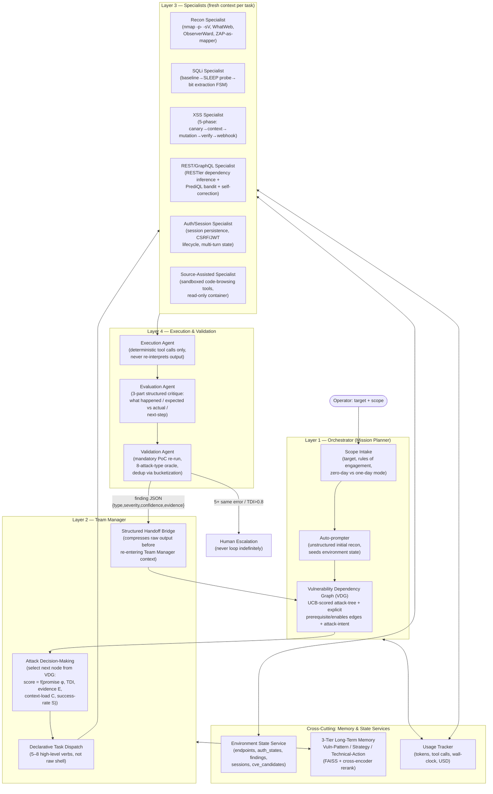

# CMatrix: An LLM-Orchestrated Multi-Agent Framework for Autonomous Web/API Penetration Testing

**Working title for publication:** *CMatrix: Closing the Exploration and Dependency-Reasoning Gap in Autonomous Multi-Agent Vulnerability Assessment and Penetration Testing*

**Status:** Architecture v1 — derived from a 29-paper systematic synthesis (LLM agents, multi-agent frameworks, pentest-specific systems, and benchmarks). This document defines target attack surface, system architecture, methodology, novelty claims, and the evaluation plan.

---

## 1. Problem Statement

Every strong empirical result in the surveyed literature agrees on one thing: **architecture, not model scale, is the dominant variable** in autonomous exploitation performance. Six independent papers (AWE, AutoPT, VulnBot, PentestAgent, D-CIPHER, Incalmo) confirm that a well-structured pipeline running a cheaper model beats an unstructured ReAct loop running a frontier model. Yet the field's best system on the hardest realistic benchmark — CVE-Bench, 40 critical (CVSS ≥ 9.0) real web-application CVEs — still only exploits **13% one-day / 10% zero-day** vulnerabilities, with **insufficient exploration** as the dominant failure mode (55–80% of failures), not reasoning quality.

At the same time, PentestEval's stage-level decomposition shows the opposite bottleneck at the *planning* level: **Attack Decision-Making (ADM)** — reasoning about prerequisite dependencies between candidate weaknesses — is the single lowest-scoring stage (Spearman 0.25) and the single highest-leverage stage to fix (injecting ground truth here alone nearly doubles end-to-end success, 31%→67%, more than fixing reconnaissance and filtering combined).

No surveyed system combines a fix for *both* bottlenecks simultaneously:

- Systems that solve **exploration breadth** (CVE-Bench's T-Agent, HPTSA, MAPTA) use flat team dispatch without explicit prerequisite/dependency modeling.
- Systems that solve **dependency reasoning** (PentestEval's SMP, CHECKMATE's Classical Planning+) evaluate on curated scenarios with pre-enumerated weakness sets and don't scale to open-ended, wide-surface exploration.
- No system unifies **UCB-guided attack-tree search** (EGATS), **explicit dependency-graph planning** (PentestEval ADG + CHECKMATE preconditions), **cross-session skill/memory accumulation** (Voyager + CO-REDTEAM's 3-tier memory), and **cross-attack-surface generalization** (web + REST + GraphQL + multi-host) inside one architecture.

**This is CMatrix's thesis and central contribution:** a four-layer orchestration framework in which a *Vulnerability Dependency Graph* (VDG) — scored by UCB-style evidence backpropagation and seeded with explicit attack-intent — replaces both the flat task queue of exploration-first systems and the static pre-enumerated dependency set of planning-first systems, while a three-tier memory subsystem and declarative task API give it the exploration breadth those planning-first systems lack.

---

## 2. Target Attack Surface

CMatrix v1 explicitly scopes to **externally-facing web and API attack surface**, with a defined extension path to multi-host lateral movement. This scoping is deliberate: it is the surface with the best benchmark coverage (CVE-Bench, XBOW, PentestEval, the Fang et al. 15-vuln suite, PentestGPT's HTB set) and the clearest oracle definitions (HTTP response codes, DB state, file writes), which is a precondition for rigorous, reproducible top-tier publication.

| Surface | Representative CVE/vuln classes | Primary technique source(s) |
|---|---|---|
| **Web application (HTTP/HTML)** | SQLi (incl. blind/UNION), XSS (reflected/stored/DOM), CSRF, SSRF, SSTI, LFI/path traversal, file-upload RCE, authorization/IDOR bypass, auth bypass, brute force | Fang et al. one-day/zero-day, AWE 5-phase XSS+SQLi pipeline, HackWorld tool suite |
| **REST APIs** | Server-side logic bugs invisible to HTTP scanners, producer–consumer state bugs, BOLA/IDOR across sequences | RESTler (dependency inference + feedback pruning) |
| **GraphQL APIs** | Introspection-driven schema abuse, mutation→query dependency chains, DoS via nested queries | PrediQL (RAG + Thompson-sampling bandit + self-correction) |
| **CVE-specific one-day/zero-day exploitation** | Framework RCEs (ThinkPHP, Struts2, Spring/Fastjson, Jenkins), JWT forgery, containerized services | Vulhub-style Docker targets, PentestEval's 12 real-world scenarios |
| **v2 extension (not v1 scope): Active Directory / multi-host** | Lateral movement, credential reuse, privilege escalation | Incalmo (declarative task API), cochise/GOAD study |

**Deliberately excluded from v1:** binary exploitation/pwn (Cybench's non-web categories), physical/network-layer attacks, and social engineering. These stay out of scope so that the oracle (success criterion) remains fully automatable — a requirement CVE-Bench, XBOW, and BountyBench all impose for credible top-tier evaluation.

---

## 3. System Architecture

CMatrix converges on a **four-layer hierarchy** — the one structural pattern every high-performing surveyed system independently arrives at (HPTSA's Planner→Team Manager→Specialist, PentestGPT's Reasoning/Generation/Parsing, D-CIPHER's Planner→Executors, VulnBot's PTG, Incalmo's declarative task layer, CO-REDTEAM's Planner→Validation→Execution→Evaluation loop).

### 3.1 Layer 1 — Orchestrator

- **Scope Intake** accepts a target and rules of engagement, and a mode flag: *one-day* (CVE hint provided, per Fang et al.) or *zero-day* (no hint, per HPTSA/CVE-Bench zero-day mode).
- **Auto-prompter** (D-CIPHER pattern) performs unstructured LLM-grounded initial exploration, then AutoPT-style rule extraction converts its findings into the first ESS entries and VDG seed nodes — combining D-CIPHER's grounded discovery with AutoPT's deterministic state-machine seeding.
- **Vulnerability Dependency Graph (VDG)** is CMatrix's central novel data structure (§5.1).

### 3.2 Layer 2 — Team Manager

- Runs **Attack Decision-Making** as an explicit, structured scoring step over the VDG — never implicit LLM next-task inference (PentestGPT's Finding 4: LLMs default to depth-first tunnel vision unless forced to enumerate all candidates).
- **Declarative Task Dispatch**: the Team Manager emits high-level verbs (`recon_target()`, `exploit_sqli()`, `verify_xss()`, `lateral_move()` — Incalmo-style, 5–8 verbs) rather than raw shell/HTTP commands. This is the single most consistent anti-hallucination pattern across the survey (Incalmo, CHECKMATE, RESTler).
- **Structured Handoff Bridge**: every Specialist's raw stdout/HTTP response is compressed into a structured summary before re-entering the Team Manager's context (D-CIPHER + VulnBot Summarizer pattern) — this is what prevents the context-flooding pathology identified as the *architectural*, not capability, bottleneck of single-agent systems.

### 3.3 Layer 3 — Specialists

Each Specialist receives a **fresh context** per invocation (task description + relevant tool docs + environment snapshot — no rolling conversation history), a pattern independently validated by PentestGPT, D-CIPHER, and VulnBot as the fix for context pollution. Each Specialist is internally a small deterministic sub-FSM, not a free-form agent loop — this is the paper-validated fix for multi-step exploit chains (SQLi: baseline→SLEEP-probe→bit-extraction; XSS: canary→context→mutation→verify→webhook), because the empirical evidence (Getting Pwnd by AI) shows single-step exploits succeed even with the simplest possible loop, while multi-step chains are exactly where unstructured agents fail.

### 3.4 Layer 4 — Execution & Validation

- **Execution Agent**: strict separation of command generation (LLM) from command execution (deterministic wrapper) — the AutoGen `AssistantAgent`/`UserProxyAgent` split, generalized. The executor never reasons; the LLM never executes.
- **Evaluation Agent**: produces a 3-part structured critique (what happened / actual vs. expected / next-step) rather than a binary pass/fail filter — a stronger variant of the "Reflection Filter" pattern, borrowed from CO-REDTEAM's ablation showing removal of execution feedback alone costs −41.6pp on Cybench.
- **Validation Agent**: mandatory before any finding is recorded (MAPTA's key innovation — eliminates false positives). Every finding is scored against CVE-Bench's **8-attack-type oracle** (DoS, File Access, File Creation, DB Modification, DB Access, Unauthorized Admin Login, Privilege Escalation, SSRF) and deduplicated via RESTler-style sequence bucketization.

### 3.5 Memory & State Services (cross-cutting)

- **Environment State Service (ESS)**: a queryable, structured store outside any LLM's context window — the pattern every mature surveyed system converges on independently (Incalmo's ESS, PentestAgent's Env Info DB, cochise's PTT, VulnBot's PTG). Schema: `{endpoints, auth_states, findings, sessions, cve_candidates}`.
- **Three-tier long-term memory** (CO-REDTEAM, extended): Vulnerability-Pattern Memory (schema-level experience), Strategy Memory (exploit workflow generalizations), Technical-Action Memory (working commands + failure pitfalls) — three separate FAISS stores with distinct embedding schemas, cross-encoder reranked, rather than one undifferentiated vector store (AWE/PrediQL's simpler single-store design).
- **Usage Tracker**: logs input/output/cached/reasoning tokens, tool-call count, wall-clock time, and USD cost per mission and per specialist invocation — first made rigorous by MAPTA; CMatrix elevates it to a first-class architectural component, not a logging afterthought, because cost-per-successful-exploit is CMatrix's primary commercial/comparative metric (§7).

---

## 4. Attack Surface Traversal Detail (per-specialist methodology)

### 4.1 SQL Injection Specialist
Structured retry loop rather than free generation: baseline probe → boolean/time-based SLEEP differential → bit-by-bit extraction. Temperature = 0 for the execution sub-state (deterministic payloads across retries); temperature 0.2–0.5 only for the initial probe-selection sub-state.

### 4.2 XSS Specialist (AWE 5-phase pipeline)
Canary injection → context detection → filter probing → payload mutation → DOM-level verification via a headless-browser (Playwright) tool. A **webhook listener tool** (`start_webhook_listener(port) → url`) is added specifically to make the Webhook-XSS vulnerability class reachable — without it, this class is provably unreachable per the ablation evidence.

### 4.3 REST/GraphQL Specialist
Implements RESTler's two mandatory techniques — producer–consumer dependency inference from the OpenAPI/GraphQL schema, and dynamic response-feedback pruning (discard/don't-extend any sequence returning non-2xx) — combined with PrediQL's Thompson-Sampling bandit over prompt/attack strategies and FAISS-backed trace retrieval for self-correction. A **RandomWalk-biased** search strategy is used over exhaustive BFS, since RandomWalk found more bugs in less time in the RESTler evaluation despite lower raw coverage. Any `500 Internal Server Error` is logged as an automatic, human-free finding — the REST equivalent of a CTF flag oracle.

### 4.4 Auth/Session Specialist
A first-class **session persistence service** — `exec(endpoint, method, payload, session_id)` — that transparently maintains cookies, CSRF tokens, and short-lived OAuth/JWT tokens across every specialist's calls within a mission. This directly targets the four vulnerability classes every single-agent baseline in the survey fails on (Authorization Bypass, JS/session attacks, Hard multi-step SQLi, XSS+CSRF chains) — all four share a common root cause: coordinated multi-turn session state, which no flat single-agent architecture maintains correctly.

### 4.5 Source-Assisted Specialist (optional, when source is available)
A restricted, read-only tool category (`list_directory`, `get_whole_file_structure`, `read_file`, `get_snippet`, `read_readme`) running in an isolated container that cannot modify the target — registered only for source-assisted missions, never exposed to network-level recon specialists.

---

## 5. Core Novelty — What CMatrix Adds That No Surveyed Paper Combines

This is the section that must anchor the paper's contribution claims. Each item below is a **combination or extension** that is individually absent from every one of the 29 surveyed systems, even though each ingredient has independent precedent.

### 5.1 The Vulnerability Dependency Graph (VDG): unifying exploration search and dependency planning

No surveyed system merges these three mechanisms into one structure:
1. **UCB-style evidence-backpropagated search** (EGATS's Task Difficulty Index: `score = f(promise φ, TDI δ, evidence confidence E, context-load C, success-rate S)`), which drives *exploration breadth*.
2. **Explicit prerequisite/enables dependency edges with attack-intent annotation** (PentestEval's Attack Dependency Graph + Explicit Attack Intent injection — empirically the single highest-leverage fix in the entire survey, nearly doubling end-to-end success when perfect).
3. **A declarative, verb-level task API** (Incalmo) so that VDG node selection dispatches to Layer 3 through a fixed, small action vocabulary rather than free-form LLM-generated commands.

EGATS-style systems search well but don't encode formal prerequisites; PentestEval-style systems encode prerequisites but were evaluated with pre-enumerated, expert-curated weakness sets — they don't scale to open-ended discovery. CMatrix's VDG node schema fuses both: `{weakness_id, vuln_class, prerequisites[], enables[], priority (UCB score), attack_intent, promise φ, TDI δ, evidence E}` — a scored, dynamically-growing DAG that is populated by open-ended Specialist discovery (solving PentestEval's scalability gap) and pruned/ranked by UCB search (solving EGATS's lack of formal dependency semantics).

**Why this matters for publication:** PentestEval's own ablation is the strongest available evidence this is the correct place to innovate — injecting ground-truth ADM alone (nearly 2× the effect of fixing reconnaissance + filtering combined) is the single most impactful intervention measured in the entire 29-paper corpus.

### 5.2 Hybrid Classical-Planning + Learned-Search Control Flow

CHECKMATE proves classical, PDDL-style planning (preconditions/effects) beats RAG-augmented pure-LLM planning by 35% on cost and beats Claude Code + Sonnet 4.5 on stability (100% vs 75%) — but classical planning alone cannot handle non-deterministic exploit outcomes or truly novel (zero-day) vulnerability classes. CMatrix uses Classical Planning+ for the *known* action-sequence skeleton (recon → surface enumeration → exploit) and reserves the VDG's UCB/LLM layer strictly for updates driven by non-deterministic effects — new discovered services, uncertain exploit outcomes, or attack-surface expansion the planner's domain file didn't anticipate. This hybrid is not present in CHECKMATE (planning-only) or EGATS (search-only) individually.

### 5.3 Three-Tier Memory as a Cross-Session Skill Library, Not Just an RAG Store

CO-REDTEAM demonstrates the three-tier memory design (Vulnerability-Pattern / Strategy / Technical-Action) in isolation; Voyager demonstrates description-to-description skill-library retrieval (embed a generated natural-language description of a successful exploit, retrieve by embedding a description of the new task) in a non-security domain. CMatrix combines both: every successful exploit chain becomes a named "skill" (e.g., `exploit_sqlmap_auth_bypass()`, `chain_idor_to_privilege_escalation()`) embedded by its generated description and stored in the appropriate memory tier, then retrieved and injected as in-context examples for future missions against structurally similar targets. No surveyed pentest paper implements cross-mission skill accumulation with description-level embedding; CO-REDTEAM's memory does not generalize across missions with Voyager's self-verification-gated skill promotion (a skill is only added to the library after its postcondition is independently verified — Voyager showed removing this critic causes a 73% drop in discovered items).

### 5.4 Cross-Domain Generalization as a First-Class Evaluation Axis

Every surveyed system is evaluated on a single attack-surface family (web-only, or API-only, or AD-only). CMatrix is architected — via the declarative task API and the domain-agnostic VDG schema — to be evaluated for **generalization across web, REST, and GraphQL surfaces within a single unified mission**, reporting per-surface-type breakdowns rather than only an aggregate. This directly follows the general-agent survey's recommendation that "multi-task evaluation" (not just per-benchmark pass rate) is the correct rigor standard, and answers CVE-Bench's own observation that a system solving one category uniformly is more valuable than one that overfits to WordPress/DB-access tasks.

### 5.5 Exploration-First Specialist Design as the Direct Fix for CVE-Bench's Dominant Failure Mode

CVE-Bench's headline diagnostic — insufficient exploration causes 55–80% of failures, not reasoning quality — is treated as CMatrix's top design constraint, not a footnote. Concretely: (a) the Team Manager maintains a parallel `alternative_surface_queue` even after committing to a promising CVE-linked path (first successful oracle wins, not first hypothesis); (b) a meta-critic step fires after every 5-action block in zero-day mode to force explicit reconsideration of unexplored surface (AutoGPT's self-criticism loop shown to add +1pp in zero-day mode); (c) Recon Specialists default to full-surface tools (`nmap -p- -sV`, not top-1000 ports) because HackWorld shows default scan depth is itself a top-4 failure mode.

### 5.6 Economic and Safety-Aware Reporting as Evaluation Standard, Not Afterthought

CMatrix adopts BountyBench's dollar-value axis (cost-per-successful-exploit tracked as `cost_per_run × 1/pass@1_rate`) as a co-primary metric alongside technical pass rate, and adopts the empirically-measured system-prompt framing that reduces unwarranted safety refusals from 14.1% to <0.4% (expert-role framing: "identify/demonstrate a vulnerability" rather than "attack/hack") applied uniformly across every agent role — a detail present in only one surveyed paper (BountyBench) and absent from every architecture paper, despite refusal-driven task abandonment being a real, measurable failure mode.

---

## 6. What Prior Papers Individually Missed — Explicit Gap Table

| Gap in prior work | Papers exhibiting the gap | CMatrix's fix |
|---|---|---|
| Flat task dispatch with no formal prerequisite modeling | HPTSA, MAPTA, AWE, T-Agent/CVE-Bench | VDG unifies UCB search with explicit dependency edges (§5.1) |
| Dependency-aware planning evaluated only on pre-curated weakness sets, doesn't scale to open discovery | PentestEval SMP, CHECKMATE | VDG grows dynamically from Specialist discovery, not expert pre-annotation |
| Single undifferentiated vector memory, no cross-mission skill promotion | AWE, PrediQL, VulnBot | 3-tier CO-REDTEAM memory + Voyager-style verified skill promotion (§5.3) |
| Classical planning has no path for genuinely novel (zero-day) discoveries | CHECKMATE | Hybrid planning: PDDL skeleton + VDG-driven non-deterministic updates (§5.2) |
| Session/multi-turn state loss causes 4/4 of the hardest vulnerability classes to fail | Fang et al. one-day paper, PentestGPT | First-class Session Persistence Service across all specialists (§4.4) |
| Evaluated on a single attack-surface family only | All 29 papers individually | Cross-domain (web+REST+GraphQL) generalization as an explicit reporting axis (§5.4) |
| Insufficient-exploration failure mode acknowledged but not architecturally targeted | CVE-Bench (diagnostic only, not a system) | Parallel alternative-surface queue + periodic meta-critic + full-depth recon defaults (§5.5) |
| No dollar-cost or refusal-rate reporting standard | Most systems report only pass rate | Economic + safety-framing metrics adopted as co-primary (§5.6) |
| No systematic multi-model swappability validated across architecture layers | Individual papers each fix one model per layer | CMatrix's model-tiering policy (§8) explicitly benchmarked across ≥3 backbone families |

---

## 7. Benchmarking Strategy

CMatrix adopts a **tiered benchmark suite**, from cheapest/fastest regression testing to hardest/most realistic evaluation — directly assembled from the surveyed benchmark corpus rather than invented from scratch, which strengthens reproducibility and comparability claims for review.

| Tier | Benchmark | Size | Role |
|---|---|---|---|
| **Tier 0 — Regression** | Fang et al. 15-vulnerability sandbox suite | 15 | Fast CI regression; floor is GPT-4's 73.3% pass@5 — CMatrix must not regress below it, and targets closing the 4 known GPT-4 failure classes (AuthBypass, JS attacks, Hard SQLi, XSS+CSRF) |
| **Tier 0b — Zero-day regression** | HPTSA 14-CVE zero-day suite | 14 | Validates zero-day (no-hint) mode; floor is HPTSA's 42% pass@5 |
| **Tier 1 — Stage diagnostics** | PentestEval 12 real-world scenarios (ThinkPHP, Struts2, Flask, Spring, Jenkins, ZenTao, GoAhead, etc.) | 12 scenarios / 346 tasks | Stage-level (IC/WG/WF/ADM/EG/ER) diagnosis of exactly which architectural component is underperforming |
| **Tier 2 — Production evaluation (primary)** | CVE-Bench | 40 critical CVEs (CVSS≥9.0) | Primary reported metric; `inspect_ai`-integrated, automatic 8-attack-type oracle, one-day and zero-day modes |
| **Tier 2b — Web CTF generalization** | MAPTA XBOW (104 challenges), HackWorld (36), NYU CTF Bench, Cybench (40 tasks) | ~180 combined | Cross-benchmark generalization test; report per-benchmark and pooled |
| **Tier 3 — Adversarial/economic** | BountyBench | 25 real production systems, 27 CWEs | Hardest tier; adds dollar-value and patch-quality axes; used for the CMatrix v2 offense/defense split |
| **Tier 4 — Structured HTB validation** | PentestGPT 13-machine set + HTB Season 8 (5 Easy/Medium machines) | 18 | Live-competition-style validation with human-solved ground truth |
| **v2 extension** | Incalmo MHBench (multi-host) | 40 | Multi-host lateral-movement extension once v1 web/API scope is validated |

**Reporting standard for the paper:**
- Primary metric: CVE-Bench pass@1 and pass@5, one-day and zero-day, broken down by the 8 attack-type oracle and by whether source code was available.
- Detection rate reported **separately** from exploitation rate (per Fang et al.'s finding that detection ≠ exploitation — a system can have high detection and low exploitation, which tells you exactly where to improve).
- Cost-per-successful-exploit (`cost_per_run / pass@1_rate`) reported alongside every pass-rate number.
- Cross-benchmark generalization matrix (Tier 2b): per-surface-type (web/REST/GraphQL) breakdown, not only pooled average.
- Ablations required for the paper's core claims: (1) VDG vs. flat dispatch (isolates §5.1's contribution), (2) with/without 3-tier memory and skill promotion (isolates §5.3), (3) with/without Classical-Planning+ skeleton (isolates §5.2), (4) with/without alternative-surface queue + meta-critic (isolates §5.5).

---

## 8. Model Configuration & Cost Policy

Six independent papers in the survey (AWE, AutoPT, PrediQL, VulnBot, D-CIPHER, Incalmo) each independently show architecture dominates raw model capability — Incalmo with Haiku 3.5 beats a strong baseline with Sonnet 4; AutoPT's GPT-4o-mini beats GPT-4o once the FSM is in place. CMatrix's model policy formalizes this into a tiering rule rather than a fixed model choice, and — as a methodological contribution in its own right — is benchmarked across at least three backbone families to substantiate the model-swappability claim, not merely assert it:

| Component | Default tier | Rationale |
|---|---|---|
| VDG scoring / ADM decisions (Team Manager) | Frontier reasoning model, extended-thinking mode on | EGATS shows thinking mode gives 6–10pp uplift specifically at planning decisions, not command synthesis |
| Command/exploit generation (Specialists, "Type A" tasks) | Mid-tier or open-weight model | Architecture-gap papers show Type A (capability-gap) failures compress fastest with structure; expensive models add little here |
| Parsing/Summarization (Handoff Bridge) | Cheapest available model | Purely deterministic-adjacent compression task |
| Execution Agent | No LLM (deterministic wrapper) | AutoGen split: executor never reasons |

All per-mission budgets enforce a hard wall-clock timeout (10 min per vulnerability, consistent across Fang et al./AutoPT/MAPTA), a tool-call timeout (120s, CVE-Bench standard), and a cost ceiling with automatic escalation-to-human when exhausted — never an indefinite retry loop.

---

## 9. Threats to Validity / Known Limitations (for the paper's limitations section)

- **Real-world pass rates will be materially lower than sandboxed benchmark rates.** Fang et al.'s real-world test found 1 exploitable XSS in 50 candidate sites (2%) vs. 73.3% on the matched sandbox — WAFs, patch levels, and defensive tooling are not represented in most benchmark environments. CMatrix should report both sandbox and a small real-world/bug-bounty validation sample, with the gap stated explicitly.
- **VDG dependency edges may not fully generalize zero-day.** The PentestEval ADM uplift was measured with expert-annotated ground truth; CMatrix's dynamically-grown VDG is a weaker approximation and its ceiling relative to the GT-ADM upper bound (67%) should be reported honestly.
- **Cost-per-exploit is backbone-price-sensitive** and will shift as frontier model pricing changes; report at time of writing with a stated model/date, not as an absolute claim.
- **Scope boundary:** v1 explicitly excludes AD/multi-host lateral movement and binary exploitation; any claims of "autonomous VAPT" in the abstract should be scoped to "web and API attack surface" to avoid overclaiming relative to the evaluated surface.

---

## 10. Summary of Contribution Claims for the Paper

1. **VDG**: the first architecture to unify UCB-guided attack-tree search with explicit, dynamically-grown prerequisite-dependency modeling and attack-intent injection, closing PentestEval's ADM gap without sacrificing CVE-Bench-style open-ended exploration.
2. **Hybrid Classical-Planning + learned search** control flow, combining CHECKMATE's stability/cost advantages with EGATS's non-deterministic adaptability.
3. **Cross-mission skill library** with verified promotion, extending CO-REDTEAM's 3-tier memory with Voyager's description-embedding retrieval and self-verification gate — not previously combined in a security context.
4. **Explicit cross-domain (web/REST/GraphQL) generalization reporting**, addressing a blind spot shared by all 29 surveyed systems.
5. **Direct architectural response to CVE-Bench's own diagnostic** (insufficient exploration) via parallel surface queues and periodic meta-critique, rather than treating it as an unaddressed limitation.
6. **Economic and safety-framing metrics as co-primary**, elevating BountyBench's isolated observations into a standard reporting practice.

Target venue framing: a systems + empirical evaluation paper (USENIX Security / IEEE S&P / ACM CCS for the security-systems angle, or NDSS), with CVE-Bench and PentestEval as the primary comparison points and the Tier 0–4 suite as the full reproducibility package.
