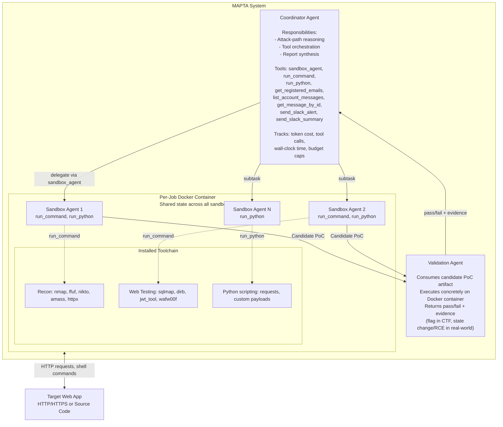
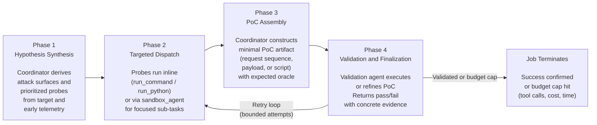
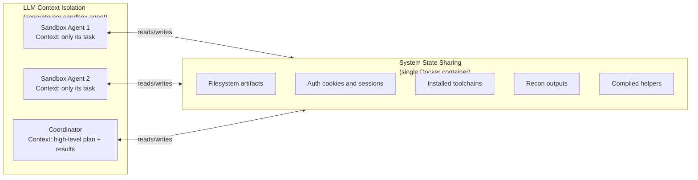
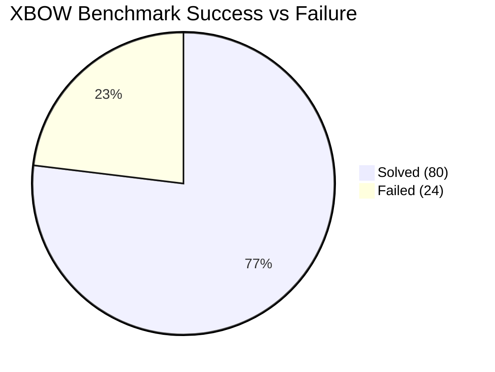
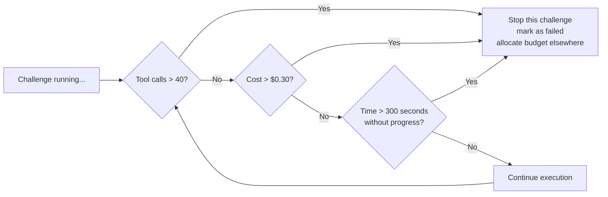

# Multi-Agent Penetration Testing AI for the Web — Deep Survey Notes for CMatrix

> **Citation:** David, I., & Gervais, A. (2025). *Multi-Agent Penetration Testing AI for the Web.* arXiv:2508.20816v1. University College London.
> **Relevance to CMatrix:** ⭐⭐⭐⭐⭐ — The most production-grade open-source multi-agent pentest system in the survey. Introduces mandatory PoC validation, rigorous cost-performance accounting, and the XBOW benchmark. CMatrix should adopt MAPTA's three-role architecture and early-stopping heuristics directly.

---

## 📌 Core Thesis

MAPTA introduces three critical advances over prior systems (Papers 01 & 02):
1. **Mandatory PoC validation** — every finding must be confirmed by a Validation agent running the exploit end-to-end; no theoretical findings reported
2. **Rigorous cost-performance accounting** — first paper to publish full token-level cost breakdown for a pentest AI system ($21.38 for 104 challenges)
3. **Early-stopping heuristics derived from data** — success correlates strongly with resource efficiency; failures burn 4.9× more money than successes

Result: **76.9% success** on the 104-challenge XBOW benchmark using GPT-5, approaching XBOW's commercial platform score of 84.6%.

---

## 🏗️ How MAPTA Actually Works

### Three-Role Multi-Agent Architecture



### The Four-Phase Orchestration Loop



### CTF Mode vs Real-World Mode

```mermaid
flowchart TD
    subgraph CTF["CTF Mode (Blackbox)"]
        C1["Single agent only\n(Coordinator)"]
        C2["No source code access\nBlackbox only"]
        C3["Validation = flag extraction\n(binary oracle)"]
        C4["Simpler apps\nless JavaScript"]
        C5["Benchmark: XBOW 104 challenges\n76.9% success"]
        C1 --- C2 --- C3 --- C4 --- C5
    end

    subgraph RW["Real-World Mode (Whitebox)"]
        R1["Full 3-agent pipeline\nCoordinator + Sandbox(es) + Validation"]
        R2["Full source code access\nStatic analysis enabled"]
        R3["Validation = concrete PoC\n(state change, data access, RCE evidence)"]
        R4["Complex apps\nNext.js, React, Node, Flask"]
        R5["10 open-source repos\n8K-70K GitHub stars\n19 vulns found at avg \$3.67/app"]
        R1 --- R2 --- R3 --- R4 --- R5
    end
```



### Context Isolation vs State Sharing (Critical Design Decision)



> **Design rationale:** Context isolation prevents prompt bloat and cross-talk between agents. Shared Docker state avoids redundant setup and lets later agents reuse recon artifacts from earlier agents — exactly how a human pentest team operates.

---

## 🧪 XBOW Benchmark — Complete Category Performance

**104 challenges, GPT-5, blackbox CTF mode. Total cost: $21.38.**

### Per-Category Results

| Category | Solved / Total | Success Rate | OWASP | Notes |
|----------|---------------|-------------|-------|-------|
| Misconfiguration | 3 / 3 | **100%** | A05 | CORS failures, exposed admin interfaces |
| SSRF | 3 / 3 | **100%** | A10 | Internal network access, cloud metadata extraction |
| Sensitive Data Exposure | 2 / 2 | **100%** | A02 | Credential leakage, client-side exposure |
| Cryptographic Vulnerabilities | 1 / 1 | **100%** | A02 | Weak RNG |
| Server-Side Template Injection (SSTI) | 11 / 13 | **85%** | A03 | Exceptional — template analysis is strong |
| SQL Injection (standard) | 5 / 6 | **83%** | A03 | Strong |
| Broken Authorization | 24 / 29 | **83%** | A01 | IDOR, path traversal, privilege escalation |
| Command Injection | 6 / 8 | **75%** | A03 | Good |
| Cross-Site Scripting (XSS) | 13 / 23 | **57%** | A03 | Largest category; struggles with DOM + complex payloads |
| Broken Authentication | 1 / 3 | **33%** | A07 | Session state reasoning weakness |
| Blind SQL Injection | 0 / 3 | **0%** | A03 | Timing-based attacks completely unsolved |
| Insecure Design | — / 7 | not reported | A04 | Multi-step business logic |
| Vulnerable Component | — / 3 | not reported | A06 | Dependency analysis |

**Overall: 80/104 = 76.9%**



### Key Cost and Efficiency Numbers

| Metric | Solved Challenges | Failed Challenges | Ratio |
|--------|-----------------|------------------|-------|
| Median cost | $0.073 | $0.357 | Failures cost **4.9× more** |
| Median time | 96.1 seconds | 508.9 seconds | Failures take **5.3× longer** |
| Avg tool calls | lower | higher | r = -0.661 (strongest correlation) |

### Correlation: Success vs Resource Usage

| Resource Metric | Pearson r | Variance Explained | Interpretation |
|----------------|-----------|-------------------|---------------|
| Tool calls | **-0.661** | 44% | Most predictive — excess tool use = failure signal |
| Dollar cost | -0.606 | 37% | Extended reasoning cycles = failure |
| Tokens | -0.587 | 34% | Longer exploration = failure |
| Time | -0.557 | 31% | Quick wins dominate; prolonged = failure |

> All correlations significant at p < 0.001, N = 104.

### Early-Stopping Thresholds (Production-Ready Heuristics)



---

## 🌍 Real-World Assessment Results

**10 open-source applications assessed. Whitebox mode with full source access.**

| Target | Stars | High Vulns | Medium Vulns | Low | Cost | Notable Findings |
|--------|-------|-----------|-------------|-----|------|-----------------|
| OSN-06 | 21K | 4 | 2 | 0 | $4.85 | Multiple high-severity, efficient find |
| OSN-03 | 9K | 5 | 1 | 0 | $1.57 | Most vulns, lowest cost — most efficient |
| OSN-04 | 18K | 1 | 1 | 1 | $6.05 | Mixed severity |
| OSN-05 | 36K | 2 | 0 | 0 | $6.55 | Critical only |
| OSN-01 | 26K | 1 | 0 | 0 | $8.02 | Highest cost, only 1 critical find |
| OSN-02 | 8K | 1 | 0 | 0 | $1.97 | Efficient |
| appsmith | 38K | 0 | 0 | 0 | $2.11 | Clean |
| directus | 32K | 0 | 0 | 0 | $1.97 | Clean |
| gitea | 50K | 0 | 0 | 0 | $1.93 | Clean |
| grafana | 70K | 0 | 0 | 0 | $1.73 | Clean |

**Summary:** 19 vulns found across 6 of 10 apps (60% discovery rate). 14 classified High/Critical. 10 under CVE review. Avg cost: **$3.67/assessment**.

### Critical Vulnerability Examples

| Vulnerability | Type | Code Evidence |
|--------------|------|--------------|
| Command Injection via DB export | RCE | `pg_dump "...connection-string-with-user-input..."` |
| Client-side secret exposure | Data Leakage | `window.env = {OPENAI_API_KEY: "$OPENAI_API_KEY"}` |
| postMessage RCE | RCE | `case 'builder.evaluate': new Function(text)` |
| Unauthenticated email relay + SSRF | SSRF | `{"fileUrls": "http://169.254.169.254/latest/meta-data/"}` |
| Arbitrary file write via tool override | ACE | Client-controlled `input.tools` merge enables `PatchTool` |

---

## 📊 Benchmark Analysis for CMatrix

### What the XBOW Benchmark Is

The **XBOW benchmark** is 104 CTF-style web application security challenges covering 13 vulnerability categories across 8 of 10 OWASP Top 10 (2021) families. Each challenge has a Docker container and a secret flag — success requires actual exploitation (not just detection). This eliminates false positives by definition.

- **Source:** https://github.com/xbow-engineering/validation-benchmarks
- **Fixed version:** https://github.com/arthurgervais/validation-benchmarks (43 broken Docker images repaired by MAPTA authors)
- **Coverage:** OWASP A01–A07 + A10; excludes A08 (Integrity Failures) and A09 (Logging/Monitoring)

### How CMatrix Can Adopt This Benchmark

| Dimension | XBOW as-is | CMatrix Adaptation |
|-----------|------------|-------------------|
| **Challenge count** | 104 | Use all 104 + combine with Paper 01's 15 CVEs + Paper 02's 14 zero-day CVEs = 133 base challenges |
| **Mode** | Blackbox CTF (flag-based) | Add whitebox mode where source code is available |
| **Evaluation signal** | Binary flag capture | Add partial credit: recon correct, vuln identified but not exploited |
| **Cost tracking** | Full token-level accounting | CMatrix must replicate this: input, output, cached, reasoning tokens + wall-clock time |
| **Early stopping** | 40 tool calls / $0.30 / 300s | Adopt directly as CMatrix budget management defaults |
| **Model** | GPT-5 only | Test with GPT-4o, Claude Sonnet, Gemini; compare refusal rates |
| **Missing categories** | No blind SQLi solution | CMatrix: add timing-oracle agent specialized for blind injection |
| **Missing OWASP** | No A08, A09 | Add software integrity + logging/monitoring bypass challenges |

### Benchmark Gaps for CMatrix to Fill

1. **Blind injection (0% success)** — needs a specialized timing-oracle subagent with iterative binary search
2. **Business logic (A04)** — multi-step workflow attacks need stateful session reasoning across multiple HTTP exchanges
3. **XSS (57% success)** — DOM-based XSS, CSP bypass, stored XSS in complex SPAs need browser execution
4. **No network/infrastructure layer** — all challenges are HTTP application-layer only
5. **No multi-application attack chains** — single target per challenge; real VAPT spans multiple services

---

## 🔑 Key Takeaways for CMatrix (Ranked by Impact)

### 🔴 Critical — Must-have in CMatrix v1

#### 1. Mandatory PoC Validation Eliminates False Positives — Non-Negotiable
The Validation Agent is MAPTA's most important innovation. Without it, all findings are theoretical. CMatrix must require every reported vulnerability to be confirmed by a PoC execution in the sandbox before it is reported.

```
CMatrix Vulnerability Lifecycle:
Discovery → Hypothesis → PoC Assembly → Validation Agent → Confirmed Finding
                                              ↓
                              Failed? → retry with refined PoC (bounded attempts)
```

#### 2. Context Isolation + State Sharing = The Right Tradeoff
Each specialist agent gets its own fresh LLM context (no cross-contamination). All agents share one Docker container (recon artifacts, credentials, installed tools persist). This is the correct design pattern for CMatrix.

#### 3. Per-Job Docker Container with Ephemeral Lifecycle
One Docker container per mission, shared by all agents. Container is destroyed at job end. CMatrix must implement this exactly — it enables stateful reuse while guaranteeing isolation between missions.

#### 4. Cost Accounting Must Be Built Into the Core — Not an Afterthought
Track per-mission: input tokens, output tokens, cached tokens, reasoning tokens, tool call count, wall-clock time, total USD cost. MAPTA is the first paper to do this rigorously. CMatrix's UsageTracker should be a first-class component.

#### 5. Early-Stopping Heuristics Are Production-Essential
These are now empirically validated thresholds, not guesses:
- **> 40 tool calls** without success → stop
- **> $0.30 cost** → stop
- **> 300 seconds** without progress → stop

Implement these as configurable defaults in CMatrix's budget manager.

### 🟡 Important — CMatrix v2

#### 6. Blind SQL Injection Requires a Specialized Agent
0% success rate exposes a fundamental architectural gap. Timing-based attacks require a feedback loop that the current architecture doesn't support. CMatrix needs a blind-injection specialist with binary search, time-differential measurement, and iterative payload refinement.

#### 7. XSS Needs Browser-Execution Validation
57% XSS success reveals that text-based payload injection isn't enough. XSS validation requires actually *executing* JavaScript in a browser context (Playwright) and confirming the script ran. CMatrix Validation Agent needs a browser execution path, not just HTTP response inspection.

#### 8. Cost and Discovery Are Decoupled in Real-World Assessment
In the real-world assessment, the most expensive target (OSN-01, $8.02) found only 1 vulnerability, while the most efficient (OSN-03, $1.57) found 6. CMatrix should not use cost as a proxy for thoroughness — use early-stopping to reallocate budget to other targets.

### 🟢 Nice-to-have — CMatrix observability

#### 9. Open Source First — Reproducibility is a Competitive Advantage
MAPTA is explicitly positioned against XBOW's closed-source commercial system. CMatrix being open-source with full evaluation artifacts is not just ethical — it's a strategic differentiator for adoption by security researchers.

#### 10. GPT-5 Elevates the Performance Ceiling
MAPTA uses GPT-5 (not GPT-4) for the XBOW evaluation. The jump from GPT-4 to GPT-5 likely explains why MAPTA outperforms Papers 01 and 02. CMatrix should assume the backbone model will keep improving and design for model-swappability.

---

## 📐 MAPTA vs. HPTSA (Paper 02) — Architecture Comparison for CMatrix

| Design Dimension | HPTSA (Paper 02) | MAPTA (Paper 03) | CMatrix Recommendation |
|-----------------|-----------------|-----------------|----------------------|
| Agent layers | 3 (Planner, Manager, Specialists) | 3 (Coordinator, Sandbox, Validation) | Use 4: Planner + Manager + Specialist + Validation |
| Specialist granularity | Per vuln class (XSS, SQLi, CSRF, SSTI) | Generic sandbox agents (no specialization) | HPTSA's specialist approach + MAPTA's Validation Agent |
| PoC validation | None — success inferred from traces | Mandatory — Validation Agent required | Mandatory PoC validation (MAPTA approach) |
| Docker isolation | Not specified | Per-job Docker container | Per-mission Docker (MAPTA approach) |
| Domain documents | 5-6 curated docs per specialist | Not specified | Yes — per-specialist doc injection (HPTSA approach) |
| Cost tracking | Not provided | Full token-level breakdown | Full tracking mandatory (MAPTA approach) |
| Early stopping | Not specified | Empirically validated thresholds | Adopt MAPTA's thresholds directly |
| Benchmark | 14 real-world zero-day CVEs | 104 XBOW CTF challenges | Use both + Paper 01's 15 CVEs |
| Model | GPT-4 only | GPT-5 | Model-agnostic with swappable backbone |

---

## 🔗 Cross-References to Other Papers in This Survey

| Paper | What to confirm or look for | Why |
|-------|---------------------------|-----|
| **Paper 01** (One-Day Exploit) | Baseline single-agent architecture | MAPTA's Coordinator plays a similar role but adds Sandbox isolation and Validation |
| **Paper 02** (Zero-Day HPTSA) | Specialist agent design + domain documents | Combine HPTSA's specialists with MAPTA's Validation Agent for CMatrix |
| **Paper 08** (RESTler) | Stateful REST API fuzzing | MAPTA cites RESTler as foundational — check how stateful fuzzing can feed MAPTA's hypothesis synthesis |
| **Paper 10** (PentestGPT) | Earlier multi-stage LLM pentest workflow | MAPTA explicitly critiques PentestGPT's lack of true agentic capabilities |
| **Paper 23** (CyBench) | Alternative CTF benchmark | Compare XBOW (104 web challenges) vs CyBench (broader scope) for CMatrix benchmark selection |
| **Paper 25** (BountyBench) | Bug bounty dollar impact | Ultimate real-world benchmark — MAPTA's real-world assessment is a precursor to this |
