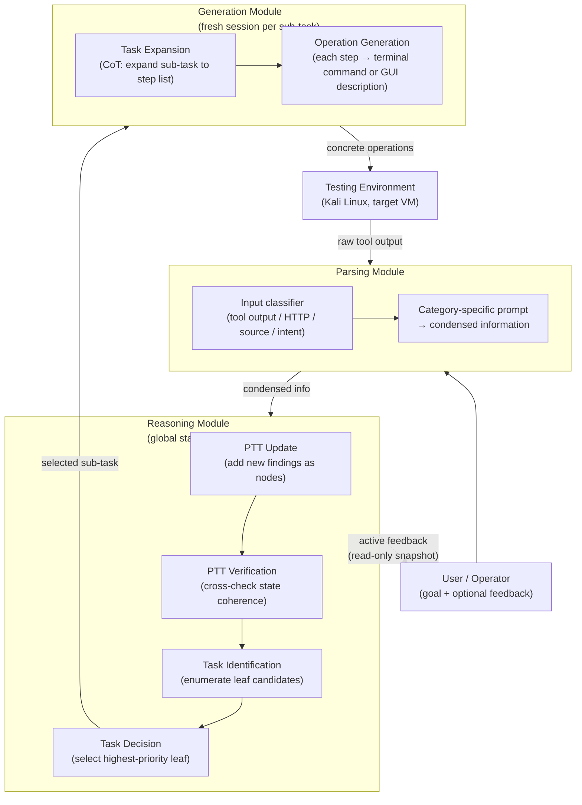
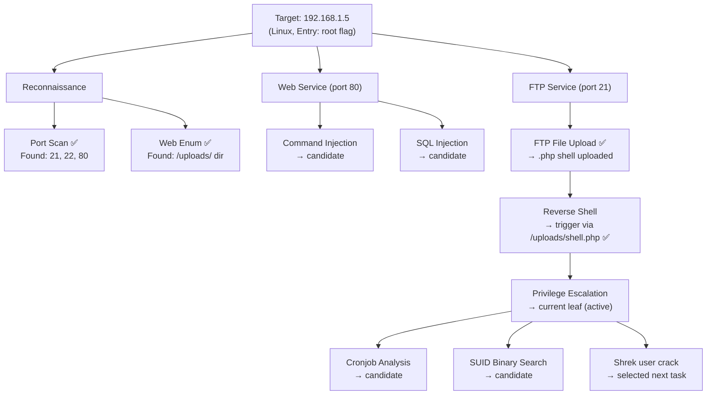
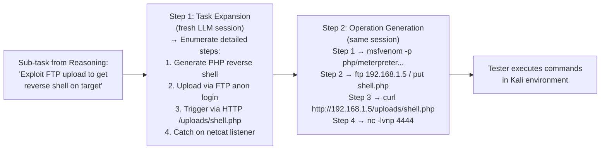
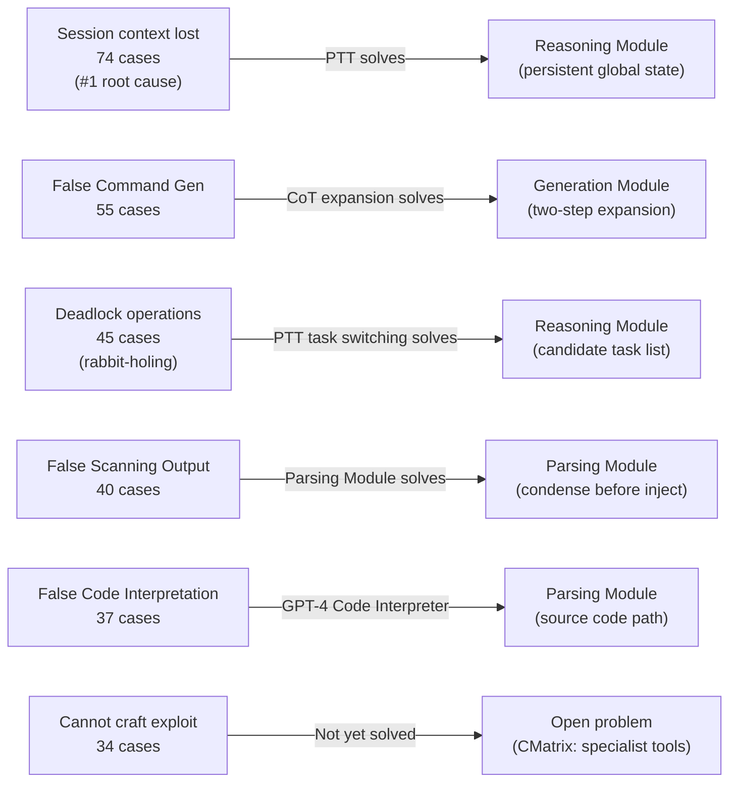

# PentestGPT: Evaluating and Harnessing Large Language Models for Automated Penetration Testing — Deep Survey Notes for CMatrix

| Field | Details |
|-------|---------|
| **Authors** | Gelei Deng, Yi Liu, Víctor Mayoral-Vilches, Peng Liu, Yuekang Li, Yuan Xu, Tianwei Zhang, Yang Liu, Martin Pinzger, Stefan Rass (Nanyang Technological University; Alias Robotics; AAU Klagenfurt; I²R A*STAR; UNSW; JKU Linz) |
| **Venue** | arXiv:2308.06782v2 [cs.SE], June 2024 |
| **Published** | 2024 (initial arXiv August 2023) |
| **Repository** | [GreyDGL/PentestGPT](https://github.com/GreyDGL/PentestGPT) — 6,200+ stars in 9 months |
| **Relevance** | ⭐⭐⭐⭐⭐ — Defines the three-module (Reasoning / Generation / Parsing) architecture and the Pentesting Task Tree (PTT) that directly maps to CMatrix's Planner → Team Manager → Specialist hierarchy; provides the largest quantitative failure-mode taxonomy of raw LLM penetration testing; introduces a 13-machine, 182-sub-task benchmark that CMatrix should adopt. |
| **Key Claim** | PentestGPT-GPT-4 improves sub-task completion by **228.6% over GPT-3.5** and **58.6% over GPT-4** alone; solves 5/10 active HackTheBox machines and ranks 24th/248 teams in picoMini CTF, costing $131.5 USD total for HackTheBox. The primary root cause of raw LLM failure is **context/session loss (74 occurrences)**, not tool inability. |

---

## 2. Core Thesis

PentestGPT is the field's first large-scale empirical study of raw LLM capabilities in penetration testing — and the first system deliberately designed around the failure modes that study exposes. The paper makes two major contributions that must be understood separately.

**Contribution 1 — The Exploratory Study:** Using a rigorous 13-machine, 182-sub-task benchmark across HackTheBox and VulnHub, the paper runs GPT-3.5, GPT-4, and Bard through interactive pen-testing loops and records every success, failure, and failure cause. The result is the field's most important quantitative failure taxonomy: session context loss (74 cases), false command generation (55), deadlock/looping (45), false scanning output interpretation (40), false code interpretation (37), and inability to craft exploit (34). This data is the empirical justification for CMatrix's entire architectural complexity.

**Contribution 2 — PentestGPT System:** The system addresses the top failure modes through a tripartite architecture. A **Reasoning Module** maintains a Pentesting Task Tree (PTT) — a persistent, structured representation of discovered attack surface, completed tasks, and candidate next steps — acting as a director who never loses global state. A **Generation Module** receives a single sub-task from the Reasoning Module, opens a fresh LLM session for that sub-task, and produces concrete commands via Chain-of-Thought expansion. A **Parsing Module** compresses verbose tool outputs and source code before they enter the context. These three modules communicate through structured task descriptions, not raw conversation history — this is what prevents context loss.

For CMatrix, this paper is **the single most directly applicable architecture paper**. The PTT is what CMatrix calls the "inter-state summary"; the Reasoning Module is the Team Manager; the Generation Module is the Specialist; the Parsing Module is the Reflection Filter. The mapping is nearly one-to-one, and PentestGPT's ablation results tell us exactly what happens if we remove each component.

---

## 3. How It Actually Works

### 3.1 Three-Module Architecture



> **Note:** The Reasoning Module's context is a **fixed token chunk** representing the PTT. It is never the rolling conversation history. When the user queries it for active feedback, a new session is opened with only the PTT chunk — the original session is never polluted.

### 3.2 Pentesting Task Tree (PTT)



> **Note:** Green nodes (✅) = completed. Blue nodes = generated but not yet executed. Red nodes = tried and failed. The PTT provides global context without injecting all conversation history into the LLM context window. This is the structural answer to the #1 failure mode: session context loss.

### 3.3 Generation Module — Chain-of-Thought Two-Step



> **Note:** Each sub-task gets a **fresh Generation Module session**. This prevents previous sub-task output from polluting the command generation context. The two-step CoT expansion before command generation directly addresses failure mode #5 (false command generation).

### 3.4 Failure Mode Taxonomy (from Exploratory Study)



---

## 4. Vulnerabilities Exploited

| Target | Difficulty | Vuln Classes | CWEs | Outcome |
|---|---|---|---|---|
| Sau (HTB) | Easy | SSRF + RCE chain | CWE-918, CWE-77 | 5/5 ✅ |
| Pilgramage (HTB) | Easy | ImageMagick CVE + LFI | CWE-20 | 3/5 ✅ |
| Topology (HTB) | Easy | LaTeX injection | CWE-77 | 0/5 ❌ |
| PC (HTB) | Easy | gRPC SQLi | CWE-89 | 4/5 ✅ |
| MonitorsTwo (HTB) | Easy | Cacti CVE + Docker escape | CWE-1395, CWE-284 | 3/5 ✅ |
| Agile (HTB) | Medium | Flask debug pin + secrets | CWE-200 | 2/5 ✅ |
| Authority/Sandworm/Jupiter/OnlyForYou (HTB) | Medium | Various AD/crypto | Multiple | 0/5 ❌ each |
| VulnHub Hackable II | Easy | FTP upload + reverse shell + privesc | CWE-434, CWE-284 | ✅ (strategy demo) |
| Benchmark machines (7 Easy) | Easy | All OWASP Top 10 | 18 CWEs | 6/7 ✅ (PentestGPT-GPT-4) |
| Benchmark machines (4 Medium) | Medium | All OWASP Top 10 | 18 CWEs | 2/4 ✅ (PentestGPT-GPT-4) |
| Benchmark machines (2 Hard) | Hard | Deep custom exploits | Various | 0/2 ❌ all variants |

> **Note:** Hard targets consistently fail across all variants including GPT-4. The failure mode is **exploit code construction** (requiring low-level bytecode manipulation, custom script modification, or image interpretation). This is the one failure mode PTT does not solve — CMatrix must use specialist tools (sqlmap, hydra, msfvenom templates) for this tier.

---

## 5. Benchmark Section

### PentestGPT Benchmark (13 Machines, 182 Sub-Tasks)

| Attribute | Details |
|---|---|
| **Benchmark Name** | PentestGPT Benchmark (also called PentestPerf in MALISM roadmap) |
| **Size** | 13 targets, 182 sub-tasks, 26 categories, 18 CWE items |
| **Source** | HackTheBox (post-2021 machines) + VulnHub |
| **Deployment** | Local private network (Kali Linux attacker); VMs for each target |
| **Success Oracle** | Sub-task completion (granular) + overall root flag capture |
| **Difficulty** | 7 Easy / 4 Medium / 2 Hard (OWASP Top 10 coverage) |
| **Validation** | 3 certified penetration testers independently wrote walkthroughs |
| **Training contamination guard** | All machines post-2021 (beyond GPT training cutoff); LLMs queried for prior knowledge of target |

### Raw LLM Performance (Exploratory Study)

| Model | Easy Overall (7) | Easy Sub-tasks (77) | Medium Overall (4) | Medium Sub-tasks (71) | Hard Overall (2) | Hard Sub-tasks (34) | Average Sub-task % |
|---|---|---|---|---|---|---|---|
| GPT-3.5 | 1/7 (14.3%) | 24/77 (31.2%) | 0/4 (0%) | 13/71 (18.3%) | 0/2 (0%) | 5/34 (14.7%) | 23.1% |
| GPT-4 | 4/7 (57.1%) | 55/77 (71.4%) | 1/4 (25%) | 30/71 (42.3%) | 0/2 (0%) | 10/34 (29.4%) | **52.2%** |
| Bard | 2/7 (28.6%) | 29/77 (37.7%) | 0/4 (0%) | 16/71 (22.5%) | 0/2 (0%) | 5/34 (14.7%) | 27.5% |

> **Note:** GPT-4 without any framework structure still completes 52.2% of sub-tasks but only solves 38.5% of targets overall. The 57% gap between sub-task completion and target completion quantifies exactly how much context loss costs: models succeed at individual steps but fail to chain them into full exploits.

### PentestGPT System Performance (RQ3)

| Variant | Easy Overall | Medium Overall | Hard Overall | Sub-task % | Improvement vs base |
|---|---|---|---|---|---|
| GPT-3.5 (raw) | 1/7 | 0/4 | 0/2 | 23.1% | baseline |
| GPT-4 (raw) | 4/7 | 1/4 | 0/2 | 52.2% | — |
| PentestGPT-GPT-3.5 | 2/7 | 0/4 | 0/2 | ~30% | +228.6% vs GPT-3.5 (sub-task) |
| **PentestGPT-GPT-4** | **6/7** | **2/4** | **0/2** | **~65%** | **+58.6% vs GPT-4 (sub-task)** |

### Ablation Study (RQ5)

| Variant | Sub-task % | Key finding |
|---|---|---|
| Full PentestGPT-GPT-4 | ~65% | Best |
| PentestGPT-no-Parsing | ~62% | Slight drop only; 32k covers most outputs |
| PentestGPT-no-Generation | ~54% | Modest drop; Generation mainly guides operations |
| **PentestGPT-no-Reasoning** | **~35%** | **Worst — below raw GPT-4; Generation sub-tasks pollute context** |

> **Note:** The most critical ablation result: removing the Reasoning Module (PTT) drops performance *below* raw GPT-4. The Generation Module alone without PTT structure actively *harms* performance by flooding the context with sub-task outputs. This is the single most important justification for CMatrix's FSM/state-machine approach over a simple generation loop.

### Real-World Evaluation (RQ6)

| Platform | Scope | Result | Cost |
|---|---|---|---|
| HackTheBox (10 active machines, 5 trials each) | 5 Easy + 5 Medium; post-2021 | 4 Easy + 1 Medium = 5/10 (50%); **17/50 trial success rate** | $131.5 USD total ($21.9/machine avg) |
| picoMini CTF (Carnegie Mellon / redpwn, 248 teams) | 21 challenges across web/crypto/binary/reverse/forensics | 9/21 solved; 1500 pts; **24th/248 teams** | $5.1 USD/attempt avg |

---

## 6. Key Takeaways for CMatrix

### 🔴 Critical

**1. PTT = CMatrix's Inter-State Summary (Already Implemented — Validate Structure)**
The Pentesting Task Tree is the paper's most important contribution. Its structure is: each node = an attack surface element or finding; each leaf = a candidate next task; node state ∈ {pending, in-progress, completed, failed}. The PTT is stored as a **fixed token chunk** separate from conversation history, injected fresh at the start of each Reasoning Module query. CMatrix must implement this as a structured JSON object (not prose) with:
```json
{
  "target": "192.168.1.5",
  "phases": {
    "recon": {"status": "completed", "findings": ["port 21", "port 80"]},
    "exploitation": {
      "ftp_upload": {"status": "completed", "finding": "/uploads/ accessible"},
      "reverse_shell": {"status": "active", "candidate_commands": [...]}
    },
    "privesc": {"status": "pending", "candidates": ["cronjob", "SUID"]}
  }
}
```
This JSON PTT is injected into every Team Manager prompt, replacing the need for full conversation history.

**2. Reasoning Module Isolation: Global Context Must Live in a Separate Session from Generation**
The ablation proves that mixing generation output into the reasoning context destroys performance (no-Reasoning drops below raw GPT-4). CMatrix must enforce: **Team Manager (Reasoning) = session A; Specialist (Generation) = session B (fresh per sub-task)**. Session B receives only: the PTT context + the specific sub-task. Session B's output (commands + results) feeds back to Session A only as a structured finding update — never as raw conversation.

**3. Fresh Session Per Sub-Task in Generation Module**
Each specialist invocation must use a fresh LLM context populated with: (1) the specific sub-task description, (2) relevant tool documentation, (3) environment context (OS, installed tools). No conversation history from previous sub-tasks. This is the mechanism that prevents context pollution and is already implied by CMatrix's specialist design — this paper provides the empirical justification.

**4. Two-Step CoT Expansion Before Command Generation**
The Generation Module does not go directly from sub-task → commands. It first expands the sub-task into a numbered step list (Step 1: generate payload; Step 2: deliver; Step 3: trigger; Step 4: catch), then translates each step to a concrete command. In CMatrix, every Specialist prompt must follow this pattern: `expand_to_steps(sub_task) → generate_command(step_i)`. This is what addresses false command generation (55 failure cases).

**5. Quantified Failure Mode Hierarchy for CMatrix QA**
The paper's failure taxonomy is CMatrix's QA gate specification. Every mission must track these counters:
- `context_loss_events`: PTT state divergence from actual execution state
- `false_command_rate`: commands that produce error/unexpected output
- `deadlock_events`: same resource targeted K consecutive times
- `false_output_parse_rate`: Parsing Module produces wrong finding from correct output
- `exploit_craft_failures`: Generation Module cannot produce working exploit (→ fallback to specialist tool)
These become the 6-failure-mode QA gate reported in observability metrics.

### 🟡 Important

**6. Parsing Module: Four Input Categories with Dedicated Prompts**
The Parsing Module handles exactly 4 input types, each with a separate prompt template: (1) user intent, (2) security tool output, (3) raw HTTP response, (4) source code. CMatrix's Reflection Filter must implement all four categories. For source code specifically, use GPT-4's code interpreter capability (or equivalent structured analysis). Do not use a single generic compression prompt — category-specific prompts are necessary for precision.

**7. Benchmark Adoption: 13 HackTheBox/VulnHub Machines + 182 Sub-Tasks**
CMatrix's evaluation suite should include the PentestGPT benchmark machines (post-2021 HTB machines: Sau, Pilgramage, PC, MonitorsTwo, Agile). This provides a stable, human-validated baseline with known sub-task decompositions, enabling direct comparison to PentestGPT-GPT-4's 65% sub-task completion rate. Add these to the CMatrix benchmark suite alongside Paper 01's 15 CVEs and Paper 02's 14 CVEs.

**8. Active Feedback: Read-Only PTT Snapshot for Operator Queries**
PentestGPT's "active feedback" feature opens a new session with only the PTT chunk to answer operator questions without modifying the reasoning context. CMatrix must implement this: the `/status` endpoint returns a PTT snapshot; operator `correct_finding` commands update the PTT JSON; neither action touches the active Team Manager session's conversation history.

**9. Depth-First Bias Correction via PTT Candidate List**
The paper's Finding 4 confirms the rabbit-hole pattern: LLMs depth-first bias means they pursue one service exhaustively. PentestGPT fixes this by having the Reasoning Module explicitly enumerate *all* candidate leaf tasks before selecting one. In CMatrix's Team Manager: after each specialist completes, the PTT is updated, then all leaf candidates are listed, scored by priority (severity × confidence × unexplored-surface-coverage), and the top candidate is selected. Never let the model implicitly pick the next task.

**10. Jailbreak as Necessary Infrastructure**
The paper explicitly acknowledges using jailbreak techniques (citing 7 papers) because OpenAI model alignment blocks exploitation content. CMatrix must maintain a jailbreak prompt library categorized by: framing (verification/audit framing as per Paper 09), role-play contexts (certified pentester in authorized test), and semantic substitutions. Monitor refusal rate as a first-class metric; high refusal rate triggers automatic prompt variant selection.

**11. Hard Target Failure Mode = Specialist Tool Fallback**
Hard targets fail because LLMs cannot construct low-level exploit code (bytecode manipulation, custom script modification). CMatrix's Specialist tier must have pre-built tool wrappers for these cases: `msfvenom` payload generation, `sqlmap` tamper scripts, `john` / `hashcat` for password cracking. The LLM's role at this level is to select parameters and interpret output, not construct exploit code from scratch.

### 🟢 Nice-to-Have

**12. Vector Database Limitations — Do Not Over-Rely on FAISS**
Section 5.7 explicitly warns: in practice, penetration testing tool outputs are similar enough that vector similarity retrieval returns confused results. FAISS/semantic memory is useful for vulnerability description RAG (Papers 01, 02) but should not be the primary context management mechanism for tool output storage. The PTT structure is more reliable for this domain.

**13. picoMini CTF as CMatrix Benchmark Component**
PentestGPT ranked 24th/248 in picoMini CTF. While primarily crypto/binary (not CMatrix's web focus), the web challenges (login, caas, notepad) provide LLM-solvable web CTF benchmarks with well-defined flag oracles. Add the 4 web-category challenges to CMatrix's CTF benchmark set.

**14. Cost Tracking: $21.9/machine as Reference Point**
PentestGPT-GPT-4 costs $21.9 USD per HackTheBox machine on average using the 32k context API. This is the baseline. CMatrix's per-mission cost accounting should target under $10/target through: cheaper models for Parsing/Generation (GPT-4o-mini), GPT-4o only for Reasoning Module PTT decisions, and aggressive Parsing compression before token consumption.

---

## 7. Cross-References

| This Paper's Concept | Connected Paper | Mechanism of Connection |
|---|---|---|
| PTT (Pentesting Task Tree) as global state | Paper 05 (AutoPT FSM) | Both use structured persistent state (PTT vs PSM states) to maintain global context across LLM calls. AutoPT uses FSM state transitions; PentestGPT uses tree node status updates. CMatrix merges both: FSM controls phase transitions, PTT tracks findings within each phase. |
| Three-module architecture (Reason/Generate/Parse) | Paper 02 (Teams of LLM) | Paper 02's team structure (Leader + Specialists + Summarizer) maps to PentestGPT's three modules. The Summarizer = Parsing Module; Leader = Reasoning Module; Specialists = Generation Module. CMatrix combines both: Paper 02 provides the multi-agent orchestration, Paper 10 provides the within-mission context management. |
| Fresh session per sub-task | Paper 03 (Multi-Agent Pentest) | Paper 03 uses per-agent context isolation via separate Docker processes. Paper 10 uses per-sub-task fresh LLM sessions. CMatrix combines: Docker isolation for execution + fresh session per Specialist invocation. |
| Failure mode taxonomy (74 context-loss cases) | Paper 09 (Getting Pwnd) | Paper 09 identifies rabbit-holing and context pollution as failure modes via qualitative observation. Paper 10 provides quantitative counts across 13 targets, 3 models, giving CMatrix the magnitude of each failure mode to prioritize mitigation. |
| Parsing Module / tool output compression | Paper 09 (Getting Pwnd) Section 5.3 | Paper 09 proposes "reflected memory" (compress output before injection). Paper 10 implements this as the Parsing Module with 4 input categories. CMatrix implements both: Paper 10's category-specific prompts + Paper 09's structured finding JSON output format. |
| Depth-first bias correction via candidate enumeration | Paper 04 (AWE) | AWE's Thompson Sampling bandit selects among prompt strategies; PentestGPT's PTT leaf candidate list selects among attack surface nodes. Both address the same problem (LLM over-commits to one path). CMatrix uses both: PTT for attack surface diversity + Thompson Sampling for prompt strategy diversity. |
| Jailbreak prompt library | Paper 07 (PrediQL) | PrediQL's prompt variation (operator, user, developer context framing) is the same semantic reframing approach as PentestGPT's jailbreak techniques. CMatrix maintains a unified prompt variant library covering both security bypass framing (Paper 10) and role-context framing (Paper 07). |
