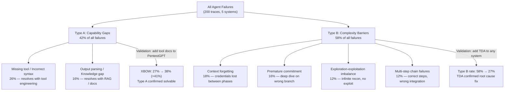
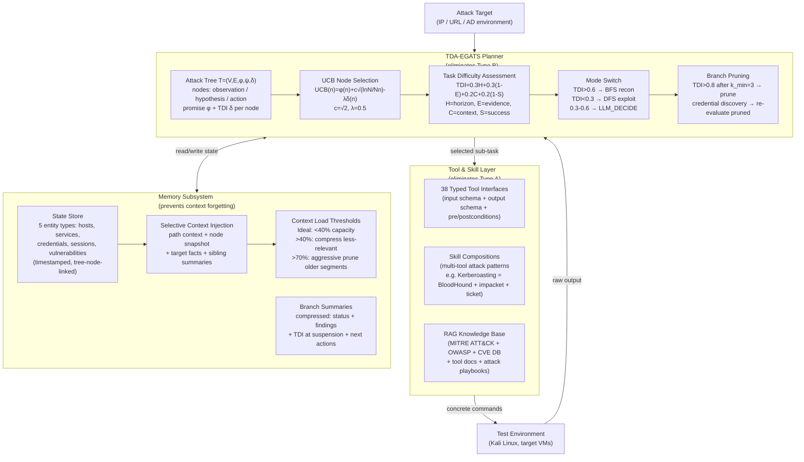
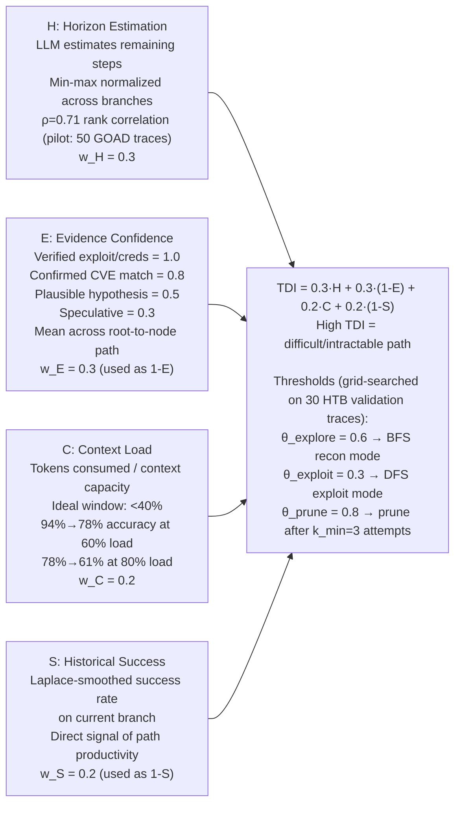
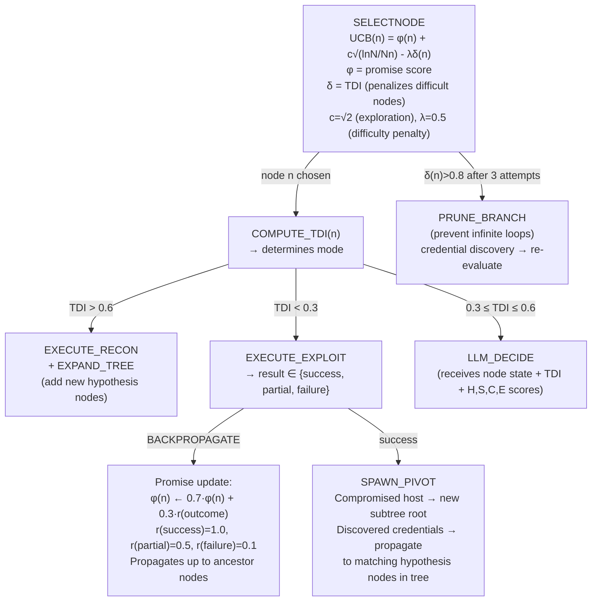

# What Makes a Good LLM Agent for Real-World Penetration Testing? — Deep Survey Notes for CMatrix

| Field | Details |
|-------|---------|
| **Authors** | Gelei Deng, Yi Liu, Yuekang Li, Ruozhao Yang, Xiaofei Xie, Jie Zhang, Han Qiu, Tianwei Zhang (NTU; UNSW; SMU; A*STAR; Tsinghua) |
| **Venue** | arXiv:2308.06782v2 followup — PENTESTGPT v2 paper (2025) |
| **Published** | 2025 |
| **Repository** | Anonymous during review — Excalibur artifacts (GitHub release pending) |
| **Relevance** | ⭐⭐⭐⭐⭐ — The field's most rigorous failure-mode taxonomy (28 systems, 200 traces, Type A/B partitioning); introduces TDA (Task Difficulty Index with 4 measurable dimensions) + EGATS (MCTS-based attack tree search with UCB selection and evidence-backpropagation) that directly supersede CMatrix's PTT and naive FSM; 91% XBOW, 12/13 HTB, 4/5 GOAD AD hosts; top 100/8,036 in live HTB Season 8 competition. |
| **Key Claim** | PENTESTGPT v2 achieves **91% task completion on XBOW** (49% relative improvement over best baseline at 61%) and **4/5 GOAD hosts** (vs. 2/5 for prior systems), with the improvement driven entirely by difficulty-aware planning (TDA-EGATS) and external state management (Memory Subsystem). Augmenting agents with TDA alone reduces Type B failure rate from **58% to 27%**. |

---

## 2. Core Thesis

This paper is the field's most sophisticated architectural analysis of LLM penetration testing agents. It starts from a provocative observation: despite two years of architectural innovation, performance differences between five representative systems (PentestGPT, AutoPT, PentestAgent, VulnBot, Cochise) **collapse by more than half** when moving from GPT-4.0 to GPT-5. This "convergence under scale" effect reveals that most existing innovations are compensating for *transient* model limitations (small context windows, weak tool use, poor domain knowledge) rather than solving *persistent* task challenges (long-horizon planning, exploration-exploitation decisions, cross-phase state management).

The paper partitions all agent failures into two distinct categories via analysis of 200 execution traces: **Type A (capability gaps)** — missing tools or wrong syntax, addressable through engineering; and **Type B (complexity barriers)** — context forgetting, premature commitment, and exploration-exploitation imbalance that persist regardless of tooling. The key finding: Type B failures share a single root cause that is largely LLM-invariant — **agents cannot assess task difficulty in real time**. Without knowing whether a current path requires 3 or 30 more steps, agents commit too early, abandon too late, or flood their context with irrelevant history.

For CMatrix, this paper is both a **critique and a blueprint**. It critiques PTT-style task trees (Paper 10) as insufficient — they provide structure but no difficulty metrics to guide search. It then builds PENTESTGPT v2 (internally called Excalibur) around a 4-dimensional Task Difficulty Index (TDI) integrated into MCTS-style Evidence-Guided Attack Tree Search (EGATS), plus a hybrid Memory Subsystem with selective context injection. The ablation results tell CMatrix exactly how much each component contributes: Tool Layer (+14pp on XBOW), TDA-EGATS (+9pp XBOW, +15pp HTB, +20pp GOAD), Memory (+8pp XBOW, +20pp GOAD). CMatrix must implement all three.

---

## 3. How It Actually Works

### 3.1 Two-Failure-Mode Taxonomy



> **Note:** At task depth ≤ 2 steps, Type A failures dominate (72%). At task depth ≥ 9 steps, Type B failures dominate (85%). The crossover is at ~5 steps. CMatrix specialists that are 5+ steps long must implement TDA or they will exhibit Type B failures.

### 3.2 PENTESTGPT v2 Full Architecture



### 3.3 Task Difficulty Index (TDI) — Concrete Formula



### 3.4 EGATS UCB Selection and Evidence Backpropagation



### 3.5 HTB Falafel Case Study — TDA Backtrack vs. PTT Tunnel-Vision

```mermaid
flowchart TD
    subgraph PTT["PentestGPT PTT: Commits to Hash Cracking"]
        P1["Enum: error msg leak → user discovery"]
        P2["SQLi: extract password hashes"]
        P3["Hash format: 0e462... (MD5)"]
        P4["Hashcat attempt 1 → fail"]
        P5["Hashcat attempt 25 → fail"]
        P6["Hashcat attempt 47 → context degraded\nType juggling vector never considered\nSTUCK"]
        P1 --> P2 --> P3 --> P4 --> P5 --> P6
    end

    subgraph EGATS["PENTESTGPT v2 EGATS: TDI Triggers Backtrack"]
        E1["Enum: same findings"]
        E2["SQLi + hash extraction"]
        E3["Brute-force attempt → TDI rising\n(S dropping with each failure)"]
        E4["TDI=0.7 > θ_explore → BACKTRACK\nExplore auth alternatives"]
        E5["RAG: '0e' prefix → PHP type juggling docs"]
        E6["Auth bypass: '240610708' MD5=0e...\n= scientific notation == 0 ✅"]
        E7["Filename truncation: 232xA.php.png → .php\nReverse shell ✅"]
        E8["Privesc chain: www-data→moshe→yossi→root\n(Memory persists creds at each step) ✅"]
        E1 --> E2 --> E3 --> E4 --> E5 --> E6 --> E7 --> E8
    end
```



---

## 4. Vulnerabilities Exploited

| Target | Difficulty | Attack Chain | Outcome |
|---|---|---|---|
| HTB Falafel | Hard | SQLi hash extract → PHP type juggling auth bypass → filename truncation RCE → video group framebuffer → disk group debugfs privesc | ✅ PENTESTGPT v2 only |
| HTB PlayerTwo | Hard | Custom Protobuf game protocol fuzzing | ❌ All systems — novel protocol, no RAG docs |
| GOAD: 4/5 hosts | AD Enterprise | Kerberoasting → NTLM relay → credential chaining → lateral movement → domain escalation | ✅ 4 hosts (5th: PrintNightmare→DCSync, token limit) |
| XBOW 104 tasks | CTF Web | SQLi, XSS, auth bypass, file inclusion | 91% (94/104) with Opus 4.5 thinking |
| HTB Season 8 (live) | Easy/Med/Hard | Real CVEs, no public walkthroughs | 10/13 (100% Easy+Med, 67% Hard, 0% Insane) |
| HTB PentestGPT Benchmark | Easy-Hard | All OWASP Top 10 | 12/13 machines (all except PlayerTwo) |

> **Note:** The PlayerTwo failure and Insane machine failures are the paper's defined **creativity barrier**: TDA-EGATS cannot distinguish "difficult but tractable" from "novel requiring invention." Both present as high TDI. CMatrix must flag these as requiring human operator escalation.

---

## 5. Benchmark Section

### XBOW (104 CTF Web Challenges)

| Attribute | Details |
|---|---|
| **Source** | XBOW AI-Powered Offensive Security Platform (xbow.com) |
| **Size** | 104 web security tasks: SQLi, XSS, auth bypass, file inclusion |
| **Horizon** | 1-3 exploitation steps (Type A dominant benchmark) |
| **Oracle** | Task completion (binary) |
| **Best result** | PENTESTGPT v2: 91% (μ=89%, σ=2.1%) with Opus 4.5 thinking |
| **Best baseline** | PentestAgent: 61% (μ=59%, σ=1.8%) with Opus 4.5 thinking |

### Performance Comparison Table (Key Models)

| System | XBOW GPT-5.2 (-) | XBOW Opus 4.5 (T) | HTB-Bench GPT-5.2 (T) | HTB-Bench Opus 4.5 (T) | GOAD GPT-5.2 (T) | GOAD Opus 4.5 (T) |
|---|---|---|---|---|---|---|
| PentestGPT | 45% | 54% | 8/13 | 7/13 | 1/5 | 2/5 |
| AutoPT | 43% | 51% | 7/13 | 8/13 | 1/5 | 1/5 |
| PentestAgent | 52% | 60% | 9/13 | 9/13 | 2/5 | 2/5 |
| VulnBot | 48% | 58% | 9/13 | 9/13 | 2/5 | 2/5 |
| **PENTESTGPT v2** | **76%** | **91%** | **12/13** | **12/13** | **4/5** | **4/5** |

> **Note:** The architecture gap does not close with model scale — PENTESTGPT v2 leads by +30pp on XBOW and doubles GOAD hosts even with the same frontier models as baselines.

### Ablation (GPT-5.2 Thinking Mode)

| Configuration | XBOW | HTB-Bench | GOAD |
|---|---|---|---|
| Base (reactive + sliding window) | 54% | 8/13 | 2/5 |
| + Tool Layer | 68% (+14pp) | 9/13 | 2/5 (no change) |
| + TDA-EGATS | 77% (+9pp) | 11/13 (+2) | 3/5 (+1) |
| **+ Memory (Full)** | **85% (+8pp)** | **12/13 (+1)** | **4/5 (+1)** |

> **Note:** Tool Layer gives zero GOAD improvement — GOAD is purely Type B dominated. TDA-EGATS is the only component that improves GOAD hosts. Memory is required for the 4th GOAD host (credential chain persistence across phases). All three components are independently necessary.

### Cost Analysis (GPT-5.2 Thinking, Median)

| Benchmark | LLM Calls | Time | Cost | Per-Success Cost vs Baselines |
|---|---|---|---|---|
| XBOW | 12 | 3.2 min | $0.18 | 1.8× more cost-efficient |
| HTB-Benchmark | 87 | 42 min | $4.20 | ~same total, more machines |
| GOAD (5-host) | 234 | 186 min | $28.50 | 1.7× more cost-efficient |

> **Note:** PENTESTGPT v2 uses 23% fewer LLM calls on XBOW than baselines (12 vs. 15.6) despite higher success — structured tool interfaces eliminate trial-and-error loops.

### HTB Season 8 Live Deployment (2025)

| Difficulty | Completed | Total | Rate |
|---|---|---|---|
| Easy | 4 | 4 | 100% |
| Medium | 4 | 4 | 100% |
| Hard | 2 | 3 | 67% |
| Insane | 0 | 2 | 0% |
| **Total** | **10** | **13** | **76.9%** |

> **Note:** Global rank: top 100 / 8,036 active participants. This is live competition performance on machines with no public walkthroughs — the strongest real-world validation in the survey.

---

## 6. Key Takeaways for CMatrix

### 🔴 Critical

**1. Replace PTT with EGATS Attack Tree (TDI-Guided MCTS)**
CMatrix's current inter-state summary (PTT-style JSON, from Paper 10) provides structure but no difficulty guidance. Upgrade to EGATS:
- Each node stores: `(promise_φ, tdi_δ, status, findings, evidence_confidence, horizon_estimate, success_rate, context_load)`
- Node selection uses UCB: `UCB(n) = φ(n) + √2·√(ln(N)/N_n) - 0.5·δ(n)`
- After every tool call, backpropagate promise: `φ(n) ← 0.7·φ(n) + 0.3·r(outcome)` where r(success)=1.0, r(partial)=0.5, r(failure)=0.1
- Prune branches with TDI > 0.8 after 3 attempts; re-evaluate when new credentials discovered

**2. Implement TDA with All Four Dimensions (Concrete Formula)**
Every specialist call must compute TDI before executing:
```python
TDI = 0.3 * H_normalized + 0.3 * (1 - E_mean) + 0.2 * C_fraction + 0.2 * (1 - S_laplace)
# H: LLM-estimated remaining steps, min-max normalized across active branches
# E: mean evidence confidence score along path (verified=1.0, confirmed=0.8, plausible=0.5, speculative=0.3)
# C: tokens_consumed / context_capacity (ideal window: keep below 0.4)
# S: Laplace-smoothed success rate on current branch

if TDI > 0.6: execute_recon(n)        # BFS mode
elif TDI < 0.3: execute_exploit(n)     # DFS mode
else: llm_decide(n, TDI, H, E, C, S)  # LLM selects with full signals
```

**3. External State Store for Five Entity Types (Not In-Context)**
Replace all in-context credential/finding tracking with a persistent State Store:
- 5 entity types: `hosts`, `services`, `credentials`, `sessions`, `vulnerabilities`
- Each entry: `{id, value, discovery_time, discovery_node_in_tree, confidence, status}`
- Credentials discovered at any node are **automatically cross-linked** to hypothesis nodes with matching preconditions
- This is the mechanism that enables GOAD's 4th host compromise — credential chains persist across phase boundaries

**4. Context Load as a First-Class Metric (40% Ideal Window)**
The paper measures LLM accuracy degradation empirically: 94%→78% at 60% context load, 78%→61% at 80%. CMatrix must track context utilization per session and trigger compression before the 40% threshold:
- `0-40%`: full injection
- `40-70%`: compress less-relevant sibling summaries
- `70%+`: aggressive pruning of older path segments while preserving findings
Never let a specialist session exceed 70% context load without forced summarization.

**5. Type A Failure Elimination via 38 Typed Tool Interfaces**
Implement a Tool Layer with typed interfaces for every tool in CMatrix's arsenal:
```python
class NmapTool(TypedToolInterface):
    input_schema: {"target": str, "ports": Optional[str], "flags": List[str]}
    output_schema: {"open_ports": List[Port], "services": List[Service], "os_guess": Optional[str]}
    preconditions: ["target_reachable"]
    postconditions: ["port_inventory_updated"]
    validation: lambda args: validate_ip_or_host(args["target"])
```
Input validation catches malformed calls before execution. Output schema means no regex parsing — structured extraction only. This alone eliminates 26% of all observed failures (missing tool / incorrect syntax).

### 🟡 Important

**6. Skill Compositions for Multi-Tool Attack Patterns**
Beyond individual tools, create Skill objects that encode expert attack chains:
- `KerberoastingSkill`: BloodHound enum → identify SPNs → impacket GetUserSPNs → hashcat → credential propagation
- `SQLiExtractionSkill`: sqlmap column enum → targeted dump → credential extraction → State Store write
- `PrivEscSkill`: LinPEAS → find top candidates → attempt ordered by success rate
Fallback logic: when preferred tool fails, automatically try alternatives encoded in the Skill definition.

**7. Branch Diversity Metric as Search Quality Indicator**
The paper's strategy analysis (Table 7) shows: PentestGPT explores 3.2 branches/machine, PENTESTGPT v2 explores 7.8. Backtrack rate: 8% vs. 34%. Average depth before pivot: 12.4 vs. 5.1 steps. CMatrix should track these metrics per mission:
- If `branches_explored < 4` and `backtrack_rate < 15%`, the FSM is exhibiting PTT-style tunnel vision → increase `λ` in UCB formula
- Target: 6-8 branches explored per target, backtrack rate 25-40%

**8. Thinking Mode as Architectural Complement (Not Replacement)**
Thinking mode (Claude/GPT extended reasoning) provides 6-10pp improvement across all systems, but does NOT close the architectural gap. PENTESTGPT v2 with thinking still beats baselines with thinking by 30pp. CMatrix should use thinking mode for the Team Manager (TDA/UCB selection decisions) and standard mode for Specialist command generation — thinking mode's value is in planning decisions, not in command synthesis.

**9. Creativity Barrier → Human Escalation Protocol**
When TDA-EGATS prunes a branch due to high TDI and no alternative branches remain (all pruned or completed), this is CMatrix's signal for human escalation. Do not loop indefinitely. The protocol:
1. TDI > 0.8 on all remaining branches after k_min attempts → `ESCALATE_TO_OPERATOR`
2. Report: current PTT state, all pruned branches with TDI history, last 5 tool calls
3. Human provides one of: new tool/technique hint, credential bypass, or manual exploitation step
4. Resume EGATS from new node added by operator

**10. Real-World Benchmark: HTB Season Machines**
HTB Season 8 provides 13 post-2025 machines with live competition validation. CMatrix's benchmark suite should include at least 5 HTB Season machines (Easy/Medium difficulty range) as real-world validation cases. The 76.9% solve rate with top-100 ranking provides the reference point. Add Season 8 machines Sau, Pilgramage, PC, MonitorsTwo (Easy/Medium successes) if they overlap with accessible targets.

### 🟢 Nice-to-Have

**11. Adversarial Environment Hardening**
The paper's adversarial barrier: honeypots and canary tokens can poison the agent's state representation. CMatrix defense: implement confidence decay for findings from services that exhibit unusual characteristics (too-easy vulnerabilities, anomalous response patterns). Flag honeypot-suspect nodes with reduced evidence confidence (E=0.2) and require secondary confirmation before executing exploitation.

**12. Cross-Session Continuity via Persistent State Store**
The temporal scale barrier: EGATS improves within-session planning but not cross-session continuity (multi-week engagements). CMatrix's State Store already provides entity persistence. Extend it to support session versioning: each State Store snapshot is timestamped and labeled by mission phase. When resuming a mission, the previous State Store snapshot becomes the initial context — no restarting from scratch.

**13. Architecture Convergence is Confirmation of CMatrix's Philosophy**
Finding 1 (architecture gaps compress with model scale) is simultaneously a warning and a validation. CMatrix's design principle — use cheap models for Type A tasks (Generation/Parsing) and reserve expensive models for Type B decisions (TDA, UCB) — is correct. As models improve, the cheap tier gets cheaper while the expensive tier handles increasingly complex Type B decisions. CMatrix's value should concentrate in TDA-EGATS and Memory, not in prompt engineering or tool wrappers.

---

## 7. Cross-References

| This Paper's Concept | Connected Paper | Mechanism of Connection |
|---|---|---|
| PTT critique (structure without difficulty) → EGATS upgrade | Paper 10 (PentestGPT v1) | Paper 11 is explicitly the successor to Paper 10. PTT provides structure but no TDI; EGATS adds UCB + TDI + evidence backpropagation. CMatrix implements EGATS over PTT JSON structure. |
| Type A failures = capability gaps (tool interfaces, RAG) | Paper 08 (RESTler) + Paper 07 (PrediQL) | RESTler's typed API interfaces and PrediQL's structured GraphQL tool wrappers are exactly the typed tool interface pattern that Paper 11 generalizes to 38 security tools. CMatrix's existing tool wrappers are Type A failure mitigations. |
| Type B failures = FSM doesn't assess difficulty | Paper 05 (AutoPT PSM) | AutoPT's PSM is explicitly called out: it enforces phase transitions but does not assess path complexity. PSM = good Type A structure, zero Type B mitigation. EGATS is the Type B answer that PSM needs. CMatrix fuses both: PSM for phase-level control, EGATS for within-phase branch navigation. |
| Context load tracking (40% ideal window) | Paper 09 (Getting Pwnd) + Paper 10 (PentestGPT) | Paper 09 proposed reflected memory; Paper 10 implemented Parsing Module; Paper 11 adds empirical context-load thresholds (94%→78%→61% accuracy degradation) and automated compression triggers. CMatrix's Reflection Filter now has a quantified threshold to trigger. |
| Credential cross-propagation in attack tree | Paper 02 (Teams of LLM) | Paper 02's Team Manager synthesizes results across agent runs; Paper 11 formalizes this as credential propagation in the State Store — discovered creds auto-propagate to hypothesis nodes with matching preconditions. Same mechanism, now triggered algorithmically by EGATS. |
| Historical success rate (S) as branch signal | Paper 05 (AutoPT) | AutoPT's retry threshold (N failures → next candidate) is the discrete version of Paper 11's Laplace-smoothed success rate S in TDI. EGATS generalizes the hard threshold to a continuous signal that degrades promise scores smoothly. |
| MCTS (UCB) adapted to penetration testing | Paper 14 (LLM + Classical Planning) — future | Paper 11 uses MCTS-style UCB selection for attack tree search. Classical planning papers (expected in Paper 14) may provide complementary formal planning guarantees. CMatrix should use EGATS as the execution-layer search, with ATT&CK-seeded formal planning at the Planner level. |
