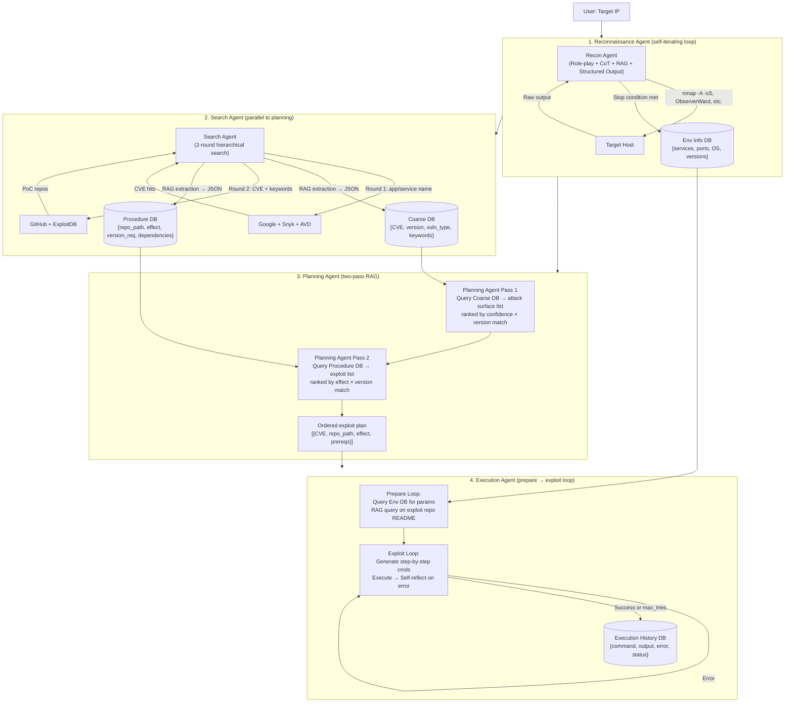
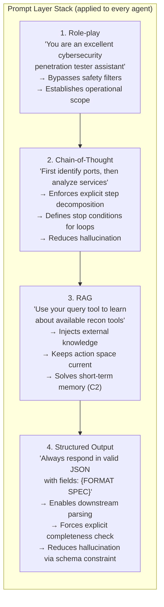
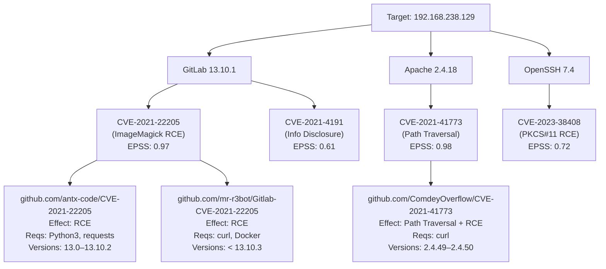
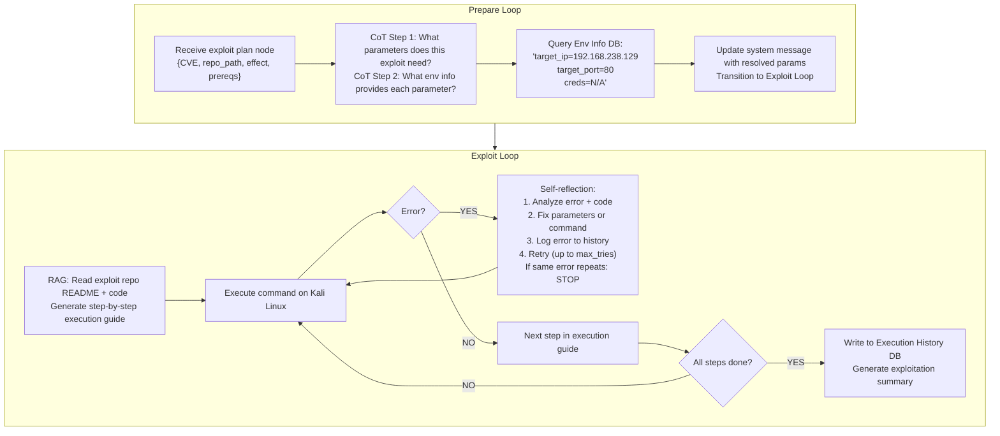

# PentestAgent: Incorporating LLM Agents to Automated Penetration Testing — Deep Survey Notes for CMatrix

| Field | Details |
|-------|---------|
| **Authors** | Xiangmin Shen*, Lingzhi Wang* (Northwestern University), Zhenyuan Li, Jiashui Wang, Wei Ruan (Zhejiang University), Yan Chen (Northwestern University), Wencheng Zhao, Dawei Sun (Ant Group) — *equal contribution |
| **Venue** | ASIA CCS '25, August 25–29, 2025, Hanoi, Vietnam; arXiv:2411.05185v3 |
| **Published** | May 2025 (ACM, DOI: 10.1145/3708821.3733882) |
| **Repository** | https://github.com/nbshenxm/pentest-agent |
| **Relevance** | ⭐⭐⭐⭐☆ — PentestAgent introduces a hierarchical two-tier RAG knowledge base (coarse attack surfaces → procedure-level exploits), a live online search agent that keeps knowledge current, and a structured four-prompt technique discipline (Role-play + CoT + RAG + Structured Output) that directly shapes CMatrix's specialist prompt engineering and knowledge pipeline design. |
| **Key Claim** | GPT-4-backed PentestAgent achieves **74.2% overall success rate** on 67 VulHub CVE targets (vs. PentestGPT on VulHub: 10% I.G., 10% V.A., 30% E.); on HackTheBox, completes 6/11 machines fully (vs. PentestGPT's 3/11); intelligence gathering is 3× faster (213s vs. 659s). |

---

## 2. Core Thesis

PentestAgent's central diagnosis is that every existing LLM pentest framework has **two unavoidable gaps**: (1) LLM training data is static and lacks deep CVE/exploit knowledge — so the agent can't autonomously figure out that a target running ActiveMQ 5.17.3 is vulnerable to CVE-2023-46604 without manual research; and (2) automation is incomplete — systems like PentestGPT still require human copy-paste at every decision point, meaning "automated" is a misnomer. The solution is a **specialist pipeline with an autonomous Search Agent** that continuously queries live external sources (Google, Snyk, ExploitDB, GitHub) to build a two-tier knowledge base before the exploit loop begins, plus a **four-technique prompt discipline** applied consistently to every agent role.

For CMatrix, the most transferable insight is the **hierarchical knowledge database structure**: coarse-grained (target → CVE mapping, attack surface list) separated from procedure-level (CVE → specific exploit repos + prerequisites). This two-tier separation prevents the Planner from being overwhelmed by exploit details before it has confirmed the attack surface, and allows the Execution agent to work from precise, version-matched PoC instructions rather than generic LLM knowledge.

The paper also provides the strongest evidence yet that **full-pipeline automation outperforms human-in-the-loop at both accuracy and speed**. PentestAgent fully autonomous beats PentestGPT + human expert on VulHub (I.G.: 80% vs 10%, V.A.: 100% vs 10%, E.: 70% vs 30%) and completes exploitation 4.8× faster (59s vs 284s). The human slows down the loop.

---

## 3. How It Actually Works

### 3.1 System Architecture Overview

PentestAgent has **four specialist agents** operating in a strict sequential pipeline with three shared databases:



> **Key design choice:** The Search Agent runs **before** exploitation, not reactively during it. This means the Execution Agent always works from pre-validated, version-matched exploit knowledge — not from on-the-fly LLM hallucination about how an exploit works.

---

### 3.2 The Four-Technique Prompt Discipline

Every agent in PentestAgent applies the **same four LLM techniques** in a consistent layered structure. This is the most portable concept from the paper:



The four techniques map exactly to the three challenges identified:
- C1 (Limited Knowledge) → RAG (live search + knowledge base)
- C2 (Short-term Memory) → RAG (persistent DB) + CoT (explicit stop condition)
- C3.1 (Output Quality) → CoT + Role-play + Structured Output
- C3.2 (Stateful Memory) → RAG (all DBs queryable by any agent)

---

### 3.3 Hierarchical Knowledge Database — Two-Tier RAG

The Search Agent builds a **tree-structured knowledge base** rather than a flat vector store:



**Search workflow — two rounds:**

**Round 1 (Attack Surface discovery):**
- Query: `{app_name} {version} CVE`
- Sources: Google, Snyk, Alibaba Cloud Vulnerability Database (AVD)
- RAG extraction prompt: *"Does this document describe vulnerabilities for {app}? What CVE numbers, version ranges, and further search keywords?"*
- Output: JSON `{cve_id, version_range, vuln_type, search_keywords, confidence}`

**Round 2 (Exploit Procedure discovery):**
- Query: `{cve_id} exploit github` (using keywords from Round 1)
- Sources: Google, GitHub, ExploitDB
- RAG extraction prompt: *"Does this repo contain an exploit for {CVE}? What effect (RCE/bypass/etc.), version requirements, and runtime dependencies?"*
- Output: JSON `{repo_path, effect, applicable_versions, requirements, confidence}`

**EPSS-based target selection:** When a service has multiple CVEs, select the one with the highest EPSS score (probability of real-world exploitation) — not the highest CVSS severity. EPSS mean in the benchmark: **79.58**, median: **97.19**.

---

### 3.4 Execution Agent — Prepare→Exploit Loop with Self-Reflection



**Hallucination mitigation strategies:**
1. **Temperature = 0** — deterministic outputs across all agents
2. **Multi-execution** — attempt exploit up to N times before marking failure
3. **Stop conditions** — hard limit on attempts; "stop when you see the same error twice"
4. **Exploit fallbacks** — Procedure DB contains multiple repos per CVE; fallback to next repo on failure
5. **Few-shot versioning** — explicit examples of `x.y.z` format injected to prevent version-string hallucination

---

### 3.5 Concrete Prompt Examples (from Appendix)

**Reconnaissance System Message structure:**
```
Role-play: "You're an excellent cybersecurity penetration tester assistant..."
CoT: "Use Nmap to identify exposed ports, then use relevant tools to analyze..."
RAG: "You should use your query tool to learn about available reconnaissance tools"
Structured Output: "Always respond in valid JSON with fields: {next_command, reasoning, stop}"
```

**Attack Surface Suggestion Prompt:**
```
List all vulnerabilities ranked by confidence for {app} {version}.
Include: CVE ID, vuln type, applicable versions, confidence reason.
Check: is {version} within applicable range?
Output: valid JSON {cve_id, vuln_type, version_range, confidence, reasoning}
```

**Exploit Selection Prompt:**
```
List all exploit repos ranked by confidence applicable to {app} {version}.
Include: repo path, effect, version requirements, confidence reason.
Check: is {version} in applicable range AND does effect match target?
Output: valid JSON {repo_path, effect, version_req, confidence, reasoning}
```

---

## 4. Vulnerabilities Exploited

PentestAgent targets a broad range of CVEs. Key examples from the HackTheBox evaluation:

| Machine | CVE | Vulnerability Type | Effect | Difficulty |
|---------|-----|-------------------|--------|------------|
| Blue | CVE-2017-0144 | EternalBlue (SMB RCE) | RCE | Easy |
| Legacy | CVE-2008-4250 | MS08-067 (SMB RCE) | RCE | Easy |
| Lame | CVE-2007-2447 | Samba usermap_script | RCE | Easy |
| Topology | — | LaTeX injection | File read | Easy |
| Shocker | CVE-2014-6271 | Shellshock | RCE | Easy |
| Optimum | CVE-2014-6287 | HFS RCE | RCE | Easy |
| PC | CVE-2023-0297 | — | gRPC exploit | Easy |
| Stratosphere | CVE-2017-5638 | Apache Struts RCE | RCE | Medium |
| Reel | CVE-2017-0199 | RTF malicious doc | Initial Access | Hard |
| Sau | — | SSRF → Maltrail RCE | RCE | Easy |

VulHub benchmark coverage: **32 CWE categories**, **8 OWASP Top 10 risks**, 50 easy + 11 medium + 6 hard targets.

---

## 5. Benchmark Section

### PentestAgent Benchmark (VulHub + HackTheBox)

| Property | Value |
|----------|-------|
| **Name** | PentestAgent Benchmark |
| **Source** | VulHub (Docker CVE envs) + HackTheBox CTF |
| **Size** | 67 VulHub targets + 11 HackTheBox machines |
| **VulHub CWE Coverage** | 32 CWE categories, 8 OWASP Top 10 risks |
| **Difficulty** | Easy (50 VulHub) / Medium (11) / Hard (6) + 9 Easy / 1 Med / 1 Hard HTB |
| **Target selection** | EPSS score (highest = most realistic); mean EPSS=79.58, median=97.19 |
| **Deployment** | Docker containers on Ubuntu 22.04 VM (2 CPU, 8 GB RAM); Kali Linux attacker (16 CPU, 16 GB RAM) |
| **Oracle** | Stage completion: I.G. = target app identified; V.A. = functional exploit identified (manually verified); E. = successful exploit execution |

**Overall Effectiveness (VulHub, 67 targets):**

| Model | Easy | Medium | Hard | **Overall** |
|-------|------|--------|------|------------|
| **GPT-4o** | ~82% (est.) | ~64% (est.) | ~38% (est.) | **74.2%** |
| GPT-3.5-turbo | ~76% (est.) | ~46% (est.) | 0% | **60.6%** |

> **Note:** GPT-3.5 achieves 0% on hard tasks; GPT-4 manages ~38% — hard task failures are primarily intelligence gathering failures, not exploitation failures.

**Stage Completion Rates:**

| Stage | GPT-4 (Easy) | GPT-4 (Medium) | GPT-4 (Hard) | GPT-3.5 (Easy) | GPT-3.5 (Medium) | GPT-3.5 (Hard) |
|-------|-------------|---------------|-------------|---------------|-----------------|----------------|
| **I.G.** | **100%** | **100%** | 50% | 92% | 66.7% | 0% |
| **V.A.** | **100%** | ~80% | **100%** | **96%** | **100%** | 50% |
| **E.** | ~81.8% | ~80% | ~75% | 72% | 50% | 0% |

> **Note:** Vulnerability analysis (V.A.) is the easiest stage — even GPT-3.5 achieves 96% on easy targets. Intelligence gathering on hard targets is the bottleneck for GPT-3.5 (0% I.G. = 0% E.). GPT-4 handles hard I.G. at 50%.

**Ablation by LLM Backbone (subset: 6 easy + 5 medium + 2 hard):**

| Model | I.G. | V.A. | E. | I.G. Time | E. Time | API Cost |
|-------|------|------|-----|-----------|---------|----------|
| **GPT-4o** | High | 100% | High | Med | Med | $5/$15 per 1M |
| **o1-mini** | High | 100% | **Best** | Slow in V.A. | — | $1.1/$4.4 per 1M |
| GPT-3.5-turbo | Med | 100% | Lower | **Fastest** | — | **$0.5/$1.5 per 1M** |
| Llama 3.1-8B | Lower | 100% | Lower | Slow | Slow | Free |

> **Note:** V.A. (100% on all models) is entirely driven by the Search Agent's deterministic online search + RAG extraction — model capability barely matters here. I.G. and E. vary by model. o1-mini has the best exploitation performance at lower cost than GPT-4.

**HackTheBox Performance (11 machines):**

| Machine | Difficulty | PentestAgent | PentestGPT |
|---------|-----------|-------------|-----------|
| Lame | Easy | **3/3** ✅ | 2/3 |
| Topology | Easy | **3/3** ✅ | 2/3 |
| PC | Easy | **3/3** ✅ | 0/3 |
| Blue | Easy | **3/3** ✅ | 2/3 |
| Optimum | Easy | **3/3** ✅ | 3/3 |
| Legacy | Easy | **3/3** ✅ | 3/3 |
| Sau | Easy | 2/3 (I.G., V.A.) | 2/3 (I.G., V.A.) |
| Shocker | Easy | 2/3 (V.A., E.) | 0/3 |
| Pilgrimage | Easy | 1/3 (V.A. only) | 1/3 (V.A. only) |
| Stratosphere | Medium | 2/3 (V.A., E.) | 0/3 |
| Reel | Hard | 2/3 (V.A., E.) | 1/3 (I.G.) |

> **Note:** PentestAgent completes 6/11 fully vs PentestGPT's 3/11. PentestAgent is strictly better except tied on Sau/Pilgrimage/Legacy/Optimum.

**Speed Comparison (VulHub targets, PentestAgent vs PentestGPT+human):**

| Stage | PentestAgent | PentestGPT+Human | Speedup |
|-------|-------------|-----------------|---------|
| **I.G.** | **212.9s** | 658.7s | **3.1×** |
| **V.A.** | 698.8s | 433.5s | 0.6× (slower but 100% vs 10% completion) |
| **E.** | **58.6s** | 283.5s | **4.8×** |

> **Note:** PentestAgent's V.A. is slower (live online search takes time) but achieves 100% vs PentestGPT's 10%. This trade-off is always worth it: 10× more success at 1.6× the V.A. time.

---

## 6. Key Takeaways for CMatrix

### 🔴 Critical — Must-Have in CMatrix v1

**1. Two-Tier Hierarchical Knowledge Database**
CMatrix must maintain two separate knowledge stores, not one flat FAISS index:
- **Tier 1 — Coarse DB:** `{target_service, version} → [{cve_id, vuln_type, version_range, epss_score, confidence}]`
- **Tier 2 — Procedure DB:** `{cve_id} → [{repo_url, exploit_effect, version_req, runtime_deps, confidence}]`

The Planner first queries Tier 1 to decide attack surface, then queries Tier 2 only for the confirmed CVEs. Never flood the Planner with exploit details before the attack surface is confirmed. Implement as two separate ChromaDB/Milvus collections or two FAISS indices.

**2. Autonomous Live Search Agent**
CMatrix must include a Search Agent that runs before the Execution phase for any target with identifiable services/versions:
- Round 1: Query Google + Snyk/NVD/AVD for `{service} {version} CVE` → populate Tier 1
- Round 2: Query GitHub + ExploitDB for `{cve_id} exploit` → populate Tier 2
- This solves the "LLM training cutoff" problem — CMatrix is always working from current CVE data, not training-time knowledge
- Implementation: use SerpAPI/Tavily for Google, nvd.nist.gov API for CVE data, GitHub API for repo search

**3. Four-Technique Prompt Discipline — Applied Universally**
Every CMatrix specialist prompt must include all four layers in order:
```
[ROLE-PLAY]    "You are a {Reconnaissance|Scanning|Exploitation} specialist..."
[COT]          "Follow this workflow: Step 1... Step 2... Stop when {condition}."
[RAG]          "Use your query_knowledge_base tool to retrieve relevant techniques."
[STRUCT OUT]   "Respond only in JSON: {next_action, reasoning, findings, done: bool}"
```
No specialist prompt should lack any of these four. Add to CMatrix's prompt template library. The structured output layer is the most important for pipeline integration — it eliminates parsing failures that cause false-command errors.

**4. EPSS-Score Target Prioritization**
When multiple CVEs are identified for a service, prioritize by EPSS score (probability of real-world exploitation), NOT CVSS severity score. CVSS measures theoretical impact; EPSS measures actual attacker interest. CMatrix's Planner should rank attack surfaces as: `score = epss_score × version_confidence`. The PentestAgent benchmark's mean EPSS of 79.58 demonstrates this produces realistic targets.

**5. Exploit Fallback Chain**
Every CVE in CMatrix's Procedure DB must have ≥2 exploit entries ranked by confidence. If the Execution Agent hits the "same error twice" stop condition on Exploit 1, automatically advance to Exploit 2. If all exploits for a CVE fail, mark that attack surface as exhausted in the PTG and advance to the next CVE. This is the paper's "exploit fallbacks" pattern and directly implements a graceful degradation path.

**6. Self-Reflection Error Recovery in Execution Agent**
When any command in the Execution loop produces an error, the Execution Agent must:
1. Read the error message + relevant code from the exploit repo (via RAG)
2. Produce a corrected command (self-reflection step)
3. Log the (failed_cmd, error, corrected_cmd) tuple to the Execution History DB
4. Stop if: (a) same error seen twice, OR (b) max_retries exceeded
Do NOT let the agent continue generating new commands from scratch — it must ground corrections in the actual code. Extends Paper 09's error-injection pattern with code-grounded correction.

---

### 🟡 Important — CMatrix v2

**7. Web Component Fingerprinting with ObserverWard**
PentestAgent explicitly identifies a gap: Nmap finds web server frameworks (Nginx, Apache) but not embedded components (PHPMailer, PHPUnit, Ghostscript). CMatrix's Recon Specialist should chain: `nmap -sV` → WhatWeb → **ObserverWard** (open-source fingerprinting with web tech database) → Nikto. ObserverWard specifically detects embedded web components and CMS plugins that Nmap misses. Add to tool palette.

**8. Environmental Information Database as Shared Memory**
PentestAgent's Env Info DB is the concrete implementation of CMatrix's shared mission state. Structure as a queryable key-value store accessible by all specialists:
```json
{
  "target_ip": "192.168.238.129",
  "open_ports": [22, 80, 443, 3306],
  "services": {"80": "Apache 2.4.18", "3306": "MySQL 5.7.31"},
  "credentials": {"ssh": {"user": "wavex", "pass": "door+open"}},
  "session_state": {"shell_user": null, "shell_host": null},
  "exploit_history": [{"cve": "CVE-2021-41773", "status": "failed", "error": "Version mismatch"}]
}
```
This JSON blob replaces the rolling LLM context for state sharing — every specialist queries it rather than relying on conversational memory.

**9. Temperature=0 for Deterministic Exploit Execution**
PentestAgent sets LLM temperature to 0 for all agents. CMatrix should adopt the same for the Execution Agent — deterministic output ensures the same exploit parameters are used consistently across retries. Only the Planning and Reconnaissance agents should use a low but non-zero temperature (0.2–0.5) to allow exploration.

**10. CVSS Exploitability vs Impact Separation**
PentestAgent's benchmark construction separates CVSS exploitability metric from impact metric — using only exploitability to assign difficulty. CMatrix's Planner should similarly weight: `priority = f(epss, cvss_exploitability, version_confidence)`, ignoring CVSS impact for planning purposes (impact matters post-exploitation for reporting, not for exploit selection order).

---

### 🟢 Nice-to-Have — Future Work

**11. Multi-Step Attack Chain Planning**
PentestAgent explicitly scopes out SSRF-chaining and multi-vulnerability combinations. CMatrix v3 should support chaining: exploit identified by Tier 1 → gain foothold → use foothold to reach internal services → Tier 1 re-query against newly discovered internal targets. This requires the Env Info DB to be updated mid-mission with newly discovered pivot targets.

**12. AutoGPT-style GUI Interaction for Upload/Click Actions**
PentestAgent identifies exploits requiring file uploads via web UI as a failure mode. CMatrix's Browser Verification Playwright agent (already established for XSS confirmation) could be extended to handle file-upload exploit delivery — bridging the gap for CVEs that require GUI interaction.

**13. Penetration Testing Report Auto-Generation**
PentestAgent stores complete Execution History DB. CMatrix should add a Report Agent as the final FSM state that reads the Execution History + Env Info DB + finding JSONs and auto-generates a structured penetration test report: `{executive_summary, scope, methodology, findings[], recommendations[], evidence[]}`.

---

## 7. Cross-References

| This Paper's Concept | Related Paper | Mechanism of Connection |
|---------------------|---------------|------------------------|
| **Two-Tier RAG (Coarse + Procedure DB)** | Paper 02 (Domain knowledge documents) | Paper 02 injects 5–6 curated static documents per specialist; PentestAgent's Coarse DB is the dynamic, auto-built equivalent. CMatrix should maintain both: static primer documents (Paper 02 pattern) for the Planner AND the live-search two-tier DB (this paper) for the Execution Agent. |
| **Two-Tier RAG** | Paper 12 (VulnBot RAG — HackTricks + task history) | VulnBot RAG retrieves from pre-indexed HackTricks; PentestAgent's Search Agent builds the knowledge base autonomously at runtime via live search. CMatrix should use VulnBot's chunking params (750 words, score>0.5, cross-encoder reranking) applied to PentestAgent's dynamically built DB. |
| **Four-technique prompt discipline** | Paper 10 (PentestGPT — Two-Step CoT in Generation) | Paper 10's "expand sub-task to steps, then convert steps to commands" is a CoT specialization. This paper generalizes it: CoT is one of four mandatory layers. CMatrix prompts must implement all four layers, with Paper 10's two-step CoT as the CoT layer for command generation. |
| **Self-reflection error recovery** | Paper 09 (Reflection Filter) | Paper 09 filters raw output to non-null findings; PentestAgent uses self-reflection to correct commands. Both operate at tool-call level. CMatrix needs both: Paper 09's output filter (signal extraction) AND PentestAgent's code-grounded error correction (command repair). |
| **Autonomous full pipeline vs human-in-loop** | Paper 10 (PentestGPT) | PentestAgent directly benchmarks against PentestGPT and proves full automation beats human-assisted at 3-4× speed and 5-8× accuracy on I.G. CMatrix's design decision to minimize human touchpoints (automatic mode by default) is now corroborated by this head-to-head comparison. |
| **EPSS-based CVE prioritization** | Paper 01 (LLM Agents — One-Day CVEs) | Paper 01 uses CVE descriptions as input hints; PentestAgent selects CVEs by EPSS score autonomously. CMatrix's Planner should implement: given a service version, NVD API lookup → filter by EPSS > 0.5 → rank by EPSS × exploitability → attempt top-3. |
| **Env Info DB as shared mission state** | Paper 12 (PTG node result field) | Both papers store mission state in a structured persistent database. PTG nodes store per-task results; Env Info DB stores per-target facts. CMatrix's mission state should merge both: PTG DAG for task flow + Env Info DB for discovered facts — two separate but linked stores. |
| **Exploit fallback chain** | Paper 11 (EGATS — branch pruning + TDI) | Paper 11 prunes high-TDI branches; PentestAgent advances to the next exploit after failure. Both implement "move on when stuck." CMatrix's Execution Agent should use the fallback chain for same-CVE different-exploit retries, and Paper 11's TDI threshold for cross-CVE branch abandonment. |
| **Structured output at every agent** | Papers 10, 12 (Structured output signals) | Paper 10 uses PTT JSON; Paper 12 uses PTG JSON; this paper uses per-agent JSON schemas. All three confirm: unstructured LLM output causes pipeline failures. CMatrix must enforce JSON schema validation on every agent output — reject and retry if schema violated. |
