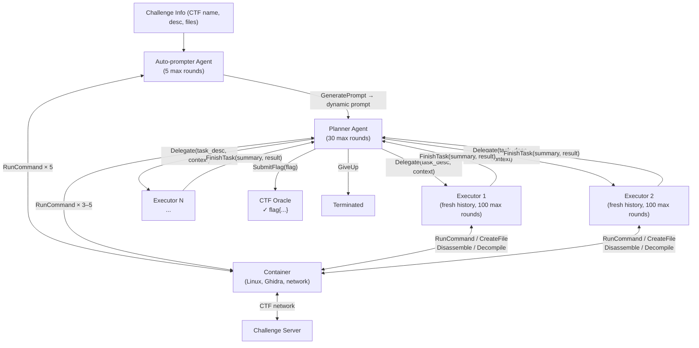
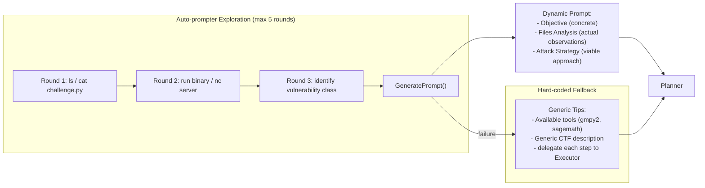

# D-CIPHER: Dynamic Collaborative Intelligent Multi-Agent System with Planner and Heterogeneous Executors for Offensive Security — Deep Survey Notes for CMatrix

| Field | Details |
|-------|---------|
| **Authors** | Meet Udeshi*, Minghao Shao*, Haoran Xi*, Nanda Rani, Kimberly Milner, Venkata Sai Charan Putrevu, Brendan Dolan-Gavitt, Sandeep Kumar Shukla, Prashanth Krishnamurthy, Farshad Khorrami, Ramesh Karri, Muhammad Shafique (NYU Tandon, NYU Abu Dhabi, IIT Kanpur) |
| **Venue** | arXiv preprint (NYU-LLM-CTF group) |
| **Published** | 2025 |
| **Repository** | [https://github.com/NYU-LLM-CTF/nyuctf_agents](https://github.com/NYU-LLM-CTF/nyuctf_agents) (`nyuctf_multiagent` branch) |
| **Relevance** | ⭐⭐⭐⭐☆ — D-CIPHER provides a production-grade blueprint for CMatrix's Planner–Team Manager–Specialist architecture with validated heterogeneous executors, Auto-prompter as a pre-flight recon agent, and the first MITRE ATT&CK–grounded capability evaluation methodology for LLM pentest agents. |
| **Key Claim** | D-CIPHER with Claude 3.5 Sonnet achieves **44% on HackTheBox** (vs. EnIGMA's 26%), **22.5% on Cybench** (vs. 20%), and **22% on NYU CTF Bench** (vs. 13.5%) — 2.5%–8.5% absolute SOTA improvement across all three benchmarks while simultaneously covering **65% more MITRE ATT&CK techniques** than any prior agent. |

---

## 2. Core Thesis

D-CIPHER addresses the fundamental scaling failure of single-agent LLM systems in complex, multi-step offensive security tasks. Single-agent CTF solvers suffer from context exhaustion, hallucination feedback loops, and loss of focus as the task horizon grows. Real-world CTF teams solve this with role specialization and knowledge handoff — D-CIPHER operationalizes this team dynamic in software: a **Planner** drives global strategy, **heterogeneous Executors** are each launched fresh for a single delegated task, and an **Auto-prompter** performs environment reconnaissance before the Planner even sees the problem.

The key insight is that the information bottleneck in single-agent systems is not a model-capability gap — it's an architectural one. By giving each Executor a clean conversation history containing only its specific task, D-CIPHER eliminates the context-flooding pathology where accumulated shell output and failed attempts crowd out reasoning. The Planner never sees raw tool output; it only sees Executor summary messages. This is the same principle as CMatrix's Summarizer Bridge (Paper 12) but generalized to the full Planner level.

For CMatrix specifically, D-CIPHER matters because: (1) it empirically validates the Planner→Executor delegation pattern on 290 real CTF challenges, not toy examples; (2) it provides the first data on how model strength affects Executor vs. Planner separately (spoiler: you need strong models for both); and (3) its MITRE ATT&CK analysis gives CMatrix a principled taxonomy for classifying what offensive capabilities a pentest agent has mastered, not just what percentage of tasks it solved.

---

## 3. How It Actually Works

### 3.1 System Overview

D-CIPHER is a three-agent system:

1. **Auto-prompter Agent** — Given raw CTF info + container access. Runs 5 exploration rounds (reads files, runs binaries, connects to CTF server), then calls `GeneratePrompt` to produce a challenge-specific initial prompt. Falls back to hard-coded template if it fails.
2. **Planner Agent** — Receives Auto-prompter's generated prompt. Has `RunCommand` for exploration (3–5 rounds) but deliberately lacks `CreateFile`, `Disassemble`, `Decompile` — forces it to delegate rather than execute. Calls `Delegate` to spawn Executors. Maintains the only `SubmitFlag` and `GiveUp` tools.
3. **Executor Agents** — Each is a fresh instance with empty conversation history, containing only the delegated task description. Has full toolset: `RunCommand`, `CreateFile`, `Disassemble`, `Decompile`. Calls `FinishTask` with a summary when done. Multiple Executors can be spawned sequentially for sub-tasks.



### 3.2 Context Management Architecture

Each agent has three layers in its context:
1. **System Prompt** — Role definition + available function signatures
2. **Initial Prompt** — Challenge info or delegated task description
3. **Conversation History** — (reasoning, action, observation) triplets — "rounds"

**Key truncation policy:**
- All agent observations truncated to **25,000 characters**
- Executor conversation history truncated to **last 5 (action, observation) pairs** — only recent state visible
- Reasoning text always preserved even when action/observation is truncated (preserves chain-of-thought)
- This is a departure from full-history approaches — the Executor is intentionally amnesiac about its distant past

**Cost controls:**
- `$3 total cost limit` across all agents per CTF
- Max rounds: Auto-prompter=5, Planner=30, Executor=100
- If Executor exhausts rounds without calling `FinishTask`, one forced last-chance prompt is sent
- If Auto-prompter fails, hard-coded fallback prompt activates automatically

### 3.3 Auto-prompter: Dynamic Environment-Grounded Prompting

Instead of a static template, the Auto-prompter:
1. Reads challenge files (`cat`, `strings`, `file`, `hexdump`)
2. Executes the binary or connects to the server
3. Synthesizes what it observed into a problem-specific prompt



**Concrete Example — collision_course cryptography CTF:**

| Prompt Component | Hard-Coded Template | Auto-Prompter Generated |
|-----------------|--------------------|-----------------------|
| Objective | "Recover the administrator's password" | "Recover password using AES; password encrypted with original IDs" |
| Files Analysis | "Files included: ['handout.zip']" | "encrypt_database.py: MD5 hash with 3-char salt; only first 4 chars used" |
| Attack Strategy | "Generate a step-by-step plan" | "Brute force all 3-char combinations, find salt, map IDs 1–500, decrypt password.bin using my_aes.py" |

### 3.4 Planner-Executor Interaction: Concrete Trace

```mermaid
sequenceDiagram
    participant AP as Auto-prompter
    participant PL as Planner
    participant E1 as Executor 1
    participant E2 as Executor 2
    participant CTF as CTF Environment

    AP->>CTF: RunCommand("cat encrypt_database.py")
    CTF-->>AP: [source code with MD5+salt logic]
    AP->>AP: GeneratePrompt -> dynamic attack plan
    AP->>PL: Initial prompt (attack strategy embedded)

    PL->>CTF: RunCommand("ls handout/")
    CTF-->>PL: [password.bin, encrypt_database.py, my_aes.py]
    PL->>E1: Delegate("Brute force 3-char salt; return correct salt")
    Note over E1: Fresh context, only task desc
    E1->>CTF: RunCommand("python3 brute.py") [T1110: Brute Force]
    CTF-->>E1: salt = "v0o"
    E1->>PL: FinishTask(summary="Salt is 'v0o'", result="v0o")

    PL->>E2: Delegate("Use salt 'v0o', map IDs, decrypt password.bin")
    Note over E2: Fresh context, receives salt in task desc
    E2->>CTF: RunCommand("python3 decrypt.py --salt v0o") [T1600, T1552]
    CTF-->>E2: flag{...}
    E2->>PL: FinishTask(summary="Decrypted", result="flag{...}")
    PL->>PL: SubmitFlag("flag{...}")
```

### 3.5 Tool Inventory

| Tool | Available To | Purpose |
|------|-------------|---------|
| `RunCommand` | AP, Planner, Executor | Execute shell commands in container |
| `CreateFile` | Executor only | Create scripts/payloads |
| `Disassemble` | Executor only | Ghidra disassembly of binary |
| `Decompile` | Executor only | Ghidra decompilation of binary |
| `SubmitFlag` | Planner only | Submit flag to oracle |
| `GiveUp` | Planner only | Terminate challenge |
| `GeneratePrompt` | Auto-prompter only | Output generated prompt |
| `Delegate` | Planner only | Spawn new Executor |
| `FinishTask` | Executor only | Return summary to Planner |

**Key design principle:** Tool restrictions enforce role separation. Removing `CreateFile`, `Disassemble`, `Decompile` from the Planner forces delegation — the Planner cannot try to solve the CTF alone. This is implemented at the API layer (system prompt lists only allowed functions).

---

## 4. Vulnerabilities / Attack Types Exploited

D-CIPHER operates on CTF challenges spanning:

| Category | Count (290 total) | Example Techniques |
|----------|------------------|-------------------|
| Cryptography | 99 | T1110 (Brute Force), T1600 (Weaken Encryption), T1552 (Unsecured Credentials), T1140 (Deobfuscate) |
| Reverse Engineering | 77 | T1574 (Hijack Execution Flow), binary analysis |
| Binary Exploitation (pwn) | 40 | T1203 (Exploitation for Client Execution), buffer overflow, ROP chains, format string |
| Web | 27 | T1190 (Exploit Public-Facing Application), SQLi, SSRF |
| Forensics | 19 | T1059 (Command and Scripting Interpreter) |
| Miscellaneous | 28 | T1055 (Process Injection), varied |

**MITRE ATT&CK Coverage (top techniques on NYU CTF Bench 200-CTF corpus):**

| ID | Technique | # CTFs | D-CIPHER Sonnet (solved) | EnIGMA Sonnet (solved) | Baseline Sonnet |
|----|-----------|--------|--------------------------|------------------------|----------------|
| T1203 | Exploitation for Client Execution | 36 | 4 | **6** | 1 |
| T1574 | Hijack Execution Flow | 24 | 2 | **3** | 1 |
| T1190 | Exploit Public-Facing Application | 17 | **1** | 0 | 0 |
| T1552 | Unsecured Credentials | 16 | **5** | 5 | 1 |
| T1110 | Brute Force | 11 | **3** | 1 | 0 |
| T1600 | Weaken Encryption | 9 | **2** | 1 | 0 |
| **Total** | — | **211** | **27** | 26 | 21 |

> **Note:** D-CIPHER without Auto-prompter scores **43 total** (65% more techniques than any other configuration), driven by dramatically better pwn performance. The Auto-prompter can introduce early-stage bias that specifically hurts binary exploitation challenges where initial exploration misleads the Planner.

---

## 5. Benchmark Section

### 5.1 Benchmarks Used

| Benchmark | Crypto | Forensics | Pwn | Rev | Web | Misc | Total |
|-----------|--------|-----------|-----|-----|-----|------|-------|
| NYU CTF Bench | 53 | 15 | 38 | 51 | 19 | 24 | **200** |
| Cybench | 16 | 4 | 2 | 6 | 8 | 4 | **40** |
| HackTheBox | 30 | 0 | 0 | 20 | 0 | 0 | **50** |
| **Total** | 99 | 19 | 40 | 77 | 27 | 28 | **290** |

- **Deployment:** Linux Docker containers per challenge, shared network to CTF server
- **Success oracle:** Correct flag string submitted (format: `flag{...}`); scanning agent conversation for flag occurrence as fallback
- **Cost limit:** $3 per challenge; temperature=1.0

### 5.2 Main Results (% Solved)

| System | Model | NYU CTF % | Cybench % | HackTheBox % | NYU $ cost |
|--------|-------|-----------|-----------|--------------|-----------|
| NYU Baseline | Claude 3.5 Sonnet | 13.0 | 15.0 | 38.0 | — |
| NYU Baseline | GPT-4o | 6.0 | 12.5 | 16.0 | — |
| EnIGMA | Claude 3.5 Sonnet | 13.5 | 20.0 | 26.0 | $0.35 |
| EnIGMA | GPT-4o | 9.5 | 12.5 | 16.3 | $0.62 |
| **D-CIPHER** | **Claude 3.5 Sonnet** | **19.0** | **22.5** | **44.0** | $0.52 |
| D-CIPHER | GPT-4o | **10.5** | — | 16.0 | $0.22 |
| D-CIPHER | LLaMa 3.1 405B | 3.0 | — | — | $0.01 |
| D-CIPHER | Gemini 1.5 Flash | 2.5 | — | — | $0.001 |
| D-CIPHER w/o Auto-prompter | Claude 3.5 Sonnet | **22.0** | 20.0 | **44.0** | $0.74 |
| D-CIPHER w/o Planner | Claude 3.5 Sonnet | 14.0 | — | — | $0.36 |

> **Note:** Removing the Auto-prompter *increases* NYU CTF Bench performance (+3pp) but *decreases* Cybench (-2.5pp). The Planner is definitively worth its cost: removing it drops performance by 5pp despite halving cost.

### 5.3 Mixed-Model (Planner Strong / Executor Weak) Results

| Planner | Executor | % solved | $ cost |
|---------|----------|----------|--------|
| Claude 3.5 Sonnet | Claude 3.5 Haiku | 13.0 | $0.33 |
| GPT-4o | GPT-4o mini | 6.5 | $0.03 |
| GPT-4 Turbo | GPT-4o mini | 5.5 | $0.07 |
| Gemini 1.5 Flash | Gemini 1.5 Flash 8B | 3.0 | $0.001 |
| LLaMa 3.1 405B | LLaMa 3.3 70B | 0.0 | $0.00 |

> **Note:** Every pairing of strong Planner + weak Executor underperforms the homogeneous strong+strong configuration. The Executor tasks are inherently complex; cheap models fail at them. Both Planner and Executor require frontier-class models.

### 5.4 Temperature Study (GPT-4o, NYU CTF Bench)

| Temperature | Crypto | Forensics | Pwn | Rev | Web | Misc | Total |
|-------------|--------|-----------|-----|-----|-----|------|-------|
| T=1.0 | **5.8** | **13.3** | **7.7** | **13.7** | **10.5** | **16.7** | **10.5** |
| T=0.95 | 3.8 | 13.3 | 5.1 | 11.8 | 10.5 | 16.7 | 9.0 |

> **Note:** Higher temperature improves creative problem-solving for CTFs. Use T=1.0 as default for pentest agents — deterministic decoding hurts exploration.

---

## 6. Key Takeaways for CMatrix

### 🔴 Critical — Must-Have in CMatrix v1

**1. Enforce Role-Specific Tool Restrictions at the API Level**
The Planner's inability to execute code (no `CreateFile`, no `Disassemble`) is not a limitation — it's the forcing function that makes the Planner genuinely plan. In CMatrix, the Team Manager's function call list must exclude all specialist execution tools. If Team Manager can run `sqlmap`, it will try to run `sqlmap` instead of delegating:
```python
TEAM_MANAGER_TOOLS = ["delegate_specialist", "submit_finding", "request_escalation", "mission_complete"]
SPECIALIST_TOOLS = ["run_command", "http_request", "create_file", "run_sqlmap", "run_nuclei"]
# Never merge these lists — separate agent instantiation with separate tool registries
```

**2. Auto-prompter as Pre-Flight Recon Seeder**
Before the Team Manager receives a target, a dedicated Recon Seeder agent runs 3–5 exploration actions (nmap, WhatWeb, curl homepage, check robots.txt, attempt GraphQL introspection) and generates a target-specific context injection for the Team Manager:
```python
class ReconSeeder:
    max_rounds = 5
    tools = ["nmap", "whatweb", "curl", "graphql_introspect", "ffuf_light"]
    output = "SeederContext"  # Injected as initial_prompt for TeamManager
    fallback = STATIC_RECON_TEMPLATE  # If seeder fails, use hard-coded baseline
```

**3. Fresh-Context Specialist Pattern**
Every Specialist is instantiated with an empty conversation history. Only structured `FinishTask` summary JSON flows back to Team Manager — never raw tool output:
```python
def delegate_specialist(specialist_class, task_desc: str, context_bundle: dict):
    spec = specialist_class(
        system_prompt=SPECIALIST_SYSTEM_PROMPT,
        initial_prompt=format_task_prompt(task_desc, context_bundle),
        conversation_history=[]  # ALWAYS empty — no inherited state
    )
    result = spec.run()
    return result.finish_task_summary  # Structured JSON only
```

**4. MITRE ATT&CK Capability Tracking as First-Class Metric**
Map every target type / vulnerability class to applicable ATT&CK technique IDs. Report both (a) % tasks solved and (b) # unique ATT&CK techniques covered:
```python
TECHNIQUE_MAP = {
    "sqli": ["T1190", "T1078"],
    "xss": ["T1059.007", "T1190"],
    "buffer_overflow": ["T1203", "T1574"],
    "brute_force": ["T1110"],
    "auth_bypass": ["T1078", "T1212"],
}
# After each mission, log: techniques_attempted, techniques_succeeded
```

### 🟡 Important — CMatrix v2 Improvements

**5. Hybrid Auto-prompt + Hard-coded Guidelines**
D-CIPHER's main failure mode on pwn challenges is Auto-prompter early-stage errors that mislead the Planner. Fix: inject both the dynamically generated context AND a fixed guideline section:
```
[DYNAMIC CONTEXT from Recon Seeder]
---
[FIXED GUIDELINES]
- Always attempt XSS before SQLi on form inputs
- Always check for GraphQL introspection before REST fuzzing
- Never submit a finding without Validation Agent confirmation
```

**6. Round Budget as Soft Termination Signal**
Successful challenges resolve in <100 total rounds; failures spread to 200+. If total rounds exceed 60% of budget with no high-confidence finding from any Specialist, trigger a "strategy reconsideration" prompt to Team Manager before the hard limit fires.

**7. Temperature=1.0 as Default**
D-CIPHER confirms: pentest tasks are creative search problems. Default all CMatrix LLM calls to T=1.0 except structured output generation (T=0.0 for JSON schema compliance).

### 🟢 Nice-to-Have — Future Work

**8. Inter-Specialist Shared Scratchpad**
D-CIPHER's stated limitation: all inter-Executor communication flows through the Planner. A shared read-only SQLite mission scratchpad that all Specialists write findings to and read from would remove this bottleneck without synchronous coordination.

**9. MITRE ATT&CK as Team Manager Seed**
D-CIPHER's ATT&CK analysis confirms Paper 09's signal: inject applicable technique IDs into the initial Team Manager prompt. For web targets, the relevant set is small: T1190, T1059, T1078, T1110, T1212, T1552.

**10. CTF-to-Web-Vuln Technique Bridge**
Create a `technique_map.yaml` mapping each OWASP Top 10 class to ATT&CK technique IDs. Use this to generate the ATT&CK seed list in the Recon Seeder output — a one-time knowledge engineering task.

---

## 7. Cross-References

| This Paper's Concept | Connected Paper | Mechanism of Connection |
|----------------------|-----------------|------------------------|
| **Planner → Executor delegation with fresh history** | Paper 10 (PentestGPT): Session A (Reasoning) + Session B (Generation, fresh per sub-task) | Same principle of context isolation between planning and execution levels; D-CIPHER operationalizes it as distinct agent instances rather than dual LLM sessions |
| **Auto-prompter as environment-grounded initial context** | Paper 05 (AutoPT): Recon phase produces structured JSON that seeds FSM's first State | AutoPT's recon → FSM seed is rule-based; D-CIPHER's Auto-prompter is LLM-grounded exploration. CMatrix should use Auto-prompter for unstructured initial assessment, then AutoPT-style rule extraction to feed the PSM FSM |
| **Heterogeneous Executors (fresh history per task)** | Paper 12 (VulnBot): Summarizer Bridge compresses specialist output before Planner re-ingestion | Both papers solve Planner context pollution differently: D-CIPHER prevents it by not sending raw output; VulnBot compresses before Planner sees it. D-CIPHER's approach is cheaper; VulnBot's preserves more detail. CMatrix should use D-CIPHER's pattern for simple delegation and VulnBot's Summarizer for complex specialist outputs |
| **Strong + weak model pairing underperforms** | Papers 04, 05, 07, 11: "pipeline architecture dominates model size" | D-CIPHER provides a counter-example: weak Executor completely breaks performance (LLaMa 405B + LLaMa 70B → 0% solve). The nuanced signal: architecture matters for planning, but execution quality gates on model strength |
| **MITRE ATT&CK technique coverage as capability metric** | Paper 09 (MITRE seed in Planner prompt) + Paper 11 (EGATS attack tree with typed attack nodes) | Paper 09 injects ATT&CK IDs as priors; D-CIPHER measures ATT&CK coverage post-hoc as evaluation metric; Paper 11's attack tree nodes correspond to ATT&CK techniques. CMatrix should do all three |
| **Tool restriction as delegation enforcer** | Paper 14 (CHECKMATE): Anti-drift action de-registration + Predefined Action Library | Both papers use tool availability to enforce desired agent behavior. CHECKMATE restricts which invocations are legal after prior actions; D-CIPHER restricts by agent role. CMatrix should combine both: role-based tool whitelists (D-CIPHER) + action de-registration after execution (Paper 14) |
| **Fallback prompt on Auto-prompter failure** | Paper 11 (Human Escalation): TDI > 0.8 → escalate + provide hint | Both papers recognize failure modes requiring a higher-authority fallback. D-CIPHER uses static template; Paper 11 escalates to operator. CMatrix should tier: static template first, then operator escalation only if both fail |

---

*Survey notes written: 2026-08-17 | Paper 15 of 29*
