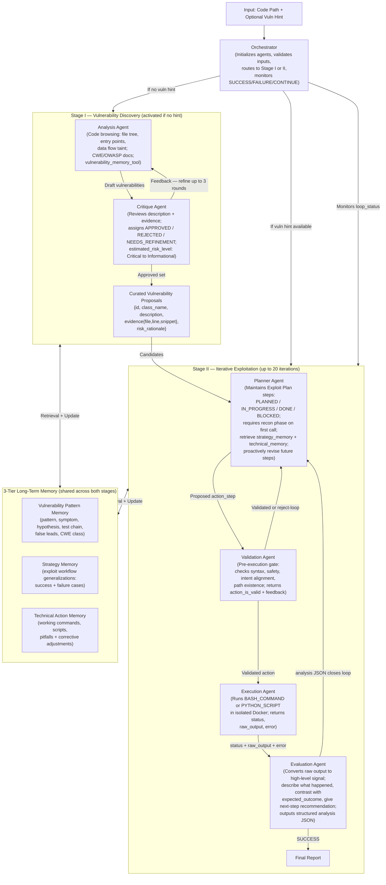
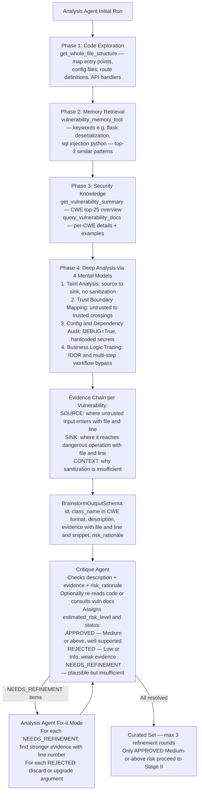
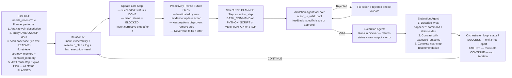
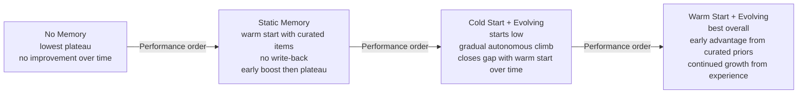

# CO-REDTEAM: Orchestrated Security Discovery and Exploitation with LLM Agents — Deep Survey Notes for CMatrix

| Field | Details |
|-------|---------|
| **Authors** | Pengfei He (Michigan State Univ. / Google Cloud AI), Ash Fox, Lesly Miculicich, Stefan Friedli, Daniel Fabian, Burak Gokturk, Jiliang Tang, Chen-Yu Lee, Tomas Pfister (Google Cloud AI Research) |
| **Venue** | arXiv preprint (Google Cloud AI Research) |
| **Published** | 2025 |
| **Repository** | Not available |
| **Relevance** | ⭐⭐⭐⭐☆ — Provides the most complete reference implementation of a 6-agent, 3-tier long-term memory system with layered Vulnerability-Pattern / Strategy / Technical-Action memories and a formal Planner→Validation→Execution→Evaluation closed-loop exploitation; directly maps onto CMatrix Layer 2–4 and the memory subsystem. |
| **Key Claim** | CO-REDTEAM achieves **63.7% ASR on CyBench**, **65.0% exploit success on BountyBench**, and **37.3% ASR on CyberGym** with Gemini-3-Pro — outperforming the best baseline (C-Agent) by **+15.9 pp / +17.5 pp / +15.8 pp** absolute; removing execution feedback alone causes a **−41.6 pp** drop on CyBench. |

---

## Core Thesis

Software vulnerability analysis is fundamentally a multi-phase cognitive task that requires **program structure understanding**, **security-domain reasoning**, and **execution-grounded hypothesis validation** — three capabilities that no single LLM call or generic coding agent can deliver in concert. Existing single-agent systems (VulTrail, RepoAudit) that skip execution feedback achieve near-zero exploitation rates because static code reasoning cannot distinguish exploitable vulnerabilities from false positives. Generic coding agents (OpenHands, C-Agent) gain from execution feedback but lack security domain grounding and experience reuse, leaving them at 40–47% performance ceilings.

CO-REDTEAM's central insight is that vulnerability work decomposes naturally into two qualitatively different phases: **discovery** (abstract pattern recognition over data flow and code structure, best done with code-browsing + CWE/OWASP knowledge) and **exploitation** (concrete plan-execute-evaluate loops in isolated Docker environments, requiring iterative feedback). By separating these phases and assigning dedicated specialist agents to each, CO-REDTEAM avoids the context pollution and reasoning mode confusion that degrades unified systems. The discovery phase introduces a **Analysis↔Critique feedback loop** — a form of structured internal debate that reduces false positives and increases hypothesis quality before any execution is attempted.

For CMatrix, the most critical contribution is the **three-tier long-term memory architecture**: Vulnerability Pattern Memory (schema-level experience), Strategy Memory (exploit workflow generalizations), and Technical Action Memory (working command snippets and failure pitfalls). This is the first paper in the survey to empirically quantify the benefit of memory warm-starting and evolution with a moving-average success rate curve, showing that warm-start + evolving memory consistently dominates all other configurations over time. This directly validates CMatrix's FAISS-based memory design and extends it to three separate semantic layers rather than one undifferentiated vector store.

---

## How It Actually Works

### System Architecture



> **Key design invariant**: The Validation Agent acts as a mandatory pre-flight gate — every Planner-generated action must pass it before hitting the Execution Agent. Ablation: removing Validation Agent costs −17.5pp on BountyBench Exploit.

---

### Stage I Deep Dive — Analysis–Critique Loop



**Concrete case from Appendix B (AgentScope Path Traversal):**
```
Analysis Agent identifies: /api/file endpoint uses path param without sanitization
Evidence chain:
  SOURCE: request.args['path']  (_app.py:570)
  SINK:   open(path)             (_app.py:578)
  CONTEXT: No os.path.realpath() or prefix check before open()

Exploit Plan steps:
  Step 1: grep -n "/api/file" _app.py                            → DONE, found endpoint at L570
  Step 2: read_file _app.py L570-585                             → DONE, confirmed no sanitization
  Step 3: curl "http://127.0.0.1:9889/api/file?path=C:\Windows\System32\drivers\etc\hosts"
                                                                 → DONE, SUCCESS — returned hosts file content
```

---

### Stage II Deep Dive — Plan-Execute-Evaluate Loop

The Planner maintains an explicit `research_plan` JSON object across all iterations. This is the anti-amnesia mechanism:



**Exploitation iteration budget** (CyBench, Figure 2 analysis):
- Gemini-2.5-Pro: performance peak at ~17 iterations; plateau thereafter
- Gemini-3-Pro: performance peak at ~13 iterations — faster convergence AND higher peak
- Hard cap of 20 is never actually reached in practice (terminates at 13–18)
- Implication: stronger models exploit feedback more efficiently; cap should scale with model tier

---

### Three-Tier Long-Term Memory — Concrete Structure

| Tier | Content Schema | Granularity | Retrieval Key |
|------|---------------|-------------|---------------|
| **Vulnerability Pattern** | `{pattern, vuln_class, code_symptom, hypothesis, initial_test_vector, false_leads[]}` | Schema-level (conceptual) | Technical keywords: "flask deserialization", "saml bypass" |
| **Strategy** | `{title, description, content: decision_tree_or_workflow_steps[]}` | Strategic (workflow) | Vuln class + tech stack: "SSO bypass", "XSS web framework" |
| **Technical Action** | `{title, description, type: Code_Snippet|Command|Script, content: literal_code_or_command}` | Tactical (executable) | Tool name or attack step: "SAML stripping", "path traversal curl" |

**Concrete example from Appendix A.4 (SSO strategy cluster):**
```
Strategy Item: "SSO Bypass Assessment Decision Tree"
Content:
  1. Identify mechanism: Shared Session Cookies vs SAML vs OAuth
  2. Select attack vector:
       Shared Cookies → investigate related subdomains for takeover
       SAML          → test Signature Exclusion / Wrapping
       OAuth         → scan for Open Redirect in callback flow
  3. Execute and Verify unauthorized access

Vulnerability Pattern: "SAML Signature Validation Bypass"
  code_symptom: SAMLResponse XML assertion passed to login endpoint
  hypothesis:   SP processes assertion without verifying XML signature
  initial_test_vector: Intercept, modify NameID to admin, strip ds:Signature block

Technical Action: "SAML Signature Stripping"
  type: Code_Snippet
  content: <ds:Signature>... [Remove this block] ...</ds:Signature>
```

---

### Memory Evolution — Four Configurations Compared



**Key findings from Figure 3 (CyberGym, Gemini-2.5-Pro)**:
1. **Initialization effect**: Static Memory beats No Memory early → curated priors give immediate boost
2. **Evolution effect**: Both evolving configs trend up; static/memory-free plateau
3. **Cold Start recovery**: Agent autonomously acquires effective strategies → no human curation required for long-term operation
4. **Best config**: Warm Start + Evolving = rapid early gains + sustained long-term improvement

---

### Agent Tool Inventory

**Code Browsing Tools** (Analysis Agent + Planner):

| Tool | Purpose |
|------|---------|
| `get_working_directory_docker` | Resolve absolute base path inside container |
| `list_directory_docker` | Directory structure at specified path |
| `get_whole_file_structure_docker` | Full recursive file tree from root |
| `read_file_docker` | Full file content by path |
| `get_snippet_docker` | Line-range extraction from file |
| `read_readme_docker` | Auto-locate and read README |

**Execution Tools** (Execution Agent):

| Tool | Purpose |
|------|---------|
| `run_bash_command_in_docker` | Execute shell command; returns stdout + stderr |
| `run_python_script_in_docker` | Execute Python script string in isolated Docker |

**Knowledge + Memory Tools** (Analysis Agent + Planner):

| Tool | Purpose |
|------|---------|
| `get_vulnerability_summary` | CWE top-25 overview document |
| `query_vulnerability_docs` | Per-CWE detailed descriptions + examples |
| `vulnerability_memory_tool` | FAISS retrieval from Pattern Memory tier |
| `strategy_memory_tool` | FAISS retrieval from Strategy Memory tier |
| `technical_memory_tool` | FAISS retrieval from Technical Action tier |

---

## Vulnerabilities Exploited

| Vuln Class | Target | Method | Outcome |
|------------|--------|--------|---------|
| **Path Traversal (CWE-22)** | AgentScope (`/api/file` endpoint) | `path` param passed to `open()` unsanitized; curl with `?path=../etc/hosts` | Arbitrary file read confirmed |
| **Reverse Engineering / CTF** | LootStash binary | `strings stash` extracts flag from ELF | Flag `HTBn33dl3_1n_a_l00t_stack` retrieved |
| **SAML Signature Bypass** | Generic SSO apps | Strip `<ds:Signature>` block from SAML assertion | Auth bypass memory pattern |
| **SQL Injection (CWE-89)** | Python web apps | Source→sink taint: `request.args` → `cursor.execute` | Memory analysis pattern |
| **XSS (CWE-79)** | Web frameworks | Unescaped input in HTML output | Memory analysis pattern |
| **IDOR (CWE-639)** | REST APIs | User-controlled key in DB query without authorization check | Memory analysis pattern |
| **OS Command Injection (CWE-78)** | Python apps | User input → `subprocess.call` without sanitization | Taint analysis mental model |
| **Config Flaws** | Any stack | `DEBUG=True`, hardcoded secrets in Dockerfile/requirements | Config/Dependency Audit model |

> **Important**: CO-REDTEAM targets **source-code-level** vulnerability analysis (repository access granted). This is different from Papers 01–17 which are primarily blackbox network/web pentesting agents. The two approaches are complementary: CO-REDTEAM for white-box/gray-box code review; prior papers for black-box exploitation.

---

## Benchmark Section

### Benchmarks Used

| Benchmark | Source | Scope | Oracle | Scale |
|-----------|--------|-------|--------|-------|
| **CyBench** | Zhang et al. 2024 | CTF-style security challenges; code + execution environment access | Flag capture via code execution | 33 challenges evaluated |
| **BountyBench** | Zhang et al. 2025a | Real-world bug bounty; Detect (find vuln in code) and Exploit (reproduce PoC) modes | Exploit: exit 0 from exploit.sh; Detect: correct vuln identification | 40 Exploit tasks + 40 Detect tasks |
| **CyberGym** | Wang et al. 2025 | Large-scale realistic CVE reproduction; executable PoC generation | Successful PoC execution (exit 0) | Large scale (80+ tasks inferred) |

### Main Results — Table 1

| Method | Backbone | CyBench | BountyBench (Exploit) | BountyBench (Detect) | CyberGym |
|--------|----------|---------|-----------------------|---------------------|----------|
| Vanilla | Gemini-2.5-flash | 10.3% | 7.5% | 0.0% | 1.2% |
| Vanilla | Gemini-2.5-pro | 13.6% | 12.5% | 0.0% | 8.3% |
| Vanilla | Gemini-3-pro | 18.5% | 17.5% | 0.0% | 12.1% |
| OpenHands | Gemini-2.5-flash | 16.3% | 17.5% | 0.0% | 4.8% |
| OpenHands | Gemini-2.5-pro | 31.5% | 42.5% | 0.0% | 16.9% |
| OpenHands | Gemini-3-pro | 45.2% | 45.0% | 5.0% | 20.2% |
| C-Agent | Gemini-2.5-flash | 18.2% | 20.0% | 0.0% | 5.1% |
| C-Agent | Gemini-2.5-pro | 31.8% | 40.0% | 2.5% | 15.8% |
| C-Agent | Gemini-3-pro | 47.8% | 47.5% | 5.0% | 21.5% |
| VulTrail | Gemini-3-pro | N/A | 10.0% | 0.0% | 5.6% |
| RepoAudit | Gemini-3-pro | N/A | 25.0% | 2.5% | 18.3% |
| **CO-REDTEAM** | **Gemini-2.5-flash** | **31.8%** | **32.5%** | **7.5%** | **12.1%** |
| **CO-REDTEAM** | **Gemini-2.5-pro** | **59.1%** | **60.0%** | **12.5%** | **31.5%** |
| **CO-REDTEAM** | **Gemini-3-pro** | **63.7%** | **65.0%** | **20.0%** | **37.3%** |

> **Note**: CO-REDTEAM with Gemini-2.5-flash (31.8% CyBench) beats C-Agent with Gemini-3-pro (47.8%) is not quite true — but CO-REDTEAM with Gemini-2.5-pro (59.1%) beats all Gemini-3-pro baselines. **Architecture advantage is ~11–27 pp** over same-model baselines. Most critically: VulTrail and RepoAudit (no execution feedback) achieve near-zero exploit rates despite being sophisticated systems — confirming execution feedback is load-bearing.

### Ablation Study — Table 2 (Gemini-2.5-pro baseline: 59.1% / 60.0% / 12.5% / 31.5%)

| Removed Component | CyBench | BountyBench Exploit | BountyBench Detect | CyberGym | Key Insight |
|-------------------|---------|--------------------|--------------------|----------|-------------|
| No Critique Agent | N/A | N/A | 10.0% (↓2.5pp) | N/A | Critique primarily affects detection precision |
| No Validation Agent | 52.3% (↓6.8pp) | **42.5% (↓17.5pp)** | 7.5% (↓5.0pp) | 28.3% (↓3.2pp) | Pre-execution gate critical for exploit reliability |
| No Vuln-Docs | 55.2% (↓3.9pp) | 52.5% (↓7.5pp) | 10.0% (↓2.5pp) | 30.2% (↓1.3pp) | Domain knowledge helps but is not critical |
| No Code Browser | 47.5% (↓11.6pp) | 42.5% (↓17.5pp) | 7.5% (↓5.0pp) | 27.9% (↓3.6pp) | Code navigation essential for both phases |
| **No Memory** | 50.0% (↓9.1pp) | **40.0% (↓20.0pp)** | 7.5% (↓5.0pp) | **22.6% (↓8.9pp)** | Memory most valuable for complex / long-horizon tasks |
| **No Execution** | **17.5% (↓41.6pp)** | **12.5% (↓47.5pp)** | **0.0% (↓12.5pp)** | **14.3% (↓17.2pp)** | Execution feedback is the single most critical component |

> **Note**: The −41.6pp drop from removing execution feedback is the largest single-component ablation result in this entire survey. It empirically proves that static code reasoning alone cannot achieve reliable vulnerability exploitation.

### Detection Precision/Recall — Table 3 (BountyBench, Gemini-2.5-pro)

| Method | Precision | Recall |
|--------|-----------|--------|
| Vanilla | 0.000 | 0.000 |
| OpenHands | 0.000 | 0.000 |
| C-Agent | 0.024 | 0.025 |
| **CO-REDTEAM** | **0.143** | **0.125** |

> **Note**: CO-REDTEAM achieves ~6× higher precision (0.143 vs 0.024). The Analysis–Critique loop is the mechanism — it acts as a false-positive filter before any execution is attempted. The absolute numbers are low (14.3% precision) because real-world bug bounty detection is extremely hard. The relative improvement is the signal.

### Latency Analysis — Table 4 (average runtime in seconds)

| Agent | Model | CyBench | BountyBench | CyberGym |
|-------|-------|---------|-------------|----------|
| Vanilla | Gemini-2.5-pro | 50.1 | 36.2 | 42.6 |
| OpenHands | Gemini-2.5-pro | 392.1 | 227.5 | 633.5 |
| C-Agent | Gemini-2.5-pro | 387.2 | 215.3 | 636.4 |
| **CO-REDTEAM** | **Gemini-2.5-pro** | **361.5** | **205.4** | **619.7** |
| OpenHands | Gemini-3-pro | 347.6 | 219.6 | 609.7 |
| C-Agent | Gemini-3-pro | 320.3 | 201.9 | 611.7 |
| **CO-REDTEAM** | **Gemini-3-pro** | **319.8** | **198.7** | **605.2** |

> **Note**: CO-REDTEAM is faster than or comparable to baselines despite 6 agents — structured planning avoids wasted execution attempts. Gemini-3-pro is 10–15% faster across all agents due to architectural improvements.

### Multi-Model Generalization — Table 5 (Appendix C)

| Method | Backbone | CyBench | BountyBench Exploit | BountyBench Detect | CyberGym |
|--------|----------|---------|--------------------|--------------------|----------|
| Vanilla | GPT5-mini | 9.1% | 10.0% | 2.5% | 7.6% |
| C-Agent | GPT5-mini | 22.7% | 57.5% | 7.5% | 12.6% |
| **CO-REDTEAM** | **GPT5-mini** | **31.8%** | **60.0%** | **15.0%** | **14.5%** |
| Vanilla | Claude-4.5 | 13.6% | 15.0% | 2.5% | 10.4% |
| C-Agent | Claude-4.5 | 22.7% | 40.0% | 5.0% | 20.5% |
| **CO-REDTEAM** | **Claude-4.5** | **36.3%** | **45.0%** | **20.0%** | **25.9%** |
| Vanilla | qwen3-32b | 0.0% | 7.5% | 0.0% | 1.2% |
| C-Agent | qwen3-32b | 13.6% | 12.5% | 0.0% | 2.4% |
| **CO-REDTEAM** | **qwen3-32b** | **18.2%** | **17.5%** | **5.0%** | **7.6%** |

> **Note**: CO-REDTEAM's architecture advantage generalizes across all model families including weak open-source (qwen3-32b). The gap is largest with strong models (BountyBench Detect: CO-REDTEAM Claude-4.5 = 20% vs C-Agent Claude-4.5 = 5%).

---

## Key Takeaways for CMatrix

### 🔴 Critical — Must-have in CMatrix v1

**1. Explicit Exploit Plan Object as Planner Working Memory**
The Planner must maintain a persisted `research_plan` JSON object received and updated every iteration — not re-generated from scratch. Each step: `{description, action, status: PLANNED|IN_PROGRESS|DONE|BLOCKED, result}`. On failure: mark BLOCKED, insert corrective step immediately after. Proactively revise all future PLANNED steps when upstream evidence invalidates their assumptions. This is the primary anti-amnesia + anti-repetition mechanism.
```python
plan_step = {
  "step_id": "S3",
  "description": "Send path traversal payload to /api/file endpoint",
  "action": "curl 'http://victim:5003/api/file?path=../etc/passwd'",
  "status": "PLANNED",   # PLANNED → IN_PROGRESS → DONE | BLOCKED
  "result": None         # filled after execution by Evaluation Agent
}
```

**2. Mandatory Validation Agent Gate (Pre-Execution Pre-flight)**
Every action generated by the Planner must pass a Validation Agent before reaching the Execution Agent. Checks: (a) action_type consistency (BASH requires `command`; PYTHON_SCRIPT requires `script_content`), (b) syntax plausibility, (c) intent alignment with step description, (d) path/flag existence assumptions. Returns `{action_is_valid: bool, feedback: str}`. Invalid actions are returned to Planner for correction before retrying. Ablation: −17.5pp on BountyBench Exploit without this gate.

**3. Evaluation Agent as Execution Interpreter (3-Part Structure)**
Never pass raw stdout/stderr from Execution Agent directly to Planner. Route through an Evaluation Agent that produces a structured 3-part analysis: (1) describe what happened — reference exact command + key stdout/stderr; (2) contrast actual vs expected outcome; (3) provide concrete next-step recommendation. Output: `{analysis: str}`. This is a stronger variant of CMatrix's existing Reflection Filter — the 3-part structure forces actionable reasoning, not binary null/non-null filtering.

**4. Three-Tier FAISS Memory Architecture**
Upgrade CMatrix's current unified FAISS memory to three separate embedding stores with different schemas:
- **Tier 1 — Vulnerability Pattern**: `{pattern, vuln_class, code_symptom, hypothesis, test_vector, false_leads[]}` — retrieved by technical keyword
- **Tier 2 — Strategy**: `{title, workflow_steps[], success_cases[], failure_cases[]}` — retrieved by vuln_class + technology stack
- **Tier 3 — Technical Action**: `{title, type: snippet|command|script, content, pitfalls[]}` — retrieved by tool name or technique
All three tiers updated after every completed mission. Memory synthesis via frontier LLM (Gemini-2.5-pro equivalent). Ablation: −20pp on BountyBench Exploit without memory; −8.9pp on CyberGym (long-horizon tasks benefit most).

**5. Warm-Start Memory Initialization**
Pre-populate all three memory tiers before mission zero with: CWE top-25 patterns, OWASP Top 10 workflows, HackTricks techniques, expert-crafted strategy items. Enable write-back after every mission (evolving mode). Warm Start + Evolving is the best configuration (Figure 3). Cold Start eventually catches up to Warm Start — but Warm Start eliminates early-mission performance deficits critical for production deployments.

**6. Analysis–Critique Feedback Loop for Source-Code Discovery Mode**
When CMatrix operates in source-code-assisted mode (code path provided), add a Critique Agent that reviews every vulnerability proposal for: (a) evidence quality (requires file + line number), (b) risk level (Critical/High/Medium/Low/Informational), (c) feasibility. NEEDS_REFINEMENT triggers re-analysis; REJECTED are dropped. Run at most 3 rounds (Appendix C shows diminishing returns after 3 iterations). Result: ~6× higher precision vs no critique (0.143 vs 0.024 on BountyBench Detect).

### 🟡 Important — CMatrix v2

**7. Four Analysis Mental Models in Code-Inspection Prompts**
When CMatrix performs source-code-aware scanning, inject these four analysis lenses into the Analysis Agent prompt: (1) Taint Analysis — trace `request.args` to `cursor.execute`/`eval`/`subprocess.call`; (2) Trust Boundary Mapping — find where untrusted data crosses into trusted context without authorization check; (3) Config/Dependency Audit — inspect Dockerfile, requirements.txt for `DEBUG=True`, hardcoded secrets, pinned-to-vulnerable versions; (4) Business Logic Tracing — trace multi-step flows for IDOR and workflow bypass. These four mental models cover injection, auth bypass, infrastructure flaws, and logic flaws systematically.

**8. Exploitation Iteration Budget with Saturation Monitoring**
Set default exploitation cap at 20 iterations. Strong models (frontier-class) saturate at ~13 iterations; weaker models need up to ~17. Implement adaptive early-stopping: if 3 consecutive iterations produce no new DONE steps in the plan, declare FAILURE. Hard cap of 20 is appropriate as a safety net but is rarely hit in practice.

**9. Code Browser Tool Suite as Separate Tool Category**
Add a code-browsing tool category to CMatrix's tool registry distinct from network/web pentest tools: `list_directory`, `get_whole_file_structure`, `read_file`, `get_snippet` (line-range), `read_readme`. All tools run in an isolated Docker container that cannot modify the original codebase. Register these only for source-code-assisted specialist agents, not for network-level recon agents.

**10. CyBench, BountyBench, CyberGym in CMatrix Benchmark Suite**
These three benchmarks cover code-aware vuln analysis, real-world bug bounty, and CVE reproduction respectively — complementing the existing blackbox web pentesting suite. Task format: `{code_path, vulnerability{id, class, description, evidence}, output_requirements{format, description}}`. Add as the source-code exploitation benchmark set alongside existing blackbox web benchmarks.

### 🟢 Nice-to-Have

**11. Detection Precision/Recall as First-Class Metrics**
Track precision and recall for vulnerability detection mode separately from exploitation ASR. CO-REDTEAM achieves 14.3% precision / 12.5% recall (6× better than baselines). The low absolute numbers reflect task difficulty, not system failure — these are appropriate targets for CMatrix v1 source-code detection missions.

**12. Memory Synthesis via Separate High-Quality LLM**
Use a frontier-class LLM (GPT-4o or Gemini-2.5-pro equivalent) exclusively for memory synthesis/extraction, decoupled from the backbone model used for task execution. This prevents low-quality memory accumulation when running cost-optimized configurations with cheaper backbone models.

**13. Security Documentation Local Knowledge Base**
Maintain a local CWE/OWASP knowledge base with: (a) a summary file (CWE top-25 brief descriptions mapped to code patterns), (b) detailed per-CWE docs with real code examples and mitigations. Expose via `get_vulnerability_summary` and `query_vulnerability_docs` tools. For live CVE data (Paper 13 pattern), augment with a search-engine tool; the local base handles well-known CWE classes without API calls.

---

## Cross-References

| This Paper's Idea | Connected Paper(s) | Mechanism of Connection |
|-------------------|--------------------|------------------------|
| **Analysis↔Critique feedback loop** | Paper 02 (Team Manager synthesis), Paper 12 (Summarizer Bridge) | CO-REDTEAM's Critique Agent performs the same false-positive filtering role as Paper 02's Team Manager synthesis — both prevent low-confidence findings from consuming execution budget. Key difference: CO-REDTEAM applies this within the discovery stage before any tool call; Paper 02 applies it between specialist runs; Paper 12 applies it after phase completion. Together they form a 3-level filter cascade. |
| **Explicit Exploit Plan with BLOCKED state + corrective step insertion** | Paper 12 (PTG Merge Plan), Paper 10 (PTT JSON State Object), Paper 17 (PTT Monotonic Growth) | All four papers converge on the same design: a persisted structured plan object that survives iterations, tracks failure state, and supports incremental repair. CO-REDTEAM adds "proactively revise future steps" — invalidate downstream steps when upstream evidence contradicts them immediately, not reactively after they fail. This is the strongest version of the pattern. |
| **Mandatory pre-execution Validation Agent** | Paper 05 (Rule States for deterministic filtering), Paper 14 (Anti-Drift Action De-registration) | Paper 05's Rule States prevent invalid FSM transitions at zero LLM cost. Paper 14's de-registration prevents re-executing spent actions. CO-REDTEAM's Validation Agent prevents mal-formed actions from entering the Execution Agent. The three mechanisms are complementary: de-register spent actions (14), validate new ones before execution (18), filter invalid state transitions at FSM level (05). |
| **Three-tier memory (Pattern / Strategy / Technical)** | Papers 01, 02, 04, 07, 12 (FAISS vector memory) | Prior papers use a single undifferentiated FAISS store. CO-REDTEAM's key contribution is semantic stratification: Pattern memory generalizes at conceptual level, Strategy memory transfers exploit workflows, Technical memory stores executable snippets. This resolves the granularity mismatch in undifferentiated stores where high-level strategy and low-level command fragments compete for the same retrieval budget. |
| **Warm-start + evolving memory with cross-mission learning** | Paper 04 (AWE adaptive strategy), Paper 07 (Thompson Sampling), Paper 12 (Two-Stage RAG) | Paper 04's AWE and Paper 07's bandit update beliefs within a mission but discard between missions. Paper 12's Two-Stage RAG includes per-mission successful task history. CO-REDTEAM is the first to empirically demonstrate cross-mission learning curves with warm-start vs cold-start vs evolving comparisons, and to show that cold-start evolving eventually closes the gap with warm-start. |
| **Evaluation Agent 3-part structured output** | Paper 09 (Reflection Filter), Paper 10 (Parsing Module: Four Input Categories) | Paper 09's Reflection Filter produces binary null/non-null output. Paper 10's Parsing Module categorizes input type before compression. CO-REDTEAM's Evaluation Agent adds a fixed 3-part structure (describe→contrast→recommend) that is more operationally actionable than Paper 09's filter and avoids Paper 10's category classification overhead. The 3-part structure is the most concrete formulation of "execution feedback" in this survey. |
| **Source-code taint analysis (4 mental models)** | Paper 01 (CVE/NVD retrieval), Paper 13 (Two-Tier Knowledge DB + Live Search) | Paper 01 retrieves pre-existing CVE documentation. Paper 13 searches live CVE databases for known service versions. CO-REDTEAM generates fresh vulnerability hypotheses from first principles via 4 systematic mental models applied to actual source code. The three are complementary: use Paper 13 for known CVE targets; use CO-REDTEAM's approach for novel/zero-day discovery; use Paper 01 for confirmed CVE context injection. |
| **Architecture advantage empirically confirmed** | Papers 04, 05, 06, 07, 11, 15, 17 (architecture > model size) | CO-REDTEAM with Gemini-2.5-pro (59.1% CyBench) beats all Gemini-3-pro baselines (+11.3pp over C-Agent-3-pro). However, CO-REDTEAM with Gemini-2.5-flash (31.8%) does NOT beat OpenHands or C-Agent with Gemini-3-pro — so architecture advantage is not absolute. Correct framing: architecture advantage is **large within the same model tier** and **multiplicative with model strength** — not a substitute for model quality. |

---

*Survey note written for CMatrix systematic literature review.*
*Paper 18 of 29 — next: Paper 19 (AutoGen: Next-Gen LLM Multi-Agent Conversations)*
