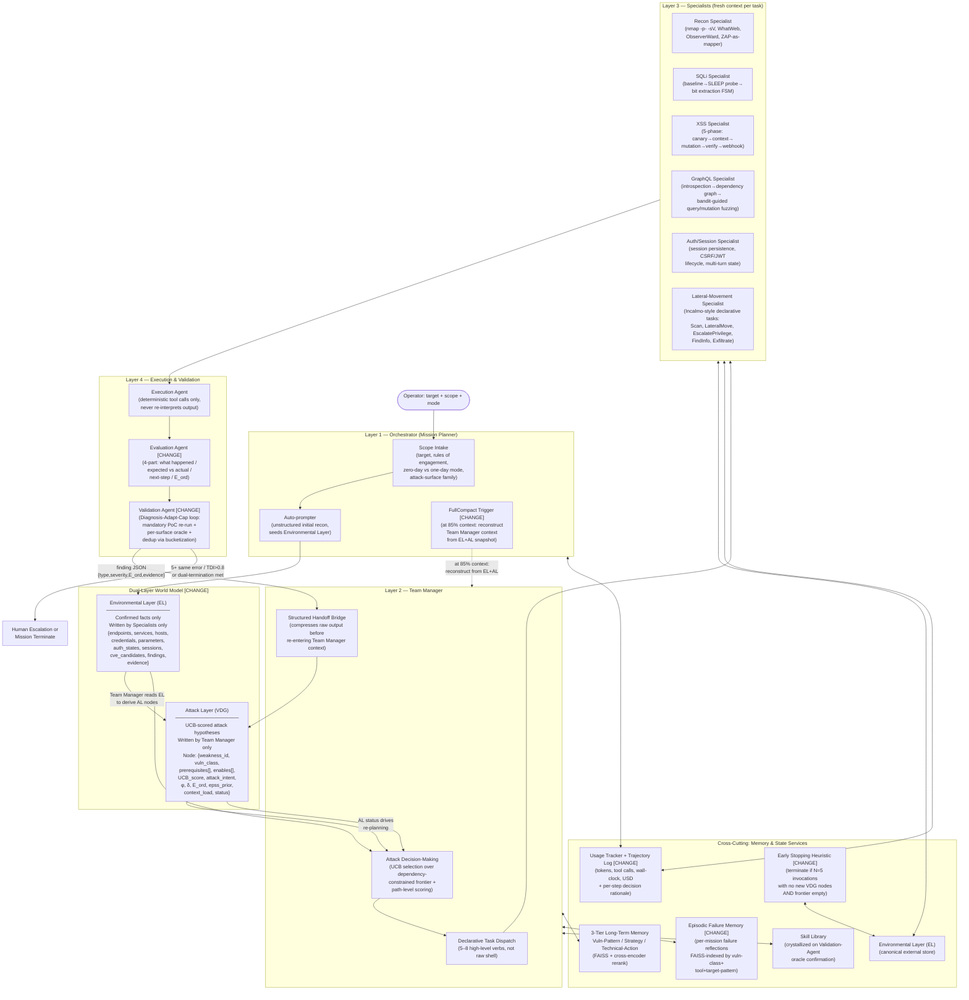

# CMatrix: An LLM-Orchestrated Multi-Agent Framework for Autonomous VAPT

**Working title for publication:** *CMatrix: Dependency-Aware Attack Graph Exploration for Autonomous Vulnerability Assessment and Penetration Testing*

**Status:** Final architecture — synthesized from architecture-1.md (primary backbone), selective improvements from architecture-2.md, and the four-agent adjudication report. All changes from architecture-1.md are annotated with `[CHANGE]` tags for traceability.

**Scoping rule applied throughout:** CMatrix targets **only attack surfaces for which a dedicated, reusable, oracle-backed benchmark already exists in the surveyed literature.** Every claimed capability maps to a benchmark in §2.

**Evidence discipline applied throughout:** Claims are classified as **Established** (29-paper corpus), **Reasonable Hypothesis** (to be empirically tested), or **Speculative** (not presented as expected results).

---

## Table of Contents

1. [Problem Statement](#1-problem-statement)
2. [Target Attack Surface](#2-target-attack-surface)
3. [Scientific Contributions (Three Only)](#3-scientific-contributions-three-only)
4. [What Is Explicitly NOT a Contribution](#4-what-is-explicitly-not-a-contribution)
5. [System Architecture — Overview](#5-system-architecture--overview)
6. [The Dual-Layer World Model](#6-the-dual-layer-world-model)
7. [The VDG Algorithm (Formalized)](#7-the-vdg-algorithm-formalized)
8. [Layer-by-Layer Architecture Detail](#8-layer-by-layer-architecture-detail)
9. [Attack Surface Traversal — Per-Specialist Methodology](#9-attack-surface-traversal--per-specialist-methodology)
10. [Memory and State Services](#10-memory-and-state-services)
11. [Prior Work Gap Table](#11-prior-work-gap-table)
12. [Benchmarking Strategy and Statistical Methodology](#12-benchmarking-strategy-and-statistical-methodology)
13. [Required Ablation Design](#13-required-ablation-design)
14. [Model Configuration and Cost Policy](#14-model-configuration-and-cost-policy)
15. [Threats to Validity / Known Limitations](#15-threats-to-validity--known-limitations)
16. [Summary of Contribution Claims](#16-summary-of-contribution-claims)

---

<!-- SECTION STATUS
§1  Problem Statement              ✅ DONE
§2  Target Attack Surface          ✅ DONE
§3  Scientific Contributions       ✅ DONE
§4  Not a Contribution             ✅ DONE
§5  System Architecture Overview   ✅ DONE
§6  Dual-Layer World Model         ✅ DONE
§7  VDG Algorithm (Formalized)     ✅ DONE
§8  Layer-by-Layer Detail          🔲 TODO
§9  Per-Specialist Methodology     🔲 TODO
§10 Memory & State Services        🔲 TODO
§11 Gap Table                      🔲 TODO
§12 Benchmarking & Statistics      🔲 TODO
§13 Ablation Design                🔲 TODO
§14 Model Config                   🔲 TODO
§15 Threats to Validity            🔲 TODO
§16 Contribution Summary           🔲 TODO
-->

---

## 1. Problem Statement

Every strong empirical result in the surveyed literature agrees on one finding: **architecture, not model scale, is the dominant variable** in autonomous exploitation performance. Six independent papers (AWE, AutoPT, VulnBot, PentestAgent, D-CIPHER, Incalmo) confirm that a well-structured pipeline running a cheaper model beats an unstructured ReAct loop running a frontier model. Yet two independent failure modes remain unresolved — and no surveyed system addresses both simultaneously.

**Failure Mode 1 — Insufficient Exploration (CVE-Bench)**

The field's best system on the hardest realistic web benchmark — CVE-Bench, 40 critical (CVSS ≥ 9.0) real web-application CVEs — exploits only **13% one-day / 10% zero-day** vulnerabilities. CVE-Bench's Table 5 identifies **insufficient exploration** as the dominant failure mode across every agent and setting (exploration-failure rates range 37.5%–80.0%: T-Agent 80.0% zero-day / 55.0% one-day; AutoGPT 72.5% / 45.0%; Cy-Agent 67.5% / 37.5%). The failure is not reasoning quality — it is exploration breadth.

**Failure Mode 2 — Dependency-Reasoning Gap (PentestEval)**

PentestEval's stage-level decomposition shows the opposite bottleneck at the planning level: **Attack Decision-Making (ADM)** — reasoning about prerequisite dependencies between candidate weaknesses — is the single lowest-scoring stage (Spearman 0.25). PentestEval's ground-truth-injection ablation quantifies the improvement available at each stage:

| Configuration | End-to-end success | Marginal gain |
|---|---|---|
| SMP (baseline) | 0.31 | — |
| + GT Weakness Gathering (WG) | 0.50 | +0.19 |
| + GT Weakness Filtering (WF) | 0.53 | +0.03 |
| + GT Attack Decision-Making (ADM) | 0.67 | **+0.14** |

ADM delivers the **largest single-stage marginal increment** (+0.14) of the three tested — measured on top of an already ground-truthed WG+WF pipeline, not in isolation. CMatrix's dynamically-grown dependency graph is a weaker approximation than ground-truth ADM, so its ceiling must be reported as less than 0.67 and bounded by the quality of the LLM-inferred edges (§7.3).

**The Gap No Surveyed System Closes**

- Systems that solve **exploration breadth** (T-Agent, HPTSA, MAPTA) use flat team dispatch without explicit prerequisite/dependency modeling.
- Systems that solve **dependency reasoning** (PentestEval SMP, CHECKMATE Classical Planning+) are evaluated on curated scenarios with pre-enumerated weakness sets and cannot scale to open-ended, wide-surface exploration.
- No system combines **UCB-guided exploration over a dependency-constrained frontier**, **explicit prerequisite/enables edges grown dynamically from Specialist discovery**, **cross-session verified skill accumulation**, and **evaluation across three independently-benchmarked attack-surface families** in one architecture.

**CMatrix's thesis:** A four-layer orchestration framework driven by a *Vulnerability Dependency Graph* (VDG) — formalized as a scored DAG with explicit prerequisite/enables edges, UCB-guided node selection over a dependency-constrained frontier, path-level impact optimization, and ordinal evidence backpropagation — combined with a dual-layer world model that separates confirmed environmental facts from inferred attack hypotheses.

---

## 2. Target Attack Surface

### 2.1 Selection Rule and Explicit Exclusion

Every attack surface below is included **only because it has a dedicated, reusable, oracle-backed benchmark in the surveyed corpus.** No benchmark will be built; CMatrix's evaluation is fully constrained to what already exists.

**Explicitly excluded: general REST API attack surface.** RESTler's evaluation targets (self-hosted GitLab, Microsoft Azure services, Office365) are one-off real-world case studies, not a standardized, reusable target set. There is no "RESTBench" equivalent in the survey. RESTler's core techniques (producer–consumer dependency inference, response-feedback pruning) are methodologically reusable and are adopted internally by the GraphQL Specialist and the dependency-inference logic in the Team Manager (§9.3), but REST API exploitation is **not evaluated and not claimed** — no REST-API-specific pass rates are reported anywhere in this paper.

**Explicitly excluded: Hybrid Classical-Planning + VDG.** Architecture-1 §5.2 proposed combining PDDL planning with the VDG. This is removed from the contribution list and from the architecture. "Recon → surface enumeration → exploit" is a phase ordering, not a PDDL plan. No domain file is specified, no operator library exists, and no planning algorithm is defined. The claim cannot be evaluated. The phase ordering is retained as a fixed initialization skeleton in §8.1 (Orchestrator), but is not claimed as a contribution. *[CHANGE from architecture-1.md §5.2 — removed on adjudication consensus]*

### 2.2 In-Scope Attack Surfaces

| Attack surface | Benchmark(s) | What's covered |
|---|---|---|
| **Web application (HTTP/HTML)** | Fang et al. 15-vuln sandbox; HPTSA 14-CVE zero-day suite; CVE-Bench (40 critical CVEs, CVSS ≥ 9.0); MAPTA/XBOW (104 challenges); HackWorld (36 CTF-style); PentestEval (12 real-world scenarios / 346 tasks); Cybench (40 tasks, web-relevant subset); PentestGPT 13-machine HTB+VulnHub set; HTB Season 8 (5 post-2025 machines) | SQLi (blind/UNION), XSS (reflected/stored/DOM), CSRF, SSRF, SSTI, LFI/path traversal, file-upload RCE, authorization/IDOR bypass, auth bypass, brute force, framework-specific RCEs (ThinkPHP, Struts2, Spring/Fastjson, Jenkins), JWT forgery |
| **GraphQL APIs** | PrediQL's 6-API suite (UserWallet, Countries, Rick&Morty, GraphQLZero, EHRI, TCGDex) vs. ZAP / Burp Suite / EvoMaster / GraphQLer baselines | Introspection-driven schema abuse, producer–consumer mutation→query dependency chains, batched-auth bypass, IDOR via ID manipulation, injection via arguments, DoS via nested queries |
| **Multi-host / Active Directory networks** | Incalmo MHBench (40 multi-host red-team environments) | Lateral movement, credential reuse/theft across hosts, privilege escalation, multi-host stepping-stone attacks |
| **Production system corpus (cross-cutting hard tier)** | BountyBench (25 real production systems: mlflow, langchain, FastAPI, gradio, curl, django, etc.; 27 CWEs across 9 OWASP Top-10 categories) | Economic/adversarial evaluation layer on top of web surface — not a separate attack-surface family, but a harder, real-money-validated version of the same web/app surface |

Everything CMatrix claims to do is bounded by this table. Binary exploitation, physical/network-layer attacks, social engineering, and general REST API fuzzing are **not evaluated and not claimed.**

---

## 3. Scientific Contributions (Three Only)

> **Design principle:** A paper with seven contributions invites a reviewer to conclude "bundle of incremental integrations." CMatrix makes exactly three primary claims, each bounded by a precise experimental test. All other mechanisms are supporting infrastructure. *[CHANGE from architecture-1.md §10 — reduced from seven to three per adjudication consensus]*

### C1 — Dependency-Aware Attack Graph Exploration

CMatrix introduces a dynamically constructed **Vulnerability Dependency Graph (VDG)** combining:
- UCB-guided node selection over a **dependency-constrained frontier** (only nodes whose prerequisites are satisfied are eligible)
- **Path-level impact scoring** (a path of three medium-scoring nodes leading to RCE is more valuable than a single high-scoring node leading to information disclosure — node-level scoring alone cannot capture this)
- **Explicit prerequisite/enables edges grown dynamically from Specialist discovery** (solving PentestEval's pre-enumeration scalability gap)
- **Ordinal evidence confidence scoring** (E_ord 1–5, replacing raw LLM confidence in the UCB formula)

*Prior work:* EGATS uses UCB without formal prerequisites. PentestEval uses prerequisites but on pre-curated, expert-annotated sets. CHECKMATE uses PDDL but cannot handle non-deterministic zero-day discovery. No system combines all three in a dynamically-grown structure.

**Validation requirement:** This is a genuine contribution *if and only if* the ablation demonstrates that Full VDG (UCB + dependency edges + path-scoring) outperforms UCB filtered by dependency satisfaction as a wrapper ("stacking"). If they are equal, the contribution downgrades to "dependency-aware UCB filtering" — still a contribution, but a narrower one.

**Experimental test:** Ablation (a): Flat UCB list → (b): UCB + dependency edges, no path-scoring → (c): UCB filtered by dependency satisfaction (stacked, not unified) → (d): Full VDG with path-scoring. If (d) > (c), unification has value. Reported on CVE-Bench (exploration metric) and PentestEval (ADM score).

### C2 — Cross-Mission Memory with Verified Skill Promotion

CMatrix adapts CO-REDTEAM's 3-tier memory and Voyager's description-embedding retrieval for the security domain.

*Precise security-specific difference:* Security exploit chains require **conditional branching** (e.g., "if WAF detects `<script>`, switch to event-handler payloads") that Voyager's deterministic game-world skills do not. CMatrix's Strategy Memory tier explicitly represents these conditional workflows as parameterized procedures with branch points — not just linear exploit sequences.

**Validation requirement:** Must show measurable improvement on a "seen technology" subset of benchmarks (e.g., improved performance on ThinkPHP CVEs after encountering other ThinkPHP CVEs in prior missions). Measured by strategy hit rate computed from Engagement Trajectory logs.

**Note on crystallization:** Architecture-2's ≥2-mission crystallization threshold is not adopted for this paper. The chosen benchmarks (CVE-Bench: 40 diverse CVEs, PrediQL: 6 APIs, MHBench: 40 environments) do not supply enough repeated technology-fingerprint matches for crystallization to trigger reliably. Skill storage uses per-mission Validation-Agent confirmation as the promotion gate — stronger than Voyager's self-check (oracle-backed), simpler than re-execution. Crystallization is deferred to future work with a dedicated technology-repetition benchmark.

### C3 — Comprehensive Cross-Benchmark Evaluation with Standardized Oracles

The first rigorous evaluation of a single autonomous VAPT architecture across CVE-Bench (web), PrediQL (GraphQL), and MHBench (multi-host) using:
- One shared orchestration layer (VDG + Team Manager + Memory)
- Surface-specific Specialist pools (not "one unmodified architecture" — see §4)
- Standardized, per-surface oracles (CVE-Bench 8-type oracle, PrediQL detection schema, MHBench per-environment criterion)
- Strictly separated per-surface reporting (not averaged)

> **Honest framing:** This is a methodological contribution to the field's evaluation standards. It is not an algorithmic contribution. No prior paper evaluates all three surfaces with one architecture under these conditions — that is the gap this fills. *[CHANGE from architecture-1.md §5.4 — downgraded from "generalization" to "methodological contribution" per adjudication]*

---

## 4. What Is Explicitly NOT a Contribution

The following items appear in architecture-1.md or architecture-2.md as claimed contributions but are **not claimed here**. Each is retained as supporting infrastructure but not as a primary novelty claim.

| Item | Retained as | Reason for demotion |
|---|---|---|
| **Hybrid Classical-Planning + VDG** | Removed entirely | No PDDL domain file, no operator library, no specified hand-off protocol — not evaluable. *[CHANGE: removed]* |
| **"One unmodified architecture across three surfaces"** | Honest framing: shared orchestrator + surface-specific modules | Different Specialist pools activate per surface. "Unmodified" is inaccurate. |
| **Economic and safety-framing metrics as co-primary contribution** | Evaluation methodology — reported alongside every pass rate | Reporting choice, not technical novelty. BountyBench already introduces this. |
| **Parallel alternative-surface queue + meta-critic as architectural fix for CVE-Bench** | Design choice (retained but not claimed) | A secondary todo list + periodic prompt injection + default scan setting is not architectural innovation. |
| **Tool Risk Gate (3-tier LLM permission classifier)** | Not adopted | Safety/deployment mechanism, not VAPT effectiveness mechanism. Adds LLM cost per tool invocation without improving any measured metric in sandboxed evaluation. |
| **Context compaction (MicroCompact / AutoCompact)** | Not adopted | Architecture-1's fresh-context-per-Specialist design avoids this problem. If a Specialist task exceeds one context window, the sub-FSM should be decomposed, not patched. |
| **VAPT Protocol Prompt as a primary contribution** | Ablation variable (§13, Ablation A8) | Engineering configuration variable. Research value as an ablation axis only. |
| **Multi-agent orchestration, tool adapter, lifecycle hooks, logging** | Implementation infrastructure | Not novel research mechanisms. |
| **"We orchestrate N tools"** | Implementation documentation | Tool count is not a research contribution. |

---

## 5. System Architecture — Overview

CMatrix uses a **four-layer hierarchy** — the structural pattern every high-performing surveyed system independently converges on (HPTSA, PentestGPT, D-CIPHER, VulnBot, Incalmo, CO-REDTEAM).

**[CHANGE from architecture-1.md §3]** The single-structure VDG is replaced by a **Dual-Layer World Model** (§6): an **Environmental Layer (EL)** containing only confirmed discovered facts (written exclusively by Specialists), and an **Attack Layer (AL / VDG)** containing only UCB-scored attack hypotheses with prerequisite/enables edges (written exclusively by the Team Manager). This eliminates fact/hypothesis conflation and makes discovery quality ablatable independently from planning quality.

**[CHANGE]** A **FullCompact** mechanism (reconstructing Team Manager reasoning context from EL+AL state at 85% context utilization) is added to address long-session Commander context inflation — the documented failure mode in PentestGPT Finding 4. Specialists retain fresh-context-per-invocation (unchanged).

**[CHANGE]** The **Evaluation Agent** now outputs a 4-part structured critique (extended from architecture-1.md's 3-part): `{what_happened, expected_vs_actual, next_step, E_ord}`. The ordinal evidence score `E_ord` replaces raw LLM confidence in the UCB formula.

**[CHANGE]** The **Validation Agent** now uses a bounded **Diagnosis-Adapt-Cap loop** (from Architecture-2, adopted per GLM and Claude-Agent adjudication): diagnose failure as CORRECTABLE or FUNDAMENTAL, adapt parameters if CORRECTABLE, cap at 3 retries.

**[CHANGE]** An **Episodic Failure Memory** (4th FAISS tier, §10.4) is added for per-mission failure reflections, retrieved before each Specialist invocation.

**[CHANGE]** An **Engagement Trajectory Log** is added for full reproducibility and post-hoc failure analysis.



**Dual-termination condition [CHANGE]:** Mission terminates when **(a) no unexplored EL nodes remain** AND **(b) all AL/VDG nodes are in a terminal state** (exploited / infeasible / deprioritized below threshold). Neither condition alone is sufficient. Alternatively: Early Stopping Heuristic fires if no new VDG nodes are added in the last N=5 Specialist invocations AND the VDG frontier is empty — this terminates before the hard time/cost ceiling and directly improves cost-per-exploit. *[CHANGE from architecture-1.md — formal stopping replaces implicit timeout-only termination]*

---

## 6. The Dual-Layer World Model

> **[CHANGE from architecture-1.md — resolves W1 and W6]**
> Architecture-1's single-structure VDG conflated confirmed environmental facts with inferred attack hypotheses. This section replaces it with two strictly-separated layers. The write-ownership principle is adopted from Architecture-2's ASG/APG design, combined with Architecture-1's UCB scoring and dependency-edge mechanisms that Architecture-2 lacks.

### 6.1 Environmental Layer (EL) — Confirmed Facts Only

The EL is CMatrix's persistent store of **all confirmed discovered facts**. Every Specialist action that produces a finding writes to the EL. No hypothesis ever enters the EL. No Team Manager reasoning ever writes to the EL.

**Write ownership:** Specialists only. Read access: all agents.

```
EL {
    endpoints     : Dict[str, Endpoint]     -- {url: {method, params, auth_required, ...}}
    services      : Dict[str, Service]      -- {host:port: {name, version, banner}}
    hosts         : Dict[str, Host]         -- {ip: {os, liveness, ports[], ...}}
    credentials   : List[Credential]        -- {username, password/hash, source, scope}
    auth_states   : Dict[str, AuthState]    -- {session_id: {cookies, tokens, expiry}}
    parameters    : Dict[str, Parameter]    -- {param_id: {endpoint, type, value_range}}
    cve_candidates: List[CVECandidate]      -- {cve_id, technology, version, epss, poc_available}
    findings      : List[Finding]           -- {type, evidence, E_ord, linked_vdg_node}
    sessions      : Dict[str, Session]      -- {session_id: {target, auth_state, history}}
    evidence      : List[Evidence]          -- {artifact_path, type, linked_finding, timestamp}
    failure_log   : List[FailureEntry]      -- {action_type, target, params, error, timestamp}
    trajectory_log: List[TrajectoryStep]   -- {step, timestamp, trigger, action_type, summary}
}
```

**The EL is the lossless persistent store.** Because all discoveries live in the EL, the Team Manager's conversation history is expendable. The FullCompact mechanism (§8.1) reconstructs the Team Manager's full reasoning context from an EL+AL snapshot at 85% context utilization — nothing discovered is lost.

**The EL never contains hypotheses.** An endpoint discovered by the Recon Specialist is in the EL. The hypothesis that this endpoint is vulnerable to SQLi is in the VDG (Attack Layer). This separation prevents fact/hypothesis contamination common in flat-memory systems and makes discovery quality ablatable independently from planning quality.

**Per-Mission Failure Log.** The `failure_log` field records every failed Specialist action. Specialists query the failure log before attempting an action to prevent repeating known-failed approaches across invocations. Even with fresh context per Specialist, the system as a whole can repeat failed approaches without this log.

### 6.2 Attack Layer (VDG) — Scored Attack Hypotheses Only

The VDG (Attack Layer) contains only inferred attack opportunities — nodes with UCB scores, dependency edges, path scores, and attack intent annotations. It is populated exclusively by the Team Manager through active reasoning over EL state. No Specialist writes to the VDG. No tool output directly creates a VDG node.

**Write ownership:** Team Manager only. Read access: Team Manager (UCB selection) and Specialists (receive assigned VDG node as task context).

**VDG node schema and algorithms:** §7 below.

### 6.3 Why the Separation Matters for Research

1. **Ablation clarity.** "What the system knows about the target" (EL) and "what the system plans to do" (VDG) are separate — you can ablate the VDG algorithm without changing discovery quality, and vice versa.
2. **Episodic correctness.** A failed exploitation attempt never contaminates the EL's record of target reality. The endpoint still exists whether the exploit succeeded or not.
3. **FullCompact safety.** The Team Manager's reasoning context can be safely discarded and reconstructed from EL+AL state because neither layer contains transient scaffolding — only structured facts and scored hypotheses.

---

## 7. The VDG Algorithm (Formalized)

> **[NEW SECTION — resolves W1 from the adjudication]**
> Architecture-1 specified only a node schema and a scoring formula placeholder. This section provides the algorithm-level specification: UCB formula, edge construction procedure, ordinal evidence scoring, backpropagation update rule, path scoring, failure propagation, and consistency checks — all at pseudocode level sufficient for implementation and reproduction.

### 7.1 VDG Node Schema

```
VDGNode {
    weakness_id     : str          -- unique identifier (e.g., "sqli-001")
    vuln_class      : VulnClass    -- enum: {SQLi, XSS, CSRF, SSTI, LFI, AuthBypass,
                                   --        IDOR, RCE, GraphQL_Injection, LateralMove, ...}
    attack_intent   : str          -- natural language description of the goal
    prerequisites   : List[str]    -- weakness_ids that MUST reach status EXPLOITED
                                   --   before this node is eligible for selection
    enables         : List[str]    -- weakness_ids that become ELIGIBLE once this node
                                   --   reaches status EXPLOITED
    status          : NodeStatus   -- enum: {ELIGIBLE, IN_PROGRESS, EXPLOITED,
                                   --        INFEASIBLE, DEPRIORITIZED, BLOCKED}
    w               : float        -- cumulative UCB reward (sum of outcome scores)
    n               : int          -- number of times this node has been selected
    phi             : float        -- promise score φ ∈ [0,1] (LLM-assessed
                                   --   likelihood of exploitability given EL evidence)
    delta           : float        -- task difficulty index δ ∈ [0,1]
                                   --   (1 = maximally hard; 0 = trivial)
    E_ord           : int          -- ordinal evidence score ∈ {0,1,2,3,4,5}
                                   --   0=unseen, 1=tool ran/nothing, 2=weak signal,
                                   --   3=clear indication, 4=confirmed behavior,
                                   --   5=oracle-confirmed exploit
    epss_prior      : float        -- EPSS score ∈ [0,1] from NVD/FIRST API
                                   --   (initial prior before any evidence;
                                   --    default 0.05 if no CVE match)
    context_load    : float        -- C ∈ [0,1]: estimated specialist context cost
    estimated_cost  : float        -- estimated token cost for this node's exploitation
    retry_count     : int          -- number of Specialist invocations on this node
    max_retries     : int          -- default 3; on exhaustion → INFEASIBLE
    path_score      : float        -- score of best feasible path this node participates in
    source_el_nodes : List[str]    -- EL node IDs that seeded this VDG node
    last_updated    : timestamp
}
```

### 7.2 UCB Node-Selection Formula

The Team Manager selects the next VDG node using a modified UCB1 formula:

```
UCB_score(v) = (w_v / n_v)
             + C_expl · sqrt(ln(N) / n_v)
             + α · φ_v
             + β · (1 - δ_v)
             + γ · (E_ord_v / 5)
             - κ · context_load_v
             + λ · epss_prior_v
             - μ · (estimated_cost_v / budget_remaining)

where:
    w_v / n_v      -- exploitation term: empirical success rate for this node
    C_expl         -- exploration constant (default 1.414 = sqrt(2); tuned on Tier 1)
    N              -- total number of node selections so far in this mission
    n_v            -- times this node has been selected (initialized to 1 to avoid div/0)
    α              -- weight for LLM-assessed promise φ          (default: 0.3)
    β              -- weight for task-difficulty term (1-δ)      (default: 0.2)
    γ              -- weight for ordinal evidence E_ord/5        (default: 0.4)
    κ              -- penalty for context load C                 (default: 0.1)
    λ              -- weight for EPSS prior                      (default: 0.15)
    μ              -- cost-awareness penalty                     (default: 0.1)
```

**Selection rule:**
```
eligible_nodes = {v ∈ VDG | v.status == ELIGIBLE
                           AND all p in v.prerequisites have status EXPLOITED}

if len(eligible_nodes) == 0:
    check dual-termination condition; if not met → relax to all UNATTEMPTED nodes

selected_node = argmax_{v ∈ eligible_nodes} UCB_score(v)
```

**Parameter tuning:** α, β, γ, κ, λ, μ, and C_expl are tuned on Tier 1 (PentestEval) via grid search over [0.1, 0.5] in steps of 0.1, holding out the CVE-Bench split. Reported in the paper with search ranges.

### 7.3 Prerequisite Edge Construction Algorithm

> **[ESTABLISHED vs SPECULATIVE]** Edge construction relies on LLM inference, which introduces noise. LLM-inferred edge accuracy against PentestEval ground-truth dependency annotations **must be measured in a pilot study before the main evaluation.** Do not claim edge accuracy without this measurement. If precision < 50%, the dependency-edge contribution weakens significantly.

```
Algorithm: VDG_AddNode(new_node, existing_vdg, el_snapshot)

Step 1 — Compute EPSS prior:
    new_node.epss_prior = query_epss_api(new_node.vuln_class, el_snapshot.cve_candidates)
    # If no CVE match: epss_prior = 0.05 (conservative default)

Step 2 — Assess promise and difficulty:
    prompt = build_assessment_prompt(new_node, el_snapshot, existing_vdg.node_summaries())
    response = llm_call(prompt, temperature=0.0)
    new_node.phi   = parse_float(response, "promise_score")    # constrain to [0,1]
    new_node.delta = parse_float(response, "difficulty_index")  # constrain to [0,1]

Step 3 — Infer prerequisite edges (pairwise LLM calls):
    for existing_node in existing_vdg.nodes:
        prompt = build_prerequisite_prompt(new_node, existing_node, el_snapshot)
        # Prompt: "Must [existing_node.attack_intent] succeed BEFORE
        #         [new_node.attack_intent] is technically feasible?
        #         Answer YES/NO with confidence 0–1 and one-sentence rationale."
        response = llm_call(prompt, temperature=0.0)  # parsed via constrained JSON schema
        if parse_bool(response, "is_prerequisite"):
            confidence = parse_float(response, "confidence")
            if confidence >= PREREQUISITE_THRESHOLD:   # default: 0.7
                new_node.prerequisites.append(existing_node.weakness_id)

        # Also check if new_node enables existing_node:
        prompt2 = build_enables_prompt(new_node, existing_node, el_snapshot)
        response2 = llm_call(prompt2, temperature=0.0)
        if parse_bool(response2, "new_node_enables_existing"):
            existing_node.enables.append(new_node.weakness_id)

Step 4 — Set initial status:
    if all prerequisite nodes have status EXPLOITED:
        new_node.status = ELIGIBLE
    else:
        new_node.status = INFEASIBLE  # re-evaluated when a prerequisite reaches EXPLOITED

Step 5 — Initialize UCB counters:
    new_node.w = 0.0
    new_node.n = 1          # avoid division by zero
    new_node.E_ord = 0
    new_node.retry_count = 0

Step 6 — Cycle detection:
    Run topological sort check on prerequisite edges.
    If cycle detected: demote lower-confidence edge(s) in the cycle from
    prerequisite → enables (non-blocking relationship). Log warning.

Step 7 — Insert into VDG:
    existing_vdg.add_node(new_node)
```

### 7.4 UCB Backpropagation Update Rule

```
Algorithm: VDG_Update(v, outcome, E_ord_new)

Step 1 — Update ordinal evidence (evidence score only increases):
    v.E_ord = max(v.E_ord, E_ord_new)

Step 2 — Update UCB reward:
    if outcome == SUCCESS:
        v.w += 1.0
        v.status = EXPLOITED
    elif outcome == PARTIAL:
        v.w += 0.5
        # status remains IN_PROGRESS
    elif outcome == FAILURE:
        v.w += 0.0
        v.retry_count += 1
        if v.retry_count >= v.max_retries:
            v.status = INFEASIBLE
            trigger VDG_FailurePropagate(v.weakness_id)

    v.n += 1

Step 3 — Propagate EXPLOITED status to enabled nodes:
    if outcome == SUCCESS:
        for child_id in v.enables:
            child = existing_vdg.get_node(child_id)
            if all prerequisites of child have status EXPLOITED:
                child.status = ELIGIBLE

Step 4 — Re-assess promise for sibling nodes (cost-controlled):
    Only fire if EL snapshot changed significantly (new endpoint, new credential).
    Controlled by a flag in the mission config to avoid excessive LLM calls.
    if outcome == SUCCESS and el_snapshot_changed_significantly():
        for sibling in existing_vdg.eligible_nodes():
            if sibling.weakness_id != v.weakness_id:
                reassess_phi(sibling, el_snapshot)
```

### 7.5 Path Scoring

> **[NEW — identified as the clearest algorithmic addition by the adjudication]**
> Node-level UCB scoring is insufficient for multi-step attack chains. A path of three medium-scoring nodes leading to RCE is more valuable than a single high-scoring node leading to information disclosure. Path scoring makes the VDG genuinely different from a scored priority queue.

```
Algorithm: VDG_ScorePaths(existing_vdg)

Step 1 — Enumerate feasible paths:
    feasible_paths = enumerate_paths(
        start_nodes=[n for n in VDG.nodes if n.status == ELIGIBLE],
        end_nodes=[n for n in VDG.nodes if n.impact == "high"],
        max_length=5  # prevent combinatorial explosion
    )

Step 2 — Score each path:
    For each path p:
        p.score = (
            product(n.UCB_score for n in p.nodes)
            * impact_weight(p.end_node.impact)
            / (1 + sum(n.estimated_cost for n in p.nodes))
        )
        # Prune dominated paths (lower score than a sub-path of the same chain)

Step 3 — Update node path scores:
    For each node n:
        n.path_score = max(p.score for p in feasible_paths if n in p.nodes)

Step 4 — Path-guided selection:
    If eligible frontier is non-empty:
        select_node = next unvisited node on highest-scored feasible path in frontier
    Else (relaxed mode):
        select_node = argmax UCB_score among all UNATTEMPTED nodes
```

### 7.6 VDG Failure Propagation

> **[NEW — directly addresses PentestGPT Finding 4: depth-first tunnel vision / inability to recover from failed paths]**

```
Algorithm: VDG_FailurePropagate(failed_node_id)

1. Mark failed_node as INFEASIBLE
2. For each node n where failed_node_id in n.prerequisites:
       n.status = BLOCKED
       Log: "Node {n.id} blocked: prerequisite {failed_node_id} failed"
3. Recompute feasible_paths (BLOCKED nodes excluded)
4. Recompute eligible frontier
5. If frontier is empty and no UNATTEMPTED nodes remain:
       Trigger dual-termination check
```

### 7.7 Ordinal Evidence Scoring (E_ord)

The Evaluation Agent assigns an `E_ord` score after every Specialist task. This replaces raw LLM confidence in the UCB formula with a calibrated, reproducible ordinal scale.

| E_ord | Label | Criteria |
|---|---|---|
| 0 | Unseen | Node not yet acted on |
| 1 | Tool ran / nothing observed | Tool executed; target responded normally; no anomaly detected |
| 2 | Weak signal | Anomalous response observed (error message, different status code, timing difference) but ambiguous |
| 3 | Clear indication | Behavioral evidence consistent with vulnerability (e.g., SQL error message, reflected input) but not yet controlled |
| 4 | Confirmed behavior | Controlled behavior demonstrated (e.g., parameterized timing differential, reflected payload executing in non-live context) |
| 5 | Oracle-confirmed exploit | Per-surface oracle confirms successful exploitation |

The Evaluation Agent outputs `E_ord` as part of its structured 4-part critique. The value is parsed deterministically from JSON — not inferred from free-form text.

**Rationale:** Raw LLM confidence is often overconfident on out-of-distribution inputs (Kadavath et al. 2022; Xiong et al. 2024). An overconfident VDG will over-exploit one attack path and under-explore alternatives — exactly CVE-Bench's documented failure mode. The ordinal scale makes UCB computation reproducible.

### 7.8 VDG Consistency Checks (run post-mutation)

```
1. No edges to non-existent nodes
2. No self-loops
3. No cycles (DAG check — violations handled by Step 6 of VDG_AddNode)
4. Flag nodes with status EXPLOITED whose prerequisites include non-EXPLOITED nodes
   (potential edge inference error — log and flag for manual review)
5. Flag nodes whose UCB_score is >3σ from the mean (flag for re-scoring)
```

Flagged issues are logged but do not block execution. If violations are common in prototyping, edge construction quality must be improved before claiming the dependency-edge contribution.
