# CMatrix — Survey Paper Summary (29 Papers)

For each paper: **core method** (with a diagram), **benchmark/target used**, **vulnerability/scope**, and the specific takeaway **CMatrix** (the research project — no formal acronym, name only) adopts. All acronyms are expanded on first use in each entry; a full glossary is at the end.

---

### 1. LLM Agents can Autonomously Exploit One-Day Vulnerabilities (Fang et al., UIUC — University of Illinois Urbana-Champaign, 2024)
- **Methodology:** Single **GPT-4** (Generative Pre-trained Transformer 4) **ReAct** (Reason + Act) agent + 5 tools (browser, terminal, search, file I/O [Input/Output], code exec), given **CVE** (Common Vulnerabilities and Exposures) description as context.

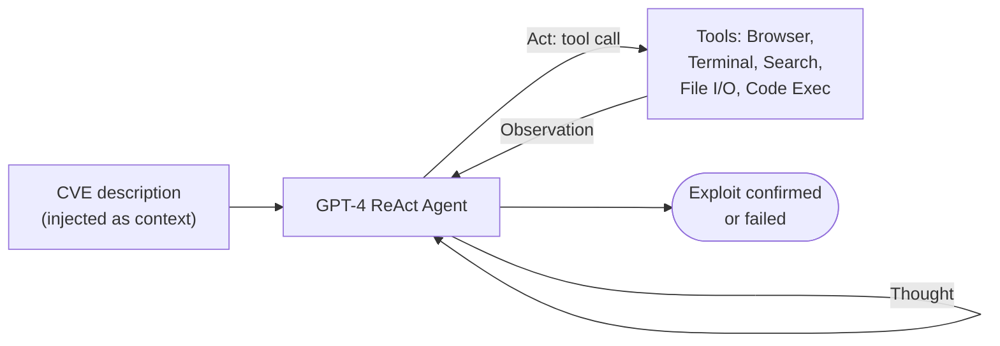

- **Benchmark / Vuln:** 15-vulnerability Docker sandbox suite (SQLi [SQL — Structured Query Language — Injection], XSS [Cross-Site Scripting], CSRF [Cross-Site Request Forgery], SSRF [Server-Side Request Forgery], SSTI [Server-Side Template Injection], file upload, auth bypass, etc.); real-world test on 50 live sites.
- **Key result:** 87% success with CVE description, 0% without it. Domain-knowledge docs are structurally necessary (ablation: 42.7%→17% without docs).
- **CMatrix takeaway:** This 15-vuln suite is CMatrix's Tier-0 fast regression benchmark. Static (not lazy-**RAG** [Retrieval-Augmented Generation]) knowledge-doc injection per specialist is mandatory. The 4 classes GPT-4 fails (AuthBypass, JS [JavaScript] attacks, Hard SQLi, XSS+CSRF) are CMatrix's explicit differentiation targets — all four share a root cause (multi-turn session state), addressed by the Auth/Session Specialist + **SPS** (Session Persistence Service).

---

### 2. Teams of LLM Agents can Exploit Zero-Day Vulnerabilities — HPTSA (Hierarchical Planning and Task-Specific Agents) (UIUC)
- **Methodology:** 3-layer hierarchy — Planner → Team Manager → Specialists.

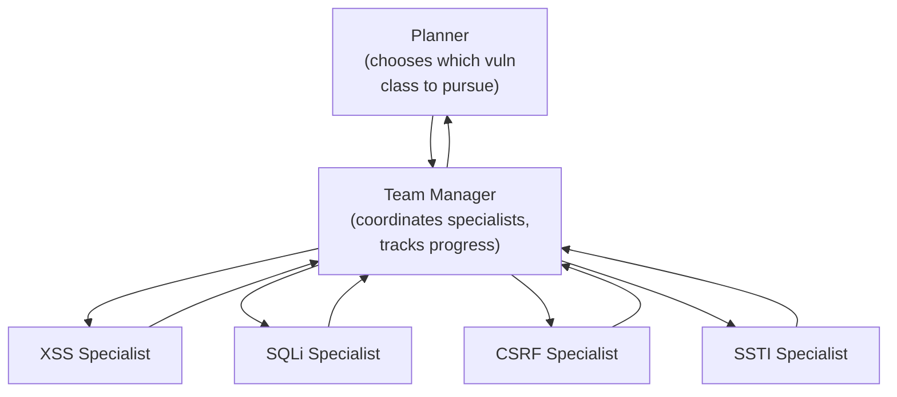

- **Benchmark / Vuln:** 14 zero-day CVEs (Common Vulnerabilities and Exposures), web apps.
- **Key result:** 42% pass@5, 4.3× better than single-agent with no vuln hint.
- **CMatrix takeaway:** Validates the 3(→4)-layer hierarchy as the correct backbone; CMatrix's Layer 1/2/3 split (Orchestrator / Team Manager / Specialists) is a direct descendant. HPTSA's exploration-breadth strength (without dependency modeling) is exactly the gap C1 (Contribution 1, the VDG [Vulnerability Dependency Graph]) closes.

---

### 3. MAPTA — Multi-Agent Penetration Testing AI for the Web
- **Methodology:** Production-grade multi-agent pipeline with a mandatory Validation Agent (no self-graded success).

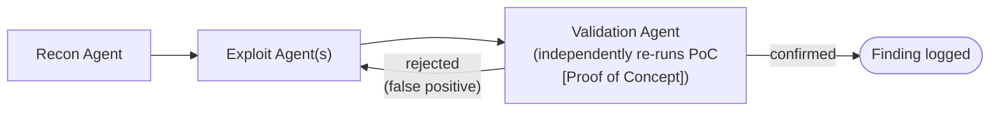

- **Benchmark / Vuln:** XBOW (104 web challenges).
- **Key result:** 76.9% success, $0.073 median cost per success; success strongly anticorrelates with resource use.
- **CMatrix takeaway:** Confirms mandatory independent PoC validation (adopted as CMatrix's Validation Agent) and rigorous cost accounting (Usage Tracker, cost-per-exploit metric).

---

### 4. AWE — Adaptive Agents for Dynamic Web Penetration Testing
- **Methodology:** Structured specialist pipeline (vs. general reasoning); 5-phase XSS (Cross-Site Scripting) pipeline.

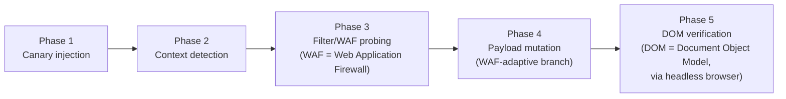

- **Benchmark / Vuln:** XSS, blind SQLi (SQL — Structured Query Language — Injection).
- **Key result:** Claude Sonnet 4 + structured pipeline beats GPT-5 (Generative Pre-trained Transformer 5) general reasoning by +30% (XSS) / +67% (blind SQLi) at 98% fewer tokens.
- **CMatrix takeaway:** AWE's 5-phase XSS FSM (Finite State Machine) is adopted verbatim as CMatrix's XSS Specialist, including WAF-adaptive branching to event-handler payloads — this is the concrete example of the "conditional branching" that distinguishes CMatrix's memory from Voyager's linear skills.

---

### 5. AutoPT — How Far Are We from End-to-End Automated Web Penetration Testing?
- **Methodology:** Penetration Testing State Machine (PSM) — explicit FSM (Finite State Machine) control flow instead of freeform ReAct (Reason + Act).

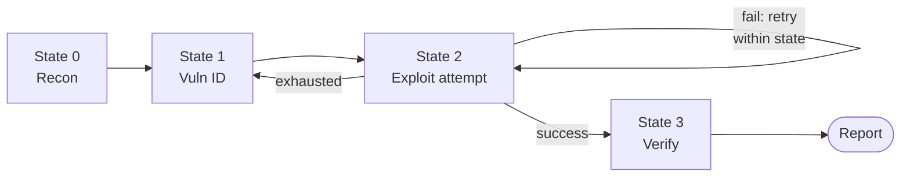

- **Benchmark / Vuln:** General web pentest targets, 20-target cost comparison.
- **Key result:** Task completion 22%→41% vs. ReAct; 50% less execution time; 71.6% less API (Application Programming Interface) cost; $0.99 vs $310 human.
- **CMatrix takeaway:** Confirms FSM-based control flow (adopted inside SQLi/XSS/Auth specialists as explicit sub-state machines) prevents loop-traps and controls cost far better than freeform reasoning.

---

### 6. HackWorld — Evaluating Computer-Use Agents on Exploiting Web Vulnerabilities
- **Methodology:** Diagnostic study of CUAs (Computer-Use Agents — GUI [Graphical User Interface]-based) on real CTF (Capture The Flag)-style web challenges; 8-failure-mode taxonomy.

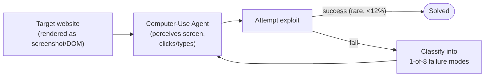

- **Benchmark / Vuln:** 36 CTF-style challenges.
- **Key result:** <12% success for SOTA (State-Of-The-Art) CUAs; bigger/newer models are not better; bottleneck is strategic reasoning/tool orchestration, not perception.
- **CMatrix takeaway:** Full-surface recon (not top-1000-port default scans) is mandated in the Recon Specialist because default-scan depth is a top-4 documented failure mode here. General lesson: architecture > model scale, reinforcing CMatrix's core thesis.

---

### 7. PrediQL — Automated Testing of GraphQL (Graph Query Language) APIs (Application Programming Interfaces) with LLMs (Large Language Models)
- **Methodology:** FAISS (Facebook AI Similarity Search)-backed RAG (Retrieval-Augmented Generation) of prior traces + Thompson-Sampling multi-armed bandit over 8 strategy arms + self-correction loop.

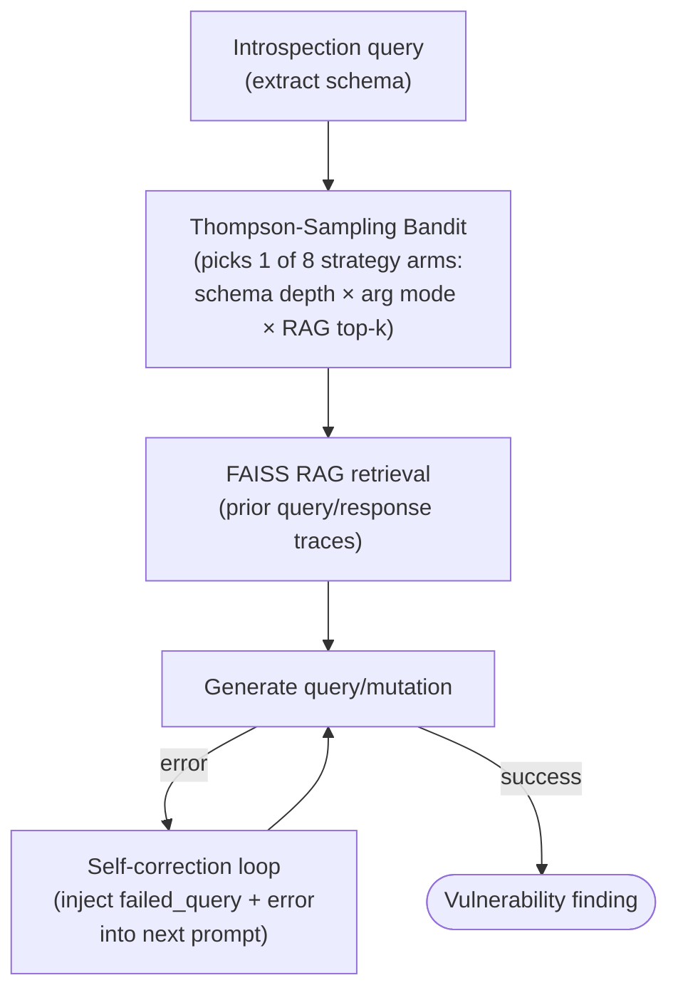

- **Benchmark / Vuln:** 6-API GraphQL suite (UserWallet, Countries, Rick&Morty, GraphQLZero, EHRI, TCGDex); schema abuse, IDOR (Insecure Direct Object Reference), injection, nested-query DoS (Denial of Service).
- **Key result:** +16% avg (max +50%) schema coverage over best baseline; small models + good pipeline rival GPT-5 Mini.
- **CMatrix takeaway:** Adopted wholesale as the GraphQL Specialist's internal algorithm (bandit arm selection + RAG grounding + self-correction), including its output schema for direct comparability to published numbers.

---

### 8. RESTler — Stateful REST (Representational State Transfer) API (Application Programming Interface) Fuzzing (ICSE — International Conference on Software Engineering — 2019)
- **Methodology:** Infers producer-consumer dependencies from the OpenAPI (a REST API description format, formerly Swagger) spec; dynamic response-feedback pruning of invalid sequences.

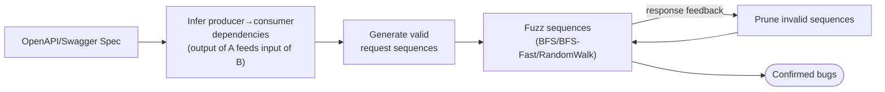

- **Benchmark / Vuln:** GitLab, Azure, Office365 (real-world case studies, not a standardized benchmark).
- **Key result:** 6× fewer test cases to reach coverage; found 28 confirmed GitLab bugs.
- **CMatrix takeaway:** Techniques reused internally (dependency inference feeds GraphQL Specialist and Team Manager dependency logic) but REST API exploitation is explicitly **not claimed or evaluated** — no reusable oracle-backed REST benchmark exists in the corpus.

---

### 9. Getting Pwnd by AI (Artificial Intelligence) — Penetration Testing with LLMs (Large Language Models) (ESEC/FSE — European Software Engineering Conference / Foundations of Software Engineering — '23)
- **Methodology:** Minimal closed-loop script: LLM → SSH (Secure Shell) command → output → LLM, no structure.

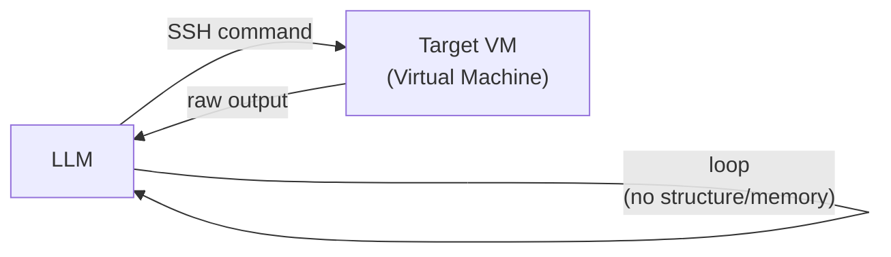

- **Benchmark / Vuln:** `lin.security` vulnerable VM (Virtual Machine) — privilege escalation, SUID (Set-owner-User-ID) exploitation.
- **Key result:** Root escalation achievable but unstable; multi-step chains consistently fail.
- **CMatrix takeaway:** Establishes the unstructured feedback-loop baseline CMatrix's FSM (Finite State Machine)/specialist architecture must and does surpass; documents hallucination, rabbit-holing, and context-truncation as concrete failure modes CMatrix's structured memory targets.

---

### 10. PentestGPT — Evaluating and Harnessing LLMs (Large Language Models) for Automated Penetration Testing
- **Methodology:** Three-module split — Reasoning / Generation / Parsing — plus a PTT (Pentesting Task Tree).

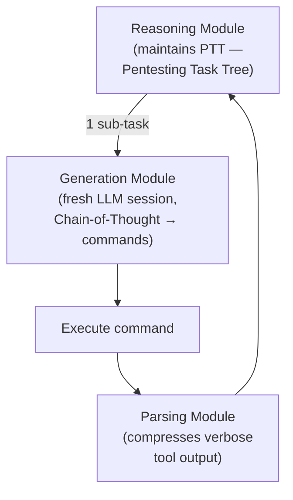

- **Benchmark / Vuln:** 13-machine HackTheBox (HTB) + VulnHub set, 182 sub-tasks.
- **Key result:** +228.6% over GPT-3.5, +58.6% over raw GPT-4; solves 5/10 active HTB machines; root cause of failure is context/session loss (74 occurrences), not tool inability.
- **CMatrix takeaway:** PTT maps directly onto CMatrix's Planner→Team Manager→Specialist hierarchy. Session/context loss finding directly motivates fresh-context-per-Specialist + FullCompact context reconstruction.

---

### 11. What Makes a Good LLM Agent for Real-World Penetration Testing? — PENTESTGPT v2 / EGATS (Evidence-Guided Attack Tree Search)
- **Methodology:** TDA (Task Difficulty Assessment, also called TDI — Task Difficulty Index — with 4 measurable dimensions) + EGATS — MCTS (Monte Carlo Tree Search)-style attack-tree search with UCB (Upper Confidence Bound) node selection and evidence backpropagation.

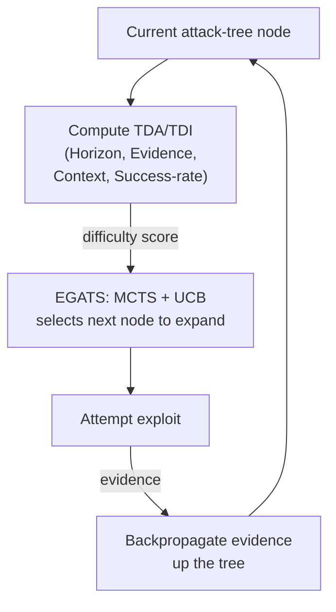

- **Benchmark / Vuln:** XBOW, 13-machine HTB (Hack The Box), 5-host GOAD (Game Of Active Directory) Active Directory.
- **Key result:** 91% XBOW (49% relative improvement), 4/5 GOAD hosts, top 100/8,036 in live HTB Season 8; TDA alone cuts Type-B failure rate 58%→27%.
- **CMatrix takeaway:** EGATS is the direct architectural ancestor of the VDG (Vulnerability Dependency Graph) — UCB-guided attack-tree exploration with evidence scoring. CMatrix's key differentiation: EGATS lacks formal *prerequisite* edges, which the VDG adds.

---

### 12. VulnBot — Autonomous Penetration Testing for a Multi-Agent Collaborative Framework
- **Methodology:** PTG (Penetration Task Graph); phase-scoped inter-agent communication; a Summarizer agent for context budget; RAG (Retrieval-Augmented Generation)-backed memory.

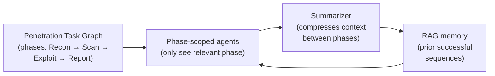

- **Benchmark / Vuln:** AUTOPENBENCH.
- **Key result:** 30.3% task completion / 69.05% subtask completion (vs. 9.09%/49.05% base); RAG boosts real-world subtask completion to 1.00 on WestWild.
- **CMatrix takeaway:** PTG and phase-scoped comms inform CMatrix's FSM (Finite State Machine) state design; Summarizer pattern validates the Structured Handoff Bridge; strong empirical case for the FAISS (Facebook AI Similarity Search)-backed 3-tier memory.

---

### 13. PentestAgent — Incorporating LLM (Large Language Model) Agents to Automated Penetration Testing
- **Methodology:** Hierarchical two-tier RAG (Retrieval-Augmented Generation — coarse attack surfaces → procedure-level exploits) + live online search agent + 4-prompt discipline (Role-play + CoT [Chain-of-Thought] + RAG + Structured Output).

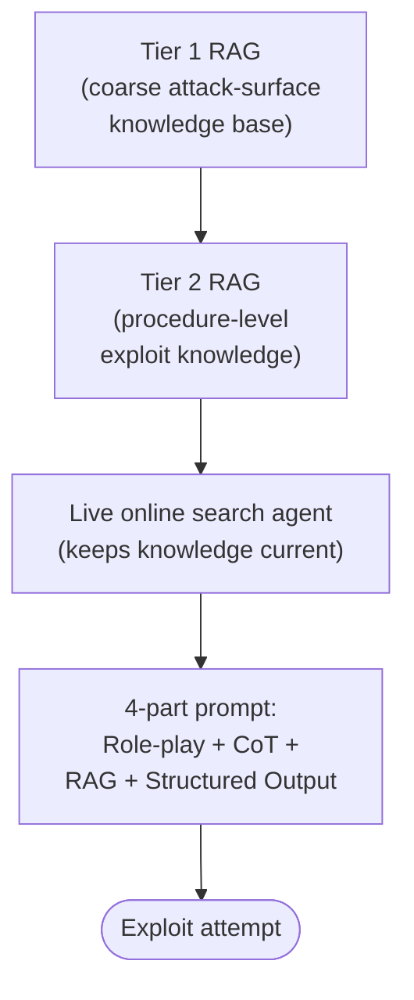

- **Benchmark / Vuln:** 67 VulHub CVE (Common Vulnerabilities and Exposures) targets; HackTheBox.
- **Key result:** 74.2% overall success (vs. PentestGPT much lower); completes 6/11 HTB (Hack The Box) machines vs. 3/11; 3× faster intelligence gathering.
- **CMatrix takeaway:** Shapes CMatrix's specialist knowledge-injection pipeline and structured-prompt discipline; hierarchical RAG informs the Strategy/Skill memory split.

---

### 14. Automated Penetration Testing with LLM (Large Language Model) Agents and Classical Planning — CHECKMATE
- **Methodology:** "Classical Planning+" — PDDL (Planning Domain Definition Language)-based planning replacing LLM-only planning, wrapped in the general PEP (Perceive-Evaluate-Plan) paradigm.

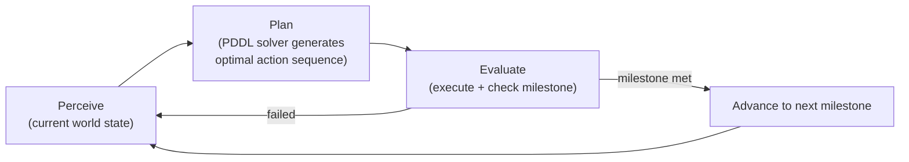

- **Benchmark / Vuln:** Vulhub, 120 targets, 11-milestone (M7) evaluation.
- **Key result:** 88% M7 milestone rate vs. Claude Code's ~65%; 61% cheaper; 42% faster; 100% stability vs. 75%.
- **CMatrix takeaway:** Strongest evidence for structure > freeform LLM planning, reinforcing declarative task dispatch. However, its PDDL approach cannot handle open-ended zero-day discovery — this is explicitly why CMatrix's "Hybrid Classical-Planning + VDG (Vulnerability Dependency Graph)" idea was **removed** as not evaluable (no operator library exists for zero-day targets).

---

### 15. D-CIPHER — Dynamic Collaborative Intelligent Multi-Agent System with Planner and Heterogeneous Executors
- **Methodology:** Planner–Team Manager–heterogeneous-Executor architecture; Auto-prompter pre-flight recon agent; MITRE ATT&CK (MITRE Adversarial Tactics, Techniques, and Common Knowledge)–grounded evaluation.

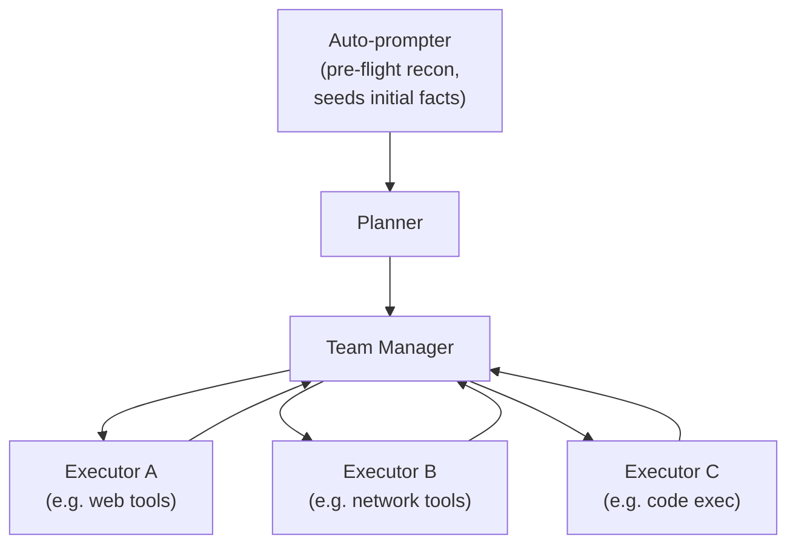

- **Benchmark / Vuln:** HackTheBox, Cybench, NYU (New York University) CTF (Capture The Flag) Bench.
- **Key result:** 44% HTB (Hack The Box) (vs. EnIGMA 26%), 22.5% Cybench, 22% NYU CTF Bench — SOTA (State-Of-The-Art) across all three, plus 65% more MITRE ATT&CK technique coverage.
- **CMatrix takeaway:** Blueprint for the Planner→Team Manager→Specialist hierarchy with heterogeneous executors; the "Auto-prompter" is adopted directly as CMatrix's unstructured initial-recon step that seeds the Environmental Layer.

---

### 16. Incalmo — An Autonomous LLM (Large Language Model)-assisted System for Red Teaming Multi-Host Networks
- **Methodology:** High-level declarative task API (Application Programming Interface) — `Scan`, `LateralMove`, `EscalatePrivilege`, `FindInfo`, `Exfiltrate` — decoupling planning from deterministic execution; Environment State + Attack Graph + C&C (Command and Control) services.

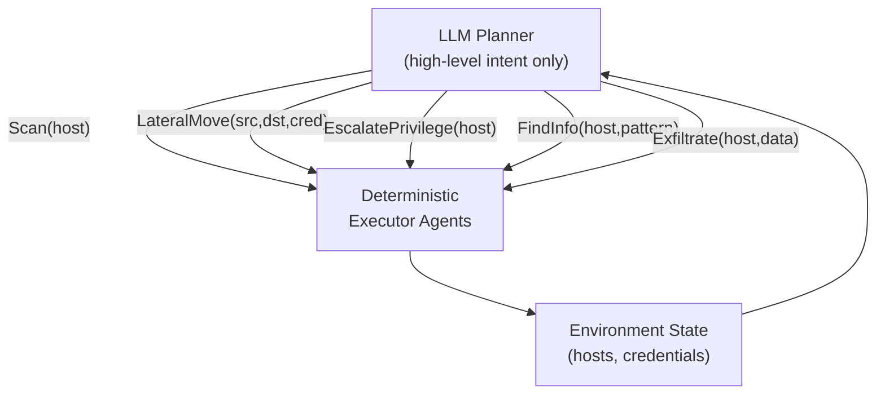

- **Benchmark / Vuln:** MHBench (Multi-Host Benchmark), 40 multi-host red-team environments (lateral movement, credential theft, privesc [privilege escalation]).
- **Key result:** 37/40 success vs. 3/40 for the best prior LLM system — a 12× improvement; works even with Haiku 3.5 (a smaller/cheaper Anthropic model).
- **CMatrix takeaway:** Adopted wholesale as the multi-host attack surface handler — the Lateral-Movement Specialist implements Incalmo's exact 5-verb API at the same abstraction level as web-surface verbs, so one VDG (Vulnerability Dependency Graph)/Team Manager drives both surface types. This is the single strongest empirical proof in the whole corpus for "declarative task dispatch beats raw command generation."

---

### 17. Can LLMs (Large Language Models) Hack Enterprise Networks? — cochise (Active Directory)
- **Methodology:** Planner/Executor separation studied on a real live AD (Active Directory) network (GOAD — Game Of Active Directory); first use of reasoning LLMs (o1) for pentesting.

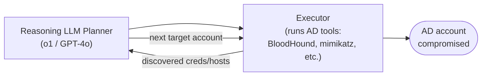

- **Benchmark / Vuln:** Live enterprise AD (Active Directory) network — user account compromise.
- **Key result:** First fully autonomous AD compromise on a real network; reasoning LLMs compromise 5.5× more accounts than non-reasoning; $17.56/account (vs. $10,080 human); DeepSeek-V3 hits $0.26/account.
- **CMatrix takeaway:** Reinforces Planner/Executor separation and Executor self-repair as mandatory patterns; real-network (non-synthetic) validation signal for the multi-host/AD surface, alongside Incalmo's MHBench (Multi-Host Benchmark).

---

### 18. CO-REDTEAM — Orchestrated Security Discovery and Exploitation with LLM (Large Language Model) Agents
- **Methodology:** 6-agent system with 3-tier long-term memory (Vulnerability-Pattern / Strategy / Technical-Action) and a closed Planner→Validation→Execution→Evaluation loop.

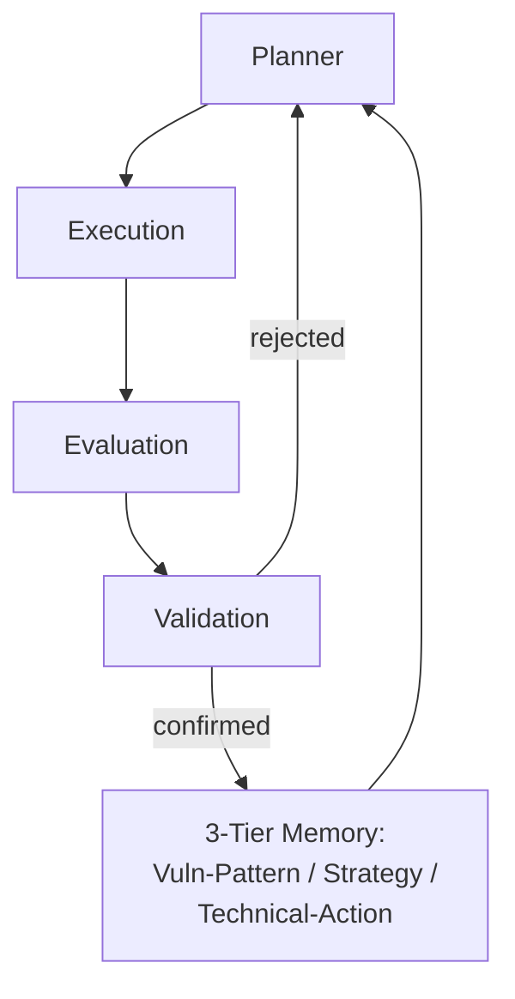

- **Benchmark / Vuln:** CyBench, BountyBench, CyberGym.
- **Key result:** 63.7% ASR (Attack Success Rate) (CyBench), 65.0% (BountyBench), 37.3% (CyberGym) — beats best baseline by +15.9/+17.5/+15.8pp (percentage points); removing execution feedback costs −41.6pp.
- **CMatrix takeaway:** Direct reference implementation for CMatrix's Layer 2–4 loop and its 3-tier memory subsystem; the execution-feedback ablation justifies mandatory Execution→Evaluation→Validation as a closed loop, not an optional check.

---

### 19. AutoGen — Enabling Next-Gen LLM (Large Language Model) Applications via Multi-Agent Conversation
- **Methodology:** ConversableAgent / UserProxyAgent / GroupChatManager primitives; general-purpose multi-agent conversation programming (domain-agnostic).

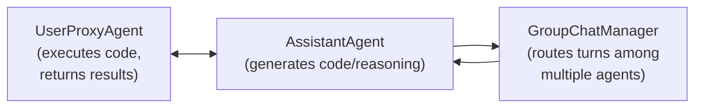

- **Benchmark / Vuln:** MATH dataset, ALFWorld, OptiGuide, unsafe-code detection — none security-specific.
- **Key result:** 69.48% MATH (vs. 55.18% GPT-4 alone); +15pp (percentage points) on ALFWorld with a 3rd grounding agent; 4× code reduction; +35pp F1 (harmonic mean of precision and recall) on unsafe-code detection.
- **CMatrix takeaway:** Foundational infra pattern underlying several surveyed VAPT (Vulnerability Assessment and Penetration Testing) systems; informs CMatrix's orchestration/human-in-the-loop layer conceptually, but not security-specific — treated as infrastructure, not an architectural source of novelty.

---

### 20. MetaGPT — Meta-Programming for a Multi-Agent Collaborative Framework
- **Methodology:** Encodes human SOPs (Standardized Operating Procedures) into agent prompt sequences; structured intermediate outputs; global message pool with subscription filtering.

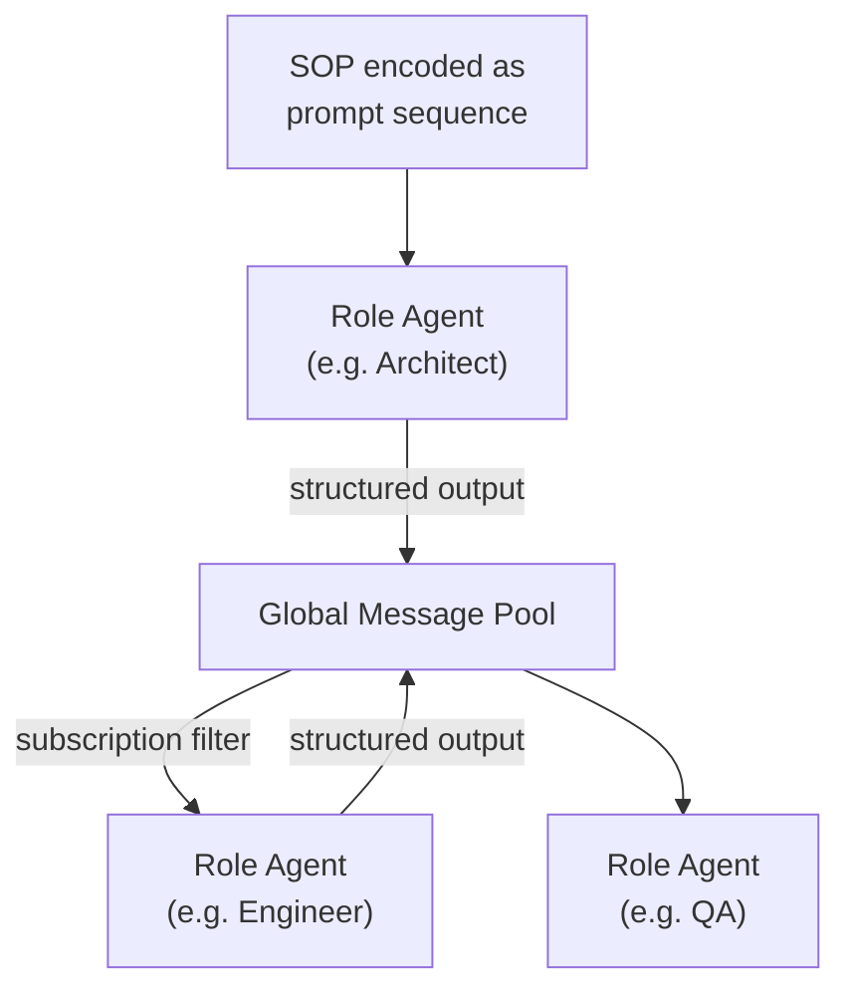

- **Benchmark / Vuln:** HumanEval, MBPP (Mostly Basic Python Problems), SoftwareDev (software engineering, not security).
- **Key result:** 85.9%/87.7% Pass@1; 3× fewer human revisions; executability 3.9/4.0 vs. ChatDev 2.1, AutoGPT 1.0.
- **CMatrix takeaway:** Validates SOPs-as-prompts (CMatrix's per-specialist knowledge-injection documents) and structured (not freeform chat) inter-agent handoffs — directly informs the Structured Handoff Bridge and Validation Agent's structured critique format.

---

### 21. Voyager — An Open-Ended Embodied Agent with LLMs (Large Language Models)
- **Methodology:** Lifelong-learning loop: automatic curriculum → executable skill library → iterative self-verification refinement (in Minecraft).

```mermaid
flowchart LR
    Curriculum["Automatic Curriculum\n(proposes next task\nbased on current skills)"] --> Attempt["Attempt task\n(generate + run code)"]
    Attempt -->|"success"| Skill["Add to Skill Library\n(reusable, composable)"]
    Attempt -->|"failure"| SelfVerify["Self-verification\n+ refine code"]
    SelfVerify --> Attempt
    Skill --> Curriculum
```

- **Benchmark / Vuln:** Minecraft open-world tasks (non-security).
- **Key result:** 3.3× more unique items discovered, 15.3× faster tech-tree unlock, 100% zero-shot task solve vs. 0% for baselines, using only the learned skill library.
- **CMatrix takeaway:** Direct prior art for CMatrix's Skill Library / cross-mission memory. Key adaptation: Voyager's skills are deterministic and linear; CMatrix's Strategy Memory must add **conditional branching** (e.g., WAF [Web Application Firewall]-adaptive payload switching) that game-world skills never require — this is C2's (Contribution 2's) specific security-domain contribution.

---

### 22. Reflexion — Language Agents with Verbal Reinforcement Learning
- **Methodology:** Converts a binary success/fail oracle signal into a natural-language "lesson learned" stored in a sliding-window episodic memory — no gradient updates.

```mermaid
flowchart LR
    Attempt["Agent attempt"] --> Oracle["Binary oracle\n(success/fail)"]
    Oracle -->|"fail"| Reflect["Verbal self-reflection\n(natural-language\nlesson learned)"]
    Reflect --> Memory["Episodic Memory\n(sliding window)"]
    Memory --> Attempt
    Oracle -->|"success"| Done(["Task complete"])
```

- **Benchmark / Vuln:** HumanEval, AlfWorld, HotPotQA (non-security).
- **Key result:** 91% pass@1 HumanEval (vs. 80% GPT-4); +22pp (percentage points) AlfWorld over 12 trials; +20pp HotPotQA.
- **CMatrix takeaway:** Formal basis for CMatrix's Episodic Failure Memory — the Validation Agent's Diagnosis-Adapt-Cap loop and the "reflection_text" field in FailureReflection are Reflexion's verbal self-reflection loop applied to exploit attempts.

---

### 23. Cybench — A Framework for Evaluating Cybersecurity Capabilities and Risks of LMs (Language Models)
- **Methodology:** CTF (Capture The Flag)-style evaluation with subtask partial-credit scoring; objective FST (First-Solve-Time) difficulty grounding; 4 agent scaffold variants compared across 8 models.

```mermaid
flowchart LR
    Task["CTF Task"] --> Scaffold["Agent Scaffold\n(1 of 4 variants)"]
    Scaffold --> Attempt["Attempt subtasks\n(partial credit)"]
    Attempt --> FST["Measure First-Solve-Time"]
    FST -->|"FST > 11 min unguided"| NoSolve(["No agent solves it"])
    FST -->|"FST ≤ 11 min"| Solve(["Solvable"])
```

- **Benchmark / Vuln:** 40 professional-level CTF tasks, 6 vulnerability categories.
- **Key result:** Claude 3.5 Sonnet solves 17.5% unguided / 43.9% subtask completion; hard ceiling at FST > 11 min unguided.
- **CMatrix takeaway:** Adopted as Tier 2b cross-benchmark generalization check; the FST-ceiling finding supports the Early Stopping Heuristic design (diminishing returns past a time threshold).

---

### 24. PentestEval — Benchmarking LLM (Large Language Model)-Based Penetration Testing with Modular and Stage-Level Design
- **Methodology:** 6-stage formalization — IC (Information Collection) → WG (Weakness Gathering) → WF (Weakness Filtering) → ADM (Attack Decision-Making) → EG (Exploit Generation) → ER (Exploit Reporting); ground-truth injection ablation per stage; compares vanilla autonomous agents to a SMP (Sequential Modular Pipeline).

```mermaid
flowchart LR
    IC["IC\nInformation\nCollection"] --> WG["WG\nWeakness\nGathering"]
    WG --> WF["WF\nWeakness\nFiltering"]
    WF --> ADM["ADM\nAttack Decision-\nMaking (hardest stage)"]
    ADM --> EG["EG\nExploit\nGeneration"]
    EG --> ER["ER\nExploit\nReporting"]
```

- **Benchmark / Vuln:** 9 LLMs × 346 tasks across 12 real web-app scenarios (ThinkPHP, Struts2, Flask, Spring, Jenkins).
- **Key result:** ADM (0.25) and EG-Functional (0.26) are the hardest stages; fully autonomous agents fail catastrophically (PentestAgent 3%, VulnBot 6%); ground-truth-ADM injection lifts SMP (Sequential Modular Pipeline) to 67% (2× vanilla).
- **CMatrix takeaway:** This is the paper CMatrix's central metric is validated against — Tier 1 benchmark and the direct source of the "Dependency-Reasoning Gap" (Failure Mode 2) that motivates the VDG's (Vulnerability Dependency Graph's) prerequisite/enables edges in the first place.

---

### 25. BountyBench — Dollar Impact of AI (Artificial Intelligence) Agent Attackers and Defenders on Real-World Cybersecurity Systems
- **Methodology:** Full vulnerability-lifecycle evaluation (Detect → Exploit → Patch) on real, evolving open-source systems with actual bug-bounty dollar values.

```mermaid
flowchart LR
    Detect["Detect\n(find the vuln,\nCWE-guided)"] --> Exploit["Exploit\n(working PoC)"]
    Exploit --> Patch["Patch\n(fix the vuln)"]
    Patch --> Dollar(["Real bug-bounty\ndollar value assigned"])
```

- **Benchmark / Vuln:** 25 real production systems (mlflow, langchain, FastAPI, gradio, curl, django, etc.), 27 CWEs (Common Weakness Enumerations), $10–$30,485 awards.
- **Key result:** Best Detect 12.5%, best Exploit 67.5% (Claude 3.7 Thinking, via self-verification), best Patch 90% (Codex CLI); zero-day detection is hard for everyone.
- **CMatrix takeaway:** Tier 5 (hardest tier) benchmark — real production systems, not sandboxes; dollar-value and cost-per-exploit reporting adopted as a co-primary metric category.

---

### 26. Forewarned is Forearmed — Survey on LLM (Large Language Model)-Based Agents in Autonomous Cyberattacks
- **Methodology:** Broad survey across all network types (enterprise, IoT [Internet of Things], satellite, blockchain, UAV [Unmanned Aerial Vehicle]); unified 5-component agent taxonomy (Perception, Memory, Reasoning, Tool Use, Multi-agent Collaboration).

```mermaid
flowchart TD
    Attack["Any cyberattack category\n(CTI, Pentest, Vuln Detection,\nPhishing, Malware, Exploitation,\nHoneypot, CTF)"] --> Cap["Requires all 5 capabilities:\nPerception, Memory, Reasoning,\nTool Use, Multi-agent Collaboration"]
    Cap --> Inflation(["Cyber Threat Inflation:\nlower cost, higher scale"])
```

- **Benchmark / Vuln:** N/A (meta-survey covering 40+ frameworks).
- **Key result:** Frames "Cyber Threat Inflation" — falling attack cost + rising attack scale/accessibility; all 8 cyberattack categories need all 5 capabilities at high intensity.
- **CMatrix takeaway:** Positioning/framing tool for CMatrix's motivation section, not an architectural source — used to argue why rigorous, benchmarked evaluation (C3, Contribution 3) matters for the field.

---

### 27. A Survey on Large Language Model Based Autonomous Agents
- **Methodology:** General (non-security) 4-component unified agent framework: Profile, Memory, Planning, Action.

```mermaid
flowchart LR
    Profile["Profile\n(role definition)"] --> Planning["Planning\n(with/without feedback)"]
    Planning --> Action["Action\n(goal, production,\nspace, impact)"]
    Action --> Memory["Memory\n(structure, format,\noperations)"]
    Memory --> Planning
```

- **Benchmark / Vuln:** N/A (surveys ReAct [Reason + Act], Reflexion, Voyager, MetaGPT, AutoGen, etc.).
- **Key result:** Maps 30+ agent systems onto the 4-component taxonomy; identifies 6 open challenges (role-playing, alignment, prompt robustness, hallucination, knowledge boundary, efficiency).
- **CMatrix takeaway:** Architecture-validation checklist only — confirms CMatrix's four layers map cleanly onto Profile/Memory/Planning/Action; no new mechanism adopted.

---

### 28. CVE-Bench (Common Vulnerabilities and Exposures Benchmark) — A Benchmark for AI (Artificial Intelligence) Agents' Ability to Exploit Real-World Web Application Vulnerabilities
- **Methodology:** `inspect_ai`-integrated, Docker-isolated benchmark with an automatic oracle server; zero-day and one-day lifecycle modes.

```mermaid
flowchart LR
    Agent["Agent under test"] --> Docker["Docker-isolated\ntarget CVE environment"]
    Docker --> Oracle["Automatic Oracle Server\n(8-attack-type check:\nDoS, File Access/Creation,\nDB Mod/Access, Admin Login,\nPrivesc, SSRF)"]
    Oracle -->|"pass"| Score(["pass@1 / pass@5\nscored"])
    Oracle -->|"fail"| Log["Logged as failure\n(exploration/reasoning/\ntool/validation)"]
```

- **Benchmark / Vuln:** 40 critical CVEs (Common Vulnerabilities and Exposures, CVSS [Common Vulnerability Scoring System] ≥ 9.0); 8-attack-type oracle (DoS [Denial of Service], File Access/Creation, DB [Database] Mod/Access, Unauthorized Admin Login, Privesc [Privilege Escalation], SSRF [Server-Side Request Forgery]).
- **Key result:** Best agent exploits 13% one-day / 10% zero-day; ZAP (Zed Attack Proxy) scanner and Llama 3.1 both 0%; insufficient exploration is the dominant failure mode (55–80% of failures).
- **CMatrix takeaway:** **CMatrix's primary evaluation benchmark (Tier 2)** and the direct source of Failure Mode 1 ("Insufficient Exploration") that the VDG's (Vulnerability Dependency Graph's) dependency-constrained frontier + full-surface recon defaults are architected to fix.

---

### 29. LLM (Large Language Model) Agents Can Autonomously Hack Websites
- **Methodology:** Single GPT-4 agent, no vulnerability-type hint given (harder than Paper 1's CVE [Common Vulnerabilities and Exposures]-description setting).

```mermaid
flowchart LR
    Target["Live website\n(no vuln hint given)"] --> Agent["GPT-4 Agent"]
    Agent --> Explore["Explore + hypothesize\nvuln class"]
    Explore --> Attempt["Attempt exploit"]
    Attempt -->|"success (73.3% sandbox,\n2% real-world)"| Win(["Exploited"])
    Attempt -->|"fail"| Explore
```

- **Benchmark / Vuln:** Same 15-vulnerability sandbox as Paper 1, plus 50-site real-world test.
- **Key result:** 73.3% pass@5 / 42.7% pass@1 sandboxed; only 8× cheaper than human ($9.81 vs $80); real-world drops to 2% (1/50 sites); 4 vuln classes (AuthBypass, JS [JavaScript] Attacks, Hard SQLi [SQL — Structured Query Language — Injection], XSS [Cross-Site Scripting]+CSRF [Cross-Site Request Forgery]) never solved.
- **CMatrix takeaway:** Confirms Paper 1's 15-vuln suite as CMatrix's Tier-0 benchmark and pass@5 (not pass@1) as the right capability metric for "one success is enough" real engagements; the same 4 unsolved vuln classes anchor CMatrix's differentiation targets, addressed via Session Persistence Service + multi-agent coordination.

---

## Cross-Cutting Pattern (what all 29 papers converge on)

| Recurring finding | CMatrix component that answers it |
|---|---|
| Architecture beats model scale | Four-layer hierarchy + declarative task dispatch |
| Flat/freeform planning loses to structure (FSM [Finite State Machine], SOPs [Standardized Operating Procedures], PTT [Pentesting Task Tree]) | Per-specialist sub-FSMs + knowledge-doc injection |
| Session/context loss is a top failure cause | Fresh context per Specialist + FullCompact + Session Persistence Service |
| Self-graded success produces false positives | Mandatory independent Validation Agent + oracle per surface |
| No system models attack prerequisites at scale | Vulnerability Dependency Graph (VDG) — CMatrix's core novelty |
| No system evaluates one architecture across multiple surfaces | Tier 0–6 suite spanning web, GraphQL, multi-host |

---

## Acronym Glossary (All Papers)

| Acronym | Full Form |
|---|---|
| LLM | Large Language Model |
| GPT | Generative Pre-trained Transformer |
| ReAct | Reason + Act (reasoning-and-acting agent loop) |
| CVE | Common Vulnerabilities and Exposures |
| CVSS | Common Vulnerability Scoring System |
| CWE | Common Weakness Enumeration |
| SQLi | SQL (Structured Query Language) Injection |
| XSS | Cross-Site Scripting |
| CSRF | Cross-Site Request Forgery |
| SSRF | Server-Side Request Forgery |
| SSTI | Server-Side Template Injection |
| LFI | Local File Inclusion |
| RCE | Remote Code Execution |
| IDOR | Insecure Direct Object Reference |
| JWT | JSON Web Token |
| DoS | Denial of Service |
| WAF | Web Application Firewall |
| DOM | Document Object Model |
| API | Application Programming Interface |
| REST | Representational State Transfer |
| GraphQL | Graph Query Language |
| I/O | Input/Output |
| RAG | Retrieval-Augmented Generation |
| FAISS | Facebook AI Similarity Search |
| FSM | Finite State Machine |
| PSM | Penetration Testing State Machine |
| PTT | Pentesting Task Tree |
| PTG | Penetration Task Graph |
| SOP | Standardized Operating Procedure |
| CoT | Chain-of-Thought |
| UCB | Upper Confidence Bound |
| MCTS | Monte Carlo Tree Search |
| EGATS | Evidence-Guided Attack Tree Search |
| TDA / TDI | Task Difficulty Assessment / Task Difficulty Index |
| VDG | Vulnerability Dependency Graph |
| PDDL | Planning Domain Definition Language |
| PEP | Perceive-Evaluate-Plan |
| HPTSA | Hierarchical Planning and Task-Specific Agents |
| MHBench | Multi-Host Benchmark |
| GOAD | Game Of Active Directory |
| AD | Active Directory |
| C&C | Command and Control |
| SSH | Secure Shell |
| VM | Virtual Machine |
| SUID | Set-owner-User-ID |
| ASR | Attack Success Rate |
| MITRE ATT&CK | MITRE Adversarial Tactics, Techniques, and Common Knowledge |
| SPS | Session Persistence Service |
| SMP | Sequential Modular Pipeline |
| IC | Information Collection |
| WG | Weakness Gathering |
| WF | Weakness Filtering |
| ADM | Attack Decision-Making |
| EG | Exploit Generation |
| ER | Exploit Reporting |
| CTF | Capture The Flag |
| HTB | Hack The Box |
| CUA | Computer-Use Agent |
| GUI | Graphical User Interface |
| SOTA | State-Of-The-Art |
| FST | First-Solve-Time |
| DB | Database |
| ZAP | Zed Attack Proxy |
| IoT | Internet of Things |
| UAV | Unmanned Aerial Vehicle |
| F1 (score) | Harmonic mean of precision and recall |
| MBPP | Mostly Basic Python Problems |
| PoC | Proof of Concept |
| ICSE | International Conference on Software Engineering |
| ESEC/FSE | European Software Engineering Conference / Foundations of Software Engineering |
| UIUC | University of Illinois Urbana-Champaign |
| NYU | New York University |
| AI | Artificial Intelligence |
