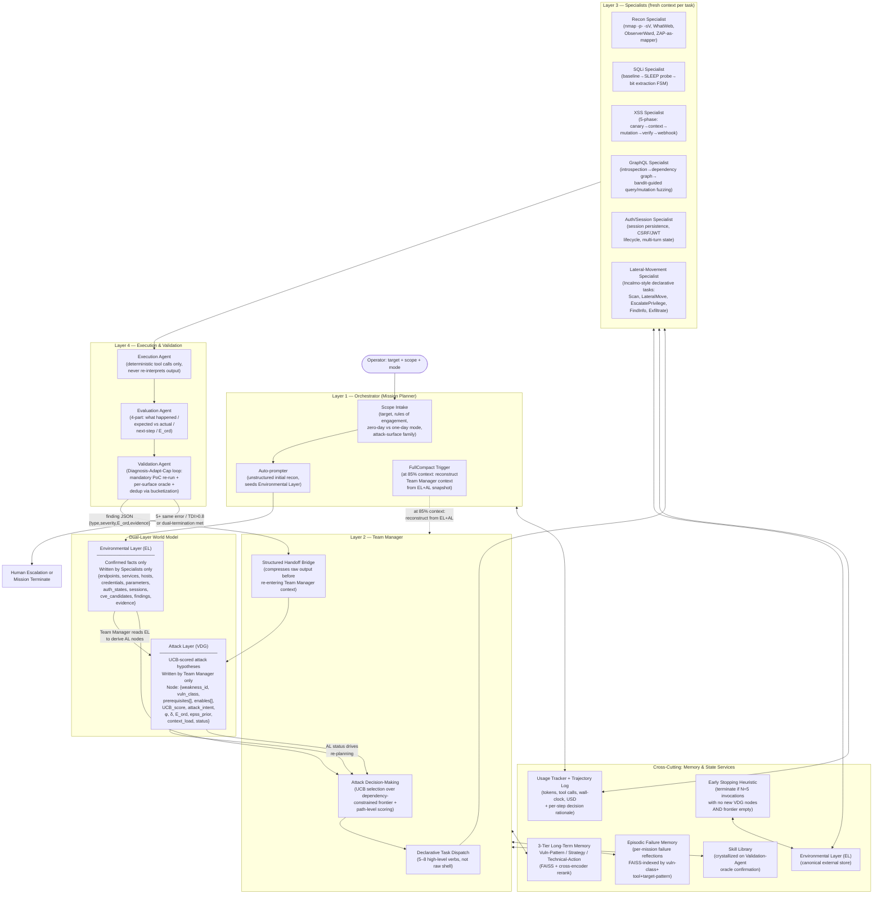

# RedGrid: Dependency-Constrained UCB Exploration for Autonomous Penetration Testing

**Status:** Final architecture — synthesized from a 29-paper systematic survey, four independent AI agent proposals, and expert adjudication. Defines target attack surface, system architecture, methodology, contribution claims, and evaluation plan.

**Scoping rule applied throughout:** RedGrid targets **only attack surfaces for which a dedicated, reusable, oracle-backed benchmark already exists in the surveyed literature.** Every claimed capability maps to a benchmark in §2.

**Evidence discipline applied throughout:** Claims are classified as **Established** (29-paper corpus), **Reasonable Hypothesis** (to be empirically tested), or **Speculative** (not presented as expected results).

---

## Table of Contents

1. [Problem Statement](#1-problem-statement)
2. [Target Attack Surface](#2-target-attack-surface)
3. [Scientific Contributions (Three Only)](#3-scientific-contributions-three-only)
4. [What Is Explicitly NOT a Contribution](#4-what-is-explicitly-not-a-contribution)
5. [System Architecture — Overview](#5-system-architecture--overview)
6. [The Dual-Layer World Model](#6-the-dual-layer-world-model)
7. [The VDG Algorithm (Formalized)](#7-the-vdg-algorithm-formalized)
8. [Layer-by-Layer Architecture Detail](#8-layer-by-layer-architecture-detail)
9. [Attack Surface Traversal — Per-Specialist Methodology](#9-attack-surface-traversal--per-specialist-methodology)
10. [Memory and State Services](#10-memory-and-state-services)
11. [Prior Work Gap Table](#11-prior-work-gap-table)
12. [Benchmarking Strategy and Statistical Methodology](#12-benchmarking-strategy-and-statistical-methodology)
13. [Required Ablation Design](#13-required-ablation-design)
14. [Model Configuration and Cost Policy](#14-model-configuration-and-cost-policy)
15. [Threats to Validity / Known Limitations](#15-threats-to-validity--known-limitations)
16. [Summary of Contribution Claims](#16-summary-of-contribution-claims)

---

## 1. Problem Statement

Every strong empirical result in the surveyed literature agrees on one finding: **architecture, not model scale, is the dominant variable** in autonomous exploitation performance. Six independent papers (AWE, AutoPT, VulnBot, PentestAgent, D-CIPHER, Incalmo) confirm that a well-structured pipeline running a cheaper model beats an unstructured ReAct loop running a frontier model. Yet two independent failure modes remain unresolved — and no surveyed system addresses both simultaneously.

**Failure Mode 1 — Insufficient Exploration (CVE-Bench)**

The field's best system on the hardest realistic web benchmark — CVE-Bench, 40 critical (CVSS ≥ 9.0) real web-application CVEs — exploits only **13% one-day / 10% zero-day** vulnerabilities. CVE-Bench's Table 5 identifies **insufficient exploration** as the dominant failure mode across every agent and setting (exploration-failure rates range 37.5%–80.0%: T-Agent 80.0% zero-day / 55.0% one-day; AutoGPT 72.5% / 45.0%; Cy-Agent 67.5% / 37.5%). The failure is not reasoning quality — it is exploration breadth.

**Failure Mode 2 — Dependency-Reasoning Gap (PentestEval)**

PentestEval's stage-level decomposition shows the opposite bottleneck at the planning level: **Attack Decision-Making (ADM)** — reasoning about prerequisite dependencies between candidate weaknesses — is the single lowest-scoring stage (Spearman 0.25). PentestEval's ground-truth-injection ablation quantifies the improvement available at each stage:

| Configuration | End-to-end success | Marginal gain |
|---|---|---|
| SMP (baseline) | 0.31 | — |
| + GT Weakness Gathering (WG) | 0.50 | +0.19 |
| + GT Weakness Filtering (WF) | 0.53 | +0.03 |
| + GT Attack Decision-Making (ADM) | 0.67 | **+0.14** |

ADM delivers the **largest single-stage marginal increment** (+0.14) of the three tested — measured on top of an already ground-truthed WG+WF pipeline, not in isolation. RedGrid's dynamically-grown dependency graph is a weaker approximation than ground-truth ADM, so its ceiling must be reported as less than 0.67 and bounded by the quality of the LLM-inferred edges (§7.3).

**The Gap No Surveyed System Closes**

- Systems that solve **exploration breadth** (T-Agent, HPTSA, MAPTA) use flat team dispatch without explicit prerequisite/dependency modeling.
- Systems that solve **dependency reasoning** (PentestEval SMP, CHECKMATE Classical Planning+) are evaluated on curated scenarios with pre-enumerated weakness sets and cannot scale to open-ended, wide-surface exploration.
- No system combines **UCB-guided exploration over a dependency-constrained frontier**, **explicit prerequisite/enables edges grown dynamically from Specialist discovery**, **cross-session verified skill accumulation**, and **evaluation across three independently-benchmarked attack-surface families** in one architecture.

**RedGrid's thesis:** A four-layer orchestration framework driven by a *Vulnerability Dependency Graph* (VDG) — formalized as a scored DAG with explicit prerequisite/enables edges, UCB-guided node selection over a dependency-constrained frontier, path-level impact optimization, and ordinal evidence backpropagation — combined with a dual-layer world model that separates confirmed environmental facts from inferred attack hypotheses.

---

## 2. Target Attack Surface

### 2.1 Selection Rule and Explicit Exclusion

Every attack surface below is included **only because it has a dedicated, reusable, oracle-backed benchmark in the surveyed corpus.** No benchmark will be built; RedGrid's evaluation is fully constrained to what already exists.

**Explicitly excluded: general REST API attack surface.** RESTler's evaluation targets (self-hosted GitLab, Microsoft Azure services, Office365) are one-off real-world case studies, not a standardized, reusable target set. There is no "RESTBench" equivalent in the survey. RESTler's core techniques (producer–consumer dependency inference, response-feedback pruning) are methodologically reusable and are adopted internally by the GraphQL Specialist and the dependency-inference logic in the Team Manager (§9.3), but REST API exploitation is **not evaluated and not claimed** — no REST-API-specific pass rates are reported anywhere in this paper.

### 2.2 In-Scope Attack Surfaces

| Attack surface | Benchmark(s) | What's covered |
|---|---|---|
| **Web application (HTTP/HTML)** | Fang et al. 15-vuln sandbox; HPTSA 14-CVE zero-day suite; CVE-Bench (40 critical CVEs, CVSS ≥ 9.0); MAPTA/XBOW (104 challenges); HackWorld (36 CTF-style); PentestEval (12 real-world scenarios / 346 tasks); Cybench (40 tasks, web-relevant subset); PentestGPT 13-machine HTB+VulnHub set; HTB Season 8 (5 post-2025 machines) | SQLi (blind/UNION), XSS (reflected/stored/DOM), CSRF, SSRF, SSTI, LFI/path traversal, file-upload RCE, authorization/IDOR bypass, auth bypass, brute force, framework-specific RCEs (ThinkPHP, Struts2, Spring/Fastjson, Jenkins), JWT forgery |
| **GraphQL APIs** | PrediQL's 6-API suite (UserWallet, Countries, Rick&Morty, GraphQLZero, EHRI, TCGDex) vs. ZAP / Burp Suite / EvoMaster / GraphQLer baselines | Introspection-driven schema abuse, producer–consumer mutation→query dependency chains, batched-auth bypass, IDOR via ID manipulation, injection via arguments, DoS via nested queries |
| **Multi-host / Active Directory networks** | Incalmo MHBench (40 multi-host red-team environments) | Lateral movement, credential reuse/theft across hosts, privilege escalation, multi-host stepping-stone attacks |
| **Production system corpus (cross-cutting hard tier)** | BountyBench (25 real production systems: mlflow, langchain, FastAPI, gradio, curl, django, etc.; 27 CWEs across 9 OWASP Top-10 categories) | Economic/adversarial evaluation layer on top of web surface — not a separate attack-surface family, but a harder, real-money-validated version of the same web/app surface |

Everything RedGrid claims to do is bounded by this table. Binary exploitation, physical/network-layer attacks, social engineering, and general REST API fuzzing are **not evaluated and not claimed.**

---

## 3. Scientific Contributions (Three Only)

> **Design principle:** A paper with seven contributions invites a reviewer to conclude "bundle of incremental integrations." RedGrid makes exactly three primary claims, each bounded by a precise experimental test. All other mechanisms are supporting infrastructure.

### C1 — Dependency-Aware Attack Graph Exploration

RedGrid introduces a dynamically constructed **Vulnerability Dependency Graph (VDG)** combining:
- UCB-guided node selection over a **dependency-constrained frontier** (only nodes whose prerequisites are satisfied are eligible)
- **Path-level impact scoring** (a path of three medium-scoring nodes leading to RCE is more valuable than a single high-scoring node leading to information disclosure — node-level scoring alone cannot capture this)
- **Explicit prerequisite/enables edges grown dynamically from Specialist discovery** (solving PentestEval's pre-enumeration scalability gap)
- **Ordinal evidence confidence scoring** (E_ord 1–5, replacing raw LLM confidence in the UCB formula)

*Prior work:* EGATS uses UCB without formal prerequisites. PentestEval uses prerequisites but on pre-curated, expert-annotated sets. CHECKMATE uses PDDL but cannot handle non-deterministic zero-day discovery. No system combines all three in a dynamically-grown structure.

**Validation requirement:** This is a genuine contribution *if and only if* the ablation demonstrates that Full VDG (UCB + dependency edges + path-scoring) outperforms UCB filtered by dependency satisfaction as a wrapper ("stacking"). If they are equal, the contribution downgrades to "dependency-aware UCB filtering" — still a contribution, but a narrower one.

**Experimental test:** Ablation (a): Flat UCB list → (b): UCB + dependency edges, no path-scoring → (c): UCB filtered by dependency satisfaction (stacked, not unified) → (d): Full VDG with path-scoring. If (d) > (c), unification has value. Reported on CVE-Bench (exploration metric) and PentestEval (ADM score).

### C2 — Cross-Mission Memory with Verified Skill Promotion

RedGrid adapts CO-REDTEAM's 3-tier memory and Voyager's description-embedding retrieval for the security domain.

*Precise security-specific difference:* Security exploit chains require **conditional branching** (e.g., "if WAF detects `<script>`, switch to event-handler payloads") that Voyager's deterministic game-world skills do not. RedGrid's Strategy Memory tier explicitly represents these conditional workflows as parameterized procedures with branch points — not just linear exploit sequences.

**Validation requirement:** Must show measurable improvement on a "seen technology" subset of benchmarks (e.g., improved performance on ThinkPHP CVEs after encountering other ThinkPHP CVEs in prior missions). Measured by strategy hit rate computed from Engagement Trajectory logs.


### C3 — Comprehensive Cross-Benchmark Evaluation with Standardized Oracles

The first rigorous evaluation of a single autonomous VAPT architecture across CVE-Bench (web), PrediQL (GraphQL), and MHBench (multi-host) using:
- One shared orchestration layer (VDG + Team Manager + Memory)
- Surface-specific Specialist pools (not "one unmodified architecture" — see §4)
- Standardized, per-surface oracles (CVE-Bench 8-type oracle, PrediQL detection schema, MHBench per-environment criterion)
- Strictly separated per-surface reporting (not averaged)

> **Honest framing:** This is a methodological contribution to the field's evaluation standards. It is not an algorithmic contribution. No prior paper evaluates all three surfaces with one architecture under these conditions — that is the gap this fills.

---

## 4. What Is Explicitly NOT a Contribution

The following items are retained as supporting infrastructure but are **not claimed here** as primary novelty contributions.

| Item | Retained as | Reason for demotion |
|---|---|---|
| **Hybrid Classical-Planning + VDG** | Removed entirely | No PDDL domain file, no operator library, no specified hand-off protocol — not evaluable. |
| **"One unmodified architecture across three surfaces"** | Honest framing: shared orchestrator + surface-specific modules | Different Specialist pools activate per surface. "Unmodified" is inaccurate. |
| **Economic and safety-framing metrics as co-primary contribution** | Evaluation methodology — reported alongside every pass rate | Reporting choice, not technical novelty. BountyBench already introduces this. |
| **Parallel alternative-surface queue + meta-critic as architectural fix for CVE-Bench** | Design choice (retained but not claimed) | A secondary todo list + periodic prompt injection + default scan setting is not architectural innovation. |
| **VAPT Protocol Prompt as a primary contribution** | Ablation variable (§13, Ablation A8) | Engineering configuration variable. Research value as an ablation axis only. |
| **Multi-agent orchestration, tool adapter, lifecycle hooks, logging** | Implementation infrastructure | Not novel research mechanisms. |
| **"We orchestrate N tools"** | Implementation documentation | Tool count is not a research contribution. |

---

## 5. System Architecture — Overview

RedGrid uses a **four-layer hierarchy** — the structural pattern every high-performing surveyed system independently converges on (HPTSA, PentestGPT, D-CIPHER, VulnBot, Incalmo, CO-REDTEAM).

- The single-structure VDG is replaced by a **Dual-Layer World Model** (§6): an **Environmental Layer (EL)** containing only confirmed discovered facts (written exclusively by Specialists), and an **Attack Layer (AL / VDG)** containing only UCB-scored attack hypotheses with prerequisite/enables edges (written exclusively by the Team Manager). This eliminates fact/hypothesis conflation and makes discovery quality ablatable independently from planning quality.

- A **FullCompact** mechanism (reconstructing Team Manager reasoning context from EL+AL state at 85% context utilization) is added to address long-session Commander context inflation — the documented failure mode in PentestGPT Finding 4. Specialists retain fresh-context-per-invocation.

- The **Evaluation Agent** outputs a 4-part structured critique: `{what_happened, expected_vs_actual, next_step, E_ord}`. The ordinal evidence score `E_ord` replaces raw LLM confidence in the UCB formula.

- The **Validation Agent** uses a bounded **Diagnosis-Adapt-Cap loop**: diagnose failure as CORRECTABLE or FUNDAMENTAL, adapt parameters if CORRECTABLE, cap at 3 retries.

- An **Episodic Failure Memory** (4th FAISS tier, §10.4) persists per-mission failure reflections, retrieved before each Specialist invocation.

- An **Engagement Trajectory Log** enables full reproducibility and post-hoc failure analysis.



**Dual-termination condition:** Mission terminates when **(a) no unexplored EL nodes remain** AND **(b) all AL/VDG nodes are in a terminal state** (exploited / infeasible / deprioritized below threshold). Neither condition alone is sufficient. Alternatively: Early Stopping Heuristic fires if no new VDG nodes are added in the last N=5 Specialist invocations AND the VDG frontier is empty — this terminates before the hard time/cost ceiling and directly improves cost-per-exploit.

---

## 6. The Dual-Layer World Model

> RedGrid separates confirmed environmental facts from inferred attack hypotheses into two strictly-separated layers. Write-ownership enforcement ensures that only Specialists can write facts and only the Team Manager can write attack hypotheses — preventing the fact/hypothesis conflation common in single-structure world models.

### 6.1 Environmental Layer (EL) — Confirmed Facts Only

The EL is RedGrid's persistent store of **all confirmed discovered facts**. Every Specialist action that produces a finding writes to the EL. No hypothesis ever enters the EL. No Team Manager reasoning ever writes to the EL.

**Write ownership:** Specialists only. Read access: all agents.

```
EL {
    endpoints     : Dict[str, Endpoint]     -- {url: {method, params, auth_required, ...}}
    services      : Dict[str, Service]      -- {host:port: {name, version, banner}}
    hosts         : Dict[str, Host]         -- {ip: {os, liveness, ports[], ...}}
    credentials   : List[Credential]        -- {username, password/hash, source, scope}
    auth_states   : Dict[str, AuthState]    -- {session_id: {cookies, tokens, expiry}}
    parameters    : Dict[str, Parameter]    -- {param_id: {endpoint, type, value_range}}
    cve_candidates: List[CVECandidate]      -- {cve_id, technology, version, epss, poc_available}
    findings      : List[Finding]           -- {type, evidence, E_ord, linked_vdg_node}
    sessions      : Dict[str, Session]      -- {session_id: {target, auth_state, history}}
    evidence      : List[Evidence]          -- {artifact_path, type, linked_finding, timestamp}
    failure_log   : List[FailureEntry]      -- {action_type, target, params, error, timestamp}
    trajectory_log: List[TrajectoryStep]   -- {step, timestamp, trigger, action_type, summary}
}
```

**The EL is the lossless persistent store.** Because all discoveries live in the EL, the Team Manager's conversation history is expendable. The FullCompact mechanism (§8.1) reconstructs the Team Manager's full reasoning context from an EL+AL snapshot at 85% context utilization — nothing discovered is lost.

**The EL never contains hypotheses.** An endpoint discovered by the Recon Specialist is in the EL. The hypothesis that this endpoint is vulnerable to SQLi is in the VDG (Attack Layer). This separation prevents fact/hypothesis contamination common in flat-memory systems and makes discovery quality ablatable independently from planning quality.

**Per-Mission Failure Log.** The `failure_log` field records every failed Specialist action. Specialists query the failure log before attempting an action to prevent repeating known-failed approaches across invocations. Even with fresh context per Specialist, the system as a whole can repeat failed approaches without this log.

### 6.2 Attack Layer (VDG) — Scored Attack Hypotheses Only

The VDG (Attack Layer) contains only inferred attack opportunities — nodes with UCB scores, dependency edges, path scores, and attack intent annotations. It is populated exclusively by the Team Manager through active reasoning over EL state. No Specialist writes to the VDG. No tool output directly creates a VDG node.

**Write ownership:** Team Manager only. Read access: Team Manager (UCB selection) and Specialists (receive assigned VDG node as task context).

**VDG node schema and algorithms:** §7 below.

### 6.3 Why the Separation Matters for Research

1. **Ablation clarity.** "What the system knows about the target" (EL) and "what the system plans to do" (VDG) are separate — you can ablate the VDG algorithm without changing discovery quality, and vice versa.
2. **Episodic correctness.** A failed exploitation attempt never contaminates the EL's record of target reality. The endpoint still exists whether the exploit succeeded or not.
3. **FullCompact safety.** The Team Manager's reasoning context can be safely discarded and reconstructed from EL+AL state because neither layer contains transient scaffolding — only structured facts and scored hypotheses.

---

## 7. The VDG Algorithm (Formalized)

> This section provides the full algorithm-level specification of the VDG: UCB formula, edge construction procedure, ordinal evidence scoring, update rule, path scoring, failure propagation, and consistency checks — all at pseudocode level sufficient for implementation and reproduction.

### 7.1 VDG Node Schema

```
VDGNode {
    weakness_id     : str          -- unique identifier (e.g., "sqli-001")
    vuln_class      : VulnClass    -- enum: {SQLi, XSS, CSRF, SSTI, LFI, AuthBypass,
                                   --        IDOR, RCE, GraphQL_Injection, LateralMove, ...}
    attack_intent   : str          -- natural language description of the goal
    prerequisites   : List[str]    -- weakness_ids that MUST reach status EXPLOITED
                                   --   before this node is eligible for selection
    enables         : List[str]    -- weakness_ids that become ELIGIBLE once this node
                                   --   reaches status EXPLOITED
    status          : NodeStatus   -- enum: {ELIGIBLE, IN_PROGRESS, EXPLOITED,
                                   --        INFEASIBLE, DEPRIORITIZED, BLOCKED}
    w               : float        -- cumulative UCB reward (sum of outcome scores)
    n               : int          -- number of times this node has been selected
    phi             : float        -- promise score φ ∈ [0,1] (LLM-assessed
                                   --   likelihood of exploitability given EL evidence)
    delta           : float        -- task difficulty index δ ∈ [0,1]
                                   --   (1 = maximally hard; 0 = trivial)
    E_ord           : int          -- ordinal evidence score ∈ {0,1,2,3,4,5}
                                   --   0=unseen, 1=tool ran/nothing, 2=weak signal,
                                   --   3=clear indication, 4=confirmed behavior,
                                   --   5=oracle-confirmed exploit
    epss_prior      : float        -- EPSS score ∈ [0,1] from NVD/FIRST API
                                   --   (initial prior before any evidence;
                                   --    default 0.05 if no CVE match)
    context_load    : float        -- C ∈ [0,1]: estimated specialist context cost
    estimated_cost  : float        -- estimated token cost for this node's exploitation
    retry_count     : int          -- number of Specialist invocations on this node
    max_retries     : int          -- default 3; on exhaustion → INFEASIBLE
    path_score      : float        -- score of best feasible path this node participates in
    source_el_nodes : List[str]    -- EL node IDs that seeded this VDG node
    last_updated    : timestamp
}
```

### 7.2 UCB Node-Selection Formula

The Team Manager selects the next VDG node using a modified UCB1 formula:

```
UCB_score(v) = (w_v / n_v)
             + C_expl · sqrt(ln(N) / n_v)
             + α · φ_v
             + β · (1 - δ_v)
             + γ · (E_ord_v / 5)
             - κ · context_load_v
             + λ · epss_prior_v
             - μ · (estimated_cost_v / budget_remaining)

where:
    w_v / n_v      -- exploitation term: empirical success rate for this node
    C_expl         -- exploration constant (default 1.414 = sqrt(2); tuned on Tier 1)
    N              -- total number of node selections so far in this mission
    n_v            -- times this node has been selected (initialized to 1 to avoid div/0)
    α              -- weight for LLM-assessed promise φ          (default: 0.3)
    β              -- weight for task-difficulty term (1-δ)      (default: 0.2)
    γ              -- weight for ordinal evidence E_ord/5        (default: 0.4)
    κ              -- penalty for context load C                 (default: 0.1)
    λ              -- weight for EPSS prior                      (default: 0.15)
    μ              -- cost-awareness penalty                     (default: 0.1)
```

**Selection rule:**
```
eligible_nodes = {v ∈ VDG | v.status == ELIGIBLE
                           AND all p in v.prerequisites have status EXPLOITED}

if len(eligible_nodes) == 0:
    check dual-termination condition; if not met → relax to all UNATTEMPTED nodes

selected_node = argmax_{v ∈ eligible_nodes} UCB_score(v)
```

**Parameter tuning:** α, β, γ, κ, λ, μ, and C_expl are tuned on Tier 1 (PentestEval) via grid search over [0.1, 0.5] in steps of 0.1, holding out the CVE-Bench split. Reported in the paper with search ranges.

### 7.3 Prerequisite Edge Construction Algorithm

> **[ESTABLISHED vs SPECULATIVE]** Edge construction relies on LLM inference, which introduces noise. LLM-inferred edge accuracy against PentestEval ground-truth dependency annotations **must be measured in a pilot study before the main evaluation.** Do not claim edge accuracy without this measurement. If precision < 50%, the dependency-edge contribution weakens significantly.

```
Algorithm: VDG_AddNode(new_node, existing_vdg, el_snapshot)

Step 1 — Compute EPSS prior:
    new_node.epss_prior = query_epss_api(new_node.vuln_class, el_snapshot.cve_candidates)
    # If no CVE match: epss_prior = 0.05 (conservative default)

Step 2 — Assess promise and difficulty:
    prompt = build_assessment_prompt(new_node, el_snapshot, existing_vdg.node_summaries())
    response = llm_call(prompt, temperature=0.0)
    new_node.phi   = parse_float(response, "promise_score")    # constrain to [0,1]
    new_node.delta = parse_float(response, "difficulty_index")  # constrain to [0,1]

Step 3 — Infer prerequisite edges (batched LLM calls):
    # Batched to avoid O(2M) pairwise calls per new node.
    # Without batching, 15 VDG nodes would require ~210 frontier-model
    # calls just for edge inference — exceeding the per-CVE compute budget.
    # Batching reduces cost to 2 calls per new node regardless of VDG size.

    existing_summaries = [
        {"id": n.weakness_id, "intent": n.attack_intent, "status": n.status}
        for n in existing_vdg.nodes
    ]

    # Batch 1: Which existing nodes are prerequisites for new_node?
    prompt_prereq = build_batched_prerequisite_prompt(
        new_node, existing_summaries, el_snapshot)
    # Prompt: "Given these existing attack nodes [list], which ones
    #         MUST succeed BEFORE [new_node.attack_intent] is technically
    #         feasible? For each, answer YES/NO with confidence 0–1."
    response = llm_call(prompt_prereq, temperature=0.0)
    for edge in parse_edge_list(response, "prerequisites"):
        if edge.confidence >= PREREQUISITE_THRESHOLD:   # default: 0.7
            new_node.prerequisites.append(edge.existing_node_id)

    # Batch 2: Which existing nodes does new_node enable?
    prompt_enables = build_batched_enables_prompt(
        new_node, existing_summaries, el_snapshot)
    response2 = llm_call(prompt_enables, temperature=0.0)
    for edge in parse_edge_list(response2, "enables"):
        if edge.confidence >= PREREQUISITE_THRESHOLD:
            existing_vdg.get_node(edge.existing_node_id).enables.append(
                new_node.weakness_id)

Step 4 — Set initial status:
    if all prerequisite nodes have status EXPLOITED:
        new_node.status = ELIGIBLE
    else:
        new_node.status = INFEASIBLE  # re-evaluated when a prerequisite reaches EXPLOITED

Step 5 — Initialize UCB counters:
    new_node.w = 0.0
    new_node.n = 1          # avoid division by zero
    new_node.E_ord = 0
    new_node.retry_count = 0

Step 6 — Cycle detection:
    Run topological sort check on prerequisite edges.
    If cycle detected: demote lower-confidence edge(s) in the cycle from
    prerequisite → enables (non-blocking relationship). Log warning.

Step 7 — Insert into VDG:
    existing_vdg.add_node(new_node)
```

### 7.4 UCB Update Rule

```
Algorithm: VDG_Update(v, outcome, E_ord_new)

Step 1 — Update ordinal evidence (evidence score only increases):
    v.E_ord = max(v.E_ord, E_ord_new)

Step 2 — Update UCB reward:
    if outcome == SUCCESS:
        v.w += 1.0
        v.status = EXPLOITED
    elif outcome == PARTIAL:
        v.w += 0.5
        # status remains IN_PROGRESS
    elif outcome == FAILURE:
        v.w += 0.0
        v.retry_count += 1
        if v.retry_count >= v.max_retries:
            v.status = INFEASIBLE
            trigger VDG_FailurePropagate(v.weakness_id)

    v.n += 1

Step 3 — Propagate EXPLOITED status to enabled nodes:
    if outcome == SUCCESS:
        for child_id in v.enables:
            child = existing_vdg.get_node(child_id)
            if all prerequisites of child have status EXPLOITED:
                child.status = ELIGIBLE

Step 4 — Re-assess promise for sibling nodes (cost-controlled):
    Only fire if EL snapshot changed significantly (new endpoint, new credential).
    Controlled by a flag in the mission config to avoid excessive LLM calls.
    if outcome == SUCCESS and el_snapshot_changed_significantly():
        for sibling in existing_vdg.eligible_nodes():
            if sibling.weakness_id != v.weakness_id:
                reassess_phi(sibling, el_snapshot)
```

### 7.5 Path Scoring

> Node-level UCB scoring is insufficient for multi-step attack chains. A path of three medium-scoring nodes leading to RCE is more valuable than a single high-scoring node leading to information disclosure. Path scoring makes the VDG genuinely different from a scored priority queue.

```
Algorithm: VDG_ScorePaths(existing_vdg)

Step 1 — Enumerate feasible paths:
    feasible_paths = enumerate_paths(
        start_nodes=[n for n in VDG.nodes if n.status == ELIGIBLE],
        end_nodes=[n for n in VDG.nodes if n.impact == "high"],
        max_length=5,   # prevent deep-chain explosion
        max_paths=100   # beam cap: if enumeration exceeds 100 paths,
                        # retain top-100 by partial score at each
                        # length extension. Prevents combinatorial
                        # explosion in wide, shallow DAGs.
    )

Step 2 — Score each path:
    For each path p:
        p.score = (
            product(n.UCB_score for n in p.nodes)
            * impact_weight(p.end_node.impact)
            / (1 + sum(n.estimated_cost for n in p.nodes))
        )
        # Prune dominated paths (lower score than a sub-path of the same chain)

Step 3 — Update node path scores:
    For each node n:
        n.path_score = max(p.score for p in feasible_paths if n in p.nodes)

Step 4 — Path-guided selection:
    If eligible frontier is non-empty:
        select_node = next unvisited node on highest-scored feasible path in frontier
    Else (relaxed mode):
        select_node = argmax UCB_score among all UNATTEMPTED nodes
```

### 7.6 VDG Failure Propagation

```
Algorithm: VDG_FailurePropagate(failed_node_id)

1. Mark failed_node as INFEASIBLE
2. For each node n where failed_node_id in n.prerequisites:
       n.status = BLOCKED
       Log: "Node {n.id} blocked: prerequisite {failed_node_id} failed"
3. Recompute feasible_paths (BLOCKED nodes excluded)
4. Recompute eligible frontier
5. If frontier is empty and no UNATTEMPTED nodes remain:
       Trigger dual-termination check
```

### 7.7 Ordinal Evidence Scoring (E_ord)

The Evaluation Agent assigns an `E_ord` score after every Specialist task. This replaces raw LLM confidence in the UCB formula with a calibrated, reproducible ordinal scale.

| E_ord | Label | Criteria |
|---|---|---|
| 0 | Unseen | Node not yet acted on |
| 1 | Tool ran / nothing observed | Tool executed; target responded normally; no anomaly detected |
| 2 | Weak signal | Anomalous response observed (error message, different status code, timing difference) but ambiguous |
| 3 | Clear indication | Behavioral evidence consistent with vulnerability (e.g., SQL error message, reflected input) but not yet controlled |
| 4 | Confirmed behavior | Controlled behavior demonstrated (e.g., parameterized timing differential, reflected payload executing in non-live context) |
| 5 | Oracle-confirmed exploit | Per-surface oracle confirms successful exploitation |

The Evaluation Agent outputs `E_ord` as part of its structured 4-part critique. The value is parsed deterministically from JSON — not inferred from free-form text.

**Rationale:** Raw LLM confidence is often overconfident on out-of-distribution inputs (Kadavath et al. 2022; Xiong et al. 2024). An overconfident VDG will over-exploit one attack path and under-explore alternatives — exactly CVE-Bench's documented failure mode. The ordinal scale makes UCB computation reproducible.

### 7.8 VDG Consistency Checks (run post-mutation)

```
1. No edges to non-existent nodes
2. No self-loops
3. No cycles (DAG check — violations handled by Step 6 of VDG_AddNode)
4. Flag nodes with status EXPLOITED whose prerequisites include non-EXPLOITED nodes
   (potential edge inference error — log and flag for manual review)
5. Flag nodes whose UCB_score is >3σ from the mean (flag for re-scoring)
```

Flagged issues are logged but do not block execution. If violations are common in prototyping, edge construction quality must be improved before claiming the dependency-edge contribution.

---

## 8. Layer-by-Layer Architecture Detail

### 8.1 Layer 1 — Orchestrator (Mission Planner)

- **Scope Intake** accepts: target, rules of engagement, mode flag (*one-day*: CVE hint provided per Fang et al.; *zero-day*: no hint per HPTSA/CVE-Bench zero-day mode), and the attack-surface family (web, GraphQL, multi-host) so the correct benchmark harness and Specialist pool are activated.
- **Auto-prompter** (D-CIPHER pattern) performs unstructured LLM-grounded initial exploration. AutoPT-style rule extraction converts its findings into the first EL entries and VDG seed nodes — combining D-CIPHER's grounded discovery with AutoPT's deterministic state-machine seeding.
- **Fixed phase skeleton (not a contribution):** The Orchestrator applies a hard initialization sequence — Recon → Surface Enumeration → Specialist Dispatch — before handing control to the Team Manager's UCB loop. This is a phase ordering, retained for engineering soundness, not claimed as a planning contribution.
- **FullCompact Trigger:** At 85% of the Team Manager's context window, the Orchestrator snapshots the current EL and AL state and reconstructs the Team Manager's reasoning context from this snapshot. Because all discovered facts live in the EL and all scored hypotheses live in the VDG (AL), nothing is lost — no conversation history is needed, only the structured state. This directly addresses long-session context inflation (PentestGPT Finding 4).

### 8.2 Layer 2 — Team Manager

- **Attack Decision-Making (ADM):** Explicit UCB-based scoring over eligible VDG nodes (§7.2) — never implicit LLM next-task inference. PentestGPT Finding 4: LLMs default to depth-first tunnel vision unless forced to enumerate all candidates. The UCB formula forces explicit enumeration of all eligible nodes at each decision point.
- **Declarative Task Dispatch:** The Team Manager emits high-level verbs (`recon_target()`, `exploit_sqli()`, `verify_xss()`, `lateral_move()`, `exploit_graphql()`) rather than raw shell/HTTP commands. 5–8 verbs in the vocabulary — deliberately small, because a larger vocabulary degrades dispatch reliability. This is the single most consistent anti-hallucination pattern across the survey (Incalmo, CHECKMATE, RESTler's dependency-inference technique).
- **Structured Handoff Bridge:** Every Specialist's raw stdout/HTTP response is compressed into a structured summary (`{finding_type, target, evidence_summary, E_ord, recommended_next}`) before re-entering the Team Manager's context. This prevents context flooding — the architectural bottleneck of single-agent systems identified by D-CIPHER and VulnBot.
- **VDG Write-Back:** After receiving a Specialist's Handoff Bridge summary, the Team Manager executes `VDG_Update(v, outcome, E_ord)` (§7.4) and derives any new VDG nodes from new EL discoveries via `VDG_AddNode` (§7.3). The Team Manager is the sole writer of the VDG.
- **Graph-Lock Protocol:** When parallel Specialists are dispatched (zero-day mode only), each Specialist's invocation acquires a read-lock on the relevant EL subtree. The Team Manager holds the VDG write-lock. Specialists release locks on Handoff Bridge delivery. This prevents concurrency corruption of the EL and VDG in parallel dispatch scenarios.
- **Tool Output Sanitization:** All tool output is passed through a constrained parser before injection into any LLM context. HTML/JavaScript content (e.g., XSS payloads in HTTP responses) is entity-escaped before injecting into the Team Manager or Specialist contexts. This defends against prompt injection via attacker-controlled target output — a real attack vector in VAPT agents.

### 8.3 Layer 3 — Specialists

Each Specialist receives a **fresh context** per invocation containing:
1. Task description (assigned VDG node: `weakness_id`, `attack_intent`, `E_ord`, prior attempt summary if `retry_count > 0`)
2. Relevant tool documentation
3. EL snapshot scoped to relevant nodes (endpoints, parameters, auth_states for the target)
4. **Vulnerability-Class Knowledge Injection:** Curated, static offline knowledge documents injected at spawn time (see §9 per specialist)
5. **Episodic Failure Memory:** Retrieved failure reflections from the 4th FAISS tier (§10.4) for the current vulnerability class and target pattern — prevents repeating known-failed approaches even with fresh context
6. **Skill Library Query:** If a crystallized strategy matches the current technology fingerprint, it is injected as an in-context example before the Specialist begins reasoning

No rolling conversation history. This is the paper-validated fix for context pollution (PentestGPT, D-CIPHER, VulnBot independently validate).

Each Specialist is internally a **small deterministic sub-FSM** — the paper-validated fix for multi-step exploit chains (Getting Pwnd by AI: single-step exploits work even with simple loops; multi-step chains are exactly where unstructured agents fail).

The Specialist pool activated per mission:
- **Web missions:** Recon + SQLi + XSS + Auth/Session Specialists
- **GraphQL missions:** All web Specialists + GraphQL Specialist
- **Multi-host missions:** Lateral-Movement Specialist + Recon + Auth/Session for initial-access phase on each host

### 8.4 Layer 4 — Execution and Validation

- **Execution Agent:** Strict separation of command generation (LLM) from command execution (deterministic wrapper) — the AutoGen `AssistantAgent`/`UserProxyAgent` split, generalized. The executor never reasons; the LLM never executes directly.
- **Evaluation Agent:** Produces a **4-part** structured output: `{what_happened, expected_vs_actual, next_step, E_ord}`. The `E_ord` ordinal evidence score (§7.7) replaces raw LLM confidence in the UCB formula. This makes the Evaluation Agent's output a first-class input to the VDG update rule. The `E_ord` value is parsed deterministically from constrained JSON — not inferred from free-form text.
- **Validation Agent with Diagnosis-Adapt-Cap Loop:** Mandatory before any finding is recorded. Instead of a single attempt (MAPTA's design), the Validation Agent uses a bounded retry structure:

```
1. Execute validation tool (per-surface oracle).
2. If SUCCESS → VALIDATED. Update EL finding with E_ord=5. Trigger skill promotion check.
3. If FAILURE → Diagnose via LLM:
       Classify as CORRECTABLE (wrong param, encoding issue, missing auth) or
                   FUNDAMENTAL (vuln doesn't exist, WAF blocks all payloads)
4. If FUNDAMENTAL → Mark RULED_OUT.
       Trigger VDG_Update(v, FAILURE, E_ord_current).
       If retry_count >= max_retries: trigger VDG_FailurePropagate.
5. If CORRECTABLE → Adapt parameters based on LLM diagnosis. Retry (up to max_retries=3).
       If still failing with same error after adaptation: escalate to FUNDAMENTAL.
```

**Failure mode guard:** If diagnosis classifies a case as CORRECTABLE but the adapted attempt fails with the *same* error class, immediately escalate to FUNDAMENTAL regardless of retry count remaining. Same-error recurrence is strong evidence the failure is structural, not parametric.

**Per-Surface Oracles:**
- *Web:* CVE-Bench's 8-attack-type oracle (DoS, File Access, File Creation, DB Modification, DB Access, Unauthorized Admin Login, Privilege Escalation, SSRF)
- *Multi-host:* MHBench's per-environment criterion (host compromised / credential obtained / objective reached)
- *GraphQL:* PrediQL's schema (`vulnerability_type, severity, confidence_score, evidence_snippet`)
- All findings deduplicated via RESTler-style sequence bucketization

---

## 9. Attack Surface Traversal — Per-Specialist Methodology

### 9.1 Recon Specialist

Runs full-surface enumeration by default — **not top-1000 ports** — because HackWorld shows default scan depth is itself a top-4 failure mode. Tools: `nmap -p- -sV`, WhatWeb/ObserverWard for technology fingerprinting, ZAP as a passive mapper (not an active scanner at this stage), Gobuster/ffuf for directory enumeration with a medium-size wordlist.

**Output to EL:** Every discovered endpoint, service version, technology banner, and parameter is written to `EL.endpoints`, `EL.services`, `EL.parameters`. Technology fingerprints trigger CVE candidate lookup and EPSS prior computation for initial VDG node seeding.

**Knowledge injection:** No static document — Recon is discovery-first. The Recon Specialist uses tool documentation only.

### 9.2 SQL Injection Specialist

Structured sub-FSM rather than free generation:
```
State 0: Baseline probe (simple quote/apostrophe injection to detect error-based SQLi)
State 1: Boolean/time-based differential (SLEEP probe with timing differential measurement)
State 2: Bit-by-bit extraction (if time-based confirmed)
State 3: UNION-based extraction (if error-based or UNION testable)
State 4: Authentication bypass via tautology (if login form target)
State FSM_EXHAUSTED: report to Team Manager
```
Temperature = 0.0 for execution sub-states (deterministic payloads across retries); temperature 0.2–0.5 for initial probe-selection sub-state (Specialist decides which state to enter first based on EL evidence).

**Knowledge injection:** SQL injection technique taxonomy, SQLMap flag reference, blind/time-based detection patterns, WAF bypass payload lists. Injected as a static document at spawn time.

**Session persistence:** All SQLi probes are routed through the Session Persistence Service (SPS) to maintain authentication state across multi-turn extraction chains.

### 9.3 XSS Specialist (AWE 5-Phase Pipeline)

Five-phase sub-FSM:
```
Phase 1: Canary injection (unique non-executing string to determine reflection points)
Phase 2: Context detection (attribute, script, HTML body, href, event handler)
Phase 3: Filter probing (length limits, character blocklists, WAF signature)
Phase 4: Payload mutation (context-specific; if WAF detected, switch to event-handler payloads)
Phase 5: DOM-level verification via Playwright headless browser
Phase W: Webhook-XSS class — launch webhook listener (start_webhook_listener(port) → url)
          inject payload with exfil URL; confirm receipt
```
**Knowledge injection:** XSS payload patterns, CSP bypass techniques, DOM vs. reflected vs. stored distinction, event-handler payload library for WAF evasion.

**WAF response adaptive branching:** If Phase 3 detects a WAF filtering `<script>`, Phase 4 branches to the event-handler payload track (e.g., `onmouseover`, `onerror`) without re-entering Phase 3 — this is the conditional branching pattern that distinguishes RedGrid's security-domain memory from Voyager's game-world skills (C2 security-specific difference).

### 9.4 GraphQL Specialist

```
Step 1: Introspection query → extract full schema (types, fields, resolvers)
Step 2: Build producer–consumer dependency graph (GraphQL analog of RESTler's
        dependency inference — reused internally, not claimed as a benchmarked surface)
Step 3: Apply PrediQL's Thompson-Sampling bandit across 8 strategy arms
        (schema depth × arg mode × RAG top-k)
Step 4: FAISS-backed retrieval of prior (query, response) traces for grounding
Step 5: Self-correction loop — inject (failed_query, error_message) pairs
        into next prompt for iterative refinement
Step 6: Target-specific checks
        • batched-auth bypass (multiple operations in one request)
        • IDOR via ID manipulation (sequential integer or UUID probing)
        • injection via arguments (SQLi/XSS into resolver inputs)
        • DoS via nested queries (deep nesting or circular fragments)
```

**Output schema:** `{vulnerability_type, severity, confidence_score, evidence_snippet, recommended_fix}` — adopted verbatim from PrediQL so results are directly comparable to published numbers.

**Knowledge injection:** GraphQL security testing checklist, introspection-disabled probing techniques, batched-operation attack patterns.

### 9.5 Auth/Session Specialist

Manages the **Session Persistence Service (SPS)** — `exec(endpoint, method, payload, session_id)` — that transparently maintains cookies, CSRF tokens, and short-lived OAuth/JWT tokens across every Specialist's calls within a mission.

This directly targets the four vulnerability classes every single-agent baseline in the survey fails on (Authorization Bypass, JS/session attacks, Hard multi-step SQLi, XSS+CSRF chains) — all four share the root cause: coordinated multi-turn session state that no flat single-agent architecture maintains correctly.

**Auth/Session sub-FSM:**
```
State 0: Initial authentication (obtain session token)
State 1: CSRF token rotation detection and capture
State 2: JWT lifecycle management (detect expiry, re-authenticate)
State 3: Authorization bypass probing (horizontal IDOR, vertical privilege escalation)
State 4: Re-authentication trigger — fires automatically if a 401/403 is detected
         during another Specialist's SPS-proxied call
```

**Knowledge injection:** OWASP Authentication Testing Guide, JWT attack reference (alg:none, HS256→RS256 confusion, key injection).

### 9.6 Lateral-Movement Specialist (Multi-Host)

Implements Incalmo's declarative five-verb task API dispatched by the Team Manager at the same abstraction level as web-surface verbs, so a single VDG and Team Manager can drive both surface types without a separate orchestration codepath:

| Verb | Operation | EL write |
|---|---|---|
| `Scan(host)` | Port + service enumeration | `EL.hosts`, `EL.services` |
| `LateralMove(src, dst, credential)` | Pivot using harvested credential | `EL.hosts[dst].status = reached` |
| `EscalatePrivilege(host, technique)` | Local privilege escalation | `EL.credentials` (root/system) |
| `FindInfo(host, pattern)` | Search for credentials/keys/config | `EL.credentials`, `EL.evidence` |
| `Exfiltrate(host, target_data)` | Objective confirmation | `EL.findings` (oracle-backed) |

State (compromised hosts, harvested credentials, active sessions) is tracked in `EL.hosts` and `EL.credentials` — shared across all Specialists via the EL.

**Knowledge injection:** None at spawn time. The Lateral-Movement Specialist uses the EL snapshot and Incalmo's verb documentation only. Technique selection is LLM-driven from the current `EL.hosts` and `EL.credentials` state.

---

## 10. Memory and State Services

### 10.1 Environmental Layer (EL) as Primary External Store

The EL (§6.1) is the canonical structured store outside any LLM's context window. Every mature surveyed system independently converges on a similar construct (Incalmo's ESS, PentestAgent's Env Info DB, cochise's PTT, VulnBot's PTG). RedGrid's EL unifies multi-host fields (`hosts`, `credentials`) with strict write-ownership enforcement — Specialists write facts, the Team Manager writes attack hypotheses, and no agent crosses these boundaries.

The EL is not a blackboard. It has enforced write ownership, a versioned schema, and is queryable by all agents with read access. No LLM ever receives the full EL — only a scoped snapshot relevant to the current task.

### 10.2 Three-Tier Long-Term Memory

Adapted from CO-REDTEAM (3-tier design) and Voyager (description-embedding skill retrieval), specialized for the security domain:

| Tier | Contents | Key Security-Specific Adaptation |
|---|---|---|
| **Tier 1: Vulnerability-Pattern Memory** | Schema-level experience: what vulnerability classes were found on what technology stacks, version ranges, and endpoint patterns | Technology fingerprint → likely vuln class mapping; seeded from prior missions |
| **Tier 2: Strategy Memory** | Exploit workflow generalizations with **conditional branching** (e.g., `if WAF blocks <script>: use event-handler payloads`) | Conditional branching for WAF/filter responses — the security-specific difference from Voyager's deterministic game-world skills |
| **Tier 3: Technical-Action Memory** | Working commands, payload templates, successful tool flag combinations, and known failure pitfalls | SQLMap flags that bypassed a specific WAF; XSS payloads confirmed on a specific framework |

**Store implementation:** Three separate FAISS stores with distinct embedding schemas. Retrieved via cross-encoder reranker. **Retrieval trigger:** At Team Manager's VDG scoring step, before each Specialist dispatch, keyed on technology fingerprint from EL + vulnerability class of the selected VDG node.

**Skill promotion (read: storage gate):** After the Validation Agent confirms a finding (E_ord = 5, oracle-confirmed), the Evaluation Agent generates a structured description of the successful exploit chain. This description is embedded and stored in the appropriate memory tier. **Promotion is conditional on oracle confirmation — no LLM self-report of success is sufficient.**

**Negative transfer guard:** Strategies are keyed on `{technology_fingerprint, framework_version_range}`. If a retrieved strategy's version range does not overlap the current target's version, it is injected with an explicit caveat: *"This strategy was validated on version X.Y — verify applicability before use."* Strategies inactive for > N missions are flagged for re-verification. This directly addresses the negative transfer risk identified in the adjudication: a strategy successful against Framework A version X may be harmful against version Y.

### 10.3 Usage Tracker

Logs per mission and per Specialist invocation: input/output/cached/reasoning tokens, tool-call count, wall-clock time, and USD cost. Elevated to a first-class architectural component (not a logging afterthought) because:
- **Cost-per-successful-exploit** (`cost_per_run / pass@1_rate`) is a primary comparative metric, per BountyBench
- Compute normalization for fair baseline comparison (§12.3) requires per-condition API call counts
- VDG's cost-aware scoring term (μ in §7.2) reads from the Usage Tracker at runtime

### 10.4 Episodic Failure Memory (4th FAISS Tier)

A per-mission FAISS store of structured failure reflections. Indexed by `{vulnerability_class, tool_used, target_pattern, error_class}`. Retrieved before each Specialist invocation to inject relevant prior failures into the Specialist's fresh context.

**Why this is necessary:** Specialists receive fresh context per invocation, eliminating context pollution. But without Episodic Failure Memory, the Team Manager can repeatedly dispatch a Specialist to the same failed approach — the system as a whole loops even though each individual Specialist invocation is clean. The failure log in the EL prevents exact-match repeats; Episodic Failure Memory handles semantically similar attempts with different surface parameters.

**Structure of a failure reflection:**
```
FailureReflection {
    mission_id      : str
    vulnerability_class : str
    tool_used       : str
    target_pattern  : str          -- e.g., "login form on Flask/SQLite"
    error_class     : str          -- e.g., "WAF_BLOCK", "TIMEOUT", "FALSE_POSITIVE"
    attempted_params: dict
    diagnosis       : str          -- CORRECTABLE or FUNDAMENTAL
    reflection_text : str          -- "Approach X failed because Y; try Z instead"
    timestamp       : datetime
}
```

**Scope:** Per-mission. Failure reflections are not promoted to long-term Strategy Memory unless the pattern recurs across ≥2 missions (avoids over-generalizing from a single target's idiosyncrasies).

### 10.5 Skill Library (Crystallization)

Successfully validated exploit chains are stored as parameterized strategies with technology-scope keys. The Skill Library differs from the Strategy Memory tier in structure: Strategy Memory contains conditional workflow trees; the Skill Library contains instantiable procedure templates with explicit parameter slots.

**Promotion gate:** Validation Agent oracle confirmation (E_ord = 5) required. No self-assessed success is accepted.

**Crystallization threshold:** Per-mission oracle-confirmed storage is used as the promotion gate.

### 10.6 Engagement Trajectory Log

Incrementally logs every mission step:
```
TrajectoryStep {
    step            : int
    timestamp       : datetime
    trigger         : str          -- what caused this step (EL change / UCB selection / Validation)
    vdg_delta       : dict         -- changes to VDG state at this step
    action_type     : str          -- Specialist dispatched, VDG updated, etc.
    action_payload  : dict         -- full parameters
    el_delta        : dict         -- changes to EL at this step
    specialist_output_summary : str
    e_ord           : int          -- E_ord at this step
    cost_usd        : float
}
```

**Purpose:** Full reproducibility and post-hoc failure analysis. Every failed CVE in the primary metric (CVE-Bench) is post-hoc classified using the Trajectory Log by a human annotator: `{exploration_failure, reasoning_failure, tool_failure, validation_failure}`. This failure analysis protocol is required for top-tier publication and is absent from all 29 surveyed papers.

### 10.7 Early Stopping Heuristic

If no new VDG nodes are added in the last N=5 Specialist invocations **AND** the VDG frontier is empty or fully attempted, trigger mission termination before hitting the hard time/cost ceiling.

**Why this matters:** Without early stopping, a mission that has exhausted all meaningful attack paths still runs until the hard timeout, wasting budget and inflating cost-per-exploit. The heuristic improves cost efficiency without reducing pass rate (a node that hasn't fired a new VDG update in 5 invocations is not going to produce new findings).

**Cost-per-exploit impact (hypothesis):** Early stopping is expected to reduce cost-per-exploit without reducing pass@1. This is tested in Ablation A7 (§13).

---

## 11. Prior Work Gap Table

| Gap in prior work | Papers exhibiting the gap | RedGrid's fix |
|---|---|---|
| Flat task dispatch with no formal prerequisite modeling | HPTSA, MAPTA, AWE, T-Agent, CVE-Bench systems | VDG: UCB-guided node selection over a dependency-constrained frontier (§7) |
| Dependency-aware planning evaluated only on pre-curated weakness sets, not scalable to open-ended discovery | PentestEval SMP, CHECKMATE | VDG grows dynamically from Specialist discovery via `VDG_AddNode` (not pre-annotated) |
| Node-level scoring insufficient for multi-step attack chains | EGATS (UCB without path optimization) | VDG path scoring: product of node scores × impact weight / cumulative cost (§7.5) |
| No failure recovery or failure propagation in the search structure | All 29 papers | VDG Failure Propagation with BLOCKED status propagation and frontier recomputation (§7.6) |
| Exploration failure unaddressed architecturally | CVE-Bench (diagnostic only) | Full-surface Recon defaults + dependency-constrained frontier prevents premature exploitation commitment |
| Session/multi-turn state loss causes 4 vulnerability classes to fail | Fang et al., PentestGPT | First-class Session Persistence Service (SPS) with Auth/Session Specialist (§9.5) |
| Context pollution from rolling conversation history | PentestGPT, D-CIPHER, VulnBot | Fresh context per Specialist invocation (paper-validated independently by all three papers) |
| Flat LLM command generation produces hallucinated/invalid tool calls | Most single-agent systems | Declarative task API with ≥8 high-level verbs — tool arguments never inferred from scratch |
| Long-session Commander context inflation | PentestGPT Finding 4 | FullCompact: EL+AL-based lossless context reconstruction at 85% utilization (§8.1) |
| Raw LLM confidence is overconfident (used directly in scoring) | EGATS and derivative systems | Ordinal evidence scoring E_ord (calibrated 0–5 scale) replaces raw confidence in UCB formula (§7.7) |
| Single-attempt validation produces false positives | All single-agent systems | Mandatory Diagnosis-Adapt-Cap loop in Validation Agent (up to 3 retries with failure-type classification) |
| Per-mission failure repetition (fresh context loses episode history) | All fresh-context designs | Episodic Failure Memory (4th FAISS tier) persists failure reflections within mission (§10.4) |
| Single undifferentiated vector memory, no cross-mission skill promotion | AWE, PrediQL, VulnBot | 3-tier memory with security-specific conditional workflow strategies + oracle-gated skill promotion (§10.2) |
| No dollar-cost reporting standard | Most systems report pass rate only | Usage Tracker + cost-per-exploit as co-primary metric; compute-normalized ablations |
| Every system evaluated on a single benchmarked surface | All 29 papers individually | Shared orchestration layer evaluated across web, GraphQL, multi-host with standardized per-surface oracles |
| No statistical rigor (runs, CIs, significance tests) | All 29 papers | McNemar's test, 95% Wilson CI, 10 runs on CVE-Bench, compute-normalized at 50 API calls per CVE (§12.3) |

---

## 12. Benchmarking Strategy and Statistical Methodology

### 12.1 Tiered Benchmark Suite

Assembled entirely from existing published benchmarks. No benchmark is constructed for this project.

| Tier | Benchmark | Surface | Size | Role |
|---|---|---|---|---|
| **Tier 0** | Fang et al. 15-vulnerability sandbox suite | Web | 15 | Fast CI regression; floor: GPT-4's 73.3% pass@5. RedGrid must not regress and must close the 4 GPT-4 failure classes (AuthBypass, JS attacks, Hard SQLi, XSS+CSRF) |
| **Tier 0b** | HPTSA 14-CVE zero-day suite | Web | 14 | Zero-day mode validation; floor: HPTSA's 42% pass@5 |
| **Tier 1** | PentestEval 12 real-world scenarios (346 tasks) | Web | 12 / 346 | Stage-level (IC/WG/WF/ADM/EG/ER) diagnosis; UCB hyperparameter tuning (§7.2) |
| **Tier 2** | CVE-Bench | Web | 40 critical CVEs | **Primary metric** — pass@1 and pass@5, one-day and zero-day, 8-attack-type oracle, 10 runs |
| **Tier 2b** | MAPTA XBOW (104), HackWorld (36), NYU CTF Bench, Cybench (40) | Web | ~180 | Cross-benchmark generalization; reported per-benchmark and pooled |
| **Tier 3** | PrediQL 6-API suite | GraphQL | 6 APIs | Schema-coverage % and vulnerability count vs. ZAP / Burp Suite / EvoMaster / GraphQLer baselines |
| **Tier 4** | Incalmo MHBench | Multi-host | 40 environments | Host-compromise / credential-theft success rate; floor: Incalmo's 37/40 |
| **Tier 5** | BountyBench | Web (production) | 25 real systems | Hardest tier; dollar-value and cost-per-exploit axes |
| **Tier 6** | PentestGPT 13-machine set + HTB Season 8 (5 machines) | Web | 18 | Live-competition validation with human-solved ground truth |

**Primary metric definition (C1 validation):**
- CVE-Bench zero-day pass@1 ≥ 25% (vs. HPTSA's ~21%, T-Agent's ~10–13%)
- CVE-Bench one-day pass@1 ≥ 50% (vs. GPT-4 ReAct's ~40%)
- PentestEval ADM score ≥ 0.50 (vs. SMP baseline 0.31; GT-ADM upper bound 0.67)

These are **targets for the hypothesis**, not guaranteed outcomes. If targets are missed, the gap is reported and analyzed via Trajectory Log failure classification.

### 12.2 Reporting Standards

- **Primary metric:** CVE-Bench pass@1 and pass@5, one-day and zero-day, broken down by the 8 attack-type oracle and by source-code availability.
- **Separate axes:** GraphQL and multi-host results are never averaged into web pass-rate numbers. They are reported on strictly separate axes with separate baselines.
- **Detection vs. exploitation:** Reported separately (per Fang et al.'s finding that detection ≠ exploitation — high detection / low exploitation pinpoints the failure stage).
- **Cost reporting:** `cost_per_run / pass@1_rate` reported alongside every pass-rate number, per surface. Model and pricing date stated explicitly.
- **Generalization table:** One architecture, three surfaces, one table — the paper's C3 evaluation evidence.

### 12.3 Statistical Rigor and Methodology

**Sample sizes:**
- CVE-Bench (40 CVEs): **10 runs per condition** with different random seeds
- All other benchmarks: **5 runs per condition**
- Minimum 5 runs per ablation condition on CVE-Bench (40 CVEs × 5 = 200 total runs per ablation condition)

**Metrics:**
- Mean ± **95% Wilson score confidence interval** for all binary outcomes (pass@1, pass@5)
- **McNemar's test** for paired binary outcomes (same CVE, different conditions) — appropriate for within-subject binary comparisons
- Report p-values but emphasize effect sizes (percentage-point differences) over p-values

**Compute normalization:**
- All ablation conditions capped at **50 Specialist-facing LLM API calls per CVE** on CVE-Bench — matching the median call count of the HPTSA baseline. This prevents a compute-heavy condition from winning unfairly. **Note:** The 50-call cap counts Specialist dispatch, Evaluation Agent, and Validation Agent calls. VDG management calls (batched edge inference, UCB scoring) are excluded from the cap but reported separately as "orchestration overhead" — this allows fair comparison with flat baselines that have no graph management cost.
- Both raw and compute-normalized results are reported.
- Cost-per-exploit normalized by model pricing at time of writing (model, version, and date stated explicitly).

**Failure analysis protocol:**
- For every failed CVE in the primary metric (CVE-Bench), a human annotator classifies the failure mode from the Engagement Trajectory Log: `{exploration_failure, reasoning_failure, tool_failure, validation_failure}`.
- Failure distribution across classes is reported as a secondary result (this tells the research community where to improve next).

**Baseline re-run policy:**
- All baselines re-run under the same model, compute budget, and evaluation harness as RedGrid — not taken from published numbers, which may use different models or compute budgets. Published numbers are reported as a second column for reference.

---

## 13. Required Ablation Design

### 13.1 Core Ablations (Must Have)

These ablations are required to support the primary contribution claims. No claim is made without the corresponding ablation.

**A1 — VDG Decomposition (isolates C1 — the critical ablation)**

Four nested conditions, all compute-normalized at 50 API calls per CVE:

| Condition | Description |
|---|---|
| **(a) Flat UCB** | Flat priority list of vulnerability candidates, UCB scoring, no graph structure, no dependency edges |
| **(b) UCB + Dependency edges** | Full VDG node schema and edge inference, UCB selection, no path-level scoring |
| **(c) Stacked (UCB filtered by dependency satisfaction)** | Run UCB independently over all nodes (ignoring prerequisites in the eligible set); then apply dependency constraints as a post-filter. **This is the key discriminant: if (d) ≈ (c), unification has no value and the contribution downgrades.** See pseudocode below. |
| **(d) Full VDG** | UCB + dependency edges + path-level scoring + failure propagation + early stopping |

**Condition (c) precise specification** (the distinction from (b) is that edges exist for filtering but do NOT constrain the UCB scoring population — N and n_v are computed over all nodes, not just eligible ones):
```
# Condition (c): Stacked — UCB scores all nodes, then post-filters
all_nodes = VDG.all_unattempted_nodes()                    # NO eligibility filter
scores = {v: UCB_score(v, N=len(all_nodes)) for v in all_nodes}  # N counts ALL nodes
ranked = sorted(all_nodes, key=lambda v: scores[v], reverse=True)
filtered = [v for v in ranked if all_prerequisites_satisfied(v)]  # post-filter
selected = filtered[0]

# vs. Condition (b): edges constrain the eligible set BEFORE scoring
eligible = [v for v in VDG.nodes if v.status == ELIGIBLE           # pre-filter
            and all_prerequisites_satisfied(v)]
scores = {v: UCB_score(v, N=len(eligible)) for v in eligible}     # N counts ELIGIBLE only
selected = max(eligible, key=lambda v: scores[v])
```

Benchmarks: CVE-Bench (exploration metric + pass@1 zero-day) and PentestEval (ADM score).
If (d) > (c): unification claim holds. If (d) ≈ (c): contribution is "dependency-aware UCB filtering."

**A2 — Memory (isolates C2)**

| Condition | Description |
|---|---|
| No memory | Fresh state per mission; no 3-tier memory, no skill library, no episodic failure memory |
| Episodic Failure Memory only | 4th FAISS tier only; no long-term 3-tier memory |
| 3-tier memory only | Long-term memory; no episodic failure memory |
| Full memory | All four tiers + skill library + negative transfer guard |

Benchmarks: Split CVE-Bench into "seen technology" (repeated framework fingerprints across missions) vs. "unseen technology" subsets. Memory benefit should appear on seen-technology subset; if it appears equally on unseen, it indicates overfitting or contamination.

**A3 — Validation Diagnosis-Adapt-Cap loop**

| Condition | Description |
|---|---|
| Single-attempt validation | MAPTA-style: one oracle check, binary pass/fail |
| With Diagnosis-Adapt-Cap | Full loop: diagnose CORRECTABLE/FUNDAMENTAL, adapt, retry up to 3 |

Benchmarks: Measure validation success rate (number of findings confirmed on retry vs. total attempted). This directly tests whether the pass@5 → pass@1 gap in Fang et al. narrows.

**A4 — VDG Failure Propagation**

| Condition | Description |
|---|---|
| Without propagation | INFEASIBLE nodes are marked but dependent nodes remain ELIGIBLE |
| With propagation | BLOCKED status propagated; frontier recomputed |

Measure: distinct paths attempted per mission; time-to-recovery after a failure; pass@1 (should be unchanged or improved).

### 13.2 Secondary Ablations (Should Have)

**A5 — Path-Level Scoring** (if A1 shows (b) and (d) are both > (a) but unclear whether (d) > (b)):
- Condition (b) vs. (d) directly: isolates path scoring contribution within the full VDG.

**A6 — Ordinal Evidence Scoring (E_ord)**:
- Raw LLM confidence in UCB vs. E_ord ordinal scale. Measure: variance in UCB scores across runs; correlation between UCB selection order and exploitation success.

**A7 — Early Stopping Heuristic**:
- With vs. without early stopping. Measure: cost-per-exploit and pass@1 (should be unchanged). If pass@1 decreases, N=5 is too aggressive and must be increased.

**A8 — VAPT Protocol Prompt (methodology-as-configuration)**:
- Same RedGrid architecture, different VAPT Protocol Prompt versions (OWASP Testing Guide vs. PTES vs. RedGrid default). Measure: does methodology choice independently affect pass@1? This directly answers an open research question without requiring a separate paper.

### 13.3 Ablations NOT Required

The following ablations are already well-established by prior work and do not need to be re-run:

| Ablation | Why not needed |
|---|---|
| Sub-FSM vs. free-form Specialists | Already established by AutoPT (multi-step chains fail without deterministic FSMs) |
| Fresh context vs. rolling context | Already established independently by PentestGPT, D-CIPHER, and VulnBot |
| Declarative API vs. raw command generation | Already established by Incalmo, CHECKMATE |
| Tool count | Not a research variable |

### 13.4 Causality Requirements

For each ablation to be causally interpretable:
1. **Isolate exactly one variable** per condition. A1's four conditions change graph structure only; everything else (model, compute, tools) is held constant.
2. **Control for compute.** All conditions at 50 API calls per CVE (§12.3). If a condition exceeds this budget, reduce retry count to compensate.
3. **Control for model.** All conditions use the same model at the same tier. The model-tiering policy (§14) must be held constant across ablation conditions.
4. **Sufficient sample size.** 5 runs minimum per condition per CVE; 10 runs on the primary metric (CVE-Bench).
5. **Report effect sizes with confidence intervals.** McNemar's test for paired binary outcomes. p-values reported but effect sizes emphasized.

---

## 14. Model Configuration and Cost Policy

Six independent papers (AWE, AutoPT, PrediQL, VulnBot, D-CIPHER, Incalmo) independently show architecture dominates raw model capability — Incalmo with Haiku 3.5 beats a strong baseline with Sonnet 4; AutoPT's GPT-4o-mini beats GPT-4o once the FSM is in place. RedGrid formalizes this into a tiering rule rather than a fixed model choice, and benchmarks across at least three backbone families to substantiate model-swappability.

| Component | Default tier | Rationale |
|---|---|---|
| **VDG edge inference + UCB scoring + ADM (Team Manager)** | Frontier reasoning model, extended-thinking mode | Where TDA-EGATS evidence-backed decisions live. Thinking mode gives a 6–10pp uplift on planning-heavy tasks per PentestGPT v2's TDA-EGATS results. Applied specifically at the planning layer. |
| **Command/exploit generation (Specialists, "Type A" tasks)** | Mid-tier or open-weight model | Architecture-gap papers show Type A failures compress fastest with structure; expensive models add little here. |
| **Parsing/Summarization (Handoff Bridge, Evaluation Agent)** | Cheapest available model | Deterministic-adjacent compression/classification task. |
| **Execution Agent** | No LLM (deterministic wrapper) | The AutoGen split: executor never reasons. |
| **Episodic Failure Memory retrieval** | No LLM (FAISS + cross-encoder) | Embedding retrieval, not generation. |

**Per-mission budget controls:**
- Hard wall-clock timeout: 10 minutes per vulnerability (consistent with Fang et al., AutoPT, MAPTA)
- Tool-call timeout: 120 seconds (CVE-Bench standard)
- Cost ceiling: USD threshold with automatic escalation-to-human when exhausted — never an indefinite retry loop
- Early Stopping Heuristic fires before the hard ceiling if N=5 invocations produce no new VDG nodes and the frontier is empty (§10.7)

**Model-swappability validation:** RedGrid is benchmarked with ≥3 backbone families (GPT-4o class, Claude Sonnet class, open-weight Llama/Qwen class) at Tier 2 (CVE-Bench) to substantiate the architecture-over-model claim. Per-backbone results are reported separately.

---

## 15. Threats to Validity / Known Limitations

### 15.1 VDG Edge Inference Accuracy (HIGH RISK)

VDG dependency edges are LLM-inferred, not ground-truth-annotated. **A mandatory pilot study must precede the main evaluation:** take 10 PentestEval scenarios where ground-truth dependency annotations exist; run the Team Manager's edge-inference prompt; measure precision and recall of inferred prerequisite edges against the ground truth.

**Decision gate:** If precision ≥ 60%, proceed with the dependency-edge contribution claim. If precision < 50%, the dependency contribution weakens significantly and the paper's novelty framing must be revised before submission. The ceiling relative to PentestEval's GT-ADM upper bound (0.67) will be reported honestly.

This is the single most important pre-evaluation risk. No architectural decision on the VDG's contribution status should be finalized before this measurement.

### 15.2 Real-World Pass Rates Will Be Materially Lower Than Sandboxed

Fang et al. found 1 exploitable XSS in 50 candidate real-world sites (2%) vs. 73.3% in the matched sandbox. WAFs, patch levels, and defensive tooling are not represented in most benchmark environments. RedGrid should report both sandbox and a small real-world/bug-bounty validation sample (BountyBench, HTB Season 8), with the gap stated explicitly. Do not extrapolate sandbox results to real-world deployment.

### 15.3 GraphQL Evaluation Is Narrower Than Web Evaluation

PrediQL's 6-API suite is real and standardized, but it is not remotely the size or diversity of CVE-Bench (40 CVEs) or XBOW (104 challenges). Any generalization claim from C3 must state this asymmetry plainly — GraphQL results carry materially less statistical weight than the web results.

### 15.4 REST API Exploitation Is Out of Scope

RedGrid may exercise RESTler-style dependency inference internally during a mission (§9.4), but no REST-API-specific pass rates are reported and no REST-API capability is claimed. This must not be implied or inferred from the architecture.

### 15.5 Cost-Per-Exploit Is Backbone-Price-Sensitive

The cost-per-exploit metric will shift as frontier model pricing changes. Report at time of writing with a stated model, version, and date. Do not present as an absolute claim. Report at multiple model price points if feasible.

### 15.6 Negative Transfer in Cross-Mission Memory

A strategy successful against Framework A version X may be harmful against version Y. The negative transfer guard (§10.2) mitigates but does not eliminate this risk. Ablation A2 measures whether memory helps on seen-technology targets. **If memory hurts on unseen targets, the memory mechanism must be revised before claiming C2.** This risk is not present in any of the 29 surveyed papers because none implement cross-mission memory with strategy-level generalization in VAPT.

### 15.7 UCB Hyperparameter Sensitivity

The UCB formula has 7 tunable parameters (α, β, γ, κ, λ, μ, C_expl). If the grid search on Tier 1 (PentestEval) finds a narrow optimal range, the parameters may not generalize to CVE-Bench's distribution. The paper must report the search range, the selected values, and the sensitivity of results to parameter variation (±10% perturbation from optimal).

### 15.8 Statistical Power on Small Benchmarks

PrediQL has 6 APIs — 5 runs per condition yields only 30 data points. McNemar's test may lack power to detect small effect sizes on this benchmark. GraphQL results should be reported as exploratory findings rather than definitive conclusions.

### 15.9 Edge-Inference Scalability

VDG edge inference (§7.3) uses batched LLM prompts (2 calls per new node) rather than pairwise calls (2×M calls per new node, where M is the existing node count). Without batching, 15 VDG nodes would require ~210 frontier-model calls for edge inference alone — potentially exceeding the entire per-CVE compute budget. Batching reduces this to ~30 calls for 15 nodes. However, batched prompts with large existing-node lists may degrade edge-inference quality if the context window is saturated. If the pilot study (§15.1) reveals quality degradation with batching, a hybrid approach (batch for top-K most relevant existing nodes by vuln_class similarity, skip the rest) should be adopted.

---

## 16. Summary of Contribution Claims

RedGrid makes **exactly three primary contribution claims**, each bounded by a precisely specified experimental test:

### C1 — Dependency-Aware Attack Graph Exploration (Primary)

**Claim:** A dynamically constructed VDG combining UCB-guided node selection over a dependency-constrained frontier with path-level impact scoring and ordinal evidence backpropagation improves validated attack-path success on CVE-Bench (zero-day pass@1 ≥ 25%) and PentestEval (ADM score ≥ 0.50) relative to flat UCB dispatch, dependency-only planning, and stacked (UCB + dependency wrapper) baselines.

**This claim holds only if:** Ablation (d) > (c) is demonstrated (unification > stacking). If (d) ≈ (c), the contribution downgrades to "dependency-aware UCB filtering" — still meaningful, but a narrower claim.

**Pre-evaluation gate:** VDG edge inference pilot study on PentestEval ground-truth dependencies must show precision ≥ 50% before the main evaluation begins.

### C2 — Cross-Mission Memory with Verified Skill Promotion (Supporting)

**Claim:** A 3-tier memory architecture with security-specific conditional branching strategies (WAF-adaptive exploit workflows), oracle-gated skill promotion, and a negative transfer guard improves performance on seen-technology targets relative to no-memory baselines.

**This claim holds only if:** Ablation A2 shows measurable improvement on the "seen technology" subset of CVE-Bench or PentestEval. If memory provides no measurable benefit on seen-technology targets, the mechanism is retained as implementation infrastructure but C2 is removed from the contribution list.

### C3 — Comprehensive Cross-Benchmark Evaluation with Standardized Oracles (Methodological)

**Claim:** The first rigorous evaluation of a single autonomous VAPT architecture across CVE-Bench (web), PrediQL (GraphQL), and MHBench (multi-host) using a shared orchestration layer, surface-specific Specialist pools, standardized per-surface oracles, and strictly separated per-surface reporting.

**This claim holds by construction** once the evaluation is completed correctly. No experimental gate required beyond completing all tiers. Honest framing is required: "shared orchestration layer with surface-specific modules" — not "one unmodified architecture."

---

### What Is Explicitly Claimed vs. Not Claimed

| Claim | Status |
|---|---|
| VDG as dependency-aware exploration algorithm with formalized pseudocode | **CLAIMED (C1)** |
| Path-level scoring as distinct algorithmic mechanism | **CLAIMED (C1 component)** |
| VDG failure propagation with BLOCKED status | **CLAIMED (C1 component)** |
| Ordinal evidence scoring (E_ord) in UCB formula | **CLAIMED (C1 component)** |
| Cross-mission memory with security-specific conditional workflows | **CLAIMED (C2)** |
| Oracle-gated skill promotion gate | **CLAIMED (C2 component)** |
| Cross-benchmark evaluation methodology | **CLAIMED (C3)** |
| Hybrid Classical-Planning + VDG | **NOT CLAIMED — removed** |
| "Generalization across three surfaces with one unmodified architecture" | **NOT CLAIMED — rephrased to honest framing** |
| Economic/safety metrics as co-primary contribution | **NOT CLAIMED — evaluation methodology only** |
| VAPT Protocol Prompt as research contribution | **NOT CLAIMED — ablation variable only** |
| Multi-agent orchestration, lifecycle hooks, logging | **NOT CLAIMED — infrastructure** |

---

**Target venue:** USENIX Security / IEEE S&P (primary); NDSS / AsiaCCS (secondary)

**Venue framing:** Systems + empirical evaluation paper. CVE-Bench, PentestEval, PrediQL, and MHBench as the four primary comparison points (one per benchmarked surface + stage diagnosis). Full Tier 0–6 suite as the reproducibility package.

**Current readiness:** The architecture is specified at implementation level. The mandatory pre-evaluation gate is the VDG edge-inference pilot study on PentestEval ground-truth dependency annotations. That measurement determines the precise framing of C1 before the main evaluation begins.
