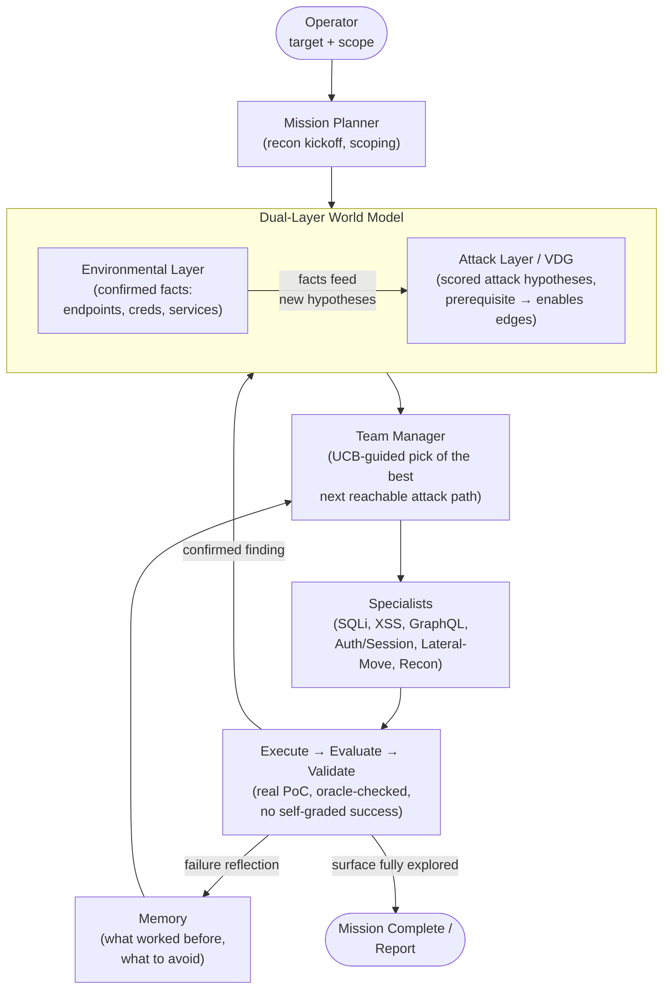

# RedGrid — High-Level Overview

**One-liner:** RedGrid is a four-layer autonomous **VAPT** (Vulnerability Assessment and Penetration Testing) framework built around a **VDG** (Vulnerability Dependency Graph) — it explores attack surfaces the way a human penetration tester does: track what's confirmed, track what attack ideas depend on what, and always attempt the next most promising *reachable* step.

---

## 1. How It Works (High-Level Flow)

**In plain terms:**
1. Tell it a target → it recons and builds a fact-base (Environmental Layer).
2. From those facts it grows a graph of *attack ideas*, each linked to what has to succeed first (Attack Layer / VDG).
3. It always picks the most promising *currently-reachable* idea using **UCB** (Upper Confidence Bound, a scoring rule that balances trying proven-good options against exploring untested ones) — not just the highest-scoring one in isolation — and hands it to the right specialist agent.
4. Every claimed win is independently re-verified via a **PoC** (Proof of Concept — an actual working exploit, not a self-reported claim); no agent grades its own work.
5. Wins and failures are remembered, so the next similar target benefits from what was learned.
6. It stops when there's nothing reachable left to try — not when it hits a timer.

**Why this is different:** most prior agents either explore broadly with no sense of prerequisites (they get stuck retrying dead ends), or reason carefully about dependencies but only on small, hand-curated problems. RedGrid does both at once, at open-ended scale.

---

## 2. Target Attack Surface

| Surface | What RedGrid attacks | Why included |
|---|---|---|
| **Web applications (HTTP/HTML)** | **SQLi** (SQL — Structured Query Language — Injection), **XSS** (Cross-Site Scripting), **CSRF** (Cross-Site Request Forgery), **SSRF** (Server-Side Request Forgery), **SSTI** (Server-Side Template Injection), **LFI** (Local File Inclusion), file-upload **RCE** (Remote Code Execution), **IDOR** (Insecure Direct Object Reference), auth bypass, **JWT** (JSON Web Token) forgery | Largest, best-benchmarked surface. HTTP = HyperText Transfer Protocol; HTML = HyperText Markup Language |
| **GraphQL APIs** | Schema abuse, producer→consumer chains, batched-auth bypass, IDOR, injection, **DoS** (Denial of Service) via nesting | Fast-growing, under-tested surface. **API** = Application Programming Interface. GraphQL = Graph Query Language |
| **Multi-host / AD (Active Directory) networks** | Lateral movement, credential reuse, privilege escalation | Tests coordination across hosts, not just one target |
| **Production system corpus (hard tier)** | Same web/app bugs, but on real, bounty-paying production software | Reality check beyond sandboxes |

**Explicitly out of scope:** general REST (Representational State Transfer) API fuzzing (no standard reusable benchmark exists for it yet), binary exploitation, physical/network-layer attacks, social engineering.

---

## 3. Vulnerability Classes Covered

- **Injection:** SQL (Structured Query Language) Injection (blind, UNION, hard/multi-turn), SSTI (Server-Side Template Injection), GraphQL argument injection
- **Client-side:** XSS (Cross-Site Scripting — reflected, stored, DOM [Document Object Model], webhook), CSRF (Cross-Site Request Forgery), XSS+CSRF chains
- **Access control:** Authorization bypass / IDOR (Insecure Direct Object Reference), auth bypass, brute force, JWT (JSON Web Token) forgery
- **Server-side:** SSRF (Server-Side Request Forgery), LFI (Local File Inclusion) / path traversal, file-upload RCE (Remote Code Execution)
- **Framework-specific RCEs:** ThinkPHP, Struts2, Spring/Fastjson, Jenkins
- **Network/AD (Active Directory):** lateral movement, credential theft, privilege escalation across hosts
- **API-specific:** batched-auth bypass, nested-query DoS (Denial of Service), schema-abuse (GraphQL)

---

## 4. Benchmark Plan

| Tier | Benchmark | Surface | Size | Role |
|---|---|---|---|---|
| 0 | Fang et al. 15-vuln sandbox | Web | 15 | Fast regression check |
| 0b | HPTSA (Hierarchical Planning and Task-Specific Agents) 14-CVE zero-day suite | Web | 14 | Zero-day mode check |
| 1 | PentestEval | Web | 12 scenarios / 346 tasks | Stage-level diagnosis, tuning |
| 2 | **CVE-Bench (primary)** | Web | 40 critical CVEs (CVE = Common Vulnerabilities and Exposures) | Headline pass@1 / pass@5 metric |
| 2b | XBOW, HackWorld, NYU CTF (Capture The Flag), Cybench | Web | ~180 | Cross-benchmark generalization |
| 3 | PrediQL | GraphQL | 6 APIs | Schema coverage & vuln count |
| 4 | Incalmo MHBench (Multi-Host Benchmark) | Multi-host | 40 environments | Compromise / credential-theft rate |
| 5 | BountyBench | Web (production) | 25 real systems | Hardest tier, real dollar value |
| 6 | PentestGPT set + HTB (Hack The Box) Season 8 | Web | 18 machines | Live-competition validation |

All benchmarks are existing, published suites — **no new benchmark is being built** for this project.

---

## 5. What We're Actually Claiming (3 things, kept deliberately narrow)

1. **Dependency-aware exploration (VDG — Vulnerability Dependency Graph)** beats flat exploration and beats "dependency filter bolted onto UCB (Upper Confidence Bound)" — tested via ablation.
2. **Cross-mission memory** with security-specific conditional strategies helps on previously-seen technologies.
3. **First evaluation of one architecture across three attack-surface families** (web, GraphQL, multi-host) with standardized, per-surface oracles.

Everything else (multi-agent orchestration, logging, tool count) is infrastructure, not a claimed contribution.

---

## 6. Acronym Glossary

| Acronym | Full Form |
|---|---|
| VAPT | Vulnerability Assessment and Penetration Testing |
| VDG | Vulnerability Dependency Graph |
| UCB | Upper Confidence Bound |
| PoC | Proof of Concept |
| SQLi | SQL (Structured Query Language) Injection |
| XSS | Cross-Site Scripting |
| CSRF | Cross-Site Request Forgery |
| SSRF | Server-Side Request Forgery |
| SSTI | Server-Side Template Injection |
| LFI | Local File Inclusion |
| RCE | Remote Code Execution |
| IDOR | Insecure Direct Object Reference |
| JWT | JSON Web Token |
| DoS | Denial of Service |
| CVE | Common Vulnerabilities and Exposures |
| CVSS | Common Vulnerability Scoring System |
| API | Application Programming Interface |
| DOM | Document Object Model |
| HTTP | HyperText Transfer Protocol |
| HTML | HyperText Markup Language |
| REST | Representational State Transfer |
| AD | Active Directory |
| HPTSA | Hierarchical Planning and Task-Specific Agents |
| MHBench | Multi-Host Benchmark |
| CTF | Capture The Flag |
| HTB | Hack The Box |
