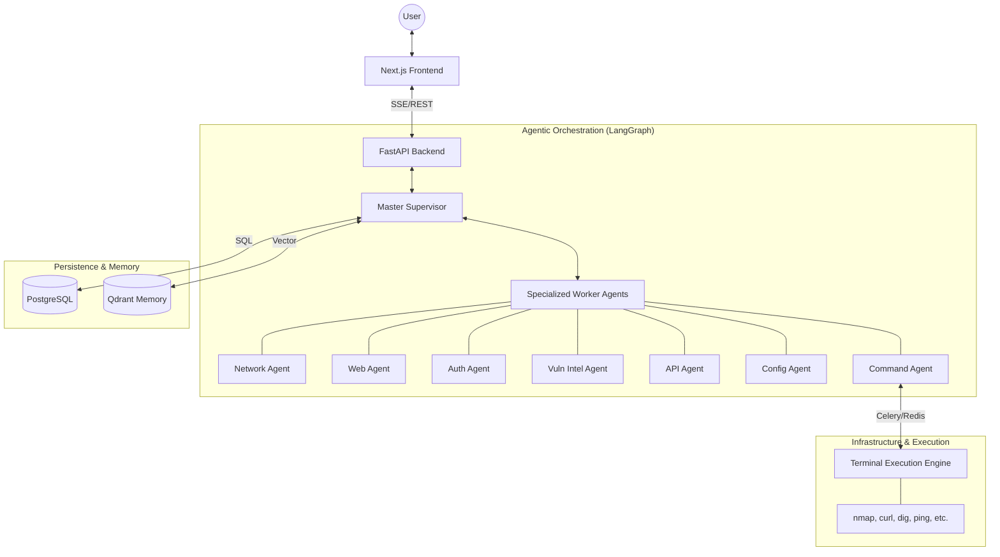
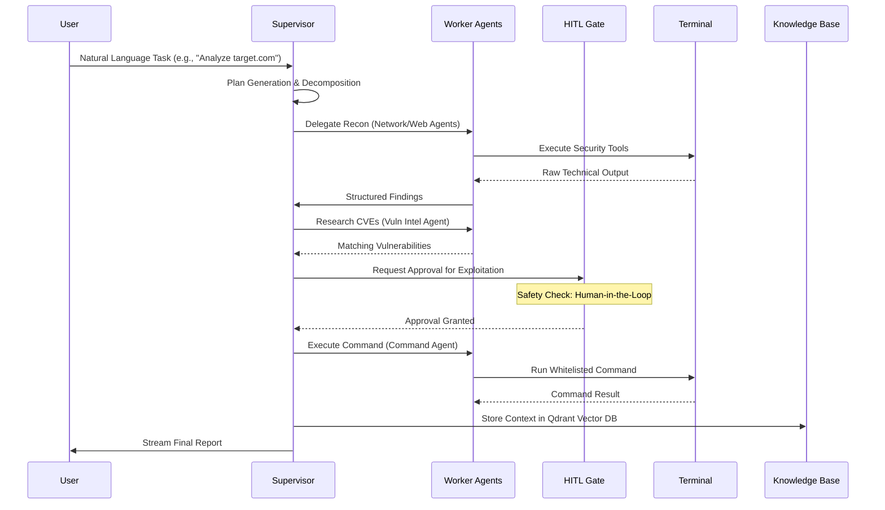

# CMatrix: LLM-Orchestrated Multi-Agent Framework for Autonomous VAPT

**Professional Masters in Information and Cyber Security**  
**CSE-400: Project on Cyber Security**

**Presented by:**
* Nishan Paul (Reg No: 55)
* Md Rakibur Rahman (Reg No: 49)

**Supervised by:**
**Dr. Md. Abdur Razzaque**
Chairman, Department of Computer Science and Engineering
University of Dhaka (CSEDU)

---

## 🚀 The Vision: Autonomous Red Teaming
> "Transforming static scanning into reasoning-driven security intelligence."

* **The Problem**: Traditional VAPT is manual, slow, and non-scalable. Existing AI tools are fragile and costly.
* **The Solution**: **CMatrix (LLMOrch-VAPT)** — A resilient, multi-agent orchestration framework designed for industrial-grade autonomous security assessments.
* **Core Philosophy**: An autonomous red team should be as resilient as the infrastructure it tests.

---

## 🛠️ Software Architecture
CMatrix utilizes a modular **Master-Worker** architecture powered by **LangGraph** for resilient state management.

### Technical Stack Details
*   **Orchestration Engine**: `LangGraph` implementation in `app-backend/app/agents/`
*   **API Framework**: `FastAPI` (Python 3.12+) serving real-time events.
*   **Real-time UI**: `Next.js 14+` with Tailwind CSS and SSE streaming.
*   **Background Tasks**: `Celery` workers for long-running security scans.
*   **Memory Tiers**: `PostgreSQL` (Relational State) and `Qdrant` (Semantic Vector Memory).

---

## 🤖 Specialized Worker Agents
Our system features seven domain-specific agents, each with a curated suite of technical tools.

| Agent | Responsibility | Core Tools |
| :--- | :--- | :--- |
| **Network** | Infrastructure Discovery | `nmap`, `dig`, `ping`, `whois` |
| **Web Security** | Web App Vulnerabilities | `curl`, `wget`, `nikto`, `sslscan` |
| **Auth** | Identity & Access | `hydra`, `medusa`, `bruteforce` |
| **Vuln Intel** | Threat Intelligence | `CVE-Search`, `NIST NVD API` |
| **API Security** | Endpoint Validation | `REST/GraphQL Fuzzers` |
| **Config** | Compliance & Hardening | `Cloud Config Checkers` |
| **Command** | Secure Execution | `Whitelisted Bash Environment` |

---

## 🔄 Real-World VAPT Workflow
The system follows a non-linear, adaptive workflow to ensure thorough security validation.

---

## 🔬 Core Methodology: Technical Innovations
Our framework introduces three key methodologies to solve the "Operational Fragility" of AI agents.

### 1. Autonomous Provider Failover (APF)
*   **Mechanism**: Decouples the reasoning graph from specific LLM providers (Gemini, GPT-4, DeepHat).
*   **Resilience**: Mid-workflow checkpointing ensures **zero state loss** during provider outages.
*   **Metric**: Mean Time To Recovery (**MTTR) < 2 seconds**.

### 2. Dynamic Complexity-Aware Tiering (DCAT)
*   **Mechanism**: Extracts "Complexity Signals" from security tasks using our **Security Reasoning Ontology**.
*   **Optimization**: Routes simple recon to "Flash" models and complex exploitation to "Reasoning" models.
*   **Impact**: **84.2% reduction in operational costs**.

---

## 🔬 Core Methodology: Technical Innovations (Contd.)

### 3. Security-Semantic Caching (SSC)
*   **Mechanism**: Stores "Reasoning Patterns" in a vector database (Qdrant) rather than raw text.
*   **Efficiency**: Identifies similar vulnerability patterns across heterogeneous hosts.
*   **Scalability**: Bypasses redundant LLM calls, improving response speed by **3.5x**.

### 4. Human-in-the-Loop (HITL) Governance
*   **Mechanism**: Stateful graph-based approval gates.
*   **Safety**: No destructive security actions (e.g., exploitation) are performed without explicit human authorization.
*   **Auditability**: Every agent thought and command is recorded in a tamper-proof JSON-B log.

---

## 💾 Persistent Memory & Context
Making the system "smarter" over the course of an engagement.

*   **Stateful Checkpointing**: Allows the system to pause/resume engagements without losing reasoning progress.
*   **Knowledge Base**: Qdrant-powered long-term memory of past scan results and findings.
*   **Contextual Retrieval**: Agents recall past discoveries (e.g., "Recall the open ports found on 192.168.1.100 earlier") to build complex attack chains.

---

## 🎯 Research Scope: LLMOrch-VAPT
Our research (documented in the `LLMOrch-VAPT` framework) focuses on solving the transition from academic prototypes to industrial-grade security agents.

### Primary Research Objectives:
1.  **Operational Resilience**: Can provider-agnostic failover (**APF**) maintain state during unplanned outages?
2.  **Economic Sustainability**: How effectively can **DCAT** optimize the cost-reasoning tradeoff?
3.  **Scalability**: What is the performance impact of **SSC** on large-scale, redundant network assessments?
4.  **Safety & Governance**: Proving that stateful graph orchestration with **HITL gates** can effectively mitigate the risk of unintended destructive actions.

---

## 🚀 Future Roadmap: Phase 3 & Beyond
Scaling CMatrix for enterprise-grade continuous security.

*   **Intelligence**: AI-driven vulnerability prioritization and automated remediation scripts.
*   **Collaboration**: Multi-tenancy and Role-Based Access Control (RBAC) for security teams.
*   **Compliance**: Automated SOC2, ISO 27001, and HIPAA reporting modules.
*   **Scale**: Cloud-native agent deployment for massive infrastructure scanning.

---

## ✨ The CMatrix Advantage
**A force multiplier for security teams, combining autonomous reasoning with industrial-grade resilience.**

*   🚀 **Resilient**: Never loses state, even if LLM providers fail.
*   💰 **Cost-Effective**: Smart model routing via DCAT ontology.
*   🛡️ **Safe**: Controlled by Human-in-the-Loop whitelisted execution.
*   🧠 **Intelligent**: Powered by the **DeepHat** reasoning engine and persistent vector memory.

---

**Built by Nishan Paul & Md Rakibur Rahman**
*Project URL: cmatrix.kaiofficial.xyz*
