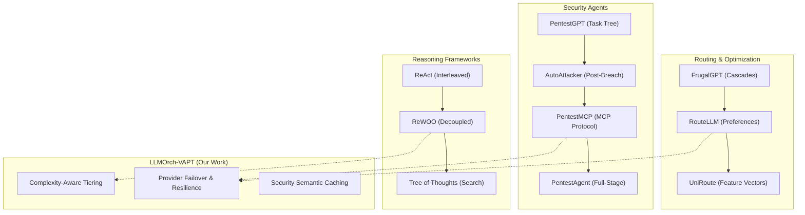

# [STEP 2c] — Related Work Map

## Summary
Synthesized the research findings from Step 2a and 2b into a unified taxonomy for the LLMOrch-VAPT paper. Categorized 15+ papers into four logical clusters: (1) LLM Routing & Cost Optimization, (2) Autonomous Security Agents, (3) Stateful Reasoning Frameworks, and (4) Operational Resilience. Identified a critical "Operational Resilience" gap where LLMOrch-VAPT will position its primary contribution.

## Full Output

### 1. Research Taxonomy
The literature is mapped into the following four technical clusters:

#### Cluster A: LLM Routing & Cost Optimization
*Focus: Selecting the right model for the right task to minimize cost/latency.*
- **Key Papers**: FrugalGPT (2023), RouteLLM (2024), UniRoute (2025), RouterEval (2025), Arch-Router (2024).
- **Evolution**: Simple sequential cascades → Learned preference-based classifiers → Dynamic routing for unobserved models.

#### Cluster B: Autonomous Security Agents & VAPT
*Focus: Applying LLMs to vulnerability assessment and penetration testing.*
- **Key Papers**: PentestGPT (2024), AutoAttacker (2024), PentestMCP (2025), PentestAgent (2025), CurriculumPT (2025).
- **Evolution**: Human-in-the-loop assistants → Stage-specific automation → Fully autonomous multi-agent systems with task graphs.

#### Cluster C: Stateful Reasoning & Orchestration
*Focus: Managing complex, multi-step agentic workflows and tool-use.*
- **Key Papers**: ReWOO (2023), Tree of Thoughts (2023), WorkflowLLM (2025), ReAct (2022).
- **Evolution**: Linear chain-of-thought → Decoupled planning/execution → Massive workflow scaling.

#### Cluster D: Operational Resilience & Infrastructure
*Focus: System-level reliability, failover, and provider-agnosticism.*
- **Current State**: largely ignored in current agentic security literature.
- **LLMOrch-VAPT Position**: This is our primary contribution area. We bridge Cluster A (Routing) and Cluster B (Security) with an infrastructure-first approach to resilience.

### 2. Paper Clustering (Visual Map)

### 3. Technical Evolution Narrative
1.  **Phase 1 (2022-2023)**: Discovery of agentic potential (ReAct, PentestGPT). Systems were fragile and required heavy human guidance.
2.  **Phase 2 (2023-2024)**: Optimization of cost and reasoning (FrugalGPT, ReWOO). Focus shifted to making agents efficient and decoupling planning from execution.
3.  **Phase 3 (2024-2025)**: Scaling and Standardizing (PentestMCP, WorkflowLLM). Emphasis on multi-agent coordination and tool-use protocols.
4.  **Current Phase (Late 2025)**: The **Operationalization** phase. Focus on making these autonomous systems production-ready with resilience, failover, and complex cost-reasoning tiering (LLMOrch-VAPT).

### 4. Identified Research Gap
Existing SOTA (PentestMCP, PentestAgent) focuses almost exclusively on **Attack Intelligence**. There is a void in research regarding the **Infrastructure of Security Agents**:
- How to maintain a 99.9% uptime for autonomous red teams.
- How to dynamically route security sub-tasks to local vs. cloud providers based on data sensitivity and task complexity.
- How to apply semantic caching to redundant security scans to save 80% on repeated recon tasks.

### 5. Roadmap for Related Work Section
- **Introduction**: Briefly define the "Agentic Security" landscape.
- **Section A**: Detail LLM Routing (FrugalGPT/RouteLLM) and its lack of security-domain awareness.
- **Section B**: Detail VAPT Agents (PentestGPT/PentestMCP) and their lack of operational resilience.
- **Section C**: Detail Reasoning Frameworks (ReWOO/ToT) and how LLMOrch-VAPT synthesizes these into its master-worker hierarchy.
- **Synthesis**: Explicitly state the "Operational Infrastructure Gap" that this paper fills.

## Key Decisions Made
- Confirmed the use of a "Cluster-based" taxonomy for the Related Work section.
- Decided to highlight **Semantic Caching** as a key technical innovation in Cluster D.
- Established a clear "Evolutionary Narrative" to provide historical context in the paper's introduction.

## Open Questions
- Should we include "Prompt Injection Protection" as a related work cluster, or keep it focused on orchestration? (Decided: Keep it focused on orchestration for now).

## Checklist Results
- [PASS] Literature (Step 2a) and SOTA (Step 2b) used as input
- [PASS] Research taxonomy created with at least 3 logical clusters
- [PASS] All papers from 2a and 2b are categorized
- [PASS] Technical evolution narrative is written
- [PASS] Research gap is explicitly stated relative to the map
- [PASS] Roadmap for the Related Work section is provided
- [PASS] Artifact saved as `artifacts/step-2c-related-work-map.md`

## Input for Next Step
Synthesis of the research map (Step 2c) into the "Core Contributions" and "Technical Novelty" (Step 3a). This will define the "Selling Point" of the paper.
